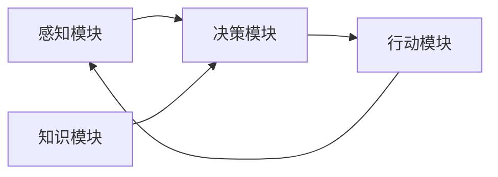

# AI Agent在智能广告投放中的应用

> 关键词：AI Agent、智能广告投放、机器学习、广告策略、用户画像、精准营销、数据分析

> 摘要：本文深入探讨了AI Agent在智能广告投放中的应用。首先介绍了相关背景知识，包括目的范围、预期读者等内容。接着阐述了AI Agent和智能广告投放的核心概念与联系，分析其原理和架构。详细讲解了核心算法原理及具体操作步骤，并给出数学模型和公式进行说明。通过项目实战案例展示了如何在实际中运用相关技术，同时分析了其实际应用场景。还推荐了一系列学习资源、开发工具框架以及相关论文著作。最后总结了未来发展趋势与挑战，并对常见问题进行了解答，提供了扩展阅读和参考资料，旨在全面呈现AI Agent在智能广告投放领域的技术全貌和应用价值。

## 1. 背景介绍 
### 1.1 目的和范围
在当今数字化的时代，广告投放面临着越来越多的挑战和机遇。传统的广告投放方式往往缺乏精准性，导致广告资源的浪费和效果的不佳。智能广告投放旨在利用先进的技术手段，提高广告投放的精准度和效果，从而实现广告主的营销目标。

本文的目的在于深入探讨AI Agent在智能广告投放中的应用，包括其原理、算法、实际案例以及未来发展趋势等方面。范围涵盖了AI Agent的基本概念、智能广告投放的流程和策略，以及两者结合所产生的创新应用和价值。

### 1.2 预期读者
本文预期读者包括广告行业从业者，如广告策划师、广告投放专员等，他们可以通过本文了解如何利用AI Agent提升广告投放效果；计算机领域的技术人员，如程序员、数据分析师等，他们可以从中获取相关技术原理和实现方法；以及对智能广告投放和AI技术感兴趣的研究人员和学者，为他们的研究提供参考和思路。

### 1.3 文档结构概述
本文将按照以下结构进行阐述：首先介绍相关背景知识，包括目的、预期读者和文档结构概述等；接着详细讲解AI Agent和智能广告投放的核心概念与联系，包括原理和架构；然后深入探讨核心算法原理及具体操作步骤，并给出数学模型和公式；通过项目实战案例展示如何在实际中运用相关技术；分析AI Agent在智能广告投放中的实际应用场景；推荐学习资源、开发工具框架以及相关论文著作；最后总结未来发展趋势与挑战，解答常见问题，并提供扩展阅读和参考资料。

### 1.4 术语表
#### 1.4.1 核心术语定义
- **AI Agent（人工智能代理）**：是一种能够感知环境、自主决策并采取行动以实现特定目标的智能实体。它可以根据环境的变化动态调整自己的行为，具有一定的自主性和适应性。
- **智能广告投放**：利用人工智能、机器学习等技术，对广告投放过程进行优化和管理，以提高广告的精准度、效果和效率。
- **用户画像**：是根据用户的行为、偏好、特征等数据构建的用户模型，用于描述用户的个体特征和行为模式，为广告投放提供精准的目标定位。
- **精准营销**：通过对用户数据的分析和挖掘，将广告精准地推送给目标用户，提高广告的转化率和效果。

#### 1.4.2 相关概念解释
- **机器学习**：是一门多领域交叉学科，涉及概率论、统计学、逼近论、凸分析、算法复杂度理论等多门学科。它专门研究计算机怎样模拟或实现人类的学习行为，以获取新的知识或技能，重新组织已有的知识结构使之不断改善自身的性能。
- **深度学习**：是机器学习的一个分支领域，它是一种基于对数据进行表征学习的方法。深度学习通过构建具有很多层的神经网络模型，自动从数据中学习特征和模式，从而实现对数据的分类、预测等任务。

#### 1.4.3 缩略词列表
- **AI**：Artificial Intelligence（人工智能）
- **ML**：Machine Learning（机器学习）
- **DL**：Deep Learning（深度学习）
- **CTR**：Click - Through Rate（点击率）
- **CPA**：Cost Per Action（每次行动成本）

## 2. 核心概念与联系 
### 2.1 AI Agent的原理和架构
AI Agent的基本原理是基于感知、决策和行动的循环过程。它通过传感器感知环境信息，然后根据内部的知识和算法进行决策，最后通过执行器采取相应的行动。

AI Agent的架构可以分为以下几个部分：
- **感知模块**：负责收集环境信息，如用户的行为数据、市场信息等。
- **决策模块**：根据感知到的信息和内部的知识，运用决策算法进行决策，确定最佳的行动方案。
- **行动模块**：根据决策结果，采取相应的行动，如投放广告、调整广告策略等。
- **知识模块**：存储AI Agent的内部知识，包括规则、模型、经验等，为决策提供支持。

以下是AI Agent架构的Mermaid流程图：


### 2.2 智能广告投放的原理和架构
智能广告投放的原理是通过对用户数据的分析和挖掘，了解用户的需求和偏好，然后将合适的广告推送给合适的用户，以提高广告的效果和转化率。

智能广告投放的架构可以分为以下几个部分：
- **数据采集层**：负责收集用户的行为数据、广告数据、市场数据等。
- **数据处理层**：对采集到的数据进行清洗、转换、分析等处理，提取有价值的信息。
- **模型训练层**：利用机器学习、深度学习等算法，根据处理后的数据训练广告投放模型。
- **广告投放层**：根据训练好的模型，将广告投放给目标用户，并实时监测广告效果。
- **优化调整层**：根据广告效果的反馈，对广告投放策略和模型进行优化调整。

以下是智能广告投放架构的Mermaid流程图：


### 2.3 AI Agent与智能广告投放的联系
AI Agent可以在智能广告投放中发挥重要作用。它可以作为智能广告投放系统的决策核心，根据用户的实时数据和市场变化，动态调整广告投放策略。AI Agent的感知模块可以实时收集用户的行为数据和市场信息，决策模块根据这些信息和内部的广告投放模型进行决策，行动模块则根据决策结果进行广告投放和调整。同时，AI Agent的知识模块可以不断学习和积累广告投放的经验和知识，提高广告投放的效果和效率。

## 3. 核心算法原理 & 具体操作步骤 
### 3.1 核心算法原理
在智能广告投放中，常用的核心算法包括机器学习算法和深度学习算法。以下以点击率预测为例，介绍基于逻辑回归的机器学习算法原理。

逻辑回归是一种用于分类的机器学习算法，它通过对输入特征进行线性组合，然后通过逻辑函数将线性组合的结果映射到0到1之间的概率值。在点击率预测中，输入特征可以包括用户的年龄、性别、兴趣爱好、广告的内容、展示位置等，输出结果是用户点击广告的概率。

逻辑回归的数学模型可以表示为：
$$P(y = 1|x) = \frac{1}{1 + e^{-z}}$$
其中，$P(y = 1|x)$ 表示在输入特征 $x$ 下，用户点击广告（$y = 1$）的概率，$z$ 是输入特征的线性组合：
$$z = \theta_0 + \theta_1x_1 + \theta_2x_2 + \cdots + \theta_nx_n$$
$\theta_0, \theta_1, \cdots, \theta_n$ 是模型的参数。

### 3.2 具体操作步骤
以下是基于Python实现逻辑回归进行点击率预测的具体操作步骤：

#### 3.2.1 数据准备
首先，需要准备训练数据和测试数据。训练数据包括输入特征和对应的标签（是否点击广告），测试数据用于评估模型的性能。

```python
import pandas as pd
from sklearn.model_selection import train_test_split

# 读取数据
data = pd.read_csv('advertising_data.csv')

# 分离输入特征和标签
X = data.drop('clicked', axis=1)
y = data['clicked']

# 划分训练集和测试集
X_train, X_test, y_train, y_test = train_test_split(X, y, test_size=0.2, random_state=42)
```

#### 3.2.2 模型训练
使用逻辑回归模型对训练数据进行训练。

```python
from sklearn.linear_model import LogisticRegression

# 创建逻辑回归模型
model = LogisticRegression()

# 训练模型
model.fit(X_train, y_train)
```

#### 3.2.3 模型预测
使用训练好的模型对测试数据进行预测。

```python
# 预测
y_pred = model.predict(X_test)
```

#### 3.2.4 模型评估
使用评估指标（如准确率、召回率、F1值等）对模型的性能进行评估。

```python
from sklearn.metrics import accuracy_score, recall_score, f1_score

# 计算准确率
accuracy = accuracy_score(y_test, y_pred)

# 计算召回率
recall = recall_score(y_test, y_pred)

# 计算F1值
f1 = f1_score(y_test, y_pred)

print(f'Accuracy: {accuracy}')
print(f'Recall: {recall}')
print(f'F1 Score: {f1}')
```

## 4. 数学模型和公式 & 详细讲解 & 举例说明 
### 4.1 点击率预测的数学模型
在点击率预测中，除了逻辑回归模型，还可以使用其他模型，如神经网络模型。以简单的两层神经网络为例，其数学模型可以表示为：

输入层到隐藏层的计算：
$$z_j = \sum_{i = 0}^{n} w_{ij}x_i + b_j$$
$$a_j = f(z_j)$$
其中，$z_j$ 是隐藏层第 $j$ 个神经元的输入，$w_{ij}$ 是输入层第 $i$ 个神经元到隐藏层第 $j$ 个神经元的权重，$x_i$ 是输入层第 $i$ 个神经元的输入，$b_j$ 是隐藏层第 $j$ 个神经元的偏置，$a_j$ 是隐藏层第 $j$ 个神经元的输出，$f$ 是激活函数（如Sigmoid函数、ReLU函数等）。

隐藏层到输出层的计算：
$$z_k = \sum_{j = 0}^{m} v_{jk}a_j + c_k$$
$$P(y = 1|x) = g(z_k)$$
其中，$z_k$ 是输出层第 $k$ 个神经元的输入，$v_{jk}$ 是隐藏层第 $j$ 个神经元到输出层第 $k$ 个神经元的权重，$c_k$ 是输出层第 $k$ 个神经元的偏置，$g$ 是激活函数（如Sigmoid函数），$P(y = 1|x)$ 是用户点击广告的概率。

### 4.2 损失函数和优化算法
为了训练神经网络模型，需要定义损失函数来衡量模型预测结果与真实标签之间的差异。常用的损失函数是交叉熵损失函数：
$$L(y, \hat{y}) = - \frac{1}{N} \sum_{i = 1}^{N} [y_i \log(\hat{y}_i) + (1 - y_i) \log(1 - \hat{y}_i)]$$
其中，$y_i$ 是第 $i$ 个样本的真实标签，$\hat{y}_i$ 是第 $i$ 个样本的预测概率，$N$ 是样本数量。

为了最小化损失函数，需要使用优化算法，如随机梯度下降（SGD）算法。随机梯度下降算法的更新公式为：
$$\theta_{t + 1} = \theta_t - \alpha \frac{\partial L}{\partial \theta_t}$$
其中，$\theta_t$ 是第 $t$ 次迭代的参数，$\alpha$ 是学习率，$\frac{\partial L}{\partial \theta_t}$ 是损失函数对参数的梯度。

### 4.3 举例说明
假设我们有一个简单的点击率预测问题，输入特征包括用户的年龄和广告的价格，真实标签是用户是否点击广告。我们可以使用上述的神经网络模型进行训练和预测。

以下是一个简单的Python代码示例：

```python
import numpy as np

# 定义Sigmoid激活函数
def sigmoid(x):
    return 1 / (1 + np.exp(-x))

# 定义交叉熵损失函数
def cross_entropy_loss(y_true, y_pred):
    return -np.mean(y_true * np.log(y_pred) + (1 - y_true) * np.log(1 - y_pred))

# 定义神经网络模型
class NeuralNetwork:
    def __init__(self, input_size, hidden_size, output_size):
        self.input_size = input_size
        self.hidden_size = hidden_size
        self.output_size = output_size
        
        # 初始化权重和偏置
        self.W1 = np.random.randn(self.input_size, self.hidden_size)
        self.b1 = np.zeros((1, self.hidden_size))
        self.W2 = np.random.randn(self.hidden_size, self.output_size)
        self.b2 = np.zeros((1, self.output_size))
        
    def forward(self, X):
        # 前向传播
        self.z1 = np.dot(X, self.W1) + self.b1
        self.a1 = sigmoid(self.z1)
        self.z2 = np.dot(self.a1, self.W2) + self.b2
        self.a2 = sigmoid(self.z2)
        return self.a2
    
    def backward(self, X, y, y_pred, learning_rate):
        # 反向传播
        m = X.shape[0]
        
        # 计算输出层的梯度
        dZ2 = y_pred - y
        dW2 = np.dot(self.a1.T, dZ2) / m
        db2 = np.sum(dZ2, axis=0, keepdims=True) / m
        
        # 计算隐藏层的梯度
        dZ1 = np.dot(dZ2, self.W2.T) * self.a1 * (1 - self.a1)
        dW1 = np.dot(X.T, dZ1) / m
        db1 = np.sum(dZ1, axis=0, keepdims=True) / m
        
        # 更新权重和偏置
        self.W2 -= learning_rate * dW2
        self.b2 -= learning_rate * db2
        self.W1 -= learning_rate * dW1
        self.b1 -= learning_rate * db1
        
    def train(self, X, y, learning_rate, epochs):
        for epoch in range(epochs):
            # 前向传播
            y_pred = self.forward(X)
            
            # 计算损失
            loss = cross_entropy_loss(y, y_pred)
            
            # 反向传播
            self.backward(X, y, y_pred, learning_rate)
            
            if epoch % 100 == 0:
                print(f'Epoch {epoch}: Loss = {loss}')

# 生成示例数据
X = np.array([[20, 100], [30, 200], [40, 300], [50, 400]])
y = np.array([[0], [1], [1], [0]])

# 创建神经网络模型
model = NeuralNetwork(input_size=2, hidden_size=3, output_size=1)

# 训练模型
model.train(X, y, learning_rate=0.1, epochs=1000)
```

## 5. 项目实战：代码实际案例和详细解释说明 
### 5.1  开发环境搭建
为了实现智能广告投放的项目，需要搭建相应的开发环境。以下是具体的步骤：

#### 5.1.1 安装Python
Python是一种广泛使用的编程语言，许多机器学习和数据分析库都基于Python开发。可以从Python官方网站（https://www.python.org/downloads/） 下载并安装Python。

#### 5.1.2 安装必要的库
在智能广告投放项目中，需要使用一些常用的库，如pandas、numpy、scikit - learn、tensorflow等。可以使用pip命令进行安装：
```bash
pip install pandas numpy scikit-learn tensorflow
```

#### 5.1.3 选择开发工具
可以选择使用Jupyter Notebook、PyCharm等开发工具进行代码的编写和调试。Jupyter Notebook适合进行交互式开发和数据分析，PyCharm适合进行大规模项目的开发和管理。

### 5.2  源代码详细实现和代码解读
以下是一个基于Python实现的智能广告投放项目的源代码示例，包括数据处理、模型训练、广告投放模拟等功能。

```python
import pandas as pd
import numpy as np
from sklearn.model_selection import train_test_split
from sklearn.linear_model import LogisticRegression
from sklearn.metrics import accuracy_score

# 数据处理类
class DataProcessor:
    def __init__(self, data_path):
        self.data_path = data_path
        
    def load_data(self):
        # 读取数据
        data = pd.read_csv(self.data_path)
        return data
    
    def preprocess_data(self, data):
        # 分离输入特征和标签
        X = data.drop('