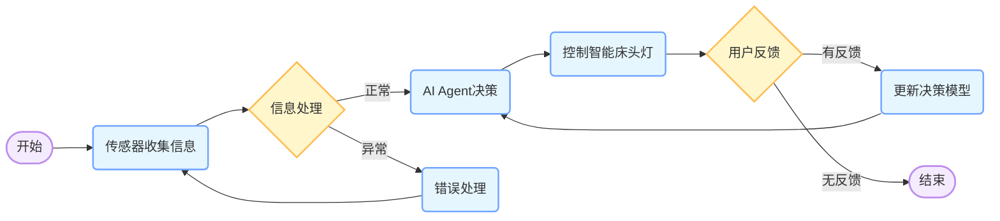

# AI Agent在智能床头灯中的生理节律调节

> 关键词：AI Agent、智能床头灯、生理节律调节、光照控制、健康照明

> 摘要：本文聚焦于AI Agent在智能床头灯中的生理节律调节应用。通过详细阐述AI Agent和生理节律的核心概念及联系，深入剖析相关核心算法原理与操作步骤，运用数学模型和公式进行理论支撑，并结合实际项目案例展示其实现过程。探讨了该技术在实际场景中的应用，推荐了相关学习资源、开发工具和论文著作。最后对其未来发展趋势与挑战进行总结，旨在为智能照明领域的发展提供全面且深入的技术参考。

## 1. 背景介绍 
### 1.1 目的和范围
随着人们对健康生活的关注度不断提高，睡眠质量成为备受关注的话题。生理节律对睡眠质量有着至关重要的影响，而光照是调节生理节律的关键因素之一。智能床头灯作为人们睡眠环境中的重要照明设备，具备了调节光照的功能。本文章的目的在于探讨如何利用AI Agent技术，使智能床头灯能够更精准地调节光照，从而实现对人体生理节律的有效调节。文章将涵盖AI Agent的基本原理、在智能床头灯中的应用架构、相关算法实现、实际案例分析以及未来发展趋势等方面。

### 1.2 预期读者
本文预期读者包括从事智能照明、人工智能、健康科技等领域的技术人员、研究人员和开发者，以及对智能健康生活感兴趣的普通读者。对于技术人员和开发者，文章提供了详细的技术原理和实现步骤，有助于他们在实际项目中应用相关技术；对于研究人员，文章提供了丰富的理论和实践案例，可作为研究参考；对于普通读者，文章以通俗易懂的方式介绍了相关概念和应用，能让他们了解智能床头灯在调节生理节律方面的作用。

### 1.3 文档结构概述
本文将按照以下结构进行组织：首先介绍核心概念与联系，明确AI Agent和生理节律的基本原理以及它们之间的关系；接着详细阐述核心算法原理和具体操作步骤，通过Python代码进行说明；然后介绍相关的数学模型和公式，并举例说明其应用；之后通过项目实战展示代码实际案例和详细解释；再探讨实际应用场景；推荐相关的工具和资源；最后对未来发展趋势与挑战进行总结，并提供常见问题解答和扩展阅读参考资料。

### 1.4 术语表
#### 1.4.1 核心术语定义
- **AI Agent**：人工智能代理，是一种能够感知环境、进行决策并采取行动以实现特定目标的软件实体。在本文中，AI Agent用于感知用户的生理状态和环境信息，决策并控制智能床头灯的光照参数。
- **生理节律**：又称生物钟，是生物体随时间作周期变化的生理现象，如睡眠 - 觉醒周期、体温节律等。光照是影响生理节律的重要外部因素之一。
- **智能床头灯**：具备智能控制功能的床头照明设备，能够根据用户需求或环境条件调节光照的亮度、颜色、色温等参数。

#### 1.4.2 相关概念解释
- **光照调节**：通过改变光照的强度、颜色和色温等参数，模拟不同的自然光照环境，以影响人体的生理节律。例如，早晨使用高色温、高亮度的光照可以唤醒人体，晚上使用低色温、低亮度的光照有助于放松和入睡。
- **睡眠 - 觉醒周期**：人体在一天内的睡眠和清醒状态的周期性变化。正常的睡眠 - 觉醒周期对于维持身体健康和良好的睡眠质量至关重要。

#### 1.4.3 缩略词列表
- **AI**：Artificial Intelligence，人工智能
- **LED**：Light - Emitting Diode，发光二极管

## 2. 核心概念与联系 
### 核心概念原理
#### AI Agent原理
AI Agent通常由感知模块、决策模块和执行模块组成。感知模块用于收集环境信息和用户状态信息，例如通过传感器获取当前的光照强度、用户的睡眠状态等。决策模块根据感知到的信息，运用预设的规则或机器学习算法进行决策，确定智能床头灯应采取的光照调节策略。执行模块则将决策结果转化为实际的控制信号，控制智能床头灯的光照参数。

#### 生理节律原理
生理节律是由人体内部的生物钟控制的，生物钟位于下丘脑的视交叉上核（SCN）。光照是调节生物钟的重要外部信号，视网膜中的特殊感光细胞能够感知光照的强度、颜色和时长，并将这些信息传递给SCN。SCN根据光照信息调整生物钟的节律，进而影响人体的睡眠 - 觉醒周期、激素分泌等生理过程。

### 架构的文本示意图
AI Agent在智能床头灯中的应用架构主要包括以下几个部分：
- **传感器层**：包括光照传感器、人体红外传感器、心率传感器等，用于收集环境信息和用户的生理状态信息。
- **AI Agent层**：接收传感器层的数据，进行数据分析和决策。该层可以分为感知模块、决策模块和执行模块。
- **智能床头灯控制层**：根据AI Agent的决策结果，控制智能床头灯的光照参数，如亮度、颜色、色温等。
- **用户交互层**：用户可以通过手机APP、语音控制等方式与智能床头灯进行交互，设置个性化的光照调节策略。

### Mermaid流程图


## 3. 核心算法原理 & 具体操作步骤 
### 核心算法原理
#### 光照调节算法
光照调节算法的核心目标是根据用户的生理节律和环境信息，动态调整智能床头灯的光照参数。一种常见的方法是基于时间的光照调节策略，即根据一天中的不同时间段，设置不同的光照强度和色温。例如，在早晨（6:00 - 8:00），使用高色温（5000 - 6500K）、高亮度的光照，模拟自然光的唤醒效果；在晚上（20:00 - 22:00），逐渐降低光照强度和色温（2700 - 3000K），帮助用户放松和入睡。

#### 机器学习算法
为了实现更个性化的光照调节，还可以使用机器学习算法。例如，使用深度学习算法对用户的睡眠数据进行分析，建立用户的睡眠模型。根据睡眠模型，预测用户的睡眠状态和生理节律，从而更精准地调整光照参数。

### 具体操作步骤
#### 步骤1：数据收集
使用传感器收集环境信息和用户的生理状态信息，包括光照强度、温度、湿度、用户的心率、睡眠状态等。

#### 步骤2：数据预处理
对收集到的数据进行清洗、归一化等预处理操作，去除噪声和异常值，将数据转换为适合算法处理的格式。

#### 步骤3：决策制定
根据预处理后的数据，使用光照调节算法或机器学习算法进行决策，确定智能床头灯应采取的光照调节策略。

#### 步骤4：控制执行
将决策结果转化为实际的控制信号，通过通信接口发送给智能床头灯，控制其光照参数。

#### 步骤5：反馈更新
收集用户的反馈信息，如用户对光照效果的评价，根据反馈信息更新决策模型，提高光照调节的准确性和个性化程度。

### Python源代码实现
```python
import time

# 模拟传感器数据收集
def collect_sensor_data():
    # 这里简单模拟光照强度和时间数据
    current_time = time.localtime()
    hour = current_time.tm_hour
    if 6 <= hour < 8:
        light_intensity = 80  # 高亮度
        color_temperature = 5500  # 高色温
    elif 20 <= hour < 22:
        light_intensity = 20  # 低亮度
        color_temperature = 2800  # 低色温
    else:
        light_intensity = 50  # 中等亮度
        color_temperature = 4000  # 中等色温
    return light_intensity, color_temperature

# 模拟智能床头灯控制
def control_bedside_lamp(light_intensity, color_temperature):
    print(f"调整床头灯亮度为 {light_intensity}%，色温为 {color_temperature}K")

# 主循环
while True:
    light_intensity, color_temperature = collect_sensor_data()
    control_bedside_lamp(light_intensity, color_temperature)
    time.sleep(3600)  # 每小时更新一次光照参数
```

## 4. 数学模型和公式 & 详细讲解 & 举例说明 
### 光照强度与生理节律的关系
光照强度对人体生理节律的影响可以用以下数学模型来描述：
$$S(t) = \int_{0}^{t} I(\tau) \cdot f(\tau) d\tau$$
其中，$S(t)$ 表示在时间 $t$ 时人体生理节律的状态，$I(\tau)$ 表示在时间 $\tau$ 时的光照强度，$f(\tau)$ 表示光照强度对生理节律的影响函数。

### 光照颜色与生理节律的关系
光照颜色（通常用色温表示）对人体生理节律的影响可以用以下公式来描述：
$$C(t) = \int_{0}^{t} T(\tau) \cdot g(\tau) d\tau$$
其中，$C(t)$ 表示在时间 $t$ 时人体生理节律受光照颜色的影响程度，$T(\tau)$ 表示在时间 $\tau$ 时的光照色温，$g(\tau)$ 表示光照色温对生理节律的影响函数。

### 举例说明
假设在早晨6:00 - 8:00，光照强度 $I(t)$ 从 20lux 线性增加到 100lux，光照色温 $T(t)$ 从 3000K 线性增加到 5500K。我们可以通过上述公式计算在这段时间内光照对人体生理节律的影响。

首先，计算光照强度对生理节律的影响：
设 $I(t) = 20 + \frac{100 - 20}{2 \times 3600} \cdot (t - 6 \times 3600)$，其中 $t$ 的单位是秒，范围是从 $6 \times 3600$ 到 $8 \times 3600$。
假设 $f(\tau)$ 是一个简单的线性函数 $f(\tau) = 0.01$，则：
$$S(8 \times 3600) - S(6 \times 3600) = \int_{6 \times 3600}^{8 \times 3600} \left(20 + \frac{100 - 20}{2 \times 3600} \cdot (t - 6 \times 3600)\right) \cdot 0.01 dt$$
通过积分计算可得：
\[
\begin{align*}
&\int_{6 \times 3600}^{8 \times 3600} \left(20 + \frac{100 - 20}{2 \times 3600} \cdot (t - 6 \times 3600)\right) \cdot 0.01 dt\\
=& 0.01 \int_{6 \times 3600}^{8 \times 3600} \left(20 + \frac{1}{90} \cdot (t - 21600)\right) dt\\
=& 0.01 \left[20t+\frac{1}{90}\times\frac{1}{2}(t - 21600)^2\right]_{6 \times 3600}^{8 \times 3600}\\
=& 0.01 \left[(20\times8\times3600+\frac{1}{180}(8\times3600 - 21600)^2)-(20\times6\times3600+\frac{1}{180}(6\times3600 - 21600)^2)\right]\\
=& 0.01 \left[(576000+\frac{1}{180}\times(28800 - 21600)^2)-(432000+\frac{1}{180}\times(21600 - 21600)^2)\right]\\
=& 0.01 \left[(576000+\frac{1}{180}\times7200^2)-432000\right]\\
=& 0.01 \left[(576000 + 288000)-432000\right]\\
=& 0.01\times432000\\
=& 4320
\end{align*}
\]

同理，计算光照颜色对生理节律的影响：
设 $T(t) = 3000 + \frac{5500 - 3000}{2 \times 3600} \cdot (t - 6 \times 3600)$，假设 $g(\tau) = 0.001$，则：
$$C(8 \times 3600) - C(6 \times 3600) = \int_{6 \times 3600}^{8 \times 3600} \left(3000 + \frac{5500 - 3000}{2 \times 3600} \cdot (t - 6 \times 3600)\right) \cdot 0.001 dt$$
通过积分计算可得具体结果，这里省略计算过程。

## 5. 项目实战：代码实际案例和详细解释说明 
### 5.1  开发环境搭建
#### 硬件环境
- **智能床头灯**：选择支持智能控制的LED床头灯，具备调节亮度、颜色和色温的功能。
- **传感器模块**：包括光照传感器、人体红外传感器、心率传感器等，用于收集环境信息和用户的生理状态信息。
- **开发板**：如Raspberry Pi，作为AI Agent的运行平台，负责数据处理和决策制定。

#### 软件环境
- **操作系统**：在Raspberry Pi上安装Raspbian操作系统。
- **编程语言**：使用Python进行开发，Python具有丰富的库和工具，便于实现算法和控制硬件。
- **开发工具**：使用Thonny或PyCharm等集成开发环境（IDE）进行代码编写和调试。

### 5.2  源代码详细实现和代码解读
```python
import RPi.GPIO as GPIO
import time
import smbus

# 初始化光照传感器
bus = smbus.SMBus(1)
DEVICE_ADDRESS = 0x23
ONE_TIME_HIGH_RES_MODE_1 = 0x20

# 初始化GPIO
GPIO.setmode(GPIO.BCM)
LED_PIN = 18
GPIO.setup(LED_PIN, GPIO.OUT)
pwm = GPIO.PWM(LED_PIN, 100)
pwm.start(0)

# 读取光照强度
def read_light_intensity():
    data = bus.read_i2c_block_data(DEVICE_ADDRESS, ONE_TIME_HIGH_RES_MODE_1)
    lux = ((data[1] + (256 * data[0])) / 1.2)
    return lux

# 调节床头灯亮度
def adjust_light_intensity(intensity):
    pwm.ChangeDutyCycle(intensity)

# 主循环
try:
    while True:
        light_intensity = read_light_intensity()
        if light_intensity < 50:
            # 如果环境光照强度低于50lux，将床头灯亮度调至80%
            adjust_light_intensity(80)
        else:
            # 否则将床头灯亮度调至20%
            adjust_light_intensity(20)
        time.sleep(1)
except KeyboardInterrupt:
    print("程序终止")
finally:
    pwm.stop()
    GPIO.cleanup()
```

### 代码解读与分析
- **光照传感器读取**：使用 `smbus` 库读取光照传感器的数据，通过 `read_i2c_block_data` 函数从传感器的指定地址读取数据，并将其转换为光照强度（lux）。
- **GPIO控制**：使用 `RPi.GPIO` 库控制LED灯的亮度。通过 `PWM` （脉冲宽度调制）技术，改变LED灯的占空比来调节亮度。
- **主循环**：在主循环中，不断读取光照强度，并根据光照强度的大小调整床头灯的亮度。如果环境光照强度低于50lux，将床头灯亮度调至80%；否则将床头灯亮度调至20%。
- **异常处理**：使用 `try-except-finally` 结构处理异常情况，确保程序在终止时能够正确清理GPIO资源。

## 6. 实际应用场景 
### 家庭睡眠辅助
在家庭环境中，智能床头灯可以根据用户的睡眠 - 觉醒周期，自动调节光照参数。例如，在晚上睡觉前，逐渐降低光照强度和色温，营造舒适的睡眠环境；在早晨起床时，逐渐增加光照强度和色温，模拟自然光的唤醒效果，帮助用户更轻松地醒来。

### 医院病房护理
在医院病房中，智能床头灯可以根据患者的病情和作息时间，提供个性化的光照调节。对于需要休息的患者，提供低亮度、低色温的光照；对于需要进行康复训练的患者，在特定时间段提供适当强度和色温的光照，促进患者的康复。

### 酒店客房服务
在酒店客房中，智能床头灯可以为客人提供更加舒适和个性化的入住体验。客人可以通过手机APP或语音控制，设置自己喜欢的光照模式，如阅读模式、睡眠模式、浪漫模式等。同时，酒店也可以根据客人的入住时间和习惯，自动调整床头灯的光照参数。

## 7. 工具和资源推荐
### 7.1 学习资源推荐
#### 7.1.1 书籍推荐
- 《人工智能：一种现代的方法》：全面介绍了人工智能的基本概念、算法和应用，是人工智能领域的经典教材。
- 《Python机器学习实战》：通过实际案例介绍了Python在机器学习中的应用，适合初学者快速入门。
- 《智能照明技术与应用》：详细介绍了智能照明的原理、技术和应用案例，对于智能床头灯的开发具有重要的参考价值。

#### 7.1.2 在线课程
- Coursera上的“人工智能基础”课程：由知名高校的教授授课，系统地介绍了人工智能的基础知识和算法。
- edX上的“Python编程基础”课程：适合零基础的学习者，帮助他们快速掌握Python编程。
- 中国大学MOOC上的“智能照明系统设计与应用”课程：结合实际项目，介绍了智能照明系统的设计和开发方法。

#### 7.1.3 技术博客和网站
- Medium：有许多关于人工智能、智能照明等领域的技术文章和案例分享。
- 开源中国：提供了丰富的开源项目和技术文章，对于开发者来说是一个很好的学习平台。
- 智能照明网：专注于智能照明领域的资讯和技术交流，提供了最新的行业动态和技术解决方案。

### 7.2 开发工具框架推荐
#### 7.2.1 IDE和编辑器
- PyCharm：功能强大的Python集成开发环境，提供了代码编辑、调试、版本控制等一系列功能，适合专业开发者使用。
- Thonny：简单易用的Python编辑器，界面简洁，适合初学者使用。
- Visual Studio Code：轻量级的代码编辑器，支持多种编程语言和插件扩展，可用于智能床头灯项目的开发。

#### 7.2.2 调试和性能分析工具
- pdb：Python自带的调试工具，可以帮助开发者定位代码中的问题。
- cProfile：Python的性能分析工具，用于分析代码的执行时间和资源消耗情况。
- Wireshark：网络协议分析工具，可用于调试智能床头灯与其他设备之间的通信协议。

#### 7.2.3 相关框架和库
- TensorFlow：开源的机器学习框架，可用于实现智能床头灯中的机器学习算法，如深度学习模型。
- OpenCV：计算机视觉库，可用于处理传感器收集到的图像和视频数据。
- MQTT：轻量级的消息传输协议，可用于智能床头灯与服务器之间的通信。

### 7.3 相关论文著作推荐
#### 7.3.1 经典论文
- "Circadian rhythms in health and disease"：详细介绍了生理节律在健康和疾病中的作用，为智能床头灯的生理节律调节提供了理论基础。
- "Artificial intelligence in lighting control systems"：探讨了人工智能在照明控制系统中的应用，对于智能床头灯的开发具有重要的参考价值。

#### 7.3.2 最新研究成果
- 关注IEEE Transactions on Smart Grid、Journal of Artificial Intelligence Research等期刊，这些期刊经常发表关于智能照明和人工智能的最新研究成果。

#### 7.3.3 应用案例分析
- 一些科技企业的官方网站，如飞利浦、小米等，会分享他们在智能照明领域的应用案例和技术方案，可作为实际项目开发的参考。

## 8. 总结：未来发展趋势与挑战
### 未来发展趋势
#### 个性化定制
随着人们对健康和个性化生活的需求不断增加，智能床头灯将更加注重个性化定制。AI Agent可以根据用户的生理特征、睡眠习惯、生活方式等因素，为用户提供更加精准和个性化的光照调节方案。

#### 多模态交互
未来的智能床头灯将支持更多的交互方式，如手势识别、面部识别、语音交互等。用户可以通过更加自然和便捷的方式与智能床头灯进行交互，提高使用体验。

#### 与其他智能设备的融合
智能床头灯将与其他智能设备，如智能音箱、智能床垫、智能窗帘等进行深度融合，实现更加智能化的家居场景控制。例如，当用户说“我要睡觉了”，智能床头灯、智能窗帘等设备将自动调整到睡眠模式。

### 挑战
#### 数据隐私和安全
智能床头灯需要收集用户的生理状态信息和环境信息，这些数据涉及用户的隐私。如何确保数据的隐私和安全，防止数据泄露和滥用，是一个亟待解决的问题。

#### 算法准确性和可靠性
AI Agent的决策结果直接影响智能床头灯的光照调节效果，因此算法的准确性和可靠性至关重要。如何提高算法的准确性和可靠性，适应不同用户和环境的变化，是一个挑战。

#### 成本和普及度
目前，智能床头灯的成本相对较高，限制了其普及度。如何降低成本，提高性价比，使更多的用户能够享受到智能床头灯带来的好处，是一个需要解决的问题。

## 9. 附录：常见问题与解答
### 问题1：智能床头灯的光照调节对所有人都有效吗？
解答：智能床头灯的光照调节对大多数人都有一定的效果，但不同人的生理节律和对光照的敏感度可能存在差异。因此，光照调节的效果可能会因人而异。

### 问题2：如何确保智能床头灯的数据安全？
解答：可以采取以下措施确保智能床头灯的数据安全：使用加密技术对数据进行加密传输和存储；定期更新设备的安全补丁；设置强密码和访问权限控制等。

### 问题3：智能床头灯可以与其他品牌的智能设备兼容吗？
解答：这取决于智能床头灯和其他智能设备是否支持相同的通信协议和标准。一些智能床头灯支持通用的通信协议，如MQTT、ZigBee等，可以与其他支持相同协议的智能设备兼容。

## 10. 扩展阅读 & 参考资料
- 《智能照明系统设计与实践》
- IEEE Xplore上关于智能照明和人工智能的相关论文
- 小米、飞利浦等科技企业的智能照明产品文档和技术白皮书

作者：AI天才研究院/AI Genius Institute & 禅与计算机程序设计艺术 /Zen And The Art of Computer Programming