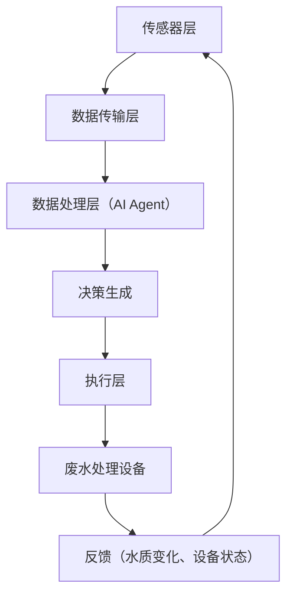

# AI Agent在智能废水处理中的实践

> 关键词：AI Agent、智能废水处理、机器学习、自动化控制、传感器技术、决策模型、数据驱动

> 摘要：本文围绕AI Agent在智能废水处理中的实践展开。首先介绍了研究背景，明确目的、预期读者、文档结构和相关术语。接着阐述了AI Agent与智能废水处理的核心概念及联系，给出了原理和架构示意图与流程图。详细讲解了核心算法原理，并用Python代码进行说明，同时给出了数学模型和公式并举例。通过项目实战，展示了开发环境搭建、源代码实现与解读。探讨了实际应用场景，推荐了学习资源、开发工具框架和相关论文著作。最后总结了未来发展趋势与挑战，解答常见问题并提供扩展阅读与参考资料，旨在为相关领域提供全面的技术指导和实践经验。

## 1. 背景介绍 
### 1.1 目的和范围
随着工业化和城市化的快速发展，废水排放量急剧增加，对环境造成了严重威胁。传统的废水处理方法存在效率低、成本高、难以应对复杂水质变化等问题。因此，引入先进的技术手段实现智能废水处理成为当前研究的热点。本文的目的是探讨AI Agent在智能废水处理中的应用，通过详细分析其原理、算法、实践案例等，为智能废水处理系统的设计和优化提供理论支持和实践指导。

本文的范围涵盖了AI Agent的基本概念、相关算法原理、在废水处理中的数学模型、实际项目开发流程、应用场景分析以及相关工具和资源推荐等方面。

### 1.2 预期读者
本文预期读者包括从事废水处理行业的工程师、技术人员，对人工智能在工业领域应用感兴趣的研究人员，以及相关专业的学生。对于希望了解智能废水处理技术和AI Agent应用的人士，本文将提供有价值的信息和技术参考。

### 1.3 文档结构概述
本文将按照以下结构进行阐述：
1. 背景介绍：介绍研究的目的、范围、预期读者和文档结构，以及相关术语的定义和解释。
2. 核心概念与联系：阐述AI Agent和智能废水处理的核心概念，分析它们之间的联系，并给出原理和架构的示意图与流程图。
3. 核心算法原理 & 具体操作步骤：详细讲解AI Agent在智能废水处理中常用的算法原理，并用Python代码进行具体实现和步骤说明。
4. 数学模型和公式 & 详细讲解 & 举例说明：给出智能废水处理中的数学模型和公式，进行详细讲解并通过实际例子进行说明。
5. 项目实战：代码实际案例和详细解释说明：通过一个实际的项目案例，展示开发环境搭建、源代码实现和代码解读过程。
6. 实际应用场景：分析AI Agent在智能废水处理中的实际应用场景和优势。
7. 工具和资源推荐：推荐相关的学习资源、开发工具框架和论文著作。
8. 总结：未来发展趋势与挑战：总结AI Agent在智能废水处理中的应用现状，分析未来发展趋势和面临的挑战。
9. 附录：常见问题与解答：解答读者在阅读过程中可能遇到的常见问题。
10. 扩展阅读 & 参考资料：提供扩展阅读的建议和相关参考资料。

### 1.4 术语表
#### 1.4.1 核心术语定义
- **AI Agent（人工智能代理）**：是一种能够感知环境、根据自身目标和规则进行决策，并采取行动以实现目标的智能实体。在智能废水处理中，AI Agent可以根据废水水质、处理设备状态等信息，自动调整处理参数，实现高效的废水处理。
- **智能废水处理**：利用先进的传感器技术、自动化控制技术和人工智能算法，实现对废水处理过程的实时监测、智能决策和自动控制，提高废水处理效率和质量。
- **传感器技术**：用于实时监测废水的各种参数，如pH值、化学需氧量（COD）、氨氮含量等，为AI Agent提供决策依据。
- **自动化控制**：通过执行器对废水处理设备进行自动调节，如调节水泵流量、加药量等，实现废水处理过程的自动化运行。

#### 1.4.2 相关概念解释
- **机器学习**：是AI Agent实现智能决策的重要手段，通过对大量历史数据的学习，建立预测模型和决策规则，以应对不同的废水处理情况。
- **深度学习**：是机器学习的一个分支，通过构建深度神经网络模型，能够自动提取数据中的复杂特征，提高预测和决策的准确性。
- **强化学习**：是一种通过智能体与环境进行交互，根据环境反馈的奖励信号来学习最优决策策略的机器学习方法。在智能废水处理中，强化学习可以用于优化处理参数，提高处理效率。

#### 1.4.3 缩略词列表
- **COD**：Chemical Oxygen Demand，化学需氧量
- **pH**：Potential of Hydrogen，酸碱度
- **DO**：Dissolved Oxygen，溶解氧
- **ML**：Machine Learning，机器学习
- **DL**：Deep Learning，深度学习
- **RL**：Reinforcement Learning，强化学习

## 2. 核心概念与联系 

### 2.1 AI Agent核心概念
AI Agent是一个具有自主性、反应性、社会性和主动性的智能实体。自主性意味着它可以在没有人类干预的情况下独立运行；反应性表示它能够感知环境的变化并做出相应的反应；社会性指的是它可以与其他Agent或人类进行交互；主动性则体现为它能够主动地采取行动以实现自身的目标。

在智能废水处理中，AI Agent可以看作是一个智能决策者和执行者。它通过传感器感知废水处理系统的各种状态信息，如水质参数、设备运行状态等，然后根据预设的目标和规则，运用机器学习算法进行决策，最后通过执行器对处理设备进行控制，实现废水处理过程的优化。

### 2.2 智能废水处理核心概念
智能废水处理是一种基于先进技术的废水处理模式，它将传感器技术、自动化控制技术和人工智能算法相结合，实现对废水处理过程的全面监测和智能控制。其核心目标是提高废水处理效率、降低处理成本、减少对环境的影响。

智能废水处理系统通常包括传感器层、数据传输层、数据处理层和执行层。传感器层负责实时采集废水的各种参数；数据传输层将采集到的数据传输到数据处理层；数据处理层对数据进行分析和处理，运用人工智能算法生成决策指令；执行层根据决策指令对处理设备进行控制。

### 2.3 核心概念联系
AI Agent与智能废水处理之间存在着紧密的联系。AI Agent为智能废水处理提供了智能决策和控制的能力，使废水处理系统能够根据实时的水质变化和设备状态自动调整处理策略，提高处理效率和质量。而智能废水处理系统则为AI Agent提供了应用场景和数据来源，通过不断地收集和分析废水处理过程中的数据，AI Agent可以不断学习和优化决策策略，提高自身的智能水平。

### 2.4 原理和架构的文本示意图
智能废水处理中的AI Agent系统原理和架构可以用以下文本示意图表示：

```plaintext
传感器层（水质传感器、设备状态传感器） -> 数据传输层（网络通信） -> 数据处理层（AI Agent）
    |
    v
执行层（水泵、加药设备、曝气设备等）
```

传感器层负责实时采集废水的水质参数和处理设备的运行状态信息，并通过数据传输层将这些信息传输到数据处理层。在数据处理层，AI Agent对采集到的数据进行分析和处理，运用机器学习算法生成决策指令。最后，执行层根据决策指令对处理设备进行控制，实现废水处理过程的优化。

### 2.5 Mermaid流程图


该流程图展示了智能废水处理中AI Agent的工作流程。传感器层采集数据，通过数据传输层传输到数据处理层的AI Agent。AI Agent进行决策生成，将决策指令发送到执行层，执行层控制废水处理设备。处理设备的运行结果会产生反馈信息，反馈到传感器层，形成一个闭环控制系统。

## 3. 核心算法原理 & 具体操作步骤 

### 3.1 机器学习算法原理
在智能废水处理中，常用的机器学习算法包括决策树、支持向量机、神经网络等。下面以决策树算法为例，详细讲解其原理和具体操作步骤。

#### 3.1.1 决策树算法原理
决策树是一种基于树结构进行决策的机器学习算法。它通过对训练数据的学习，构建一棵决策树模型，每个内部节点表示一个属性上的测试，每个分支表示一个测试输出，每个叶节点表示一个类别或值。在进行预测时，根据输入数据的属性值，从根节点开始，沿着决策树的分支进行遍历，直到到达叶节点，叶节点所表示的类别或值即为预测结果。

#### 3.1.2 决策树算法具体操作步骤
以下是使用Python实现决策树算法进行废水处理水质分类的具体步骤：

```python
import pandas as pd
from sklearn.model_selection import train_test_split
from sklearn.tree import DecisionTreeClassifier
from sklearn.metrics import accuracy_score

# 步骤1：数据准备
# 假设我们有一个包含废水水质参数和分类标签的数据集
data = pd.read_csv('wastewater_data.csv')
X = data.drop('label', axis=1)  # 特征数据
y = data['label']  # 标签数据

# 步骤2：数据划分
# 将数据集划分为训练集和测试集
X_train, X_test, y_train, y_test = train_test_split(X, y, test_size=0.2, random_state=42)

# 步骤3：模型训练
# 创建决策树分类器
clf = DecisionTreeClassifier()
# 训练模型
clf.fit(X_train, y_train)

# 步骤4：模型预测
# 在测试集上进行预测
y_pred = clf.predict(X_test)

# 步骤5：模型评估
# 计算模型的准确率
accuracy = accuracy_score(y_test, y_pred)
print(f"模型准确率: {accuracy}")
```

### 3.2 强化学习算法原理
强化学习是一种通过智能体与环境进行交互，根据环境反馈的奖励信号来学习最优决策策略的机器学习方法。在智能废水处理中，强化学习可以用于优化处理参数，提高处理效率。

#### 3.2.1 强化学习算法原理
强化学习的基本要素包括智能体（Agent）、环境（Environment）、状态（State）、动作（Action）和奖励（Reward）。智能体在环境中观察当前状态，根据策略选择一个动作执行，环境会根据智能体的动作更新状态，并给予智能体一个奖励信号。智能体的目标是通过不断地与环境交互，学习到一个最优策略，使得长期累积奖励最大化。

#### 3.2.2 强化学习算法具体操作步骤
以下是使用Python和OpenAI Gym库实现一个简单的强化学习算法进行废水处理参数优化的示例：

```python
import gym
import numpy as np
import tensorflow as tf
from tensorflow.keras import layers

# 步骤1：定义环境
# 假设我们有一个自定义的废水处理环境
env = gym.make('WastewaterTreatment-v0')

# 步骤2：定义策略网络
class PolicyNetwork(tf.keras.Model):
    def __init__(self, num_actions):
        super(PolicyNetwork, self).__init__()
        self.dense1 = layers.Dense(64, activation='relu')
        self.dense2 = layers.Dense(64, activation='relu')
        self.policy_logits = layers.Dense(num_actions)

    def call(self, inputs):
        x = self.dense1(inputs)
        x = self.dense2(x)
        return self.policy_logits(x)

# 步骤3：初始化策略网络
num_actions = env.action_space.n
policy = PolicyNetwork(num_actions)

# 步骤4：定义优化器和损失函数
optimizer = tf.keras.optimizers.Adam(learning_rate=0.001)

# 步骤5：训练循环
num_episodes = 1000
for episode in range(num_episodes):
    state = env.reset()
    episode_reward = 0
    with tf.GradientTape() as tape:
        action_probs = []
        rewards = []
        while True:
            state = tf.convert_to_tensor([state], dtype=tf.float32)
            logits = policy(state)
            action = tf.random.categorical(logits, 1)[0, 0].numpy()
            next_state, reward, done, _ = env.step(action)
            episode_reward += reward
            action_probs.append(tf.nn.softmax(logits)[0, action])
            rewards.append(reward)
            state = next_state
            if done:
                break
        # 计算累积奖励
        discounted_rewards = []
        cumulative_reward = 0
        for r in reversed(rewards):
            cumulative_reward = r + 0.9 * cumulative_reward
            discounted_rewards.insert(0, cumulative_reward)
        discounted_rewards = np.array(discounted_rewards)
        discounted_rewards = (discounted_rewards - np.mean(discounted_rewards)) / (np.std(discounted_rewards) + 1e-7)
        # 计算损失
        action_probs = tf.stack(action_probs)
        log_probs = tf.math.log(action_probs)
        loss = -tf.reduce_sum(log_probs * discounted_rewards)
    # 计算梯度并更新策略网络
    grads = tape.gradient(loss, policy.trainable_variables)
    optimizer.apply_gradients(zip(grads, policy.trainable_variables))
    print(f"Episode {episode}: Reward = {episode_reward}")

# 步骤6：测试模型
state = env.reset()
done = False
while not done:
    state = tf.convert_to_tensor([state], dtype=tf.float32)
    logits = policy(state)
    action = tf.random.categorical(logits, 1)[0, 0].numpy()
    next_state, reward, done, _ = env.step(action)
    state = next_state
    env.render()
env.close()
```

## 4. 数学模型和公式 & 详细讲解 & 举例说明 

### 4.1 废水处理过程的数学模型
在智能废水处理中，常用的数学模型包括水质动力学模型、反应器模型等。下面以水质动力学模型为例，详细讲解其数学公式和应用。

#### 4.1.1 水质动力学模型
水质动力学模型描述了废水中污染物浓度随时间和空间的变化规律。常见的水质动力学模型有一级反应动力学模型和二级反应动力学模型。

##### 一级反应动力学模型
一级反应动力学模型假设污染物的降解速率与污染物的浓度成正比，其数学公式为：

$$\frac{dC}{dt} = -kC$$

其中，$C$ 表示污染物的浓度，$t$ 表示时间，$k$ 表示反应速率常数。

对上述微分方程进行积分，可得：

$$C(t) = C_0e^{-kt}$$

其中，$C_0$ 表示初始污染物浓度。

##### 二级反应动力学模型
二级反应动力学模型假设污染物的降解速率与污染物浓度的平方成正比，其数学公式为：

$$\frac{dC}{dt} = -kC^2$$

对上述微分方程进行积分，可得：

$$\frac{1}{C(t)} = \frac{1}{C_0} + kt$$

#### 4.1.2 详细讲解
一级反应动力学模型适用于污染物降解过程中，反应速率主要取决于污染物浓度的情况。例如，在某些简单的化学氧化反应中，污染物的降解速率与污染物浓度成正比。二级反应动力学模型适用于污染物降解过程中，反应速率不仅取决于污染物浓度，还与其他反应物浓度或反应条件有关的情况。例如，在某些生物处理过程中，微生物的代谢速率与底物浓度的平方成正比。

#### 4.1.3 举例说明
假设某废水处理厂处理含有某种有机污染物的废水，初始污染物浓度 $C_0 = 100$ mg/L，反应速率常数 $k = 0.1$ h$^{-1}$。使用一级反应动力学模型计算处理 $5$ 小时后污染物的浓度。

根据一级反应动力学模型公式 $C(t) = C_0e^{-kt}$，将 $C_0 = 100$ mg/L，$k = 0.1$ h$^{-1}$，$t = 5$ h 代入公式，可得：

$$C(5) = 100e^{-0.1\times5} \approx 60.65$$ mg/L

因此，处理 $5$ 小时后污染物的浓度约为 $60.65$ mg/L。

### 4.2 AI Agent决策模型的数学公式
AI Agent在智能废水处理中的决策模型通常基于机器学习算法，如决策树、神经网络等。下面以神经网络为例，详细讲解其数学公式和应用。

#### 4.2.1 神经网络模型
神经网络是一种模仿人类神经系统的机器学习模型，由输入层、隐藏层和输出层组成。每个神经元接收输入信号，经过加权求和和激活函数处理后，输出一个信号。

假设一个简单的神经网络有 $n$ 个输入神经元，$m$ 个隐藏神经元，$p$ 个输出神经元。第 $i$ 个隐藏神经元的输入为：

$$z_j^h = \sum_{i=1}^{n} w_{ji}^hx_i + b_j^h$$

其中，$w_{ji}^h$ 表示输入层第 $i$ 个神经元到隐藏层第 $j$ 个神经元的权重，$x_i$ 表示输入层第 $i$ 个神经元的输入，$b_j^h$ 表示隐藏层第 $j$ 个神经元的偏置。

第 $j$ 个隐藏神经元的输出为：

$$a_j^h = f(z_j^h)$$

其中，$f$ 表示激活函数，如 sigmoid 函数、ReLU 函数等。

第 $k$ 个输出神经元的输入为：

$$z_k^o = \sum_{j=1}^{m} w_{kj}^oa_j^h + b_k^o$$

其中，$w_{kj}^o$ 表示隐藏层第 $j$ 个神经元到输出层第 $k$ 个神经元的权重，$b_k^o$ 表示输出层第 $k$ 个神经元的偏置。

第 $k$ 个输出神经元的输出为：

$$a_k^o = f(z_k^o)$$

#### 4.2.2 详细讲解
神经网络通过不断地调整权重和偏置，使得输出结果与期望结果之间的误差最小化。常用的训练算法有梯度下降法、反向传播算法等。梯度下降法通过计算误差函数对权重和偏置的梯度，沿着梯度的反方向更新权重和偏置，逐步减小误差。反向传播算法则是一种高效的计算梯度的方法，它通过从输出层向输入层反向传播误差，计算每个神经元的梯度。

#### 4.2.3 举例说明
假设一个简单的神经网络有 $2$ 个输入神经元，$3$ 个隐藏神经元，$1$ 个输出神经元。输入向量 $x = [1, 2]$，隐藏层的权重矩阵 $W^h = \begin{bmatrix}0.1 & 0.2 \\ 0.3 & 0.4 \\ 0.5 & 0.6\end{bmatrix}$，隐藏层的偏置向量 $b^h = [0.1, 0.2, 0.3]$，输出层的权重向量 $w^o = [0.7, 0.8, 0.9]$，输出层的偏置 $b^o = 0.1$，激活函数采用 sigmoid 函数 $f(x) = \frac{1}{1 + e^{-x}}$。

首先计算隐藏层的输入：

$$z^h = W^h x + b^h = \begin{bmatrix}0.1 & 0.2 \\ 0.3 & 0.4 \\ 0.5 & 0.6\end{bmatrix} \begin{bmatrix}1 \\ 2\end{bmatrix} + \begin{bmatrix}0.1 \\ 0.2 \\ 0.3\end{bmatrix} = \begin{bmatrix}0.1\times1 + 0.2\times2 + 0.1 \\ 0.3\times1 + 0.4\times2 + 0.2 \\ 0.5\times1 + 0.6\times2 + 0.3\end{bmatrix} = \begin{bmatrix}0.6 \\ 1.3 \\ 2\end{bmatrix}$$

然后计算隐藏层的输出：

$$a^h = f(z^h) = \begin{bmatrix}\frac{1}{1 + e^{-0.6}} \\ \frac{1}{1 + e^{-1.3}} \\ \frac{1}{1 + e^{-2}}\end{bmatrix} \approx \begin{bmatrix}0.6457 \\ 0.7858 \\ 0.8808\end{bmatrix}$$

接着计算输出层的输入：

$$z^o = w^o a^h + b^o = [0.7, 0.8, 0.9] \begin{bmatrix}0.6457 \\ 0.7858 \\ 0.8808\end{bmatrix} + 0.1 \approx 2.01$$

最后计算输出层的输出：

$$a^o = f(z^o) = \frac{1}{1 + e^{-2.01}} \approx 0.88$$

因此，该神经网络的输出结果约为 $0.88$。

## 5. 项目实战：代码实际案例和详细解释说明 

### 5.1  开发环境搭建
#### 5.1.1 操作系统
推荐使用Ubuntu 20.04 LTS或Windows 10作为开发操作系统。Ubuntu具有良好的开源软件支持和稳定性，适合进行深度学习开发；Windows 10则具有广泛的用户基础和友好的界面。

#### 5.1.2 Python环境
安装Python 3.8或以上版本。可以从Python官方网站（https://www.python.org/downloads/）下载安装包进行安装。安装完成后，使用以下命令验证Python版本：

```bash
python --version
```

#### 5.1.3 虚拟环境创建
为了避免不同项目之间的依赖冲突，建议使用虚拟环境进行开发。可以使用`venv`或`conda`创建虚拟环境。以下是使用`venv`创建虚拟环境的示例：

```bash
python -m venv wastewater_env
source wastewater_env/bin/activate  # 激活虚拟环境（Windows使用 wastewater_env\Scripts\activate）
```

#### 5.1.4 安装依赖库
在激活的虚拟环境中，使用`pip`安装项目所需的依赖库，如`numpy`、`pandas`、`scikit-learn`、`tensorflow`等。以下是安装命令：

```bash
pip install numpy pandas scikit-learn tensorflow
```

### 5.2  源代码详细实现和代码解读
#### 5.2.1 数据预处理
```python
import pandas as pd
from sklearn.preprocessing import StandardScaler

# 加载数据集
data = pd.read_csv('wastewater_data.csv')

# 分离特征和标签
X = data.drop('label', axis=1)
y = data['label']

# 数据标准化
scaler = StandardScaler()
X_scaled = scaler.fit_transform(X)
```

代码解读：首先使用`pandas`库加载废水处理数据集。然后将数据集分为特征数据`X`和标签数据`y`。最后使用`StandardScaler`对特征数据进行标准化处理，使得特征数据具有零均值和单位方差，有助于提高机器学习模型的性能。

#### 5.2.2 模型训练
```python
from sklearn.model_selection import train_test_split
from sklearn.ensemble import RandomForestClassifier
from sklearn.metrics import accuracy_score

# 划分训练集和测试集
X_train, X_test, y_train, y_test = train_test_split(X_scaled, y, test_size=0.2, random_state=42)

# 创建随机森林分类器
clf = RandomForestClassifier(n_estimators=100, random_state=42)

# 训练模型
clf.fit(X_train, y_train)

# 在测试集上进行预测
y_pred = clf.predict(X_test)

# 计算模型准确率
accuracy = accuracy_score(y_test, y_pred)
print(f"模型准确率: {accuracy}")
```

代码解读：使用`train_test_split`函数将标准化后的特征数据和标签数据划分为训练集和测试集，测试集占比为20%。创建一个随机森林分类器，其中`n_estimators`表示决策树的数量。使用训练集数据对模型进行训练，然后在测试集上进行预测。最后使用`accuracy_score`函数计算模型的准确率。

#### 5.2.3 模型保存和加载
```python
import joblib

# 保存模型
joblib.dump(clf, 'wastewater_model.joblib')

# 加载模型
loaded_model = joblib.load('wastewater_model.joblib')

# 使用加载的模型进行预测
new_data = [[1, 2, 3, 4, 5]]  # 示例新数据
new_data_scaled = scaler.transform(new_data)
new_prediction = loaded_model.predict(new_data_scaled)
print(f"新数据预测结果: {new_prediction}")
```

代码解读：使用`joblib`库将训练好的模型保存到文件中，方便后续使用。然后使用`joblib.load`函数加载保存的模型。对于新的废水数据，先使用之前的`StandardScaler`进行标准化处理，然后使用加载的模型进行预测。

### 5.3  代码解读与分析
#### 5.3.1 数据预处理的重要性
数据预处理是机器学习项目中非常重要的一步。通过数据标准化，可以消除不同特征之间的量纲差异，使得模型能够更好地学习特征之间的关系。同时，数据预处理还可以处理缺失值、异常值等问题，提高数据的质量和模型的性能。

#### 5.3.2 随机森林模型的优势
随机森林是一种集成学习模型，它通过组合多个决策树来提高模型的准确性和稳定性。随机森林具有较好的抗过拟合能力，能够处理高维数据和非线性关系。在智能废水处理中，随机森林可以根据废水的各种特征准确地预测水质类别或处理效果。

#### 5.3.3 模型保存和加载的意义
模型保存和加载可以避免重复训练模型，节省时间和计算资源。在实际应用中，当有新的废水数据需要预测时，可以直接加载已经训练好的模型进行预测，提高系统的响应速度。

## 6. 实际应用场景 
### 6.1 实时水质监测与预警
AI Agent可以实时收集废水处理过程中的水质数据，如pH值、COD、氨氮含量等。通过建立水质预测模型，AI Agent能够提前预测水质变化趋势，当水质指标超出安全范围时，及时发出预警信号，提醒工作人员采取相应的措施。例如，在工业废水处理中，当COD浓度突然升高时，AI Agent可以预测到可能存在生产过程异常或污水处理设备故障，及时通知相关人员进行检查和处理，避免对环境造成污染。

### 6.2 处理参数优化
AI Agent可以根据实时水质数据和处理设备的运行状态，自动调整处理参数，如水泵流量、加药量、曝气时间等，以实现废水处理的最优效果。例如，在生物处理过程中，AI Agent可以根据废水的溶解氧含量和微生物活性，动态调整曝气设备的运行功率，保证微生物的生长和代谢环境，提高有机物的降解效率。同时，通过优化加药量，可以减少化学药剂的使用量，降低处理成本。

### 6.3 设备故障诊断与预测性维护
AI Agent可以对废水处理设备的运行状态进行实时监测，通过分析设备的振动、温度、电流等参数，建立设备故障诊断模型。当设备出现异常时，AI Agent能够及时诊断故障原因，并提供相应的解决方案。此外，AI Agent还可以根据设备的历史运行数据和当前状态，预测设备的剩余使用寿命，提前安排维护计划，避免设备突发故障导致的生产中断和经济损失。

### 6.4 远程监控与自动化控制
借助物联网技术，AI Agent可以实现对废水处理系统的远程监控和自动化控制。工作人员可以通过手机、电脑等终端设备随时随地查看废水处理系统的运行状态和水质数据，并根据需要远程调整处理参数。同时，AI Agent可以根据预设的规则和算法，自动控制处理设备的启停和运行，实现废水处理过程的无人值守，提高生产效率和管理水平。

## 7. 工具和资源推荐
### 7.1 学习资源推荐
#### 7.1.1 书籍推荐
- 《人工智能：一种现代的方法》（Artificial Intelligence: A Modern Approach）：这本书是人工智能领域的经典教材，全面介绍了人工智能的基本概念、算法和应用，对于理解AI Agent的原理和技术有很大帮助。
- 《机器学习》（Machine Learning）：周志华著，是国内机器学习领域的权威教材，详细讲解了各种机器学习算法的原理和实现，适合深入学习机器学习在智能废水处理中的应用。
- 《深度学习》（Deep Learning）：Ian Goodfellow、Yoshua Bengio和Aaron Courville著，是深度学习领域的经典著作，介绍了深度学习的基本概念、模型和算法，对于理解神经网络在智能废水处理中的应用有重要意义。

#### 7.1.2 在线课程
- Coursera上的“人工智能基础”（Foundations of Artificial Intelligence）课程：由斯坦福大学的教授授课，系统介绍了人工智能的基本概念、算法和应用，适合初学者入门。
- edX上的“机器学习”（Machine Learning）课程：由吴恩达教授授课，是机器学习领域的经典课程，详细讲解了各种机器学习算法的原理和实现，通过大量的实例和编程作业帮助学生掌握机器学习的应用。
- 中国大学MOOC上的“深度学习”课程：由国内知名高校的教授授课，介绍了深度学习的基本概念、模型和算法，以及在图像识别、自然语言处理等领域的应用，对于理解深度学习在智能废水处理中的应用有一定的参考价值。

#### 7.1.3 技术博客和网站
- Medium：是一个知名的技术博客平台，上面有很多关于人工智能、机器学习和智能废水处理的文章，作者来自不同的领域和行业，可以从中获取最新的技术动态和实践经验。
- Towards Data Science：专注于数据科学和机器学习领域的技术博客，提供了大量的教程、案例分析和研究成果，对于学习和应用机器学习算法有很大帮助。
- IEEE Xplore：是电气和电子工程师协会（IEEE）的数字图书馆，收录了大量的学术论文和技术报告，涵盖了人工智能、自动化控制、环境科学等多个领域，对于深入研究智能废水处理技术有重要的参考价值。

### 7.2 开发工具框架推荐
#### 7.2.1 IDE和编辑器
- PyCharm：是一款专门为Python开发设计的集成开发环境（IDE），具有代码编辑、调试、版本控制等功能，支持多种Python库和框架，适合开发智能废水处理相关的Python项目。
- Jupyter Notebook：是一个交互式的笔记本环境，支持Python、R等多种编程语言，方便进行数据探索、模型开发和结果展示，适合进行机器学习和数据分析实验。
- Visual Studio Code：是一款轻量级的代码编辑器，具有丰富的插件生态系统，支持Python开发，适合快速开发和调试智能废水处理相关的代码。

#### 7.2.2 调试和性能分析工具
- TensorBoard：是TensorFlow提供的可视化工具，可以用于可视化训练过程中的损失函数、准确率、模型结构等信息，帮助开发者调试和优化深度学习模型。
- Py-Spy：是一个Python性能分析工具，可以实时监测Python程序的CPU使用率、内存占用等信息，帮助开发者找出性能瓶颈和优化代码。
- Scikit-learn的交叉验证和模型评估工具：Scikit-learn提供了丰富的交叉验证和模型评估工具，如`cross_val_score`、`GridSearchCV`等，可以帮助开发者选择最优的模型参数和评估模型性能。

#### 7.2.3 相关框架和库
- TensorFlow：是一个开源的深度学习框架，由Google开发，支持多种深度学习模型和算法，如卷积神经网络（CNN）、循环神经网络（RNN）等，适合开发复杂的智能废水处理模型。
- PyTorch：是另一个开源的深度学习框架，由Facebook开发，具有动态图机制和简洁的API，适合快速开发和实验深度学习模型。
- Scikit-learn：是一个简单易用的机器学习库，提供了各种机器学习算法和工具，如分类、回归、聚类等，适合开发基于机器学习的智能废水处理系统。

### 7.3 相关论文著作推荐
#### 7.3.1 经典论文
- “A Survey of Reinforcement Learning in Environmental Engineering”：该论文对强化学习在环境工程领域的应用进行了全面的综述，介绍了强化学习的基本概念、算法和在废水处理、大气污染控制等方面的应用案例，对于理解强化学习在智能废水处理中的应用有重要的参考价值。
- “Machine Learning for Water Quality Prediction: A Review”：这篇论文对机器学习在水质预测中的应用进行了综述，分析了不同机器学习算法的优缺点和适用场景，为智能废水处理中的水质预测提供了理论支持。
- “Deep Learning for Wastewater Treatment Process Modeling and Control”：该论文介绍了深度学习在废水处理过程建模和控制中的应用，通过建立深度学习模型，实现了对废水处理过程的精确建模和优化控制，对于研究深度学习在智能废水处理中的应用有一定的启发作用。

#### 7.3.2 最新研究成果
- 关注IEEE Transactions on Industrial Informatics、Water Research等学术期刊，这些期刊经常发表关于智能废水处理、人工智能应用等方面的最新研究成果。
- 参加国际会议，如IEEE International Conference on Industrial Informatics（INDIN）、World Environmental and Water Resources Congress等，这些会议汇聚了全球的研究人员和专家，分享最新的研究成果和实践经验。

#### 7.3.3 应用案例分析
- 查阅相关企业的技术报告和案例分享，了解AI Agent在实际废水处理项目中的应用效果和经验教训。例如，一些大型污水处理厂或环保企业会公开他们在智能废水处理方面的实践案例，从中可以学习到实际应用中的技术选型、系统设计和项目实施等方面的经验。

## 8. 总结：未来发展趋势与挑战
### 8.1 未来发展趋势
#### 8.1.1 多技术融合
未来，AI Agent在智能废水处理中的应用将与物联网、大数据、区块链等技术深度融合。物联网技术可以实现废水处理设备的全面感知和互联互通，为AI Agent提供更丰富、更准确的数据；大数据技术可以对海量的废水处理数据进行存储、分析和挖掘，为AI Agent的决策提供更强大的支持；区块链技术可以保证数据的安全性和可信度，为智能废水处理系统的运行提供可靠的保障。

#### 8.1.2 智能化升级
随着人工智能技术的不断发展，AI Agent将具备更强的智能决策能力和自主学习能力。未来的AI Agent可以自动适应不同的废水水质和处理工艺，实时调整处理策略，实现废水处理过程的智能化升级。同时，AI Agent还可以与人类专家进行协作，共同解决复杂的废水处理问题。

#### 8.1.3 绿色可持续发展
在环保意识日益增强的背景下，智能废水处理将更加注重绿色可持续发展。AI Agent可以通过优化处理参数、提高资源利用率等方式，减少能源消耗和化学药剂的使用量，降低对环境的影响。同时，AI Agent还可以推动废水的资源化利用，将废水中的有用物质回收利用，实现资源的循环利用。

### 8.2 挑战
#### 8.2.1 数据质量和安全问题
智能废水处理系统依赖大量的实时数据进行决策，数据的质量和安全直接影响系统的性能和可靠性。然而，实际应用中数据可能存在噪声、缺失值、异常值等问题，影响模型的训练和预测效果。此外，数据的安全也是一个重要问题，废水处理数据涉及企业的生产工艺和商业机密，一旦泄露可能会造成严重的后果。

#### 8.2.2 算法可解释性问题
目前，一些先进的人工智能算法，如深度学习算法，虽然在性能上表现出色，但往往是“黑箱”模型，难以解释其决策过程和结果。在智能废水处理中，这可能会导致操作人员对系统的不信任，影响系统的推广和应用。因此，如何提高算法的可解释性是一个亟待解决的问题。

#### 8.2.3 跨学科人才短缺
智能废水处理是一个跨学科的领域，涉及环境科学、人工智能、自动化控制等多个学科的知识和技术。目前，缺乏既懂废水处理工艺又懂人工智能技术的跨学科人才，这在一定程度上限制了AI Agent在智能废水处理中的应用和发展。

## 9. 附录：常见问题与解答
### 9.1 问题1：AI Agent在智能废水处理中的应用是否会完全取代人工操作？
解答：目前来看，AI Agent在智能废水处理中的应用不会完全取代人工操作。虽然AI Agent可以实现实时监测、智能决策和自动控制等功能，但在一些复杂情况下，如设备突发故障、水质异常变化等，仍需要人工干预和处理。此外，人工操作在设备维护、系统调试等方面也具有不可替代的作用。AI Agent和人工操作将相互协作，共同提高废水处理的效率和质量。

### 9.2 问题2：如何保证AI Agent在智能废水处理中的决策准确性？
解答：要保证AI Agent在智能废水处理中的决策准确性，需要从以下几个方面入手：
- 数据质量：确保采集到的废水处理数据准确、可靠，对数据进行预处理，去除噪声、缺失值和异常值。
- 模型选择和训练：选择合适的机器学习或深度学习模型，并使用大量的历史数据进行训练和优化，提高模型的泛化能力。
- 实时监测和反馈：实时监测废水处理系统的运行状态和水质变化，根据反馈信息及时调整AI Agent的决策策略。
- 人工干预和验证：在AI Agent做出决策后，人工进行验证和审核，确保决策的合理性和可行性。

### 9.3 问题3：AI Agent在智能废水处理中的应用成本高吗？
解答：AI Agent在智能废水处理中的应用成本受到多种因素的影响，如传感器设备的采购和安装成本、数据存储和处理成本、模型开发和维护成本等。一般来说，初期的投资成本相对较高，但从长期来看，AI Agent可以提高废水处理的效率和质量，降低处理成本，减少人工操作和设备故障带来的损失，具有较好的经济效益。此外，随着技术的不断发展和普及，AI Agent的应用成本也会逐渐降低。

### 9.4 问题4：如何评估AI Agent在智能废水处理中的应用效果？
解答：可以从以下几个方面评估AI Agent在智能废水处理中的应用效果：
- 水质指标：监测处理后废水的水质指标，如pH值、COD、氨氮含量等，评估处理效果是否达到国家标准和企业要求。
- 处理效率：对比使用AI Agent前后的废水处理时间、处理量等指标，评估处理效率是否提高。
- 成本效益：分析使用AI Agent后在能源消耗、化学药剂使用量、人工成本等方面的变化，评估成本效益是否得到改善。
- 系统稳定性：监测废水处理系统的运行稳定性，评估AI Agent是否能够及时应对各种异常情况，保证系统的正常运行。

## 10. 扩展阅读 & 参考资料
### 10.1 扩展阅读
- 《环境科学与工程原理》：这本书介绍了环境科学与工程的基本原理和方法，对于理解废水处理的工艺和技术有很大帮助。
- 《工业4.0：即将来袭的第四次工业革命》：探讨了工业4.0的概念、技术和应用，对于了解智能废水处理在工业4.0背景下的发展趋势有一定的启发。
- 《人工智能时代的人类未来》：思考了人工智能对人类社会的影响和挑战，对于理解AI Agent在智能废水处理中的应用所带来的社会意义有一定的参考价值。

### 10.2 参考资料
- 相关的行业标准和规范，如《城镇污水处理厂污染物排放标准》、《工业废水处理工程技术规范》等。
- 智能废水处理设备和传感器的产品说明书和技术文档。
- 相关的学术研究论文和报告，可以通过学术数据库如IEEE Xplore、Web of Science等进行查找。

作者：AI天才研究院/AI Genius Institute & 禅与计算机程序设计艺术 /Zen And The Art of Computer Programming