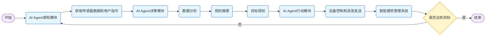

# AI Agent在智能建筑管理中的应用

> 关键词：AI Agent、智能建筑管理、自动化控制、数据分析、节能优化

> 摘要：本文深入探讨了AI Agent在智能建筑管理中的应用。首先介绍了相关背景知识，包括目的范围、预期读者等内容。接着阐述了AI Agent和智能建筑管理的核心概念及其联系，并给出了相应的文本示意图和Mermaid流程图。详细讲解了核心算法原理和具体操作步骤，同时结合数学模型和公式进行说明。通过项目实战案例，展示了AI Agent在智能建筑管理中的具体实现和代码解读。分析了其实际应用场景，推荐了相关的学习资源、开发工具框架以及论文著作。最后总结了未来发展趋势与挑战，并提供了常见问题解答和扩展阅读参考资料，旨在为相关领域的研究和实践提供全面且深入的指导。

## 1. 背景介绍 
### 1.1 目的和范围
本文章的目的在于全面且深入地探讨AI Agent在智能建筑管理中的应用。随着科技的飞速发展，智能建筑逐渐成为建筑领域的发展趋势，而AI Agent作为一种强大的智能技术手段，能够为智能建筑管理带来更高效、智能的解决方案。文章将涵盖AI Agent的基本概念、核心算法、数学模型，以及在智能建筑管理中的具体应用案例和实际场景分析。同时，还会提供相关的学习资源、开发工具和研究论文推荐，以帮助读者更好地理解和应用这一技术。

### 1.2 预期读者
本文预期读者包括但不限于以下几类人群：
- 智能建筑领域的研究人员和学者，他们可以从文章中获取AI Agent在智能建筑管理方面的最新研究成果和应用案例，为进一步的学术研究提供参考。
- 建筑行业的工程师和技术人员，能够了解如何将AI Agent技术应用到实际的智能建筑项目中，提升建筑的管理效率和智能化水平。
- 对人工智能和智能建筑感兴趣的爱好者，通过阅读文章可以初步了解AI Agent在智能建筑管理中的作用和原理。

### 1.3 文档结构概述
本文将按照以下结构进行组织：
- 核心概念与联系：介绍AI Agent和智能建筑管理的核心概念，以及它们之间的联系，并给出相应的文本示意图和Mermaid流程图。
- 核心算法原理 & 具体操作步骤：详细讲解AI Agent在智能建筑管理中所涉及的核心算法原理，并给出具体的操作步骤，同时使用Python源代码进行阐述。
- 数学模型和公式 & 详细讲解 & 举例说明：介绍相关的数学模型和公式，并进行详细讲解和举例说明。
- 项目实战：代码实际案例和详细解释说明：通过一个具体的项目实战案例，展示AI Agent在智能建筑管理中的代码实现和详细解释。
- 实际应用场景：分析AI Agent在智能建筑管理中的实际应用场景。
- 工具和资源推荐：推荐相关的学习资源、开发工具框架和研究论文。
- 总结：未来发展趋势与挑战：总结AI Agent在智能建筑管理中的未来发展趋势和面临的挑战。
- 附录：常见问题与解答：提供常见问题的解答。
- 扩展阅读 & 参考资料：提供相关的扩展阅读资料和参考书目。

### 1.4 术语表
#### 1.4.1 核心术语定义
- **AI Agent（人工智能代理）**：是一种能够感知环境、根据内部状态和目标进行决策，并采取行动以实现目标的智能实体。它可以是软件程序、机器人或其他智能设备。
- **智能建筑管理**：指利用先进的信息技术、自动化技术和管理理念，对建筑内的各种设备和系统进行集中监控、管理和优化控制，以提高建筑的运行效率、舒适度和安全性。
- **自动化控制**：通过计算机系统和自动控制设备，对建筑内的设备和系统进行自动调节和控制，以实现预设的目标。
- **数据分析**：对建筑内的各种数据进行收集、整理、分析和挖掘，以获取有价值的信息和知识，为建筑管理决策提供支持。
- **节能优化**：通过优化建筑内的设备运行参数和控制策略，降低建筑的能源消耗，提高能源利用效率。

#### 1.4.2 相关概念解释
- **多智能体系统（Multi-Agent System，MAS）**：由多个AI Agent组成的系统，这些Agent之间可以通过通信和协作来完成复杂的任务。在智能建筑管理中，多智能体系统可以用于协调不同设备和系统之间的运行。
- **传感器网络**：由大量的传感器节点组成的网络，用于实时监测建筑内的各种环境参数和设备状态。传感器网络是智能建筑管理中数据采集的重要手段。
- **云计算**：一种基于互联网的计算模式，通过将计算资源、存储资源和软件服务等提供给用户，实现资源的共享和优化利用。在智能建筑管理中，云计算可以用于存储和处理大量的建筑数据。

#### 1.4.3 缩略词列表
- **AI**：Artificial Intelligence（人工智能）
- **MAS**：Multi-Agent System（多智能体系统）
- **IoT**：Internet of Things（物联网）
- **HVAC**：Heating, Ventilation and Air Conditioning（供暖、通风和空调系统）

## 2. 核心概念与联系 
### 2.1 AI Agent的核心概念
AI Agent是一种具有自主性、反应性、社会性和主动性的智能实体。自主性意味着AI Agent能够在没有人类干预的情况下独立地感知环境、做出决策和采取行动；反应性表示AI Agent能够及时对环境的变化做出响应；社会性指AI Agent可以与其他Agent进行通信和协作；主动性则体现为AI Agent能够主动地追求自己的目标。

AI Agent通常由以下几个部分组成：
- **感知模块**：用于感知环境中的信息，例如传感器数据、用户指令等。
- **决策模块**：根据感知到的信息和内部状态，进行决策和规划。
- **行动模块**：根据决策结果，采取相应的行动，例如控制设备、发送消息等。

### 2.2 智能建筑管理的核心概念
智能建筑管理是一个综合性的系统工程，旨在通过集成各种先进的技术，实现对建筑内的设备和系统的高效管理和优化控制。智能建筑管理系统通常包括以下几个子系统：
- **设备监控子系统**：实时监测建筑内的各种设备的运行状态，例如电梯、空调、照明等。
- **能源管理子系统**：对建筑的能源消耗进行监测、分析和优化，以降低能源成本。
- **安全管理子系统**：保障建筑的安全，包括门禁系统、视频监控系统等。
- **环境管理子系统**：调节建筑内的环境参数，例如温度、湿度、空气质量等，以提供舒适的室内环境。

### 2.3 AI Agent与智能建筑管理的联系
AI Agent在智能建筑管理中具有重要的应用价值。通过将AI Agent引入智能建筑管理系统，可以实现以下几个方面的优势：
- **自动化控制**：AI Agent可以根据环境变化和预设的规则，自动调节建筑内的设备运行状态，实现自动化控制。
- **智能决策**：AI Agent可以对大量的建筑数据进行分析和挖掘，为建筑管理决策提供支持，实现智能决策。
- **协作与优化**：多个AI Agent可以组成多智能体系统，通过协作和协调，优化建筑内的设备运行和资源分配。

### 2.4 文本示意图
```plaintext
智能建筑管理系统
|-- 设备监控子系统
|   |-- 电梯监控
|   |-- 空调监控
|   |-- 照明监控
|-- 能源管理子系统
|   |-- 能源消耗监测
|   |-- 能源优化控制
|-- 安全管理子系统
|   |-- 门禁系统
|   |-- 视频监控系统
|-- 环境管理子系统
|   |-- 温度调节
|   |-- 湿度调节
|   |-- 空气质量调节

AI Agent
|-- 感知模块
|   |-- 传感器数据采集
|   |-- 用户指令接收
|-- 决策模块
|   |-- 数据分析
|   |-- 规则推理
|   |-- 目标规划
|-- 行动模块
|   |-- 设备控制
|   |-- 消息发送

联系：AI Agent通过感知模块获取智能建筑管理系统中的数据，经过决策模块进行分析和决策，然后通过行动模块对智能建筑管理系统中的设备进行控制和调节。
```

### 2.5 Mermaid流程图


## 3. 核心算法原理 & 具体操作步骤 
### 3.1 核心算法原理
在智能建筑管理中，AI Agent常用的核心算法包括强化学习算法、模糊逻辑算法和遗传算法等。下面以强化学习算法为例进行详细讲解。

强化学习是一种通过智能体与环境进行交互，不断尝试和学习，以最大化累积奖励的机器学习方法。在智能建筑管理中，AI Agent可以作为智能体，通过与建筑环境进行交互，学习最优的控制策略，以实现节能、舒适等目标。

强化学习算法的基本要素包括：
- **状态（State）**：表示智能体所处的环境状态，例如建筑内的温度、湿度、设备运行状态等。
- **动作（Action）**：表示智能体可以采取的行动，例如调节空调温度、开关照明等。
- **奖励（Reward）**：表示智能体采取某个动作后，环境给予的反馈，用于评估动作的好坏。例如，如果采取某个动作后降低了能源消耗，则给予正奖励；如果导致室内环境不舒适，则给予负奖励。
- **策略（Policy）**：表示智能体在每个状态下选择动作的规则。

### 3.2 具体操作步骤
以下是使用强化学习算法实现AI Agent在智能建筑管理中的具体操作步骤：
1. **定义状态空间**：确定智能体可以感知到的环境状态，例如温度、湿度、时间等。可以将这些状态进行离散化处理，以便于算法处理。
2. **定义动作空间**：确定智能体可以采取的动作，例如调节空调温度、开关照明等。
3. **定义奖励函数**：根据智能建筑管理的目标，定义奖励函数。例如，如果目标是节能，则奖励函数可以设置为与能源消耗成反比；如果目标是提供舒适的室内环境，则奖励函数可以设置为与室内环境参数的舒适度成正比。
4. **初始化策略**：随机初始化智能体的策略。
5. **训练智能体**：通过与建筑环境进行交互，不断更新智能体的策略，以最大化累积奖励。具体步骤如下：
    - 智能体根据当前策略选择一个动作。
    - 执行该动作，观察环境的反馈，包括新的状态和奖励。
    - 根据新的状态和奖励，更新智能体的策略。
6. **应用策略**：当智能体训练完成后，将其应用到实际的智能建筑管理中，根据当前状态选择最优的动作。

### 3.3 Python源代码实现
```python
import numpy as np

# 定义状态空间
state_space = [(i, j) for i in range(18, 30) for j in range(20, 80)]  # 温度范围18-29度，湿度范围20-79%
state_index = {state: i for i, state in enumerate(state_space)}

# 定义动作空间
action_space = [-1, 0, 1]  # 降低温度、保持不变、升高温度

# 定义奖励函数
def reward_function(state, action):
    temperature, humidity = state
    new_temperature = temperature + action
    # 假设舒适温度范围是22-26度
    if 22 <= new_temperature <= 26:
        return 1
    else:
        return -1

# 初始化Q表
Q = np.zeros((len(state_space), len(action_space)))

# 超参数
alpha = 0.1  # 学习率
gamma = 0.9  # 折扣因子
epsilon = 0.1  # 探索率

# 训练智能体
num_episodes = 1000
for episode in range(num_episodes):
    # 随机初始化状态
    state = np.random.choice(len(state_space))
    done = False
    while not done:
        # 选择动作
        if np.random.uniform(0, 1) < epsilon:
            action = np.random.choice(len(action_space))
        else:
            action = np.argmax(Q[state])
        
        # 执行动作，观察新状态和奖励
        current_state = state_space[state]
        new_state = current_state[0] + action_space[action], current_state[1]
        if new_state in state_index:
            new_state_index = state_index[new_state]
            reward = reward_function(current_state, action_space[action])
            # 更新Q表
            Q[state, action] = Q[state, action] + alpha * (reward + gamma * np.max(Q[new_state_index]) - Q[state, action])
            state = new_state_index
        else:
            done = True

# 应用策略
current_state = (20, 50)
current_state_index = state_index[current_state]
best_action_index = np.argmax(Q[current_state_index])
best_action = action_space[best_action_index]
print(f"当前状态: {current_state}，最优动作: {best_action}")
```

### 3.4 代码解释
- **状态空间定义**：使用列表推导式定义了温度和湿度的状态空间，并为每个状态分配了一个唯一的索引。
- **动作空间定义**：定义了三个动作，分别是降低温度、保持不变和升高温度。
- **奖励函数**：根据当前状态和动作计算奖励，如果新的温度在舒适范围内，则给予正奖励，否则给予负奖励。
- **Q表初始化**：使用NumPy数组初始化Q表，用于存储每个状态-动作对的价值。
- **训练过程**：使用Q学习算法进行训练，通过不断与环境进行交互，更新Q表。
- **应用策略**：在训练完成后，根据当前状态选择最优的动作。

## 4. 数学模型和公式 & 详细讲解 & 举例说明 
### 4.1 Q学习算法的数学模型和公式
Q学习算法是一种基于值函数的强化学习算法，其核心思想是通过不断更新Q表来学习最优的策略。Q表存储了每个状态-动作对的价值，即智能体在某个状态下采取某个动作后所能获得的累积奖励。

Q学习算法的更新公式如下：
$$Q(s_t, a_t) = Q(s_t, a_t) + \alpha [r_{t+1} + \gamma \max_{a} Q(s_{t+1}, a) - Q(s_t, a_t)]$$
其中：
- $s_t$ 表示当前状态。
- $a_t$ 表示当前动作。
- $r_{t+1}$ 表示执行动作 $a_t$ 后获得的奖励。
- $s_{t+1}$ 表示执行动作 $a_t$ 后转移到的新状态。
- $\alpha$ 是学习率，控制每次更新的步长。
- $\gamma$ 是折扣因子，用于权衡当前奖励和未来奖励的重要性。

### 4.2 详细讲解
- **学习率 $\alpha$**：学习率 $\alpha$ 控制了每次更新Q表时的步长。如果 $\alpha$ 过大，智能体可能会过于贪婪地更新Q表，导致无法收敛到最优策略；如果 $\alpha$ 过小，智能体的学习速度会很慢。
- **折扣因子 $\gamma$**：折扣因子 $\gamma$ 用于权衡当前奖励和未来奖励的重要性。$\gamma$ 越接近1，表示智能体更看重未来的奖励；$\gamma$ 越接近0，表示智能体更看重当前的奖励。
- **$\max_{a} Q(s_{t+1}, a)$**：表示在新状态 $s_{t+1}$ 下，选择所有可能动作中Q值最大的动作的Q值。这体现了Q学习算法的贪心策略，即总是选择最优的动作。

### 4.3 举例说明
假设智能体当前处于状态 $s_t = (20, 50)$（温度20度，湿度50%），选择了动作 $a_t = 1$（升高温度）。执行该动作后，智能体转移到新状态 $s_{t+1} = (21, 50)$，并获得奖励 $r_{t+1} = 1$。

假设当前Q表中 $Q(s_t, a_t) = 0.2$，$\alpha = 0.1$，$\gamma = 0.9$，且 $\max_{a} Q(s_{t+1}, a) = 0.3$。

根据Q学习算法的更新公式，更新后的Q值为：
$$Q(s_t, a_t) = 0.2 + 0.1 \times [1 + 0.9 \times 0.3 - 0.2] = 0.2 + 0.1 \times (1 + 0.27 - 0.2) = 0.2 + 0.1 \times 1.07 = 0.307$$

通过不断重复上述更新过程，智能体可以逐渐学习到最优的策略。

## 5. 项目实战：代码实际案例和详细解释说明 
### 5.1 开发环境搭建
#### 5.1.1 安装Python
首先，需要安装Python环境。可以从Python官方网站（https://www.python.org/downloads/）下载适合自己操作系统的Python版本，并按照安装向导进行安装。

#### 5.1.2 安装必要的库
在项目中，我们使用了NumPy库进行数值计算。可以使用以下命令安装NumPy库：
```sh
pip install numpy
```

### 5.2 源代码详细实现和代码解读
以下是一个完整的项目实战代码，用于实现AI Agent在智能建筑管理中的节能优化：

```python
import numpy as np
import random

# 定义状态空间
temperature_range = range(18, 30)
humidity_range = range(20, 80)
state_space = [(temp, hum) for temp in temperature_range for hum in humidity_range]
state_index = {state: i for i, state in enumerate(state_space)}

# 定义动作空间
action_space = [-1, 0, 1]  # -1: 降低温度, 0: 保持不变, 1: 升高温度

# 定义奖励函数
def reward_function(state, action):
    temperature, humidity = state
    new_temperature = temperature + action
    # 舒适温度范围
    comfort_temp_min = 22
    comfort_temp_max = 26
    # 能源消耗成本
    energy_cost = abs(action) * 0.1
    if comfort_temp_min <= new_temperature <= comfort_temp_max:
        reward = 1 - energy_cost
    else:
        reward = -1 - energy_cost
    return reward

# 初始化Q表
Q = np.zeros((len(state_space), len(action_space)))

# 超参数
alpha = 0.1  # 学习率
gamma = 0.9  # 折扣因子
epsilon = 0.1  # 探索率
num_episodes = 1000

# 训练智能体
for episode in range(num_episodes):
    # 随机初始化状态
    initial_state = random.choice(state_space)
    state = state_index[initial_state]
    done = False
    while not done:
        # 选择动作
        if random.uniform(0, 1) < epsilon:
            action = random.choice(range(len(action_space)))
        else:
            action = np.argmax(Q[state])
        
        # 执行动作，观察新状态和奖励
        current_state = state_space[state]
        new_state = (current_state[0] + action_space[action], current_state[1])
        if new_state in state_index:
            new_state_index = state_index[new_state]
            reward = reward_function(current_state, action_space[action])
            # 更新Q表
            Q[state, action] = Q[state, action] + alpha * (reward + gamma * np.max(Q[new_state_index]) - Q[state, action])
            state = new_state_index
        else:
            done = True

# 应用策略
test_state = (20, 50)
test_state_index = state_index[test_state]
best_action_index = np.argmax(Q[test_state_index])
best_action = action_space[best_action_index]
print(f"测试状态: {test_state}，最优动作: {best_action}")
```

### 5.3 代码解读与分析
#### 5.3.1 状态空间和动作空间定义
- **状态空间**：通过组合温度和湿度的范围，定义了所有可能的状态。每个状态用一个元组表示，例如 `(20, 50)` 表示温度20度，湿度50%。
- **动作空间**：定义了三个动作，分别是降低温度、保持不变和升高温度。

#### 5.3.2 奖励函数
奖励函数考虑了两个因素：室内环境的舒适度和能源消耗成本。如果新的温度在舒适范围内，则给予正奖励；否则给予负奖励。同时，根据动作的大小，扣除相应的能源消耗成本。

#### 5.3.3 Q表初始化
使用NumPy数组初始化Q表，初始值都为0。

#### 5.3.4 训练过程
- **探索与利用**：使用 $\epsilon$-贪心策略进行探索和利用。以 $\epsilon$ 的概率随机选择动作进行探索，以 $1 - \epsilon$ 的概率选择Q值最大的动作进行利用。
- **Q表更新**：根据Q学习算法的更新公式，不断更新Q表，直到达到最大训练轮数。

#### 5.3.5 应用策略
在训练完成后，选择一个测试状态，根据Q表选择最优的动作。

## 6. 实际应用场景 
### 6.1 能源管理
AI Agent可以实时监测建筑的能源消耗情况，根据环境变化和用户需求，自动调节建筑内的设备运行状态，以实现节能优化。例如，在白天光照充足时，自动调节窗帘的开合和照明设备的亮度；在人员较少时，降低空调的制冷或制热强度。

### 6.2 环境调节
通过传感器网络实时监测建筑内的温度、湿度、空气质量等环境参数，AI Agent可以根据预设的舒适范围，自动调节空调、通风设备等，以提供舒适的室内环境。例如，当室内温度过高时，自动启动空调降温；当空气质量不佳时，自动开启通风设备。

### 6.3 设备故障预警
AI Agent可以对建筑内的设备运行状态进行实时监测，通过分析设备的历史数据和实时数据，预测设备可能出现的故障，并及时发出预警。例如，当电梯的运行参数出现异常时，及时通知维修人员进行检修。

### 6.4 安全管理
在安全管理方面，AI Agent可以与门禁系统、视频监控系统等进行集成，实现智能安防。例如，通过人脸识别技术对进入建筑的人员进行身份验证，当发现可疑人员时，自动发出警报并通知安保人员。

### 6.5 空间利用优化
AI Agent可以分析建筑内的人员流动情况和空间使用情况，根据实际需求，合理分配空间资源。例如，在会议室空闲时，自动开放给其他部门使用；在办公区域人员密集时，引导人员前往空闲的区域。

## 7. 工具和资源推荐
### 7.1 学习资源推荐
#### 7.1.1 书籍推荐
- 《人工智能：一种现代的方法》（Artificial Intelligence: A Modern Approach）：这本书是人工智能领域的经典教材，涵盖了AI Agent、机器学习、自然语言处理等多个方面的内容。
- 《强化学习：原理与Python实现》（Reinforcement Learning: An Introduction）：详细介绍了强化学习的基本原理和算法，并提供了Python代码实现。
- 《智能建筑技术》：全面介绍了智能建筑的相关技术，包括建筑自动化、通信技术、能源管理等。

#### 7.1.2 在线课程
- Coursera上的“人工智能基础”（Fundamentals of Artificial Intelligence）课程：由知名高校的教授授课，系统地介绍了人工智能的基本概念和方法。
- edX上的“强化学习”（Reinforcement Learning）课程：深入讲解了强化学习的理论和实践。
- 中国大学MOOC上的“智能建筑系统”课程：介绍了智能建筑系统的组成、设计和应用。

#### 7.1.3 技术博客和网站
- Medium上的AI相关博客：有很多人工智能领域的专家和爱好者分享最新的研究成果和实践经验。
- 机器之心（https://www.alienstar.cn/）：专注于人工智能技术的传播和推广，提供了丰富的技术文章和案例分析。
- 智能建筑网（https://www.ib-china.com/）：提供智能建筑领域的最新资讯、技术文章和产品信息。

### 7.2 开发工具框架推荐
#### 7.2.1 IDE和编辑器
- PyCharm：一款专门为Python开发设计的集成开发环境，提供了丰富的代码编辑、调试和分析功能。
- Jupyter Notebook：一种交互式的开发环境，适合进行数据分析和算法实验。
- Visual Studio Code：一款轻量级的代码编辑器，支持多种编程语言，并且有丰富的插件扩展。

#### 7.2.2 调试和性能分析工具
- PySnooper：一个简单易用的Python调试工具，可以自动记录函数的调用过程和变量的值。
- cProfile：Python内置的性能分析工具，可以帮助开发者找出代码中的性能瓶颈。
- TensorBoard：用于可视化深度学习模型的训练过程和性能指标，也可以用于强化学习算法的调试和分析。

#### 7.2.3 相关框架和库
- NumPy：用于数值计算的Python库，提供了高效的数组操作和数学函数。
- Pandas：用于数据处理和分析的Python库，提供了丰富的数据结构和数据操作方法。
- Stable Baselines3：一个基于PyTorch的强化学习库，提供了多种预训练的强化学习算法和工具。

### 7.3 相关论文著作推荐
#### 7.3.1 经典论文
- “Reinforcement Learning: A Survey”：这篇论文对强化学习的发展历程、基本算法和应用领域进行了全面的综述。
- “Q-Learning”：介绍了Q学习算法的基本原理和实现方法，是强化学习领域的经典论文之一。
- “Multi-Agent Systems: A Modern Approach to Distributed Artificial Intelligence”：对多智能体系统的理论和应用进行了深入的探讨。

#### 7.3.2 最新研究成果
- 可以通过IEEE Xplore、ACM Digital Library等学术数据库搜索关于AI Agent在智能建筑管理中的最新研究成果。例如，一些研究提出了基于深度学习的强化学习算法，用于更高效地解决智能建筑管理中的复杂问题。

#### 7.3.3 应用案例分析
- 一些智能建筑行业的报告和案例集，如《智能建筑应用案例分析》，提供了AI Agent在实际智能建筑项目中的应用案例和经验分享。

## 8. 总结：未来发展趋势与挑战
### 8.1 未来发展趋势
#### 8.1.1 与物联网深度融合
随着物联网技术的不断发展，智能建筑中的设备和传感器将越来越多，AI Agent可以与物联网深度融合，实现对更多设备的智能控制和管理。例如，通过物联网连接各种智能家居设备，实现家庭自动化控制。

#### 8.1.2 多智能体协作
在复杂的智能建筑环境中，单个AI Agent可能无法满足所有的管理需求。未来，多智能体协作将成为发展趋势，多个AI Agent可以通过通信和协作，共同完成智能建筑管理的任务。例如，不同楼层的AI Agent可以协作优化电梯的运行调度。

#### 8.1.3 结合深度学习
深度学习在图像识别、自然语言处理等领域取得了巨大的成功。未来，AI Agent可以结合深度学习技术，提高对建筑环境的感知和理解能力，实现更智能的决策和控制。例如，通过深度学习模型识别人员的行为和需求，提供个性化的服务。

#### 8.1.4 可持续发展导向
随着全球对可持续发展的重视，智能建筑管理将更加注重节能和环保。AI Agent可以通过优化设备运行策略和能源管理方案，实现建筑的可持续发展。例如，利用可再生能源，降低建筑的碳排放。

### 8.2 挑战
#### 8.2.1 数据安全和隐私问题
智能建筑管理中涉及大量的用户数据和设备数据，数据安全和隐私问题是一个重要的挑战。需要采取有效的措施，保障数据的安全性和隐私性，防止数据泄露和滥用。

#### 8.2.2 算法复杂度和计算资源需求
一些复杂的AI算法，如深度学习和强化学习，需要大量的计算资源和时间进行训练。在智能建筑管理中，如何在有限的计算资源下，实现高效的算法运行，是一个需要解决的问题。

#### 8.2.3 系统集成和兼容性
智能建筑管理系统通常由多个子系统和设备组成，不同的系统和设备可能采用不同的技术和标准。如何实现这些系统和设备的集成和兼容性，确保AI Agent能够正常工作，是一个挑战。

#### 8.2.4 人员培训和接受度
AI Agent在智能建筑管理中的应用需要相关人员具备一定的技术知识和操作技能。如何对建筑管理人员进行培训，提高他们对AI Agent的接受度和使用能力，也是一个需要解决的问题。

## 9. 附录：常见问题与解答
### 9.1 AI Agent在智能建筑管理中的应用是否会增加建筑的成本？
AI Agent在智能建筑管理中的应用可能会在初期增加一定的成本，主要包括硬件设备的采购、软件系统的开发和部署等方面。但是，从长期来看，AI Agent可以通过节能优化、设备故障预警等功能，降低建筑的运营成本，提高建筑的管理效率和经济效益。

### 9.2 AI Agent的决策是否可靠？
AI Agent的决策可靠性取决于多个因素，如算法的设计、数据的质量和数量等。在实际应用中，需要对AI Agent进行充分的训练和测试，确保其决策的准确性和可靠性。同时，也可以结合人工干预，对AI Agent的决策进行审核和调整。

### 9.3 如何确保AI Agent与现有智能建筑管理系统的兼容性？
在选择AI Agent技术和产品时，需要考虑其与现有智能建筑管理系统的兼容性。可以选择支持开放标准和接口的AI Agent解决方案，以便与现有系统进行集成。同时，在集成过程中，需要进行充分的测试和调试，确保系统的稳定性和兼容性。

### 9.4 AI Agent在智能建筑管理中的应用是否会导致人员失业？
AI Agent在智能建筑管理中的应用主要是为了提高管理效率和质量，而不是取代人员。虽然一些重复性的工作可能会被AI Agent所替代，但同时也会创造出一些新的工作岗位，如AI Agent的维护和管理、数据分析等。因此，AI Agent的应用不会导致人员失业，反而会促进人员的职业转型和升级。

## 10. 扩展阅读 & 参考资料
### 10.1 扩展阅读
- 《人工智能时代的智能建筑》：深入探讨了人工智能技术在智能建筑领域的应用和发展趋势。
- 《智能建筑与智慧城市》杂志：提供了智能建筑领域的最新研究成果、技术动态和应用案例。
- 一些开源的智能建筑项目，如OpenHAB、Home Assistant等，可以通过研究这些项目的代码和文档，深入了解智能建筑管理的实现原理和方法。

### 10.2 参考资料
- 相关的学术论文和研究报告，可以通过学术数据库进行搜索和下载。
- 智能建筑相关的标准和规范，如《智能建筑设计标准》等，为智能建筑的设计和建设提供了指导。
- 各大智能建筑设备厂商和软件开发商的官方网站，提供了产品的技术文档和应用案例。

作者：AI天才研究院/AI Genius Institute & 禅与计算机程序设计艺术 /Zen And The Art of Computer Programming