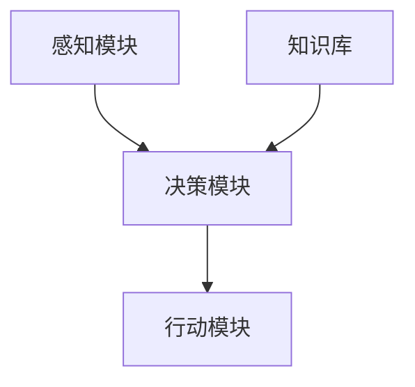
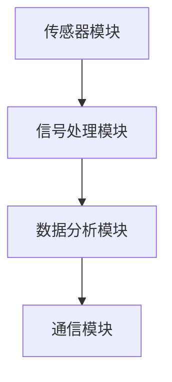
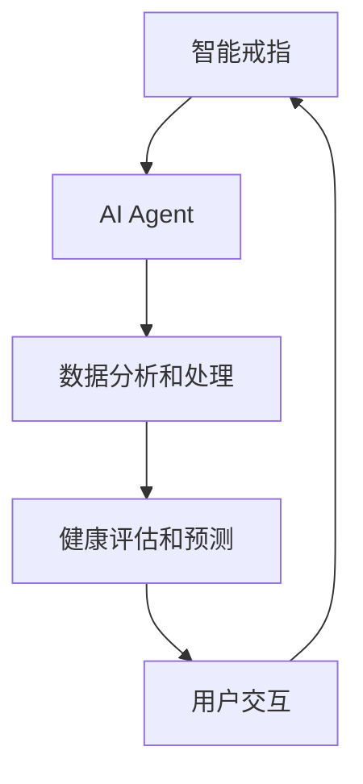

# AI Agent在智能戒指中的生理指标监测

> 关键词：AI Agent、智能戒指、生理指标监测、传感器技术、数据分析

> 摘要：本文聚焦于AI Agent在智能戒指生理指标监测中的应用。详细阐述了相关核心概念，包括AI Agent和智能戒指生理指标监测的原理与架构。深入分析了核心算法原理及操作步骤，并结合数学模型进行解释。通过项目实战给出代码案例和解读，探讨了实际应用场景。同时推荐了学习资源、开发工具框架和相关论文著作。最后总结了未来发展趋势与挑战，并提供常见问题解答和扩展阅读参考资料，旨在为该领域的研究和实践提供全面的技术指导。

## 1. 背景介绍 
### 1.1 目的和范围
随着科技的飞速发展，可穿戴设备逐渐成为人们关注的焦点。智能戒指作为一种新兴的可穿戴设备，因其小巧便携、不影响日常活动等特点，受到了越来越多的关注。而生理指标监测对于人们的健康管理至关重要，如心率、血压、血氧饱和度等指标能够反映人体的健康状况。本文章的目的在于探讨如何将AI Agent应用于智能戒指的生理指标监测中，以提高监测的准确性、智能化水平和用户体验。

文章的范围涵盖了AI Agent和智能戒指生理指标监测的核心概念、算法原理、数学模型、项目实战、实际应用场景以及相关的工具和资源推荐等方面。通过对这些内容的详细阐述，为读者提供一个全面、深入的了解，帮助读者掌握将AI Agent应用于智能戒指生理指标监测的技术和方法。

### 1.2 预期读者
本文的预期读者主要包括以下几类人群：
- 从事可穿戴设备研发的工程师和技术人员，他们可以从本文中获取关于AI Agent在智能戒指生理指标监测方面的技术思路和实现方法，为产品的研发和升级提供参考。
- 对人工智能和健康监测领域感兴趣的科研人员，他们可以通过本文了解该领域的最新研究动态和技术发展趋势，为进一步的研究提供方向。
- 相关专业的学生，如计算机科学、电子工程、生物医学工程等专业的学生，他们可以将本文作为学习资料，加深对相关知识的理解和掌握。
- 关注健康管理的普通用户，他们可以通过本文了解智能戒指生理指标监测的原理和优势，为选择合适的健康监测设备提供参考。

### 1.3 文档结构概述
本文的文档结构如下：
- 核心概念与联系：介绍AI Agent和智能戒指生理指标监测的核心概念，包括原理和架构，并通过文本示意图和Mermaid流程图进行展示。
- 核心算法原理 & 具体操作步骤：详细讲解将AI Agent应用于智能戒指生理指标监测的核心算法原理，并给出具体的操作步骤，同时使用Python源代码进行阐述。
- 数学模型和公式 & 详细讲解 & 举例说明：建立相关的数学模型，给出数学公式，并进行详细讲解和举例说明。
- 项目实战：代码实际案例和详细解释说明：通过一个实际的项目案例，展示如何在智能戒指中实现基于AI Agent的生理指标监测，包括开发环境搭建、源代码详细实现和代码解读。
- 实际应用场景：探讨AI Agent在智能戒指生理指标监测中的实际应用场景。
- 工具和资源推荐：推荐相关的学习资源、开发工具框架和论文著作。
- 总结：未来发展趋势与挑战：总结该领域的未来发展趋势和面临的挑战。
- 附录：常见问题与解答：提供常见问题的解答。
- 扩展阅读 & 参考资料：提供扩展阅读的建议和参考资料。

### 1.4 术语表
#### 1.4.1 核心术语定义
- **AI Agent（人工智能代理）**：是一种能够感知环境、根据感知信息做出决策并采取行动以实现特定目标的智能实体。在本文中，AI Agent用于处理智能戒指采集到的生理指标数据，进行分析、预测和决策。
- **智能戒指**：是一种可穿戴设备，通常集成了多种传感器，能够采集人体的生理指标数据，如心率、血压、血氧饱和度等，并通过无线通信技术将数据传输到其他设备进行处理和分析。
- **生理指标监测**：是指对人体的各种生理指标进行实时或定期的测量和分析，以了解人体的健康状况。常见的生理指标包括心率、血压、血氧饱和度、体温等。

#### 1.4.2 相关概念解释
- **传感器技术**：是指利用各种传感器将物理量、化学量等转换为电信号的技术。在智能戒指中，传感器用于采集人体的生理指标数据，如光电传感器用于测量心率，压力传感器用于测量血压等。
- **数据分析**：是指对采集到的数据进行清洗、预处理、特征提取、建模和预测等操作，以发现数据中的规律和信息。在本文中，数据分析用于处理智能戒指采集到的生理指标数据，以实现对人体健康状况的监测和评估。
- **机器学习**：是指让计算机通过数据和经验自动学习和改进的技术。在AI Agent中，机器学习算法用于对生理指标数据进行建模和预测，以提高监测的准确性和智能化水平。

#### 1.4.3 缩略词列表
- **AI**：Artificial Intelligence，人工智能
- **ECG**：Electrocardiogram，心电图
- **PPG**：Photoplethysmogram，光电容积脉搏波图
- **BP**：Blood Pressure，血压
- **SpO₂**：Oxygen Saturation，血氧饱和度

## 2. 核心概念与联系 
### 2.1 AI Agent原理与架构
AI Agent是一种能够感知环境、根据感知信息做出决策并采取行动以实现特定目标的智能实体。其基本原理可以概括为以下几个步骤：
1. **感知**：AI Agent通过传感器等设备感知环境中的信息，如智能戒指中的传感器采集人体的生理指标数据。
2. **决策**：AI Agent根据感知到的信息，结合自身的知识和目标，使用各种算法和模型进行分析和推理，做出决策。
3. **行动**：AI Agent根据决策结果采取相应的行动，如向用户发送健康建议、将数据传输到云端进行进一步分析等。

AI Agent的架构通常包括以下几个部分：
- **感知模块**：负责感知环境中的信息，如传感器、摄像头等。
- **决策模块**：负责根据感知到的信息进行分析和推理，做出决策。决策模块通常使用机器学习、深度学习等算法和模型。
- **行动模块**：负责根据决策结果采取相应的行动，如执行器、通信模块等。
- **知识库**：存储AI Agent的知识和经验，如规则、模型、数据等。

以下是AI Agent的架构示意图：


### 2.2 智能戒指生理指标监测原理与架构
智能戒指生理指标监测的原理是利用各种传感器采集人体的生理指标数据，然后通过信号处理和数据分析技术对数据进行处理和分析，以获取人体的健康信息。常见的生理指标监测包括心率监测、血压监测、血氧饱和度监测等。

智能戒指生理指标监测的架构通常包括以下几个部分：
- **传感器模块**：负责采集人体的生理指标数据，如光电传感器、压力传感器、温度传感器等。
- **信号处理模块**：负责对传感器采集到的原始信号进行处理，如滤波、放大、采样等，以提高信号的质量。
- **数据分析模块**：负责对处理后的信号进行分析和处理，如特征提取、建模、预测等，以获取人体的健康信息。
- **通信模块**：负责将采集到的数据和分析结果传输到其他设备，如手机、云端服务器等。

以下是智能戒指生理指标监测的架构示意图：


### 2.3 AI Agent与智能戒指生理指标监测的联系
AI Agent与智能戒指生理指标监测的联系在于，AI Agent可以为智能戒指生理指标监测提供智能化的支持。具体来说，AI Agent可以通过以下几个方面提高智能戒指生理指标监测的性能和用户体验：
- **数据处理和分析**：AI Agent可以使用机器学习、深度学习等算法和模型对智能戒指采集到的生理指标数据进行处理和分析，以提高监测的准确性和智能化水平。
- **健康评估和预测**：AI Agent可以根据分析结果对用户的健康状况进行评估和预测，为用户提供个性化的健康建议和预警。
- **用户交互**：AI Agent可以与用户进行交互，如回答用户的问题、提供健康指导等，提高用户的参与度和满意度。

以下是AI Agent与智能戒指生理指标监测的联系示意图：


## 3. 核心算法原理 & 具体操作步骤 
### 3.1 核心算法原理
在智能戒指生理指标监测中，常用的核心算法包括机器学习算法和信号处理算法。以下是一些常见的算法原理介绍：

#### 3.1.1 机器学习算法
- **支持向量机（SVM）**：是一种二分类模型，其基本思想是在特征空间中找到一个最优的超平面，使得不同类别的样本能够被最大程度地分开。在生理指标监测中，SVM可以用于对健康状态进行分类，如判断用户是否患有某种疾病。
- **决策树**：是一种基于树结构进行决策的模型，其每个内部节点是一个属性上的测试，每个分支是一个测试输出，每个叶节点是一个类别或值。决策树可以用于对生理指标数据进行分类和预测，如预测用户的心率是否正常。
- **神经网络**：是一种模仿人类神经系统的计算模型，由大量的神经元组成。神经网络可以自动学习数据中的特征和模式，具有很强的非线性映射能力。在生理指标监测中，神经网络可以用于对复杂的生理信号进行处理和分析，如对心电图信号进行分类和诊断。

#### 3.1.2 信号处理算法
- **滤波算法**：用于去除信号中的噪声和干扰，提高信号的质量。常见的滤波算法包括低通滤波、高通滤波、带通滤波等。
- **特征提取算法**：用于从信号中提取有用的特征，如心率变异性、脉搏波特征等。常见的特征提取算法包括时域分析、频域分析、时频分析等。
- **峰值检测算法**：用于检测信号中的峰值点，如心率信号中的R波峰值。常见的峰值检测算法包括阈值法、导数法等。

### 3.2 具体操作步骤
以下是将AI Agent应用于智能戒指生理指标监测的具体操作步骤：

#### 3.2.1 数据采集
使用智能戒指中的传感器采集人体的生理指标数据，如心率、血压、血氧饱和度等。采集到的数据通常是模拟信号，需要进行模数转换（ADC）将其转换为数字信号。

#### 3.2.2 信号处理
对采集到的数字信号进行处理，包括滤波、放大、采样等操作，以提高信号的质量。具体的信号处理算法可以根据实际需求选择。

#### 3.2.3 特征提取
从处理后的信号中提取有用的特征，如心率变异性、脉搏波特征等。特征提取的目的是将复杂的信号转换为易于处理和分析的特征向量。

#### 3.2.4 模型训练
使用提取到的特征向量对机器学习模型进行训练，如SVM、决策树、神经网络等。训练的目的是让模型学习数据中的特征和模式，以便对未知数据进行分类和预测。

#### 3.2.5 实时监测
将训练好的模型部署到智能戒指或云端服务器中，对实时采集到的生理指标数据进行处理和分析。根据分析结果，AI Agent可以对用户的健康状况进行评估和预测，并提供相应的健康建议和预警。

### 3.3 Python源代码示例
以下是一个使用Python实现的简单的心率监测示例，包括信号处理、特征提取和分类：

```python
import numpy as np
import matplotlib.pyplot as plt
from scipy.signal import butter, filtfilt
from sklearn.svm import SVC
from sklearn.model_selection import train_test_split
from sklearn.metrics import accuracy_score

# 生成模拟心率信号
def generate_heart_rate_signal():
    t = np.linspace(0, 10, 1000)
    signal = np.sin(2 * np.pi * 1 * t) + 0.5 * np.sin(2 * np.pi * 2 * t) + np.random.normal(0, 0.1, len(t))
    return signal

# 低通滤波
def butter_lowpass(cutoff, fs, order=5):
    nyq = 0.5 * fs
    normal_cutoff = cutoff / nyq
    b, a = butter(order, normal_cutoff, btype='low', analog=False)
    return b, a

def butter_lowpass_filter(data, cutoff, fs, order=5):
    b, a = butter_lowpass(cutoff, fs, order=order)
    y = filtfilt(b, a, data)
    return y

# 特征提取
def extract_features(signal):
    mean = np.mean(signal)
    std = np.std(signal)
    return [mean, std]

# 生成数据集
def generate_dataset():
    X = []
    y = []
    for i in range(100):
        signal = generate_heart_rate_signal()
        filtered_signal = butter_lowpass_filter(signal, cutoff=5, fs=100)
        features = extract_features(filtered_signal)
        X.append(features)
        if np.mean(filtered_signal) > 0.5:
            y.append(1)
        else:
            y.append(0)
    return np.array(X), np.array(y)

# 训练模型
X, y = generate_dataset()
X_train, X_test, y_train, y_test = train_test_split(X, y, test_size=0.2, random_state=42)
model = SVC()
model.fit(X_train, y_train)

# 预测
y_pred = model.predict(X_test)
accuracy = accuracy_score(y_test, y_pred)
print(f"Accuracy: {accuracy}")

# 可视化
plt.figure(figsize=(10, 6))
plt.plot(generate_heart_rate_signal(), label='Original Signal')
plt.plot(butter_lowpass_filter(generate_heart_rate_signal(), cutoff=5, fs=100), label='Filtered Signal')
plt.legend()
plt.show()
```

## 4. 数学模型和公式 & 详细讲解 & 举例说明 
### 4.1 心率监测数学模型
心率监测是智能戒指生理指标监测的重要内容之一。心率可以通过测量脉搏波的周期来计算。脉搏波是由于心脏收缩和舒张引起的血管内压力变化而产生的。

#### 4.1.1 数学公式
心率（HR）的计算公式为：
$$HR = \frac{60}{T}$$
其中，$T$ 是脉搏波的周期，单位为秒。

#### 4.1.2 详细讲解
在实际应用中，脉搏波信号通常是通过光电传感器采集到的。光电传感器利用血液对光的吸收特性来测量脉搏波。当心脏收缩时，血液充盈血管，光的吸收增加；当心脏舒张时，血液减少，光的吸收减少。通过检测光的吸收变化，可以得到脉搏波信号。

为了计算心率，需要先从脉搏波信号中检测出峰值点，然后计算相邻峰值点之间的时间间隔，即脉搏波的周期 $T$。最后，根据上述公式计算心率。

#### 4.1.3 举例说明
假设采集到的脉搏波信号中，相邻两个峰值点之间的时间间隔为 1 秒，则心率为：
$$HR = \frac{60}{1} = 60 \text{ 次/分钟}$$

### 4.2 血压监测数学模型
血压监测也是智能戒指生理指标监测的重要内容之一。血压是指血液在血管内流动时对血管壁产生的压力，包括收缩压和舒张压。

#### 4.2.1 数学公式
目前，血压监测的数学模型主要基于脉搏波传导速度（PWV）和脉搏波特征。脉搏波传导速度是指脉搏波在血管中传播的速度，与血压有一定的相关性。

一种简单的血压估计公式为：
$$BP = a \times PWV + b$$
其中，$BP$ 是血压，$PWV$ 是脉搏波传导速度，$a$ 和 $b$ 是通过实验拟合得到的系数。

#### 4.2.2 详细讲解
在实际应用中，需要先从脉搏波信号中提取脉搏波传导速度。脉搏波传导速度可以通过测量两个不同位置的脉搏波到达时间差和两个位置之间的距离来计算。

然后，根据上述公式估计血压。需要注意的是，这种方法只是一种近似估计，实际的血压测量还需要结合其他方法进行校准。

#### 4.2.3 举例说明
假设通过实验拟合得到的系数 $a = 2$，$b = 50$，测量得到的脉搏波传导速度 $PWV = 5$ m/s，则估计的血压为：
$$BP = 2 \times 5 + 50 = 60 \text{ mmHg}$$

### 4.3 血氧饱和度监测数学模型
血氧饱和度是指血液中氧气的含量，是反映人体呼吸功能和氧合状态的重要指标。

#### 4.3.1 数学公式
血氧饱和度（$SpO₂$）的测量通常基于光电容积脉搏波图（PPG）技术。PPG 技术利用不同波长的光（通常是红光和红外光）在血液中的吸收特性来测量血氧饱和度。

一种常用的血氧饱和度计算公式为：
$$SpO₂ = A - B \times \frac{AC_{R}/DC_{R}}{AC_{IR}/DC_{IR}}$$
其中，$A$ 和 $B$ 是通过实验拟合得到的系数，$AC_{R}$ 和 $DC_{R}$ 分别是红光的交流分量和直流分量，$AC_{IR}$ 和 $DC_{IR}$ 分别是红外光的交流分量和直流分量。

#### 4.3.2 详细讲解
在实际应用中，需要使用两个不同波长的光电传感器分别测量红光和红外光的吸收信号。然后，从信号中提取交流分量和直流分量，代入上述公式计算血氧饱和度。

需要注意的是，这种方法的测量精度受到多种因素的影响，如传感器的位置、皮肤颜色、运动等。

#### 4.3.3 举例说明
假设通过实验拟合得到的系数 $A = 100$，$B = 25$，测量得到的 $AC_{R}/DC_{R} = 0.5$，$AC_{IR}/DC_{IR} = 0.2$，则计算得到的血氧饱和度为：
$$SpO₂ = 100 - 25 \times \frac{0.5}{0.2} = 37.5\%$$

## 5. 项目实战：代码实际案例和详细解释说明 
### 5.1  开发环境搭建
#### 5.1.1 硬件环境
- **智能戒指开发板**：选择一款支持多种传感器接口的智能戒指开发板，如 Nordic nRF52 系列开发板。
- **传感器模块**：根据需要选择合适的传感器模块，如心率传感器、血压传感器、血氧饱和度传感器等。
- **计算机**：用于开发和调试代码。

#### 5.1.2 软件环境
- **开发工具**：选择合适的开发工具，如 Arduino IDE、Visual Studio Code 等。
- **编程语言**：选择合适的编程语言，如 C、Python 等。
- **相关库和框架**：根据需要安装相关的库和框架，如 Arduino 传感器库、Python 机器学习库等。

### 5.2  源代码详细实现和代码解读
以下是一个使用 Arduino 实现的简单的心率监测代码示例：

```cpp
#include <Wire.h>
#include <MAX30105.h>

MAX30105 particleSensor;

const byte RATE_SIZE = 4; // Increase this for more averaging. 4 is good.
byte rates[RATE_SIZE]; // Array of heart rates
byte rateSpot = 0;
long lastBeat = 0; // Time at which the last beat occurred

float beatsPerMinute;
int beatAvg;

void setup() {
  Serial.begin(115200);
  Serial.println("Initializing...");

  // Initialize sensor
  if (!particleSensor.begin(Wire, I2C_SPEED_FAST)) { // Use default I2C port, 400kHz speed
    Serial.println("MAX30105 was not found. Please check wiring/power.");
    while (1);
  }
  particleSensor.setup(); // Configure sensor with default settings
  particleSensor.setPulseAmplitudeRed(0x0A); // Turn Red LED to low to indicate sensor is running
  particleSensor.setPulseAmplitudeGreen(0); // Turn off Green LED
}

void loop() {
  long irValue = particleSensor.getIR();

  if (checkForBeat(irValue) == true) {
    // We sensed a beat!
    long delta = millis() - lastBeat;
    lastBeat = millis();

    beatsPerMinute = 60 / (delta / 1000.0);

    if (beatsPerMinute < 255 && beatsPerMinute > 20) {
      rates[rateSpot++] = (byte)beatsPerMinute; // Store this reading in the array
      rateSpot %= RATE_SIZE; // Wrap variable

      // Take average of readings
      beatAvg = 0;
      for (byte x = 0 ; x < RATE_SIZE ; x++)
        beatAvg += rates[x];
      beatAvg /= RATE_SIZE;
    }
  }

  Serial.print("IR=");
  Serial.print(irValue);
  Serial.print(", BPM=");
  Serial.print(beatsPerMinute);
  Serial.print(", Avg BPM=");
  Serial.print(beatAvg);

  if (irValue < 50000)
    Serial.print(" No finger?");

  Serial.println();
}

// Returns true if a beat is detected
boolean checkForBeat(long irValue) {
  static boolean isFalling = false;
  static long lastVal = 0;
  static long thresh = 0;

  if (irValue > lastVal) {
    isFalling = false;
  } else {
    if (!isFalling) {
      if (irValue < thresh) {
        isFalling = true;
        return true;
      }
    }
  }

  lastVal = irValue;
  thresh = (thresh * 7 + irValue) / 8; // Slowly adjust thresh

  return false;
}
```

#### 代码解读
- **初始化部分**：在 `setup()` 函数中，首先初始化串口通信，然后初始化 MAX30105 心率传感器。设置传感器的默认参数，并将红色 LED 的脉冲幅度设置为较低值，以指示传感器正在运行。
- **循环部分**：在 `loop()` 函数中，不断读取传感器的红外值 `irValue`。调用 `checkForBeat()` 函数检查是否检测到心跳。如果检测到心跳，则计算心跳间隔时间 `delta`，并根据公式计算心率 `beatsPerMinute`。将心率值存储在数组 `rates` 中，并计算平均心率 `beatAvg`。最后，将红外值、心率和平均心率通过串口输出。
- **心跳检测函数**：`checkForBeat()` 函数用于检测是否检测到心跳。通过比较当前红外值和上一次红外值的大小，判断是否处于下降沿。如果处于下降沿且当前红外值小于阈值，则认为检测到心跳。同时，不断更新阈值，以适应不同的环境。

### 5.3  代码解读与分析
通过上述代码示例，我们可以看到如何使用 Arduino 和 MAX30105 心率传感器实现简单的心率监测。代码的核心部分是心跳检测函数 `checkForBeat()`，通过比较红外值的变化来判断是否检测到心跳。

在实际应用中，还可以对代码进行优化和扩展，如增加滤波算法、使用机器学习算法进行心率预测等。同时，还可以将采集到的数据通过无线通信技术传输到其他设备进行进一步处理和分析。

## 6. 实际应用场景 
### 6.1 健康管理
AI Agent在智能戒指生理指标监测中的一个重要应用场景是健康管理。通过实时监测用户的心率、血压、血氧饱和度等生理指标，AI Agent可以对用户的健康状况进行评估和预测。例如，当用户的心率突然升高或血压异常时，AI Agent可以及时向用户发送预警信息，并提供相应的健康建议，如休息、调整饮食等。此外，AI Agent还可以根据用户的历史数据和健康目标，为用户制定个性化的健康计划，如运动计划、饮食计划等。

### 6.2 运动监测
在运动领域，智能戒指结合AI Agent可以发挥重要作用。在用户进行运动时，智能戒指可以实时监测用户的心率、运动强度等指标。AI Agent可以根据这些数据为用户提供实时的运动指导，如提醒用户调整运动强度、避免过度运动等。同时，AI Agent还可以对用户的运动数据进行分析，评估运动效果，为用户提供运动建议，帮助用户提高运动效率和安全性。

### 6.3 睡眠监测
睡眠质量对人们的健康至关重要。智能戒指可以通过监测用户的心率、呼吸频率等生理指标，了解用户的睡眠状态，如浅睡眠、深睡眠、快速眼动睡眠等。AI Agent可以根据这些数据对用户的睡眠质量进行评估，分析影响睡眠质量的因素，并为用户提供改善睡眠的建议，如调整睡眠时间、改善睡眠环境等。

### 6.4 医疗保健
在医疗保健领域，AI Agent在智能戒指生理指标监测中的应用可以为医生提供更准确、及时的患者信息。患者可以佩戴智能戒指，实时监测自己的生理指标，并将数据传输到医生的终端设备。医生可以通过AI Agent对这些数据进行分析，及时了解患者的病情变化，为患者提供更个性化的治疗方案。此外，智能戒指还可以用于远程医疗监测，方便医生对患者进行长期的健康管理。

## 7. 工具和资源推荐
### 7.1 学习资源推荐
#### 7.1.1 书籍推荐
- 《人工智能：一种现代的方法》：这本书是人工智能领域的经典教材，全面介绍了人工智能的基本概念、算法和应用。
- 《机器学习》：周志华教授的这本书系统地介绍了机器学习的基本理论和方法，是机器学习领域的优秀教材。
- 《Python数据分析实战》：这本书通过实际案例介绍了如何使用Python进行数据分析，适合初学者学习。

#### 7.1.2 在线课程
- Coursera上的“机器学习”课程：由斯坦福大学的Andrew Ng教授授课，是机器学习领域的经典在线课程。
- edX上的“人工智能基础”课程：介绍了人工智能的基本概念、算法和应用，适合初学者学习。
- 中国大学MOOC上的“Python语言程序设计”课程：由北京大学的陈斌老师授课，适合初学者学习Python编程。

#### 7.1.3 技术博客和网站
- Medium：一个技术博客平台，上面有很多关于人工智能、机器学习等领域的优秀文章。
- Towards Data Science：专注于数据分析和机器学习领域的技术博客，提供了很多实用的教程和案例。
- GitHub：一个开源代码托管平台，上面有很多关于人工智能、机器学习等领域的开源项目，可以学习和参考。

### 7.2 开发工具框架推荐
#### 7.2.1 IDE和编辑器
- PyCharm：一款专业的Python集成开发环境，提供了丰富的功能和插件，适合Python开发。
- Visual Studio Code：一款轻量级的代码编辑器，支持多种编程语言，具有丰富的插件生态系统。
- Arduino IDE：专门用于Arduino开发的集成开发环境，简单易用，适合初学者。

#### 7.2.2 调试和性能分析工具
- TensorBoard：TensorFlow提供的可视化工具，可以用于查看模型的训练过程、性能指标等。
- PyTorch Profiler：PyTorch提供的性能分析工具，可以用于分析模型的性能瓶颈。
- JTAG调试器：用于调试嵌入式系统的硬件调试工具。

#### 7.2.3 相关框架和库
- TensorFlow：Google开发的开源机器学习框架，提供了丰富的工具和接口，适合大规模机器学习项目。
- PyTorch：Facebook开发的开源深度学习框架，具有动态图和易于使用的特点，适合研究和开发。
- Scikit-learn：Python的机器学习库，提供了多种机器学习算法和工具，适合初学者和快速开发。

### 7.3 相关论文著作推荐
#### 7.3.1 经典论文
- “Support-Vector Networks”：介绍了支持向量机的基本原理和算法，是支持向量机领域的经典论文。
- “Gradient-Based Learning Applied to Document Recognition”：介绍了卷积神经网络在手写字符识别中的应用，是卷积神经网络领域的经典论文。
- “Deep Residual Learning for Image Recognition”：介绍了残差网络的基本原理和算法，是深度学习领域的经典论文。

#### 7.3.2 最新研究成果
- 关注顶级学术会议和期刊，如NeurIPS、ICML、CVPR、JAMA等，了解该领域的最新研究成果。
- 使用学术搜索引擎，如Google Scholar、IEEE Xplore等，搜索相关的研究论文。

#### 7.3.3 应用案例分析
- 阅读相关的技术报告和案例分析，了解AI Agent在智能戒指生理指标监测中的实际应用案例和经验。
- 参加行业研讨会和技术交流活动，与同行分享和交流应用案例和经验。

## 8. 总结：未来发展趋势与挑战
### 8.1 未来发展趋势
- **多模态融合**：未来的智能戒指将不仅仅局限于单一的生理指标监测，而是会融合多种传感器技术，实现多模态的生理指标监测。例如，同时监测心率、血压、血氧饱和度、体温等多个生理指标，为用户提供更全面的健康信息。
- **智能化升级**：随着AI技术的不断发展，AI Agent在智能戒指中的应用将越来越深入。AI Agent将能够对采集到的生理指标数据进行更复杂的分析和处理，实现更智能化的健康评估和预测。例如，通过深度学习算法对大量的生理指标数据进行学习和分析，发现潜在的健康风险，并为用户提供个性化的健康建议。
- **个性化服务**：未来的智能戒指将能够根据用户的个体差异，提供个性化的健康管理服务。例如，根据用户的年龄、性别、身体状况、运动习惯等因素，为用户制定个性化的健康计划和运动方案。
- **与其他设备的互联互通**：智能戒指将与其他智能设备，如智能手机、智能手表、智能家居设备等实现互联互通。通过与其他设备的协同工作，为用户提供更便捷、高效的健康管理服务。例如，智能戒指可以将采集到的生理指标数据传输到智能手机上，用户可以通过手机应用程序查看自己的健康信息，并接收健康建议和预警。

### 8.2 挑战
- **传感器技术的局限性**：目前，智能戒指中的传感器技术还存在一定的局限性，如测量精度不高、抗干扰能力弱等。这些局限性会影响生理指标监测的准确性和可靠性。未来需要进一步研发和改进传感器技术，提高传感器的性能。
- **数据安全和隐私问题**：智能戒指采集到的生理指标数据涉及用户的个人隐私和健康信息，数据安全和隐私问题至关重要。在数据传输、存储和处理过程中，需要采取有效的安全措施，保护用户的数据安全和隐私。
- **算法的复杂性和计算资源的限制**：随着AI Agent在智能戒指中的应用越来越深入，算法的复杂性也会不断增加。而智能戒指的计算资源通常比较有限，如何在有限的计算资源下实现复杂的算法，是一个需要解决的问题。
- **用户体验的提升**：智能戒指作为一种可穿戴设备，用户体验至关重要。如何设计出更加舒适、便捷、美观的智能戒指，提高用户的佩戴体验，是未来需要关注的问题。

## 9. 附录：常见问题与解答
### 9.1 智能戒指的生理指标监测准确吗？
智能戒指的生理指标监测准确性受到多种因素的影响，如传感器技术、测量方法、个体差异等。目前，一些高端的智能戒指在心率、血氧饱和度等指标的监测上已经具有较高的准确性，但在血压等指标的监测上还存在一定的误差。未来，随着传感器技术和算法的不断发展，智能戒指的生理指标监测准确性有望进一步提高。

### 9.2 AI Agent在智能戒指中的作用是什么？
AI Agent在智能戒指中的作用主要包括以下几个方面：
- **数据处理和分析**：对智能戒指采集到的生理指标数据进行处理和分析，提取有用的信息。
- **健康评估和预测**：根据分析结果对用户的健康状况进行评估和预测，发现潜在的健康风险。
- **个性化服务**：根据用户的个体差异，为用户提供个性化的健康建议和服务。
- **用户交互**：与用户进行交互，回答用户的问题，提供健康指导。

### 9.3 智能戒指的续航能力如何？
智能戒指的续航能力取决于多种因素，如电池容量、传感器功耗、通信方式等。一般来说，智能戒指的续航能力在几天到几周不等。为了提高续航能力，一些智能戒指采用了低功耗的传感器和芯片，同时优化了软件算法，降低了功耗。

### 9.4 智能戒指的数据如何传输到其他设备？
智能戒指通常采用无线通信技术将数据传输到其他设备，如蓝牙、Wi-Fi等。用户可以通过智能手机应用程序或其他终端设备接收和查看智能戒指采集到的数据。

## 10. 扩展阅读 & 参考资料
### 10.1 扩展阅读
- 《可穿戴设备技术与应用》：这本书介绍了可穿戴设备的技术原理、应用场景和发展趋势，对智能戒指的研究和开发具有一定的参考价值。
- 《人工智能与健康医疗》：探讨了人工智能在健康医疗领域的应用和发展，为AI Agent在智能戒指生理指标监测中的应用提供了更广阔的思路。
- 《生物医学传感器原理与应用》：详细介绍了生物医学传感器的原理、分类和应用，有助于深入了解智能戒指中传感器的工作原理。

### 10.2 参考资料
- 相关的学术论文和研究报告，可以通过学术搜索引擎和数据库获取。
- 智能戒指和传感器制造商的官方网站，提供了产品的技术规格和使用说明。
- 行业标准和规范，如IEEE、ISO等组织发布的相关标准，对智能戒指的设计和开发具有指导作用。

作者：AI天才研究院/AI Genius Institute & 禅与计算机程序设计艺术 /Zen And The Art of Computer Programming