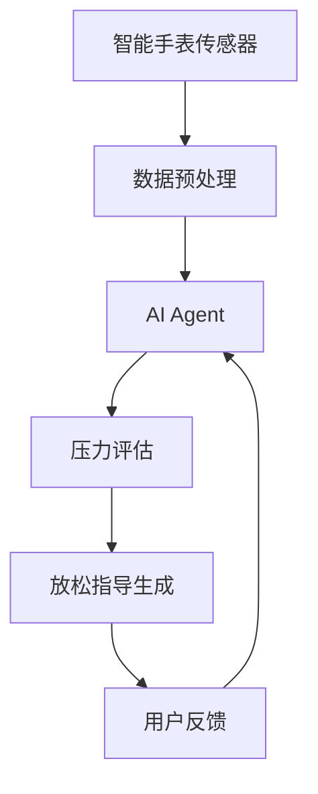

# AI Agent在智能手表中的压力管理与放松指导

> 关键词：AI Agent、智能手表、压力管理、放松指导、健康监测

> 摘要：本文深入探讨了AI Agent在智能手表中用于压力管理与放松指导的相关技术。详细介绍了其核心概念、算法原理、数学模型，通过实际案例展示了如何在智能手表上实现该功能。同时，分析了其实际应用场景，推荐了相关的学习资源、开发工具和论文著作。最后总结了该技术的未来发展趋势与挑战，并对常见问题进行了解答。

## 1. 背景介绍 
### 1.1 目的和范围
随着现代生活节奏的加快，人们面临的压力日益增大，压力管理和放松变得尤为重要。智能手表作为一种便捷的可穿戴设备，已经具备了多种健康监测功能。本文章的目的是探讨如何利用AI Agent技术，进一步提升智能手表在压力管理与放松指导方面的能力。范围涵盖了从AI Agent的基本原理到在智能手表上的具体实现，以及相关的应用场景和未来发展趋势。

### 1.2 预期读者
本文预期读者包括智能手表开发者、人工智能研究人员、健康科技从业者以及对压力管理和智能手表技术感兴趣的普通读者。希望读者能够通过本文深入了解AI Agent在智能手表压力管理与放松指导中的应用，并从中获取有价值的信息和启示。

### 1.3 文档结构概述
本文首先介绍核心概念与联系，阐述AI Agent、压力管理和放松指导的基本原理和相互关系。接着讲解核心算法原理和具体操作步骤，通过Python代码详细说明。然后给出数学模型和公式，并举例说明。之后进行项目实战，包括开发环境搭建、源代码实现和代码解读。再分析实际应用场景，推荐相关的工具和资源。最后总结未来发展趋势与挑战，解答常见问题，并提供扩展阅读和参考资料。

### 1.4 术语表
#### 1.4.1 核心术语定义
- **AI Agent**：即人工智能代理，是一种能够感知环境、自主决策并采取行动以实现特定目标的智能实体。在本文中，AI Agent用于分析智能手表收集的用户数据，提供压力管理和放松指导。
- **智能手表**：一种可穿戴设备，通常具备时钟、健康监测、运动追踪等功能，能够与智能手机等设备进行连接。
- **压力管理**：指通过各种方法和策略来识别、评估和应对压力，以维持身心健康。
- **放松指导**：为用户提供有助于放松身心的建议和方法，如深呼吸、冥想等。

#### 1.4.2 相关概念解释
- **传感器数据**：智能手表通过内置的传感器（如心率传感器、加速度计等）收集的关于用户身体状态和活动的数据。
- **机器学习模型**：用于分析传感器数据，识别压力状态和提供放松建议的数学模型。常见的机器学习模型包括决策树、神经网络等。
- **个性化推荐**：根据用户的个人特征和历史数据，为用户提供定制化的压力管理和放松指导。

#### 1.4.3 缩略词列表
- **AI**：Artificial Intelligence，人工智能
- **ML**：Machine Learning，机器学习
- **HRV**：Heart Rate Variability，心率变异性

## 2. 核心概念与联系 
### 核心概念原理
#### AI Agent
AI Agent是一种能够感知环境、做出决策并采取行动的智能实体。在智能手表的压力管理与放松指导中，AI Agent通过感知智能手表收集的用户数据（如心率、运动状态等），分析用户的压力水平，并根据预设的规则或机器学习模型做出决策，提供相应的放松指导。

#### 压力管理
压力管理的核心是识别和评估压力源，并采取适当的措施来应对压力。智能手表可以通过收集用户的生理数据（如心率、血压等）和行为数据（如运动、睡眠等），帮助用户了解自己的压力状态。

#### 放松指导
放松指导是指为用户提供一些有助于放松身心的方法和建议，如深呼吸、冥想、渐进性肌肉松弛等。AI Agent可以根据用户的压力状态和个人偏好，为用户提供个性化的放松指导。

### 架构的文本示意图
```plaintext
智能手表传感器 -> 数据预处理 -> AI Agent -> 压力评估 -> 放松指导生成 -> 用户反馈
```
智能手表的传感器收集用户的生理和行为数据，经过数据预处理后输入到AI Agent中。AI Agent对数据进行分析，评估用户的压力水平，并根据评估结果生成放松指导。用户可以对放松指导进行反馈，AI Agent根据反馈进行调整和优化。

### Mermaid流程图


## 3. 核心算法原理 & 具体操作步骤 
### 核心算法原理
在智能手表的压力管理与放松指导中，常用的算法包括机器学习算法和规则引擎算法。

#### 机器学习算法
机器学习算法可以通过对大量历史数据的学习，建立压力评估模型和放松指导推荐模型。常见的机器学习算法包括决策树、支持向量机、神经网络等。

#### 规则引擎算法
规则引擎算法是根据预设的规则来进行压力评估和放松指导推荐。例如，如果用户的心率超过一定阈值，则判断用户处于高压力状态，并推荐深呼吸等放松方法。

### 具体操作步骤
#### 数据收集
智能手表通过内置的传感器收集用户的生理数据（如心率、血压、心率变异性等）和行为数据（如运动步数、睡眠时长等）。

#### 数据预处理
对收集到的数据进行清洗、归一化等预处理操作，以提高数据的质量和可用性。

#### 压力评估
使用机器学习算法或规则引擎算法对预处理后的数据进行分析，评估用户的压力水平。

#### 放松指导生成
根据压力评估结果和用户的个人偏好，生成个性化的放松指导。

#### 用户反馈
用户可以对放松指导进行反馈，AI Agent根据反馈对压力评估模型和放松指导推荐模型进行调整和优化。

### Python源代码实现
```python
import numpy as np
from sklearn.tree import DecisionTreeClassifier

# 模拟数据收集
def collect_data():
    # 这里简单模拟收集心率和运动步数数据
    heart_rate = np.random.randint(60, 120, 100)
    steps = np.random.randint(0, 10000, 100)
    return heart_rate, steps

# 数据预处理
def preprocess_data(heart_rate, steps):
    # 归一化处理
    heart_rate = (heart_rate - np.min(heart_rate)) / (np.max(heart_rate) - np.min(heart_rate))
    steps = (steps - np.min(steps)) / (np.max(steps) - np.min(steps))
    X = np.column_stack((heart_rate, steps))
    return X

# 压力评估
def stress_evaluation(X):
    # 模拟标签，0表示低压力，1表示高压力
    y = np.random.randint(0, 2, 100)
    model = DecisionTreeClassifier()
    model.fit(X, y)
    stress_level = model.predict(X)
    return stress_level

# 放松指导生成
def relaxation_guidance(stress_level):
    guidance = []
    for level in stress_level:
        if level == 0:
            guidance.append("保持当前状态，适当运动即可。")
        else:
            guidance.append("建议进行深呼吸放松。")
    return guidance

# 主函数
def main():
    heart_rate, steps = collect_data()
    X = preprocess_data(heart_rate, steps)
    stress_level = stress_evaluation(X)
    guidance = relaxation_guidance(stress_level)
    print("压力水平:", stress_level)
    print("放松指导:", guidance)

if __name__ == "__main__":
    main()
```

## 4. 数学模型和公式 & 详细讲解 & 举例说明 
### 数学模型和公式
#### 压力评估模型
在机器学习算法中，常用的压力评估模型是分类模型，如决策树、支持向量机等。以决策树为例，决策树模型可以表示为一个树形结构，每个内部节点表示一个特征的判断条件，每个分支表示一个判断结果，每个叶节点表示一个类别（如低压力、高压力）。

决策树的构建过程可以使用信息增益、基尼指数等指标来选择最优的特征和划分点。信息增益的计算公式如下：
$$
IG(S, A) = H(S) - \sum_{v\in Values(A)}\frac{|S_v|}{|S|}H(S_v)
$$
其中，$IG(S, A)$ 表示特征 $A$ 对数据集 $S$ 的信息增益，$H(S)$ 表示数据集 $S$ 的熵，$S_v$ 表示特征 $A$ 取值为 $v$ 的子集。

#### 放松指导推荐模型
放松指导推荐模型可以使用基于规则的模型或基于机器学习的模型。基于规则的模型可以根据预设的规则来推荐放松方法，如如果用户的压力水平为高，则推荐深呼吸放松。基于机器学习的模型可以通过对大量历史数据的学习，建立放松方法与压力水平、用户偏好等因素之间的关系。

### 详细讲解
#### 信息增益
信息增益是一种衡量特征重要性的指标，它表示使用某个特征对数据集进行划分后，数据集的不确定性减少的程度。信息增益越大，说明该特征对分类的贡献越大。

#### 熵
熵是一种衡量数据集不确定性的指标，它表示数据集的混乱程度。熵越大，说明数据集的不确定性越大。熵的计算公式如下：
$$
H(S) = -\sum_{i=1}^{n}p_i\log_2p_i
$$
其中，$S$ 表示数据集，$p_i$ 表示数据集 $S$ 中第 $i$ 类样本的比例。

### 举例说明
假设有一个数据集 $S$ 包含 10 个样本，其中 6 个样本属于类别 0，4 个样本属于类别 1。则数据集 $S$ 的熵为：
$$
H(S) = -\frac{6}{10}\log_2\frac{6}{10} - \frac{4}{10}\log_2\frac{4}{10} \approx 0.971
$$
假设有一个特征 $A$，它有两个取值 $v_1$ 和 $v_2$。特征 $A$ 取值为 $v_1$ 的子集 $S_{v_1}$ 包含 6 个样本，其中 4 个样本属于类别 0，2 个样本属于类别 1；特征 $A$ 取值为 $v_2$ 的子集 $S_{v_2}$ 包含 4 个样本，其中 2 个样本属于类别 0，2 个样本属于类别 1。则子集 $S_{v_1}$ 和 $S_{v_2}$ 的熵分别为：
$$
H(S_{v_1}) = -\frac{4}{6}\log_2\frac{4}{6} - \frac{2}{6}\log_2\frac{2}{6} \approx 0.918
$$
$$
H(S_{v_2}) = -\frac{2}{4}\log_2\frac{2}{4} - \frac{2}{4}\log_2\frac{2}{4} = 1
$$
特征 $A$ 对数据集 $S$ 的信息增益为：
$$
IG(S, A) = H(S) - \frac{6}{10}H(S_{v_1}) - \frac{4}{10}H(S_{v_2}) \approx 0.971 - \frac{6}{10} \times 0.918 - \frac{4}{10} \times 1 \approx 0.01
$$

## 5. 项目实战：代码实际案例和详细解释说明 
### 5.1  开发环境搭建
#### 硬件环境
- 智能手表：支持心率监测、运动追踪等功能，如Apple Watch、小米手表等。
- 开发板：如Arduino、Raspberry Pi等，用于与智能手表进行通信和数据处理。

#### 软件环境
- Python：版本3.6及以上，用于编写核心算法代码。
- 机器学习库：如Scikit-learn、TensorFlow等，用于构建压力评估模型和放松指导推荐模型。
- 通信库：如PySerial、Bluepy等，用于与智能手表进行通信。

### 5.2  源代码详细实现和代码解读
```python
import serial
import numpy as np
from sklearn.tree import DecisionTreeClassifier

# 与智能手表进行通信
def connect_to_watch():
    try:
        ser = serial.Serial('COM3', 9600)  # 根据实际情况修改串口和波特率
        return ser
    except serial.SerialException as e:
        print(f"连接失败: {e}")
        return None

# 数据收集
def collect_data(ser):
    data = []
    for i in range(10):  # 收集10组数据
        line = ser.readline().decode('utf-8').strip()
        heart_rate, steps = line.split(',')
        heart_rate = int(heart_rate)
        steps = int(steps)
        data.append([heart_rate, steps])
    data = np.array(data)
    return data

# 数据预处理
def preprocess_data(data):
    heart_rate = data[:, 0]
    steps = data[:, 1]
    heart_rate = (heart_rate - np.min(heart_rate)) / (np.max(heart_rate) - np.min(heart_rate))
    steps = (steps - np.min(steps)) / (np.max(steps) - np.min(steps))
    X = np.column_stack((heart_rate, steps))
    return X

# 压力评估
def stress_evaluation(X):
    # 模拟标签，0表示低压力，1表示高压力
    y = np.random.randint(0, 2, 10)
    model = DecisionTreeClassifier()
    model.fit(X, y)
    stress_level = model.predict(X)
    return stress_level

# 放松指导生成
def relaxation_guidance(stress_level):
    guidance = []
    for level in stress_level:
        if level == 0:
            guidance.append("保持当前状态，适当运动即可。")
        else:
            guidance.append("建议进行深呼吸放松。")
    return guidance

# 主函数
def main():
    ser = connect_to_watch()
    if ser:
        data = collect_data(ser)
        X = preprocess_data(data)
        stress_level = stress_evaluation(X)
        guidance = relaxation_guidance(stress_level)
        print("压力水平:", stress_level)
        print("放松指导:", guidance)
        ser.close()

if __name__ == "__main__":
    main()
```

### 5.3  代码解读与分析
#### 连接智能手表
`connect_to_watch` 函数用于与智能手表进行通信，通过串口通信协议获取智能手表收集的数据。

#### 数据收集
`collect_data` 函数从串口读取智能手表发送的数据，并将其转换为数值类型。

#### 数据预处理
`preprocess_data` 函数对收集到的数据进行归一化处理，以提高数据的质量和可用性。

#### 压力评估
`stress_evaluation` 函数使用决策树模型对预处理后的数据进行分析，评估用户的压力水平。

#### 放松指导生成
`relaxation_guidance` 函数根据压力评估结果生成相应的放松指导。

#### 主函数
`main` 函数调用上述函数，完成数据收集、预处理、压力评估和放松指导生成的整个流程。

## 6. 实际应用场景 
### 日常压力管理
用户在日常生活中可以通过智能手表实时监测自己的压力水平。当压力水平过高时，智能手表会及时提供放松指导，帮助用户缓解压力。例如，用户在工作间隙可以根据智能手表的建议进行深呼吸放松，提高工作效率。

### 运动健身
在运动健身过程中，智能手表可以根据用户的心率、运动强度等数据评估用户的压力状态。如果用户运动过度导致压力过大，智能手表可以提供适当的休息建议，避免运动损伤。

### 睡眠监测
智能手表可以在用户睡眠时监测其心率、呼吸等数据，评估用户的睡眠质量和压力水平。如果用户在睡眠中压力过大，智能手表可以在用户醒来后提供相应的放松指导，帮助用户恢复精力。

## 7. 工具和资源推荐
### 7.1 学习资源推荐
#### 7.1.1 书籍推荐
- 《Python机器学习实战》：介绍了Python在机器学习领域的应用，包括决策树、支持向量机等算法的实现。
- 《人工智能：一种现代的方法》：全面介绍了人工智能的基本概念、算法和应用，是人工智能领域的经典教材。
- 《可穿戴设备设计与开发》：详细介绍了可穿戴设备的硬件设计、软件开发和应用场景，对智能手表的开发有很大的帮助。

#### 7.1.2 在线课程
- Coursera上的“机器学习”课程：由斯坦福大学教授Andrew Ng主讲，是机器学习领域的经典课程。
- edX上的“人工智能基础”课程：介绍了人工智能的基本概念、算法和应用，适合初学者学习。
- Udemy上的“智能手表开发实战”课程：详细介绍了智能手表的开发流程和技术，包括硬件设计、软件开发和通信协议等。

#### 7.1.3 技术博客和网站
- Medium：上面有很多关于人工智能、可穿戴设备等领域的技术文章和案例分享。
- Hackster.io：提供了很多智能手表开发的项目案例和教程，对开发者有很大的启发。
- 开源中国：国内知名的开源技术社区，上面有很多关于人工智能和可穿戴设备的技术文章和讨论。

### 7.2 开发工具框架推荐
#### 7.2.1 IDE和编辑器
- PyCharm：一款功能强大的Python集成开发环境，支持代码调试、版本控制等功能。
- Visual Studio Code：一款轻量级的代码编辑器，支持多种编程语言和插件扩展。
- Arduino IDE：专门用于Arduino开发板的集成开发环境，简单易用。

#### 7.2.2 调试和性能分析工具
- Py-Spy：一款Python性能分析工具，可以帮助开发者找出代码中的性能瓶颈。
- TensorBoard：TensorFlow提供的可视化工具，可以帮助开发者直观地了解模型的训练过程和性能。
- Wireshark：一款网络协议分析工具，可以帮助开发者调试智能手表与其他设备之间的通信协议。

#### 7.2.3 相关框架和库
- Scikit-learn：Python中常用的机器学习库，提供了丰富的机器学习算法和工具。
- TensorFlow：Google开发的深度学习框架，支持多种深度学习模型的构建和训练。
- Bluepy：Python中用于蓝牙通信的库，可以帮助开发者实现智能手表与其他设备之间的蓝牙通信。

### 7.3 相关论文著作推荐
#### 7.3.1 经典论文
- “A Decision Tree Approach for Stress Detection Using Wearable Sensors”：介绍了使用可穿戴传感器和决策树算法进行压力检测的方法。
- “Machine Learning Techniques for Stress Management in Wearable Devices”：探讨了机器学习技术在可穿戴设备压力管理中的应用。
- “Relaxation Techniques for Stress Reduction: A Review”：对各种放松技术进行了综述，为放松指导的设计提供了理论依据。

#### 7.3.2 最新研究成果
- “Deep Learning-Based Stress Detection in Smartwatches Using Multimodal Sensors”：提出了一种基于深度学习的智能手表压力检测方法，利用多模态传感器数据提高检测准确率。
- “Personalized Relaxation Guidance in Wearable Devices Using Reinforcement Learning”：介绍了使用强化学习实现可穿戴设备个性化放松指导的方法。

#### 7.3.3 应用案例分析
- “Stress Management in the Workplace Using Smartwatches: A Case Study”：分析了智能手表在企业员工压力管理中的应用案例，为企业提供了参考。
- “Smartwatch-Based Stress Monitoring and Intervention in Athletes: A Case Study”：探讨了智能手表在运动员压力监测和干预中的应用案例，为体育训练提供了支持。

## 8. 总结：未来发展趋势与挑战
### 未来发展趋势
#### 更精准的压力评估
随着传感器技术的不断发展，智能手表可以收集到更多、更准确的用户数据，从而实现更精准的压力评估。例如，利用心率变异性、皮肤电反应等生理指标，结合机器学习算法，可以更准确地判断用户的压力状态。

#### 个性化的放松指导
未来的AI Agent将能够根据用户的个人特征、历史数据和实时状态，提供更加个性化的放松指导。例如，根据用户的喜好和习惯，推荐适合用户的放松方法，如音乐放松、瑜伽等。

#### 与其他设备的集成
智能手表可以与其他智能家居设备、医疗设备等进行集成，实现更加全面的健康管理。例如，当智能手表检测到用户压力过大时，可以自动调节智能家居设备的环境参数，如调节灯光、温度等，帮助用户放松身心。

### 挑战
#### 数据隐私和安全
智能手表收集的用户数据涉及到用户的隐私和安全问题。如何保护用户的数据不被泄露和滥用，是一个亟待解决的问题。

#### 算法的准确性和可靠性
压力评估和放松指导的准确性和可靠性直接影响到用户的体验和健康。如何提高算法的准确性和可靠性，是一个需要不断研究和改进的问题。

#### 用户接受度
用户对智能手表的压力管理和放松指导功能的接受度也是一个挑战。如何设计出更加人性化、易用的界面和功能，提高用户的使用意愿和满意度，是一个需要关注的问题。

## 9. 附录：常见问题与解答
### 智能手表的压力评估准确吗？
智能手表的压力评估是基于传感器收集的数据和机器学习算法进行的，其准确性受到多种因素的影响，如传感器的精度、算法的复杂度等。目前，智能手表的压力评估可以作为一种参考，但不能完全替代专业的医疗诊断。

### 放松指导的效果如何？
放松指导的效果因人而异，取决于用户的个人特征、压力状态和对放松方法的接受程度等。一般来说，正确地执行放松指导可以帮助用户缓解压力、放松身心，但如果用户不配合或不坚持，效果可能会受到影响。

### 智能手表的压力管理功能会消耗很多电量吗？
智能手表的压力管理功能主要依赖于传感器和算法的运行，其耗电量相对较小。但如果用户频繁使用该功能或开启了其他高功耗的功能，可能会对电池续航产生一定的影响。

## 10. 扩展阅读 & 参考资料
### 扩展阅读
- 《智能穿戴设备的未来发展趋势》
- 《人工智能在健康管理中的应用》
- 《压力管理的科学方法》

### 参考资料
- 智能手表产品说明书
- 相关学术论文和研究报告
- 开源代码库和技术文档

作者：AI天才研究院/AI Genius Institute & 禅与计算机程序设计艺术 /Zen And The Art of Computer Programming