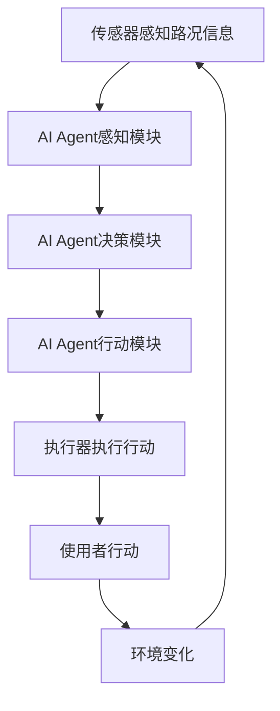

# AI Agent在智能拐杖中的路况分析与导航

> 关键词：AI Agent、智能拐杖、路况分析、导航、人工智能

> 摘要：本文聚焦于AI Agent在智能拐杖中的应用，旨在探讨如何利用AI Agent实现路况分析与导航功能。详细阐述了AI Agent的核心概念、算法原理、数学模型，通过实际案例展示了在智能拐杖中应用的具体实现过程。同时，分析了其实际应用场景，推荐了相关的学习资源、开发工具和论文著作，最后总结了未来发展趋势与挑战，并对常见问题进行了解答。

## 1. 背景介绍 
### 1.1 目的和范围
随着老龄化社会的加剧以及残障人士对出行便利的需求增加，智能拐杖作为一种辅助出行的设备受到了广泛关注。本文的目的是研究如何将AI Agent技术应用于智能拐杖中，实现路况分析与导航功能，为使用者提供更安全、便捷的出行体验。研究范围涵盖了AI Agent的基本原理、在智能拐杖中的具体应用、相关算法和数学模型，以及实际开发和应用中的各个环节。

### 1.2 预期读者
本文的预期读者包括人工智能领域的研究人员、智能硬件开发者、关注智能辅助设备的相关人士，以及对智能拐杖技术感兴趣的普通读者。通过阅读本文，读者可以了解AI Agent在智能拐杖中的应用原理和实现方法，为相关领域的研究和开发提供参考。

### 1.3 文档结构概述
本文首先介绍了背景信息，包括目的、预期读者和文档结构。接着阐述了AI Agent和智能拐杖的核心概念及其联系，给出了原理和架构的示意图和流程图。然后详细讲解了核心算法原理和具体操作步骤，使用Python源代码进行了说明。之后介绍了相关的数学模型和公式，并举例说明。通过实际案例展示了智能拐杖中路况分析与导航功能的实现过程，包括开发环境搭建、源代码实现和代码解读。分析了AI Agent在智能拐杖中的实际应用场景，推荐了学习资源、开发工具和相关论文著作。最后总结了未来发展趋势与挑战，解答了常见问题，并提供了扩展阅读和参考资料。

### 1.4 术语表
#### 1.4.1 核心术语定义
- **AI Agent**：即人工智能代理，是一种能够感知环境、根据感知信息做出决策并执行相应动作的智能实体。在智能拐杖中，AI Agent可以感知路况信息，进行分析和判断，并为使用者提供导航建议。
- **智能拐杖**：一种集成了多种传感器和智能技术的辅助出行设备，旨在为使用者提供路况信息、导航指引等功能，提高出行的安全性和便利性。
- **路况分析**：对道路的各种状况进行识别和评估，包括路面平整度、障碍物、交通状况等，为导航决策提供依据。
- **导航**：根据使用者的目的地和当前路况信息，规划最佳的出行路线，并通过语音、震动等方式引导使用者到达目的地。

#### 1.4.2 相关概念解释
- **传感器融合**：将多种不同类型的传感器（如摄像头、激光雷达、超声波传感器等）获取的数据进行整合和处理，以获得更全面、准确的环境信息。在智能拐杖中，传感器融合可以提高路况分析的准确性。
- **机器学习**：是一门多领域交叉学科，涉及概率论、统计学、逼近论、凸分析、算法复杂度理论等多门学科。它专门研究计算机怎样模拟或实现人类的学习行为，以获取新的知识或技能，重新组织已有的知识结构使之不断改善自身的性能。在智能拐杖中，机器学习可以用于路况分类和导航路线规划。

#### 1.4.3 缩略词列表
- **AI**：Artificial Intelligence，人工智能
- **GPS**：Global Positioning System，全球定位系统
- **IMU**：Inertial Measurement Unit，惯性测量单元

## 2. 核心概念与联系 

### 核心概念原理
AI Agent的核心原理是基于感知、决策和行动的循环过程。在智能拐杖的应用中，AI Agent通过各种传感器（如摄像头、激光雷达、GPS等）感知周围的路况信息，包括道路状况、障碍物位置、自身位置等。然后，AI Agent对这些感知信息进行分析和处理，使用机器学习、深度学习等算法进行路况分类和导航路线规划，做出决策。最后，AI Agent通过语音提示、震动等方式将决策结果传达给使用者，引导使用者进行行动。

智能拐杖则是AI Agent的载体，它集成了多种传感器和执行器，为AI Agent提供了感知环境和执行行动的手段。同时，智能拐杖还需要具备一定的计算能力和电源管理能力，以支持AI Agent的运行。

### 架构的文本示意图
```plaintext
+-------------------+
|      智能拐杖      |
| +---------------+ |
| |   传感器模块   | |
| | （摄像头、激光  | |
| | 雷达、GPS等）  | |
| +---------------+ |
| +---------------+ |
| |    AI Agent    | |
| | （感知、决策、 | |
| |  行动模块）    | |
| +---------------+ |
| +---------------+ |
| |   执行器模块   | |
| | （语音提示、震  | |
| | 动反馈等）    | |
| +---------------+ |
+-------------------+
```

### Mermaid流程图


## 3. 核心算法原理 & 具体操作步骤 

### 核心算法原理
在智能拐杖的路况分析与导航中，常用的核心算法包括目标检测算法、路径规划算法等。

#### 目标检测算法
目标检测算法用于识别道路上的障碍物、行人、车辆等目标。这里以YOLO（You Only Look Once）算法为例进行说明。YOLO算法是一种基于深度学习的目标检测算法，它将目标检测问题转化为一个回归问题，通过一个卷积神经网络直接预测目标的边界框和类别。

#### 路径规划算法
路径规划算法用于根据使用者的目的地和当前路况信息，规划最佳的出行路线。这里以A*算法为例进行说明。A*算法是一种启发式搜索算法，它通过评估每个节点的代价函数来选择最优的路径。代价函数由两部分组成：从起点到当前节点的实际代价 $g(n)$ 和从当前节点到目标节点的估计代价 $h(n)$，即 $f(n) = g(n) + h(n)$。

### 具体操作步骤
#### 步骤1：数据采集
使用摄像头、激光雷达等传感器采集道路的图像和点云数据。

#### 步骤2：数据预处理
对采集到的数据进行预处理，包括图像的裁剪、缩放、归一化，点云数据的滤波、降采样等。

#### 步骤3：目标检测
使用YOLO算法对预处理后的数据进行目标检测，识别出道路上的障碍物、行人、车辆等目标。

#### 步骤4：路径规划
根据目标检测的结果和使用者的目的地，使用A*算法进行路径规划，得到最佳的出行路线。

#### 步骤5：行动执行
将路径规划的结果通过语音提示、震动等方式传达给使用者，引导使用者按照规划的路线行走。

### Python源代码实现
```python
import cv2
import numpy as np
import heapq

# YOLO目标检测类
class YOLODetector:
    def __init__(self, weights_path, config_path, classes_path):
        self.net = cv2.dnn.readNet(weights_path, config_path)
        self.classes = []
        with open(classes_path, 'r') as f:
            self.classes = [line.strip() for line in f.readlines()]
        layer_names = self.net.getLayerNames()
        self.output_layers = [layer_names[i[0] - 1] for i in self.net.getUnconnectedOutLayers()]

    def detect(self, image):
        height, width, channels = image.shape
        blob = cv2.dnn.blobFromImage(image, 0.00392, (416, 416), (0, 0, 0), True, crop=False)
        self.net.setInput(blob)
        outs = self.net.forward(self.output_layers)

        class_ids = []
        confidences = []
        boxes = []
        for out in outs:
            for detection in out:
                scores = detection[5:]
                class_id = np.argmax(scores)
                confidence = scores[class_id]
                if confidence > 0.5:
                    # Object detected
                    center_x = int(detection[0] * width)
                    center_y = int(detection[1] * height)
                    w = int(detection[2] * width)
                    h = int(detection[3] * height)

                    # Rectangle coordinates
                    x = int(center_x - w / 2)
                    y = int(center_y - h / 2)

                    boxes.append([x, y, w, h])
                    confidences.append(float(confidence))
                    class_ids.append(class_id)

        indexes = cv2.dnn.NMSBoxes(boxes, confidences, 0.5, 0.4)
        detected_objects = []
        for i in range(len(boxes)):
            if i in indexes:
                label = str(self.classes[class_ids[i]])
                detected_objects.append(label)

        return detected_objects

# A*路径规划类
class AStarPathPlanning:
    def __init__(self, grid):
        self.grid = grid
        self.rows, self.cols = grid.shape

    def heuristic(self, a, b):
        return abs(a[0] - b[0]) + abs(a[1] - b[1])

    def get_neighbors(self, node):
        neighbors = []
        x, y = node
        for dx, dy in [(0, 1), (0, -1), (1, 0), (-1, 0)]:
            nx, ny = x + dx, y + dy
            if 0 <= nx < self.rows and 0 <= ny < self.cols and self.grid[nx][ny] == 0:
                neighbors.append((nx, ny))
        return neighbors

    def plan(self, start, goal):
        open_list = []
        heapq.heappush(open_list, (0, start))
        came_from = {}
        g_score = {start: 0}
        f_score = {start: self.heuristic(start, goal)}

        while open_list:
            _, current = heapq.heappop(open_list)
            if current == goal:
                path = []
                while current in came_from:
                    path.append(current)
                    current = came_from[current]
                path.append(start)
                path.reverse()
                return path

            for neighbor in self.get_neighbors(current):
                tentative_g_score = g_score[current] + 1
                if neighbor not in g_score or tentative_g_score < g_score[neighbor]:
                    came_from[neighbor] = current
                    g_score[neighbor] = tentative_g_score
                    f_score[neighbor] = tentative_g_score + self.heuristic(neighbor, goal)
                    heapq.heappush(open_list, (f_score[neighbor], neighbor))

        return None


# 主函数
if __name__ == "__main__":
    # 初始化YOLO检测器
    yolo_detector = YOLODetector('yolov3.weights', 'yolov3.cfg', 'coco.names')
    # 读取图像
    image = cv2.imread('road_image.jpg')
    # 进行目标检测
    detected_objects = yolo_detector.detect(image)
    print("Detected objects:", detected_objects)

    # 初始化路径规划器
    grid = np.array([
        [0, 0, 0, 0],
        [0, 1, 0, 0],
        [0, 0, 0, 0],
        [0, 0, 0, 0]
    ])
    path_planner = AStarPathPlanning(grid)
    start = (0, 0)
    goal = (3, 3)
    # 进行路径规划
    path = path_planner.plan(start, goal)
    print("Path:", path)
```

## 4. 数学模型和公式 & 详细讲解 & 举例说明 

### YOLO算法的数学模型和公式
#### 模型结构
YOLO算法的核心是一个卷积神经网络，它将输入的图像划分为 $S \times S$ 个网格，每个网格负责预测 $B$ 个边界框和 $C$ 个类别概率。网络的输出是一个 $S \times S \times (B \times 5 + C)$ 的张量，其中每个网格的输出包含 $B$ 个边界框的坐标 $(x, y, w, h)$ 和置信度 $confidence$，以及 $C$ 个类别概率 $p(c)$。

#### 损失函数
YOLO算法的损失函数由三部分组成：边界框坐标损失、置信度损失和类别概率损失。具体公式如下：

$$
L = \lambda_{coord} \sum_{i=0}^{S^2} \sum_{j=0}^{B} \mathbb{1}_{ij}^{obj} \left[ (x_i - \hat{x}_i)^2 + (y_i - \hat{y}_i)^2 \right] + \\
\lambda_{coord} \sum_{i=0}^{S^2} \sum_{j=0}^{B} \mathbb{1}_{ij}^{obj} \left[ (\sqrt{w_i} - \sqrt{\hat{w}_i})^2 + (\sqrt{h_i} - \sqrt{\hat{h}_i})^2 \right] + \\
\sum_{i=0}^{S^2} \sum_{j=0}^{B} \mathbb{1}_{ij}^{obj} (C_i - \hat{C}_i)^2 + \\
\lambda_{noobj} \sum_{i=0}^{S^2} \sum_{j=0}^{B} \mathbb{1}_{ij}^{noobj} (C_i - \hat{C}_i)^2 + \\
\sum_{i=0}^{S^2} \mathbb{1}_{i}^{obj} \sum_{c \in classes} (p_i(c) - \hat{p}_i(c))^2
$$

其中，$\lambda_{coord}$ 和 $\lambda_{noobj}$ 是权重系数，$\mathbb{1}_{ij}^{obj}$ 表示第 $i$ 个网格的第 $j$ 个边界框是否负责检测目标，$\mathbb{1}_{ij}^{noobj}$ 表示第 $i$ 个网格的第 $j$ 个边界框是否不负责检测目标，$\mathbb{1}_{i}^{obj}$ 表示第 $i$ 个网格是否包含目标。

#### 举例说明
假设输入图像的大小为 $416 \times 416$，$S = 13$，$B = 3$，$C = 80$。则网络的输出是一个 $13 \times 13 \times (3 \times 5 + 80) = 13 \times 13 \times 95$ 的张量。每个网格的输出包含 $3$ 个边界框的坐标 $(x, y, w, h)$ 和置信度 $confidence$，以及 $80$ 个类别概率 $p(c)$。

### A*算法的数学模型和公式
#### 代价函数
A*算法的代价函数 $f(n) = g(n) + h(n)$，其中 $g(n)$ 表示从起点到当前节点 $n$ 的实际代价，$h(n)$ 表示从当前节点 $n$ 到目标节点的估计代价。

#### 启发式函数
常用的启发式函数有曼哈顿距离和欧几里得距离。曼哈顿距离的公式为：

$$
h(n) = |x_n - x_{goal}| + |y_n - y_{goal}|
$$

欧几里得距离的公式为：

$$
h(n) = \sqrt{(x_n - x_{goal})^2 + (y_n - y_{goal})^2}
$$

#### 举例说明
假设地图是一个 $4 \times 4$ 的网格，起点为 $(0, 0)$，目标点为 $(3, 3)$。使用曼哈顿距离作为启发式函数，$g(n)$ 表示从起点到当前节点的步数。则从起点 $(0, 0)$ 到节点 $(1, 0)$ 的 $g(1, 0) = 1$，$h(1, 0) = |1 - 3| + |0 - 3| = 5$，$f(1, 0) = g(1, 0) + h(1, 0) = 6$。

## 5. 项目实战：代码实际案例和详细解释说明 

### 5.1  开发环境搭建
#### 硬件环境
- 智能拐杖开发板，如树莓派。
- 摄像头模块，用于采集道路图像。
- 激光雷达模块，用于获取道路的点云数据。
- GPS模块，用于获取当前位置信息。
- 语音模块，用于语音提示。
- 震动模块，用于震动反馈。

#### 软件环境
- 操作系统：Raspbian（树莓派操作系统）。
- 编程语言：Python 3.x。
- 深度学习框架：OpenCV、TensorFlow、PyTorch等。
- 开发工具：Visual Studio Code、PyCharm等。

### 5.2  源代码详细实现和代码解读
```python
import cv2
import numpy as np
import heapq
import serial
import time

# YOLO目标检测类
class YOLODetector:
    def __init__(self, weights_path, config_path, classes_path):
        self.net = cv2.dnn.readNet(weights_path, config_path)
        self.classes = []
        with open(classes_path, 'r') as f:
            self.classes = [line.strip() for line in f.readlines()]
        layer_names = self.net.getLayerNames()
        self.output_layers = [layer_names[i[0] - 1] for i in self.net.getUnconnectedOutLayers()]

    def detect(self, image):
        height, width, channels = image.shape
        blob = cv2.dnn.blobFromImage(image, 0.00392, (416, 416), (0, 0, 0), True, crop=False)
        self.net.setInput(blob)
        outs = self.net.forward(self.output_layers)

        class_ids = []
        confidences = []
        boxes = []
        for out in outs:
            for detection in out:
                scores = detection[5:]
                class_id = np.argmax(scores)
                confidence = scores[class_id]
                if confidence > 0.5:
                    # Object detected
                    center_x = int(detection[0] * width)
                    center_y = int(detection[1] * height)
                    w = int(detection[2] * width)
                    h = int(detection[3] * height)

                    # Rectangle coordinates
                    x = int(center_x - w / 2)
                    y = int(center_y - h / 2)

                    boxes.append([x, y, w, h])
                    confidences.append(float(confidence))
                    class_ids.append(class_id)

        indexes = cv2.dnn.NMSBoxes(boxes, confidences, 0.5, 0.4)
        detected_objects = []
        for i in range(len(boxes)):
            if i in indexes:
                label = str(self.classes[class_ids[i]])
                detected_objects.append(label)

        return detected_objects

# A*路径规划类
class AStarPathPlanning:
    def __init__(self, grid):
        self.grid = grid
        self.rows, self.cols = grid.shape

    def heuristic(self, a, b):
        return abs(a[0] - b[0]) + abs(a[1] - b[1])

    def get_neighbors(self, node):
        neighbors = []
        x, y = node
        for dx, dy in [(0, 1), (0, -1), (1, 0), (-1, 0)]:
            nx, ny = x + dx, y + dy
            if 0 <= nx < self.rows and 0 <= ny < self.cols and self.grid[nx][ny] == 0:
                neighbors.append((nx, ny))
        return neighbors

    def plan(self, start, goal):
        open_list = []
        heapq.heappush(open_list, (0, start))
        came_from = {}
        g_score = {start: 0}
        f_score = {start: self.heuristic(start, goal)}

        while open_list:
            _, current = heapq.heappop(open_list)
            if current == goal:
                path = []
                while current in came_from:
                    path.append(current)
                    current = came_from[current]
                path.append(start)
                path.reverse()
                return path

            for neighbor in self.get_neighbors(current):
                tentative_g_score = g_score[current] + 1
                if neighbor not in g_score or tentative_g_score < g_score[neighbor]:
                    came_from[neighbor] = current
                    g_score[neighbor] = tentative_g_score
                    f_score[neighbor] = tentative_g_score + self.heuristic(neighbor, goal)
                    heapq.heappush(open_list, (f_score[neighbor], neighbor))

        return None

# 语音提示函数
def voice_prompt(prompt):
    ser = serial.Serial('/dev/ttyUSB0', 9600)
    time.sleep(2)
    ser.write(prompt.encode())
    ser.close()

# 主函数
if __name__ == "__main__":
    # 初始化YOLO检测器
    yolo_detector = YOLODetector('yolov3.weights', 'yolov3.cfg', 'coco.names')
    # 打开摄像头
    cap = cv2.VideoCapture(0)

    while True:
        ret, frame = cap.read()
        if not ret:
            break

        # 进行目标检测
        detected_objects = yolo_detector.detect(frame)
        print("Detected objects:", detected_objects)

        if 'person' in detected_objects:
            voice_prompt("前方有人，请小心")

        # 模拟地图和路径规划
        grid = np.array([
            [0, 0, 0, 0],
            [0, 1, 0, 0],
            [0, 0, 0, 0],
            [0, 0, 0, 0]
        ])
        path_planner = AStarPathPlanning(grid)
        start = (0, 0)
        goal = (3, 3)
        # 进行路径规划
        path = path_planner.plan(start, goal)
        print("Path:", path)

        cv2.imshow('Frame', frame)
        if cv2.waitKey(1) & 0xFF == ord('q'):
            break

    cap.release()
    cv2.destroyAllWindows()
```

### 5.3  代码解读与分析
#### 代码整体功能
该代码实现了智能拐杖中的路况分析与导航功能。通过摄像头采集道路图像，使用YOLO算法进行目标检测，识别出道路上的行人、车辆等目标。如果检测到行人，则通过语音模块发出提示。同时，模拟了地图和路径规划，使用A*算法规划从起点到目标点的路径。

#### 代码详细解读
1. **YOLODetector类**：负责初始化YOLO模型和进行目标检测。`__init__` 方法初始化模型和类别列表，`detect` 方法对输入的图像进行目标检测，返回检测到的目标类别列表。
2. **AStarPathPlanning类**：负责路径规划。`__init__` 方法初始化地图，`heuristic` 方法计算启发式函数值，`get_neighbors` 方法获取当前节点的邻居节点，`plan` 方法使用A*算法进行路径规划。
3. **voice_prompt函数**：负责语音提示。通过串口通信将提示信息发送给语音模块。
4. **主函数**：初始化YOLO检测器和打开摄像头，循环读取摄像头图像，进行目标检测和路径规划。如果检测到行人，则调用 `voice_prompt` 函数进行语音提示。最后释放摄像头资源并关闭窗口。

## 6. 实际应用场景 
### 老年人出行辅助
对于老年人来说，智能拐杖可以帮助他们更好地感知周围的路况信息。在行走过程中，AI Agent可以实时分析道路状况，检测到前方有障碍物、台阶、坑洼等情况时，及时通过语音提示或震动反馈告知老年人，提醒他们注意安全。同时，根据老年人设定的目的地，智能拐杖可以规划最佳的出行路线，引导他们顺利到达目的地。

### 视障人士出行辅助
视障人士在出行时面临着诸多困难，智能拐杖可以成为他们的得力助手。通过摄像头、激光雷达等传感器，AI Agent可以感知周围的环境，识别出道路上的行人、车辆、建筑物等目标，并将这些信息转化为语音提示，帮助视障人士了解周围的情况。在导航方面，智能拐杖可以根据视障人士的起点和终点，规划无障碍的出行路线，并通过语音指令引导他们行走。

### 户外活动探险
在户外活动探险中，智能拐杖可以提供路况分析和导航功能。例如，在山区徒步时，AI Agent可以分析地形、坡度、植被等信息，判断是否适合行走，并规划安全的路线。在森林中，智能拐杖可以识别出野生动物、危险植物等，及时提醒探险者注意安全。

## 7. 工具和资源推荐
### 7.1 学习资源推荐
#### 7.1.1 书籍推荐
- 《人工智能：一种现代的方法》：这本书是人工智能领域的经典教材，全面介绍了人工智能的基本概念、算法和应用。
- 《Python深度学习》：详细介绍了使用Python和深度学习框架进行深度学习开发的方法和技巧。
- 《计算机视觉：算法与应用》：涵盖了计算机视觉的基本算法和应用，包括目标检测、图像分类等。

#### 7.1.2 在线课程
- Coursera上的“人工智能基础”课程：由知名教授授课，系统介绍了人工智能的基础知识和算法。
- edX上的“深度学习专项课程”：深入讲解了深度学习的原理和应用，包括卷积神经网络、循环神经网络等。
- 中国大学MOOC上的“计算机视觉”课程：介绍了计算机视觉的基本概念和算法，提供了丰富的实验和案例。

#### 7.1.3 技术博客和网站
- Medium：上面有很多人工智能领域的技术文章和经验分享。
- Towards Data Science：专注于数据科学和人工智能领域的技术博客，提供了很多实用的教程和案例。
- 机器之心：国内知名的人工智能媒体，报道了人工智能领域的最新技术和研究成果。

### 7.2 开发工具框架推荐
#### 7.2.1 IDE和编辑器
- Visual Studio Code：一款轻量级的代码编辑器，支持多种编程语言和插件，适合快速开发。
- PyCharm：专业的Python集成开发环境，提供了丰富的代码调试、自动补全、代码分析等功能。
- Jupyter Notebook：一种交互式的开发环境，适合进行数据探索和模型实验。

#### 7.2.2 调试和性能分析工具
- TensorBoard：TensorFlow的可视化工具，可以帮助开发者可视化模型的训练过程和性能指标。
- Py-Spy：一个Python性能分析工具，可以分析Python代码的性能瓶颈。
- OpenCV Profiler：OpenCV的性能分析工具，可以分析计算机视觉算法的性能。

#### 7.2.3 相关框架和库
- TensorFlow：一个开源的深度学习框架，提供了丰富的深度学习模型和工具。
- PyTorch：另一个流行的深度学习框架，具有动态图和易于使用的特点。
- OpenCV：一个开源的计算机视觉库，提供了各种计算机视觉算法和工具。

### 7.3 相关论文著作推荐
#### 7.3.1 经典论文
- "You Only Look Once: Unified, Real-Time Object Detection"：YOLO算法的原始论文，介绍了YOLO算法的原理和实现。
- "A* Search Algorithm"：A*算法的经典论文，详细介绍了A*算法的原理和应用。
- "Convolutional Neural Networks for Visual Recognition"：介绍了卷积神经网络在视觉识别中的应用，是深度学习在计算机视觉领域的重要论文。

#### 7.3.2 最新研究成果
- 关注顶级学术会议如CVPR、ICCV、NeurIPS等，这些会议上会发布人工智能领域的最新研究成果。
- 查阅相关学术期刊如Journal of Artificial Intelligence Research、Artificial Intelligence等，获取最新的研究论文。

#### 7.3.3 应用案例分析
- 可以在IEEE Xplore、ACM Digital Library等数据库中搜索智能拐杖、人工智能辅助出行等相关的应用案例分析论文，了解实际应用中的问题和解决方案。

## 8. 总结：未来发展趋势与挑战
### 未来发展趋势
#### 多传感器融合技术的发展
未来的智能拐杖将集成更多种类的传感器，如毫米波雷达、红外传感器等，通过多传感器融合技术，获取更全面、准确的环境信息，提高路况分析的准确性和可靠性。

#### 人工智能算法的不断优化
随着人工智能技术的不断发展，目标检测、路径规划等算法将不断优化，提高算法的性能和效率。例如，使用更先进的深度学习模型，提高目标检测的准确率和速度。

#### 与物联网和云计算的结合
智能拐杖可以与物联网和云计算技术相结合，将采集到的数据上传到云端进行处理和分析，获取更丰富的信息和服务。例如，通过云端的地图数据和交通信息，实时调整导航路线。

### 挑战
#### 传感器精度和可靠性
传感器的精度和可靠性直接影响路况分析的准确性。目前，一些传感器在复杂环境下的性能还不够理想，需要进一步提高传感器的精度和可靠性。

#### 算法的实时性和能耗
在智能拐杖这样的嵌入式设备中，算法的实时性和能耗是需要解决的重要问题。需要优化算法，减少计算量，降低能耗，以保证智能拐杖的续航能力和实时响应能力。

#### 数据隐私和安全
智能拐杖采集的用户数据涉及到个人隐私和安全问题。需要采取有效的数据加密和安全措施，保护用户的数据隐私和安全。

## 9. 附录：常见问题与解答
### 问题1：智能拐杖的续航能力如何？
解答：智能拐杖的续航能力取决于电池容量和设备的功耗。一般来说，通过优化算法、降低传感器的功耗等措施，可以提高智能拐杖的续航能力。一些智能拐杖的续航时间可以达到数天甚至数周。

### 问题2：智能拐杖在复杂环境下的性能如何？
解答：在复杂环境下，智能拐杖的性能会受到一定的影响。例如，在光线不足、天气恶劣等情况下，摄像头和激光雷达的性能可能会下降。为了提高智能拐杖在复杂环境下的性能，可以采用多传感器融合技术，综合利用不同传感器的优势。

### 问题3：智能拐杖的成本高吗？
解答：智能拐杖的成本取决于其功能和配置。一些基本功能的智能拐杖成本相对较低，而具备高级功能（如高精度传感器、强大的计算能力）的智能拐杖成本可能会较高。随着技术的发展和规模的扩大，智能拐杖的成本有望逐渐降低。

## 10. 扩展阅读 & 参考资料
### 扩展阅读
- 《智能硬件开发实战》：介绍了智能硬件开发的流程和方法，对于智能拐杖的开发有一定的参考价值。
- 《人工智能前沿技术》：探讨了人工智能领域的前沿技术和发展趋势，有助于了解AI Agent在智能拐杖中的未来应用方向。

### 参考资料
- YOLO官方网站：https://pjreddie.com/darknet/yolo/
- OpenCV官方文档：https://docs.opencv.org/
- TensorFlow官方文档：https://www.tensorflow.org/

作者：AI天才研究院/AI Genius Institute & 禅与计算机程序设计艺术 /Zen And The Art of Computer Programming