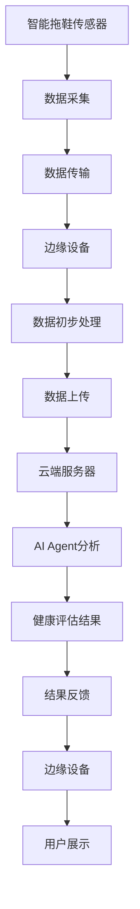

# AI Agent在智能拖鞋中的足部健康分析

> 关键词：AI Agent、智能拖鞋、足部健康分析、传感器技术、数据分析

> 摘要：本文聚焦于AI Agent在智能拖鞋中的足部健康分析应用。首先介绍了该研究的背景、目的、预期读者、文档结构和相关术语。接着阐述了核心概念，包括AI Agent和智能拖鞋的原理及联系，并给出了示意图和流程图。详细讲解了核心算法原理及具体操作步骤，运用Python代码进行说明。探讨了相关数学模型和公式，并举例分析。通过项目实战展示了开发环境搭建、源代码实现与解读。分析了实际应用场景，推荐了学习资源、开发工具框架和相关论文著作。最后总结了未来发展趋势与挑战，解答常见问题并提供扩展阅读和参考资料，旨在为智能拖鞋的足部健康分析提供全面深入的技术指导。

## 1. 背景介绍 
### 1.1 目的和范围
随着人们对健康关注度的不断提高，足部健康作为整体健康的重要组成部分，越来越受到重视。传统的足部健康检测往往需要专业的设备和人员，不够便捷和普及。智能拖鞋作为一种可穿戴设备，具有实时、便捷的特点，能够持续监测足部的相关数据。本研究的目的是将AI Agent引入智能拖鞋中，实现对足部健康的有效分析。范围涵盖了从数据采集、传输、处理到分析的整个过程，旨在为用户提供准确的足部健康评估和建议。

### 1.2 预期读者
本文的预期读者包括对人工智能、可穿戴设备、健康监测等领域感兴趣的研究人员、开发者、学生以及关注足部健康的普通用户。研究人员可以从中获取关于AI Agent在足部健康分析方面的最新研究思路和方法；开发者可以借鉴代码实现和系统架构，进行相关产品的开发；学生可以了解跨学科知识的应用；普通用户可以了解智能拖鞋的工作原理和对足部健康的益处。

### 1.3 文档结构概述
本文将按照以下结构进行阐述：首先介绍相关背景知识，包括目的、读者和文档结构；接着讲解核心概念，包括AI Agent和智能拖鞋的原理及联系；然后详细说明核心算法原理和具体操作步骤，用Python代码实现；再探讨相关数学模型和公式，并举例说明；通过项目实战展示开发环境搭建、源代码实现和解读；分析实际应用场景；推荐学习资源、开发工具框架和相关论文著作；最后总结未来发展趋势与挑战，解答常见问题并提供扩展阅读和参考资料。

### 1.4 术语表
#### 1.4.1 核心术语定义
- **AI Agent**：人工智能代理，是一种能够感知环境、自主决策并采取行动以实现特定目标的智能实体。在本文中，AI Agent用于处理和分析智能拖鞋采集到的足部数据。
- **智能拖鞋**：集成了各种传感器（如压力传感器、温度传感器等），能够采集足部相关数据，并通过无线通信技术将数据传输到外部设备的拖鞋。
- **足部健康分析**：通过对足部的压力分布、温度变化、运动轨迹等数据进行分析，评估足部的健康状况，如是否存在足底筋膜炎、扁平足等问题。

#### 1.4.2 相关概念解释
- **传感器技术**：用于采集物理量（如压力、温度、加速度等）并将其转换为电信号的技术。在智能拖鞋中，传感器是数据采集的关键部件。
- **数据分析**：对采集到的数据进行清洗、预处理、特征提取和模型训练等操作，以发现数据中的规律和信息。在足部健康分析中，数据分析可以帮助判断足部的健康状况。
- **机器学习算法**：一类让计算机通过数据学习模式和规律的算法。在AI Agent中，机器学习算法用于对足部数据进行分类、预测等任务。

#### 1.4.3 缩略词列表
- **AI**：Artificial Intelligence，人工智能
- **IoT**：Internet of Things，物联网
- **ML**：Machine Learning，机器学习

## 2. 核心概念与联系 
### 核心概念原理
#### AI Agent原理
AI Agent通常由感知模块、决策模块和执行模块组成。感知模块负责收集环境信息，在智能拖鞋中，感知模块接收来自各种传感器的数据。决策模块根据感知到的信息，运用机器学习算法进行分析和判断，得出关于足部健康的结论。执行模块则根据决策结果采取相应的行动，如向用户发送健康提示或建议。

#### 智能拖鞋原理
智能拖鞋集成了多种传感器，如压力传感器用于测量足部各部位的压力分布，温度传感器用于检测足部的温度变化。这些传感器将采集到的模拟信号转换为数字信号，通过无线通信模块（如蓝牙、Wi-Fi等）将数据传输到外部设备（如智能手机、平板电脑等）。外部设备上的应用程序可以对数据进行进一步的处理和分析。

### 架构的文本示意图
智能拖鞋的整体架构可以描述为：智能拖鞋作为数据采集端，通过传感器收集足部数据，然后将数据传输到边缘设备（如智能手机）进行初步处理。边缘设备将处理后的数据上传到云端服务器，云端服务器上的AI Agent对数据进行深度分析，得出足部健康评估结果，并将结果反馈给边缘设备，最终呈现给用户。

### Mermaid流程图


## 3. 核心算法原理 & 具体操作步骤 
### 核心算法原理
在AI Agent对足部健康进行分析时，常用的机器学习算法包括决策树、支持向量机和神经网络等。这里以决策树算法为例进行讲解。决策树是一种基于树结构进行决策的算法，它通过对数据的特征进行划分，构建一棵决策树，每个内部节点表示一个特征上的测试，每个分支表示一个测试输出，每个叶节点表示一个类别或值。

### 具体操作步骤
#### 数据预处理
首先，对采集到的足部数据进行清洗，去除噪声和异常值。然后进行特征提取，选择与足部健康相关的特征，如压力最大值、压力平均值、温度变化范围等。

#### 模型训练
将预处理后的数据分为训练集和测试集。使用训练集对决策树模型进行训练，通过不断调整模型的参数，使模型的准确率达到最优。

#### 模型评估
使用测试集对训练好的模型进行评估，计算模型的准确率、召回率等指标，评估模型的性能。

#### 健康分析
将新采集到的足部数据输入到训练好的模型中，模型根据决策树的规则进行判断，得出足部健康的评估结果。

### Python源代码实现
```python
import pandas as pd
from sklearn.model_selection import train_test_split
from sklearn.tree import DecisionTreeClassifier
from sklearn.metrics import accuracy_score

# 读取数据
data = pd.read_csv('foot_health_data.csv')

# 特征提取
X = data.drop('health_status', axis=1)
y = data['health_status']

# 数据划分
X_train, X_test, y_train, y_test = train_test_split(X, y, test_size=0.2, random_state=42)

# 模型训练
model = DecisionTreeClassifier()
model.fit(X_train, y_train)

# 模型预测
y_pred = model.predict(X_test)

# 模型评估
accuracy = accuracy_score(y_test, y_pred)
print(f"模型准确率: {accuracy}")

# 新数据预测
new_data = pd.DataFrame({
    'pressure_max': [100],
    'pressure_avg': [50],
    'temperature_range': [5]
})
new_prediction = model.predict(new_data)
print(f"新数据预测结果: {new_prediction}")
```

## 4. 数学模型和公式 & 详细讲解 & 举例说明 
### 信息熵公式
在决策树算法中，常用信息熵来衡量数据的不确定性。信息熵的公式为：
$$H(X) = -\sum_{i=1}^{n} p(x_i) \log_2 p(x_i)$$
其中，$X$ 是一个离散随机变量，$p(x_i)$ 是 $X$ 取值为 $x_i$ 的概率，$n$ 是 $X$ 的取值个数。

### 详细讲解
信息熵的值越大，说明数据的不确定性越大。在决策树的节点划分中，我们希望通过选择合适的特征，使得划分后子节点的信息熵尽可能小，即数据的纯度尽可能高。

### 举例说明
假设我们有一个数据集，其中包含两种足部健康状态：健康和不健康。数据集中健康样本有 60 个，不健康样本有 40 个。则健康状态的概率 $p(健康) = \frac{60}{100} = 0.6$，不健康状态的概率 $p(不健康) = \frac{40}{100} = 0.4$。根据信息熵公式，该数据集的信息熵为：
$$H(X) = - (0.6 \log_2 0.6 + 0.4 \log_2 0.4) \approx 0.971$$

### 信息增益公式
信息增益是指在划分数据集前后信息熵的减少量，用于衡量一个特征对数据集划分的有效性。信息增益的公式为：
$$Gain(S, A) = H(S) - \sum_{v \in Values(A)} \frac{|S_v|}{|S|} H(S_v)$$
其中，$S$ 是数据集，$A$ 是特征，$Values(A)$ 是特征 $A$ 的取值集合，$S_v$ 是 $S$ 中特征 $A$ 取值为 $v$ 的子集，$|S|$ 表示数据集 $S$ 的样本数量，$|S_v|$ 表示子集 $S_v$ 的样本数量。

### 详细讲解
信息增益越大，说明使用该特征划分数据集后，数据的纯度提高得越多，该特征对数据集的划分越有效。在决策树的构建过程中，我们通常选择信息增益最大的特征作为当前节点的划分特征。

### 举例说明
假设我们有一个特征“压力最大值”，该特征有两个取值：高和低。根据“压力最大值”对上述数据集进行划分后，“压力最大值”为高的子集中健康样本有 30 个，不健康样本有 10 个；“压力最大值”为低的子集中健康样本有 30 个，不健康样本有 30 个。则“压力最大值”为高的子集的信息熵为：
$$H(S_{高}) = - (\frac{30}{40} \log_2 \frac{30}{40} + \frac{10}{40} \log_2 \frac{10}{40}) \approx 0.811$$
“压力最大值”为低的子集的信息熵为：
$$H(S_{低}) = - (\frac{30}{60} \log_2 \frac{30}{60} + \frac{30}{60} \log_2 \frac{30}{60}) = 1$$
根据信息增益公式，“压力最大值”特征的信息增益为：
$$Gain(S, 压力最大值) = 0.971 - (\frac{40}{100} \times 0.811 + \frac{60}{100} \times 1) \approx 0.126$$

## 5. 项目实战：代码实际案例和详细解释说明 
### 5.1  开发环境搭建
#### 硬件环境
- 智能拖鞋：选择集成了压力传感器、温度传感器等多种传感器的智能拖鞋，确保传感器的精度和稳定性。
- 边缘设备：如智能手机或平板电脑，具备蓝牙或Wi-Fi通信功能，用于接收智能拖鞋传输的数据。
- 服务器：可以选择云服务器（如阿里云、腾讯云等）或本地服务器，用于部署AI Agent和存储数据。

#### 软件环境
- 操作系统：边缘设备可以使用Android或iOS系统，服务器可以使用Linux系统（如Ubuntu、CentOS等）。
- 开发语言：Python，用于实现AI Agent的算法和数据处理。
- 开发框架：使用Scikit-learn库进行机器学习模型的开发，Flask框架用于搭建Web服务。

### 5.2  源代码详细实现和代码解读
#### 数据采集与传输
智能拖鞋通过传感器采集足部数据，并使用蓝牙将数据传输到边缘设备。以下是一个简单的Python代码示例，用于模拟数据采集和传输：
```python
import random
import time
import bluetooth

# 模拟传感器数据采集
def collect_data():
    pressure_max = random.randint(80, 120)
    pressure_avg = random.randint(40, 60)
    temperature_range = random.randint(3, 7)
    return pressure_max, pressure_avg, temperature_range

# 蓝牙数据传输
def send_data(data):
    server_sock = bluetooth.BluetoothSocket(bluetooth.RFCOMM)
    server_sock.bind(("", bluetooth.PORT_ANY))
    server_sock.listen(1)

    port = server_sock.getsockname()[1]

    uuid = "1e0ca4ea-299d-4335-93eb-27fcfe7fa848"

    bluetooth.advertise_service(server_sock, "SampleServer", service_id=uuid,
                                service_classes=[uuid, bluetooth.SERIAL_PORT_CLASS],
                                profiles=[bluetooth.SERIAL_PORT_PROFILE])

    print(f"Waiting for connection on RFCOMM channel {port}")

    client_sock, client_info = server_sock.accept()
    print(f"Accepted connection from {client_info}")

    try:
        client_sock.send(str(data))
    except OSError:
        pass

    print("Disconnected.")

    client_sock.close()
    server_sock.close()

while True:
    data = collect_data()
    send_data(data)
    time.sleep(5)
```
代码解读：`collect_data` 函数用于模拟传感器采集足部数据，生成随机的压力最大值、压力平均值和温度变化范围。`send_data` 函数使用蓝牙将采集到的数据发送到边缘设备。通过循环不断采集和发送数据，每隔 5 秒发送一次。

#### 数据处理与分析
边缘设备接收到数据后，对数据进行初步处理，并将数据上传到云端服务器。以下是一个简单的Python代码示例，用于数据处理和上传：
```python
import bluetooth
import requests

# 蓝牙数据接收
def receive_data():
    client_sock = bluetooth.BluetoothSocket(bluetooth.RFCOMM)
    client_sock.connect(("XX:XX:XX:XX:XX:XX", 1))  # 替换为智能拖鞋的蓝牙地址

    data = client_sock.recv(1024)
    client_sock.close()

    return eval(data)

# 数据上传
def upload_data(data):
    url = "http://your_server_address/api/upload"
    headers = {'Content-Type': 'application/json'}
    response = requests.post(url, json=data, headers=headers)
    return response.status_code

while True:
    data = receive_data()
    status_code = upload_data(data)
    print(f"数据上传状态码: {status_code}")
```
代码解读：`receive_data` 函数使用蓝牙接收智能拖鞋发送的数据。`upload_data` 函数将接收到的数据以JSON格式上传到云端服务器的指定API接口。通过循环不断接收和上传数据。

#### 云端服务器处理
云端服务器接收到数据后，使用AI Agent对数据进行分析，得出足部健康评估结果。以下是一个简单的Python代码示例，用于云端服务器的处理：
```python
from flask import Flask, request, jsonify
import pandas as pd
from sklearn.tree import DecisionTreeClassifier

app = Flask(__name__)

# 加载模型
model = DecisionTreeClassifier()
data = pd.read_csv('foot_health_data.csv')
X = data.drop('health_status', axis=1)
y = data['health_status']
model.fit(X, y)

@app.route('/api/upload', methods=['POST'])
def upload():
    data = request.get_json()
    new_data = pd.DataFrame([data])
    prediction = model.predict(new_data)
    result = {'health_status': prediction[0]}
    return jsonify(result)

if __name__ == '__main__':
    app.run(debug=True)
```
代码解读：使用Flask框架搭建Web服务，定义了一个 `/api/upload` 的API接口，用于接收边缘设备上传的数据。在接口中，将接收到的数据转换为DataFrame格式，使用训练好的决策树模型进行预测，将预测结果以JSON格式返回给边缘设备。

### 5.3  代码解读与分析
#### 数据采集与传输部分
在数据采集与传输部分，通过模拟传感器数据和蓝牙通信，实现了足部数据的采集和发送。蓝牙通信是一种常见的短距离无线通信方式，适用于智能拖鞋与边缘设备之间的数据传输。在实际应用中，需要根据智能拖鞋的具体型号和蓝牙协议进行相应的调整。

#### 数据处理与分析部分
数据处理与分析部分主要负责接收数据、初步处理和上传。边缘设备接收到数据后，需要对数据进行清洗和格式转换，以确保数据的准确性和一致性。上传数据时，使用HTTP协议将数据发送到云端服务器，方便后续的深度分析。

#### 云端服务器处理部分
云端服务器使用Flask框架搭建Web服务，接收边缘设备上传的数据。使用训练好的决策树模型对数据进行预测，得出足部健康评估结果。Flask是一个轻量级的Web框架，易于上手和部署，适合快速开发Web服务。

## 6. 实际应用场景 
### 个人健康监测
对于普通用户来说，智能拖鞋可以作为一种日常的健康监测工具。用户可以通过智能拖鞋实时了解自己的足部健康状况，如压力分布是否均匀、温度是否正常等。如果发现异常情况，及时采取措施进行调整，预防足部疾病的发生。

### 医疗康复
在医疗康复领域，智能拖鞋可以为医生提供患者足部康复的详细数据。医生可以根据智能拖鞋采集到的数据，了解患者的康复进度，调整康复方案。例如，对于足底筋膜炎患者，医生可以通过监测患者足部的压力分布变化，判断康复治疗的效果。

### 运动训练
对于运动员和运动爱好者来说，智能拖鞋可以帮助他们优化运动训练。通过分析足部在运动过程中的压力分布和运动轨迹，运动员可以了解自己的运动姿势是否正确，是否存在过度用力等问题。教练可以根据这些数据，为运动员制定个性化的训练计划，提高运动效果和减少运动损伤的风险。

### 老年人护理
老年人的足部健康问题较为常见，如扁平足、关节炎等。智能拖鞋可以实时监测老年人的足部健康状况，及时发现异常情况并通知家属或护理人员。同时，智能拖鞋还可以记录老年人的行走步数、活动时间等信息，帮助家属了解老年人的日常活动情况。

## 7. 工具和资源推荐
### 7.1 学习资源推荐
#### 7.1.1 书籍推荐
- 《机器学习》（周志华著）：全面介绍了机器学习的基本概念、算法和应用，是机器学习领域的经典教材。
- 《Python数据分析实战》（Sebastian Raschka著）：详细讲解了使用Python进行数据分析的方法和技巧，包括数据处理、可视化和机器学习等方面。
- 《人工智能：一种现代的方法》（Stuart Russell、Peter Norvig著）：系统阐述了人工智能的基本原理、算法和应用，是人工智能领域的权威著作。

#### 7.1.2 在线课程
- Coursera上的“机器学习”课程（Andrew Ng教授授课）：该课程是机器学习领域的经典在线课程，通过视频讲解、编程作业和测验等方式，帮助学员掌握机器学习的基本概念和算法。
- edX上的“人工智能基础”课程：全面介绍了人工智能的基本概念、算法和应用，包括搜索算法、机器学习、自然语言处理等方面。
- 中国大学MOOC上的“Python语言程序设计”课程：适合初学者学习Python语言，课程内容包括Python的基本语法、数据结构、函数和面向对象编程等方面。

#### 7.1.3 技术博客和网站
- 博客园：提供了大量的技术文章和博客，涵盖了人工智能、机器学习、数据分析等多个领域。
- 知乎：一个知识分享平台，用户可以在上面提问、回答问题，获取关于人工智能和智能拖鞋的最新信息和技术讨论。
- GitHub：全球最大的开源代码托管平台，上面有许多与人工智能和智能拖鞋相关的开源项目，可以学习和参考。

### 7.2 开发工具框架推荐
#### 7.2.1 IDE和编辑器
- PyCharm：一款专业的Python集成开发环境，提供了代码编辑、调试、版本控制等功能，适合Python开发。
- Visual Studio Code：一款轻量级的代码编辑器，支持多种编程语言，通过安装插件可以实现Python开发的各种功能。
- Jupyter Notebook：一种交互式的开发环境，适合进行数据分析和机器学习的实验和演示。

#### 7.2.2 调试和性能分析工具
- PDB：Python自带的调试工具，可以帮助开发者调试Python代码，查找和解决代码中的问题。
- cProfile：Python的性能分析工具，可以分析代码的运行时间和函数调用情况，帮助开发者优化代码性能。
- TensorBoard：TensorFlow的可视化工具，可以用于可视化机器学习模型的训练过程和性能指标。

#### 7.2.3 相关框架和库
- Scikit-learn：一个简单易用的机器学习库，提供了各种机器学习算法和工具，如分类、回归、聚类等。
- TensorFlow：一个开源的机器学习框架，广泛应用于深度学习领域，提供了丰富的深度学习模型和工具。
- Keras：一个高级神经网络API，基于TensorFlow、Theano等后端，易于上手和使用，适合快速开发深度学习模型。

### 7.3 相关论文著作推荐
#### 7.3.1 经典论文
- “A Decision-Theoretic Generalization of On-Line Learning and an Application to Boosting”（Yoav Freund、Robert E. Schapire著）：介绍了提升算法的基本原理和应用，是机器学习领域的经典论文。
- “Gradient-Based Learning Applied to Document Recognition”（Yann LeCun、Léon Bottou、Yoshua Bengio、Patrick Haffner著）：介绍了卷积神经网络在文档识别中的应用，是深度学习领域的经典论文。
- “The Elements of Statistical Learning: Data Mining, Inference, and Prediction”（Trevor Hastie、Robert Tibshirani、Jerome Friedman著）：系统阐述了统计学习的基本原理和方法，是统计学习领域的经典著作。

#### 7.3.2 最新研究成果
- 可以关注顶级学术会议（如NeurIPS、ICML、CVPR等）和期刊（如Journal of Artificial Intelligence Research、Artificial Intelligence等）上的最新研究成果，了解AI Agent在足部健康分析领域的最新进展。

#### 7.3.3 应用案例分析
- 可以参考一些实际的智能拖鞋产品的应用案例分析，了解它们的技术实现和市场应用情况。例如，小米智能拖鞋、华为智能拖鞋等产品的相关分析报告。

## 8. 总结：未来发展趋势与挑战
### 未来发展趋势
#### 多传感器融合
未来的智能拖鞋将集成更多种类的传感器，如加速度传感器、陀螺仪等，实现多传感器融合。通过融合多种传感器的数据，可以更全面、准确地了解足部的运动状态和健康状况。

#### 个性化健康评估
随着人工智能技术的不断发展，AI Agent可以根据用户的个人信息（如年龄、性别、运动习惯等）和历史数据，为用户提供个性化的足部健康评估和建议。例如，为不同年龄段的用户制定不同的运动计划和康复方案。

#### 与其他设备的互联互通
智能拖鞋将与其他可穿戴设备（如智能手环、智能手表等）和智能家居设备实现互联互通。通过数据共享和协同工作，为用户提供更全面的健康管理服务。例如，当智能拖鞋检测到用户的足部健康出现异常时，自动通知智能手环提醒用户。

#### 云边协同计算
为了提高数据处理的效率和响应速度，未来的智能拖鞋将采用云边协同计算的模式。边缘设备负责对采集到的数据进行初步处理和分析，云端服务器负责对大量数据进行深度分析和模型训练。通过云边协同计算，可以实现数据的实时处理和高效利用。

### 挑战
#### 数据安全和隐私保护
智能拖鞋采集到的足部数据包含了用户的个人健康信息，数据安全和隐私保护至关重要。需要采用先进的加密技术和安全机制，确保数据在传输和存储过程中的安全性和隐私性。

#### 传感器精度和稳定性
传感器的精度和稳定性直接影响到智能拖鞋采集数据的准确性和可靠性。需要不断提高传感器的技术水平，降低传感器的误差和噪声，确保传感器能够长期稳定地工作。

#### 算法的准确性和可解释性
AI Agent所使用的算法需要具备较高的准确性和可解释性。在实际应用中，用户不仅关心算法的预测结果，还希望了解算法是如何得出这些结果的。因此，需要研究和开发更加准确、可解释的算法。

#### 市场推广和用户接受度
智能拖鞋作为一种新兴的产品，市场推广和用户接受度是一个挑战。需要加强市场宣传和推广，提高用户对智能拖鞋的认知度和信任度。同时，需要不断优化产品的功能和体验，满足用户的需求。

## 9. 附录：常见问题与解答
### 智能拖鞋的电池续航能力如何？
智能拖鞋的电池续航能力取决于多种因素，如传感器的功耗、数据传输频率、电池容量等。一般来说，智能拖鞋的电池续航时间在几天到几周不等。为了延长电池续航时间，可以优化传感器的工作模式，降低数据传输频率，使用高容量的电池等。

### 智能拖鞋的数据传输是否稳定？
智能拖鞋的数据传输稳定性取决于通信技术和环境条件。目前，智能拖鞋常用的通信技术包括蓝牙和Wi-Fi。在正常的环境条件下，蓝牙和Wi-Fi的通信稳定性较高。但在信号干扰较强的环境中，可能会出现数据传输中断或丢失的情况。为了提高数据传输的稳定性，可以采用多通道通信、信号增强等技术。

### 智能拖鞋的足部健康分析结果是否准确？
智能拖鞋的足部健康分析结果的准确性取决于多个因素，如传感器的精度、算法的准确性、数据的质量等。目前，智能拖鞋的足部健康分析技术还处于发展阶段，分析结果可能存在一定的误差。为了提高分析结果的准确性，需要不断优化传感器技术和算法，提高数据的质量。

### 智能拖鞋是否适合所有人群使用？
智能拖鞋一般适合大多数人群使用，但对于一些特殊人群（如足部有严重疾病、皮肤过敏等），在使用前应咨询医生的意见。同时，智能拖鞋的尺寸和舒适度也需要根据个人需求进行选择。

## 10. 扩展阅读 & 参考资料
### 扩展阅读
- 《可穿戴设备：从设计到应用》：深入介绍了可穿戴设备的设计原理、技术实现和应用场景，对智能拖鞋的开发和应用有一定的参考价值。
- 《人工智能与健康医疗》：探讨了人工智能在健康医疗领域的应用和发展趋势，包括疾病诊断、健康管理等方面，为AI Agent在足部健康分析中的应用提供了更广阔的视角。

### 参考资料
- 相关的学术论文和研究报告，如IEEE Transactions on Biomedical Engineering、ACM Transactions on Intelligent Systems and Technology等期刊上的论文。
- 智能拖鞋产品的官方文档和技术资料，如小米智能拖鞋、华为智能拖鞋等产品的官方网站。
- 行业标准和规范，如ISO/IEC 27001（信息安全管理体系标准）、IEEE 802.15.1（蓝牙标准）等。

作者：AI天才研究院/AI Genius Institute & 禅与计算机程序设计艺术 /Zen And The Art of Computer Programming