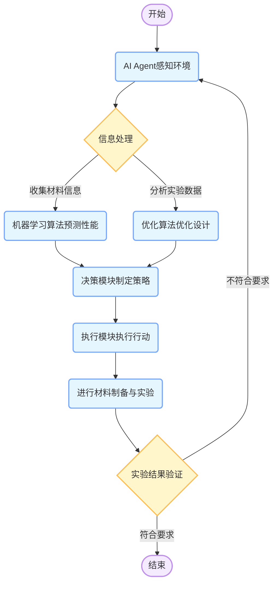

# AI Agent在智能材料设计中的实践

> 关键词：AI Agent、智能材料设计、材料特性预测、自动化设计流程、机器学习算法

> 摘要：本文聚焦于AI Agent在智能材料设计领域的实践应用。首先介绍了AI Agent和智能材料设计的背景知识，阐述了两者结合的目的和范围。接着深入剖析了AI Agent的核心概念、架构以及其与智能材料设计的联系，并通过Mermaid流程图直观展示。详细讲解了相关核心算法原理，结合Python源代码进行说明，同时给出了对应的数学模型和公式。通过项目实战案例，从开发环境搭建到源代码实现及解读，全面展示了AI Agent在智能材料设计中的具体应用。探讨了实际应用场景，推荐了学习、开发所需的工具和资源，最后总结了未来发展趋势与挑战，并对常见问题进行解答，为该领域的研究和实践提供了全面而深入的参考。

## 1. 背景介绍 
### 1.1 目的和范围
随着科技的不断发展，智能材料在航空航天、生物医学、电子信息等众多领域展现出巨大的应用潜力。传统的材料设计方法依赖于经验和大量的实验，不仅耗时耗力，而且难以快速探索广阔的材料空间以发现具有优异性能的新材料。AI Agent作为一种能够自主感知环境、做出决策并执行行动的智能实体，为智能材料设计带来了新的思路和方法。

本文的目的在于深入探讨AI Agent在智能材料设计中的实践应用，涵盖从基础概念到实际项目实施的全过程。具体范围包括AI Agent的核心原理、与智能材料设计的结合方式、相关算法和数学模型、实际项目案例分析以及未来发展趋势等方面。

### 1.2 预期读者
本文预期读者包括材料科学领域的研究人员、人工智能领域的工程师和开发者、对智能材料设计和AI技术融合感兴趣的科研工作者以及相关专业的学生。对于希望了解如何利用AI Agent加速智能材料设计过程、提高设计效率和准确性的读者具有较高的参考价值。

### 1.3 文档结构概述
本文将按照以下结构进行组织：
- 核心概念与联系：介绍AI Agent和智能材料设计的核心概念，以及它们之间的联系，并通过示意图和流程图进行直观展示。
- 核心算法原理 & 具体操作步骤：详细讲解AI Agent在智能材料设计中常用的核心算法原理，并给出Python源代码示例。
- 数学模型和公式 & 详细讲解 & 举例说明：阐述相关的数学模型和公式，结合实际例子进行详细解释。
- 项目实战：代码实际案例和详细解释说明：通过一个具体的项目案例，介绍开发环境搭建、源代码实现和代码解读。
- 实际应用场景：探讨AI Agent在智能材料设计中的实际应用场景。
- 工具和资源推荐：推荐学习和开发所需的工具和资源，包括书籍、在线课程、开发工具、框架和相关论文。
- 总结：未来发展趋势与挑战：总结AI Agent在智能材料设计中的发展趋势和面临的挑战。
- 附录：常见问题与解答：对常见问题进行解答。
- 扩展阅读 & 参考资料：提供扩展阅读的建议和参考资料列表。

### 1.4 术语表
#### 1.4.1 核心术语定义
- **AI Agent（人工智能代理）**：是一种能够感知环境、根据感知信息做出决策并执行相应行动的智能实体。它可以自主地与环境进行交互，以实现特定的目标。
- **智能材料设计**：利用先进的计算方法和技术，结合材料科学的知识，对材料的结构和性能进行预测和优化，以设计出具有特定性能的新型材料。
- **材料特性预测**：通过分析材料的成分、结构等信息，预测材料的物理、化学和力学等特性。
- **自动化设计流程**：借助计算机程序和算法，实现材料设计过程的自动化，减少人工干预，提高设计效率。

#### 1.4.2 相关概念解释
- **机器学习**：是一门多领域交叉学科，涉及概率论、统计学、逼近论、凸分析、算法复杂度理论等多门学科。它专门研究计算机怎样模拟或实现人类的学习行为，以获取新的知识或技能，重新组织已有的知识结构使之不断改善自身的性能。
- **深度学习**：是机器学习的一个分支领域，它是一种基于对数据进行表征学习的方法。深度学习通过构建具有很多层的神经网络模型，自动从数据中学习特征和模式。
- **强化学习**：是一类机器学习算法，智能体（Agent）通过与环境进行交互，根据环境反馈的奖励信号来学习最优的行为策略，以最大化长期累积奖励。

#### 1.4.3 缩略词列表
- **ML（Machine Learning）**：机器学习
- **DL（Deep Learning）**：深度学习
- **RL（Reinforcement Learning）**：强化学习
- **ANN（Artificial Neural Network）**：人工神经网络
- **CNN（Convolutional Neural Network）**：卷积神经网络
- **RNN（Recurrent Neural Network）**：循环神经网络

## 2. 核心概念与联系 

### 2.1 AI Agent核心概念
AI Agent是一个能够自主感知环境、处理信息、做出决策并执行行动的智能实体。它通常由感知模块、决策模块和执行模块组成。感知模块负责收集环境信息，决策模块根据感知到的信息进行分析和推理，制定相应的行动策略，执行模块则将决策转化为具体的行动。

### 2.2 智能材料设计核心概念
智能材料设计旨在通过对材料的成分、结构和制备工艺进行优化，以实现材料特定性能的提升。传统的材料设计方法主要依赖于实验和经验，而智能材料设计则借助计算机模拟、机器学习等技术，能够快速、准确地预测材料的性能，并筛选出具有潜在应用价值的材料。

### 2.3 AI Agent与智能材料设计的联系
AI Agent可以在智能材料设计中发挥重要作用。通过感知材料设计过程中的各种信息，如材料成分、实验数据、性能指标等，AI Agent能够利用机器学习和优化算法，快速分析和处理这些信息，做出合理的决策，如选择合适的材料成分、优化制备工艺等。同时，AI Agent还可以根据设计结果进行实验验证，并根据实验反馈不断调整设计策略，实现材料设计的自动化和智能化。

### 2.4 文本示意图
```plaintext
AI Agent
|
|-- 感知模块
|    |-- 收集材料成分信息
|    |-- 收集实验数据
|    |-- 收集性能指标信息
|
|-- 决策模块
|    |-- 机器学习算法
|    |    |-- 预测材料性能
|    |    |-- 优化材料设计
|    |-- 优化算法
|    |    |-- 选择最优材料成分
|    |    |-- 确定最佳制备工艺
|
|-- 执行模块
|    |-- 指导实验操作
|    |-- 调整设计参数
|    |-- 进行材料制备

智能材料设计
|
|-- 材料成分设计
|    |-- 根据AI Agent决策选择成分
|
|-- 制备工艺优化
|    |-- 根据AI Agent决策确定工艺
|
|-- 性能预测与验证
|    |-- 利用AI Agent预测性能
|    |-- 通过实验验证性能
```

### 2.5 Mermaid流程图


## 3. 核心算法原理 & 具体操作步骤 

### 3.1 机器学习算法原理
在智能材料设计中，常用的机器学习算法包括线性回归、决策树、支持向量机和神经网络等。下面以线性回归为例，详细讲解其原理和具体操作步骤。

#### 3.1.1 线性回归原理
线性回归是一种用于建立自变量和因变量之间线性关系的统计模型。假设我们有一组数据集 $\{(x_1, y_1), (x_2, y_2), \cdots, (x_n, y_n)\}$，其中 $x_i$ 是自变量，$y_i$ 是因变量。线性回归模型的目标是找到一条直线 $y = \theta_0 + \theta_1x$，使得预测值 $\hat{y}_i$ 与真实值 $y_i$ 之间的误差最小。误差通常用均方误差（MSE）来衡量，定义为：

$$MSE = \frac{1}{n}\sum_{i=1}^{n}(y_i - \hat{y}_i)^2 = \frac{1}{n}\sum_{i=1}^{n}(y_i - (\theta_0 + \theta_1x_i))^2$$

为了找到最优的 $\theta_0$ 和 $\theta_1$，我们可以使用最小二乘法，即对 MSE 关于 $\theta_0$ 和 $\theta_1$ 求偏导数，并令偏导数为 0，得到：

$$\frac{\partial MSE}{\partial \theta_0} = -\frac{2}{n}\sum_{i=1}^{n}(y_i - (\theta_0 + \theta_1x_i)) = 0$$

$$\frac{\partial MSE}{\partial \theta_1} = -\frac{2}{n}\sum_{i=1}^{n}x_i(y_i - (\theta_0 + \theta_1x_i)) = 0$$

解上述方程组，即可得到最优的 $\theta_0$ 和 $\theta_1$。

#### 3.1.2 线性回归具体操作步骤
以下是使用 Python 实现线性回归的具体代码：
```python
import numpy as np
import matplotlib.pyplot as plt

# 生成示例数据
np.random.seed(0)
x = np.random.rand(100, 1)
y = 2 + 3 * x + np.random.randn(100, 1)

# 添加偏置项
X_b = np.c_[np.ones((100, 1)), x]

# 使用最小二乘法求解参数
theta_best = np.linalg.inv(X_b.T.dot(X_b)).dot(X_b.T).dot(y)

# 输出最优参数
print("最优参数 theta_0: ", theta_best[0][0])
print("最优参数 theta_1: ", theta_best[1][0])

# 绘制数据点和拟合直线
plt.plot(x, y, "b.")
plt.plot(x, X_b.dot(theta_best), "r-")
plt.xlabel("$x_1$")
plt.ylabel("$y$")
plt.show()
```
### 3.2 强化学习算法原理
强化学习是一种通过智能体与环境进行交互，根据环境反馈的奖励信号来学习最优行为策略的机器学习方法。在智能材料设计中，强化学习可以用于优化材料设计过程，以实现特定的性能目标。

#### 3.2.1 强化学习基本概念
强化学习的基本要素包括智能体（Agent）、环境（Environment）、状态（State）、动作（Action）和奖励（Reward）。智能体在每个时间步 $t$ 感知环境的状态 $s_t$，并根据当前状态选择一个动作 $a_t$ 执行。环境在接收到动作后，会转移到下一个状态 $s_{t+1}$，并给予智能体一个奖励 $r_{t+1}$。智能体的目标是学习一个最优的策略 $\pi$，使得长期累积奖励最大化。

#### 3.2.2 Q - learning 算法原理
Q - learning 是一种无模型的强化学习算法，用于学习最优的动作价值函数 $Q(s, a)$。动作价值函数 $Q(s, a)$ 表示在状态 $s$ 下执行动作 $a$ 后，智能体能够获得的长期累积奖励的期望值。Q - learning 算法的更新公式为：

$$Q(s_t, a_t) \leftarrow Q(s_t, a_t) + \alpha [r_{t+1} + \gamma \max_{a} Q(s_{t+1}, a) - Q(s_t, a_t)]$$

其中，$\alpha$ 是学习率，控制每次更新的步长；$\gamma$ 是折扣因子，用于权衡当前奖励和未来奖励的重要性。

#### 3.2.3 Q - learning 具体操作步骤
以下是使用 Python 实现 Q - learning 算法的示例代码：
```python
import numpy as np

# 定义环境
num_states = 5
num_actions = 2
Q = np.zeros((num_states, num_actions))

# 定义超参数
alpha = 0.1
gamma = 0.9
epsilon = 0.1
num_episodes = 1000

# 定义奖励矩阵
rewards = np.array([
    [-1, -1],
    [-1, -1],
    [-1, -1],
    [-1, -1],
    [10, 10]
])

# Q - learning 算法
for episode in range(num_episodes):
    state = 0
    done = False
    while not done:
        if np.random.uniform(0, 1) < epsilon:
            action = np.random.choice(num_actions)
        else:
            action = np.argmax(Q[state, :])
        next_state = state + 1 if action == 1 else state
        if next_state == num_states - 1:
            done = True
        reward = rewards[state, action]
        Q[state, action] = Q[state, action] + alpha * (reward + gamma * np.max(Q[next_state, :]) - Q[state, action])
        state = next_state

# 输出最优 Q 表
print("最优 Q 表:")
print(Q)
```

## 4. 数学模型和公式 & 详细讲解 & 举例说明 

### 4.1 线性回归数学模型和公式
#### 4.1.1 数学模型
线性回归的数学模型可以表示为：

$$y = \theta_0 + \theta_1x_1 + \theta_2x_2 + \cdots + \theta_nx_n + \epsilon$$

其中，$y$ 是因变量，$x_1, x_2, \cdots, x_n$ 是自变量，$\theta_0, \theta_1, \cdots, \theta_n$ 是模型参数，$\epsilon$ 是误差项，服从均值为 0、方差为 $\sigma^2$ 的正态分布。

#### 4.1.2 最小二乘法求解公式
对于多元线性回归，我们可以将数据集表示为矩阵形式：

$$X = \begin{bmatrix}
1 & x_{11} & x_{12} & \cdots & x_{1n} \\
1 & x_{21} & x_{22} & \cdots & x_{2n} \\
\vdots & \vdots & \vdots & \ddots & \vdots \\
1 & x_{m1} & x_{m2} & \cdots & x_{mn}
\end{bmatrix},
y = \begin{bmatrix}
y_1 \\
y_2 \\
\vdots \\
y_m
\end{bmatrix},
\theta = \begin{bmatrix}
\theta_0 \\
\theta_1 \\
\vdots \\
\theta_n
\end{bmatrix}$$

则线性回归模型可以表示为 $y = X\theta + \epsilon$。最小二乘法的目标是最小化误差平方和：

$$J(\theta) = \frac{1}{2}(y - X\theta)^T(y - X\theta)$$

对 $J(\theta)$ 关于 $\theta$ 求偏导数，并令偏导数为 0，得到：

$$\frac{\partial J(\theta)}{\partial \theta} = -X^T(y - X\theta) = 0$$

解上述方程，可得最优参数 $\theta$ 的解为：

$$\theta = (X^TX)^{-1}X^Ty$$

#### 4.1.3 举例说明
假设我们有一个简单的二元线性回归问题，数据集如下：

| $x_1$ | $x_2$ | $y$ |
| --- | --- | --- |
| 1 | 2 | 5 |
| 2 | 3 | 8 |
| 3 | 4 | 11 |

首先，我们将数据集表示为矩阵形式：

$$X = \begin{bmatrix}
1 & 1 & 2 \\
1 & 2 & 3 \\
1 & 3 & 4
\end{bmatrix},
y = \begin{bmatrix}
5 \\
8 \\
11
\end{bmatrix}$$

然后，计算 $X^T$ 和 $X^TX$：

$$X^T = \begin{bmatrix}
1 & 1 & 1 \\
1 & 2 & 3 \\
2 & 3 & 4
\end{bmatrix},
X^TX = \begin{bmatrix}
3 & 6 & 9 \\
6 & 14 & 20 \\
9 & 20 & 29
\end{bmatrix}$$

接着，计算 $(X^TX)^{-1}$：

$$(X^TX)^{-1} = \begin{bmatrix}
\frac{2}{3} & -2 & 1 \\
-2 & 6 & -3 \\
1 & -3 & \frac{3}{2}
\end{bmatrix}$$

最后，计算最优参数 $\theta$：

$$\theta = (X^TX)^{-1}X^Ty = \begin{bmatrix}
\frac{2}{3} & -2 & 1 \\
-2 & 6 & -3 \\
1 & -3 & \frac{3}{2}
\end{bmatrix}
\begin{bmatrix}
1 & 1 & 1 \\
1 & 2 & 3 \\
2 & 3 & 4
\end{bmatrix}
\begin{bmatrix}
5 \\
8 \\
11
\end{bmatrix} = \begin{bmatrix}
1 \\
2 \\
1
\end{bmatrix}$$

因此，回归方程为 $y = 1 + 2x_1 + x_2$。

### 4.2 强化学习数学模型和公式
#### 4.2.1 马尔可夫决策过程（MDP）
强化学习通常基于马尔可夫决策过程（MDP）进行建模。MDP 可以用一个五元组 $\langle S, A, P, R, \gamma \rangle$ 表示，其中：
- $S$ 是状态空间，表示环境可能处于的所有状态的集合。
- $A$ 是动作空间，表示智能体可以执行的所有动作的集合。
- $P(s_{t+1} | s_t, a_t)$ 是状态转移概率，表示在状态 $s_t$ 下执行动作 $a_t$ 后，环境转移到状态 $s_{t+1}$ 的概率。
- $R(s_t, a_t, s_{t+1})$ 是奖励函数，表示在状态 $s_t$ 下执行动作 $a_t$ 后，环境转移到状态 $s_{t+1}$ 时，智能体获得的奖励。
- $\gamma \in [0, 1]$ 是折扣因子，用于权衡当前奖励和未来奖励的重要性。

#### 4.2.2 动作价值函数和状态价值函数
动作价值函数 $Q(s, a)$ 表示在状态 $s$ 下执行动作 $a$ 后，智能体能够获得的长期累积奖励的期望值。状态价值函数 $V(s)$ 表示在状态 $s$ 下，智能体按照最优策略行动时能够获得的长期累积奖励的期望值。它们之间的关系为：

$$V(s) = \max_{a} Q(s, a)$$

#### 4.2.3 Q - learning 算法更新公式
Q - learning 算法的更新公式为：

$$Q(s_t, a_t) \leftarrow Q(s_t, a_t) + \alpha [r_{t+1} + \gamma \max_{a} Q(s_{t+1}, a) - Q(s_t, a_t)]$$

其中，$\alpha$ 是学习率，控制每次更新的步长；$\gamma$ 是折扣因子，用于权衡当前奖励和未来奖励的重要性。

#### 4.2.4 举例说明
考虑一个简单的迷宫问题，智能体的目标是从起点到达终点。迷宫可以用一个网格表示，每个网格是一个状态。智能体可以执行上、下、左、右四个动作。当智能体到达终点时，获得奖励 10，否则获得奖励 -1。

假设智能体当前处于状态 $s_t$，选择动作 $a_t$ 后，转移到状态 $s_{t+1}$，获得奖励 $r_{t+1}$。假设当前的 $Q$ 值为 $Q(s_t, a_t) = 2$，$Q(s_{t+1}, \text{up}) = 3$，$Q(s_{t+1}, \text{down}) = 4$，$Q(s_{t+1}, \text{left}) = 2$，$Q(s_{t+1}, \text{right}) = 5$，学习率 $\alpha = 0.1$，折扣因子 $\gamma = 0.9$，奖励 $r_{t+1} = -1$。

根据 Q - learning 算法的更新公式，我们可以计算更新后的 $Q$ 值：

$$Q(s_t, a_t) = 2 + 0.1 \times [-1 + 0.9 \times 5 - 2] = 2 + 0.1 \times [3.5] = 2.35$$

## 5. 项目实战：代码实际案例和详细解释说明 

### 5.1  开发环境搭建
#### 5.1.1 安装 Python
首先，确保你已经安装了 Python 3.x 版本。可以从 Python 官方网站（https://www.python.org/downloads/） 下载并安装适合你操作系统的 Python 版本。

#### 5.1.2 安装必要的库
在智能材料设计项目中，我们通常需要使用一些常用的 Python 库，如 NumPy、Pandas、Scikit - learn 和 Matplotlib 等。可以使用以下命令来安装这些库：
```sh
pip install numpy pandas scikit-learn matplotlib
```

### 5.2  源代码详细实现和代码解读
#### 5.2.1 项目背景
假设我们要设计一种新型的金属合金材料，目标是预测合金的强度。我们有一组合金的成分数据和对应的强度数据，我们将使用线性回归模型来建立合金成分和强度之间的关系，并进行预测。

#### 5.2.2 源代码实现
```python
import numpy as np
import pandas as pd
from sklearn.model_selection import train_test_split
from sklearn.linear_model import LinearRegression
from sklearn.metrics import mean_squared_error
import matplotlib.pyplot as plt

# 读取数据
data = pd.read_csv('alloy_data.csv')

# 提取特征和标签
X = data.drop('strength', axis=1).values
y = data['strength'].values

# 划分训练集和测试集
X_train, X_test, y_train, y_test = train_test_split(X, y, test_size=0.2, random_state=42)

# 创建线性回归模型
model = LinearRegression()

# 训练模型
model.fit(X_train, y_train)

# 预测测试集
y_pred = model.predict(X_test)

# 计算均方误差
mse = mean_squared_error(y_test, y_pred)
print("均方误差: ", mse)

# 绘制预测结果和真实结果的散点图
plt.scatter(y_test, y_pred)
plt.xlabel('真实强度')
plt.ylabel('预测强度')
plt.title('真实强度 vs 预测强度')
plt.show()
```

#### 5.2.3 代码解读
1. **数据读取**：使用 Pandas 库的 `read_csv` 函数读取合金成分和强度数据。
2. **特征和标签提取**：使用 `drop` 函数从数据集中提取特征（合金成分），并使用 `values` 属性将其转换为 NumPy 数组。同时，提取标签（合金强度）并转换为 NumPy 数组。
3. **数据集划分**：使用 Scikit - learn 库的 `train_test_split` 函数将数据集划分为训练集和测试集，测试集占比为 20%。
4. **模型创建和训练**：创建一个线性回归模型，并使用训练集数据对模型进行训练。
5. **模型预测**：使用训练好的模型对测试集数据进行预测。
6. **性能评估**：使用 `mean_squared_error` 函数计算预测结果和真实结果之间的均方误差。
7. **结果可视化**：使用 Matplotlib 库绘制预测结果和真实结果的散点图，直观展示模型的预测效果。

### 5.3  代码解读与分析
#### 5.3.1 线性回归模型的优点和局限性
- **优点**：线性回归模型具有简单易懂、计算效率高的优点。它可以清晰地展示特征和标签之间的线性关系，并且可以通过系数来解释每个特征对标签的影响程度。
- **局限性**：线性回归模型假设特征和标签之间存在线性关系，对于复杂的非线性关系，其预测效果可能不佳。此外，线性回归模型对异常值比较敏感，异常值可能会对模型的系数产生较大影响。

#### 5.3.2 改进建议
- **特征工程**：可以对特征进行非线性变换，如多项式变换、对数变换等，以捕捉特征和标签之间的非线性关系。
- **模型选择**：可以尝试使用其他更复杂的模型，如决策树、随机森林、神经网络等，以提高模型的预测性能。
- **异常值处理**：可以使用异常值检测方法，如基于统计的方法、基于机器学习的方法等，检测并处理数据中的异常值。

## 6. 实际应用场景 
### 6.1 高性能合金材料设计
在航空航天、汽车制造等领域，对高性能合金材料的需求不断增加。AI Agent 可以通过分析大量的合金成分和性能数据，快速筛选出具有潜在高性能的合金配方。例如，在设计航空发动机用的高温合金时，AI Agent 可以考虑合金的成分、微观结构和制备工艺等因素，预测合金的高温强度、抗氧化性能等关键性能指标，并通过优化算法不断调整合金配方，以实现性能的最大化。

### 6.2 生物医用材料设计
生物医用材料需要具备良好的生物相容性、生物活性和力学性能等。AI Agent 可以在生物医用材料设计中发挥重要作用。例如，在设计骨修复材料时，AI Agent 可以根据骨组织的生理特征和力学性能要求，选择合适的材料成分和制备工艺，以促进骨组织的生长和修复。同时，AI Agent 还可以预测材料在体内的降解行为和生物反应，为材料的安全性和有效性提供保障。

### 6.3 智能传感器材料设计
智能传感器材料需要具备高灵敏度、高选择性和快速响应等特点。AI Agent 可以通过模拟材料的微观结构和物理化学性质，预测材料对不同目标物质的传感性能，并优化材料的设计参数。例如，在设计气体传感器材料时，AI Agent 可以分析材料的晶体结构、表面性质和电子结构等因素，选择合适的材料体系和制备方法，以提高传感器的灵敏度和选择性。

### 6.4 能源存储材料设计
随着可再生能源的快速发展，对高效能源存储材料的需求日益增长。AI Agent 可以在能源存储材料设计中发挥重要作用。例如，在设计锂离子电池电极材料时，AI Agent 可以通过分析材料的晶体结构、电子结构和离子扩散性能等因素，预测材料的充放电性能和循环稳定性，并优化材料的成分和结构，以提高电池的能量密度和使用寿命。

## 7. 工具和资源推荐
### 7.1 学习资源推荐
#### 7.1.1 书籍推荐
- 《机器学习》（周志华）：本书是机器学习领域的经典教材，系统地介绍了机器学习的基本概念、算法和应用。
- 《深度学习》（Ian Goodfellow、Yoshua Bengio 和 Aaron Courville）：本书是深度学习领域的权威著作，详细介绍了深度学习的基本原理、模型和算法。
- 《材料信息学》（R. Bhadeshia、A. M. Stoneham）：本书介绍了材料信息学的基本概念、方法和应用，包括材料数据挖掘、机器学习在材料设计中的应用等内容。

#### 7.1.2 在线课程
- Coursera 上的“机器学习”课程（Andrew Ng 教授）：该课程是机器学习领域的经典在线课程，由斯坦福大学的 Andrew Ng 教授主讲，系统地介绍了机器学习的基本概念、算法和应用。
- edX 上的“深度学习微硕士项目”：该项目由多个深度学习课程组成，涵盖了深度学习的各个方面，包括神经网络、卷积神经网络、循环神经网络等。
- 中国大学 MOOC 上的“材料信息学”课程：该课程介绍了材料信息学的基本概念、方法和应用，适合材料科学和计算机科学相关专业的学生和研究人员学习。

#### 7.1.3 技术博客和网站
- Medium 上的 Towards Data Science：该博客汇集了众多数据科学和机器学习领域的优秀文章，涵盖了算法原理、实践案例、行业动态等方面的内容。
- Kaggle 官方博客：Kaggle 是一个全球知名的数据科学竞赛平台，其官方博客提供了丰富的数据科学和机器学习相关的文章和案例。
- 材料人网：该网站是材料科学领域的专业网站，提供了材料科学的最新研究成果、行业动态、学术会议等信息。

### 7.2 开发工具框架推荐
#### 7.2.1 IDE和编辑器
- PyCharm：是一款专门为 Python 开发设计的集成开发环境（IDE），具有代码编辑、调试、代码分析等功能，适合专业的 Python 开发者使用。
- Jupyter Notebook：是一个基于 Web 的交互式计算环境，支持多种编程语言，如 Python、R、Julia 等。它可以方便地进行数据探索、模型开发和结果可视化，非常适合数据科学和机器学习领域的开发。
- Visual Studio Code：是一款轻量级的代码编辑器，支持多种编程语言和插件扩展。它具有丰富的代码编辑功能和调试功能，并且可以通过安装 Python 扩展来进行 Python 开发。

#### 7.2.2 调试和性能分析工具
- PDB：是 Python 内置的调试器，可以在代码中设置断点、单步执行代码、查看变量值等，帮助开发者定位和解决代码中的问题。
- cProfile：是 Python 内置的性能分析工具，可以分析代码的运行时间和函数调用次数，帮助开发者找出代码中的性能瓶颈。
- TensorBoard：是 TensorFlow 提供的可视化工具，可以用于可视化神经网络的训练过程、模型结构和性能指标等，帮助开发者监控和优化模型。

#### 7.2.3 相关框架和库
- NumPy：是 Python 中用于科学计算的基础库，提供了高效的多维数组对象和各种数学函数，是其他科学计算库的基础。
- Pandas：是 Python 中用于数据处理和分析的库，提供了数据结构和数据操作工具，如数据读取、数据清洗、数据统计等。
- Scikit - learn：是 Python 中用于机器学习的库，提供了各种机器学习算法和工具，如分类、回归、聚类、降维等。
- TensorFlow：是 Google 开发的深度学习框架，提供了高效的张量计算和自动求导功能，支持多种深度学习模型和算法。
- PyTorch：是 Facebook 开发的深度学习框架，具有动态图机制和简洁的 API，适合快速开发和实验深度学习模型。

### 7.3 相关论文著作推荐
#### 7.3.1 经典论文
- “Deep Learning”（Yoshua Bengio、Ian Goodfellow 和 Aaron Courville）：这篇论文是深度学习领域的综述性论文，系统地介绍了深度学习的基本原理、模型和算法。
- “Material Informatics: A Review”（R. Bhadeshia、A. M. Stoneham）：这篇论文介绍了材料信息学的基本概念、方法和应用，是材料信息学领域的经典论文。
- “Machine Learning for Materials Science”（G. Ceder、A. Jain 等）：这篇论文探讨了机器学习在材料科学中的应用，包括材料性能预测、材料设计和材料发现等方面。

#### 7.3.2 最新研究成果
- 定期关注《Nature Materials》、《Science》、《Advanced Materials》等顶级学术期刊，这些期刊会发表材料科学和人工智能领域的最新研究成果。
- 参加相关的学术会议，如材料研究学会年会（MRS）、人工智能促进协会年会（AAAI）等，了解最新的研究动态和趋势。

#### 7.3.3 应用案例分析
- 可以在 IEEE Xplore、ACM Digital Library 等学术数据库中搜索相关的应用案例分析论文，了解 AI Agent 在智能材料设计中的实际应用情况和效果。

## 8. 总结：未来发展趋势与挑战
### 8.1 未来发展趋势
#### 8.1.1 多学科融合
未来，AI Agent 在智能材料设计中的应用将更加注重多学科融合。材料科学、计算机科学、物理学、化学等学科将深度交叉，共同推动智能材料设计的发展。例如，结合量子力学和机器学习的方法，可以更准确地预测材料的电子结构和性能，为高性能材料的设计提供理论支持。

#### 8.1.2 自动化和智能化设计
随着 AI 技术的不断发展，智能材料设计将逐渐实现自动化和智能化。AI Agent 可以自动收集和分析材料数据，自主设计材料成分和制备工艺，并通过实验验证和反馈不断优化设计方案。这将大大提高材料设计的效率和准确性，缩短新材料的研发周期。

#### 8.1.3 材料基因组计划的深入推进
材料基因组计划旨在通过整合材料数据、计算模拟和实验技术，加速新材料的发现和应用。AI Agent 将在材料基因组计划中发挥重要作用，通过挖掘和分析海量的材料数据，发现新的材料规律和设计原则，为材料基因组计划的深入推进提供技术支持。

#### 8.1.4 智能材料的应用拓展
随着智能材料设计技术的不断发展，智能材料的应用领域将不断拓展。除了航空航天、生物医学、电子信息等传统领域，智能材料还将在能源、环境、交通等领域发挥重要作用。例如，智能材料可以用于开发高效的能源存储和转换设备、环境监测和治理设备等。

### 8.2 挑战
#### 8.2.1 数据质量和数量问题
AI Agent 在智能材料设计中的应用依赖于大量高质量的材料数据。然而，目前材料数据存在数据质量参差不齐、数据标注困难、数据共享不足等问题。此外，某些特殊材料的数据非常稀缺，难以满足机器学习模型的训练需求。因此，如何提高材料数据的质量和数量，建立统一的数据标准和共享平台，是亟待解决的问题。

#### 8.2.2 模型可解释性问题
深度学习等复杂的机器学习模型在智能材料设计中取得了良好的效果，但这些模型往往是黑盒模型，缺乏可解释性。在材料设计中，我们不仅需要模型具有高的预测精度，还需要了解模型的决策过程和依据。因此，如何提高模型的可解释性，使模型的决策结果能够被材料科学家理解和接受，是一个重要的挑战。

#### 8.2.3 实验验证和反馈问题
AI Agent 设计出的材料方案需要通过实验进行验证。然而，实验过程往往复杂、耗时、成本高，并且实验结果可能受到多种因素的影响。如何建立高效的实验验证和反馈机制，及时将实验结果反馈给 AI Agent，以调整和优化设计方案，是提高智能材料设计效率和准确性的关键。

#### 8.2.4 人才培养问题
AI Agent 在智能材料设计中的应用需要既懂材料科学又懂人工智能的复合型人才。然而，目前这类复合型人才非常短缺。因此，如何加强跨学科人才培养，提高科研人员和工程师的跨学科能力，是推动该领域发展的重要保障。

## 9. 附录：常见问题与解答
### 9.1 AI Agent 在智能材料设计中的准确性如何保证？
要保证 AI Agent 在智能材料设计中的准确性，需要从多个方面入手。首先，要确保用于训练模型的数据质量高、数量充足且具有代表性。可以通过数据清洗、数据标注和数据增强等方法来提高数据质量。其次，选择合适的机器学习算法和模型结构，并进行充分的模型调优。可以使用交叉验证、网格搜索等方法来选择最优的模型参数。此外，还需要对模型进行评估和验证，使用多种评估指标来综合评价模型的性能。最后，通过实验验证和反馈不断调整和优化模型，提高模型的准确性。

### 9.2 AI Agent 能否完全替代传统的材料设计方法？
目前，AI Agent 还不能完全替代传统的材料设计方法。虽然 AI Agent 可以快速分析和处理大量的材料数据，发现潜在的材料规律和设计原则，但它仍然需要依赖人类的知识和经验。传统的材料设计方法在材料的基础研究、实验验证和实际应用等方面具有不可替代的作用。未来，AI Agent 将与传统的材料设计方法相互补充、相互促进，共同推动智能材料设计的发展。

### 9.3 如何选择适合智能材料设计的 AI Agent 算法？
选择适合智能材料设计的 AI Agent 算法需要考虑多个因素。首先，要根据材料设计的具体问题和目标来选择算法。例如，如果是进行材料性能预测，可以选择线性回归、决策树、神经网络等算法；如果是进行材料设计优化，可以选择强化学习算法。其次，要考虑数据的特点和规模。如果数据量较小，可以选择简单的算法；如果数据量较大，可以选择复杂的深度学习算法。此外，还需要考虑算法的可解释性、计算效率和模型的可扩展性等因素。

### 9.4 如何解决 AI Agent 在智能材料设计中的数据隐私和安全问题？
解决 AI Agent 在智能材料设计中的数据隐私和安全问题需要采取多种措施。首先，要建立严格的数据管理制度，对数据的收集、存储、使用和共享进行规范和监管。可以采用数据加密、访问控制等技术手段来保护数据的安全性。其次，要遵守相关的法律法规和伦理准则，确保数据的使用符合道德和法律要求。此外，还可以采用联邦学习等技术，在不共享原始数据的情况下进行模型训练，保护数据的隐私性。

## 10. 扩展阅读 & 参考资料
### 10.1 扩展阅读
- 《人工智能时代的材料科学》：本书探讨了人工智能在材料科学中的应用和发展趋势，介绍了多种人工智能技术在材料设计、性能预测和制备工艺优化等方面的应用案例。
- 《机器学习实战》：通过实际的项目案例，详细介绍了机器学习算法的实现和应用，适合初学者快速掌握机器学习的基本技能。
- 《智能材料》：全面介绍了智能材料的基本概念、分类、性能和应用，为深入了解智能材料提供了基础。

### 10.2 参考资料
- 相关学术期刊文章：在《Nature》、《Science》、《Journal of Materials Science》、《Artificial Intelligence》等学术期刊上搜索关于 AI Agent 在智能材料设计中的研究论文。
- 行业报告：关注市场研究机构发布的关于智能材料和人工智能技术的行业报告，了解行业的发展动态和趋势。
- 会议论文集：参加相关的学术会议，获取会议论文集，了解最新的研究成果和技术进展。

作者：AI天才研究院/AI Genius Institute & 禅与计算机程序设计艺术 /Zen And The Art of Computer Programming