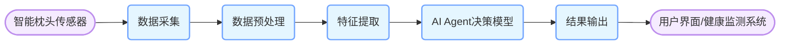

# AI Agent在智能枕头中的呼吸模式分析

> 关键词：AI Agent、智能枕头、呼吸模式分析、机器学习、传感器技术

> 摘要：本文聚焦于AI Agent在智能枕头呼吸模式分析中的应用。首先介绍了相关背景知识，包括研究目的、预期读者、文档结构等。接着阐述了核心概念，如AI Agent、呼吸模式等及其联系，并给出了相应的原理和架构示意图。详细讲解了用于呼吸模式分析的核心算法原理及具体操作步骤，通过Python代码进行了深入说明。还给出了相关的数学模型和公式，并举例进行了详细解释。在项目实战部分，从开发环境搭建、源代码实现到代码解读进行了全面分析。探讨了AI Agent在智能枕头呼吸模式分析中的实际应用场景，推荐了相关的学习资源、开发工具框架和论文著作。最后总结了未来发展趋势与挑战，并提供了常见问题解答和扩展阅读参考资料，旨在为该领域的研究和应用提供全面而深入的指导。

## 1. 背景介绍 
### 1.1 目的和范围
随着人们对健康睡眠的关注度不断提高，智能枕头作为一种新兴的健康监测设备逐渐受到青睐。呼吸模式是反映人体健康状况和睡眠质量的重要指标之一，如呼吸频率、呼吸深度、呼吸节律等的变化都可能暗示着某些健康问题，如睡眠呼吸暂停综合征、心肺疾病等。本研究的目的是将AI Agent技术应用于智能枕头中，实现对呼吸模式的准确分析，为用户提供睡眠健康监测和预警服务。

本研究的范围主要涵盖了AI Agent在智能枕头呼吸模式分析中的核心概念、算法原理、数学模型、实际应用案例等方面。通过理论分析和实践验证，探讨如何利用AI Agent技术提高呼吸模式分析的准确性和可靠性，以及如何将分析结果应用于实际的健康监测和干预中。

### 1.2 预期读者
本文的预期读者包括但不限于以下几类人群：
- **技术研发人员**：对人工智能、传感器技术、健康监测等领域感兴趣的工程师和开发者，希望了解AI Agent在智能枕头呼吸模式分析中的具体实现方法和技术细节。
- **健康研究人员**：从事睡眠医学、呼吸生理学等领域研究的科研人员，关注如何利用先进的技术手段提高呼吸模式分析的精度和可靠性，为健康研究提供更准确的数据支持。
- **产品设计师**：参与智能枕头等健康监测产品设计的专业人员，希望了解如何将AI Agent技术融入产品设计中，提升产品的功能和用户体验。
- **普通消费者**：对健康睡眠和智能健康设备感兴趣的普通用户，希望了解智能枕头如何通过呼吸模式分析为自己的健康提供帮助。

### 1.3 文档结构概述
本文将按照以下结构进行组织：
- **核心概念与联系**：介绍AI Agent、呼吸模式等核心概念，以及它们之间的联系，并给出相应的原理和架构示意图。
- **核心算法原理 & 具体操作步骤**：详细讲解用于呼吸模式分析的核心算法原理，包括数据预处理、特征提取、模型训练和预测等步骤，并通过Python代码进行具体实现。
- **数学模型和公式 & 详细讲解 & 举例说明**：给出呼吸模式分析中涉及的数学模型和公式，如信号处理公式、机器学习模型公式等，并通过具体例子进行详细解释。
- **项目实战：代码实际案例和详细解释说明**：从开发环境搭建、源代码实现到代码解读，全面介绍如何将AI Agent技术应用于智能枕头呼吸模式分析的实际项目中。
- **实际应用场景**：探讨AI Agent在智能枕头呼吸模式分析中的实际应用场景，如睡眠健康监测、疾病预警、个性化睡眠建议等。
- **工具和资源推荐**：推荐相关的学习资源、开发工具框架和论文著作，帮助读者进一步深入学习和研究。
- **总结：未来发展趋势与挑战**：总结AI Agent在智能枕头呼吸模式分析中的应用现状，分析未来发展趋势和面临的挑战。
- **附录：常见问题与解答**：提供常见问题的解答，帮助读者解决在学习和实践过程中遇到的问题。
- **扩展阅读 & 参考资料**：列出相关的扩展阅读材料和参考资料，供读者进一步查阅。

### 1.4 术语表
#### 1.4.1 核心术语定义
- **AI Agent（人工智能代理）**：是一种能够感知环境、自主决策并采取行动以实现特定目标的智能实体。在本研究中，AI Agent负责对智能枕头采集的呼吸数据进行分析和处理。
- **智能枕头**：一种集成了传感器技术和智能算法的枕头，能够实时采集人体的睡眠数据，如呼吸信号、体动信号等，并通过内置的处理器或连接到外部设备进行数据分析和处理。
- **呼吸模式**：指人体呼吸过程中表现出的各种特征，包括呼吸频率、呼吸深度、呼吸节律等。不同的呼吸模式可能反映出不同的健康状况和睡眠状态。
- **机器学习**：是一门多领域交叉学科，涉及概率论、统计学、逼近论、凸分析、算法复杂度理论等多门学科。它专门研究计算机怎样模拟或实现人类的学习行为，以获取新的知识或技能，重新组织已有的知识结构使之不断改善自身的性能。在本研究中，机器学习算法用于对呼吸模式进行分类和预测。

#### 1.4.2 相关概念解释
- **传感器技术**：是指能感受规定的被测量并按照一定的规律转换成可用信号的器件或装置，通常由敏感元件和转换元件组成。在智能枕头中，传感器用于采集人体的呼吸信号，如压力传感器、压电传感器等。
- **数据预处理**：是指对原始数据进行采集、清洗、转换等操作，以提高数据的质量和可用性。在呼吸模式分析中，数据预处理包括去除噪声、滤波、归一化等步骤。
- **特征提取**：是指从原始数据中提取出能够反映数据本质特征的信息。在呼吸模式分析中，特征提取包括计算呼吸频率、呼吸深度、呼吸间隔等特征参数。
- **模型训练**：是指使用训练数据对机器学习模型进行优化和调整，以提高模型的性能和准确性。在呼吸模式分析中，常用的机器学习模型包括决策树、支持向量机、神经网络等。

#### 1.4.3 缩略词列表
- **AI**：Artificial Intelligence，人工智能
- **ML**：Machine Learning，机器学习
- **SVM**：Support Vector Machine，支持向量机
- **NN**：Neural Network，神经网络
- **FFT**：Fast Fourier Transform，快速傅里叶变换

## 2. 核心概念与联系 

### 核心概念原理
#### AI Agent原理
AI Agent的核心原理是基于感知、决策和行动的循环。它通过传感器感知环境信息，然后根据预设的目标和规则进行决策，最后采取相应的行动来影响环境。在智能枕头呼吸模式分析中，AI Agent通过传感器感知人体的呼吸信号，对信号进行分析和处理，根据分析结果做出决策，如判断呼吸模式是否正常、是否需要发出预警等，并将决策结果反馈给用户或相关的健康监测系统。

#### 呼吸模式原理
呼吸模式是人体呼吸过程中表现出的各种特征，其原理与人体的呼吸系统和神经系统密切相关。呼吸系统包括呼吸道和肺，负责气体的交换和运输；神经系统则通过呼吸中枢调节呼吸的频率、深度和节律。正常情况下，人体的呼吸模式具有一定的规律性，但在睡眠过程中，呼吸模式可能会受到多种因素的影响，如睡眠姿势、呼吸道阻塞、心肺疾病等，从而发生变化。通过对呼吸模式的分析，可以了解人体的健康状况和睡眠质量。

### 架构示意图


该架构示意图展示了AI Agent在智能枕头呼吸模式分析中的工作流程。智能枕头传感器负责采集人体的呼吸信号，经过数据采集、预处理和特征提取等步骤后，将提取的特征输入到AI Agent决策模型中进行分析和决策，最后将决策结果输出到用户界面或健康监测系统中。

## 3. 核心算法原理 & 具体操作步骤 

### 核心算法原理
本研究采用的核心算法主要包括数据预处理算法、特征提取算法和机器学习分类算法。

#### 数据预处理算法
数据预处理的目的是去除原始呼吸信号中的噪声和干扰，提高信号的质量和可用性。常用的数据预处理算法包括滤波算法和归一化算法。

滤波算法可以采用低通滤波器或带通滤波器，去除呼吸信号中的高频噪声和低频漂移。例如，使用Butterworth低通滤波器可以有效去除呼吸信号中的高频噪声，保留呼吸信号的主要特征。

归一化算法可以将呼吸信号的幅度归一化到一个固定的范围内，如[0, 1]，以消除不同传感器或个体之间的差异。常用的归一化算法包括最小 - 最大归一化和Z - 分数归一化。

#### 特征提取算法
特征提取的目的是从预处理后的呼吸信号中提取出能够反映呼吸模式本质特征的信息。常用的特征包括呼吸频率、呼吸深度、呼吸间隔等。

呼吸频率可以通过计算呼吸信号的周期来得到，即相邻两个呼吸波峰之间的时间间隔的倒数。呼吸深度可以通过计算呼吸信号的幅度来得到，即呼吸波峰与波谷之间的差值。呼吸间隔可以通过计算相邻两个呼吸波峰之间的时间间隔来得到。

#### 机器学习分类算法
机器学习分类算法用于对提取的呼吸模式特征进行分类和预测。常用的机器学习分类算法包括决策树、支持向量机、神经网络等。

决策树算法通过构建决策树模型，根据特征的取值对呼吸模式进行分类。支持向量机算法通过寻找最优的超平面，将不同类别的呼吸模式特征分隔开来。神经网络算法通过构建多层神经网络模型，自动学习呼吸模式特征与类别之间的映射关系。

### 具体操作步骤
以下是使用Python实现上述核心算法的具体操作步骤和代码示例：

```python
import numpy as np
from scipy.signal import butter, filtfilt
from sklearn.preprocessing import MinMaxScaler
from sklearn.tree import DecisionTreeClassifier

# 数据预处理：低通滤波
def butter_lowpass(cutoff, fs, order=5):
    nyq = 0.5 * fs
    normal_cutoff = cutoff / nyq
    b, a = butter(order, normal_cutoff, btype='low', analog=False)
    return b, a

def butter_lowpass_filter(data, cutoff, fs, order=5):
    b, a = butter_lowpass(cutoff, fs, order=order)
    y = filtfilt(b, a, data)
    return y

# 数据预处理：归一化
def normalize_data(data):
    scaler = MinMaxScaler()
    normalized_data = scaler.fit_transform(data.reshape(-1, 1)).flatten()
    return normalized_data

# 特征提取：计算呼吸频率
def calculate_breathing_frequency(data, fs):
    peaks, _ = find_peaks(data)
    periods = np.diff(peaks) / fs
    frequencies = 1 / periods
    return np.mean(frequencies)

# 特征提取：计算呼吸深度
def calculate_breathing_depth(data):
    peaks, _ = find_peaks(data)
    valleys, _ = find_peaks(-data)
    depths = data[peaks] - data[valleys[:len(peaks)]]
    return np.mean(depths)

# 特征提取：计算呼吸间隔
def calculate_breathing_interval(data, fs):
    peaks, _ = find_peaks(data)
    intervals = np.diff(peaks) / fs
    return np.mean(intervals)

# 机器学习分类
def train_decision_tree(X_train, y_train):
    clf = DecisionTreeClassifier()
    clf.fit(X_train, y_train)
    return clf

# 示例数据
fs = 100  # 采样频率
t = np.linspace(0, 10, 10 * fs, endpoint=False)
data = np.sin(2 * np.pi * 0.2 * t) + 0.1 * np.random.randn(len(t))  # 模拟呼吸信号

# 数据预处理
filtered_data = butter_lowpass_filter(data, cutoff=1, fs=fs)
normalized_data = normalize_data(filtered_data)

# 特征提取
breathing_frequency = calculate_breathing_frequency(normalized_data, fs)
breathing_depth = calculate_breathing_depth(normalized_data)
breathing_interval = calculate_breathing_interval(normalized_data, fs)

# 特征向量
X = np.array([breathing_frequency, breathing_depth, breathing_interval]).reshape(1, -1)

# 示例训练数据
X_train = np.random.rand(100, 3)
y_train = np.random.randint(0, 2, 100)

# 训练决策树模型
clf = train_decision_tree(X_train, y_train)

# 预测
prediction = clf.predict(X)
print("预测结果:", prediction)
```

### 代码解释
1. **数据预处理**：
    - `butter_lowpass`函数用于设计Butterworth低通滤波器的系数。
    - `butter_lowpass_filter`函数使用设计好的滤波器对呼吸信号进行滤波处理。
    - `normalize_data`函数使用最小 - 最大归一化算法对滤波后的信号进行归一化处理。

2. **特征提取**：
    - `calculate_breathing_frequency`函数通过计算呼吸信号的波峰之间的时间间隔来计算呼吸频率。
    - `calculate_breathing_depth`函数通过计算呼吸信号的波峰与波谷之间的差值来计算呼吸深度。
    - `calculate_breathing_interval`函数通过计算呼吸信号的波峰之间的时间间隔来计算呼吸间隔。

3. **机器学习分类**：
    - `train_decision_tree`函数使用决策树算法对训练数据进行训练。
    - 最后，使用训练好的决策树模型对提取的特征向量进行预测。

## 4. 数学模型和公式 & 详细讲解 & 举例说明 

### 数据预处理数学模型和公式
#### 低通滤波
Butterworth低通滤波器的传递函数为：
$$H(s)=\frac{1}{\sqrt{1 + (\frac{s}{\omega_c})^{2n}}}$$
其中，$s$ 是复频率，$\omega_c$ 是截止频率，$n$ 是滤波器的阶数。

在离散时间域中，Butterworth低通滤波器可以通过双线性变换法转换为数字滤波器，其差分方程为：
$$y[n]=\sum_{i = 0}^{M}b_i x[n - i]-\sum_{j = 1}^{N}a_j y[n - j]$$
其中，$x[n]$ 是输入信号，$y[n]$ 是输出信号，$b_i$ 和 $a_j$ 是滤波器的系数，$M$ 和 $N$ 分别是滤波器的分子和分母的阶数。

#### 归一化
最小 - 最大归一化的公式为：
$$x_{norm}=\frac{x - x_{min}}{x_{max}-x_{min}}$$
其中，$x$ 是原始数据，$x_{min}$ 和 $x_{max}$ 分别是原始数据的最小值和最大值，$x_{norm}$ 是归一化后的数据。

### 特征提取数学模型和公式
#### 呼吸频率
呼吸频率 $f$ 的计算公式为：
$$f=\frac{1}{T}$$
其中，$T$ 是呼吸周期，即相邻两个呼吸波峰之间的时间间隔。

#### 呼吸深度
呼吸深度 $d$ 的计算公式为：
$$d = x_{peak}-x_{valley}$$
其中，$x_{peak}$ 是呼吸波峰的幅度，$x_{valley}$ 是呼吸波谷的幅度。

#### 呼吸间隔
呼吸间隔 $I$ 的计算公式为：
$$I = t_{peak_{i + 1}}-t_{peak_{i}}$$
其中，$t_{peak_{i}}$ 和 $t_{peak_{i + 1}}$ 分别是相邻两个呼吸波峰的时间。

### 机器学习分类数学模型和公式
#### 决策树
决策树的基本思想是通过递归地划分特征空间，构建一棵决策树模型。在每个内部节点上，根据某个特征的取值将数据集划分为不同的子集，直到满足停止条件为止。决策树的分类规则可以表示为一系列的条件判断语句。

例如，对于一个二维特征空间 $(x_1, x_2)$，决策树的分类规则可以表示为：
```
if x_1 < threshold_1:
    if x_2 < threshold_2:
        class = 0
    else:
        class = 1
else:
    class = 2
```

#### 支持向量机
支持向量机的目标是寻找一个最优的超平面，将不同类别的样本分隔开来。对于线性可分的数据集，支持向量机的优化问题可以表示为：
$$\min_{\mathbf{w}, b}\frac{1}{2}\|\mathbf{w}\|^2$$
$$s.t. y_i(\mathbf{w}^T\mathbf{x}_i + b)\geq 1, i = 1, 2, \cdots, N$$
其中，$\mathbf{w}$ 是超平面的法向量，$b$ 是超平面的偏移量，$\mathbf{x}_i$ 是第 $i$ 个样本的特征向量，$y_i$ 是第 $i$ 个样本的类别标签，$N$ 是样本的数量。

### 举例说明
假设我们有一组呼吸信号数据，采样频率为 $fs = 100Hz$，数据长度为 $T = 10s$。经过低通滤波和归一化处理后，得到的呼吸信号如下：
```python
import numpy as np
import matplotlib.pyplot as plt

fs = 100
t = np.linspace(0, 10, 10 * fs, endpoint=False)
data = np.sin(2 * np.pi * 0.2 * t) + 0.1 * np.random.randn(len(t))  # 模拟呼吸信号

# 数据预处理
filtered_data = butter_lowpass_filter(data, cutoff=1, fs=fs)
normalized_data = normalize_data(filtered_data)

plt.plot(t, normalized_data)
plt.xlabel('Time (s)')
plt.ylabel('Normalized Amplitude')
plt.title('Preprocessed Breathing Signal')
plt.show()
```

从预处理后的呼吸信号中提取呼吸频率、呼吸深度和呼吸间隔等特征：
```python
from scipy.signal import find_peaks

# 特征提取
breathing_frequency = calculate_breathing_frequency(normalized_data, fs)
breathing_depth = calculate_breathing_depth(normalized_data)
breathing_interval = calculate_breathing_interval(normalized_data, fs)

print("呼吸频率:", breathing_frequency, "Hz")
print("呼吸深度:", breathing_depth)
print("呼吸间隔:", breathing_interval, "s")
```

最后，使用决策树模型对提取的特征进行分类：
```python
# 示例训练数据
X_train = np.random.rand(100, 3)
y_train = np.random.randint(0, 2, 100)

# 训练决策树模型
clf = train_decision_tree(X_train, y_train)

# 特征向量
X = np.array([breathing_frequency, breathing_depth, breathing_interval]).reshape(1, -1)

# 预测
prediction = clf.predict(X)
print("预测结果:", prediction)
```

通过以上步骤，我们可以完成AI Agent在智能枕头呼吸模式分析中的核心算法实现。

## 5. 项目实战：代码实际案例和详细解释说明 

### 5.1  开发环境搭建
#### 硬件环境
- **智能枕头**：选择一款集成了呼吸传感器的智能枕头，如带有压力传感器或压电传感器的枕头。
- **开发板**：选择一款适合的开发板，如Arduino、Raspberry Pi等，用于采集和处理传感器数据。
- **电脑**：用于开发和调试代码，推荐使用Windows、Linux或Mac OS操作系统。

#### 软件环境
- **Python**：选择Python 3.x版本，作为主要的开发语言。
- **开发工具**：推荐使用Anaconda作为Python的集成开发环境，它包含了常用的科学计算库和工具。
- **相关库**：安装以下Python库：
    - `numpy`：用于数值计算和数组操作。
    - `scipy`：用于信号处理和科学计算。
    - `sklearn`：用于机器学习算法的实现。
    - `matplotlib`：用于数据可视化。

### 5.2  源代码详细实现和代码解读
以下是一个完整的项目实战代码示例，包括数据采集、预处理、特征提取、模型训练和预测等步骤：

```python
import numpy as np
from scipy.signal import butter, filtfilt
from sklearn.preprocessing import MinMaxScaler
from sklearn.tree import DecisionTreeClassifier
import matplotlib.pyplot as plt

# 数据预处理：低通滤波
def butter_lowpass(cutoff, fs, order=5):
    nyq = 0.5 * fs
    normal_cutoff = cutoff / nyq
    b, a = butter(order, normal_cutoff, btype='low', analog=False)
    return b, a

def butter_lowpass_filter(data, cutoff, fs, order=5):
    b, a = butter_lowpass(cutoff, fs, order=order)
    y = filtfilt(b, a, data)
    return y

# 数据预处理：归一化
def normalize_data(data):
    scaler = MinMaxScaler()
    normalized_data = scaler.fit_transform(data.reshape(-1, 1)).flatten()
    return normalized_data

# 特征提取：计算呼吸频率
def calculate_breathing_frequency(data, fs):
    from scipy.signal import find_peaks
    peaks, _ = find_peaks(data)
    periods = np.diff(peaks) / fs
    frequencies = 1 / periods
    return np.mean(frequencies)

# 特征提取：计算呼吸深度
def calculate_breathing_depth(data):
    from scipy.signal import find_peaks
    peaks, _ = find_peaks(data)
    valleys, _ = find_peaks(-data)
    depths = data[peaks] - data[valleys[:len(peaks)]]
    return np.mean(depths)

# 特征提取：计算呼吸间隔
def calculate_breathing_interval(data, fs):
    from scipy.signal import find_peaks
    peaks, _ = find_peaks(data)
    intervals = np.diff(peaks) / fs
    return np.mean(intervals)

# 机器学习分类
def train_decision_tree(X_train, y_train):
    clf = DecisionTreeClassifier()
    clf.fit(X_train, y_train)
    return clf

# 模拟数据采集
def simulate_data_collection(fs, duration):
    t = np.linspace(0, duration, duration * fs, endpoint=False)
    data = np.sin(2 * np.pi * 0.2 * t) + 0.1 * np.random.randn(len(t))  # 模拟呼吸信号
    return data

# 主函数
def main():
    fs = 100  # 采样频率
    duration = 10  # 数据采集时长
    data = simulate_data_collection(fs, duration)

    # 数据预处理
    filtered_data = butter_lowpass_filter(data, cutoff=1, fs=fs)
    normalized_data = normalize_data(filtered_data)

    # 特征提取
    breathing_frequency = calculate_breathing_frequency(normalized_data, fs)
    breathing_depth = calculate_breathing_depth(normalized_data)
    breathing_interval = calculate_breathing_interval(normalized_data, fs)

    # 特征向量
    X = np.array([breathing_frequency, breathing_depth, breathing_interval]).reshape(1, -1)

    # 示例训练数据
    X_train = np.random.rand(100, 3)
    y_train = np.random.randint(0, 2, 100)

    # 训练决策树模型
    clf = train_decision_tree(X_train, y_train)

    # 预测
    prediction = clf.predict(X)
    print("预测结果:", prediction)

    # 数据可视化
    t = np.linspace(0, duration, duration * fs, endpoint=False)
    plt.figure(figsize=(12, 6))
    plt.subplot(2, 1, 1)
    plt.plot(t, data)
    plt.xlabel('Time (s)')
    plt.ylabel('Amplitude')
    plt.title('Original Breathing Signal')

    plt.subplot(2, 1, 2)
    plt.plot(t, normalized_data)
    plt.xlabel('Time (s)')
    plt.ylabel('Normalized Amplitude')
    plt.title('Preprocessed Breathing Signal')

    plt.tight_layout()
    plt.show()

if __name__ == "__main__":
    main()
```

### 代码解读与分析
1. **数据采集**：
    - `simulate_data_collection`函数模拟了智能枕头传感器采集呼吸信号的过程，生成了一个包含噪声的正弦波信号作为模拟呼吸信号。

2. **数据预处理**：
    - `butter_lowpass_filter`函数使用Butterworth低通滤波器对原始呼吸信号进行滤波处理，去除高频噪声。
    - `normalize_data`函数使用最小 - 最大归一化算法对滤波后的信号进行归一化处理，将信号幅度归一化到[0, 1]范围内。

3. **特征提取**：
    - `calculate_breathing_frequency`函数通过计算呼吸信号的波峰之间的时间间隔来计算呼吸频率。
    - `calculate_breathing_depth`函数通过计算呼吸信号的波峰与波谷之间的差值来计算呼吸深度。
    - `calculate_breathing_interval`函数通过计算呼吸信号的波峰之间的时间间隔来计算呼吸间隔。

4. **机器学习分类**：
    - `train_decision_tree`函数使用决策树算法对训练数据进行训练，得到一个决策树分类模型。
    - 最后，使用训练好的决策树模型对提取的特征向量进行预测，输出预测结果。

5. **数据可视化**：
    - 使用`matplotlib`库将原始呼吸信号和预处理后的呼吸信号进行可视化展示，方便观察信号的变化。

## 6. 实际应用场景 
### 睡眠健康监测
AI Agent在智能枕头呼吸模式分析中的一个重要应用场景是睡眠健康监测。通过对呼吸频率、呼吸深度、呼吸节律等呼吸模式特征的实时监测和分析，可以了解用户的睡眠质量和健康状况。例如，呼吸频率过快或过慢、呼吸深度异常、呼吸节律不规律等都可能暗示着睡眠呼吸暂停综合征、心肺疾病等健康问题。智能枕头可以将监测结果反馈给用户，提醒用户及时就医或采取相应的措施改善睡眠质量。

### 疾病预警
除了睡眠健康监测，AI Agent还可以用于疾病预警。通过对大量的呼吸模式数据进行分析和学习，建立疾病预测模型。当监测到用户的呼吸模式出现异常变化时，智能枕头可以及时发出预警信号，提醒用户可能存在的健康风险。例如，对于患有睡眠呼吸暂停综合征的患者，智能枕头可以在患者出现呼吸暂停事件时及时发出警报，提醒患者或其家属采取措施，避免发生危险。

### 个性化睡眠建议
AI Agent还可以根据用户的呼吸模式分析结果，为用户提供个性化的睡眠建议。例如，根据用户的呼吸频率和深度，推荐适合用户的睡眠姿势和枕头高度；根据用户的呼吸节律，调整智能枕头的温度和硬度，提高用户的睡眠舒适度。通过提供个性化的睡眠建议，智能枕头可以帮助用户改善睡眠质量，提高生活品质。

### 医疗研究
AI Agent在智能枕头呼吸模式分析中的应用还可以为医疗研究提供有价值的数据支持。通过收集大量的呼吸模式数据，研究人员可以深入了解呼吸模式与健康状况之间的关系，为疾病的诊断和治疗提供新的思路和方法。例如，研究人员可以通过分析呼吸模式数据，发现睡眠呼吸暂停综合征的早期预警指标，提高疾病的早期诊断率。

## 7. 工具和资源推荐
### 7.1 学习资源推荐
#### 7.1.1 书籍推荐
- 《Python机器学习》：本书详细介绍了Python在机器学习领域的应用，包括数据预处理、特征提取、模型训练和评估等方面的内容，适合初学者入门。
- 《深度学习》：由深度学习领域的三位顶尖专家Ian Goodfellow、Yoshua Bengio和Aaron Courville合著，是深度学习领域的经典教材，涵盖了深度学习的基本原理、算法和应用。
- 《信号与系统》：本书系统地介绍了信号与系统的基本概念、分析方法和应用，对于理解呼吸信号处理和特征提取具有重要的参考价值。

#### 7.1.2 在线课程
- Coursera上的“机器学习”课程：由斯坦福大学教授Andrew Ng主讲，是机器学习领域的经典课程，涵盖了机器学习的基本概念、算法和应用。
- edX上的“深度学习”课程：由麻省理工学院教授Lex Fridman主讲，深入介绍了深度学习的原理、算法和应用，适合有一定基础的学习者。
- 中国大学MOOC上的“信号与系统”课程：由多所高校的教授联合授课，系统地介绍了信号与系统的基本概念、分析方法和应用。

#### 7.1.3 技术博客和网站
- Medium：一个技术博客平台，上面有很多关于人工智能、机器学习、传感器技术等领域的优秀文章。
- Towards Data Science：一个专注于数据科学和机器学习的技术博客，提供了大量的教程、案例和研究成果。
- IEEE Xplore：电气和电子工程师协会（IEEE）的数字图书馆，收录了大量的学术论文和技术报告，对于深入研究AI Agent和呼吸模式分析具有重要的参考价值。

### 7.2 开发工具框架推荐
#### 7.2.1 IDE和编辑器
- PyCharm：一款专门为Python开发设计的集成开发环境，具有强大的代码编辑、调试和项目管理功能。
- Jupyter Notebook：一个基于Web的交互式计算环境，支持Python、R等多种编程语言，适合进行数据分析和模型训练。
- Visual Studio Code：一款轻量级的代码编辑器，支持多种编程语言和插件扩展，具有丰富的代码编辑和调试功能。

#### 7.2.2 调试和性能分析工具
- PySnooper：一个简单易用的Python调试工具，可以自动记录函数的调用过程和变量的变化，方便调试代码。
- cProfile：Python标准库中的性能分析工具，可以统计函数的调用次数、执行时间等信息，帮助优化代码性能。
- TensorBoard：TensorFlow框架中的可视化工具，可以可视化模型的训练过程、损失函数曲线、参数分布等信息，方便调试和优化模型。

#### 7.2.3 相关框架和库
- NumPy：Python中用于数值计算和数组操作的基础库，提供了高效的多维数组对象和各种数学函数。
- SciPy：一个基于NumPy的科学计算库，提供了信号处理、优化、统计等方面的功能，对于呼吸信号处理和特征提取非常有用。
- Scikit-learn：一个简单易用的机器学习库，提供了各种机器学习算法和工具，如分类、回归、聚类等，适合初学者入门。
- TensorFlow：一个开源的深度学习框架，提供了丰富的深度学习模型和工具，如神经网络、卷积神经网络、循环神经网络等，适合进行复杂的模型训练和预测。

### 7.3 相关论文著作推荐
#### 7.3.1 经典论文
- "A Survey on Artificial Intelligence Agents"：该论文对人工智能代理的概念、分类、应用等方面进行了全面的综述，是了解AI Agent的经典文献。
- "Sleep Apnea Detection Using Single-Channel Respiratory Signals"：该论文提出了一种基于单通道呼吸信号的睡眠呼吸暂停检测方法，对于研究呼吸模式分析在睡眠健康监测中的应用具有重要的参考价值。
- "Machine Learning for Healthcare: A Review"：该论文对机器学习在医疗保健领域的应用进行了全面的综述，包括疾病诊断、治疗预测、健康管理等方面，为AI Agent在智能枕头呼吸模式分析中的应用提供了理论支持。

#### 7.3.2 最新研究成果
- "Deep Learning-Based Respiratory Pattern Analysis for Sleep Monitoring"：该研究提出了一种基于深度学习的呼吸模式分析方法，用于睡眠监测和疾病诊断，取得了较好的效果。
- "Intelligent Pillow with AI Agent for Respiratory Health Monitoring"：该研究设计了一种集成了AI Agent的智能枕头，用于实时监测呼吸模式和健康状况，为智能枕头的发展提供了新的思路。
- "Unsupervised Learning for Respiratory Signal Analysis"：该研究探索了无监督学习在呼吸信号分析中的应用，提出了一种基于无监督学习的呼吸模式分类方法，为呼吸模式分析提供了新的技术手段。

#### 7.3.3 应用案例分析
- "Case Study: Using AI Agent in Smart Pillow for Sleep Apnea Detection"：该案例分析了AI Agent在智能枕头中用于睡眠呼吸暂停检测的实际应用，介绍了系统的设计、实现和评估过程，为实际项目的开发提供了参考。
- "Application of AI Agent in Smart Pillow for Personalized Sleep Improvement"：该案例分析了AI Agent在智能枕头中用于个性化睡眠改善的实际应用，介绍了系统的功能、算法和用户体验，为智能枕头的产品设计提供了借鉴。
- "Real-World Implementation of AI Agent in Smart Pillow for Respiratory Health Monitoring"：该案例分析了AI Agent在智能枕头中用于呼吸健康监测的实际应用，介绍了系统的部署、运维和效果评估，为智能枕头的产业化推广提供了经验。

## 8. 总结：未来发展趋势与挑战
### 未来发展趋势
#### 多传感器融合
未来的智能枕头将不仅仅依赖于单一的呼吸传感器，而是会融合多种传感器，如压力传感器、温度传感器、湿度传感器等，以获取更全面的睡眠数据。通过多传感器融合，可以更准确地分析呼吸模式和睡眠状态，提高健康监测的精度和可靠性。

#### 深度学习应用
深度学习技术在图像识别、语音识别等领域取得了巨大的成功，未来也将在智能枕头呼吸模式分析中得到广泛应用。深度学习模型可以自动学习呼吸模式的复杂特征，提高呼吸模式分类和预测的准确性。例如，使用卷积神经网络（CNN）对呼吸信号进行特征提取和分类，使用循环神经网络（RNN）对呼吸节律进行建模和预测。

#### 个性化健康管理
随着人们对健康的关注度不断提高，未来的智能枕头将更加注重个性化健康管理。智能枕头可以根据用户的年龄、性别、身体状况等因素，为用户提供个性化的睡眠建议和健康干预方案。例如，对于患有睡眠呼吸暂停综合征的用户，智能枕头可以根据用户的病情严重程度，推荐适合的治疗方法和设备。

#### 云平台与物联网
未来的智能枕头将与云平台和物联网技术相结合，实现数据的实时传输和共享。用户可以通过手机APP或其他终端设备随时随地查看自己的睡眠数据和健康报告，医生也可以远程监测患者的睡眠状况，及时调整治疗方案。同时，智能枕头还可以与其他智能设备进行互联互通，如智能手环、智能床垫等，实现全方位的健康监测和管理。

### 挑战
#### 数据质量和隐私保护
智能枕头采集的呼吸数据质量直接影响呼吸模式分析的准确性和可靠性。然而，由于呼吸信号容易受到外界干扰和个体差异的影响，数据质量的保证是一个挑战。此外，呼吸数据属于个人敏感信息，如何保护用户的隐私和数据安全也是一个重要的问题。

#### 算法复杂度和计算资源
深度学习模型在呼吸模式分析中具有很高的准确性，但模型的复杂度也很高，需要大量的计算资源和时间进行训练和推理。如何在保证算法准确性的前提下，降低算法的复杂度和计算资源需求，是一个亟待解决的问题。

#### 标准和规范缺乏
目前，智能枕头呼吸模式分析领域还缺乏统一的标准和规范。不同的产品和算法在呼吸模式的定义、特征提取方法、分类标准等方面存在差异，导致分析结果的可比性和可靠性受到影响。制定统一的标准和规范，对于推动智能枕头呼吸模式分析技术的发展和应用具有重要意义。

#### 临床验证和应用推广
虽然AI Agent在智能枕头呼吸模式分析中具有很大的潜力，但目前还缺乏大规模的临床验证和应用推广。呼吸模式分析结果的准确性和可靠性需要通过大量的临床实验来验证，同时，如何将智能枕头推广到普通消费者手中，提高用户的接受度和使用率，也是一个挑战。

## 9. 附录：常见问题与解答
### 问题1：智能枕头采集的呼吸信号质量如何保证？
答：为了保证智能枕头采集的呼吸信号质量，可以采取以下措施：
- 选择高质量的传感器：选择灵敏度高、抗干扰能力强的传感器，如压力传感器、压电传感器等。
- 优化传感器的安装位置：将传感器安装在合适的位置，以确保能够准确地采集到呼吸信号。
- 进行数据预处理：对采集到的原始呼吸信号进行滤波、去噪等预处理操作，去除噪声和干扰，提高信号的质量。
- 定期校准传感器：定期对传感器进行校准，确保传感器的性能稳定可靠。

### 问题2：AI Agent在呼吸模式分析中的准确性如何？
答：AI Agent在呼吸模式分析中的准确性受到多种因素的影响，如数据质量、算法选择、模型训练等。一般来说，通过采用合适的算法和模型，并进行充分的训练和优化，可以提高AI Agent在呼吸模式分析中的准确性。例如，使用深度学习模型可以自动学习呼吸模式的复杂特征，提高分类和预测的准确性。同时，通过多传感器融合和数据增强等技术，也可以进一步提高呼吸模式分析的准确性。

### 问题3：智能枕头呼吸模式分析结果如何应用于健康管理？
答：智能枕头呼吸模式分析结果可以应用于以下几个方面的健康管理：
- 睡眠健康监测：通过实时监测呼吸模式，了解用户的睡眠质量和健康状况，如是否存在呼吸暂停、呼吸频率是否正常等。
- 疾病预警：当监测到呼吸模式出现异常变化时，及时发出预警信号，提醒用户可能存在的健康风险。
- 个性化睡眠建议：根据呼吸模式分析结果，为用户提供个性化的睡眠建议，如调整睡眠姿势、选择合适的枕头等。
- 医疗辅助诊断：呼吸模式分析结果可以为医生提供辅助诊断的依据，帮助医生更准确地诊断疾病和制定治疗方案。

### 问题4：智能枕头呼吸模式分析技术的发展前景如何？
答：智能枕头呼吸模式分析技术具有广阔的发展前景。随着人们对健康睡眠的关注度不断提高，智能枕头作为一种新兴的健康监测设备将越来越受到市场的欢迎。同时，人工智能、传感器技术、物联网等技术的不断发展也为智能枕头呼吸模式分析技术的发展提供了有力的支持。未来，智能枕头呼吸模式分析技术将朝着多传感器融合、深度学习应用、个性化健康管理、云平台与物联网等方向发展，为人们的健康睡眠和健康管理提供更加全面、准确、便捷的服务。

## 10. 扩展阅读 & 参考资料
### 扩展阅读
- 《人工智能：现代方法》：全面介绍了人工智能的基本概念、算法和应用，是人工智能领域的经典教材。
- 《传感器技术基础》：系统地介绍了传感器的基本原理、分类和应用，对于理解智能枕头中的传感器技术具有重要的参考价值。
- 《睡眠医学》：详细介绍了睡眠的生理机制、睡眠障碍的诊断和治疗等方面的内容，对于了解呼吸模式与睡眠健康的关系具有重要的意义。

### 参考资料
- [1] Goodfellow, I., Bengio, Y., & Courville, A. (2016). Deep Learning. MIT Press.
- [2] Ng, A. (2012). Machine Learning. Stanford University.
- [3] Oppenheim, A. V., & Schafer, R. W. (2010). Discrete-Time Signal Processing. Pearson.
- [4] Scikit-learn: Machine Learning in Python. (n.d.). Retrieved from https://scikit-learn.org/stable/
- [5] TensorFlow: An Open Source Machine Learning Library for Everyone. (n.d.). Retrieved from https://www.tensorflow.org/

作者：AI天才研究院/AI Genius Institute & 禅与计算机程序设计艺术 /Zen And The Art of Computer Programming