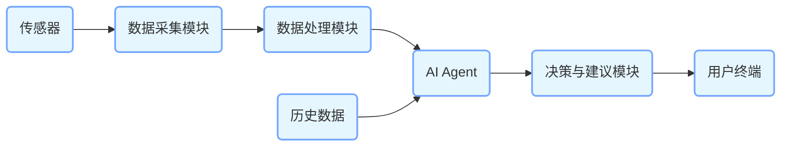

# AI Agent在智能枕头中的颈椎健康监测

> 关键词：AI Agent、智能枕头、颈椎健康监测、传感器技术、数据分析

> 摘要：本文聚焦于AI Agent在智能枕头颈椎健康监测方面的应用。首先介绍了相关背景，包括研究目的、预期读者、文档结构等。接着阐述了AI Agent、智能枕头以及颈椎健康监测的核心概念与联系，并给出了相应的架构示意图和流程图。详细讲解了核心算法原理和具体操作步骤，同时结合数学模型和公式进行说明。通过项目实战，展示了代码的实际案例和详细解释。分析了AI Agent在智能枕头颈椎健康监测的实际应用场景，推荐了相关的学习资源、开发工具框架和论文著作。最后总结了未来发展趋势与挑战，并提供了常见问题解答和扩展阅读参考资料。

## 1. 背景介绍 
### 1.1 目的和范围
随着人们生活方式的改变，颈椎疾病的发病率逐渐上升。颈椎健康问题不仅影响人们的日常生活和工作，还可能引发更严重的健康隐患。智能枕头作为一种新兴的健康监测设备，能够在人们睡眠过程中对颈椎健康状况进行监测。而AI Agent的引入，能够提升智能枕头的监测能力和智能化水平，实现更精准、高效的颈椎健康监测。

本文的范围主要涵盖AI Agent在智能枕头颈椎健康监测中的应用原理、算法实现、实际案例以及未来发展趋势等方面。通过深入研究和分析，为相关领域的研究和开发提供理论支持和实践指导。

### 1.2 预期读者
本文预期读者包括但不限于人工智能领域的研究人员、智能硬件开发者、医疗健康领域的专业人士以及对智能健康监测设备感兴趣的普通读者。对于研究人员，本文可以为他们提供新的研究思路和方向；对于开发者，本文可以作为技术参考，帮助他们开发更先进的智能枕头产品；对于医疗健康专业人士，本文可以让他们了解智能技术在颈椎健康监测中的应用，为临床诊断和治疗提供辅助；对于普通读者，本文可以让他们了解智能枕头颈椎健康监测的原理和优势，帮助他们选择合适的产品。

### 1.3 文档结构概述
本文将按照以下结构进行组织：
1. 背景介绍：阐述研究的目的和范围、预期读者以及文档结构概述，并对相关术语进行解释。
2. 核心概念与联系：介绍AI Agent、智能枕头和颈椎健康监测的核心概念，以及它们之间的联系，并给出架构示意图和流程图。
3. 核心算法原理 & 具体操作步骤：详细讲解核心算法原理，并使用Python源代码进行阐述，同时给出具体的操作步骤。
4. 数学模型和公式 & 详细讲解 & 举例说明：介绍相关的数学模型和公式，并进行详细讲解，通过具体例子说明其应用。
5. 项目实战：代码实际案例和详细解释说明：包括开发环境搭建、源代码详细实现和代码解读。
6. 实际应用场景：分析AI Agent在智能枕头颈椎健康监测中的实际应用场景。
7. 工具和资源推荐：推荐相关的学习资源、开发工具框架和论文著作。
8. 总结：未来发展趋势与挑战：总结AI Agent在智能枕头颈椎健康监测中的未来发展趋势和面临的挑战。
9. 附录：常见问题与解答：解答读者可能遇到的常见问题。
10. 扩展阅读 & 参考资料：提供相关的扩展阅读材料和参考资料。

### 1.4 术语表
#### 1.4.1 核心术语定义
- **AI Agent**：人工智能代理，是一种能够感知环境、做出决策并采取行动以实现特定目标的软件实体。它可以根据接收到的信息进行推理和学习，自主地完成任务。
- **智能枕头**：集成了传感器、数据处理模块和通信模块等多种技术的枕头，能够实时监测用户的睡眠状态、颈椎姿势等信息，并将数据传输到终端设备进行分析和处理。
- **颈椎健康监测**：通过对颈椎的生理参数（如颈椎曲度、压力分布等）进行监测和分析，评估颈椎的健康状况，及时发现潜在的颈椎问题。

#### 1.4.2 相关概念解释
- **传感器技术**：智能枕头中使用的传感器包括压力传感器、加速度传感器等，用于感知用户的睡眠姿势和颈椎压力分布等信息。
- **数据分析**：对传感器采集到的数据进行处理和分析，提取有价值的信息，如颈椎曲度的变化、睡眠姿势的统计等。
- **机器学习**：AI Agent可以利用机器学习算法对采集到的数据进行学习和训练，建立颈椎健康模型，实现对颈椎健康状况的准确评估。

#### 1.4.3 缩略词列表
- **AI**：Artificial Intelligence，人工智能
- **ML**：Machine Learning，机器学习
- **IoT**：Internet of Things，物联网

## 2. 核心概念与联系 
### 核心概念原理
#### AI Agent
AI Agent是一种具有自主性、反应性、社会性和适应性的软件实体。它能够感知周围环境的信息，根据预设的目标和规则进行推理和决策，并采取相应的行动。在智能枕头的颈椎健康监测中，AI Agent可以接收传感器采集到的数据，对数据进行分析和处理，判断用户的颈椎健康状况，并根据需要提供相应的建议和预警。

#### 智能枕头
智能枕头是一种融合了多种传感器技术和通信技术的智能设备。它通常内置有压力传感器、加速度传感器、温度传感器等，能够实时监测用户的睡眠姿势、颈椎压力分布、睡眠时长等信息。通过无线通信技术（如蓝牙、Wi-Fi等），智能枕头可以将采集到的数据传输到智能手机、平板电脑等终端设备上，方便用户查看和分析。

#### 颈椎健康监测
颈椎健康监测是通过对颈椎的生理参数进行监测和分析，评估颈椎的健康状况。常见的监测参数包括颈椎曲度、压力分布、肌肉张力等。通过长期监测这些参数的变化，可以及时发现颈椎的异常情况，如颈椎曲度变直、压力不均衡等，为早期预防和治疗颈椎疾病提供依据。

### 架构示意图

这个架构示意图展示了AI Agent在智能枕头颈椎健康监测中的工作流程。传感器负责采集用户的睡眠信息，数据采集模块将传感器采集到的数据进行初步处理，然后传输到数据处理模块进行进一步的分析和处理。AI Agent接收处理后的数据，结合历史数据进行推理和决策，生成相应的建议和预警信息。决策与建议模块将这些信息发送到用户终端，供用户查看和参考。

### 联系说明
AI Agent、智能枕头和颈椎健康监测之间存在着密切的联系。智能枕头为AI Agent提供了数据来源，通过传感器采集到的用户睡眠信息是AI Agent进行分析和决策的基础。AI Agent则对智能枕头采集到的数据进行深度挖掘和分析，利用机器学习算法建立颈椎健康模型，实现对颈椎健康状况的准确评估。同时，AI Agent还可以根据评估结果为用户提供个性化的建议和预警，帮助用户改善颈椎健康状况。颈椎健康监测是智能枕头和AI Agent共同的目标，它们的结合能够为用户提供更加全面、准确、智能的颈椎健康监测服务。

## 3. 核心算法原理 & 具体操作步骤 
### 核心算法原理
在AI Agent进行颈椎健康监测时，主要涉及到数据预处理、特征提取和分类识别三个核心步骤。以下是具体的算法原理：

#### 数据预处理
传感器采集到的数据可能存在噪声和干扰，需要进行预处理以提高数据的质量。常见的数据预处理方法包括滤波、归一化等。滤波可以去除数据中的高频噪声，使数据更加平滑；归一化可以将数据映射到一个固定的范围内，方便后续的处理和分析。

#### 特征提取
从预处理后的数据中提取能够反映颈椎健康状况的特征。常见的特征包括颈椎曲度、压力分布的均值和方差、睡眠姿势的持续时间等。这些特征可以作为分类识别的输入。

#### 分类识别
利用机器学习算法对提取的特征进行分类识别，判断用户的颈椎健康状况。常用的机器学习算法包括决策树、支持向量机、神经网络等。这些算法可以根据训练数据学习到不同颈椎健康状况对应的特征模式，从而对新的数据进行分类。

### Python源代码实现
```python
import numpy as np
from sklearn.preprocessing import StandardScaler
from sklearn.tree import DecisionTreeClassifier
from sklearn.model_selection import train_test_split

# 模拟传感器采集到的数据
# 假设每个样本有10个特征
data = np.random.rand(100, 10)
# 模拟颈椎健康状况的标签，0表示健康，1表示不健康
labels = np.random.randint(0, 2, 100)

# 数据预处理：归一化
scaler = StandardScaler()
scaled_data = scaler.fit_transform(data)

# 划分训练集和测试集
X_train, X_test, y_train, y_test = train_test_split(scaled_data, labels, test_size=0.2, random_state=42)

# 特征提取：这里简单假设已经完成特征提取，直接使用预处理后的数据
# 分类识别：使用决策树分类器
clf = DecisionTreeClassifier()
clf.fit(X_train, y_train)

# 预测
predictions = clf.predict(X_test)

# 评估模型性能
accuracy = np.mean(predictions == y_test)
print(f"模型准确率: {accuracy}")
```

### 具体操作步骤
1. **数据采集**：使用智能枕头中的传感器采集用户的睡眠信息，包括颈椎压力分布、加速度等数据。
2. **数据传输**：将采集到的数据通过无线通信技术传输到数据处理模块。
3. **数据预处理**：对传输过来的数据进行滤波、归一化等预处理操作，去除噪声和干扰，提高数据质量。
4. **特征提取**：从预处理后的数据中提取能够反映颈椎健康状况的特征。
5. **模型训练**：使用机器学习算法对提取的特征和对应的标签进行训练，建立颈椎健康分类模型。
6. **实时监测**：在用户睡眠过程中，实时采集数据并进行预处理和特征提取，将提取的特征输入到训练好的模型中进行分类识别。
7. **决策与建议**：根据分类识别的结果，AI Agent生成相应的建议和预警信息，并发送到用户终端。

## 4. 数学模型和公式 & 详细讲解 & 举例说明 
### 数据预处理
#### 滤波
常用的滤波方法是移动平均滤波，其数学公式为：
$$y(n)=\frac{1}{N}\sum_{i = 0}^{N - 1}x(n - i)$$
其中，$x(n)$ 是原始数据序列，$y(n)$ 是滤波后的数据序列，$N$ 是滤波窗口的大小。

**举例说明**：假设原始数据序列为 $x = [1, 2, 3, 4, 5]$，滤波窗口大小 $N = 3$。则滤波后的第一个数据点 $y(2)$ 为：
$$y(2)=\frac{1 + 2 + 3}{3}=2$$
依次类推，可以得到整个滤波后的数据序列。

#### 归一化
常用的归一化方法是标准化，其数学公式为：
$$z=\frac{x-\mu}{\sigma}$$
其中，$x$ 是原始数据，$\mu$ 是数据的均值，$\sigma$ 是数据的标准差，$z$ 是归一化后的数据。

**举例说明**：假设数据序列为 $x = [1, 2, 3, 4, 5]$，则均值 $\mu=\frac{1 + 2 + 3 + 4 + 5}{5}=3$，标准差 $\sigma=\sqrt{\frac{(1 - 3)^2+(2 - 3)^2+(3 - 3)^2+(4 - 3)^2+(5 - 3)^2}{5}}\approx1.414$。对于数据点 $x = 1$，归一化后的值为：
$$z=\frac{1 - 3}{1.414}\approx - 1.414$$

### 特征提取
#### 颈椎曲度计算
颈椎曲度可以通过压力传感器采集到的压力分布数据来计算。假设压力传感器分布在枕头的不同位置，采集到的压力值为 $p_1,p_2,\cdots,p_n$，可以使用以下公式计算颈椎曲度的一个简单指标：
$$C=\frac{\sum_{i = 1}^{n}i\times p_i}{\sum_{i = 1}^{n}p_i}$$
其中，$C$ 表示颈椎曲度指标。

**举例说明**：假设压力传感器有 3 个，采集到的压力值分别为 $p_1 = 10$，$p_2 = 20$，$p_3 = 30$，则颈椎曲度指标为：
$$C=\frac{1\times10 + 2\times20+3\times30}{10 + 20+30}=\frac{10 + 40 + 90}{60}=\frac{140}{60}\approx2.33$$

### 分类识别
#### 决策树算法
决策树算法是一种基于树结构进行决策的分类算法。决策树的每个内部节点是一个属性上的测试，每个分支是一个测试输出，每个叶节点是一个类别。决策树的构建过程是通过递归地选择最优属性进行划分，直到满足停止条件。

决策树的分类规则可以表示为一系列的条件判断。例如，对于一个包含两个特征 $x_1$ 和 $x_2$ 的数据集，决策树的一个分支可能是：如果 $x_1\gt5$ 且 $x_2\lt10$，则分类为类别 $A$；否则分类为类别 $B$。

## 5. 项目实战：代码实际案例和详细解释说明 
### 5.1  开发环境搭建
#### 硬件环境
- **智能枕头**：选择一款集成了压力传感器和加速度传感器的智能枕头，确保传感器能够准确采集用户的睡眠信息。
- **开发板**：可以选择 Raspberry Pi 等开发板，用于数据采集和处理。将智能枕头的传感器与开发板进行连接。
- **终端设备**：智能手机或平板电脑，用于接收和显示智能枕头采集到的数据和AI Agent生成的建议和预警信息。

#### 软件环境
- **操作系统**：在开发板上安装 Raspbian 等操作系统。
- **编程语言**：使用 Python 进行开发，Python 具有丰富的科学计算和机器学习库，方便进行数据处理和分析。
- **开发工具**：可以使用 PyCharm 等集成开发环境进行代码编写和调试。
- **机器学习库**：安装 Scikit-learn、NumPy、Pandas 等机器学习和数据处理库。

### 5.2  源代码详细实现和代码解读
```python
import time
import numpy as np
import pandas as pd
from sklearn.preprocessing import StandardScaler
from sklearn.tree import DecisionTreeClassifier

# 模拟传感器数据采集函数
def collect_sensor_data():
    # 这里简单模拟传感器采集到的数据
    data = np.random.rand(1, 10)
    return data

# 数据预处理函数
def preprocess_data(data):
    scaler = StandardScaler()
    scaled_data = scaler.fit_transform(data)
    return scaled_data

# 加载训练好的模型
def load_model():
    # 假设模型已经训练好并保存为 model.pkl
    import joblib
    model = joblib.load('model.pkl')
    return model

# 实时监测函数
def real_time_monitoring():
    model = load_model()
    while True:
        # 采集传感器数据
        sensor_data = collect_sensor_data()
        # 数据预处理
        preprocessed_data = preprocess_data(sensor_data)
        # 预测颈椎健康状况
        prediction = model.predict(preprocessed_data)
        if prediction[0] == 0:
            print("颈椎健康状况良好")
        else:
            print("颈椎可能存在问题，请及时关注")
        time.sleep(60)  # 每隔60秒进行一次监测

if __name__ == "__main__":
    real_time_monitoring()
```

### 代码解读与分析
- **collect_sensor_data 函数**：模拟传感器数据采集过程，返回一个随机生成的 1 行 10 列的数组，表示采集到的传感器数据。
- **preprocess_data 函数**：对采集到的数据进行预处理，使用 StandardScaler 进行标准化处理，将数据映射到均值为 0，标准差为 1 的范围内。
- **load_model 函数**：加载训练好的决策树模型，使用 joblib 库将模型保存为 model.pkl 文件，在需要时进行加载。
- **real_time_monitoring 函数**：实现实时监测功能，在一个无限循环中，每隔 60 秒采集一次传感器数据，进行预处理和预测，根据预测结果输出相应的信息。

通过这个项目实战，我们可以看到如何将AI Agent应用到智能枕头的颈椎健康监测中，实现实时监测和预警功能。

## 6. 实际应用场景 
### 家庭健康监测
在家庭环境中，用户可以使用智能枕头进行颈椎健康监测。智能枕头可以在用户睡眠过程中实时采集数据，AI Agent对数据进行分析和处理，判断用户的颈椎健康状况。如果发现颈椎存在问题，AI Agent可以及时向用户的智能手机发送预警信息，并提供相应的改善建议，如调整睡眠姿势、进行颈部按摩等。用户可以通过手机应用程序查看自己的颈椎健康数据和历史记录，了解自己的颈椎健康状况的变化趋势。

### 医疗机构辅助诊断
在医疗机构中，智能枕头可以作为一种辅助诊断工具。医生可以让患者使用智能枕头进行一段时间的睡眠监测，获取患者的颈椎健康数据。AI Agent对这些数据进行分析和处理，生成详细的报告，为医生提供更全面、准确的诊断依据。医生可以根据报告中的信息，制定个性化的治疗方案，提高治疗效果。

### 健康管理机构服务
健康管理机构可以为会员提供智能枕头颈椎健康监测服务。会员使用智能枕头进行监测，健康管理机构的专业人员可以通过后台系统查看会员的颈椎健康数据和AI Agent生成的分析报告。专业人员可以根据报告为会员提供健康咨询和指导，帮助会员改善颈椎健康状况。同时，健康管理机构还可以根据会员的健康数据进行风险评估，提前发现潜在的健康问题，为会员提供预防建议。

## 7. 工具和资源推荐
### 7.1 学习资源推荐
#### 7.1.1 书籍推荐
- 《Python机器学习》：这本书详细介绍了Python在机器学习中的应用，包括数据预处理、特征提取、模型训练和评估等方面的内容，适合初学者学习。
- 《人工智能：一种现代的方法》：这是一本经典的人工智能教材，全面介绍了人工智能的各个领域，包括搜索算法、知识表示、机器学习、自然语言处理等，对于深入理解AI Agent的原理和应用有很大帮助。
- 《智能硬件开发实战》：该书介绍了智能硬件的开发流程和技术，包括传感器技术、嵌入式系统开发、无线通信技术等，对于开发智能枕头等智能硬件产品具有指导意义。

#### 7.1.2 在线课程
- Coursera上的“机器学习”课程：由斯坦福大学教授Andrew Ng主讲，是一门非常经典的机器学习课程，涵盖了机器学习的基本概念、算法和应用。
- edX上的“人工智能基础”课程：该课程介绍了人工智能的基本原理和方法，包括搜索算法、知识表示、机器学习等内容，适合初学者入门。
- 中国大学MOOC上的“传感器原理与应用”课程：详细介绍了各种传感器的工作原理和应用场景，对于理解智能枕头中传感器的工作原理有很大帮助。

#### 7.1.3 技术博客和网站
- Medium：这是一个技术博客平台，上面有很多关于人工智能、机器学习和智能硬件的技术文章，可以及时了解行业最新动态和技术进展。
- 开源中国：国内知名的开源技术社区，提供了丰富的开源项目和技术文章，对于开发者来说是一个很好的学习和交流平台。
- 知乎：在知乎上可以找到很多关于人工智能和智能硬件的讨论和问答，通过参与讨论可以拓宽自己的知识面。

### 7.2 开发工具框架推荐
#### 7.2.1 IDE和编辑器
- PyCharm：一款专门为Python开发设计的集成开发环境，具有代码自动补全、调试、版本控制等功能，提高开发效率。
- Visual Studio Code：一款轻量级的代码编辑器，支持多种编程语言和插件扩展，对于开发智能硬件和人工智能项目非常方便。

#### 7.2.2 调试和性能分析工具
- PDB：Python自带的调试工具，可以帮助开发者定位代码中的问题。
- Profiler：Python的性能分析工具，可以分析代码的运行时间和内存使用情况，帮助开发者优化代码性能。

#### 7.2.3 相关框架和库
- Scikit-learn：一个强大的机器学习库，提供了丰富的机器学习算法和工具，如分类、回归、聚类等算法，方便开发者进行模型训练和评估。
- TensorFlow：Google开发的深度学习框架，支持多种深度学习模型的开发和训练，如神经网络、卷积神经网络等。
- Pandas：一个数据处理和分析库，提供了高效的数据结构和数据操作方法，方便开发者进行数据预处理和分析。

### 7.3 相关论文著作推荐
#### 7.3.1 经典论文
- “A Logical Calculus of the Ideas Immanent in Nervous Activity”：这篇论文由Warren McCulloch和Walter Pitts发表于1943年，提出了人工神经元模型，为神经网络的发展奠定了基础。
- “Learning Representations by Back-propagating Errors”：这篇论文由David Rumelhart、Geoffrey Hinton和Ronald Williams发表于1986年，介绍了反向传播算法，使得神经网络的训练变得更加高效。

#### 7.3.2 最新研究成果
- 关注顶级学术会议（如NeurIPS、ICML、CVPR等）上的相关研究论文，了解AI Agent在健康监测领域的最新研究进展。
- 查阅知名学术期刊（如Journal of Artificial Intelligence Research、Artificial Intelligence等）上的相关研究论文，获取最新的研究成果。

#### 7.3.3 应用案例分析
- 一些科技公司和研究机构会发布关于AI Agent在智能硬件和健康监测领域的应用案例，可以通过他们的官方网站或相关技术博客进行查阅。
- 行业报告和白皮书也是了解应用案例的重要来源，可以通过市场研究机构的网站获取相关报告。

## 8. 总结：未来发展趋势与挑战
### 未来发展趋势
#### 更精准的监测
随着传感器技术的不断发展，智能枕头中的传感器将变得更加精确和灵敏，能够采集到更丰富、更准确的颈椎健康数据。AI Agent可以利用这些数据进行更深入的分析和处理，实现对颈椎健康状况的更精准监测。

#### 个性化的健康管理
AI Agent可以根据用户的个体差异（如年龄、性别、身体状况等）和历史健康数据，为用户提供个性化的颈椎健康管理方案。例如，为不同用户推荐适合的睡眠姿势、枕头高度和颈部锻炼方法等。

#### 与其他设备的融合
智能枕头可以与其他智能健康设备（如智能手环、智能床垫等）进行融合，实现更全面的健康监测。AI Agent可以整合这些设备采集到的数据，进行综合分析，为用户提供更全面的健康评估和建议。

#### 智能化的交互体验
未来的智能枕头将具备更智能化的交互功能，用户可以通过语音指令、手势控制等方式与智能枕头进行交互。AI Agent可以根据用户的交互信息，及时调整监测策略和提供个性化的服务。

### 面临的挑战
#### 数据隐私和安全
智能枕头采集到的用户健康数据属于敏感信息，需要确保数据的隐私和安全。在数据传输和存储过程中，需要采取有效的加密措施，防止数据泄露和滥用。

#### 算法的准确性和可靠性
AI Agent的算法准确性和可靠性直接影响到颈椎健康监测的效果。需要不断优化算法，提高算法的准确性和鲁棒性，以应对不同用户和不同睡眠环境的挑战。

#### 用户接受度
智能枕头作为一种新兴的健康监测设备，用户对其接受度还需要进一步提高。需要加强对用户的宣传和教育，让用户了解智能枕头的功能和优势，提高用户的使用意愿。

#### 技术标准和规范
目前，智能枕头和AI Agent在颈椎健康监测领域还缺乏统一的技术标准和规范。需要制定相关的标准和规范，确保产品的质量和性能，促进整个行业的健康发展。

## 9. 附录：常见问题与解答
### 智能枕头的传感器会影响睡眠舒适度吗？
智能枕头中的传感器通常设计得非常轻薄和柔软，不会对睡眠舒适度产生明显影响。同时，一些智能枕头还采用了特殊的材料和工艺，进一步提高了睡眠的舒适度。

### AI Agent的诊断结果准确吗？
AI Agent的诊断结果是基于大量的训练数据和先进的机器学习算法得出的，但仍然存在一定的误差。AI Agent的诊断结果可以作为参考，不能替代专业医生的诊断。如果发现颈椎存在问题，建议及时就医。

### 智能枕头需要充电吗？
大多数智能枕头需要充电，其内置的电池可以提供数天到数周的续航时间。具体的续航时间取决于智能枕头的型号和使用频率。

### 智能枕头可以和哪些终端设备连接？
智能枕头通常可以通过蓝牙、Wi-Fi等无线通信技术与智能手机、平板电脑等终端设备连接。用户可以通过终端设备上的应用程序查看智能枕头采集到的数据和AI Agent生成的建议和预警信息。

## 10. 扩展阅读 & 参考资料
### 扩展阅读
- 《未来医疗：智能时代的健康革命》：这本书介绍了智能技术在医疗健康领域的应用和发展趋势，包括智能诊断、智能治疗、健康管理等方面的内容。
- 《智能硬件：重塑人类生活》：该书探讨了智能硬件的发展现状和未来趋势，以及智能硬件对人类生活的影响。

### 参考资料
- 相关的学术论文和研究报告，可以通过学术数据库（如IEEE Xplore、ACM Digital Library等）进行查阅。
- 智能枕头和AI Agent相关的产品说明书和技术文档，可以从产品制造商的官方网站获取。

作者：AI天才研究院/AI Genius Institute & 禅与计算机程序设计艺术 /Zen And The Art of Computer Programming