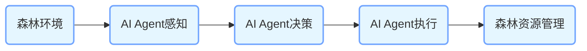

# AI Agent在智能森林资源监测中的实践

> 关键词：AI Agent、智能森林资源监测、计算机视觉、传感器网络、机器学习

> 摘要：本文围绕AI Agent在智能森林资源监测中的实践展开。首先介绍了相关背景，包括目的范围、预期读者等内容。接着阐述了AI Agent、森林资源监测等核心概念及其联系，给出了相应的文本示意图和Mermaid流程图。详细讲解了核心算法原理并给出Python代码示例，同时介绍了相关数学模型和公式。通过项目实战，展示了开发环境搭建、源代码实现与解读。分析了AI Agent在森林资源监测中的实际应用场景，推荐了学习资源、开发工具框架和相关论文著作。最后总结了未来发展趋势与挑战，并提供常见问题解答和扩展阅读参考资料，旨在为利用AI Agent进行智能森林资源监测提供全面的技术指导。

## 1. 背景介绍 
### 1.1 目的和范围
随着全球对生态环境保护的重视，森林资源的监测和管理变得至关重要。传统的森林资源监测方法主要依赖人工实地调查，不仅耗费大量的人力、物力和时间，而且监测的范围和频率有限，难以实时、全面地掌握森林资源的动态变化。AI Agent作为一种智能的自主实体，能够在复杂的环境中感知信息、做出决策并采取行动，将其应用于森林资源监测中，可以实现自动化、智能化的监测，提高监测的效率和准确性。

本文的范围主要涵盖了AI Agent在智能森林资源监测中的核心概念、算法原理、实际应用案例以及相关的工具和资源推荐等方面，旨在为相关领域的研究人员和开发者提供全面的技术指导。

### 1.2 预期读者
本文的预期读者包括但不限于以下几类人群：
- 从事森林资源监测、生态环境研究的科研人员，希望了解AI Agent技术在该领域的应用，为其研究工作提供新的思路和方法。
- 计算机科学、人工智能等相关专业的学生和开发者，对AI Agent的实际应用场景感兴趣，希望通过本文了解如何将AI Agent技术应用于森林资源监测中。
- 林业管理部门的工作人员，希望借助先进的技术手段提高森林资源监测和管理的效率，保障森林资源的可持续发展。

### 1.3 文档结构概述
本文将按照以下结构进行组织：
- 核心概念与联系：介绍AI Agent、森林资源监测等核心概念，并阐述它们之间的联系，给出相应的文本示意图和Mermaid流程图。
- 核心算法原理 & 具体操作步骤：详细讲解AI Agent在森林资源监测中所涉及的核心算法原理，并使用Python源代码进行详细阐述。
- 数学模型和公式 & 详细讲解 & 举例说明：介绍相关的数学模型和公式，并通过具体的例子进行详细讲解。
- 项目实战：代码实际案例和详细解释说明：通过一个实际的项目案例，展示如何使用AI Agent进行智能森林资源监测，包括开发环境搭建、源代码详细实现和代码解读。
- 实际应用场景：分析AI Agent在森林资源监测中的实际应用场景，如森林火灾监测、森林病虫害监测等。
- 工具和资源推荐：推荐相关的学习资源、开发工具框架和论文著作，帮助读者进一步深入学习和研究。
- 总结：未来发展趋势与挑战：总结AI Agent在智能森林资源监测中的发展趋势和面临的挑战。
- 附录：常见问题与解答：提供常见问题的解答，帮助读者解决在学习和实践过程中遇到的问题。
- 扩展阅读 & 参考资料：提供相关的扩展阅读材料和参考资料，方便读者进一步深入研究。

### 1.4 术语表
#### 1.4.1 核心术语定义
- **AI Agent**：即人工智能代理，是一种能够感知环境、做出决策并采取行动的智能实体。它可以根据预设的目标和规则，自主地完成特定的任务。
- **智能森林资源监测**：利用先进的信息技术，如人工智能、传感器网络、遥感技术等，对森林资源的生长状况、生态环境、灾害情况等进行实时、动态的监测和分析。
- **计算机视觉**：是人工智能的一个重要分支，主要研究如何让计算机“看”，即通过图像和视频数据来理解和分析场景，识别物体、检测目标等。
- **传感器网络**：由大量的传感器节点组成的网络，这些传感器节点可以实时采集环境信息，如温度、湿度、光照等，并将数据传输到中心节点进行处理和分析。

#### 1.4.2 相关概念解释
- **机器学习**：是一门多领域交叉学科，涉及概率论、统计学、逼近论、凸分析、算法复杂度理论等多门学科。它专门研究计算机怎样模拟或实现人类的学习行为，以获取新的知识或技能，重新组织已有的知识结构使之不断改善自身的性能。
- **深度学习**：是机器学习的一个分支领域，它是一种基于对数据进行表征学习的方法。深度学习通过构建具有很多层的神经网络模型，自动从大量的数据中学习特征和模式，从而实现对数据的分类、预测等任务。

#### 1.4.3 缩略词列表
- **AI**：Artificial Intelligence，人工智能
- **CV**：Computer Vision，计算机视觉
- **ML**：Machine Learning，机器学习
- **DL**：Deep Learning，深度学习

## 2. 核心概念与联系 
### 核心概念原理
#### AI Agent
AI Agent是一个具有自主性、反应性、社会性和主动性的智能实体。它由感知模块、决策模块和执行模块组成。感知模块用于获取环境信息，决策模块根据感知到的信息和预设的目标做出决策，执行模块则根据决策采取相应的行动。例如，在森林资源监测中，AI Agent可以通过安装在森林中的传感器感知森林的温度、湿度、光照等环境信息，根据这些信息判断是否存在森林火灾的风险，如果存在风险则触发相应的报警机制。

#### 森林资源监测
森林资源监测是对森林的各种属性和变化进行长期、系统的观测和分析。其目的是了解森林资源的现状和动态变化，为森林资源的管理和保护提供科学依据。森林资源监测的内容包括森林面积、蓄积量、森林生长状况、森林病虫害情况、森林火灾情况等。传统的森林资源监测方法主要依赖人工实地调查和遥感技术，而智能森林资源监测则结合了人工智能、传感器网络等先进技术，实现了自动化、智能化的监测。

### 架构的文本示意图
```plaintext
                            +----------------+
                            |    森林环境    |
                            +----------------+
                                   |
                                   | 感知信息
                                   v
+----------------+       +----------------+       +----------------+
|  AI Agent感知  | ----> |  AI Agent决策  | ----> |  AI Agent执行  |
+----------------+       +----------------+       +----------------+
                                   |
                                   | 执行结果
                                   v
                            +----------------+
                            |  森林资源管理  |
                            +----------------+
```

### Mermaid流程图


## 3. 核心算法原理 & 具体操作步骤 
### 核心算法原理
在智能森林资源监测中，AI Agent常用的核心算法包括机器学习算法和计算机视觉算法。

#### 机器学习算法 - 决策树算法
决策树是一种基于树结构进行决策的机器学习算法。它通过对训练数据进行学习，构建一棵决策树，每个内部节点表示一个属性上的测试，每个分支表示一个测试输出，每个叶节点表示一个类别或值。在森林资源监测中，可以使用决策树算法根据森林的环境信息（如温度、湿度、光照等）来判断是否存在森林火灾的风险。

#### 计算机视觉算法 - 目标检测算法
目标检测是计算机视觉中的一个重要任务，它的目标是在图像或视频中检测出特定目标的位置和类别。在森林资源监测中，可以使用目标检测算法来检测森林中的树木、动物、火灾等目标。常用的目标检测算法有YOLO（You Only Look Once）、Faster R - CNN等。

### 具体操作步骤
#### 数据收集
首先需要收集森林资源监测相关的数据，包括传感器采集的环境数据和摄像头拍摄的图像、视频数据。

#### 数据预处理
对收集到的数据进行预处理，包括数据清洗、数据归一化、图像增强等操作，以提高数据的质量和可用性。

#### 模型训练
使用预处理后的数据对机器学习和计算机视觉模型进行训练。例如，使用决策树算法对环境数据进行训练，使用YOLO算法对图像数据进行训练。

#### 模型评估
使用测试数据对训练好的模型进行评估，计算模型的准确率、召回率、F1值等指标，以评估模型的性能。

#### 部署和应用
将评估合格的模型部署到AI Agent中，AI Agent根据感知到的信息使用训练好的模型进行决策和执行相应的行动。

### Python源代码示例
#### 决策树算法示例
```python
import pandas as pd
from sklearn.tree import DecisionTreeClassifier
from sklearn.model_selection import train_test_split
from sklearn.metrics import accuracy_score

# 读取数据
data = pd.read_csv('forest_data.csv')

# 划分特征和标签
X = data.drop('fire_risk', axis=1)
y = data['fire_risk']

# 划分训练集和测试集
X_train, X_test, y_train, y_test = train_test_split(X, y, test_size=0.2, random_state=42)

# 创建决策树分类器
clf = DecisionTreeClassifier()

# 训练模型
clf.fit(X_train, y_train)

# 预测
y_pred = clf.predict(X_test)

# 计算准确率
accuracy = accuracy_score(y_test, y_pred)
print(f"Accuracy: {accuracy}")
```

#### 目标检测算法示例（使用YOLOv5）
```python
import torch

# 加载预训练的YOLOv5模型
model = torch.hub.load('ultralytics/yolov5', 'yolov5s', pretrained=True)

# 读取图像
img = 'forest_image.jpg'

# 进行目标检测
results = model(img)

# 显示检测结果
results.show()
```

## 4. 数学模型和公式 & 详细讲解 & 举例说明 
### 决策树算法的数学模型和公式
#### 信息熵
信息熵是衡量数据不确定性的一个指标，其计算公式为：
$$H(X)=-\sum_{i = 1}^{n}p(x_i)\log_2p(x_i)$$
其中，$X$ 是一个随机变量，$p(x_i)$ 是 $X$ 取值为 $x_i$ 的概率，$n$ 是 $X$ 可能取值的个数。

#### 信息增益
信息增益是在划分数据集前后信息熵的变化量，其计算公式为：
$$IG(D, A)=H(D)-\sum_{v\in Values(A)}\frac{|D_v|}{|D|}H(D_v)$$
其中，$D$ 是数据集，$A$ 是划分属性，$Values(A)$ 是属性 $A$ 所有可能的取值，$D_v$ 是属性 $A$ 取值为 $v$ 时的子集。

#### 举例说明
假设有一个森林火灾风险数据集，包含温度（高、低）、湿度（高、低）和火灾风险（是、否）三个属性。数据集如下：
| 温度 | 湿度 | 火灾风险 |
|------|------|----------|
| 高   | 低   | 是       |
| 高   | 高   | 否       |
| 低   | 低   | 是       |
| 低   | 高   | 否       |

首先计算数据集的信息熵：
- 火灾风险为“是”的概率 $p_1=\frac{2}{4}=0.5$，火灾风险为“否”的概率 $p_2=\frac{2}{4}=0.5$。
- 信息熵 $H(D)=-0.5\log_20.5 - 0.5\log_20.5 = 1$

然后计算以温度为划分属性时的信息增益：
- 温度为“高”时，火灾风险为“是”的概率 $p_{11}=\frac{1}{2}=0.5$，火灾风险为“否”的概率 $p_{12}=\frac{1}{2}=0.5$，信息熵 $H(D_{高})=-0.5\log_20.5 - 0.5\log_20.5 = 1$。
- 温度为“低”时，火灾风险为“是”的概率 $p_{21}=\frac{1}{2}=0.5$，火灾风险为“否”的概率 $p_{22}=\frac{1}{2}=0.5$，信息熵 $H(D_{低})=-0.5\log_20.5 - 0.5\log_20.5 = 1$。
- 信息增益 $IG(D, 温度)=H(D)-\frac{2}{4}H(D_{高})-\frac{2}{4}H(D_{低})=1 - \frac{2}{4}\times1-\frac{2}{4}\times1 = 0$

### 目标检测算法的数学模型和公式
#### 交并比（IoU）
交并比是衡量两个边界框重合程度的一个指标，其计算公式为：
$$IoU=\frac{Area(A\cap B)}{Area(A\cup B)}$$
其中，$A$ 和 $B$ 是两个边界框，$Area(A\cap B)$ 是它们的交集面积，$Area(A\cup B)$ 是它们的并集面积。

#### 举例说明
假设有两个边界框 $A$ 和 $B$，$A$ 的坐标为 $(x_1, y_1, x_2, y_2)=(10, 10, 50, 50)$，$B$ 的坐标为 $(x_3, y_3, x_4, y_4)=(20, 20, 60, 60)$。
- 计算交集面积：
  - 交集的左上角坐标为 $(max(x_1, x_3), max(y_1, y_3))=(20, 20)$，右下角坐标为 $(min(x_2, x_4), min(y_2, y_4))=(50, 50)$。
  - 交集面积 $Area(A\cap B)=(50 - 20)\times(50 - 20)=900$。
- 计算并集面积：
  - 并集面积 $Area(A\cup B)=Area(A)+Area(B)-Area(A\cap B)=(50 - 10)\times(50 - 10)+(60 - 20)\times(60 - 20)-900 = 1600 + 1600 - 900 = 2300$。
- 计算交并比：
  - $IoU=\frac{900}{2300}\approx0.39$

## 5. 项目实战：代码实际案例和详细解释说明 
### 5.1  开发环境搭建
#### 硬件环境
- 服务器：可以选择云服务器，如阿里云ECS、腾讯云CVM等，配置建议为CPU 4核、内存 8GB 以上。
- 传感器设备：包括温度传感器、湿度传感器、光照传感器等，用于采集森林环境数据。
- 摄像头设备：用于拍摄森林的图像和视频。

#### 软件环境
- 操作系统：建议使用Linux系统，如Ubuntu 18.04或更高版本。
- Python环境：安装Python 3.7或更高版本。
- 深度学习框架：安装PyTorch和YOLOv5。可以使用以下命令安装：
```bash
pip install torch torchvision
git clone https://github.com/ultralytics/yolov5
cd yolov5
pip install -r requirements.txt
```

### 5.2  源代码详细实现和代码解读
#### 数据采集模块
```python
import time
import random

# 模拟传感器数据采集
def collect_sensor_data():
    temperature = random.uniform(20, 40)
    humidity = random.uniform(30, 80)
    light = random.uniform(500, 2000)
    return temperature, humidity, light

# 模拟摄像头数据采集
def collect_camera_data():
    # 这里可以添加实际的摄像头数据采集代码
    return 'forest_image.jpg'

while True:
    temperature, humidity, light = collect_sensor_data()
    image = collect_camera_data()
    print(f"Temperature: {temperature}°C, Humidity: {humidity}%, Light: {light} lux, Image: {image}")
    time.sleep(60)  # 每隔60秒采集一次数据
```
代码解读：
- `collect_sensor_data` 函数模拟传感器数据采集，随机生成温度、湿度和光照数据。
- `collect_camera_data` 函数模拟摄像头数据采集，返回一个图像文件名。
- 使用 `while True` 循环每隔60秒采集一次数据，并打印采集到的数据。

#### 数据处理模块
```python
import pandas as pd
from sklearn.preprocessing import StandardScaler

# 数据预处理
def preprocess_sensor_data(data):
    df = pd.DataFrame(data, columns=['temperature', 'humidity', 'light'])
    scaler = StandardScaler()
    scaled_data = scaler.fit_transform(df)
    return scaled_data

sensor_data = []
for _ in range(10):
    temperature, humidity, light = collect_sensor_data()
    sensor_data.append([temperature, humidity, light])

preprocessed_data = preprocess_sensor_data(sensor_data)
print(preprocessed_data)
```
代码解读：
- `preprocess_sensor_data` 函数对传感器数据进行预处理，使用 `StandardScaler` 对数据进行归一化处理。
- 采集10组传感器数据，并调用 `preprocess_sensor_data` 函数进行预处理，最后打印预处理后的数据。

#### 模型预测模块
```python
import torch

# 加载预训练的YOLOv5模型
model = torch.hub.load('ultralytics/yolov5', 'yolov5s', pretrained=True)

# 进行目标检测
def detect_objects(image):
    results = model(image)
    return results.pandas().xyxy[0]

image = collect_camera_data()
detection_results = detect_objects(image)
print(detection_results)
```
代码解读：
- 加载预训练的YOLOv5模型。
- `detect_objects` 函数对输入的图像进行目标检测，并返回检测结果的DataFrame。
- 采集一张图像，调用 `detect_objects` 函数进行目标检测，最后打印检测结果。

### 5.3  代码解读与分析
#### 数据采集模块
该模块模拟了传感器和摄像头的数据采集过程。在实际应用中，需要根据具体的传感器和摄像头设备的接口文档进行数据采集。通过定时采集数据，可以实时获取森林环境的信息。

#### 数据处理模块
该模块对采集到的传感器数据进行预处理，主要是进行归一化处理。归一化可以将不同范围的数据转换到相同的尺度上，有助于提高机器学习模型的性能。

#### 模型预测模块
该模块使用预训练的YOLOv5模型对采集到的图像进行目标检测。YOLOv5是一种快速、准确的目标检测算法，可以实时检测出图像中的目标。通过调用 `model` 对象的 `__call__` 方法进行目标检测，并将结果转换为Pandas DataFrame格式，方便后续的分析和处理。

## 6. 实际应用场景 
### 森林火灾监测
AI Agent可以通过安装在森林中的温度传感器、烟雾传感器等设备实时感知森林环境的温度、烟雾浓度等信息。当检测到温度异常升高或烟雾浓度超过阈值时，AI Agent可以立即发出警报，并通知相关人员进行处理。同时，AI Agent还可以使用计算机视觉技术对森林的图像和视频进行分析，检测是否存在明火，提高火灾监测的准确性。

### 森林病虫害监测
AI Agent可以使用摄像头采集森林树木的图像，通过计算机视觉算法对图像进行分析，检测树木是否受到病虫害的侵害。例如，通过识别树叶上的病斑、害虫的形态等特征，判断树木的健康状况。一旦检测到病虫害，AI Agent可以及时通知林业部门采取相应的防治措施，减少病虫害对森林资源的损失。

### 森林资源调查
传统的森林资源调查需要人工实地测量，工作量大、效率低。AI Agent可以搭载激光雷达、多光谱相机等设备，对森林进行全面的扫描和监测。通过分析激光雷达数据和多光谱图像，可以获取森林的地形、树木的高度、胸径、冠幅等信息，实现快速、准确的森林资源调查。

### 野生动物监测
AI Agent可以使用红外相机、声音传感器等设备对森林中的野生动物进行监测。通过计算机视觉和音频分析技术，识别野生动物的种类、数量和行为习性。这有助于保护野生动物的栖息地，了解野生动物的生态状况，为野生动物保护提供科学依据。

## 7. 工具和资源推荐
### 7.1 学习资源推荐
#### 7.1.1 书籍推荐
- 《人工智能：一种现代的方法》：这是一本经典的人工智能教材，全面介绍了人工智能的各个领域，包括搜索算法、知识表示、机器学习、自然语言处理等。
- 《Python机器学习》：详细介绍了Python在机器学习中的应用，包括各种机器学习算法的原理和实现，以及如何使用Python进行数据处理、模型训练和评估。
- 《计算机视觉：算法与应用》：系统地介绍了计算机视觉的基本概念、算法和应用，包括图像滤波、特征提取、目标检测、图像分割等。

#### 7.1.2 在线课程
- Coursera上的“机器学习”课程：由斯坦福大学的Andrew Ng教授主讲，是一门非常经典的机器学习入门课程，涵盖了机器学习的基本概念、算法和应用。
- edX上的“人工智能基础”课程：介绍了人工智能的基本概念、方法和技术，包括搜索算法、知识表示、机器学习、自然语言处理等。
- 哔哩哔哩上的“Python计算机视觉实战”课程：通过实际案例介绍了Python在计算机视觉中的应用，包括图像读取、处理、特征提取、目标检测等。

#### 7.1.3 技术博客和网站
- Medium：是一个技术博客平台，上面有很多关于人工智能、机器学习、计算机视觉等领域的优秀文章。
- Towards Data Science：专注于数据科学和机器学习领域的技术博客，提供了很多实用的技术文章和案例分析。
- OpenCV官方文档：OpenCV是一个开源的计算机视觉库，其官方文档提供了详细的API文档和教程，对于学习计算机视觉非常有帮助。

### 7.2 开发工具框架推荐
#### 7.2.1 IDE和编辑器
- PyCharm：是一款专门为Python开发设计的集成开发环境，提供了代码编辑、调试、版本控制等功能，非常适合Python开发者使用。
- Visual Studio Code：是一款轻量级的代码编辑器，支持多种编程语言，具有丰富的插件生态系统，可以方便地进行Python开发。
- Jupyter Notebook：是一个交互式的笔记本环境，非常适合进行数据探索、模型训练和可视化等工作。

#### 7.2.2 调试和性能分析工具
- PySnooper：是一个简单易用的Python调试工具，可以自动记录函数的执行过程和变量的值，方便开发者进行调试。
- cProfile：是Python标准库中的一个性能分析工具，可以统计函数的调用次数、执行时间等信息，帮助开发者找出代码中的性能瓶颈。
- TensorBoard：是TensorFlow提供的一个可视化工具，可以用于可视化模型的训练过程、损失函数的变化、模型的结构等信息。

#### 7.2.3 相关框架和库
- PyTorch：是一个开源的深度学习框架，具有动态图机制，易于使用和调试，广泛应用于计算机视觉、自然语言处理等领域。
- OpenCV：是一个开源的计算机视觉库，提供了丰富的图像处理和计算机视觉算法，如图像滤波、特征提取、目标检测等。
- Scikit - learn：是一个简单易用的机器学习库，提供了各种机器学习算法的实现，如分类、回归、聚类等。

### 7.3 相关论文著作推荐
#### 7.3.1 经典论文
- “A Logical Calculus of the Ideas Immanent in Nervous Activity”：这篇论文由Warren McCulloch和Walter Pitts于1943年发表，提出了神经元模型，为神经网络的发展奠定了基础。
- “Gradient - Based Learning Applied to Document Recognition”：这篇论文由Yann LeCun等人于1998年发表，介绍了LeNet - 5卷积神经网络，开创了卷积神经网络在图像识别领域的应用。
- “You Only Look Once: Unified, Real - Time Object Detection”：这篇论文由Joseph Redmon等人于2016年发表，提出了YOLO目标检测算法，实现了实时目标检测。

#### 7.3.2 最新研究成果
- 关注顶级学术会议，如CVPR（计算机视觉与模式识别会议）、ICCV（国际计算机视觉会议）、NeurIPS（神经信息处理系统大会）等，这些会议上会发表很多关于人工智能、机器学习、计算机视觉等领域的最新研究成果。
- 关注学术期刊，如Journal of Artificial Intelligence Research（JAIR）、Artificial Intelligence等，这些期刊会发表高质量的学术论文。

#### 7.3.3 应用案例分析
- 可以参考一些实际的应用案例分析报告，了解AI Agent在森林资源监测、工业生产、医疗保健等领域的应用情况和经验教训。例如，一些林业部门或科研机构发布的关于智能森林资源监测系统的研究报告。

## 8. 总结：未来发展趋势与挑战
### 未来发展趋势
#### 多模态融合
未来的智能森林资源监测系统将融合多种传感器数据，如光学图像、雷达数据、激光雷达数据等，以及多种信息源，如气象数据、地理信息数据等。通过多模态融合，可以更全面、准确地了解森林资源的状况。

#### 智能化和自动化
随着人工智能技术的不断发展，AI Agent将具备更强的智能决策能力和自动化执行能力。可以自动调整监测策略，根据不同的情况采取相应的行动，实现森林资源监测的智能化和自动化。

#### 云边协同
云边协同将成为未来智能森林资源监测系统的发展趋势。边缘设备可以在本地进行数据处理和分析，减少数据传输量，提高系统的实时性；云端可以进行大规模的数据存储和分析，提供更强大的计算能力和模型训练能力。

#### 与区块链技术结合
将区块链技术与智能森林资源监测系统相结合，可以实现数据的安全共享和可信追溯。通过区块链的分布式账本和加密技术，可以确保监测数据的真实性和完整性，提高数据的可信度。

### 挑战
#### 数据质量和隐私问题
森林资源监测数据的质量直接影响到模型的性能和决策的准确性。由于森林环境复杂，传感器数据可能存在噪声、缺失值等问题，需要进行有效的数据清洗和预处理。同时，数据隐私问题也需要得到重视，确保监测数据不被泄露和滥用。

#### 算法复杂度和计算资源需求
随着监测数据的不断增加和模型的不断复杂，算法的复杂度和计算资源需求也会不断提高。如何在有限的计算资源下实现高效的算法，是一个亟待解决的问题。

#### 环境适应性和可靠性
森林环境复杂多变，AI Agent需要具备良好的环境适应性和可靠性。例如，在恶劣的天气条件下，传感器和设备可能会出现故障，需要采取相应的措施确保系统的正常运行。

#### 跨学科合作
智能森林资源监测涉及到计算机科学、林业、生态学等多个学科领域，需要跨学科的合作。如何打破学科壁垒，实现不同学科之间的有效沟通和协作，是推动该领域发展的关键。

## 9. 附录：常见问题与解答
### 问题1：AI Agent在森林资源监测中的优势是什么？
解答：AI Agent在森林资源监测中的优势主要包括：自动化监测，减少人工干预，提高监测效率；实时感知和决策，能够及时发现森林资源的变化和异常情况；可以处理复杂的环境信息，结合多种传感器数据和算法进行综合分析，提高监测的准确性。

### 问题2：如何选择适合森林资源监测的传感器？
解答：选择适合森林资源监测的传感器需要考虑以下因素：监测的目标和参数，如温度、湿度、光照、二氧化碳浓度等；传感器的精度和可靠性；传感器的适应环境能力，如防水、防尘、抗干扰等；传感器的成本和维护难度。

### 问题3：在使用深度学习模型进行森林资源监测时，如何解决数据不足的问题？
解答：可以采用以下方法解决数据不足的问题：数据增强，通过对现有的数据进行旋转、翻转、缩放等操作，增加数据的多样性；迁移学习，使用在其他领域预训练好的模型，在森林资源监测数据上进行微调；主动学习，选择最有价值的数据进行标注，提高数据的利用效率。

### 问题4：AI Agent在森林资源监测中的安全性如何保障？
解答：保障AI Agent在森林资源监测中的安全性可以从以下几个方面入手：数据加密，对采集到的监测数据进行加密处理，防止数据泄露；访问控制，设置严格的访问权限，只有授权人员才能访问系统和数据；安全审计，对系统的操作和访问进行审计，及时发现和处理安全问题；硬件防护，对传感器和设备进行物理防护，防止被破坏和篡改。

## 10. 扩展阅读 & 参考资料
### 扩展阅读
- 《森林生态学》：深入了解森林生态系统的结构、功能和动态变化，为智能森林资源监测提供生态学基础。
- 《传感器技术》：详细介绍各种传感器的原理、性能和应用，有助于选择和使用适合森林资源监测的传感器。
- 《区块链技术原理与应用》：了解区块链技术的基本原理和应用场景，为将区块链技术应用于智能森林资源监测提供参考。

### 参考资料
- [OpenCV官方文档](https://docs.opencv.org/)
- [PyTorch官方文档](https://pytorch.org/docs/stable/index.html)
- [YOLOv5官方仓库](https://github.com/ultralytics/yolov5)

作者：AI天才研究院/AI Genius Institute & 禅与计算机程序设计艺术 /Zen And The Art of Computer Programming