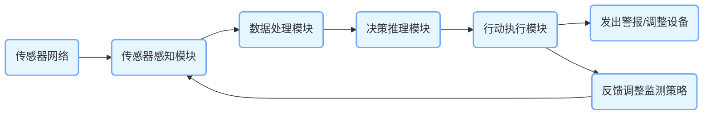

# AI Agent在智能水质实时监测中的实践

> 关键词：AI Agent、智能水质实时监测、传感器网络、数据处理、机器学习算法

> 摘要：本文围绕AI Agent在智能水质实时监测中的实践展开。首先介绍了水质实时监测的背景和重要性，阐述了AI Agent的核心概念及其与水质监测的联系。接着详细讲解了AI Agent所涉及的核心算法原理，包括使用Python代码进行具体实现。通过数学模型和公式对相关算法进行了深入剖析，并举例说明。在项目实战部分，给出了开发环境搭建、源代码实现及代码解读。探讨了AI Agent在水质监测中的实际应用场景，推荐了相关的学习资源、开发工具框架和论文著作。最后总结了未来发展趋势与挑战，并提供常见问题解答和参考资料，旨在为相关领域的研究和实践提供全面且深入的技术指导。

## 1. 背景介绍 
### 1.1 目的和范围
水质是衡量水资源质量的重要指标，与人类的生活、生产以及生态环境密切相关。传统的水质监测方法存在效率低、实时性差等问题，难以满足现代社会对水质安全和环境保护的需求。本文章的目的在于探讨如何利用AI Agent技术实现智能水质实时监测，提高水质监测的效率和准确性。范围涵盖了AI Agent的基本原理、相关算法、数据处理、系统实现以及在实际水质监测场景中的应用等方面。

### 1.2 预期读者
本文预期读者包括从事水质监测、环境科学、人工智能、计算机科学等领域的科研人员、工程师、技术爱好者以及相关专业的学生。希望通过本文，读者能够深入了解AI Agent在智能水质实时监测中的应用原理和实践方法，为其在相关领域的研究和工作提供参考。

### 1.3 文档结构概述
本文将按照以下结构进行阐述：首先介绍背景信息，包括目的、预期读者和文档结构概述等；接着讲解AI Agent与智能水质实时监测的核心概念及其联系，并给出相应的流程图；然后详细介绍核心算法原理和具体操作步骤，同时使用Python代码进行说明；通过数学模型和公式进一步解释相关算法，并举例说明；在项目实战部分，给出开发环境搭建、源代码实现和代码解读；探讨实际应用场景；推荐相关的工具和资源；总结未来发展趋势与挑战；提供常见问题解答和参考资料。

### 1.4 术语表
#### 1.4.1 核心术语定义
- **AI Agent（人工智能代理）**：是一种能够感知环境、自主决策并采取行动以实现特定目标的智能实体。在水质监测中，AI Agent可以根据传感器数据进行分析和判断，采取相应的措施。
- **智能水质实时监测**：利用先进的传感器技术、通信技术和人工智能算法，实时获取水质信息并进行分析和处理，及时发现水质异常情况。
- **传感器网络**：由多个传感器节点组成的网络，用于采集水质的各种参数，如酸碱度（pH值）、溶解氧（DO）、化学需氧量（COD）等。

#### 1.4.2 相关概念解释
- **数据融合**：将来自多个传感器的不同类型的数据进行整合和处理，以获得更全面、准确的水质信息。
- **机器学习算法**：是一类通过对数据进行学习和分析，自动发现数据中的模式和规律，并进行预测和决策的算法。在水质监测中，可用于水质预测、异常检测等。

#### 1.4.3 缩略词列表
- **DO**：Dissolved Oxygen，溶解氧
- **COD**：Chemical Oxygen Demand，化学需氧量
- **pH**：Potential of Hydrogen，酸碱度

## 2. 核心概念与联系 

### 2.1 AI Agent的核心概念
AI Agent是一种具有自主性、反应性、社会性和主动性的智能实体。自主性是指AI Agent能够在没有外界干预的情况下独立完成任务；反应性表示它能够感知环境的变化并及时做出响应；社会性意味着它可以与其他Agent进行交互和协作；主动性则体现为它能够主动地采取行动以实现目标。

在智能水质实时监测中，AI Agent可以被看作是一个智能的监测和决策系统。它通过传感器网络感知水质环境的变化，对采集到的数据进行分析和处理，根据预设的规则或机器学习模型做出决策，并采取相应的行动，如发出警报、调整监测策略等。

### 2.2 智能水质实时监测的核心概念
智能水质实时监测系统主要由传感器网络、数据传输模块、数据处理中心和决策执行模块组成。传感器网络负责实时采集水质的各种参数，如温度、pH值、DO、COD等；数据传输模块将采集到的数据传输到数据处理中心；数据处理中心对数据进行清洗、预处理、分析和挖掘；决策执行模块根据处理结果做出决策并执行相应的操作。

### 2.3 AI Agent与智能水质实时监测的联系
AI Agent在智能水质实时监测中起着核心作用。它可以对传感器网络采集到的大量数据进行高效处理和分析，利用机器学习算法挖掘数据中的潜在信息，从而实现对水质的准确预测和异常检测。同时，AI Agent可以根据监测结果自动调整监测策略，提高监测效率和准确性。例如，当检测到水质异常时，AI Agent可以及时发出警报，并通知相关人员采取措施；还可以根据水质变化情况自动调整传感器的采样频率，以获取更详细的信息。

### 2.4 文本示意图
智能水质实时监测系统中的AI Agent主要包括以下几个部分：传感器感知模块、数据处理模块、决策推理模块和行动执行模块。传感器感知模块负责从传感器网络中获取水质数据；数据处理模块对采集到的数据进行清洗、预处理和特征提取；决策推理模块根据处理后的数据和预设的规则或模型进行决策；行动执行模块根据决策结果采取相应的行动，如发出警报、调整监测设备等。

### 2.5 Mermaid流程图


## 3. 核心算法原理 & 具体操作步骤 

### 3.1 数据预处理算法
在水质监测中，传感器采集到的数据可能存在噪声、缺失值等问题，需要进行预处理。常用的数据预处理算法包括数据清洗、数据归一化和缺失值处理。

#### 3.1.1 数据清洗
数据清洗主要是去除数据中的噪声和异常值。可以使用基于统计的方法，如3σ原则，来识别和去除异常值。以下是使用Python实现的代码示例：
```python
import numpy as np

def remove_outliers(data, sigma=3):
    mean = np.mean(data)
    std = np.std(data)
    lower_bound = mean - sigma * std
    upper_bound = mean + sigma * std
    cleaned_data = [x for x in data if lower_bound <= x <= upper_bound]
    return cleaned_data
```

#### 3.1.2 数据归一化
数据归一化可以将不同范围的数据映射到相同的区间，便于后续的分析和处理。常用的归一化方法有最小 - 最大归一化和Z - 分数归一化。以下是最小 - 最大归一化的Python代码实现：
```python
def min_max_normalization(data):
    min_val = np.min(data)
    max_val = np.max(data)
    normalized_data = [(x - min_val) / (max_val - min_val) for x in data]
    return normalized_data
```

#### 3.1.3 缺失值处理
对于缺失值，可以采用均值填充、中位数填充或插值法等方法进行处理。以下是使用均值填充的Python代码示例：
```python
def fill_missing_values(data):
    mean_val = np.mean([x for x in data if not np.isnan(x)])
    filled_data = [x if not np.isnan(x) else mean_val for x in data]
    return filled_data
```

### 3.2 机器学习算法
在水质监测中，常用的机器学习算法包括支持向量机（SVM）、决策树、随机森林和神经网络等。这里以支持向量机为例，介绍其原理和具体操作步骤。

#### 3.2.1 支持向量机原理
支持向量机是一种二分类模型，其基本思想是在特征空间中找到一个最优的超平面，使得不同类别的样本能够被最大程度地分开。对于线性可分的情况，支持向量机通过求解一个凸二次规划问题来找到最优超平面；对于线性不可分的情况，可以通过核函数将数据映射到高维空间，使得数据在高维空间中线性可分。

#### 3.2.2 具体操作步骤
1. **数据准备**：将预处理后的数据分为训练集和测试集。
2. **模型训练**：使用训练集数据训练支持向量机模型。
3. **模型评估**：使用测试集数据评估模型的性能。
4. **预测**：使用训练好的模型对新的水质数据进行预测。

以下是使用Python的`sklearn`库实现支持向量机分类的代码示例：
```python
from sklearn import svm
from sklearn.model_selection import train_test_split
from sklearn.metrics import accuracy_score
import numpy as np

# 生成示例数据
X = np.array([[0, 0], [1, 1], [2, 2], [3, 3], [4, 4], [5, 5]])
y = np.array([0, 0, 1, 1, 1, 1])

# 划分训练集和测试集
X_train, X_test, y_train, y_test = train_test_split(X, y, test_size=0.2, random_state=42)

# 创建支持向量机模型
clf = svm.SVC(kernel='linear')

# 训练模型
clf.fit(X_train, y_train)

# 预测
y_pred = clf.predict(X_test)

# 评估模型
accuracy = accuracy_score(y_test, y_pred)
print(f"模型准确率: {accuracy}")
```

### 3.3 异常检测算法
异常检测是水质监测中的重要任务，用于及时发现水质的异常变化。常用的异常检测算法包括基于统计的方法、基于机器学习的方法和基于深度学习的方法。这里以基于统计的方法中的箱线图法为例，介绍其原理和具体操作步骤。

#### 3.3.1 箱线图法原理
箱线图法通过计算数据的四分位数来确定数据的分布范围，将超出一定范围的数据视为异常值。具体来说，箱线图的下四分位数（$Q_1$）、中位数（$Q_2$）和上四分位数（$Q_3$）将数据分为四个部分，四分位距（$IQR = Q_3 - Q_1$）表示数据的中间50%的分布范围。通常将小于$Q_1 - 1.5 \times IQR$或大于$Q_3 + 1.5 \times IQR$的数据视为异常值。

#### 3.3.2 具体操作步骤
1. **计算四分位数**：计算数据的下四分位数$Q_1$、中位数$Q_2$和上四分位数$Q_3$。
2. **计算四分位距**：计算$IQR = Q_3 - Q_1$。
3. **确定异常值范围**：确定异常值的范围为小于$Q_1 - 1.5 \times IQR$或大于$Q_3 + 1.5 \times IQR$。
4. **标记异常值**：将超出异常值范围的数据标记为异常值。

以下是使用Python实现箱线图法进行异常检测的代码示例：
```python
import numpy as np

def boxplot_outlier_detection(data):
    q1 = np.percentile(data, 25)
    q3 = np.percentile(data, 75)
    iqr = q3 - q1
    lower_bound = q1 - 1.5 * iqr
    upper_bound = q3 + 1.5 * iqr
    outliers = [x for x in data if x < lower_bound or x > upper_bound]
    return outliers
```

## 4. 数学模型和公式 & 详细讲解 & 举例说明 

### 4.1 数据预处理的数学模型和公式
#### 4.1.1 3σ原则
3σ原则是基于正态分布的统计方法，对于服从正态分布的数据$X \sim N(\mu, \sigma^2)$，数据落在$(\mu - 3\sigma, \mu + 3\sigma)$区间内的概率约为99.7%。因此，可以将超出该区间的数据视为异常值。数学公式如下：
$$
\text{Lower Bound} = \mu - 3\sigma \\
\text{Upper Bound} = \mu + 3\sigma
$$
其中，$\mu$是数据的均值，$\sigma$是数据的标准差。

**举例说明**：假设有一组水质温度数据$[20, 21, 22, 23, 24, 25, 26, 27, 28, 100]$，首先计算均值$\mu$和标准差$\sigma$：
```python
import numpy as np

data = [20, 21, 22, 23, 24, 25, 26, 27, 28, 100]
mean = np.mean(data)
std = np.std(data)
lower_bound = mean - 3 * std
upper_bound = mean + 3 * std
print(f"均值: {mean}, 标准差: {std}, 下限: {lower_bound}, 上限: {upper_bound}")
```
可以发现，值100超出了$(\mu - 3\sigma, \mu + 3\sigma)$区间，因此可以将其视为异常值。

#### 4.1.2 最小 - 最大归一化
最小 - 最大归一化将数据映射到$[0, 1]$区间，数学公式如下：
$$
x_{norm} = \frac{x - x_{min}}{x_{max} - x_{min}}
$$
其中，$x$是原始数据，$x_{min}$是数据的最小值，$x_{max}$是数据的最大值，$x_{norm}$是归一化后的数据。

**举例说明**：假设有一组水质pH值数据$[6.5, 7.0, 7.5, 8.0]$，使用最小 - 最大归一化进行处理：
```python
data = [6.5, 7.0, 7.5, 8.0]
min_val = np.min(data)
max_val = np.max(data)
normalized_data = [(x - min_val) / (max_val - min_val) for x in data]
print(f"归一化后的数据: {normalized_data}")
```

### 4.2 支持向量机的数学模型和公式
#### 4.2.1 线性可分情况下的支持向量机
对于线性可分的二分类问题，支持向量机的目标是找到一个最优的超平面$w^T x + b = 0$，使得不同类别的样本能够被最大程度地分开。可以通过求解以下凸二次规划问题来找到最优的$w$和$b$：
$$
\begin{aligned}
\min_{w, b} &\quad \frac{1}{2} \|w\|^2 \\
\text{s.t.} &\quad y_i (w^T x_i + b) \geq 1, \quad i = 1, 2, \cdots, n
\end{aligned}
$$
其中，$w$是超平面的法向量，$b$是偏置，$x_i$是第$i$个样本的特征向量，$y_i \in \{-1, 1\}$是第$i$个样本的标签，$n$是样本数量。

#### 4.2.2 线性不可分情况下的支持向量机
对于线性不可分的情况，可以引入松弛变量$\xi_i \geq 0$，将上述问题转化为：
$$
\begin{aligned}
\min_{w, b, \xi} &\quad \frac{1}{2} \|w\|^2 + C \sum_{i = 1}^{n} \xi_i \\
\text{s.t.} &\quad y_i (w^T x_i + b) \geq 1 - \xi_i, \quad i = 1, 2, \cdots, n \\
&\quad \xi_i \geq 0, \quad i = 1, 2, \cdots, n
\end{aligned}
$$
其中，$C$是惩罚参数，用于控制对误分类样本的惩罚程度。

#### 4.2.3 核函数
为了处理非线性可分的问题，可以使用核函数将数据映射到高维空间。常用的核函数包括线性核、多项式核、径向基核（RBF）等。以径向基核为例，其数学公式为：
$$
K(x_i, x_j) = \exp\left(-\frac{\|x_i - x_j\|^2}{2\sigma^2}\right)
$$
其中，$x_i$和$x_j$是两个样本的特征向量，$\sigma$是核函数的带宽参数。

### 4.3 箱线图法的数学模型和公式
箱线图法的核心是计算四分位数和四分位距。四分位数的计算方法有多种，这里采用常见的方法：
- **下四分位数$Q_1$**：将数据从小到大排序后，位于25%位置的值。
- **中位数$Q_2$**：将数据从小到大排序后，位于50%位置的值。
- **上四分位数$Q_3$**：将数据从小到大排序后，位于75%位置的值。

四分位距$IQR$的计算公式为：
$$
IQR = Q_3 - Q_1
$$
异常值的范围为：
$$
\text{Lower Bound} = Q_1 - 1.5 \times IQR \\
\text{Upper Bound} = Q_3 + 1.5 \times IQR
$$

**举例说明**：假设有一组水质溶解氧数据$[5, 6, 7, 8, 9, 10, 11, 12, 13, 14]$，计算四分位数和四分位距：
```python
data = [5, 6, 7, 8, 9, 10, 11, 12, 13, 14]
q1 = np.percentile(data, 25)
q2 = np.percentile(data, 50)
q3 = np.percentile(data, 75)
iqr = q3 - q1
lower_bound = q1 - 1.5 * iqr
upper_bound = q3 + 1.5 * iqr
print(f"下四分位数: {q1}, 中位数: {q2}, 上四分位数: {q3}, 四分位距: {iqr}, 下限: {lower_bound}, 上限: {upper_bound}")
```

## 5. 项目实战：代码实际案例和详细解释说明 

### 5.1  开发环境搭建
#### 5.1.1 硬件环境
- **传感器节点**：选择适合水质监测的传感器，如pH传感器、DO传感器、COD传感器等。
- **数据采集设备**：如单片机、开发板等，用于采集传感器数据。
- **服务器**：用于存储和处理传感器采集到的数据，可以选择云服务器或本地服务器。

#### 5.1.2 软件环境
- **操作系统**：可以选择Linux、Windows等操作系统。
- **编程语言**：Python是一个不错的选择，因为它有丰富的机器学习和数据处理库。
- **开发工具**：推荐使用Anaconda作为Python的开发环境管理工具，使用PyCharm作为集成开发环境（IDE）。

#### 5.1.3 安装必要的库
在Anaconda环境中，可以使用以下命令安装必要的库：
```sh
pip install numpy pandas scikit-learn matplotlib
```

### 5.2  源代码详细实现和代码解读
#### 5.2.1 数据采集模块
以下是一个简单的数据采集模块的代码示例，模拟从传感器采集水质数据：
```python
import random
import time

def collect_data():
    # 模拟采集pH值、溶解氧和温度数据
    ph = round(random.uniform(6.0, 8.0), 2)
    do = round(random.uniform(4.0, 10.0), 2)
    temperature = round(random.uniform(20.0, 30.0), 2)
    return ph, do, temperature

# 模拟持续采集数据
while True:
    ph, do, temperature = collect_data()
    print(f"pH值: {ph}, 溶解氧: {do} mg/L, 温度: {temperature} °C")
    time.sleep(5)  # 每隔5秒采集一次数据
```
**代码解读**：`collect_data`函数模拟从传感器采集pH值、溶解氧和温度数据，使用`random.uniform`函数生成随机数据，并使用`round`函数保留两位小数。在主循环中，每隔5秒调用一次`collect_data`函数采集数据并打印。

#### 5.2.2 数据处理模块
以下是一个数据处理模块的代码示例，包括数据清洗、归一化和缺失值处理：
```python
import numpy as np

def remove_outliers(data, sigma=3):
    mean = np.mean(data)
    std = np.std(data)
    lower_bound = mean - sigma * std
    upper_bound = mean + sigma * std
    cleaned_data = [x for x in data if lower_bound <= x <= upper_bound]
    return cleaned_data

def min_max_normalization(data):
    min_val = np.min(data)
    max_val = np.max(data)
    normalized_data = [(x - min_val) / (max_val - min_val) for x in data]
    return normalized_data

def fill_missing_values(data):
    mean_val = np.mean([x for x in data if not np.isnan(x)])
    filled_data = [x if not np.isnan(x) else mean_val for x in data]
    return filled_data

# 示例数据
data = [6.5, 7.0, 7.5, 8.0, np.nan, 8.5, 9.0, 100]

# 数据清洗
cleaned_data = remove_outliers(data)

# 缺失值处理
filled_data = fill_missing_values(cleaned_data)

# 数据归一化
normalized_data = min_max_normalization(filled_data)

print(f"原始数据: {data}")
print(f"清洗后的数据: {cleaned_data}")
print(f"填充缺失值后的数据: {filled_data}")
print(f"归一化后的数据: {normalized_data}")
```
**代码解读**：`remove_outliers`函数使用3σ原则去除数据中的异常值；`min_max_normalization`函数使用最小 - 最大归一化将数据映射到$[0, 1]$区间；`fill_missing_values`函数使用均值填充数据中的缺失值。在主程序中，依次调用这些函数对示例数据进行处理，并打印处理结果。

#### 5.2.3 异常检测模块
以下是一个基于箱线图法的异常检测模块的代码示例：
```python
import numpy as np

def boxplot_outlier_detection(data):
    q1 = np.percentile(data, 25)
    q3 = np.percentile(data, 75)
    iqr = q3 - q1
    lower_bound = q1 - 1.5 * iqr
    upper_bound = q3 + 1.5 * iqr
    outliers = [x for x in data if x < lower_bound or x > upper_bound]
    return outliers

# 示例数据
data = [5, 6, 7, 8, 9, 10, 11, 12, 13, 14, 20]

# 异常检测
outliers = boxplot_outlier_detection(data)

print(f"原始数据: {data}")
print(f"异常值: {outliers}")
```
**代码解读**：`boxplot_outlier_detection`函数使用箱线图法检测数据中的异常值，通过计算四分位数和四分位距确定异常值的范围，将超出该范围的数据标记为异常值。在主程序中，调用该函数对示例数据进行异常检测，并打印异常值。

### 5.3  代码解读与分析
#### 5.3.1 数据采集模块
数据采集模块的主要作用是模拟从传感器采集水质数据。在实际应用中，需要根据具体的传感器类型和接口协议进行数据采集。该模块的优点是简单易懂，能够快速模拟数据采集过程；缺点是数据是随机生成的，与实际的水质数据可能存在差异。

#### 5.3.2 数据处理模块
数据处理模块对采集到的数据进行清洗、归一化和缺失值处理，以提高数据的质量和可用性。数据清洗可以去除噪声和异常值，避免对后续分析产生影响；数据归一化可以将不同范围的数据映射到相同的区间，便于比较和分析；缺失值处理可以填补数据中的缺失部分，保证数据的完整性。

#### 5.3.3 异常检测模块
异常检测模块使用箱线图法检测数据中的异常值，能够及时发现水质的异常变化。该方法简单有效，不需要复杂的模型和计算，但对于一些复杂的异常情况可能不够准确。在实际应用中，可以结合其他异常检测方法，如基于机器学习的方法，提高异常检测的准确性。

## 6. 实际应用场景 
### 6.1 饮用水水源地监测
在饮用水水源地，使用AI Agent进行智能水质实时监测可以及时发现水质的异常变化，如污染物超标、微生物污染等。一旦检测到异常，AI Agent可以立即发出警报，通知相关部门采取措施，保障饮用水的安全。例如，当检测到水源地的重金属含量超标时，AI Agent可以及时通知水厂加强水质处理，或者采取其他应急措施，如寻找替代水源。

### 6.2 污水处理厂监测
在污水处理厂，AI Agent可以实时监测进水和出水的水质，评估污水处理效果。通过对水质数据的分析，AI Agent可以调整污水处理工艺参数，提高污水处理效率，降低处理成本。例如，当检测到进水的化学需氧量（COD）过高时，AI Agent可以自动增加曝气时间或投加更多的药剂，以确保出水水质达标。

### 6.3 工业废水排放监测
对于工业企业的废水排放，AI Agent可以实时监测废水的水质，防止企业违规排放。一旦检测到废水超标排放，AI Agent可以立即发出警报，并通知环保部门进行处理。同时，AI Agent可以对企业的废水排放情况进行长期监测和分析，为环保部门制定监管政策提供依据。

### 6.4 河流、湖泊等水环境监测
在河流、湖泊等自然水环境中，AI Agent可以实时监测水质的变化，评估水环境质量。通过对水质数据的分析，AI Agent可以及时发现水体污染事件，如蓝藻爆发、石油泄漏等，并采取相应的措施进行治理。例如，当检测到河流中的溶解氧含量过低时，AI Agent可以通知相关部门采取增氧措施，改善水质。

## 7. 工具和资源推荐
### 7.1 学习资源推荐
#### 7.1.1 书籍推荐
- 《Python机器学习实战》：介绍了Python在机器学习中的应用，包括数据处理、模型训练、评估等方面的内容。
- 《水质监测与分析》：详细介绍了水质监测的方法和技术，包括传感器原理、数据分析等方面的知识。
- 《人工智能：一种现代的方法》：全面介绍了人工智能的基本概念、算法和应用，是人工智能领域的经典教材。

#### 7.1.2 在线课程
- Coursera上的“Machine Learning”课程：由斯坦福大学的Andrew Ng教授授课，系统地介绍了机器学习的基本算法和应用。
- edX上的“Artificial Intelligence”课程：介绍了人工智能的基本概念、算法和应用，包括搜索算法、机器学习、自然语言处理等方面的内容。
- 中国大学MOOC上的“水质工程学”课程：介绍了水质监测、水处理工艺等方面的知识。

#### 7.1.3 技术博客和网站
- Medium：上面有很多关于人工智能、机器学习和水质监测的技术文章和案例分享。
- 知乎：有很多专业人士在上面分享关于水质监测和人工智能的经验和见解。
- 中国环境监测总站网站：提供了大量的水质监测数据和相关的技术标准和规范。

### 7.2 开发工具框架推荐
#### 7.2.1 IDE和编辑器
- PyCharm：是一款功能强大的Python集成开发环境，提供了代码编辑、调试、版本控制等功能。
- Jupyter Notebook：是一个交互式的开发环境，适合进行数据探索和模型实验。
- Visual Studio Code：是一款轻量级的代码编辑器，支持多种编程语言，有丰富的插件扩展功能。

#### 7.2.2 调试和性能分析工具
- PDB：Python自带的调试工具，可以帮助开发者调试代码，查找问题。
- cProfile：Python的性能分析工具，可以分析代码的执行时间和内存使用情况。
- TensorBoard：是TensorFlow的可视化工具，可以用于可视化模型训练过程和性能指标。

#### 7.2.3 相关框架和库
- Scikit-learn：是一个常用的机器学习库，提供了丰富的机器学习算法和工具，如分类、回归、聚类等。
- TensorFlow：是一个开源的深度学习框架，广泛应用于图像识别、自然语言处理等领域。
- Pandas：是一个用于数据处理和分析的库，提供了高效的数据结构和数据操作方法。

### 7.3 相关论文著作推荐
#### 7.3.1 经典论文
- Cortes, C., & Vapnik, V. (1995). Support-vector networks. Machine learning, 20(3), 273-297. 该论文介绍了支持向量机的基本原理和算法。
- Breiman, L. (2001). Random forests. Machine learning, 45(1), 5-32. 该论文介绍了随机森林算法的原理和应用。

#### 7.3.2 最新研究成果
- 可以通过IEEE Xplore、ACM Digital Library等学术数据库查找关于AI Agent在水质监测中的最新研究成果。

#### 7.3.3 应用案例分析
- 可以参考一些实际的水质监测项目案例，了解AI Agent在实际应用中的实现方法和效果。例如，某些城市的饮用水水源地监测项目、污水处理厂的智能化改造项目等。

## 8. 总结：未来发展趋势与挑战
### 8.1 未来发展趋势
#### 8.1.1 多传感器融合技术
未来，智能水质实时监测系统将采用更多类型的传感器，实现多传感器融合。通过融合不同类型传感器的数据，可以获得更全面、准确的水质信息，提高监测的精度和可靠性。例如，将水质传感器与气象传感器、地理信息传感器等相结合，综合考虑环境因素对水质的影响。

#### 8.1.2 深度学习技术的应用
深度学习技术在图像识别、自然语言处理等领域取得了显著的成果，未来也将在智能水质实时监测中得到更广泛的应用。深度学习模型可以自动从大量的水质数据中学习特征和规律，实现更准确的水质预测和异常检测。例如，使用卷积神经网络（CNN）对水质图像进行分析，检测水中的污染物。

#### 8.1.3 物联网与云计算的结合
物联网技术可以实现传感器设备的互联互通，云计算技术可以提供强大的计算和存储能力。未来，智能水质实时监测系统将实现物联网与云计算的深度结合，实现数据的实时传输和处理。通过云计算平台，可以对大量的水质数据进行存储、分析和挖掘，为水质管理和决策提供支持。

#### 8.1.4 智能决策与自动化控制
未来的智能水质实时监测系统将不仅仅是数据采集和分析，还将实现智能决策和自动化控制。AI Agent可以根据水质监测结果自动调整监测策略、发出警报，并控制相关设备进行水质处理。例如，当检测到水质异常时，AI Agent可以自动控制加药设备投加药剂，实现水质的自动调节。

### 8.2 挑战
#### 8.2.1 数据质量问题
水质监测数据的质量直接影响到AI Agent的决策和分析结果。由于传感器的精度、环境因素等原因，采集到的数据可能存在噪声、缺失值、异常值等问题。如何提高数据的质量，是智能水质实时监测面临的一个重要挑战。

#### 8.2.2 算法复杂度与效率
随着传感器数量的增加和数据量的增大，AI Agent需要处理的信息越来越复杂。如何在保证算法准确性的前提下，提高算法的效率，降低计算成本，是一个亟待解决的问题。

#### 8.2.3 模型可解释性
深度学习等复杂模型在智能水质实时监测中取得了较好的效果，但这些模型往往是黑盒模型，缺乏可解释性。在实际应用中，用户需要了解模型的决策依据，以便对监测结果进行评估和信任。因此，如何提高模型的可解释性，是智能水质实时监测面临的一个挑战。

#### 8.2.4 安全与隐私问题
智能水质实时监测系统涉及到大量的水质数据和用户信息，这些数据的安全和隐私保护至关重要。如何防止数据泄露、恶意攻击等安全问题，是智能水质实时监测系统需要解决的一个重要问题。

## 9. 附录：常见问题与解答
### 9.1 如何选择适合的水质传感器？
选择适合的水质传感器需要考虑以下几个因素：
- **监测参数**：根据需要监测的水质参数，如pH值、溶解氧、化学需氧量等，选择相应的传感器。
- **精度和准确性**：不同的传感器具有不同的精度和准确性，需要根据实际需求选择合适的传感器。
- **稳定性和可靠性**：传感器的稳定性和可靠性直接影响到监测结果的准确性，需要选择质量可靠的传感器。
- **成本**：传感器的成本也是一个需要考虑的因素，需要在满足监测需求的前提下，选择性价比高的传感器。

### 9.2 如何处理水质监测数据中的缺失值？
处理水质监测数据中的缺失值可以采用以下几种方法：
- **删除缺失值**：如果缺失值的比例较小，可以直接删除包含缺失值的样本。
- **均值填充**：用该变量的均值填充缺失值。
- **中位数填充**：用该变量的中位数填充缺失值。
- **插值法**：根据数据的变化趋势，使用插值法填充缺失值。
- **机器学习方法**：使用机器学习算法，如决策树、随机森林等，预测缺失值。

### 9.3 如何评估AI Agent在智能水质实时监测中的性能？
评估AI Agent在智能水质实时监测中的性能可以从以下几个方面进行：
- **准确性**：评估AI Agent对水质参数的预测和异常检测的准确性。
- **实时性**：评估AI Agent对水质变化的响应速度和处理效率。
- **可靠性**：评估AI Agent在不同环境条件下的稳定性和可靠性。
- **可解释性**：评估AI Agent的决策过程是否可解释，用户是否能够理解其决策依据。

### 9.4 如何保障智能水质实时监测系统的安全？
保障智能水质实时监测系统的安全可以采取以下措施：
- **数据加密**：对采集到的水质数据进行加密处理，防止数据泄露。
- **访问控制**：设置严格的访问权限，限制用户对系统的访问。
- **安全审计**：对系统的操作和访问进行审计，及时发现和处理安全问题。
- **备份和恢复**：定期对数据进行备份，确保数据的安全性和可恢复性。
- **网络安全防护**：采用防火墙、入侵检测系统等网络安全防护措施，防止恶意攻击。

## 10. 扩展阅读 & 参考资料
### 10.1 扩展阅读
- 《智能传感器技术》：深入介绍了智能传感器的原理、设计和应用，对于理解水质传感器的工作原理有很大帮助。
- 《大数据与人工智能》：探讨了大数据和人工智能在各个领域的应用，包括环境监测领域。
- 《物联网技术与应用》：介绍了物联网的基本概念、技术和应用，对于理解智能水质实时监测系统中的物联网技术有参考价值。

### 10.2 参考资料
- 相关的国家标准和行业规范，如《水质监测技术规范》等。
- 传感器制造商提供的产品说明书和技术文档。
- 学术期刊和会议论文，如《环境科学学报》、《IEEE Transactions on Intelligent Transportation Systems》等。

作者：AI天才研究院/AI Genius Institute & 禅与计算机程序设计艺术 /Zen And The Art of Computer Programming