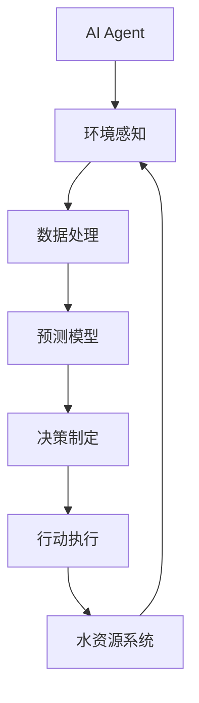

# AI Agent在智能水资源分配预测中的实践

> 关键词：AI Agent、智能水资源分配、预测、机器学习、水资源管理

> 摘要：本文围绕AI Agent在智能水资源分配预测中的实践展开。详细介绍了相关背景知识，包括目的、预期读者等。深入剖析了AI Agent及智能水资源分配预测的核心概念与联系，阐述了核心算法原理并给出Python代码示例，同时介绍了相关数学模型和公式。通过项目实战展示了代码实现和解读，探讨了实际应用场景。推荐了学习资源、开发工具框架以及相关论文著作。最后总结了未来发展趋势与挑战，并提供了常见问题解答和扩展阅读参考资料，旨在为该领域的研究和实践提供全面的指导。

## 1. 背景介绍 
### 1.1 目的和范围
随着全球人口的增长和经济的发展，水资源的合理分配和有效管理变得至关重要。传统的水资源分配方法往往依赖于经验和简单的统计模型，难以应对复杂多变的水资源需求和供应情况。AI Agent作为一种具有自主决策和学习能力的智能体，为智能水资源分配预测提供了新的思路和方法。

本文的目的是深入探讨AI Agent在智能水资源分配预测中的应用，详细介绍其核心概念、算法原理、数学模型以及实际应用案例。范围涵盖了从理论基础到实际项目开发的各个方面，旨在帮助读者全面了解和掌握AI Agent在该领域的应用技术。

### 1.2 预期读者
本文预期读者包括从事水资源管理、水利工程、人工智能等领域的科研人员、工程师和技术爱好者。对于希望将AI技术应用于水资源领域的开发者，以及对智能水资源分配预测感兴趣的学生和研究人员，本文也具有一定的参考价值。

### 1.3 文档结构概述
本文将按照以下结构进行组织：首先介绍相关背景知识，包括目的、预期读者和文档结构概述等；接着阐述AI Agent和智能水资源分配预测的核心概念与联系；然后详细讲解核心算法原理和具体操作步骤，并给出Python源代码示例；之后介绍相关的数学模型和公式，并进行详细讲解和举例说明；通过项目实战展示代码的实际应用和详细解释；探讨AI Agent在智能水资源分配预测中的实际应用场景；推荐相关的学习资源、开发工具框架和论文著作；最后总结未来发展趋势与挑战，提供常见问题解答和扩展阅读参考资料。

### 1.4 术语表
#### 1.4.1 核心术语定义
- **AI Agent**：人工智能智能体，是一种能够感知环境、做出决策并采取行动以实现特定目标的智能实体。
- **智能水资源分配**：利用先进的技术和方法，根据水资源的供应和需求情况，自动、合理地分配水资源的过程。
- **水资源分配预测**：通过对历史数据和相关因素的分析，预测未来水资源的需求和供应情况，为水资源分配提供依据。
- **机器学习**：一门多领域交叉学科，涉及概率论、统计学、逼近论、凸分析、算法复杂度理论等多门学科。它专门研究计算机怎样模拟或实现人类的学习行为，以获取新的知识或技能，重新组织已有的知识结构使之不断改善自身的性能。

#### 1.4.2 相关概念解释
- **环境感知**：AI Agent通过各种传感器和数据接口，获取水资源系统的相关信息，如水位、流量、水质等。
- **决策制定**：根据感知到的环境信息和预设的目标，AI Agent运用一定的算法和策略，制定出最优的水资源分配方案。
- **行动执行**：将决策制定阶段得到的分配方案转化为实际的操作，如调节水闸、水泵等设备的运行状态。

#### 1.4.3 缩略词列表
- **ML**：Machine Learning，机器学习
- **RL**：Reinforcement Learning，强化学习
- **ANN**：Artificial Neural Network，人工神经网络

## 2. 核心概念与联系 
### 核心概念原理
#### AI Agent
AI Agent是一种具有自主决策和学习能力的智能实体。它可以感知周围环境的变化，并根据预设的目标和规则，做出相应的决策和行动。在智能水资源分配预测中，AI Agent可以通过传感器收集水资源系统的各种数据，如水位、流量、水质等，然后利用机器学习算法对这些数据进行分析和处理，预测未来的水资源需求和供应情况，并根据预测结果制定最优的水资源分配方案。

#### 智能水资源分配预测
智能水资源分配预测是指利用先进的技术和方法，对未来水资源的需求和供应情况进行预测，并根据预测结果进行合理的水资源分配。它涉及到多个领域的知识，如水资源学、统计学、机器学习等。通过智能水资源分配预测，可以提高水资源的利用效率，减少水资源的浪费，保障水资源的可持续利用。

### 架构的文本示意图
```plaintext
|----------------------|
|      AI Agent        |
|----------------------|
|  环境感知模块        |
|  决策制定模块        |
|  行动执行模块        |
|----------------------|
|      水资源系统      |
|----------------------|
|  水位传感器          |
|  流量传感器          |
|  水质传感器          |
|  水闸、水泵等设备    |
|----------------------|
```

### Mermaid流程图


## 3. 核心算法原理 & 具体操作步骤 
### 核心算法原理
在智能水资源分配预测中，常用的算法包括机器学习算法和强化学习算法。下面以人工神经网络（ANN）为例，介绍其核心算法原理。

人工神经网络是一种模仿人类神经系统的计算模型，由大量的神经元组成。每个神经元接收来自其他神经元的输入信号，并通过激活函数对输入信号进行处理，然后将处理结果传递给其他神经元。人工神经网络通过不断地调整神经元之间的连接权重，来学习输入数据和输出数据之间的映射关系。

### 具体操作步骤
#### 数据收集
收集水资源系统的历史数据，包括水位、流量、水质等信息。

#### 数据预处理
对收集到的数据进行清洗、归一化等处理，以提高数据的质量和可用性。

#### 模型训练
使用预处理后的数据对人工神经网络进行训练，调整神经元之间的连接权重，使模型能够准确地预测未来的水资源需求和供应情况。

#### 模型评估
使用测试数据对训练好的模型进行评估，计算模型的预测误差和准确率，以评估模型的性能。

#### 决策制定
根据模型的预测结果，制定最优的水资源分配方案。

#### 行动执行
将决策制定阶段得到的分配方案转化为实际的操作，如调节水闸、水泵等设备的运行状态。

### Python源代码示例
```python
import numpy as np
import pandas as pd
from sklearn.neural_network import MLPRegressor
from sklearn.preprocessing import StandardScaler
from sklearn.model_selection import train_test_split
from sklearn.metrics import mean_squared_error

# 数据收集
data = pd.read_csv('water_resource_data.csv')

# 数据预处理
X = data.drop('target_variable', axis=1)
y = data['target_variable']
scaler = StandardScaler()
X_scaled = scaler.fit_transform(X)

# 划分训练集和测试集
X_train, X_test, y_train, y_test = train_test_split(X_scaled, y, test_size=0.2, random_state=42)

# 模型训练
model = MLPRegressor(hidden_layer_sizes=(100, 50), activation='relu', solver='adam', random_state=42)
model.fit(X_train, y_train)

# 模型评估
y_pred = model.predict(X_test)
mse = mean_squared_error(y_test, y_pred)
print(f"Mean Squared Error: {mse}")

# 决策制定和行动执行（此处简化示例）
def make_decision(predicted_value):
    if predicted_value > 100:
        return 'Increase water supply'
    else:
        return 'Maintain current water supply'

decision = make_decision(y_pred[0])
print(f"Decision: {decision}")
```

## 4. 数学模型和公式 & 详细讲解 & 举例说明 
### 人工神经网络的数学模型
人工神经网络的基本单元是神经元，其数学模型可以表示为：

$$
y = f\left(\sum_{i=1}^{n} w_{i}x_{i} + b\right)
$$

其中，$x_{i}$ 是输入信号，$w_{i}$ 是连接权重，$b$ 是偏置项，$f$ 是激活函数，$y$ 是输出信号。

### 激活函数
常用的激活函数包括 sigmoid 函数、ReLU 函数等。

#### sigmoid 函数
$$
f(x) = \frac{1}{1 + e^{-x}}
$$

sigmoid 函数将输入值映射到 $(0, 1)$ 区间，常用于二分类问题。

#### ReLU 函数
$$
f(x) = \max(0, x)
$$

ReLU 函数在 $x > 0$ 时输出 $x$，在 $x \leq 0$ 时输出 0，具有计算简单、收敛速度快等优点，常用于深度学习中。

### 损失函数
在训练人工神经网络时，需要定义一个损失函数来衡量模型的预测结果与真实值之间的差异。常用的损失函数包括均方误差（MSE）、交叉熵损失等。

#### 均方误差（MSE）
$$
MSE = \frac{1}{n} \sum_{i=1}^{n} (y_{i} - \hat{y}_{i})^{2}
$$

其中，$y_{i}$ 是真实值，$\hat{y}_{i}$ 是预测值，$n$ 是样本数量。

### 举例说明
假设我们有一个简单的人工神经网络，包含一个输入层、一个隐藏层和一个输出层。输入层有 2 个神经元，隐藏层有 3 个神经元，输出层有 1 个神经元。输入信号为 $x_1 = 0.5$，$x_2 = 0.3$，连接权重和偏置项如下：

输入层到隐藏层的连接权重：
$$
W_{1} = \begin{bmatrix}
0.2 & 0.3 & 0.4 \\
0.1 & 0.2 & 0.3
\end{bmatrix}
$$

隐藏层的偏置项：
$$
b_{1} = \begin{bmatrix}
0.1 \\
0.2 \\
0.3
\end{bmatrix}
$$

隐藏层到输出层的连接权重：
$$
W_{2} = \begin{bmatrix}
0.5 \\
0.6 \\
0.7
\end{bmatrix}
$$

输出层的偏置项：
$$
b_{2} = 0.1
$$

激活函数采用 sigmoid 函数。

首先，计算隐藏层的输入：
$$
z_{1} = W_{1}^{T} \begin{bmatrix}
x_{1} \\
x_{2}
\end{bmatrix} + b_{1} = \begin{bmatrix}
0.2 & 0.1 \\
0.3 & 0.2 \\
0.4 & 0.3
\end{bmatrix} \begin{bmatrix}
0.5 \\
0.3
\end{bmatrix} + \begin{bmatrix}
0.1 \\
0.2 \\
0.3
\end{bmatrix} = \begin{bmatrix}
0.1 + 0.03 + 0.1 \\
0.15 + 0.06 + 0.2 \\
0.2 + 0.09 + 0.3
\end{bmatrix} = \begin{bmatrix}
0.23 \\
0.41 \\
0.59
\end{bmatrix}
$$

然后，计算隐藏层的输出：
$$
a_{1} = f(z_{1}) = \begin{bmatrix}
\frac{1}{1 + e^{-0.23}} \\
\frac{1}{1 + e^{-0.41}} \\
\frac{1}{1 + e^{-0.59}}
\end{bmatrix} \approx \begin{bmatrix}
0.557 \\
0.601 \\
0.643
\end{bmatrix}
$$

接着，计算输出层的输入：
$$
z_{2} = W_{2}^{T} a_{1} + b_{2} = \begin{bmatrix}
0.5 & 0.6 & 0.7
\end{bmatrix} \begin{bmatrix}
0.557 \\
0.601 \\
0.643
\end{bmatrix} + 0.1 = 0.2785 + 0.3606 + 0.4501 + 0.1 = 1.1892
$$

最后，计算输出层的输出：
$$
y = f(z_{2}) = \frac{1}{1 + e^{-1.1892}} \approx 0.766
$$

## 5. 项目实战：代码实际案例和详细解释说明 
### 5.1  开发环境搭建
#### 操作系统
推荐使用 Linux 或 macOS 操作系统，也可以使用 Windows 操作系统。

#### 编程语言
使用 Python 3.x 版本，Python 具有丰富的科学计算和机器学习库，适合用于智能水资源分配预测项目的开发。

#### 开发工具
推荐使用 Anaconda 作为 Python 环境管理工具，它可以方便地安装和管理各种 Python 库。同时，可以使用 Jupyter Notebook 或 PyCharm 作为开发环境，Jupyter Notebook 适合进行交互式开发和数据分析，PyCharm 适合进行大型项目的开发。

#### 安装必要的库
在 Anaconda 环境中，使用以下命令安装必要的库：
```sh
conda install numpy pandas scikit-learn matplotlib
```

### 5.2  源代码详细实现和代码解读
```python
import numpy as np
import pandas as pd
from sklearn.neural_network import MLPRegressor
from sklearn.preprocessing import StandardScaler
from sklearn.model_selection import train_test_split
from sklearn.metrics import mean_squared_error
import matplotlib.pyplot as plt

# 数据收集
data = pd.read_csv('water_resource_data.csv')

# 数据预处理
X = data.drop('target_variable', axis=1)
y = data['target_variable']
scaler = StandardScaler()
X_scaled = scaler.fit_transform(X)

# 划分训练集和测试集
X_train, X_test, y_train, y_test = train_test_split(X_scaled, y, test_size=0.2, random_state=42)

# 模型训练
model = MLPRegressor(hidden_layer_sizes=(100, 50), activation='relu', solver='adam', random_state=42)
model.fit(X_train, y_train)

# 模型评估
y_pred = model.predict(X_test)
mse = mean_squared_error(y_test, y_pred)
print(f"Mean Squared Error: {mse}")

# 可视化预测结果
plt.scatter(y_test, y_pred)
plt.xlabel('Actual Values')
plt.ylabel('Predicted Values')
plt.title('Actual vs Predicted Values')
plt.show()

# 决策制定和行动执行（此处简化示例）
def make_decision(predicted_value):
    if predicted_value > 100:
        return 'Increase water supply'
    else:
        return 'Maintain current water supply'

decision = make_decision(y_pred[0])
print(f"Decision: {decision}")
```

### 代码解读与分析
#### 数据收集
使用 `pandas` 库的 `read_csv` 函数读取水资源数据文件。

#### 数据预处理
使用 `StandardScaler` 对输入数据进行归一化处理，以提高模型的训练效果。

#### 划分训练集和测试集
使用 `train_test_split` 函数将数据集划分为训练集和测试集，其中测试集占总数据集的 20%。

#### 模型训练
使用 `MLPRegressor` 构建人工神经网络模型，并使用训练集对模型进行训练。

#### 模型评估
使用 `mean_squared_error` 函数计算模型的均方误差，评估模型的性能。

#### 可视化预测结果
使用 `matplotlib` 库绘制实际值和预测值的散点图，直观地展示模型的预测效果。

#### 决策制定和行动执行
定义一个简单的决策函数 `make_decision`，根据预测结果制定相应的水资源分配决策。

## 6. 实际应用场景 
### 城市水资源分配
在城市水资源管理中，AI Agent可以实时监测城市的水资源供应和需求情况，预测未来的用水高峰和低谷，根据预测结果合理分配水资源，如调整水库的放水量、控制供水管道的流量等，以保障城市居民的用水需求。

### 农业灌溉用水分配
在农业领域，AI Agent可以根据土壤湿度、气象条件等因素，预测农作物的需水量，合理安排灌溉时间和灌溉量，提高水资源的利用效率，减少水资源的浪费。

### 工业用水分配
对于工业企业，AI Agent可以根据生产计划和设备运行情况，预测工业用水的需求，优化水资源的分配方案，降低企业的用水成本，提高生产效率。

### 水资源应急管理
在发生干旱、洪水等自然灾害时，AI Agent可以快速评估水资源的受损情况和需求情况，制定应急水资源分配方案，保障灾区居民的基本生活用水和重要设施的用水需求。

## 7. 工具和资源推荐
### 7.1 学习资源推荐
#### 7.1.1 书籍推荐
- 《Python机器学习实战》：介绍了Python在机器学习领域的应用，包括数据预处理、模型训练、评估等方面的知识。
- 《深度学习》：由深度学习领域的三位顶尖专家 Ian Goodfellow、Yoshua Bengio 和 Aaron Courville 撰写，系统地介绍了深度学习的理论和实践。
- 《水资源系统分析》：涵盖了水资源系统的建模、优化、决策等方面的内容，为智能水资源分配预测提供了理论基础。

#### 7.1.2 在线课程
- Coursera 上的“机器学习”课程：由斯坦福大学的 Andrew Ng 教授授课，是机器学习领域的经典课程。
- edX 上的“深度学习”课程：提供了深度学习的基础知识和实践项目。
- 中国大学MOOC上的“水资源规划与管理”课程：介绍了水资源规划与管理的基本原理和方法。

#### 7.1.3 技术博客和网站
- Towards Data Science：一个专注于数据科学和机器学习的博客平台，提供了大量的技术文章和案例分析。
- Kaggle：一个数据科学竞赛平台，上面有很多关于水资源预测和管理的数据集和解决方案。
- 水利部官方网站：提供了最新的水资源政策、数据和研究成果。

### 7.2 开发工具框架推荐
#### 7.2.1 IDE和编辑器
- PyCharm：一款专业的Python集成开发环境，具有代码自动补全、调试、版本控制等功能。
- Jupyter Notebook：一个交互式的开发环境，适合进行数据分析和模型训练。
- Visual Studio Code：一款轻量级的代码编辑器，支持多种编程语言和插件扩展。

#### 7.2.2 调试和性能分析工具
- TensorBoard：TensorFlow 提供的可视化工具，可以帮助用户监控模型的训练过程和性能指标。
- Py-Spy：一个 Python 性能分析工具，可以实时监控 Python 程序的 CPU 使用率和内存占用情况。
- cProfile：Python 标准库中的性能分析模块，可以分析 Python 程序的函数调用时间和次数。

#### 7.2.3 相关框架和库
- TensorFlow：一个开源的深度学习框架，提供了丰富的神经网络模型和工具。
- PyTorch：另一个流行的深度学习框架，具有动态图机制，适合进行快速开发和实验。
- Scikit-learn：一个简单易用的机器学习库，提供了多种机器学习算法和工具。

### 7.3 相关论文著作推荐
#### 7.3.1 经典论文
- “Artificial Neural Networks for Water Resources Modeling”：介绍了人工神经网络在水资源建模中的应用。
- “Reinforcement Learning for Water Resource Management”：探讨了强化学习在水资源管理中的应用。
- “Data-Driven Approaches for Water Demand Forecasting”：研究了数据驱动的方法在水资源需求预测中的应用。

#### 7.3.2 最新研究成果
可以通过学术数据库如 IEEE Xplore、ACM Digital Library、ScienceDirect 等搜索关于 AI Agent 在智能水资源分配预测领域的最新研究成果。

#### 7.3.3 应用案例分析
可以参考一些实际的水资源管理项目案例，了解 AI Agent 在实际应用中的效果和经验教训。

## 8. 总结：未来发展趋势与挑战
### 未来发展趋势
#### 多智能体协同
未来，多个 AI Agent 可以协同工作，共同完成智能水资源分配预测任务。例如，不同地区的 AI Agent 可以相互通信和协作，实现跨区域的水资源优化分配。

#### 融合多源数据
随着传感器技术和物联网的发展，越来越多的水资源相关数据可以被收集和利用。未来的 AI Agent 可以融合多源数据，如气象数据、地理信息数据、社会经济数据等，提高水资源分配预测的准确性和可靠性。

#### 与区块链技术结合
区块链技术具有去中心化、不可篡改、可追溯等特点，可以为水资源管理提供更加安全、透明的解决方案。未来的 AI Agent 可以与区块链技术结合，实现水资源交易的智能化和自动化。

### 挑战
#### 数据质量和隐私问题
水资源数据的质量和隐私是影响 AI Agent 性能和应用的重要因素。数据可能存在缺失、错误、噪声等问题，需要进行有效的数据清洗和预处理。同时，水资源数据涉及到个人和企业的隐私，需要采取有效的措施保护数据的安全和隐私。

#### 模型可解释性
AI 模型通常是黑盒模型，难以解释其决策过程和结果。在智能水资源分配预测中，模型的可解释性非常重要，因为决策者需要了解模型的预测依据和合理性。因此，需要研究和开发具有可解释性的 AI 模型。

#### 计算资源和能耗问题
AI Agent 的训练和运行需要大量的计算资源和能耗。在实际应用中，需要考虑如何优化模型结构和算法，降低计算资源的需求和能耗，提高系统的效率和可持续性。

## 9. 附录：常见问题与解答
### 问题1：AI Agent 在智能水资源分配预测中的准确性如何保证？
解答：可以通过以下方法保证 AI Agent 的准确性：
- 收集高质量的数据，包括历史数据和实时数据。
- 对数据进行有效的预处理，如清洗、归一化等。
- 选择合适的模型和算法，并进行调优。
- 进行模型评估和验证，使用交叉验证等方法评估模型的性能。

### 问题2：AI Agent 能否适应水资源系统的动态变化？
解答：可以通过以下方式使 AI Agent 适应水资源系统的动态变化：
- 使用在线学习算法，使模型能够根据新的数据不断更新和调整。
- 引入强化学习机制，使 AI Agent 能够根据环境的反馈不断优化决策策略。
- 定期对模型进行评估和更新，确保模型的性能和适应性。

### 问题3：AI Agent 在实际应用中需要考虑哪些因素？
解答：在实际应用中，需要考虑以下因素：
- 水资源系统的复杂性和不确定性。
- 数据的质量和可用性。
- 计算资源和能耗的限制。
- 法律法规和政策的要求。
- 社会和公众的接受程度。

## 10. 扩展阅读 & 参考资料
### 扩展阅读
- 《人工智能：一种现代的方法》：全面介绍了人工智能的基本概念、方法和应用。
- 《智能电网中的人工智能技术》：探讨了人工智能在电力系统中的应用，与智能水资源分配预测有一定的相似性。
- 《水资源可持续利用与管理》：介绍了水资源可持续利用的理论和实践。

### 参考资料
- 相关的学术论文和研究报告。
- 水利部、环保部等政府部门发布的政策文件和统计数据。
- 相关的开源代码库和数据集。

作者：AI天才研究院/AI Genius Institute & 禅与计算机程序设计艺术 /Zen And The Art of Computer Programming