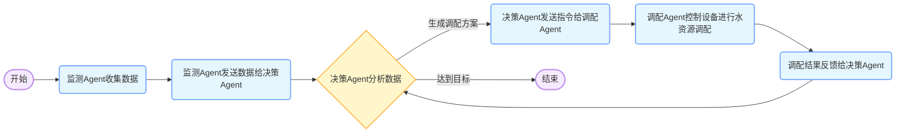

# AI Agent在智能水资源管理系统中的实践

> 关键词：AI Agent、智能水资源管理系统、水资源监测、水资源调配、决策优化

> 摘要：本文围绕AI Agent在智能水资源管理系统中的实践展开，深入探讨了AI Agent的核心概念、算法原理、数学模型等内容。详细介绍了如何利用AI Agent实现水资源的监测、调配和决策优化等功能。通过项目实战案例，展示了AI Agent在实际应用中的具体实现和效果。同时，分析了AI Agent在智能水资源管理系统中的实际应用场景，推荐了相关的学习资源、开发工具和论文著作。最后，总结了AI Agent在该领域的未来发展趋势与挑战，并提供了常见问题的解答和扩展阅读参考资料。

## 1. 背景介绍 
### 1.1 目的和范围
随着全球人口的增长和经济的发展，水资源的合理管理和利用变得至关重要。智能水资源管理系统旨在利用先进的技术手段，实现水资源的高效监测、调配和决策优化。AI Agent作为一种智能的计算实体，具有自主学习、决策和交互的能力，能够在复杂的水资源管理环境中发挥重要作用。本文的目的是探讨AI Agent在智能水资源管理系统中的实践应用，涵盖从核心概念到实际项目的各个方面，为相关领域的研究和实践提供参考。

### 1.2 预期读者
本文预期读者包括从事水资源管理、人工智能、计算机科学等领域的研究人员、工程师和技术爱好者。对于希望了解如何将AI技术应用于水资源管理的专业人士，以及对智能系统开发感兴趣的初学者都具有一定的参考价值。

### 1.3 文档结构概述
本文首先介绍AI Agent和智能水资源管理系统的核心概念及其联系，通过文本示意图和Mermaid流程图进行直观展示。接着阐述AI Agent在智能水资源管理中涉及的核心算法原理，并给出具体的Python代码实现。然后介绍相关的数学模型和公式，并通过举例说明其应用。在项目实战部分，详细介绍开发环境搭建、源代码实现和代码解读。之后分析AI Agent在智能水资源管理系统中的实际应用场景。再推荐相关的学习资源、开发工具和论文著作。最后总结未来发展趋势与挑战，提供常见问题解答和扩展阅读参考资料。

### 1.4 术语表
#### 1.4.1 核心术语定义
- **AI Agent**：人工智能代理，是一种能够感知环境、自主决策并采取行动以实现特定目标的智能实体。
- **智能水资源管理系统**：利用信息技术、传感器技术和人工智能等手段，对水资源进行实时监测、分析、调配和决策的综合系统。
- **水资源监测**：对水资源的数量、质量、水位、流量等参数进行实时或定期的测量和记录。
- **水资源调配**：根据水资源的分布和需求情况，合理分配水资源，以满足不同用户的用水需求。
- **决策优化**：在复杂的水资源管理问题中，通过算法和模型找到最优的决策方案。

#### 1.4.2 相关概念解释
- **多Agent系统（MAS）**：由多个AI Agent组成的系统，这些Agent之间可以相互协作、竞争，共同完成复杂的任务。在智能水资源管理系统中，不同类型的Agent可以负责不同的任务，如监测Agent、调配Agent等。
- **强化学习**：一种机器学习方法，Agent通过与环境进行交互，根据环境反馈的奖励信号来学习最优的行为策略。在水资源管理中，强化学习可以用于优化水资源调配策略。

#### 1.4.3 缩略词列表
- **AI**：Artificial Intelligence，人工智能
- **MAS**：Multi-Agent System，多Agent系统
- **RL**：Reinforcement Learning，强化学习

## 2. 核心概念与联系 

### 核心概念原理
AI Agent在智能水资源管理系统中扮演着关键角色。其核心原理基于感知、决策和行动的循环过程。AI Agent通过传感器等设备感知水资源管理环境中的各种信息，如水位、流量、水质等。然后，根据预设的目标和规则，利用机器学习、优化算法等技术进行决策，确定应该采取的行动。最后，将决策结果转化为具体的操作指令，如控制水泵的开关、调节水闸的开度等，以实现对水资源的有效管理。

### 架构的文本示意图
智能水资源管理系统中的AI Agent架构可以描述如下：

系统主要由多个AI Agent和水资源管理环境组成。AI Agent包括监测Agent、调配Agent和决策Agent等。监测Agent负责收集水资源的实时数据，如水位、流量、水质等，并将数据发送给决策Agent。决策Agent根据监测数据和预设的目标，利用算法进行分析和决策，生成调配方案。调配Agent根据决策Agent的指令，控制相关设备，如水泵、水闸等，实现水资源的调配。同时，各个Agent之间可以进行信息交互和协作，以提高系统的整体性能。

### Mermaid流程图


## 3. 核心算法原理 & 具体操作步骤 

### 强化学习算法原理
强化学习是AI Agent在智能水资源管理系统中常用的算法之一。其基本原理是Agent通过与环境进行交互，不断尝试不同的行动，并根据环境反馈的奖励信号来学习最优的行为策略。在水资源管理中，环境可以看作是水资源系统的状态，如水位、流量等；行动可以是水泵的开关、水闸的调节等；奖励信号可以根据水资源的合理利用程度、满足用户需求的程度等因素来定义。

### Python代码实现
```python
import numpy as np

# 定义环境类
class WaterResourceEnvironment:
    def __init__(self):
        # 初始化环境状态
        self.state = np.random.randint(0, 10)  # 假设水位状态在0-9之间
        self.goal = 5  # 目标水位

    def step(self, action):
        # 根据行动更新环境状态
        if action == 0:  # 关闭水泵
            if self.state > 0:
                self.state -= 1
        elif action == 1:  # 打开水泵
            if self.state < 9:
                self.state += 1

        # 计算奖励
        reward = -np.abs(self.state - self.goal)

        # 判断是否达到目标
        done = self.state == self.goal

        return self.state, reward, done

# 定义AI Agent类
class AIWaterAgent:
    def __init__(self):
        # 初始化Q表
        self.q_table = np.zeros((10, 2))  # 10个状态，2个行动
        self.learning_rate = 0.1
        self.discount_factor = 0.9
        self.epsilon = 0.1

    def choose_action(self, state):
        # 基于epsilon-greedy策略选择行动
        if np.random.uniform(0, 1) < self.epsilon:
            action = np.random.randint(0, 2)  # 随机选择行动
        else:
            action = np.argmax(self.q_table[state])  # 选择Q值最大的行动
        return action

    def learn(self, state, action, reward, next_state):
        # 更新Q表
        predict = self.q_table[state, action]
        target = reward + self.discount_factor * np.max(self.q_table[next_state])
        self.q_table[state, action] += self.learning_rate * (target - predict)

# 训练过程
env = WaterResourceEnvironment()
agent = AIWaterAgent()

episodes = 1000
for episode in range(episodes):
    state = env.state
    done = False
    while not done:
        action = agent.choose_action(state)
        next_state, reward, done = env.step(action)
        agent.learn(state, action, reward, next_state)
        state = next_state

print("训练完成，最终Q表：")
print(agent.q_table)
```

### 具体操作步骤
1. **初始化环境和Agent**：创建水资源环境对象和AI Agent对象，初始化环境状态和Q表。
2. **选择行动**：Agent根据当前环境状态，使用epsilon-greedy策略选择一个行动。
3. **执行行动**：Agent将选择的行动发送给环境，环境根据行动更新状态，并返回新的状态、奖励和是否达到目标的信息。
4. **学习更新**：Agent根据环境反馈的信息，使用Q学习算法更新Q表。
5. **重复步骤2-4**：直到达到目标或达到最大步数。
6. **训练结束**：经过多次训练，Agent学习到最优的行为策略。

## 4. 数学模型和公式 & 详细讲解 & 举例说明 

### Q学习算法的数学模型和公式
Q学习算法是一种基于值函数的强化学习算法，其核心是更新Q表。Q表记录了在每个状态下采取每个行动的预期价值。Q学习的更新公式如下：

$$Q(s_t, a_t) \leftarrow Q(s_t, a_t) + \alpha [r_{t+1} + \gamma \max_{a} Q(s_{t+1}, a) - Q(s_t, a_t)]$$

其中：
- $Q(s_t, a_t)$ 表示在状态 $s_t$ 下采取行动 $a_t$ 的Q值。
- $\alpha$ 是学习率，控制每次更新的步长。
- $r_{t+1}$ 是在状态 $s_t$ 采取行动 $a_t$ 后获得的即时奖励。
- $\gamma$ 是折扣因子，用于平衡即时奖励和未来奖励的重要性。
- $\max_{a} Q(s_{t+1}, a)$ 表示在状态 $s_{t+1}$ 下所有可能行动的最大Q值。

### 详细讲解
Q学习算法的目标是通过不断更新Q表，使得Q值能够准确地反映在每个状态下采取每个行动的最优价值。学习率 $\alpha$ 决定了每次更新的幅度，如果 $\alpha$ 过大，可能会导致算法不稳定；如果 $\alpha$ 过小，学习速度会变慢。折扣因子 $\gamma$ 表示未来奖励的重要程度，$\gamma$ 越接近1，Agent越注重未来的奖励；$\gamma$ 越接近0，Agent越注重即时奖励。

### 举例说明
假设在某一时刻，环境状态 $s_t = 3$，Agent选择的行动 $a_t = 1$（打开水泵），执行行动后获得的即时奖励 $r_{t+1} = -1$，新的状态 $s_{t+1} = 4$。假设学习率 $\alpha = 0.1$，折扣因子 $\gamma = 0.9$，当前 $Q(3, 1) = 0.2$，$Q(4, 0) = 0.3$，$Q(4, 1) = 0.4$。

首先计算 $\max_{a} Q(s_{t+1}, a) = \max(Q(4, 0), Q(4, 1)) = 0.4$。

然后根据Q学习更新公式：

$$
\begin{align*}
Q(3, 1) &\leftarrow Q(3, 1) + \alpha [r_{t+1} + \gamma \max_{a} Q(s_{t+1}, a) - Q(3, 1)]\\
&= 0.2 + 0.1 [-1 + 0.9 \times 0.4 - 0.2]\\
&= 0.2 + 0.1 [-1 + 0.36 - 0.2]\\
&= 0.2 + 0.1 [-0.84]\\
&= 0.2 - 0.084\\
&= 0.116
\end{align*}
$$

更新后的 $Q(3, 1)$ 值为0.116。

## 5. 项目实战：代码实际案例和详细解释说明 

### 5.1  开发环境搭建
#### 硬件环境
- 服务器：可以选择云服务器，如阿里云、腾讯云等，也可以使用本地服务器。服务器需要具备一定的计算能力和存储容量，以支持AI Agent的训练和运行。
- 传感器：用于监测水资源的各种参数，如水位传感器、流量传感器、水质传感器等。传感器需要与服务器进行数据传输，可以通过有线或无线方式连接。
- 控制设备：如水泵、水闸等，用于实现水资源的调配。控制设备需要能够接收服务器发送的指令，并根据指令进行相应的操作。

#### 软件环境
- 操作系统：可以选择Linux系统，如Ubuntu、CentOS等，也可以使用Windows系统。
- 编程语言：Python是首选的编程语言，因为它具有丰富的机器学习和数据分析库。
- 开发框架：可以使用TensorFlow、PyTorch等深度学习框架，以及OpenAI Gym等强化学习环境库。

### 5.2  源代码详细实现和代码解读
```python
import numpy as np
import gym

# 自定义水资源管理环境
class WaterResourceEnv(gym.Env):
    def __init__(self):
        super(WaterResourceEnv, self).__init__()
        # 定义状态空间和行动空间
        self.observation_space = gym.spaces.Discrete(10)  # 假设水位状态在0-9之间
        self.action_space = gym.spaces.Discrete(2)  # 0: 关闭水泵，1: 打开水泵
        self.state = np.random.randint(0, 10)  # 初始化状态
        self.goal = 5  # 目标水位

    def step(self, action):
        # 根据行动更新状态
        if action == 0:  # 关闭水泵
            if self.state > 0:
                self.state -= 1
        elif action == 1:  # 打开水泵
            if self.state < 9:
                self.state += 1

        # 计算奖励
        reward = -np.abs(self.state - self.goal)

        # 判断是否达到目标
        done = self.state == self.goal

        # 返回状态、奖励、是否结束和额外信息
        return self.state, reward, done, {}

    def reset(self):
        # 重置环境状态
        self.state = np.random.randint(0, 10)
        return self.state

# 定义AI Agent类
class AIWaterAgent:
    def __init__(self, state_space, action_space):
        # 初始化Q表
        self.q_table = np.zeros((state_space, action_space))
        self.learning_rate = 0.1
        self.discount_factor = 0.9
        self.epsilon = 0.1

    def choose_action(self, state):
        # 基于epsilon-greedy策略选择行动
        if np.random.uniform(0, 1) < self.epsilon:
            action = np.random.randint(0, 2)  # 随机选择行动
        else:
            action = np.argmax(self.q_table[state])  # 选择Q值最大的行动
        return action

    def learn(self, state, action, reward, next_state):
        # 更新Q表
        predict = self.q_table[state, action]
        target = reward + self.discount_factor * np.max(self.q_table[next_state])
        self.q_table[state, action] += self.learning_rate * (target - predict)

# 训练过程
env = WaterResourceEnv()
agent = AIWaterAgent(env.observation_space.n, env.action_space.n)

episodes = 1000
for episode in range(episodes):
    state = env.reset()
    done = False
    while not done:
        action = agent.choose_action(state)
        next_state, reward, done, _ = env.step(action)
        agent.learn(state, action, reward, next_state)
        state = next_state

print("训练完成，最终Q表：")
print(agent.q_table)
```

### 代码解读与分析
#### 自定义环境类 `WaterResourceEnv`
- `__init__` 方法：初始化环境的状态空间、行动空间、初始状态和目标水位。
- `step` 方法：根据Agent选择的行动更新环境状态，计算奖励，判断是否达到目标，并返回状态、奖励、是否结束和额外信息。
- `reset` 方法：重置环境状态，返回初始状态。

#### AI Agent类 `AIWaterAgent`
- `__init__` 方法：初始化Q表、学习率、折扣因子和探索率。
- `choose_action` 方法：基于epsilon-greedy策略选择行动，以一定的概率随机选择行动，以保证Agent能够探索新的状态和行动。
- `learn` 方法：根据Q学习算法更新Q表。

#### 训练过程
通过多次训练，Agent不断与环境进行交互，学习到最优的行为策略。训练完成后，输出最终的Q表。

## 6. 实际应用场景 
### 水资源监测与预警
AI Agent可以实时收集水资源的各种参数，如水位、流量、水质等。通过对这些数据的分析，Agent可以及时发现水资源异常情况，如水位过高或过低、水质污染等，并发出预警信号。例如，当水位超过警戒水位时，Agent可以自动触发警报，并通知相关人员采取措施。

### 水资源调配优化
在水资源分配过程中，AI Agent可以根据不同用户的用水需求、水资源的分布情况和实时状态，优化水资源的调配方案。例如，在农业灌溉中，Agent可以根据土壤湿度、作物需水量等因素，合理控制灌溉水量和时间，提高水资源的利用效率。

### 水资源系统的故障诊断与修复
AI Agent可以对水资源系统中的设备进行实时监测，如水泵、水闸等。当设备出现故障时，Agent可以通过分析设备的运行数据，快速诊断故障原因，并提供相应的修复建议。例如，当水泵的电流异常时，Agent可以判断水泵可能出现了故障，并建议检查电机或电路。

### 水资源规划与决策支持
AI Agent可以利用历史数据和预测模型，对水资源的未来需求和供应情况进行预测。根据预测结果，Agent可以为水资源规划和决策提供支持，如制定水资源开发计划、调整用水政策等。例如，通过对未来几年的人口增长和经济发展情况的预测，Agent可以预测水资源的需求趋势，为水资源的合理规划提供依据。

## 7. 工具和资源推荐
### 7.1 学习资源推荐
#### 7.1.1 书籍推荐
- 《人工智能：一种现代的方法》：全面介绍了人工智能的各个领域，包括搜索算法、机器学习、知识表示等，是人工智能领域的经典教材。
- 《强化学习：原理与Python实现》：详细介绍了强化学习的基本原理和算法，并通过Python代码实现了多个实际案例，适合初学者学习强化学习。
- 《水资源系统分析》：系统介绍了水资源系统的建模、分析和优化方法，对于理解水资源管理问题有很大帮助。

#### 7.1.2 在线课程
- Coursera上的“人工智能基础”课程：由知名高校的教授授课，涵盖了人工智能的基本概念、算法和应用。
- edX上的“强化学习”课程：深入讲解了强化学习的理论和实践，通过实际项目让学生掌握强化学习的应用。
- 中国大学MOOC上的“水资源规划与管理”课程：介绍了水资源规划和管理的基本理论和方法，结合实际案例进行讲解。

#### 7.1.3 技术博客和网站
- Towards Data Science：提供了大量关于人工智能、机器学习和数据分析的技术文章和案例，涵盖了最新的研究成果和应用。
- AI Time：专注于人工智能领域的技术分享和交流，有很多专家的讲座和报告。
- 中国水利网：提供了水资源管理领域的最新政策、法规和技术动态。

### 7.2 开发工具框架推荐
#### 7.2.1 IDE和编辑器
- PyCharm：是一款专门为Python开发设计的集成开发环境，具有强大的代码编辑、调试和分析功能。
- Jupyter Notebook：是一个交互式的开发环境，适合进行数据探索、模型训练和可视化展示。
- Visual Studio Code：是一款轻量级的代码编辑器，支持多种编程语言和插件扩展，非常适合快速开发。

#### 7.2.2 调试和性能分析工具
- TensorBoard：是TensorFlow提供的可视化工具，可以用于监控模型的训练过程、查看模型的结构和性能指标。
- Py-Spy：是一个Python性能分析工具，可以帮助开发者找出代码中的性能瓶颈。
- Debugpy：是Python的调试器，支持在多种开发环境中使用。

#### 7.2.3 相关框架和库
- TensorFlow：是一个开源的深度学习框架，提供了丰富的工具和函数，用于构建和训练各种深度学习模型。
- PyTorch：是另一个流行的深度学习框架，具有动态图和易于使用的特点，适合快速开发和研究。
- OpenAI Gym：是一个用于开发和比较强化学习算法的工具包，提供了多种环境和接口。

### 7.3 相关论文著作推荐
#### 7.3.1 经典论文
- “Q-Learning”：由Watkins和Dayan发表的经典论文，首次提出了Q学习算法，是强化学习领域的重要里程碑。
- “Reinforcement Learning: A Survey”：对强化学习的发展历程、算法和应用进行了全面的综述，是了解强化学习的重要文献。
- “Water Resources Systems Analysis: An Introduction”：介绍了水资源系统分析的基本概念、方法和应用，为水资源管理领域的研究提供了理论基础。

#### 7.3.2 最新研究成果
- 近年来，关于AI Agent在水资源管理中的应用研究不断涌现。可以通过IEEE Xplore、ACM Digital Library等学术数据库搜索相关的最新研究论文，了解该领域的前沿动态。

#### 7.3.3 应用案例分析
- 一些实际的水资源管理项目会发布相关的案例分析报告。可以通过查阅相关的行业报告、学术会议论文集等，了解AI Agent在实际项目中的应用效果和经验教训。

## 8. 总结：未来发展趋势与挑战
### 未来发展趋势
- **多Agent协同合作**：未来的智能水资源管理系统将越来越多地采用多Agent系统，不同类型的Agent之间可以相互协作、竞争，共同完成复杂的水资源管理任务。例如，监测Agent、调配Agent和决策Agent可以协同工作，提高系统的整体性能。
- **与物联网和大数据的融合**：随着物联网技术的发展，更多的传感器将被应用于水资源监测，产生大量的实时数据。AI Agent可以结合大数据分析技术，对这些数据进行深度挖掘和分析，为水资源管理提供更准确的决策支持。
- **强化学习与深度学习的结合**：强化学习和深度学习都是人工智能领域的重要技术。未来，将两者结合起来的方法可能会在智能水资源管理中得到更广泛的应用。例如，使用深度学习模型来学习环境的复杂特征，然后结合强化学习算法进行决策优化。

### 挑战
- **数据质量和安全**：智能水资源管理系统依赖于大量的实时数据，数据的质量和安全直接影响系统的性能和可靠性。如何确保数据的准确性、完整性和安全性是一个重要的挑战。
- **算法复杂度和计算资源**：一些复杂的AI算法，如深度学习和强化学习，需要大量的计算资源和时间来训练和运行。在实际应用中，如何平衡算法的复杂度和计算资源的需求是一个需要解决的问题。
- **伦理和法律问题**：AI Agent在水资源管理中的应用可能会涉及到一些伦理和法律问题，如决策的公正性、责任的归属等。如何制定相应的伦理和法律规范，确保AI Agent的合理应用是一个亟待解决的问题。

## 9. 附录：常见问题与解答
### 问题1：AI Agent在智能水资源管理系统中的应用是否会受到环境因素的影响？
解答：是的，AI Agent的性能可能会受到环境因素的影响。例如，传感器的精度、数据传输的稳定性等都会影响Agent获取的环境信息的准确性。此外，水资源系统的复杂性和不确定性也会增加Agent决策的难度。为了减少环境因素的影响，可以采用冗余传感器、数据滤波和校正等方法提高数据质量，同时使用鲁棒性强的算法来应对环境的变化。

### 问题2：如何评估AI Agent在智能水资源管理系统中的性能？
解答：可以从多个方面评估AI Agent的性能。例如，水资源的利用效率、满足用户需求的程度、系统的稳定性和可靠性等。可以通过实际项目中的数据对比、模拟实验等方法来评估Agent的性能。同时，也可以使用一些指标，如平均奖励、收敛速度等，来评估强化学习Agent的学习效果。

### 问题3：AI Agent在智能水资源管理系统中的应用是否需要专业的技术人员进行开发和维护？
解答：是的，AI Agent的开发和维护需要一定的专业技术知识。开发人员需要熟悉人工智能算法、编程语言和相关的开发框架。此外，还需要对水资源管理领域有一定的了解，以便更好地将AI技术应用到实际问题中。对于一些复杂的系统，可能还需要专业的运维人员进行系统的监控和维护。

## 10. 扩展阅读 & 参考资料
### 扩展阅读
- 《智能系统中的人工智能》：深入介绍了人工智能在智能系统中的应用，包括知识表示、推理、机器学习等方面的内容。
- 《水资源可持续管理》：探讨了水资源可持续管理的理论和实践，对于理解水资源管理的长远目标和策略有很大帮助。
- 《人工智能与可持续发展》：研究了人工智能在可持续发展领域的应用，包括能源、环境、水资源等方面，为AI Agent在水资源管理中的应用提供了更广阔的视角。

### 参考资料
- 相关的学术论文、行业报告和技术文档。
- 开发框架和工具的官方文档，如TensorFlow、PyTorch、OpenAI Gym等。
- 相关的法律法规和政策文件，如水资源管理相关的法规和标准。

作者：AI天才研究院/AI Genius Institute & 禅与计算机程序设计艺术 /Zen And The Art of Computer Programming