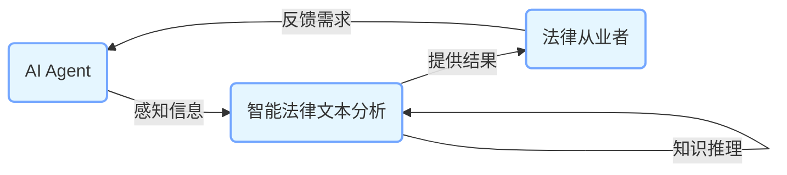

# AI Agent在智能法律文本分析中的角色

> 关键词：AI Agent、智能法律文本分析、自然语言处理、机器学习、法律推理、知识图谱

> 摘要：本文深入探讨了AI Agent在智能法律文本分析中的角色。随着人工智能技术的发展，AI Agent在法律领域的应用日益广泛。文章首先介绍了相关背景，包括目的、预期读者等内容。接着阐述了AI Agent和智能法律文本分析的核心概念及其联系，通过示意图和流程图进行直观展示。详细讲解了核心算法原理和具体操作步骤，结合Python代码进行说明。分析了其中涉及的数学模型和公式，并举例说明。通过项目实战给出代码案例及详细解释。探讨了AI Agent在智能法律文本分析中的实际应用场景，推荐了相关的工具和资源。最后总结了未来发展趋势与挑战，提供常见问题解答和扩展阅读参考资料，旨在为法律行业和人工智能领域的研究者与从业者提供全面且深入的技术参考。

## 1. 背景介绍 
### 1.1 目的和范围
本文章的目的在于全面且深入地剖析AI Agent在智能法律文本分析中所扮演的角色。随着法律行业数字化转型的加速，处理海量的法律文本成为了一项极具挑战性的任务。AI Agent作为人工智能技术的重要应用形式，能够为法律文本分析带来高效、准确的解决方案。本文的范围涵盖了AI Agent的核心概念、相关算法原理、实际应用场景、开发工具与资源推荐等方面，旨在为法律从业者、人工智能研究者以及相关领域的技术人员提供一个系统性的知识框架。

### 1.2 预期读者
本文的预期读者主要包括以下几类人群：
- **法律从业者**：如律师、法官、法律研究员等，他们希望借助AI Agent提高法律文本分析的效率和准确性，更好地处理案件和进行法律研究。
- **人工智能研究者**：对将人工智能技术应用于法律领域感兴趣的研究人员，他们可以从本文中了解AI Agent在法律文本分析中的具体应用和技术挑战。
- **技术开发者**：包括软件开发工程师、数据科学家等，他们可能需要开发相关的法律文本分析系统，本文将为他们提供技术实现的思路和方法。
- **法律科技企业从业者**：从事法律科技产品研发和推广的人员，有助于他们了解行业动态和技术趋势，开发更具竞争力的产品。

### 1.3 文档结构概述
本文将按照以下结构进行组织：
- 核心概念与联系：介绍AI Agent和智能法律文本分析的基本概念，以及它们之间的联系，并通过示意图和流程图进行直观展示。
- 核心算法原理 & 具体操作步骤：详细讲解AI Agent在法律文本分析中所使用的核心算法原理，并给出具体的操作步骤，同时结合Python代码进行说明。
- 数学模型和公式 & 详细讲解 & 举例说明：分析AI Agent在法律文本分析中涉及的数学模型和公式，并通过具体的例子进行详细讲解。
- 项目实战：代码实际案例和详细解释说明：通过一个实际的项目案例，展示如何使用AI Agent进行智能法律文本分析，并对代码进行详细的解读和分析。
- 实际应用场景：探讨AI Agent在智能法律文本分析中的实际应用场景，如法律条文检索、合同审查、案例分析等。
- 工具和资源推荐：推荐一些学习AI Agent和智能法律文本分析的相关工具和资源，包括书籍、在线课程、开发工具、框架和库等。
- 总结：未来发展趋势与挑战：总结AI Agent在智能法律文本分析中的发展趋势和面临的挑战。
- 附录：常见问题与解答：提供一些常见问题的解答，帮助读者更好地理解文章内容。
- 扩展阅读 & 参考资料：提供一些扩展阅读的建议和参考资料，方便读者进一步深入学习。

### 1.4 术语表
#### 1.4.1 核心术语定义
- **AI Agent**：即人工智能代理，是一种能够感知环境、自主决策并采取行动以实现特定目标的软件实体。在法律文本分析中，AI Agent可以理解法律文本、进行推理和决策，辅助法律从业者完成各种任务。
- **智能法律文本分析**：指利用人工智能技术对法律文本进行处理、理解和分析的过程，包括文本分类、信息提取、语义理解、法律推理等任务。
- **自然语言处理（NLP）**：是人工智能的一个重要分支，主要研究如何让计算机理解和处理人类语言。在法律文本分析中，NLP技术用于对法律文本进行分词、词性标注、命名实体识别、句法分析等处理。
- **机器学习（ML）**：是一门多领域交叉学科，涉及概率论、统计学、逼近论、凸分析、算法复杂度理论等多门学科。它专门研究计算机怎样模拟或实现人类的学习行为，以获取新的知识或技能，重新组织已有的知识结构使之不断改善自身的性能。在法律文本分析中，机器学习算法用于训练模型，实现文本分类、信息提取等任务。
- **知识图谱**：是一种语义网络，用于表示实体之间的关系。在法律领域，知识图谱可以整合法律条文、案例、法律概念等信息，为AI Agent提供知识支持，辅助其进行法律推理和决策。

#### 1.4.2 相关概念解释
- **法律推理**：是指在法律适用过程中，根据已知的法律规定和案件事实，运用逻辑推理的方法得出法律结论的过程。AI Agent可以通过学习法律知识和案例，模拟人类的法律推理过程，为法律从业者提供决策支持。
- **文本分类**：是指将文本按照一定的规则划分到不同的类别中。在法律文本分析中，文本分类可以用于将法律条文、案例等文本分类到不同的法律领域或主题中，方便法律从业者进行检索和查询。
- **信息提取**：是指从文本中提取出特定的信息，如实体、关系、事件等。在法律文本分析中，信息提取可以用于提取法律条文中的权利义务、案例中的当事人信息、案件事实等。

#### 1.4.3 缩略词列表
- **AI**：Artificial Intelligence，人工智能
- **NLP**：Natural Language Processing，自然语言处理
- **ML**：Machine Learning，机器学习
- **API**：Application Programming Interface，应用程序编程接口
- **RNN**：Recurrent Neural Network，循环神经网络
- **LSTM**：Long Short-Term Memory，长短期记忆网络
- **BERT**：Bidirectional Encoder Representations from Transformers，基于变换器的双向编码器表示

## 2. 核心概念与联系 

### 2.1 AI Agent的概念
AI Agent是一种能够感知环境、自主决策并采取行动以实现特定目标的软件实体。它可以根据预设的规则和目标，对输入的信息进行处理和分析，然后做出相应的决策和行动。AI Agent通常由以下几个部分组成：
- **感知模块**：用于感知环境中的信息，如法律文本、案件事实等。
- **决策模块**：根据感知到的信息和预设的规则，进行推理和决策。
- **行动模块**：根据决策结果，采取相应的行动，如输出分析结果、提供建议等。

### 2.2 智能法律文本分析的概念
智能法律文本分析是指利用人工智能技术对法律文本进行处理、理解和分析的过程。法律文本包括法律条文、合同、案例等，智能法律文本分析的任务包括文本分类、信息提取、语义理解、法律推理等。通过智能法律文本分析，可以提高法律文本处理的效率和准确性，为法律从业者提供更好的决策支持。

### 2.3 AI Agent与智能法律文本分析的联系
AI Agent在智能法律文本分析中扮演着核心角色。它可以作为一个智能的助手，帮助法律从业者完成各种法律文本分析任务。具体来说，AI Agent可以通过以下方式与智能法律文本分析相结合：
- **信息获取**：AI Agent可以通过感知模块获取法律文本信息，如从法律数据库中检索法律条文、从案例库中获取案例信息等。
- **文本处理**：AI Agent可以利用自然语言处理技术对获取的法律文本进行处理，如分词、词性标注、命名实体识别、句法分析等，以便更好地理解法律文本的含义。
- **知识推理**：AI Agent可以根据预设的法律知识和规则，对处理后的法律文本进行推理和分析，如判断案件是否符合法律规定、预测案件的判决结果等。
- **决策支持**：AI Agent可以根据推理和分析的结果，为法律从业者提供决策支持，如提供法律建议、推荐相关案例等。

### 2.4 核心概念原理和架构的文本示意图
```plaintext
            +-----------------+
            |    AI Agent     |
            +-----------------+
            | 感知模块        |
            | 决策模块        |
            | 行动模块        |
            +-----------------+
                   |
                   | 信息交互
                   v
            +-----------------+
            | 智能法律文本分析 |
            +-----------------+
            | 文本分类        |
            | 信息提取        |
            | 语义理解        |
            | 法律推理        |
            +-----------------+
                   |
                   | 处理结果
                   v
            +-----------------+
            | 法律从业者      |
            +-----------------+
```

### 2.5 Mermaid流程图


## 3. 核心算法原理 & 具体操作步骤 

### 3.1 核心算法原理
在智能法律文本分析中，AI Agent常用的核心算法包括自然语言处理算法和机器学习算法。以下是一些常见的算法及其原理：

#### 3.1.1 分词算法
分词是自然语言处理中的基础任务，用于将连续的文本分割成一个个独立的词语。常见的分词算法有基于规则的分词算法和基于统计的分词算法。

- **基于规则的分词算法**：根据预先定义的分词规则对文本进行分词。例如，正向最大匹配算法从文本的左侧开始，尽可能匹配最长的词语。
- **基于统计的分词算法**：利用大量的文本数据进行统计学习，计算词语出现的概率，从而确定最优的分词结果。例如，隐马尔可夫模型（HMM）和条件随机场（CRF）。

#### 3.1.2 命名实体识别算法
命名实体识别（NER）是指从文本中识别出具有特定意义的实体，如人名、地名、组织机构名等。在法律文本分析中，NER可以用于识别法律条文中的当事人、法律机构等实体。常见的NER算法有基于机器学习的算法和基于深度学习的算法。

- **基于机器学习的算法**：如支持向量机（SVM）、决策树等，通过对文本特征进行训练，实现实体识别。
- **基于深度学习的算法**：如循环神经网络（RNN）、长短期记忆网络（LSTM）、双向编码器表示从变换器（BERT）等，通过对文本的上下文信息进行学习，实现更准确的实体识别。

#### 3.1.3 文本分类算法
文本分类是指将文本按照一定的规则划分到不同的类别中。在法律文本分析中，文本分类可以用于将法律条文、案例等文本分类到不同的法律领域或主题中。常见的文本分类算法有基于机器学习的算法和基于深度学习的算法。

- **基于机器学习的算法**：如朴素贝叶斯分类器、逻辑回归等，通过对文本特征进行训练，实现文本分类。
- **基于深度学习的算法**：如卷积神经网络（CNN）、循环神经网络（RNN）等，通过对文本的语义信息进行学习，实现更准确的文本分类。

### 3.2 具体操作步骤
以下是使用Python实现基于朴素贝叶斯分类器的法律文本分类的具体操作步骤：

#### 3.2.1 数据准备
首先，需要准备法律文本数据集，并将其划分为训练集和测试集。假设我们有一个包含法律条文的数据集，每个条文都有一个对应的法律领域标签。

```python
import pandas as pd
from sklearn.model_selection import train_test_split

# 读取数据集
data = pd.read_csv('law_text_data.csv')

# 划分特征和标签
X = data['text']
y = data['label']

# 划分训练集和测试集
X_train, X_test, y_train, y_test = train_test_split(X, y, test_size=0.2, random_state=42)
```

#### 3.2.2 特征提取
接下来，需要对文本数据进行特征提取，将文本转换为计算机可以处理的数值特征。常用的特征提取方法有词袋模型（Bag of Words）和词频 - 逆文档频率（TF-IDF）。

```python
from sklearn.feature_extraction.text import TfidfVectorizer

# 初始化TF-IDF向量器
vectorizer = TfidfVectorizer()

# 对训练集和测试集进行特征提取
X_train_vectorized = vectorizer.fit_transform(X_train)
X_test_vectorized = vectorizer.transform(X_test)
```

#### 3.2.3 模型训练
然后，使用朴素贝叶斯分类器对训练集进行训练。

```python
from sklearn.naive_bayes import MultinomialNB

# 初始化朴素贝叶斯分类器
clf = MultinomialNB()

# 训练模型
clf.fit(X_train_vectorized, y_train)
```

#### 3.2.4 模型评估
最后，使用测试集对训练好的模型进行评估。

```python
from sklearn.metrics import accuracy_score

# 预测测试集
y_pred = clf.predict(X_test_vectorized)

# 计算准确率
accuracy = accuracy_score(y_test, y_pred)
print(f"模型准确率: {accuracy}")
```

## 4. 数学模型和公式 & 详细讲解 & 举例说明 

### 4.1 朴素贝叶斯分类器的数学模型和公式
朴素贝叶斯分类器是一种基于贝叶斯定理的简单概率分类器，假设特征之间相互独立。其数学模型和公式如下：

#### 4.1.1 贝叶斯定理
贝叶斯定理是概率论中的一个重要定理，用于计算在已知某些条件下事件发生的概率。其公式为：

$$P(A|B) = \frac{P(B|A)P(A)}{P(B)}$$

其中，$P(A|B)$ 表示在事件 $B$ 发生的条件下事件 $A$ 发生的概率，$P(B|A)$ 表示在事件 $A$ 发生的条件下事件 $B$ 发生的概率，$P(A)$ 表示事件 $A$ 发生的先验概率，$P(B)$ 表示事件 $B$ 发生的先验概率。

#### 4.1.2 朴素贝叶斯分类器的公式
在文本分类中，假设文本 $x$ 由 $n$ 个特征 $x_1, x_2, \cdots, x_n$ 组成，类别集合为 $C = \{c_1, c_2, \cdots, c_m\}$。朴素贝叶斯分类器的目标是找到一个类别 $c_j$，使得 $P(c_j|x)$ 最大。根据贝叶斯定理，有：

$$P(c_j|x) = \frac{P(x|c_j)P(c_j)}{P(x)}$$

由于对于所有的类别 $c_j$，$P(x)$ 是相同的，因此可以忽略分母，只需要比较分子 $P(x|c_j)P(c_j)$ 的大小。又因为朴素贝叶斯分类器假设特征之间相互独立，所以有：

$$P(x|c_j) = \prod_{i=1}^{n}P(x_i|c_j)$$

因此，朴素贝叶斯分类器的分类规则为：

$$\hat{c} = \arg\max_{c_j \in C} P(c_j) \prod_{i=1}^{n}P(x_i|c_j)$$

### 4.2 详细讲解
在上述公式中，$P(c_j)$ 表示类别 $c_j$ 的先验概率，可以通过训练集中属于类别 $c_j$ 的样本数除以总样本数得到。$P(x_i|c_j)$ 表示在类别 $c_j$ 下特征 $x_i$ 出现的条件概率，可以通过训练集中属于类别 $c_j$ 且包含特征 $x_i$ 的样本数除以属于类别 $c_j$ 的样本数得到。

### 4.3 举例说明
假设我们有一个简单的法律文本分类数据集，包含以下两个类别：“合同法”和“侵权法”，以及以下两个文本：

- 文本 1：“甲与乙签订了一份买卖合同”（属于“合同法”类别）
- 文本 2：“丙因丁的侵权行为受到了损害”（属于“侵权法”类别）

我们可以使用朴素贝叶斯分类器对这两个文本进行分类。首先，对文本进行分词，得到以下特征：

- 文本 1：["甲", "乙", "签订", "买卖合同"]
- 文本 2：["丙", "丁", "侵权行为", "损害"]

假设训练集中“合同法”类别的样本数为 10，“侵权法”类别的样本数为 10，总样本数为 20。则类别“合同法”的先验概率 $P(合同法) = \frac{10}{20} = 0.5$，类别“侵权法”的先验概率 $P(侵权法) = \frac{10}{20} = 0.5$。

对于文本 1 中的特征“甲”，假设在“合同法”类别中出现的次数为 5，在“侵权法”类别中出现的次数为 0。则在“合同法”类别下“甲”出现的条件概率 $P(甲|合同法) = \frac{5}{10} = 0.5$，在“侵权法”类别下“甲”出现的条件概率 $P(甲|侵权法) = \frac{0}{10} = 0$。

同理，可以计算出其他特征在不同类别下的条件概率。然后，根据朴素贝叶斯分类器的分类规则，计算文本 1 属于“合同法”和“侵权法”类别的概率：

$$P(合同法|文本 1) \propto P(合同法) \times P(甲|合同法) \times P(乙|合同法) \times P(签订|合同法) \times P(买卖合同|合同法)$$

$$P(侵权法|文本 1) \propto P(侵权法) \times P(甲|侵权法) \times P(乙|侵权法) \times P(签订|侵权法) \times P(买卖合同|侵权法)$$

比较这两个概率的大小，选择概率较大的类别作为文本 1 的分类结果。

## 5. 项目实战：代码实际案例和详细解释说明 

### 5.1  开发环境搭建
在进行智能法律文本分析项目实战之前，需要搭建相应的开发环境。以下是具体的步骤：

#### 5.1.1 安装Python
Python是一种广泛使用的编程语言，在人工智能和自然语言处理领域有着丰富的库和工具。可以从Python官方网站（https://www.python.org/downloads/）下载并安装Python 3.x版本。

#### 5.1.2 安装必要的库
在项目中，需要使用一些Python库来实现文本处理、机器学习等功能。可以使用以下命令来安装这些库：

```sh
pip install pandas scikit-learn nltk
```

- **pandas**：用于数据处理和分析。
- **scikit-learn**：提供了丰富的机器学习算法和工具。
- **nltk**：自然语言处理工具包，用于文本处理和分析。

### 5.2  源代码详细实现和代码解读
以下是一个使用朴素贝叶斯分类器进行法律文本分类的完整代码示例：

```python
import pandas as pd
from sklearn.model_selection import train_test_split
from sklearn.feature_extraction.text import TfidfVectorizer
from sklearn.naive_bayes import MultinomialNB
from sklearn.metrics import accuracy_score
import nltk
from nltk.corpus import stopwords
from nltk.tokenize import word_tokenize
import string

# 下载必要的nltk数据
nltk.download('punkt')
nltk.download('stopwords')

# 读取数据集
data = pd.read_csv('law_text_data.csv')

# 数据预处理
def preprocess_text(text):
    # 转换为小写
    text = text.lower()
    # 去除标点符号
    text = text.translate(str.maketrans('', '', string.punctuation))
    # 分词
    tokens = word_tokenize(text)
    # 去除停用词
    stop_words = set(stopwords.words('english'))
    tokens = [token for token in tokens if token not in stop_words]
    # 拼接成字符串
    preprocessed_text = ' '.join(tokens)
    return preprocessed_text

data['text'] = data['text'].apply(preprocess_text)

# 划分特征和标签
X = data['text']
y = data['label']

# 划分训练集和测试集
X_train, X_test, y_train, y_test = train_test_split(X, y, test_size=0.2, random_state=42)

# 特征提取
vectorizer = TfidfVectorizer()
X_train_vectorized = vectorizer.fit_transform(X_train)
X_test_vectorized = vectorizer.transform(X_test)

# 模型训练
clf = MultinomialNB()
clf.fit(X_train_vectorized, y_train)

# 模型评估
y_pred = clf.predict(X_test_vectorized)
accuracy = accuracy_score(y_test, y_pred)
print(f"模型准确率: {accuracy}")
```

### 5.3  代码解读与分析
#### 5.3.1 数据预处理
在代码中，定义了一个 `preprocess_text` 函数，用于对文本数据进行预处理。具体步骤包括：
- 将文本转换为小写，以消除大小写的影响。
- 去除标点符号，减少噪声。
- 使用 `nltk` 库进行分词，将文本分割成一个个独立的词语。
- 去除停用词，停用词是指在文本中频繁出现但没有实际意义的词语，如“the”、“and”等。

#### 5.3.2 特征提取
使用 `TfidfVectorizer` 对文本数据进行特征提取，将文本转换为TF-IDF向量。TF-IDF是一种常用的文本特征表示方法，它可以衡量一个词语在文本中的重要性。

#### 5.3.3 模型训练和评估
使用 `MultinomialNB` 作为分类器，对训练集进行训练。然后使用测试集对训练好的模型进行评估，计算模型的准确率。

## 6. 实际应用场景 
AI Agent在智能法律文本分析中有广泛的实际应用场景，以下是一些常见的应用场景：

### 6.1 法律条文检索
法律条文数量庞大，查找相关的法律条文是法律从业者日常工作中的一项重要任务。AI Agent可以通过对法律条文进行语义理解和索引，实现快速、准确的法律条文检索。例如，用户可以输入一个问题或关键词，AI Agent可以自动检索相关的法律条文，并将结果展示给用户。

### 6.2 合同审查
合同审查是律师的一项重要工作，需要仔细审查合同条款，确保合同的合法性和有效性。AI Agent可以通过对合同文本进行分析，识别合同中的关键条款和风险点，并提供相应的建议和提示。例如，AI Agent可以检查合同中的违约责任条款、争议解决条款等，判断是否存在不合理的地方。

### 6.3 案例分析
案例分析是法律研究和实践中的重要方法，通过分析类似案例可以为当前案件提供参考和借鉴。AI Agent可以通过对案例文本进行分析，提取案例的关键信息，如案件事实、法律适用、判决结果等，并进行案例相似度比较，为法律从业者提供相关的案例参考。

### 6.4 法律文书生成
法律文书的生成需要遵循一定的格式和规范，AI Agent可以通过学习大量的法律文书样本，自动生成符合要求的法律文书。例如，AI Agent可以根据用户提供的案件信息，生成起诉状、答辩状等法律文书。

### 6.5 法律风险评估
企业在经营过程中面临着各种法律风险，如合同风险、知识产权风险等。AI Agent可以通过对企业的法律文本进行分析，评估企业面临的法律风险，并提供相应的风险预警和应对建议。例如，AI Agent可以分析企业的合同文本，识别潜在的合同风险，并提醒企业采取相应的措施。

## 7. 工具和资源推荐
### 7.1 学习资源推荐
#### 7.1.1 书籍推荐
- 《自然语言处理入门》：作者何晗，本书系统地介绍了自然语言处理的基本概念、算法和技术，适合初学者入门。
- 《机器学习》：作者周志华，本书是机器学习领域的经典教材，全面介绍了机器学习的基本概念、算法和应用。
- 《法律人工智能：文本分类、信息提取和知识图谱构建》：本书结合法律领域的实际需求，介绍了如何使用人工智能技术进行法律文本分析和知识图谱构建。

#### 7.1.2 在线课程
- Coursera上的“Natural Language Processing Specialization”：由斯坦福大学的教授授课，系统地介绍了自然语言处理的理论和实践。
- edX上的“Artificial Intelligence”：由麻省理工学院的教授授课，涵盖了人工智能的各个方面，包括机器学习、自然语言处理等。
- 中国大学MOOC上的“法律人工智能”：由国内高校的教授授课，介绍了法律人工智能的基本概念、技术和应用。

#### 7.1.3 技术博客和网站
- Medium上的Towards Data Science：是一个专注于数据科学和人工智能的技术博客，上面有很多关于自然语言处理和机器学习的文章。
- arXiv.org：是一个预印本服务器，上面有很多最新的人工智能研究论文。
- 法律人工智能研究网：是一个专注于法律人工智能研究的网站，上面有很多关于法律人工智能的研究成果和应用案例。

### 7.2 开发工具框架推荐
#### 7.2.1 IDE和编辑器
- PyCharm：是一款专门为Python开发设计的集成开发环境，具有代码编辑、调试、版本控制等功能。
- Visual Studio Code：是一款轻量级的代码编辑器，支持多种编程语言，具有丰富的插件和扩展功能。
- Jupyter Notebook：是一个交互式的笔记本环境，适合进行数据探索和模型开发。

#### 7.2.2 调试和性能分析工具
- PDB：是Python自带的调试器，可以帮助开发者调试代码。
- cProfile：是Python的性能分析工具，可以分析代码的运行时间和资源消耗情况。
- TensorBoard：是TensorFlow的可视化工具，可以帮助开发者可视化模型的训练过程和性能指标。

#### 7.2.3 相关框架和库
- NLTK：是一个自然语言处理工具包，提供了丰富的文本处理和分析功能。
- SpaCy：是一个快速、高效的自然语言处理库，支持多种语言和任务。
- Scikit-learn：是一个机器学习库，提供了丰富的机器学习算法和工具。
- TensorFlow和PyTorch：是两个流行的深度学习框架，用于构建和训练深度学习模型。

### 7.3 相关论文著作推荐
#### 7.3.1 经典论文
- "A Mathematical Theory of Communication" by Claude E. Shannon：信息论的经典论文，为自然语言处理提供了理论基础。
- "The Nature of Statistical Language Learning" by Frederick Jelinek：介绍了统计语言模型的基本概念和方法。
- "Attention Is All You Need" by Ashish Vaswani et al.：提出了Transformer模型，是自然语言处理领域的重要突破。

#### 7.3.2 最新研究成果
- 可以关注ACL（Association for Computational Linguistics）、EMNLP（Conference on Empirical Methods in Natural Language Processing）等自然语言处理领域的顶级会议，了解最新的研究成果。
- 也可以关注法律人工智能领域的相关研究机构和学者的研究成果，如北京大学法律人工智能实验室、上海交通大学凯原法学院的研究团队等。

#### 7.3.3 应用案例分析
- 可以参考一些法律科技公司的应用案例，如Lex Machina、ROSS Intelligence等，了解AI Agent在法律领域的实际应用情况。
- 也可以关注一些法律期刊和杂志上的案例分析文章，了解AI Agent在实际法律案件中的应用效果。

## 8. 总结：未来发展趋势与挑战
### 8.1 未来发展趋势
#### 8.1.1 多模态融合
未来，AI Agent在智能法律文本分析中将不仅仅局限于文本数据，还会融合图像、音频、视频等多模态数据。例如，在案件分析中，可以结合监控视频、证人证言的音频记录等多模态信息，提供更全面、准确的分析结果。

#### 8.1.2 知识图谱的深度应用
知识图谱将在法律领域得到更深入的应用，AI Agent可以利用知识图谱进行更复杂的法律推理和决策。例如，通过构建法律知识图谱，AI Agent可以自动发现法律条文之间的关联、案例之间的相似性等，为法律从业者提供更智能的决策支持。

#### 8.1.3 与区块链技术的结合
区块链技术的去中心化、不可篡改等特点与法律领域的需求高度契合。未来，AI Agent可以与区块链技术相结合，实现法律文本的安全存储、可信验证和智能合约的自动执行。例如，将法律合同存储在区块链上，利用AI Agent对合同条款进行自动监测和执行，确保合同的履行。

#### 8.1.4 个性化服务
随着用户需求的不断个性化，AI Agent将为不同的法律从业者提供个性化的服务。例如，根据律师的专业领域、工作习惯等，为其定制专属的法律文本分析工具和推荐系统，提高工作效率和满意度。

### 8.2 挑战
#### 8.2.1 法律知识的复杂性
法律知识体系庞大、复杂，不同国家和地区的法律制度存在差异，法律条文的解释也具有一定的主观性。如何让AI Agent准确理解和处理这些复杂的法律知识，是一个巨大的挑战。

#### 8.2.2 数据质量和隐私问题
智能法律文本分析需要大量的高质量数据进行训练，但法律数据往往涉及个人隐私和商业机密，数据的收集、标注和使用需要遵守严格的法律法规。如何在保护数据隐私的前提下，获取足够的高质量数据，是一个亟待解决的问题。

#### 8.2.3 伦理和法律问题
AI Agent在法律领域的应用可能会引发一系列伦理和法律问题，如算法偏见、责任认定等。例如，如果AI Agent的分析结果导致了错误的法律决策，责任应该由谁来承担？如何确保AI Agent的算法公平、公正，避免对某些群体造成歧视？这些问题需要法律界和科技界共同探讨和解决。

#### 8.2.4 技术的可解释性
深度学习等人工智能技术在法律文本分析中取得了很好的效果，但这些技术往往是黑盒模型，难以解释其决策过程和结果。在法律领域，可解释性是非常重要的，因为法律决策需要有合理的依据和解释。如何提高AI Agent技术的可解释性，是一个需要解决的技术难题。

## 9. 附录：常见问题与解答
### 9.1 AI Agent能完全替代法律从业者吗？
不能。虽然AI Agent在智能法律文本分析中可以提供高效、准确的辅助，但法律工作不仅仅是文本分析，还涉及到价值判断、人情世故、谈判技巧等方面。法律从业者的经验、智慧和判断力是AI Agent无法替代的。AI Agent只能作为法律从业者的工具，帮助他们提高工作效率和质量。

### 9.2 AI Agent在法律文本分析中的准确率如何保证？
可以从以下几个方面保证AI Agent在法律文本分析中的准确率：
- **高质量的数据**：使用大量的高质量法律文本数据进行训练，确保数据的准确性和完整性。
- **合适的算法**：选择合适的自然语言处理和机器学习算法，根据具体的任务进行优化和调整。
- **模型评估和优化**：使用测试集对模型进行评估，不断优化模型的参数和结构，提高模型的准确率。
- **人工审核和修正**：对于AI Agent的分析结果，进行人工审核和修正，确保结果的准确性和可靠性。

### 9.3 AI Agent在处理不同国家和地区的法律文本时会遇到哪些问题？
AI Agent在处理不同国家和地区的法律文本时会遇到以下问题：
- **法律制度差异**：不同国家和地区的法律制度存在差异，法律条文的内容、结构和解释都可能不同，AI Agent需要适应这些差异。
- **语言差异**：不同国家和地区使用不同的语言，AI Agent需要具备多语言处理能力，并且要考虑语言的文化背景和语义差异。
- **数据缺乏**：某些国家和地区的法律数据可能比较缺乏，难以获取足够的训练数据，影响AI Agent的性能。

### 9.4 如何保护法律数据的隐私和安全？
可以采取以下措施保护法律数据的隐私和安全：
- **数据加密**：对法律数据进行加密处理，确保数据在传输和存储过程中的安全性。
- **访问控制**：设置严格的访问权限，只有授权人员才能访问和处理法律数据。
- **匿名化处理**：在使用法律数据进行训练时，对数据进行匿名化处理，去除敏感信息，保护个人隐私。
- **合规性管理**：遵守相关的法律法规和行业标准，确保数据的收集、使用和存储符合规定。

## 10. 扩展阅读 & 参考资料
### 10.1 扩展阅读
- 《法律的逻辑：由个案探索法理》：这本书通过具体的案例分析，探讨了法律推理的逻辑和方法，有助于深入理解法律文本分析中的推理过程。
- 《人工智能时代的法律变革》：本书从宏观的角度探讨了人工智能对法律领域的影响和挑战，以及法律制度的变革方向。
- 《自然语言处理综论》：是自然语言处理领域的权威著作，对自然语言处理的各个方面进行了全面、深入的介绍。

### 10.2 参考资料
- [NLTK官方文档](https://www.nltk.org/)
- [Scikit-learn官方文档](https://scikit-learn.org/stable/)
- [TensorFlow官方文档](https://www.tensorflow.org/)
- [PyTorch官方文档](https://pytorch.org/)

作者：AI天才研究院/AI Genius Institute & 禅与计算机程序设计艺术 /Zen And The Art of Computer Programming