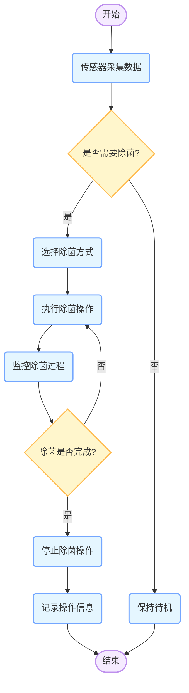

# AI Agent在智能浴室毛巾架中的除菌功能

> 关键词：AI Agent、智能浴室毛巾架、除菌功能、传感器技术、自动化控制

> 摘要：本文聚焦于AI Agent在智能浴室毛巾架除菌功能中的应用。详细介绍了相关背景知识，包括目的、预期读者等内容。深入剖析了AI Agent、智能浴室毛巾架以及除菌功能的核心概念和相互联系，阐述了核心算法原理与操作步骤，给出了相应的数学模型和公式。通过项目实战展示了代码实现和解读，探讨了实际应用场景。同时推荐了学习、开发所需的工具和资源，最后总结了未来发展趋势与挑战，并对常见问题进行解答，提供了扩展阅读和参考资料，旨在为该领域的研究和应用提供全面的技术指导。

## 1. 背景介绍 
### 1.1 目的和范围
本文章旨在深入探讨AI Agent在智能浴室毛巾架除菌功能中的应用。随着智能家居的发展，智能浴室毛巾架的功能不断丰富，除菌功能成为其重要的特性之一。引入AI Agent可以使除菌功能更加智能化、自动化，提高用户体验和使用效果。文章的范围涵盖了AI Agent的基本原理、与智能浴室毛巾架的结合方式、除菌功能的实现机制、相关算法和数学模型，以及实际应用案例和未来发展趋势等方面。

### 1.2 预期读者
本文的预期读者包括智能家居领域的开发者、研究人员，对AI技术在传统家居产品中应用感兴趣的技术爱好者，以及从事智能浴室产品设计和生产的企业工程师等。这些读者具备一定的计算机科学、电子工程或相关领域的基础知识，希望深入了解AI Agent在智能浴室毛巾架除菌功能中的具体应用和技术细节。

### 1.3 文档结构概述
本文将按照以下结构进行组织：首先介绍相关的背景知识，包括目的、预期读者和文档结构概述；接着阐述核心概念与联系，通过文本示意图和Mermaid流程图展示AI Agent、智能浴室毛巾架和除菌功能之间的关系；然后详细讲解核心算法原理和具体操作步骤，并给出Python源代码；随后介绍数学模型和公式，并进行举例说明；通过项目实战展示代码实际案例和详细解释；探讨实际应用场景；推荐学习、开发所需的工具和资源；最后总结未来发展趋势与挑战，解答常见问题，并提供扩展阅读和参考资料。

### 1.4 术语表
#### 1.4.1 核心术语定义
- **AI Agent（人工智能代理）**：是一种能够感知环境、根据感知信息做出决策并执行相应动作的智能实体。在智能浴室毛巾架中，AI Agent可以根据传感器收集的信息，如湿度、温度、细菌浓度等，自动调整毛巾架的除菌策略。
- **智能浴室毛巾架**：具备智能化功能的浴室毛巾架，能够通过传感器、网络通信等技术实现自动化控制和远程操作，除了基本的挂放毛巾功能外，还具有加热、烘干、除菌等多种功能。
- **除菌功能**：通过物理或化学方法减少或消除毛巾表面的细菌、真菌等微生物，保障毛巾的卫生和安全。常见的除菌方法包括紫外线照射、臭氧消毒、高温烘干等。

#### 1.4.2 相关概念解释
- **传感器技术**：用于感知环境信息的技术，在智能浴室毛巾架中，传感器可以检测湿度、温度、光照强度、细菌浓度等参数，为AI Agent提供决策依据。
- **自动化控制**：根据预设的规则或算法，自动控制设备的运行状态。在智能浴室毛巾架中，AI Agent可以根据传感器数据自动调整加热、烘干、除菌等功能的开启和关闭。
- **物联网（IoT）**：通过互联网将各种设备连接起来，实现设备之间的信息交互和远程控制。智能浴室毛巾架可以通过物联网技术与手机、智能家居系统等进行连接，实现远程操作和监控。

#### 1.4.3 缩略词列表
- **AI**：Artificial Intelligence，人工智能
- **IoT**：Internet of Things，物联网
- **UV**：Ultraviolet，紫外线

## 2. 核心概念与联系 

### 核心概念原理
#### AI Agent原理
AI Agent是一种基于感知 - 决策 - 行动循环的智能系统。它通过传感器感知环境信息，将这些信息输入到决策模块中，决策模块根据预设的规则或学习到的模型做出决策，然后通过执行器执行相应的动作。在智能浴室毛巾架中，AI Agent可以通过湿度传感器、温度传感器、细菌浓度传感器等感知毛巾架周围的环境信息，根据这些信息决定是否开启除菌功能、选择合适的除菌方式以及控制除菌的时间和强度。

#### 智能浴室毛巾架原理
智能浴室毛巾架通常由主体结构、加热模块、烘干模块、除菌模块、传感器模块和控制模块组成。主体结构用于挂放毛巾，加热模块可以提高毛巾架的温度，加速毛巾的烘干过程；烘干模块通过通风等方式促进空气流通，加快水分蒸发；除菌模块采用紫外线照射、臭氧消毒等方法对毛巾进行除菌处理；传感器模块用于收集环境信息，控制模块根据传感器数据和用户设置控制各个模块的运行。

#### 除菌功能原理
常见的除菌方法有以下几种：
- **紫外线照射**：紫外线具有杀菌作用，它可以破坏细菌和病毒的DNA和RNA结构，使其失去繁殖和生存能力。在智能浴室毛巾架中，可以安装紫外线灯，通过定时照射的方式对毛巾进行除菌处理。
- **臭氧消毒**：臭氧是一种强氧化剂，具有很强的杀菌、消毒和除臭作用。臭氧可以与细菌、病毒等微生物发生化学反应，破坏其细胞膜和蛋白质结构，从而达到除菌的目的。在智能浴室毛巾架中，可以安装臭氧发生器，产生适量的臭氧对毛巾进行消毒。
- **高温烘干**：高温可以使细菌和病毒的蛋白质变性，从而失去活性。通过加热毛巾架，使毛巾处于较高的温度环境下一段时间，可以有效杀灭毛巾表面的细菌。

### 架构的文本示意图
```plaintext
智能浴室毛巾架系统
├── AI Agent
│   ├── 感知模块（传感器数据输入）
│   │   ├── 湿度传感器
│   │   ├── 温度传感器
│   │   ├── 细菌浓度传感器
│   │   └── 其他传感器
│   ├── 决策模块（规则或模型）
│   └── 执行模块（控制指令输出）
│       ├── 加热模块控制
│       ├── 烘干模块控制
│       ├── 除菌模块控制
│       └── 其他模块控制
├── 硬件设备
│   ├── 毛巾架主体
│   ├── 加热元件
│   ├── 烘干风扇
│   ├── 紫外线灯
│   ├── 臭氧发生器
│   └── 传感器阵列
└── 用户交互界面
    ├── 手机APP
    ├── 控制面板
    └── 语音控制
```

### Mermaid流程图


## 3. 核心算法原理 & 具体操作步骤 

### 核心算法原理
在智能浴室毛巾架的除菌功能中，核心算法的主要目标是根据传感器采集的数据，判断是否需要进行除菌操作，并选择合适的除菌方式和控制除菌的时间和强度。这里我们介绍一种基于规则的决策算法，其基本原理如下：

1. **数据采集**：通过湿度传感器、温度传感器、细菌浓度传感器等采集毛巾架周围的环境信息。
2. **规则判断**：根据预设的规则，判断是否需要进行除菌操作。例如，如果湿度超过一定阈值、温度低于一定范围或者细菌浓度超过安全标准，则认为需要进行除菌操作。
3. **除菌方式选择**：根据环境信息和用户设置，选择合适的除菌方式。例如，如果湿度较高，可以优先选择高温烘干和通风除菌；如果细菌浓度较高，可以选择紫外线照射或臭氧消毒。
4. **控制参数计算**：根据除菌方式和环境信息，计算除菌的时间和强度。例如，在高温烘干除菌时，根据毛巾的湿度和数量，计算需要加热的时间和温度。
5. **执行控制**：根据计算得到的控制参数，控制加热模块、烘干模块、除菌模块等的运行。

### Python源代码详细阐述
```python
# 模拟传感器数据采集
def collect_sensor_data():
    # 这里简单模拟传感器数据，实际应用中需要从传感器读取数据
    humidity = 70  # 湿度，单位：%
    temperature = 20  # 温度，单位：℃
    bacteria_concentration = 100  # 细菌浓度，单位：CFU/cm²
    return humidity, temperature, bacteria_concentration

# 规则判断是否需要除菌
def need_sterilization(humidity, temperature, bacteria_concentration):
    humidity_threshold = 60
    temperature_threshold = 25
    bacteria_threshold = 80
    if humidity > humidity_threshold or temperature < temperature_threshold or bacteria_concentration > bacteria_threshold:
        return True
    return False

# 选择除菌方式
def select_sterilization_method(humidity, temperature, bacteria_concentration):
    if humidity > 70:
        return "高温烘干和通风除菌"
    elif bacteria_concentration > 100:
        return "紫外线照射或臭氧消毒"
    else:
        return "紫外线照射"

# 计算除菌时间和强度（简化示例）
def calculate_sterilization_parameters(method):
    if method == "高温烘干和通风除菌":
        time = 60  # 时间，单位：分钟
        temperature = 50  # 温度，单位：℃
        return time, temperature
    elif method == "紫外线照射或臭氧消毒":
        time = 30  # 时间，单位：分钟
        return time
    else:
        time = 20  # 时间，单位：分钟
        return time

# 执行除菌操作
def perform_sterilization(method, parameters):
    if method == "高温烘干和通风除菌":
        time, temperature = parameters
        print(f"开启高温烘干和通风除菌，时间：{time}分钟，温度：{temperature}℃")
    elif method == "紫外线照射或臭氧消毒":
        time = parameters
        print(f"开启紫外线照射或臭氧消毒，时间：{time}分钟")
    else:
        time = parameters
        print(f"开启紫外线照射，时间：{time}分钟")

# 主程序
def main():
    humidity, temperature, bacteria_concentration = collect_sensor_data()
    if need_sterilization(humidity, temperature, bacteria_concentration):
        method = select_sterilization_method(humidity, temperature, bacteria_concentration)
        parameters = calculate_sterilization_parameters(method)
        perform_sterilization(method, parameters)
    else:
        print("无需进行除菌操作")

if __name__ == "__main__":
    main()
```

### 具体操作步骤
1. **数据采集**：调用 `collect_sensor_data` 函数，模拟从传感器采集湿度、温度和细菌浓度等数据。
2. **规则判断**：调用 `need_sterilization` 函数，根据采集的数据和预设的阈值判断是否需要进行除菌操作。
3. **除菌方式选择**：如果需要除菌，调用 `select_sterilization_method` 函数，根据环境信息选择合适的除菌方式。
4. **控制参数计算**：调用 `calculate_sterilization_parameters` 函数，根据选择的除菌方式计算除菌的时间和强度。
5. **执行控制**：调用 `perform_sterilization` 函数，根据计算得到的控制参数，控制相应的除菌模块运行。

## 4. 数学模型和公式 & 详细讲解 & 举例说明 

### 湿度与除菌时间的关系
在高温烘干除菌过程中，湿度与除菌时间密切相关。一般来说，湿度越高，需要的烘干时间越长，从而除菌时间也会相应增加。我们可以建立一个简单的线性模型来描述湿度与除菌时间的关系：

$$
t = k \times (h - h_0) + t_0
$$

其中，$t$ 表示除菌时间（单位：分钟），$h$ 表示湿度（单位：%），$h_0$ 是一个基准湿度，$t_0$ 是在基准湿度下的除菌时间，$k$ 是一个比例系数。

#### 详细讲解
- **基准湿度 $h_0$**：是一个参考值，表示在该湿度下，毛巾的含水量处于一个相对较低的水平，所需的烘干和除菌时间为 $t_0$。
- **比例系数 $k$**：反映了湿度每增加一个单位，除菌时间增加的幅度。$k$ 的值可以通过实验或经验数据进行确定。

#### 举例说明
假设 $h_0 = 30\%$，$t_0 = 20$ 分钟，$k = 0.5$。当湿度 $h = 70\%$ 时，代入公式可得：

$$
t = 0.5 \times (70 - 30) + 20 = 0.5 \times 40 + 20 = 20 + 20 = 40
$$

即当湿度为 $70\%$ 时，需要的除菌时间为 40 分钟。

### 细菌浓度与除菌强度的关系
在紫外线照射或臭氧消毒除菌过程中，细菌浓度与除菌强度之间存在一定的关系。我们可以用一个指数模型来描述这种关系：

$$
I = I_0 \times e^{\alpha \times (c - c_0)}
$$

其中，$I$ 表示除菌强度，$I_0$ 是基准除菌强度，$c$ 是细菌浓度（单位：CFU/cm²），$c_0$ 是基准细菌浓度，$\alpha$ 是一个衰减系数。

#### 详细讲解
- **基准除菌强度 $I_0$**：是在基准细菌浓度 $c_0$ 下所需的除菌强度。
- **衰减系数 $\alpha$**：反映了细菌浓度每增加一个单位，除菌强度需要增加的幅度。$\alpha$ 的值可以通过实验或经验数据进行确定。

#### 举例说明
假设 $I_0 = 10$，$c_0 = 50$，$\alpha = 0.01$。当细菌浓度 $c = 150$ 时，代入公式可得：

$$
I = 10 \times e^{0.01 \times (150 - 50)} = 10 \times e^{1} \approx 10 \times 2.718 = 27.18
$$

即当细菌浓度为 150 CFU/cm² 时，所需的除菌强度约为 27.18。

## 5. 项目实战：代码实际案例和详细解释说明 

### 5.1  开发环境搭建
#### 硬件环境
- **智能浴室毛巾架**：选择一款支持智能化控制的浴室毛巾架，具备加热、烘干、除菌等功能，并预留传感器接口和控制接口。
- **传感器模块**：包括湿度传感器、温度传感器、细菌浓度传感器等，用于采集毛巾架周围的环境信息。可以选择市面上常见的传感器模块，如 DHT11 湿度温度传感器、细菌浓度传感器模块等。
- **控制板**：选择一款性能稳定、易于开发的控制板，如 Arduino、Raspberry Pi 等。控制板负责接收传感器数据，进行数据处理和决策，并控制毛巾架的各个模块运行。
- **通信模块**：如果需要实现远程控制和监控功能，可以选择 Wi-Fi 模块、蓝牙模块等通信模块，将控制板与手机、智能家居系统等进行连接。

#### 软件环境
- **开发工具**：根据选择的控制板，选择相应的开发工具。例如，如果使用 Arduino 控制板，可以使用 Arduino IDE 进行开发；如果使用 Raspberry Pi 控制板，可以使用 Python 编程语言和 Raspberry Pi OS 进行开发。
- **编程语言**：选择一种适合开发的编程语言，如 Python、C++ 等。Python 具有简洁易读、丰富的库和工具等优点，适合用于快速开发和数据处理；C++ 具有高效、性能稳定等优点，适合用于对性能要求较高的场景。
- **操作系统**：如果使用 Raspberry Pi 控制板，需要安装 Raspberry Pi OS 操作系统。可以从官方网站下载镜像文件，并使用 SD 卡烧录工具将镜像文件烧录到 SD 卡中。

### 5.2  源代码详细实现和代码解读
```python
import time
import board
import adafruit_dht  # 导入湿度温度传感器库

# 初始化湿度温度传感器
dhtDevice = adafruit_dht.DHT11(board.D4)

# 模拟细菌浓度传感器数据采集
def collect_bacteria_concentration():
    # 这里简单模拟细菌浓度数据，实际应用中需要从传感器读取数据
    return 120  # 细菌浓度，单位：CFU/cm²

# 规则判断是否需要除菌
def need_sterilization(humidity, temperature, bacteria_concentration):
    humidity_threshold = 60
    temperature_threshold = 25
    bacteria_threshold = 80
    if humidity > humidity_threshold or temperature < temperature_threshold or bacteria_concentration > bacteria_threshold:
        return True
    return False

# 选择除菌方式
def select_sterilization_method(humidity, temperature, bacteria_concentration):
    if humidity > 70:
        return "高温烘干和通风除菌"
    elif bacteria_concentration > 100:
        return "紫外线照射或臭氧消毒"
    else:
        return "紫外线照射"

# 计算除菌时间和强度（简化示例）
def calculate_sterilization_parameters(method):
    if method == "高温烘干和通风除菌":
        time = 60  # 时间，单位：分钟
        temperature = 50  # 温度，单位：℃
        return time, temperature
    elif method == "紫外线照射或臭氧消毒":
        time = 30  # 时间，单位：分钟
        return time
    else:
        time = 20  # 时间，单位：分钟
        return time

# 执行除菌操作
def perform_sterilization(method, parameters):
    if method == "高温烘干和通风除菌":
        time, temperature = parameters
        print(f"开启高温烘干和通风除菌，时间：{time}分钟，温度：{temperature}℃")
        # 这里可以添加控制加热模块和通风模块的代码
    elif method == "紫外线照射或臭氧消毒":
        time = parameters
        print(f"开启紫外线照射或臭氧消毒，时间：{time}分钟")
        # 这里可以添加控制紫外线灯或臭氧发生器的代码
    else:
        time = parameters
        print(f"开启紫外线照射，时间：{time}分钟")
        # 这里可以添加控制紫外线灯的代码

# 主程序
def main():
    while True:
        try:
            # 采集湿度和温度数据
            humidity = dhtDevice.humidity
            temperature = dhtDevice.temperature
            # 采集细菌浓度数据
            bacteria_concentration = collect_bacteria_concentration()

            if need_sterilization(humidity, temperature, bacteria_concentration):
                method = select_sterilization_method(humidity, temperature, bacteria_concentration)
                parameters = calculate_sterilization_parameters(method)
                perform_sterilization(method, parameters)
            else:
                print("无需进行除菌操作")

        except RuntimeError as error:
            print(f"读取传感器数据时出现错误：{error.args[0]}")
            time.sleep(2.0)
            continue
        except Exception as error:
            dhtDevice.exit()
            raise error

        time.sleep(10.0)  # 每隔10秒采集一次数据

if __name__ == "__main__":
    main()
```

### 代码解读与分析
- **导入库和初始化传感器**：导入 `adafruit_dht` 库，用于读取湿度和温度传感器数据，并初始化传感器。
- **模拟细菌浓度传感器数据采集**：定义 `collect_bacteria_concentration` 函数，模拟从细菌浓度传感器读取数据。
- **规则判断**：定义 `need_sterilization` 函数，根据采集的数据和预设的阈值判断是否需要进行除菌操作。
- **除菌方式选择**：定义 `select_sterilization_method` 函数，根据环境信息选择合适的除菌方式。
- **控制参数计算**：定义 `calculate_sterilization_parameters` 函数，根据选择的除菌方式计算除菌的时间和强度。
- **执行控制**：定义 `perform_sterilization` 函数，根据计算得到的控制参数，控制相应的除菌模块运行。
- **主程序**：在主程序中，使用一个无限循环，每隔 10 秒采集一次传感器数据，并根据数据判断是否需要进行除菌操作。如果需要除菌，选择合适的除菌方式，计算控制参数，并执行除菌操作。

## 6. 实际应用场景 
### 家庭浴室
在家庭浴室中，智能浴室毛巾架的除菌功能可以为用户提供更加卫生、健康的使用体验。由于浴室环境潮湿，毛巾容易滋生细菌和霉菌，使用智能浴室毛巾架可以定期对毛巾进行除菌处理，保持毛巾的清洁和卫生。用户可以通过手机 APP 或语音控制等方式，远程控制毛巾架的除菌功能，方便快捷。

### 酒店浴室
酒店每天需要接待大量的客人，毛巾的使用频率较高，卫生问题尤为重要。智能浴室毛巾架的除菌功能可以有效杀灭毛巾表面的细菌和病毒，保障客人的健康。酒店管理人员可以通过后台管理系统，对所有毛巾架的除菌功能进行集中控制和管理，提高工作效率和管理水平。

### 健身房浴室
健身房的浴室环境通常比较潮湿，而且人员流动性大，毛巾容易受到污染。智能浴室毛巾架的除菌功能可以及时对毛巾进行消毒处理，防止细菌和病毒的传播。同时，健身房可以利用智能浴室毛巾架的数据分析功能，了解毛巾的使用情况和卫生状况，优化管理策略。

### 公共浴室
在公共浴室，如游泳馆、桑拿房等场所，毛巾的卫生问题关系到众多人的健康。智能浴室毛巾架的除菌功能可以为公共浴室提供可靠的卫生保障。通过设置定时除菌功能，可以在无人使用的时间段对毛巾进行全面消毒，确保毛巾在使用时的卫生安全。

## 7. 工具和资源推荐
### 7.1 学习资源推荐
#### 7.1.1 书籍推荐
- 《人工智能：一种现代的方法》：这是一本经典的人工智能教材，全面介绍了人工智能的基本概念、算法和应用，对于理解AI Agent的原理和技术有很大帮助。
- 《智能家居系统设计与应用》：该书详细介绍了智能家居系统的设计原则、技术架构和应用案例，对于学习智能浴室毛巾架的开发和应用具有指导意义。
- 《传感器技术与应用》：深入讲解了各种传感器的原理、特性和应用，有助于了解智能浴室毛巾架中传感器的选型和使用。

#### 7.1.2 在线课程
- Coursera上的“人工智能基础”课程：由知名高校教授授课，系统介绍了人工智能的基本概念、算法和应用，课程内容丰富，讲解详细。
- edX上的“智能家居技术与应用”课程：该课程结合实际案例，介绍了智能家居系统的设计、开发和应用，对于智能浴室毛巾架的开发具有参考价值。
- 中国大学MOOC上的“传感器原理与应用”课程：全面讲解了传感器的原理、分类和应用，帮助学习者掌握传感器技术在智能产品中的应用。

#### 7.1.3 技术博客和网站
- 机器之心：提供人工智能领域的最新技术动态、研究成果和应用案例，是了解AI Agent技术发展的重要渠道。
- 智能家居网：专注于智能家居领域的资讯和技术分享，涵盖了智能浴室毛巾架等各类智能家居产品的相关信息。
- 电子发烧友网：提供电子技术、传感器技术等方面的技术文章和论坛，对于智能浴室毛巾架的硬件开发具有参考价值。

### 7.2 开发工具框架推荐
#### 7.2.1 IDE和编辑器
- Arduino IDE：是一款专门为Arduino开发板设计的集成开发环境，具有简单易用、功能强大等优点，适合初学者进行智能硬件开发。
- PyCharm：是一款专业的Python集成开发环境，提供了代码编辑、调试、代码分析等功能，对于使用Python进行智能浴室毛巾架软件开发非常方便。
- Visual Studio Code：是一款轻量级的代码编辑器，支持多种编程语言和插件扩展，具有丰富的开发工具和功能，适用于各种类型的软件开发。

#### 7.2.2 调试和性能分析工具
- PuTTY：是一款常用的串口调试工具，用于与Arduino、Raspberry Pi等开发板进行串口通信和调试。
- Wireshark：是一款网络协议分析工具，可以用于分析智能浴室毛巾架与其他设备之间的网络通信数据，帮助排查网络故障。
- Py-Spy：是一款Python性能分析工具，可以实时监测Python程序的运行状态和性能指标，帮助优化代码性能。

#### 7.2.3 相关框架和库
- TensorFlow：是一个开源的机器学习框架，提供了丰富的机器学习算法和工具，可用于开发基于机器学习的AI Agent决策模型。
- OpenCV：是一个开源的计算机视觉库，可用于图像识别和处理，在智能浴室毛巾架中可以用于识别毛巾的状态和细菌分布情况。
- MQTT：是一种轻量级的消息传输协议，适用于物联网设备之间的通信。在智能浴室毛巾架中，可以使用MQTT协议实现设备与服务器之间的通信。

### 7.3 相关论文著作推荐
#### 7.3.1 经典论文
- “Artificial Intelligence: A New Synthesis” by Nils J. Nilsson：该论文对人工智能的基本概念和方法进行了系统的阐述，是人工智能领域的经典之作。
- “The Design and Analysis of Heuristic Algorithms” by Richard Korf：介绍了启发式算法的设计和分析方法，对于AI Agent的决策算法设计具有重要的参考价值。
- “Sensor Networks: Evolution, Opportunities, and Challenges” by Deborah Estrin, et al.：该论文对传感器网络的发展、应用和挑战进行了深入分析，对于理解智能浴室毛巾架中传感器技术的应用具有指导意义。

#### 7.3.2 最新研究成果
- 在IEEE Transactions on Intelligent Buildings、ACM Transactions on Sensor Networks等学术期刊上，经常发表关于智能家居和传感器技术的最新研究成果，可以关注这些期刊获取最新的技术动态。
- 参加ACM SIGCOMM、IEEE INFOCOM等学术会议，了解智能物联网和人工智能领域的最新研究进展。

#### 7.3.3 应用案例分析
- 《智能家居应用案例集》：收集了各种智能家居产品的应用案例，包括智能浴室毛巾架的应用案例，通过分析这些案例可以学习到实际项目中的开发经验和解决方案。
- 各大智能家居企业的官方网站和技术博客，会分享他们的产品应用案例和技术经验，可以从中获取有价值的信息。

## 8. 总结：未来发展趋势与挑战
### 未来发展趋势
#### 智能化程度不断提高
随着人工智能技术的不断发展，AI Agent在智能浴室毛巾架中的应用将更加深入。未来的智能浴室毛巾架将具备更强的学习和自适应能力，能够根据用户的使用习惯和环境变化自动调整除菌策略，提供更加个性化的服务。

#### 与其他智能家居设备的集成
智能浴室毛巾架将与其他智能家居设备进行更加紧密的集成，形成一个完整的智能家居生态系统。例如，与智能浴室镜、智能马桶等设备进行联动，实现信息共享和协同工作，为用户提供更加便捷、舒适的使用体验。

#### 健康监测功能的拓展
除了除菌功能，未来的智能浴室毛巾架可能会增加更多的健康监测功能。例如，检测毛巾表面的过敏原、微生物种类等信息，并将这些信息反馈给用户，提醒用户注意个人卫生和健康。

#### 节能环保
随着人们对节能环保意识的提高，智能浴室毛巾架将更加注重能源的有效利用。未来的产品可能会采用更加高效的加热、烘干和除菌技术，降低能源消耗，同时优化产品的设计，提高能源利用效率。

### 挑战
#### 数据安全和隐私保护
智能浴室毛巾架在运行过程中会收集大量的用户数据和环境信息，如用户的使用习惯、毛巾的状态等。如何保障这些数据的安全和隐私，防止数据泄露和滥用，是一个亟待解决的问题。

#### 传感器技术的精度和可靠性
传感器是智能浴室毛巾架实现智能化控制的关键部件，其精度和可靠性直接影响到产品的性能和用户体验。目前，一些传感器的精度和可靠性还存在一定的问题，需要进一步提高传感器技术的水平。

#### 标准化和互操作性
智能家居市场目前缺乏统一的标准和规范，不同品牌和型号的智能设备之间存在互操作性差的问题。智能浴室毛巾架要实现与其他智能家居设备的集成和协同工作，需要解决标准化和互操作性的问题。

#### 成本控制
智能化功能的增加会导致智能浴室毛巾架的成本上升，如何在保证产品性能和质量的前提下，有效控制成本，提高产品的市场竞争力，是企业面临的一个挑战。

## 9. 附录：常见问题与解答
### 问题1：智能浴室毛巾架的除菌功能对人体有害吗？
解答：一般来说，智能浴室毛巾架采用的除菌方法，如紫外线照射、臭氧消毒等，在正常使用情况下对人体是安全的。紫外线灯和臭氧发生器通常会设置在毛巾架内部，不会直接照射到人体。同时，产品会根据国家标准和安全规范进行设计和生产，确保除菌过程中的安全性。但是，在使用臭氧消毒功能时，应注意通风换气，避免臭氧浓度过高对人体造成危害。

### 问题2：智能浴室毛巾架的除菌效果如何保证？
解答：智能浴室毛巾架的除菌效果可以通过以下几个方面来保证：一是选择合适的除菌方法和设备，如优质的紫外线灯、臭氧发生器等；二是根据环境信息和毛巾的状态，合理控制除菌的时间和强度；三是定期对毛巾架进行清洁和维护，确保除菌设备的正常运行。此外，一些产品还会配备细菌浓度传感器，实时监测除菌效果，并根据监测结果自动调整除菌策略。

### 问题3：智能浴室毛巾架可以远程控制吗？
解答：大多数智能浴室毛巾架支持远程控制功能。用户可以通过手机 APP 或智能家居系统，在任何有网络的地方远程控制毛巾架的开启、关闭、除菌模式选择等操作。同时，还可以实时查看毛巾架的运行状态和环境信息，如湿度、温度、细菌浓度等。

### 问题4：智能浴室毛巾架的安装复杂吗？
解答：智能浴室毛巾架的安装相对简单，一般可以按照产品说明书进行操作。在安装前，需要确保安装位置的墙面牢固、干燥，并预留好电源插座。安装过程中，需要将毛巾架主体固定在墙面上，连接好传感器、控制模块和电源线路等。如果用户对安装过程不熟悉，也可以联系专业的安装人员进行安装。

### 问题5：智能浴室毛巾架的使用寿命有多长？
解答：智能浴室毛巾架的使用寿命受多种因素影响，如产品质量、使用环境、使用频率等。一般来说，优质的智能浴室毛巾架在正常使用情况下可以使用 5 - 10 年。为了延长产品的使用寿命，用户应按照产品说明书的要求进行正确使用和维护，定期清洁毛巾架和检查设备的运行状态。

## 10. 扩展阅读 & 参考资料
### 扩展阅读
- 《人工智能时代的智能家居革命》：深入探讨了人工智能技术在智能家居领域的应用和发展趋势，为智能浴室毛巾架的未来发展提供了更广阔的视野。
- 《物联网技术与应用实践》：介绍了物联网技术的原理、架构和应用案例，对于理解智能浴室毛巾架与物联网的结合具有参考价值。
- 《智能产品设计与创新》：从设计和创新的角度，探讨了智能产品的开发思路和方法，有助于提升智能浴室毛巾架的用户体验和市场竞争力。

### 参考资料
- 各智能家居设备制造商的产品说明书和技术文档。
- 相关的行业标准和规范，如《智能家居系统通用技术要求》、《家用和类似用途电器的安全 紫外线和红外线辐射皮肤器具的特殊要求》等。
- 学术期刊和会议论文，如IEEE Transactions on Industrial Informatics、ACM SIGKDD Conference等发表的关于人工智能、传感器技术和智能家居的研究论文。

作者：AI天才研究院/AI Genius Institute & 禅与计算机程序设计艺术 /Zen And The Art of Computer Programming