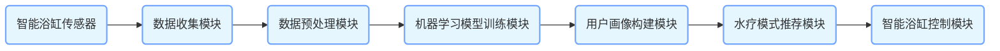

# AI Agent在智能浴缸中的水疗模式个性化

> 关键词：AI Agent、智能浴缸、水疗模式、个性化、用户体验

> 摘要：本文深入探讨了AI Agent在智能浴缸水疗模式个性化中的应用。首先介绍了相关背景，包括目的、预期读者、文档结构和术语表。接着阐述了核心概念及联系，分析了核心算法原理并给出Python代码示例，讲解了数学模型和公式。通过项目实战展示了代码的实际案例及详细解释。探讨了实际应用场景，推荐了相关的工具和资源。最后总结了未来发展趋势与挑战，提供了常见问题解答和扩展阅读参考资料。旨在帮助读者全面了解AI Agent如何为智能浴缸带来个性化的水疗体验。

## 1. 背景介绍 
### 1.1 目的和范围
随着智能家居的发展，智能浴缸逐渐走进人们的生活。传统的浴缸水疗模式较为固定，无法满足不同用户的个性化需求。本文章的目的在于探讨如何利用AI Agent技术实现智能浴缸水疗模式的个性化定制，提高用户的使用体验。范围涵盖了AI Agent的原理、在智能浴缸中的应用算法、实际项目开发以及相关的工具资源等方面。

### 1.2 预期读者
本文预期读者包括智能家居开发者、AI技术爱好者、智能浴缸制造商的研发人员以及对智能生活感兴趣的普通消费者。开发者可以从文章中获取技术实现的思路和方法，制造商研发人员可以了解如何将AI Agent应用到产品中，普通消费者可以了解智能浴缸个性化水疗模式的原理和优势。

### 1.3 文档结构概述
本文将按照以下结构进行阐述：首先介绍核心概念与联系，让读者了解AI Agent和智能浴缸水疗模式个性化的基本原理；接着讲解核心算法原理和具体操作步骤，并给出Python代码示例；然后介绍数学模型和公式，帮助读者深入理解算法的理论基础；通过项目实战展示代码的实际应用和详细解释；探讨实际应用场景；推荐相关的工具和资源；最后总结未来发展趋势与挑战，提供常见问题解答和扩展阅读参考资料。

### 1.4 术语表
#### 1.4.1 核心术语定义
- **AI Agent（人工智能代理）**：是一种能够感知环境、自主决策并采取行动以实现特定目标的软件实体。在智能浴缸中，AI Agent可以感知用户的需求和环境信息，为用户推荐合适的水疗模式。
- **智能浴缸**：具备智能化功能的浴缸，能够通过传感器感知水温、水位等信息，并根据预设的程序或用户的指令进行操作。
- **水疗模式**：智能浴缸提供的不同类型的水疗方案，如按摩模式、气泡模式、香薰模式等，每种模式具有不同的功能和特点。
- **个性化**：根据用户的个人偏好、身体状况、使用习惯等因素，为用户量身定制适合的水疗模式。

#### 1.4.2 相关概念解释
- **传感器数据**：智能浴缸中的传感器收集的信息，如水温、水位、水流速度等，这些数据是AI Agent进行决策的重要依据。
- **用户画像**：通过收集用户的个人信息、使用历史等数据，构建的关于用户的特征模型，用于了解用户的偏好和需求。
- **机器学习算法**：用于分析传感器数据和用户画像，预测用户的需求，为用户推荐合适的水疗模式。

#### 1.4.3 缩略词列表
- **AI**：Artificial Intelligence，人工智能
- **ML**：Machine Learning，机器学习
- **IoT**：Internet of Things，物联网

## 2. 核心概念与联系 
### 核心概念原理
AI Agent在智能浴缸水疗模式个性化中的核心原理是通过传感器收集浴缸的环境信息和用户的使用数据，利用机器学习算法对这些数据进行分析和处理，构建用户画像，然后根据用户画像为用户推荐个性化的水疗模式。

具体来说，智能浴缸中的传感器可以实时监测水温、水位、水流速度等环境信息，同时记录用户的使用时间、选择的水疗模式等使用数据。AI Agent将这些数据收集起来，进行清洗和预处理，然后使用机器学习算法进行建模和分析。通过分析用户的使用数据，AI Agent可以了解用户的偏好和习惯，例如用户喜欢的水温范围、常用的水疗模式等。根据这些信息，AI Agent可以为用户构建个性化的用户画像。

当用户再次使用智能浴缸时，AI Agent会根据用户画像为用户推荐合适的水疗模式。如果用户有特殊的需求，例如身体疲劳、压力大等，AI Agent还可以根据用户的身体状况为用户推荐相应的水疗模式，如按摩模式、舒缓模式等。

### 架构的文本示意图
```plaintext
智能浴缸传感器 -> 数据收集模块 -> 数据预处理模块 -> 机器学习模型训练模块 -> 用户画像构建模块 -> 水疗模式推荐模块 -> 智能浴缸控制模块
```

### Mermaid流程图


## 3. 核心算法原理 & 具体操作步骤 
### 核心算法原理
在智能浴缸水疗模式个性化中，常用的核心算法是基于机器学习的推荐算法，如协同过滤算法、基于内容的推荐算法等。这里以基于内容的推荐算法为例进行讲解。

基于内容的推荐算法的核心思想是根据物品的特征和用户的偏好，为用户推荐与用户偏好相似的物品。在智能浴缸水疗模式个性化中，物品就是不同的水疗模式，用户的偏好可以通过用户画像来表示。

具体来说，首先需要对每个水疗模式进行特征提取，例如水疗模式的功能特点（按摩强度、气泡大小、水温范围等）。然后，根据用户画像，计算用户对每个水疗模式的兴趣度。最后，根据兴趣度为用户推荐排名靠前的水疗模式。

### 具体操作步骤
1. **数据收集**：使用智能浴缸中的传感器收集环境信息和用户的使用数据，包括水温、水位、水流速度、使用时间、选择的水疗模式等。
2. **数据预处理**：对收集到的数据进行清洗和预处理，去除噪声数据和异常值，将数据转换为适合机器学习算法处理的格式。
3. **特征提取**：对每个水疗模式进行特征提取，例如水疗模式的功能特点（按摩强度、气泡大小、水温范围等），并将其表示为向量形式。
4. **用户画像构建**：根据用户的使用数据，构建用户画像，例如用户喜欢的水温范围、常用的水疗模式等。
5. **兴趣度计算**：根据用户画像和水疗模式的特征向量，计算用户对每个水疗模式的兴趣度。
6. **水疗模式推荐**：根据兴趣度为用户推荐排名靠前的水疗模式。

### Python源代码详细阐述
```python
import pandas as pd
from sklearn.feature_extraction.text import TfidfVectorizer
from sklearn.metrics.pairwise import cosine_similarity

# 模拟水疗模式数据
spa_modes = [
    {"name": "按摩模式", "features": "高强度按摩 气泡适中 水温38-40度"},
    {"name": "气泡模式", "features": "大量气泡 低强度按摩 水温36-38度"},
    {"name": "舒缓模式", "features": "轻柔按摩 少量气泡 水温34-36度"}
]

# 模拟用户画像数据
user_profile = "喜欢高强度按摩 水温38-40度"

# 提取水疗模式的特征
mode_features = [mode["features"] for mode in spa_modes]

# 使用TF-IDF进行特征向量化
vectorizer = TfidfVectorizer()
mode_vectors = vectorizer.fit_transform(mode_features)
user_vector = vectorizer.transform([user_profile])

# 计算用户对每个水疗模式的兴趣度
similarities = cosine_similarity(user_vector, mode_vectors)

# 排序并推荐水疗模式
recommended_modes = sorted(zip(spa_modes, similarities[0]), key=lambda x: x[1], reverse=True)

# 输出推荐结果
for mode, similarity in recommended_modes:
    print(f"推荐水疗模式: {mode['name']}, 兴趣度: {similarity}")
```

## 4. 数学模型和公式 & 详细讲解 & 举例说明 
### 数学模型和公式
在基于内容的推荐算法中，主要使用的数学模型是向量空间模型，通过计算向量之间的相似度来衡量用户对水疗模式的兴趣度。常用的相似度计算方法是余弦相似度，其公式如下：

$$
\cos(\theta) = \frac{\mathbf{A} \cdot \mathbf{B}}{\|\mathbf{A}\| \|\mathbf{B}\|}
$$

其中，$\mathbf{A}$ 和 $\mathbf{B}$ 分别表示两个向量，$\mathbf{A} \cdot \mathbf{B}$ 表示向量的点积，$\|\mathbf{A}\|$ 和 $\|\mathbf{B}\|$ 分别表示向量的模。

### 详细讲解
余弦相似度的取值范围是 $[-1, 1]$，值越接近 1 表示两个向量越相似，值越接近 -1 表示两个向量越不相似。在智能浴缸水疗模式个性化中，向量 $\mathbf{A}$ 表示用户画像的特征向量，向量 $\mathbf{B}$ 表示水疗模式的特征向量。通过计算余弦相似度，可以得到用户对每个水疗模式的兴趣度。

### 举例说明
假设用户画像的特征向量为 $\mathbf{A} = [0.8, 0.2]$，表示用户对高强度按摩的兴趣度为 0.8，对气泡的兴趣度为 0.2。水疗模式 1 的特征向量为 $\mathbf{B}_1 = [0.9, 0.1]$，表示该水疗模式具有高强度按摩和少量气泡的特点。水疗模式 2 的特征向量为 $\mathbf{B}_2 = [0.2, 0.8]$，表示该水疗模式具有低强度按摩和大量气泡的特点。

计算用户对水疗模式 1 的余弦相似度：

$$
\cos(\theta_1) = \frac{\mathbf{A} \cdot \mathbf{B}_1}{\|\mathbf{A}\| \|\mathbf{B}_1\|} = \frac{0.8 \times 0.9 + 0.2 \times 0.1}{\sqrt{0.8^2 + 0.2^2} \sqrt{0.9^2 + 0.1^2}} \approx 0.98
$$

计算用户对水疗模式 2 的余弦相似度：

$$
\cos(\theta_2) = \frac{\mathbf{A} \cdot \mathbf{B}_2}{\|\mathbf{A}\| \|\mathbf{B}_2\|} = \frac{0.8 \times 0.2 + 0.2 \times 0.8}{\sqrt{0.8^2 + 0.2^2} \sqrt{0.2^2 + 0.8^2}} \approx 0.32
$$

由于 $\cos(\theta_1) > \cos(\theta_2)$，因此用户对水疗模式 1 的兴趣度更高，应该优先推荐水疗模式 1。

## 5. 项目实战：代码实际案例和详细解释说明 
### 5.1 开发环境搭建
#### 硬件环境
- 智能浴缸：具备水温传感器、水位传感器、水流速度传感器等，能够与计算机进行通信。
- 计算机：用于运行AI Agent程序，建议配置为Intel Core i5及以上处理器，8GB及以上内存。

#### 软件环境
- 操作系统：Windows 10、Linux（如Ubuntu）等。
- Python：建议使用Python 3.7及以上版本。
- 相关库：pandas、scikit-learn等，可以使用以下命令进行安装：
```bash
pip install pandas scikit-learn
```

### 5.2 源代码详细实现和代码解读
```python
import pandas as pd
from sklearn.feature_extraction.text import TfidfVectorizer
from sklearn.metrics.pairwise import cosine_similarity

# 读取水疗模式数据
spa_modes_data = pd.read_csv('spa_modes.csv')

# 读取用户画像数据
user_profile_data = pd.read_csv('user_profile.csv')

# 提取水疗模式的特征
mode_features = spa_modes_data['features'].tolist()

# 提取用户画像的特征
user_profile = user_profile_data['profile'].values[0]

# 使用TF-IDF进行特征向量化
vectorizer = TfidfVectorizer()
mode_vectors = vectorizer.fit_transform(mode_features)
user_vector = vectorizer.transform([user_profile])

# 计算用户对每个水疗模式的兴趣度
similarities = cosine_similarity(user_vector, mode_vectors)

# 排序并推荐水疗模式
recommended_modes = sorted(zip(spa_modes_data['name'], similarities[0]), key=lambda x: x[1], reverse=True)

# 输出推荐结果
for mode, similarity in recommended_modes:
    print(f"推荐水疗模式: {mode}, 兴趣度: {similarity}")
```

### 代码解读与分析
1. **数据读取**：使用 `pandas` 库读取水疗模式数据和用户画像数据，数据存储在 CSV 文件中。
2. **特征提取**：从数据中提取水疗模式的特征和用户画像的特征。
3. **特征向量化**：使用 `TfidfVectorizer` 将特征转换为向量形式。
4. **兴趣度计算**：使用 `cosine_similarity` 计算用户对每个水疗模式的兴趣度。
5. **排序并推荐**：根据兴趣度对水疗模式进行排序，并输出推荐结果。

## 6. 实际应用场景 
### 家庭使用
在家庭中，用户可以使用智能浴缸享受个性化的水疗体验。AI Agent可以根据用户的使用习惯和身体状况，为用户推荐合适的水疗模式。例如，如果用户在工作后感到疲劳，AI Agent可以推荐按摩模式，帮助用户放松身心。

### 酒店和度假村
在酒店和度假村中，智能浴缸可以作为一种高端的设施提供给客人。AI Agent可以根据客人的个人信息和偏好，为客人推荐个性化的水疗模式，提高客人的满意度和体验感。

### 康复中心
在康复中心，智能浴缸可以用于辅助康复治疗。AI Agent可以根据患者的病情和康复需求，为患者推荐合适的水疗模式，促进患者的康复。

## 7. 工具和资源推荐
### 7.1 学习资源推荐
#### 7.1.1 书籍推荐
- 《人工智能：一种现代的方法》：全面介绍了人工智能的基本概念、算法和应用，是学习人工智能的经典教材。
- 《机器学习》：详细讲解了机器学习的各种算法和模型，适合对机器学习感兴趣的读者。
- 《Python机器学习实战》：通过实际案例介绍了如何使用Python实现机器学习算法，具有很强的实践性。

#### 7.1.2 在线课程
- Coursera上的“人工智能基础”课程：由知名教授授课，系统地介绍了人工智能的基础知识和应用。
- edX上的“机器学习”课程：提供了丰富的学习资源和实践项目，帮助学员掌握机器学习的核心技术。
- 中国大学MOOC上的“人工智能导论”课程：结合国内的教学特点，深入浅出地介绍了人工智能的相关知识。

#### 7.1.3 技术博客和网站
- Medium：上面有很多关于人工智能和机器学习的技术文章，作者来自不同的领域，提供了丰富的视角和经验。
- Towards Data Science：专注于数据科学和机器学习领域，分享了很多实用的技术和案例。
- 机器之心：国内知名的人工智能媒体，及时报道人工智能领域的最新动态和技术进展。

### 7.2 开发工具框架推荐
#### 7.2.1 IDE和编辑器
- PyCharm：功能强大的Python集成开发环境，提供了代码编辑、调试、版本控制等功能，适合专业的Python开发者。
- Jupyter Notebook：交互式的开发环境，支持代码、文本、图像等多种形式的展示，适合数据科学和机器学习的实验和开发。
- Visual Studio Code：轻量级的代码编辑器，支持多种编程语言和插件扩展，具有良好的用户体验。

#### 7.2.2 调试和性能分析工具
- Py-Spy：用于分析Python程序的性能瓶颈，能够实时显示函数的调用频率和执行时间。
- PDB：Python自带的调试工具，支持单步执行、断点调试等功能，方便开发者进行代码调试。
- cProfile：用于分析Python程序的性能，能够统计函数的调用次数和执行时间，帮助开发者优化代码。

#### 7.2.3 相关框架和库
- TensorFlow：开源的机器学习框架，提供了丰富的工具和库，支持深度学习的各种应用。
- PyTorch：另一个流行的深度学习框架，具有简洁易用的特点，适合快速开发和实验。
- Scikit-learn：用于机器学习的Python库，提供了各种机器学习算法和工具，方便开发者进行数据处理和模型训练。

### 7.3 相关论文著作推荐
#### 7.3.1 经典论文
- “A Framework for Cooperative Distributed Problem Solving”：介绍了分布式人工智能的基本概念和框架，为AI Agent的研究奠定了基础。
- “Machine Learning: A Probabilistic Perspective”：从概率的角度介绍了机器学习的基本理论和算法，对理解机器学习的本质有很大的帮助。
- “Recommender Systems Handbook”：全面介绍了推荐系统的各种算法和应用，是推荐系统领域的经典著作。

#### 7.3.2 最新研究成果
- “Deep Reinforcement Learning for Personalized Recommendation”：研究了如何使用深度强化学习算法实现个性化推荐，为个性化推荐系统的发展提供了新的思路。
- “AI Agents for Smart Home Automation: A Survey”：对AI Agent在智能家居自动化中的应用进行了综述，介绍了最新的研究成果和发展趋势。
- “Personalized Spa Experience Using Artificial Intelligence”：专门研究了如何使用人工智能技术实现智能浴缸的个性化水疗体验，具有很高的参考价值。

#### 7.3.3 应用案例分析
- “Case Studies in Smart Home AI Agent Applications”：通过实际案例分析了AI Agent在智能家居中的应用，包括智能照明、智能温控等方面，为智能浴缸的应用提供了借鉴。
- “AI-Enabled Spa and Wellness Centers: Real-World Examples”：介绍了一些实际的AI智能水疗中心的案例，分析了其成功的经验和面临的挑战。

## 8. 总结：未来发展趋势与挑战
### 未来发展趋势
- **多模态融合**：未来的AI Agent将不仅仅依赖于文本信息，还会融合图像、语音、视频等多模态信息，更全面地了解用户的需求和状态，提供更加个性化的水疗模式推荐。
- **与其他智能家居设备的联动**：智能浴缸将与其他智能家居设备，如智能音箱、智能灯光、智能窗帘等进行联动，实现更加智能化的家居场景。例如，当用户选择舒缓模式时，智能灯光会自动调暗，智能音箱会播放舒缓的音乐。
- **健康监测与干预**：AI Agent可以结合健康监测设备，如手环、体脂秤等，实时监测用户的健康状况。根据健康数据，为用户提供更加科学合理的水疗模式推荐，并在必要时进行健康干预。
- **强化学习的应用**：强化学习可以让AI Agent在与用户的交互中不断学习和优化推荐策略，提高推荐的准确性和个性化程度。未来，强化学习将在智能浴缸水疗模式个性化中得到更广泛的应用。

### 挑战
- **数据隐私和安全**：智能浴缸收集的用户数据包含了很多个人隐私信息，如身体状况、使用习惯等。如何保证数据的隐私和安全是一个重要的挑战。需要采用先进的加密技术和安全机制，防止数据泄露和滥用。
- **算法的可解释性**：深度学习等复杂算法在提高推荐准确性的同时，也带来了算法可解释性的问题。用户可能会对推荐结果产生疑问，需要算法能够解释为什么推荐某个水疗模式。因此，如何提高算法的可解释性是一个亟待解决的问题。
- **硬件成本和兼容性**：实现智能浴缸的个性化水疗模式需要配备各种传感器和智能设备，这会增加硬件成本。同时，不同品牌和型号的智能设备之间可能存在兼容性问题，需要解决硬件的集成和互通问题。
- **用户接受度**：一些用户可能对AI Agent的推荐结果存在疑虑，不太愿意完全依赖AI Agent来选择水疗模式。需要通过宣传和教育，提高用户对智能浴缸个性化水疗模式的认知和接受度。

## 9. 附录：常见问题与解答
### 1. AI Agent推荐的水疗模式一定适合我吗？
AI Agent的推荐是基于用户的历史数据和偏好进行的，虽然具有一定的准确性，但并不能保证推荐的水疗模式一定适合每个用户。用户可以根据自己的实际感受进行调整和反馈，AI Agent会在后续的推荐中不断优化。

### 2. 智能浴缸收集的用户数据会被泄露吗？
智能浴缸制造商通常会采取严格的安全措施来保护用户数据的隐私和安全。数据会进行加密处理，并且只有经过授权的人员才能访问。同时，制造商也会遵守相关的法律法规，不会将用户数据泄露给第三方。

### 3. 如何让AI Agent更好地了解我的需求？
用户可以在使用智能浴缸的过程中，及时反馈自己的感受和需求。例如，如果用户觉得某个水疗模式的水温不合适，可以调整水温并记录下来，AI Agent会根据这些反馈信息不断优化推荐策略。

### 4. 智能浴缸的个性化水疗模式会增加能耗吗？
智能浴缸的个性化水疗模式可以根据用户的需求进行调整，避免不必要的能源浪费。例如，如果用户只需要较低的水温，AI Agent会推荐相应的水疗模式，减少加热所需的能源消耗。因此，个性化水疗模式不一定会增加能耗，反而可能会更加节能。

## 10. 扩展阅读 & 参考资料
### 扩展阅读
- 《智能家居技术与应用》：介绍了智能家居的各种技术和应用场景，对智能浴缸的发展有一定的参考价值。
- 《人工智能与未来生活》：探讨了人工智能对未来生活的影响，包括智能家居领域的应用。
- 《水疗养生指南》：详细介绍了水疗的原理、方法和功效，有助于了解智能浴缸水疗模式的作用。

### 参考资料
- 相关的学术论文和研究报告，如IEEE、ACM等学术会议和期刊上发表的关于AI Agent和智能家居的论文。
- 智能浴缸制造商的官方网站和产品说明书，了解智能浴缸的技术参数和功能特点。
- 行业标准和规范，如智能家居相关的国家标准和行业规范，确保智能浴缸的开发和应用符合要求。

作者：AI天才研究院/AI Genius Institute & 禅与计算机程序设计艺术 /Zen And The Art of Computer Programming