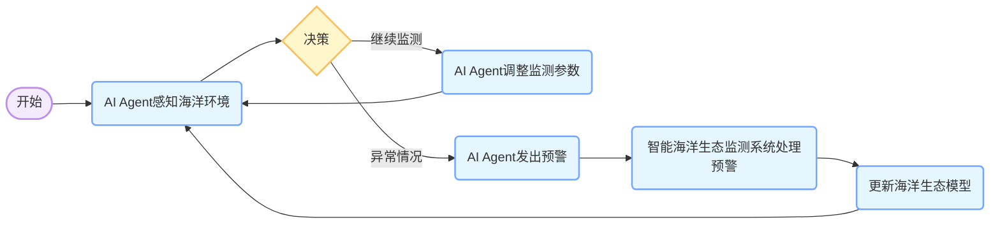

# AI Agent在智能海洋生态监测中的实践

> 关键词：AI Agent、智能海洋生态监测、海洋数据处理、生态模型、自动化监测

> 摘要：本文聚焦于AI Agent在智能海洋生态监测中的实践应用。首先介绍了相关背景，包括目的范围、预期读者等内容。详细阐述了AI Agent及智能海洋生态监测的核心概念与联系，给出了原理和架构的文本示意图及Mermaid流程图。深入讲解了核心算法原理和具体操作步骤，结合Python源代码进行说明，并给出了相应的数学模型和公式。通过项目实战，展示了代码的实际案例和详细解释。探讨了AI Agent在智能海洋生态监测中的实际应用场景，推荐了相关的学习资源、开发工具框架和论文著作。最后总结了未来发展趋势与挑战，提供了常见问题解答和扩展阅读参考资料，旨在为相关领域的研究和实践提供全面且深入的指导。

## 1. 背景介绍 
### 1.1 目的和范围
随着全球对海洋资源的重视以及海洋生态环境面临的诸多挑战，如海洋污染、生物多样性减少等，智能海洋生态监测变得尤为重要。本文章的目的在于深入探讨AI Agent在智能海洋生态监测中的应用实践，旨在为海洋科研人员、环保工作者和相关技术开发者提供全面的技术指导和应用案例。范围涵盖了从AI Agent的基本概念到其在海洋生态监测各个环节的具体应用，包括数据采集、处理、分析以及生态模型构建等方面。

### 1.2 预期读者
本文预期读者主要包括海洋科学研究人员，他们可以借助AI Agent的技术手段提升海洋生态监测的效率和精度；环保工作者，能够利用相关技术更好地了解海洋生态状况，制定有效的保护措施；计算机科学和人工智能领域的开发者，可从文中获取AI Agent在特定领域的应用思路和技术实现方法；同时，也适合对海洋生态和人工智能交叉领域感兴趣的学生和爱好者阅读。

### 1.3 文档结构概述
本文首先介绍了背景信息，让读者了解研究的目的、范围和预期读者。接着阐述了AI Agent和智能海洋生态监测的核心概念与联系，通过文本示意图和Mermaid流程图进行直观展示。然后详细讲解了核心算法原理和具体操作步骤，结合Python代码进行说明，并给出相关的数学模型和公式。项目实战部分展示了代码的实际应用案例和详细解读。随后探讨了AI Agent在智能海洋生态监测中的实际应用场景。推荐了学习资源、开发工具框架和相关论文著作。最后总结了未来发展趋势与挑战，提供常见问题解答和扩展阅读参考资料。

### 1.4 术语表
#### 1.4.1 核心术语定义
- **AI Agent**：人工智能代理，是一种能够感知环境、根据感知信息进行决策并采取行动以实现特定目标的智能实体。在海洋生态监测中，AI Agent可以根据海洋环境数据做出相应的决策，如调整监测设备的参数或发出预警。
- **智能海洋生态监测**：利用先进的传感器技术、通信技术和人工智能技术，对海洋生态系统的各种参数进行实时、自动、精准监测，并对监测数据进行分析和处理，以了解海洋生态系统的状态和变化趋势。
- **海洋生态模型**：用于描述海洋生态系统中各种生物和非生物因素之间相互关系的数学模型。通过AI Agent可以对海洋生态模型进行优化和更新，提高模型的准确性和可靠性。

#### 1.4.2 相关概念解释
- **传感器网络**：由大量分布在海洋中的传感器节点组成的网络，用于采集海洋环境的各种数据，如温度、盐度、溶解氧等。AI Agent可以与传感器网络进行交互，获取所需的数据并对传感器进行管理。
- **数据融合**：将来自不同传感器或数据源的数据进行整合和处理，以提高数据的质量和可用性。AI Agent可以运用数据融合技术，综合分析多源数据，更全面地了解海洋生态状况。
- **机器学习算法**：一类让计算机自动从数据中学习模式和规律的算法。在智能海洋生态监测中，AI Agent可以利用机器学习算法对海洋数据进行分类、预测和异常检测等。

#### 1.4.3 缩略词列表
- **AI**：Artificial Intelligence，人工智能
- **IoT**：Internet of Things，物联网
- **ML**：Machine Learning，机器学习
- **CNN**：Convolutional Neural Network，卷积神经网络
- **RNN**：Recurrent Neural Network，循环神经网络

## 2. 核心概念与联系 

### 核心概念原理
#### AI Agent原理
AI Agent的核心原理基于感知 - 决策 - 行动的循环。它通过各种传感器感知环境信息，将感知到的数据输入到决策模块。决策模块根据预设的目标和规则，运用机器学习、深度学习等算法对数据进行分析和处理，做出相应的决策。最后，行动模块根据决策结果执行相应的操作，如调整监测设备的位置、采集特定的数据等。

#### 智能海洋生态监测原理
智能海洋生态监测利用传感器网络实时采集海洋环境的各种数据，包括物理参数（如温度、盐度、海流等）、化学参数（如溶解氧、酸碱度等）和生物参数（如浮游生物数量、鱼类分布等）。采集到的数据通过通信网络传输到数据处理中心，在数据处理中心，利用数据分析和挖掘技术对数据进行清洗、预处理和分析，提取有价值的信息。同时，结合海洋生态模型对海洋生态系统的状态和变化趋势进行评估和预测。

### 架构的文本示意图
```plaintext
          +----------------------+
          |  AI Agent            |
          |                      |
          |  +--------------+    |
          |  | 感知模块     |    |
          |  +--------------+    |
          |  | 决策模块     |    |
          |  +--------------+    |
          |  | 行动模块     |    |
          |  +--------------+    |
          +----------------------+
                  |
                  | 交互
                  v
+--------------------------------------+
| 智能海洋生态监测系统                 |
|                                      |
|  +-------------------+               |
|  | 传感器网络        |               |
|  +-------------------+               |
|  | 数据传输网络      |               |
|  +-------------------+               |
|  | 数据处理中心      |               |
|  |  - 数据清洗       |               |
|  |  - 数据分析       |               |
|  |  - 生态模型构建   |               |
|  +-------------------+               |
|  | 监测结果展示      |               |
|  +-------------------+               |
+--------------------------------------+
```

### Mermaid流程图


## 3. 核心算法原理 & 具体操作步骤 

### 核心算法原理
#### 数据分类算法 - 决策树算法
决策树算法是一种基于树结构进行决策的机器学习算法。在智能海洋生态监测中，可以利用决策树算法对采集到的海洋数据进行分类，例如判断水质是否达标、海洋生物的种类等。决策树的每个内部节点表示一个属性上的测试，每个分支是一个测试输出，每个叶节点是一个类别或值。

#### 异常检测算法 - 基于统计的方法
基于统计的异常检测方法通过计算数据的统计特征，如均值、方差等，来判断数据是否异常。在海洋生态监测中，如果某个传感器采集到的数据与历史数据的统计特征偏差较大，则认为该数据可能是异常数据。

### 具体操作步骤及Python源代码

#### 数据分类 - 决策树算法示例
```python
import pandas as pd
from sklearn.model_selection import train_test_split
from sklearn.tree import DecisionTreeClassifier
from sklearn.metrics import accuracy_score

# 假设我们有一个包含海洋数据的CSV文件
data = pd.read_csv('ocean_data.csv')

# 分离特征和标签
X = data.drop('label', axis=1)
y = data['label']

# 划分训练集和测试集
X_train, X_test, y_train, y_test = train_test_split(X, y, test_size=0.2, random_state=42)

# 创建决策树分类器
clf = DecisionTreeClassifier()

# 训练模型
clf.fit(X_train, y_train)

# 预测
y_pred = clf.predict(X_test)

# 计算准确率
accuracy = accuracy_score(y_test, y_pred)
print(f"决策树分类准确率: {accuracy}")
```

#### 异常检测 - 基于统计的方法示例
```python
import numpy as np

# 假设我们有一组历史海洋数据
historical_data = np.array([10, 12, 11, 13, 12, 14, 13, 15, 14, 16])

# 计算均值和标准差
mean = np.mean(historical_data)
std = np.std(historical_data)

# 假设新采集到的数据
new_data = 20

# 判断是否为异常数据
if np.abs(new_data - mean) > 3 * std:
    print(f"数据 {new_data} 可能是异常数据")
else:
    print(f"数据 {new_data} 正常")
```

## 4. 数学模型和公式 & 详细讲解 & 举例说明 

### 决策树算法的数学模型和公式
#### 信息熵
信息熵是衡量数据不确定性的指标，其计算公式为：
$$H(X) = -\sum_{i=1}^{n} p(x_i) \log_2 p(x_i)$$
其中，$X$ 是一个随机变量，$p(x_i)$ 是 $x_i$ 出现的概率。

#### 信息增益
信息增益用于衡量在某个属性上进行划分后，数据不确定性的减少程度。其计算公式为：
$$IG(X, A) = H(X) - \sum_{v \in Values(A)} \frac{|S_v|}{|S|} H(S_v)$$
其中，$IG(X, A)$ 是属性 $A$ 对数据集 $S$ 的信息增益，$H(X)$ 是数据集 $S$ 的信息熵，$Values(A)$ 是属性 $A$ 的所有取值，$S_v$ 是属性 $A$ 取值为 $v$ 的子集，$|S|$ 和 $|S_v|$ 分别是数据集 $S$ 和子集 $S_v$ 的样本数量。

### 详细讲解
信息熵越大，说明数据的不确定性越大；信息增益越大，说明在该属性上进行划分后，数据的不确定性减少得越多，该属性越适合作为划分属性。

### 举例说明
假设我们有一个海洋生物数据集，包含两个属性：颜色（红、蓝）和大小（大、小），以及一个类别标签（鱼类、贝类）。数据集如下：

| 颜色 | 大小 | 类别 |
|------|------|------|
| 红   | 大   | 鱼类 |
| 红   | 小   | 鱼类 |
| 蓝   | 大   | 贝类 |
| 蓝   | 小   | 贝类 |

首先计算数据集的信息熵：
$p(鱼类) = 0.5$，$p(贝类) = 0.5$
$$H(X) = - (0.5 \log_2 0.5 + 0.5 \log_2 0.5) = 1$$

然后计算属性“颜色”的信息增益：
- 颜色为红的子集 $S_{红}$：$p(鱼类) = 1$，$p(贝类) = 0$，$H(S_{红}) = - (1 \log_2 1 + 0 \log_2 0) = 0$
- 颜色为蓝的子集 $S_{蓝}$：$p(鱼类) = 0$，$p(贝类) = 1$，$H(S_{蓝}) = - (0 \log_2 0 + 1 \log_2 1) = 0$
$$IG(X, 颜色) = 1 - (\frac{2}{4} \times 0 + \frac{2}{4} \times 0) = 1$$

同理可计算属性“大小”的信息增益，通过比较信息增益的大小，选择信息增益最大的属性作为划分属性。

## 5. 项目实战：代码实际案例和详细解释说明 

### 5.1  开发环境搭建
#### 硬件环境
- **服务器**：可以选择云服务器，如阿里云、腾讯云等，配置建议为至少 4 核 CPU、8GB 内存、100GB 存储。
- **传感器设备**：选择适合海洋环境的传感器，如温度传感器、盐度传感器、溶解氧传感器等。确保传感器具备防水、耐腐蚀等特性，并能够通过有线或无线方式将数据传输到服务器。

#### 软件环境
- **操作系统**：选择 Linux 系统，如 Ubuntu 18.04 或更高版本。
- **编程语言**：Python 3.7 或更高版本。
- **开发框架和库**：安装 pandas、numpy、scikit-learn、tensorflow 等常用的数据分析和机器学习库。可以使用以下命令进行安装：
```bash
pip install pandas numpy scikit-learn tensorflow
```

### 5.2  源代码详细实现和代码解读
#### 数据采集模块
```python
import serial
import time

# 假设传感器通过串口连接
ser = serial.Serial('/dev/ttyUSB0', 9600)

def collect_data():
    while True:
        try:
            # 读取传感器数据
            data = ser.readline().decode().strip()
            # 处理数据，这里简单打印
            print(f"采集到的数据: {data}")
            time.sleep(1)
        except Exception as e:
            print(f"数据采集出错: {e}")

if __name__ == "__main__":
    collect_data()
```
**代码解读**：该代码使用 `serial` 库通过串口读取传感器数据。`ser = serial.Serial('/dev/ttyUSB0', 9600)` 初始化串口连接，`ser.readline().decode().strip()` 读取一行数据并进行解码和去除首尾空格。使用 `while True` 循环不断采集数据，每次采集间隔 1 秒。

#### 数据处理和分析模块
```python
import pandas as pd
from sklearn.preprocessing import StandardScaler
from sklearn.ensemble import RandomForestClassifier

# 假设已经有采集到的数据文件
data = pd.read_csv('ocean_data.csv')

# 分离特征和标签
X = data.drop('label', axis=1)
y = data['label']

# 数据标准化
scaler = StandardScaler()
X_scaled = scaler.fit_transform(X)

# 创建随机森林分类器
clf = RandomForestClassifier()

# 训练模型
clf.fit(X_scaled, y)

# 预测新数据
new_data = pd.read_csv('new_ocean_data.csv')
new_X = new_data.drop('label', axis=1)
new_X_scaled = scaler.transform(new_X)
predictions = clf.predict(new_X_scaled)

print(f"预测结果: {predictions}")
```
**代码解读**：该代码使用 `pandas` 库读取数据文件，`StandardScaler` 对数据进行标准化处理，`RandomForestClassifier` 构建随机森林分类器并进行训练和预测。首先读取历史数据和新数据，分离特征和标签，对特征数据进行标准化处理，然后训练模型并对新数据进行预测。

### 5.3  代码解读与分析
#### 数据采集模块
- 优点：代码简单易懂，能够实时采集传感器数据。
- 缺点：缺乏数据存储和错误处理机制，当传感器出现故障或数据传输中断时，可能会导致数据丢失。
- 改进建议：添加数据存储功能，将采集到的数据保存到数据库中；增加错误重试机制，当出现错误时，尝试重新连接传感器。

#### 数据处理和分析模块
- 优点：使用了随机森林分类器，具有较高的准确率和鲁棒性；对数据进行了标准化处理，有助于提高模型的性能。
- 缺点：没有对模型进行评估和优化，可能会出现过拟合或欠拟合的问题。
- 改进建议：使用交叉验证对模型进行评估，调整模型的超参数，如树的数量、最大深度等，以提高模型的性能。

## 6. 实际应用场景 
### 海洋水质监测
AI Agent可以实时监测海洋水质的各项指标，如溶解氧、化学需氧量、酸碱度等。当水质指标超出正常范围时，AI Agent能够及时发出预警，提醒相关部门采取措施。例如，在某海域的海水养殖区域，通过部署传感器网络和AI Agent，实时监测水质变化。一旦发现溶解氧含量过低，AI Agent会自动向养殖户发送警报，并根据预设的规则调整增氧设备的运行参数，保证养殖生物的生存环境。

### 海洋生物多样性监测
利用AI Agent结合图像识别和声学监测技术，对海洋生物的种类和数量进行监测。例如，在海洋保护区内，通过水下摄像头和水听器采集海洋生物的图像和声音数据。AI Agent可以对这些数据进行分析和处理，识别出不同种类的海洋生物，并统计其数量和分布情况。通过长期的监测和分析，可以了解海洋生物多样性的变化趋势，为海洋生物保护提供科学依据。

### 海洋灾害预警
AI Agent可以综合分析海洋气象数据、海流数据和地质数据等，对海洋灾害进行预警。例如，在台风来临前，AI Agent可以根据气象卫星数据和海洋浮标数据，预测台风的路径和强度，提前向沿海地区发出预警。同时，AI Agent还可以对海啸、风暴潮等海洋灾害进行实时监测和预警，减少灾害造成的损失。

## 7. 工具和资源推荐
### 7.1 学习资源推荐
#### 7.1.1 书籍推荐
- 《人工智能：一种现代的方法》：全面介绍了人工智能的基本概念、算法和应用，是人工智能领域的经典教材。
- 《Python机器学习实战》：通过实际案例介绍了Python在机器学习中的应用，适合初学者入门。
- 《海洋生态学》：系统介绍了海洋生态系统的结构、功能和动态变化，为智能海洋生态监测提供了理论基础。

#### 7.1.2 在线课程
- Coursera上的“人工智能基础”课程：由知名高校的教授授课，讲解了人工智能的基本原理和算法。
- edX上的“Python数据科学入门”课程：介绍了Python在数据处理和分析中的应用，适合初学者学习。
- 中国大学MOOC上的“海洋科学概论”课程：系统介绍了海洋科学的基本概念和研究方法。

#### 7.1.3 技术博客和网站
- Medium：有许多人工智能和海洋科学领域的专业博客，分享了最新的研究成果和实践经验。
- arXiv：提供了大量的学术论文，涵盖了人工智能、海洋科学等多个领域。
- 中国海洋信息网：提供了丰富的海洋科学数据和信息，是了解海洋生态监测的重要网站。

### 7.2 开发工具框架推荐
#### 7.2.1 IDE和编辑器
- PyCharm：功能强大的Python集成开发环境，提供了代码编辑、调试、版本控制等功能。
- Jupyter Notebook：交互式的开发环境，适合进行数据探索和模型实验。
- Visual Studio Code：轻量级的代码编辑器，支持多种编程语言，具有丰富的插件生态系统。

#### 7.2.2 调试和性能分析工具
- PDB：Python自带的调试工具，可以帮助开发者定位代码中的错误。
- cProfile：Python的性能分析工具，可以分析代码的运行时间和内存使用情况。
- TensorBoard：TensorFlow的可视化工具，可以帮助开发者可视化模型的训练过程和性能指标。

#### 7.2.3 相关框架和库
- TensorFlow：开源的机器学习框架，支持深度学习模型的构建和训练。
- PyTorch：另一个流行的深度学习框架，具有动态图的特点，适合快速开发和实验。
- Scikit-learn：简单易用的机器学习库，提供了各种机器学习算法和工具。

### 7.3 相关论文著作推荐
#### 7.3.1 经典论文
- “A Mathematical Theory of Communication”：香农的经典论文，奠定了信息论的基础，对数据处理和分析有重要的指导意义。
- “Gradient-Based Learning Applied to Document Recognition”：介绍了卷积神经网络在文档识别中的应用，是深度学习领域的经典论文。
- “The Future of the Ocean”：探讨了海洋生态系统面临的挑战和未来发展趋势。

#### 7.3.2 最新研究成果
- “AI-Enabled Smart Ocean Monitoring Systems: A Review”：综述了AI在智能海洋监测系统中的应用现状和发展趋势。
- “Deep Learning for Marine Biodiversity Monitoring”：介绍了深度学习在海洋生物多样性监测中的应用研究成果。
- “Real-Time Ocean Data Analysis Using AI Agents”：研究了使用AI Agent进行实时海洋数据分析的方法和技术。

#### 7.3.3 应用案例分析
- “Case Study: AI Agent-Based Ocean Pollution Monitoring in the South China Sea”：以南海为例，介绍了AI Agent在海洋污染监测中的应用案例。
- “Application of AI Agents in Marine Fisheries Management”：分析了AI Agent在海洋渔业管理中的应用效果和经验。
- “Smart Ocean Monitoring System for Coral Reef Conservation”：介绍了智能海洋监测系统在珊瑚礁保护中的应用案例。

## 8. 总结：未来发展趋势与挑战
### 未来发展趋势
#### 多模态数据融合
未来的智能海洋生态监测将融合更多类型的数据，如光学图像、声学信号、卫星遥感数据等。通过多模态数据融合，可以更全面、准确地了解海洋生态系统的状态和变化趋势。

#### 边缘计算与云计算结合
将边缘计算技术应用于海洋生态监测中，在传感器节点或边缘设备上进行数据的初步处理和分析，减少数据传输量，提高系统的实时性和响应速度。同时，将处理后的数据上传到云计算平台进行更深入的分析和挖掘。

#### 智能决策与自动化控制
AI Agent将具备更强的智能决策能力，能够根据海洋生态监测数据自动制定合理的决策和控制策略。例如，自动调整监测设备的参数、控制海洋治理设备的运行等，实现海洋生态监测和治理的自动化。

### 挑战
#### 数据质量和可靠性
海洋环境复杂多变，传感器采集到的数据可能存在噪声、缺失值等问题，影响数据的质量和可靠性。如何有效地处理和清洗数据，提高数据的质量，是智能海洋生态监测面临的一个重要挑战。

#### 算法的可解释性
深度学习等人工智能算法在海洋生态监测中取得了较好的效果，但这些算法往往是黑盒模型，缺乏可解释性。在实际应用中，需要了解算法的决策过程和依据，以便对监测结果进行合理的判断和决策。

#### 系统的安全性和稳定性
智能海洋生态监测系统涉及大量的传感器设备和数据传输网络，容易受到网络攻击和自然灾害的影响。如何保障系统的安全性和稳定性，防止数据泄露和系统故障，是需要解决的关键问题。

## 9. 附录：常见问题与解答
### 问题1：AI Agent在海洋生态监测中的优势是什么？
答：AI Agent具有自主决策和行动的能力，可以根据海洋环境的实时变化自动调整监测策略，提高监测的效率和精度。同时，AI Agent可以处理大量的多源异构数据，挖掘数据背后的潜在信息，为海洋生态保护提供更科学的决策依据。

### 问题2：如何选择适合海洋生态监测的传感器？
答：选择传感器时需要考虑以下因素：
- **测量参数**：根据监测的需求，选择能够测量所需参数的传感器，如温度、盐度、溶解氧等。
- **精度和可靠性**：确保传感器具有较高的精度和可靠性，能够在海洋环境中稳定工作。
- **防水和耐腐蚀性能**：海洋环境恶劣，传感器需要具备良好的防水和耐腐蚀性能，以延长使用寿命。
- **数据传输方式**：选择适合的数据传输方式，如有线传输或无线传输，确保数据能够及时、准确地传输到数据处理中心。

### 问题3：如何评估AI Agent在海洋生态监测中的性能？
答：可以从以下几个方面评估AI Agent的性能：
- **监测精度**：比较AI Agent的监测结果与实际情况的差异，评估其监测的准确性。
- **响应速度**：评估AI Agent对海洋环境变化的响应速度，确保能够及时发现异常情况并发出预警。
- **决策合理性**：分析AI Agent做出的决策是否合理，是否能够有效地保护海洋生态环境。
- **系统稳定性**：评估AI Agent所在的监测系统的稳定性，确保系统能够长期稳定运行。

## 10. 扩展阅读 & 参考资料
### 扩展阅读
- 《海洋大数据与人工智能》：介绍了海洋大数据的特点和处理方法，以及人工智能在海洋领域的应用。
- 《智能传感器技术》：详细介绍了智能传感器的原理、设计和应用，对海洋生态监测中的传感器技术有深入的讲解。
- 《人工智能伦理与治理》：探讨了人工智能在应用过程中面临的伦理和治理问题，对于AI Agent在海洋生态监测中的应用具有重要的参考价值。

### 参考资料
- 相关学术论文和研究报告，如《Journal of Marine Science and Engineering》、《Ocean Engineering》等期刊上发表的论文。
- 政府部门和国际组织发布的海洋生态监测相关政策和标准，如国家海洋局发布的《海洋生态环境监测规范》。
- 开源项目和代码库，如GitHub上与海洋生态监测和AI Agent相关的项目。

作者：AI天才研究院/AI Genius Institute & 禅与计算机程序设计艺术 /Zen And The Art of Computer Programming