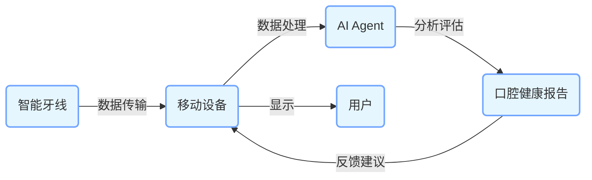

# AI Agent在智能牙线中的口腔健康追踪

> 关键词：AI Agent、智能牙线、口腔健康追踪、数据处理、健康评估

> 摘要：本文聚焦于AI Agent在智能牙线中的口腔健康追踪应用。详细介绍了相关核心概念，包括AI Agent和智能牙线的原理及联系，阐述了用于口腔健康追踪的核心算法原理和具体操作步骤，同时给出了相应的数学模型和公式。通过项目实战，展示了如何搭建开发环境、实现源代码并进行解读分析。探讨了该技术在实际场景中的应用，推荐了学习资源、开发工具框架以及相关论文著作。最后总结了未来发展趋势与挑战，并提供常见问题解答和扩展阅读参考资料，旨在为该领域的研究和应用提供全面的技术指导。

## 1. 背景介绍 
### 1.1 目的和范围
本文章旨在深入探讨AI Agent在智能牙线中实现口腔健康追踪的技术原理、应用场景和发展前景。具体范围涵盖了从AI Agent和智能牙线的核心概念，到相关算法原理、数学模型，再到实际项目的开发与应用，以及未来发展的趋势和面临的挑战等方面。通过对这些内容的研究，为开发者、研究人员和相关从业者提供全面且深入的技术参考，推动AI在口腔健康领域的进一步发展。

### 1.2 预期读者
本文的预期读者主要包括人工智能领域的研究人员、软件开发工程师、口腔医学专业人士以及对智能健康设备感兴趣的爱好者。对于研究人员，本文可提供新的研究思路和方向；对于软件开发工程师，能为其在开发智能牙线相关应用时提供技术指导；口腔医学专业人士可借此了解AI技术在口腔健康监测中的应用，为临床实践提供新的手段；而爱好者则可以通过本文了解该领域的前沿技术和发展动态。

### 1.3 文档结构概述
本文共分为十个部分。第一部分为背景介绍，阐述了文章的目的、预期读者和文档结构概述，同时列出了相关术语表。第二部分介绍核心概念与联系，包括AI Agent和智能牙线的原理及架构，并给出相应的示意图和流程图。第三部分详细讲解核心算法原理和具体操作步骤，使用Python源代码进行阐述。第四部分给出数学模型和公式，并进行详细讲解和举例说明。第五部分通过项目实战，展示开发环境搭建、源代码实现和代码解读分析。第六部分探讨实际应用场景。第七部分推荐学习资源、开发工具框架和相关论文著作。第八部分总结未来发展趋势与挑战。第九部分为附录，提供常见问题与解答。第十部分列出扩展阅读和参考资料。

### 1.4 术语表
#### 1.4.1 核心术语定义
- **AI Agent（人工智能代理）**：是一种能够感知环境、进行决策并采取行动以实现特定目标的智能实体。在本文中，AI Agent用于处理智能牙线收集到的口腔数据，进行分析和评估。
- **智能牙线**：集成了传感器和通信模块的牙线产品，能够收集口腔内的相关数据，如使用时间、压力、位置等，并将数据传输给AI Agent进行处理。
- **口腔健康追踪**：通过对口腔内各种数据的收集、分析和评估，实时了解口腔健康状况，包括牙齿清洁程度、牙龈健康状况等。

#### 1.4.2 相关概念解释
- **传感器技术**：智能牙线中使用的传感器用于感知口腔内的物理量，如压力传感器可以检测使用牙线时施加的压力，位置传感器可以确定牙线在口腔内的位置。
- **数据传输**：智能牙线收集到的数据需要通过无线通信技术（如蓝牙、Wi-Fi等）传输到与之连接的设备（如手机、电脑等），以便AI Agent进行处理。
- **健康评估模型**：AI Agent使用的模型，根据收集到的口腔数据，结合医学知识和算法，对口腔健康状况进行评估。

#### 1.4.3 缩略词列表
- **AI（Artificial Intelligence）**：人工智能
- **BLE（Bluetooth Low Energy）**：低功耗蓝牙
- **SDK（Software Development Kit）**：软件开发工具包

## 2. 核心概念与联系 

### 核心概念原理
#### AI Agent原理
AI Agent是一个具有自主性、反应性和社会性的智能实体。它通过传感器感知环境信息，使用内部的知识库和算法进行推理和决策，然后通过执行器采取相应的行动。在智能牙线的口腔健康追踪应用中，AI Agent的传感器就是智能牙线的各种传感器，它收集口腔内的使用时间、压力、位置等数据；知识库包含口腔医学知识和大量的历史数据；算法用于对收集到的数据进行分析和处理，以评估口腔健康状况；执行器则可以通过手机应用向用户提供反馈和建议。

#### 智能牙线原理
智能牙线集成了多种传感器，如压力传感器、位置传感器、加速度传感器等。当用户使用智能牙线时，传感器会实时感知牙线在口腔内的各种物理量，并将这些数据转换为电信号。然后，通过内置的微处理器对信号进行处理和编码，再利用无线通信模块（如蓝牙）将数据传输到与之连接的设备上。

### 架构示意图

该示意图展示了智能牙线、移动设备、AI Agent和用户之间的关系。智能牙线收集口腔数据并传输到移动设备，移动设备将数据发送给AI Agent进行处理和分析，AI Agent生成口腔健康报告并反馈给移动设备，最后移动设备将报告和建议显示给用户。

### 核心概念联系
AI Agent和智能牙线是紧密相连的。智能牙线为AI Agent提供了口腔数据的来源，是AI Agent感知环境的“眼睛”和“耳朵”；而AI Agent则对智能牙线收集到的数据进行深度分析和处理，将原始数据转化为有价值的口腔健康信息，为用户提供个性化的口腔健康建议。两者相互协作，共同实现口腔健康追踪的功能。

## 3. 核心算法原理 & 具体操作步骤 

### 核心算法原理
在智能牙线的口腔健康追踪中，核心算法主要包括数据预处理算法、特征提取算法和健康评估算法。

#### 数据预处理算法
智能牙线收集到的数据可能存在噪声和缺失值，需要进行预处理。常用的数据预处理方法包括滤波和插值。滤波可以去除数据中的噪声，提高数据的质量；插值可以填补缺失值，保证数据的完整性。以下是一个简单的Python代码示例，使用移动平均滤波去除噪声：
```python
import numpy as np

def moving_average_filter(data, window_size):
    """
    移动平均滤波函数
    :param data: 输入数据
    :param window_size: 窗口大小
    :return: 滤波后的数据
    """
    filtered_data = []
    for i in range(len(data)):
        if i < window_size:
            filtered_data.append(np.mean(data[:i+1]))
        else:
            filtered_data.append(np.mean(data[i-window_size+1:i+1]))
    return filtered_data

# 示例数据
data = [1, 2, 3, 4, 5, 6, 7, 8, 9, 10]
window_size = 3
filtered_data = moving_average_filter(data, window_size)
print("滤波后的数据:", filtered_data)
```

#### 特征提取算法
特征提取是从预处理后的数据中提取出能够反映口腔健康状况的特征。例如，可以提取使用时间、压力平均值、压力最大值等特征。以下是一个简单的Python代码示例，提取使用时间和压力平均值：
```python
import numpy as np

def extract_features(time_data, pressure_data):
    """
    特征提取函数
    :param time_data: 时间数据
    :param pressure_data: 压力数据
    :return: 使用时间和压力平均值
    """
    use_time = max(time_data) - min(time_data)
    pressure_mean = np.mean(pressure_data)
    return use_time, pressure_mean

# 示例数据
time_data = [0, 1, 2, 3, 4, 5]
pressure_data = [10, 12, 11, 13, 12, 14]
use_time, pressure_mean = extract_features(time_data, pressure_data)
print("使用时间:", use_time)
print("压力平均值:", pressure_mean)
```

#### 健康评估算法
健康评估算法根据提取的特征，结合医学知识和历史数据，对口腔健康状况进行评估。一种简单的方法是使用阈值法，例如，如果使用时间小于某个阈值，或者压力平均值超出某个范围，则认为口腔清洁效果不佳。以下是一个简单的Python代码示例，使用阈值法进行健康评估：
```python
def health_assessment(use_time, pressure_mean, time_threshold, pressure_min, pressure_max):
    """
    健康评估函数
    :param use_time: 使用时间
    :param pressure_mean: 压力平均值
    :param time_threshold: 使用时间阈值
    :param pressure_min: 压力最小值
    :param pressure_max: 压力最大值
    :return: 健康评估结果
    """
    if use_time < time_threshold or pressure_mean < pressure_min or pressure_mean > pressure_max:
        return "口腔清洁效果不佳"
    else:
        return "口腔清洁效果良好"

# 示例数据
use_time = 3
pressure_mean = 12
time_threshold = 5
pressure_min = 10
pressure_max = 15
result = health_assessment(use_time, pressure_mean, time_threshold, pressure_min, pressure_max)
print("健康评估结果:", result)
```

### 具体操作步骤
1. **数据收集**：用户使用智能牙线，智能牙线的传感器实时收集口腔内的使用时间、压力、位置等数据。
2. **数据传输**：智能牙线将收集到的数据通过无线通信模块传输到与之连接的移动设备。
3. **数据预处理**：移动设备上的AI Agent对传输过来的数据进行预处理，去除噪声和填补缺失值。
4. **特征提取**：AI Agent从预处理后的数据中提取出能够反映口腔健康状况的特征。
5. **健康评估**：AI Agent根据提取的特征，结合医学知识和历史数据，对口腔健康状况进行评估。
6. **结果反馈**：AI Agent将评估结果通过移动设备的应用程序反馈给用户，并提供相应的建议。

## 4. 数学模型和公式 & 详细讲解 & 举例说明 

### 移动平均滤波公式
移动平均滤波是一种常用的数据平滑方法，其公式为：
$$
y_i = \frac{1}{n} \sum_{j = i - n + 1}^{i} x_j
$$
其中，$x_j$ 是原始数据序列，$y_i$ 是滤波后的数据序列，$n$ 是窗口大小。

详细讲解：该公式表示对于每个数据点 $x_i$，取其前 $n - 1$ 个数据点和自身，计算它们的平均值作为滤波后的数据点 $y_i$。窗口大小 $n$ 决定了滤波的平滑程度，$n$ 越大，滤波后的曲线越平滑，但也会损失更多的细节信息。

举例说明：假设原始数据序列为 $x = [1, 2, 3, 4, 5, 6, 7, 8, 9, 10]$，窗口大小 $n = 3$。对于 $i = 2$，$y_2 = \frac{1 + 2 + 3}{3} = 2$；对于 $i = 3$，$y_3 = \frac{2 + 3 + 4}{3} = 3$，以此类推。

### 压力平均值公式
压力平均值是指一段时间内压力数据的平均值，其公式为：
$$
\bar{P} = \frac{1}{N} \sum_{i = 1}^{N} P_i
$$
其中，$P_i$ 是第 $i$ 个压力数据点，$N$ 是压力数据点的总数，$\bar{P}$ 是压力平均值。

详细讲解：该公式表示将所有压力数据点相加，然后除以数据点的总数，得到压力平均值。压力平均值可以反映使用牙线时施加压力的总体水平。

举例说明：假设压力数据序列为 $P = [10, 12, 11, 13, 12, 14]$，数据点总数 $N = 6$。则压力平均值 $\bar{P} = \frac{10 + 12 + 11 + 13 + 12 + 14}{6} = 12$。

### 健康评估阈值模型
健康评估阈值模型是一种简单的健康评估方法，其基本思想是设置一些阈值，当特征值超出阈值范围时，认为口腔健康状况不佳。例如，使用时间阈值 $T_{th}$，压力最小值 $P_{min}$ 和压力最大值 $P_{max}$，评估规则如下：
$$
\begin{cases}
\text{口腔清洁效果良好}, & \text{if } T \geq T_{th} \text{ and } P_{min} \leq \bar{P} \leq P_{max} \\
\text{口腔清洁效果不佳}, & \text{otherwise}
\end{cases}
$$
其中，$T$ 是使用时间，$\bar{P}$ 是压力平均值。

详细讲解：该模型根据使用时间和压力平均值是否在阈值范围内来判断口腔清洁效果。如果使用时间大于等于使用时间阈值，并且压力平均值在压力最小值和压力最大值之间，则认为口腔清洁效果良好；否则，认为口腔清洁效果不佳。

举例说明：假设使用时间阈值 $T_{th} = 5$ 分钟，压力最小值 $P_{min} = 10$，压力最大值 $P_{max} = 15$，实际使用时间 $T = 3$ 分钟，压力平均值 $\bar{P} = 12$。由于 $T < T_{th}$，所以根据模型判断口腔清洁效果不佳。

## 5. 项目实战：代码实际案例和详细解释说明 

### 5.1  开发环境搭建
#### 硬件环境
- **智能牙线**：选择一款支持蓝牙通信的智能牙线，确保其能够收集使用时间、压力等数据。
- **移动设备**：一部支持蓝牙功能的智能手机或平板电脑，操作系统可以是Android或iOS。

#### 软件环境
- **开发语言**：Python，版本建议为3.7及以上。
- **开发框架**：
    - **Flask**：用于开发Web应用，处理智能牙线传输过来的数据。
    - **PyBluez**：用于在Python中实现蓝牙通信，接收智能牙线的数据。
    - **NumPy**：用于数据处理和分析。

#### 安装步骤
1. 安装Python：从Python官方网站（https://www.python.org/downloads/）下载并安装Python 3.7及以上版本。
2. 安装Flask：使用pip命令安装Flask，命令如下：
```sh
pip install flask
```
3. 安装PyBluez：根据不同的操作系统，安装方法有所不同。在Linux系统上，可以使用以下命令安装：
```sh
pip install pybluez
```
在Windows系统上，需要先安装蓝牙开发工具包，然后再安装PyBluez。
4. 安装NumPy：使用pip命令安装NumPy，命令如下：
```sh
pip install numpy
```

### 5.2  源代码详细实现和代码解读
#### 蓝牙数据接收代码
```python
import bluetooth

# 搜索附近的蓝牙设备
nearby_devices = bluetooth.discover_devices()

# 找到智能牙线设备（假设已知设备名称）
device_name = "Smart Floss"
target_address = None
for addr in nearby_devices:
    if bluetooth.lookup_name(addr) == device_name:
        target_address = addr
        break

if target_address is not None:
    print("找到智能牙线设备，地址为:", target_address)
    # 建立蓝牙连接
    port = 1
    sock = bluetooth.BluetoothSocket(bluetooth.RFCOMM)
    sock.connect((target_address, port))
    print("蓝牙连接成功")

    # 接收数据
    while True:
        data = sock.recv(1024)
        if len(data) == 0:
            break
        print("接收到的数据:", data)

    # 关闭蓝牙连接
    sock.close()
else:
    print("未找到智能牙线设备")
```
代码解读：该代码首先使用 `bluetooth.discover_devices()` 函数搜索附近的蓝牙设备，然后通过设备名称找到智能牙线设备的地址。接着，使用 `bluetooth.BluetoothSocket` 建立蓝牙连接，并通过 `sock.recv()` 函数接收智能牙线发送的数据。最后，关闭蓝牙连接。

#### 数据处理和健康评估代码
```python
import numpy as np

def moving_average_filter(data, window_size):
    filtered_data = []
    for i in range(len(data)):
        if i < window_size:
            filtered_data.append(np.mean(data[:i+1]))
        else:
            filtered_data.append(np.mean(data[i-window_size+1:i+1]))
    return filtered_data

def extract_features(time_data, pressure_data):
    use_time = max(time_data) - min(time_data)
    pressure_mean = np.mean(pressure_data)
    return use_time, pressure_mean

def health_assessment(use_time, pressure_mean, time_threshold, pressure_min, pressure_max):
    if use_time < time_threshold or pressure_mean < pressure_min or pressure_mean > pressure_max:
        return "口腔清洁效果不佳"
    else:
        return "口腔清洁效果良好"

# 示例数据
time_data = [0, 1, 2, 3, 4, 5]
pressure_data = [10, 12, 11, 13, 12, 14]

# 数据预处理
filtered_pressure_data = moving_average_filter(pressure_data, 3)

# 特征提取
use_time, pressure_mean = extract_features(time_data, filtered_pressure_data)

# 健康评估
time_threshold = 5
pressure_min = 10
pressure_max = 15
result = health_assessment(use_time, pressure_mean, time_threshold, pressure_min, pressure_max)

print("使用时间:", use_time)
print("压力平均值:", pressure_mean)
print("健康评估结果:", result)
```
代码解读：该代码实现了数据预处理、特征提取和健康评估的功能。首先，使用 `moving_average_filter` 函数对压力数据进行滤波处理，去除噪声。然后，使用 `extract_features` 函数提取使用时间和压力平均值。最后，使用 `health_assessment` 函数根据阈值对口腔健康状况进行评估，并输出评估结果。

### 5.3  代码解读与分析
#### 蓝牙数据接收代码分析
- **优点**：代码简单易懂，能够实现基本的蓝牙数据接收功能。通过搜索附近的蓝牙设备并根据设备名称找到目标设备，具有一定的通用性。
- **缺点**：代码没有处理异常情况，例如蓝牙连接失败、数据接收超时等。在实际应用中，需要添加异常处理机制，提高代码的健壮性。

#### 数据处理和健康评估代码分析
- **优点**：代码结构清晰，将数据预处理、特征提取和健康评估的功能分别封装成函数，提高了代码的可维护性和可扩展性。使用阈值法进行健康评估，简单直观，易于理解。
- **缺点**：阈值法的评估结果可能不够准确，因为口腔健康状况受到多种因素的影响，单一的阈值可能无法全面反映口腔健康状况。在实际应用中，可以考虑使用更复杂的机器学习模型进行健康评估。

## 6. 实际应用场景 
### 个人口腔健康管理
对于普通用户来说，智能牙线结合AI Agent可以帮助他们更好地管理口腔健康。用户可以通过手机应用查看每次使用牙线的详细报告，包括使用时间、压力、清洁效果评估等。根据这些报告，用户可以了解自己的口腔清洁习惯，及时调整使用牙线的方式，提高口腔清洁效果。例如，如果报告显示使用时间过短，用户可以提醒自己下次使用时延长时间；如果压力过大或过小，用户可以调整施加的压力。

### 口腔医疗机构
在口腔医疗机构中，智能牙线可以作为一种辅助诊断工具。医生可以通过查看患者使用智能牙线的历史数据，了解患者的口腔清洁情况，为诊断和治疗提供参考。例如，如果患者的口腔清洁效果一直不佳，医生可以针对性地给予口腔卫生指导和建议。此外，智能牙线还可以用于口腔疾病的预防和跟踪治疗效果。医生可以根据患者的治疗方案，设置相应的使用牙线的目标和阈值，通过监测患者的使用情况，评估治疗效果。

### 口腔健康研究
智能牙线收集到的大量口腔数据可以为口腔健康研究提供丰富的素材。研究人员可以分析这些数据，探索口腔健康与生活习惯、饮食习惯等因素之间的关系。例如，研究不同年龄段、不同性别、不同地域的人群的口腔清洁习惯和口腔健康状况的差异，为制定个性化的口腔健康干预措施提供依据。此外，智能牙线还可以用于评估新的口腔护理产品和方法的效果。

## 7. 工具和资源推荐
### 7.1 学习资源推荐
#### 7.1.1 书籍推荐
- 《人工智能：一种现代的方法》：这本书是人工智能领域的经典教材，全面介绍了人工智能的基本概念、算法和应用。对于理解AI Agent的原理和实现有很大的帮助。
- 《Python数据分析实战》：本书详细介绍了使用Python进行数据分析的方法和技巧，包括数据处理、特征提取、模型训练等内容。对于处理智能牙线收集到的口腔数据非常有用。
- 《口腔医学导论》：作为口腔医学的入门书籍，它涵盖了口腔解剖学、生理学、病理学等基础知识，有助于了解口腔健康的相关概念和原理。

#### 7.1.2 在线课程
- Coursera上的“人工智能基础”课程：由知名高校的教授授课，系统地介绍了人工智能的基本理论和方法。
- edX上的“Python数据科学”课程：提供了丰富的实践案例，帮助学习者掌握使用Python进行数据科学研究的技能。
- 中国大学MOOC上的“口腔预防医学”课程：介绍了口腔疾病的预防方法和口腔健康管理的知识。

#### 7.1.3 技术博客和网站
- Medium：上面有很多关于人工智能和健康科技的技术文章和案例分享，可以及时了解行业的最新动态。
- 开源中国：提供了丰富的开源项目和技术文章，对于开发者来说是一个很好的学习资源。
- 丁香园：专注于医学领域的资讯和学术交流，有很多口腔医学方面的专业文章和研究成果。

### 7.2 开发工具框架推荐
#### 7.2.1 IDE和编辑器
- PyCharm：一款专业的Python集成开发环境，具有代码自动补全、调试、版本控制等功能，提高开发效率。
- Visual Studio Code：轻量级的代码编辑器，支持多种编程语言和插件扩展，适合快速开发和调试。

#### 7.2.2 调试和性能分析工具
- Py-Spy：用于分析Python程序的性能瓶颈，找出耗时较长的代码段。
- pdb：Python自带的调试器，可以在代码中设置断点，逐步执行代码，帮助定位问题。

#### 7.2.3 相关框架和库
- TensorFlow：一个开源的机器学习框架，可用于构建和训练复杂的机器学习模型，如神经网络。
- scikit-learn：提供了丰富的机器学习算法和工具，如分类、回归、聚类等，适合快速实现机器学习模型。
- Pandas：用于数据处理和分析的Python库，提供了高效的数据结构和数据操作方法。

### 7.3 相关论文著作推荐
#### 7.3.1 经典论文
- “Artificial Intelligence: A New Synthesis” by Nils J. Nilsson：该论文系统地阐述了人工智能的基本概念和方法，对AI Agent的研究具有重要的指导意义。
- “The Elements of Statistical Learning” by Trevor Hastie, Robert Tibshirani, and Jerome Friedman：介绍了统计学习的基本理论和方法，为机器学习模型的构建和评估提供了理论基础。

#### 7.3.2 最新研究成果
- 关注IEEE Transactions on Biomedical Engineering、Journal of Dental Research等期刊，这些期刊会发表关于口腔健康和人工智能应用的最新研究成果。
- 参加国际人工智能联合会议（IJCAI）、美国医学信息学会年会（AMIA）等学术会议，了解该领域的最新研究动态。

#### 7.3.3 应用案例分析
- 可以参考一些知名企业或研究机构发布的智能健康设备应用案例，如苹果公司的健康应用、三星的智能穿戴设备等，了解如何将人工智能技术应用于实际产品中。

## 8. 总结：未来发展趋势与挑战
### 未来发展趋势
#### 更精准的健康评估
随着传感器技术的不断发展，智能牙线可以收集到更丰富、更精准的口腔数据，如牙齿表面的微观结构、细菌分布等。结合更复杂的机器学习模型和医学知识，AI Agent可以实现更精准的口腔健康评估，为用户提供个性化的口腔健康建议。

#### 与其他健康设备的集成
智能牙线可以与其他口腔健康设备（如智能牙刷、口腔内窥镜等）以及全身健康设备（如智能手环、智能手表等）进行集成，实现多维度的健康数据收集和分析。通过整合不同设备的数据，AI Agent可以更全面地了解用户的健康状况，提供更综合的健康管理方案。

#### 智能化的口腔护理服务
未来，智能牙线可以与口腔医疗机构的信息系统进行连接，实现远程医疗和智能化的口腔护理服务。医生可以实时监测患者的口腔健康状况，及时给予指导和干预。同时，智能牙线还可以根据用户的口腔健康状况，自动推荐合适的口腔护理产品和服务。

### 挑战
#### 数据隐私和安全
智能牙线收集到的口腔数据包含用户的个人敏感信息，如口腔健康状况、生活习惯等。如何确保这些数据的隐私和安全是一个重要的挑战。需要采用先进的加密技术和安全机制，防止数据泄露和滥用。

#### 算法的准确性和可靠性
目前，用于口腔健康评估的算法还存在一定的局限性，评估结果的准确性和可靠性有待提高。需要进一步研究和优化算法，结合更多的医学知识和临床数据，提高算法的性能。

#### 用户接受度
智能牙线作为一种新型的口腔护理产品，用户对其接受度可能不高。需要加强宣传和推广，提高用户对智能牙线的认知和了解，同时优化产品的设计和使用体验，提高用户的满意度。

## 9. 附录：常见问题与解答
### 1. 智能牙线的电池续航能力如何？
智能牙线的电池续航能力因产品而异。一般来说，一次充电可以使用数天至数周不等，具体取决于使用频率和设备的功耗。一些智能牙线采用了低功耗设计和快速充电技术，以提高电池的使用效率和便利性。

### 2. 智能牙线收集的数据是否准确？
智能牙线收集的数据的准确性受到多种因素的影响，如传感器的精度、数据处理算法等。目前，大多数智能牙线的传感器精度较高，能够满足基本的口腔数据收集需求。同时，通过不断优化数据处理算法，可以进一步提高数据的准确性。

### 3. 智能牙线与普通牙线有什么区别？
智能牙线与普通牙线的主要区别在于智能牙线集成了传感器和通信模块，能够收集口腔内的相关数据，并将数据传输给AI Agent进行处理和分析。而普通牙线只能起到清洁牙齿的作用，无法提供口腔健康的相关信息。

### 4. 如何保证智能牙线的蓝牙连接稳定？
为了保证智能牙线的蓝牙连接稳定，可以采取以下措施：
- 确保智能牙线和移动设备的蓝牙功能都已开启，并且设备之间的距离在蓝牙有效范围内（一般为10米左右）。
- 避免在蓝牙信号干扰较强的环境中使用，如微波炉、无线路由器附近。
- 定期更新智能牙线和移动设备的蓝牙驱动程序和操作系统，以提高蓝牙连接的稳定性。

### 5. 智能牙线的价格贵吗？
智能牙线的价格相对普通牙线较高，这主要是因为智能牙线集成了传感器和通信模块等技术。不同品牌和型号的智能牙线价格也有所差异，一般在几十元到几百元不等。随着技术的不断发展和成本的降低，智能牙线的价格有望逐渐下降。

## 10. 扩展阅读 & 参考资料
### 扩展阅读
- 《智能医疗设备的发展与应用》：介绍了智能医疗设备的发展趋势和应用场景，对智能牙线的未来发展有一定的启示。
- 《口腔健康管理的新理念和新方法》：探讨了口腔健康管理的最新理念和方法，为智能牙线在口腔健康管理中的应用提供了理论支持。

### 参考资料
- [智能牙线产品说明书]：可以了解具体智能牙线产品的功能、使用方法和技术参数。
- [IEEE Transactions on Biomedical Engineering官方网站]：获取关于口腔健康和人工智能应用的最新研究论文。
- [中国口腔医学会官方网站]：了解口腔医学领域的最新动态和行业标准。

作者：AI天才研究院/AI Genius Institute & 禅与计算机程序设计艺术 /Zen And The Art of Computer Programming