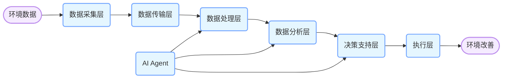

# AI Agent在智能环境保护监测中的实践

> 关键词：AI Agent、智能环境保护监测、环境数据采集、数据分析、决策支持

> 摘要：本文围绕AI Agent在智能环境保护监测中的实践展开深入探讨。首先介绍了相关背景，包括目的、预期读者等内容。接着阐述了AI Agent及智能环境保护监测的核心概念与联系，给出了原理和架构的示意图与流程图。详细讲解了核心算法原理及操作步骤，结合Python代码进行说明。对涉及的数学模型和公式进行了详细讲解并举例。通过项目实战展示了代码实现及解读。分析了AI Agent在智能环境保护监测中的实际应用场景，推荐了相关学习资源、开发工具框架和论文著作。最后总结了未来发展趋势与挑战，解答了常见问题并提供扩展阅读和参考资料，旨在为推动AI Agent在环保监测领域的应用提供全面的技术指导。

## 1. 背景介绍 
### 1.1 目的和范围
随着全球环境问题的日益严峻，对环境进行高效、精准的监测变得至关重要。传统的环境监测方法存在数据采集不及时、分析效率低等问题。AI Agent作为一种具有自主学习和决策能力的智能体，能够在智能环境保护监测中发挥重要作用。本文的目的在于探讨AI Agent在智能环境保护监测中的具体实践，包括核心概念、算法原理、实际应用等方面，为相关领域的研究和实践提供参考。范围涵盖了从环境数据的采集到数据分析、决策支持等整个智能环境保护监测的流程。

### 1.2 预期读者
本文预期读者包括环境科学研究人员、人工智能领域的开发者、环保监测系统的工程师以及对智能环境保护监测感兴趣的技术爱好者。对于环境科学研究人员，本文可以为他们提供新的监测手段和数据分析思路；对于人工智能开发者，能让他们了解AI Agent在环保领域的具体应用场景和需求；对于环保监测系统工程师，有助于他们改进现有的监测系统；对于技术爱好者，则能拓宽他们的知识面和视野。

### 1.3 文档结构概述
本文共分为十个部分。第一部分为背景介绍，阐述了文章的目的、预期读者和文档结构概述等内容。第二部分介绍核心概念与联系，包括AI Agent和智能环境保护监测的原理、架构及相关流程图。第三部分讲解核心算法原理和具体操作步骤，结合Python代码进行详细说明。第四部分分析数学模型和公式，并举例说明其应用。第五部分进行项目实战，包括开发环境搭建、源代码实现和代码解读。第六部分探讨实际应用场景。第七部分推荐相关的学习资源、开发工具框架和论文著作。第八部分总结未来发展趋势与挑战。第九部分为附录，解答常见问题。第十部分提供扩展阅读和参考资料。

### 1.4 术语表
#### 1.4.1 核心术语定义
- **AI Agent**：即人工智能智能体，是一种能够感知环境、自主学习并根据环境信息做出决策和行动的智能实体。
- **智能环境保护监测**：利用先进的信息技术和智能手段，对环境质量、污染物排放等环境相关数据进行实时采集、分析和处理，以实现对环境的有效保护和管理。
- **环境数据采集**：通过各种传感器和监测设备，收集环境中的物理、化学和生物等方面的数据。
- **数据分析**：对采集到的环境数据进行处理、挖掘和分析，以提取有价值的信息和知识。
- **决策支持**：根据数据分析的结果，为环境保护决策提供科学依据和建议。

#### 1.4.2 相关概念解释
- **传感器网络**：由大量的传感器节点组成的网络，用于实时采集环境数据。传感器节点可以分布在不同的地理位置，通过无线通信技术将数据传输到数据中心。
- **机器学习**：是一门多领域交叉学科，涉及概率论、统计学、逼近论、凸分析、算法复杂度理论等多门学科。它专门研究计算机怎样模拟或实现人类的学习行为，以获取新的知识或技能，重新组织已有的知识结构使之不断改善自身的性能。在智能环境保护监测中，机器学习可以用于数据分析和预测。
- **深度学习**：是机器学习的一个分支领域，它是一种基于对数据进行表征学习的方法。深度学习通过构建具有很多层的神经网络模型，自动从大量的数据中学习到复杂的特征和模式。在环境监测中，深度学习可以用于图像识别、语音识别等方面，例如对环境中的污染物图像进行识别。

#### 1.4.3 缩略词列表
- **AI**：Artificial Intelligence，人工智能
- **IoT**：Internet of Things，物联网
- **ML**：Machine Learning，机器学习
- **DL**：Deep Learning，深度学习

## 2. 核心概念与联系 

### 核心概念原理
#### AI Agent原理
AI Agent是一个具有自主性、反应性、社会性和主动性的智能实体。它能够通过传感器感知环境中的信息，将这些信息输入到自身的决策模块中。决策模块根据预设的规则、学习到的知识和算法，对输入的信息进行处理和分析，然后生成相应的行动指令。最后，通过执行器将行动指令作用于环境中。例如，在智能环境保护监测中，AI Agent可以通过传感器感知空气质量数据，根据数据分析判断空气质量是否达标，如果不达标则发出警报或采取相应的治理措施。

#### 智能环境保护监测原理
智能环境保护监测主要基于物联网技术和数据分析技术。通过在环境中部署各种传感器，如空气质量传感器、水质传感器、噪声传感器等，实时采集环境数据。这些数据通过网络传输到数据中心，在数据中心进行存储和预处理。然后，利用机器学习、深度学习等数据分析技术对预处理后的数据进行分析和挖掘，提取环境变化的规律和趋势。最后，根据分析结果为环境保护决策提供支持，如制定污染治理方案、调整环境监测策略等。

### 架构示意图


### 架构解释
- **数据采集层**：主要负责通过各种传感器采集环境数据，包括空气质量、水质、噪声等方面的数据。
- **数据传输层**：将采集到的环境数据通过网络传输到数据中心。可以采用有线网络或无线网络，如以太网、Wi-Fi、ZigBee等。
- **数据处理层**：对传输过来的原始数据进行清洗、转换和存储等预处理操作，以提高数据的质量和可用性。
- **数据分析层**：利用机器学习、深度学习等算法对预处理后的数据进行分析和挖掘，提取环境变化的规律和趋势。
- **决策支持层**：根据数据分析的结果，为环境保护决策提供科学依据和建议，如制定污染治理方案、调整环境监测策略等。
- **执行层**：根据决策支持层的指令，采取相应的行动，如启动污染治理设备、调整工业生产排放等，以实现环境的改善。
- **AI Agent**：贯穿于数据处理层、数据分析层和决策支持层，能够自主学习和决策，提高整个智能环境保护监测系统的智能化水平。

## 3. 核心算法原理 & 具体操作步骤 

### 核心算法原理 - 机器学习算法（以决策树为例）
决策树是一种常用的机器学习算法，它通过对数据进行递归划分，构建一棵类似于树状的模型。每个内部节点表示一个属性上的测试，每个分支是一个测试输出，每个叶节点是一个类别或值。在智能环境保护监测中，决策树可以用于对环境数据进行分类和预测，例如判断空气质量是否达标。

### Python代码实现决策树算法
```python
import numpy as np
from sklearn.datasets import load_iris
from sklearn.model_selection import train_test_split
from sklearn.tree import DecisionTreeClassifier
from sklearn.metrics import accuracy_score

# 加载示例数据（这里使用鸢尾花数据集，可替换为环境数据）
iris = load_iris()
X = iris.data
y = iris.target

# 划分训练集和测试集
X_train, X_test, y_train, y_test = train_test_split(X, y, test_size=0.3, random_state=42)

# 创建决策树分类器
clf = DecisionTreeClassifier()

# 训练模型
clf.fit(X_train, y_train)

# 进行预测
y_pred = clf.predict(X_test)

# 计算准确率
accuracy = accuracy_score(y_test, y_pred)
print(f"决策树模型的准确率: {accuracy}")
```

### 具体操作步骤
1. **数据准备**：收集和整理环境数据，包括各种环境指标和对应的标签（如空气质量是否达标）。对数据进行预处理，如缺失值处理、数据标准化等。
2. **模型选择**：根据具体的问题和数据特点，选择合适的机器学习算法，如决策树、支持向量机、神经网络等。
3. **模型训练**：将预处理后的数据划分为训练集和测试集，使用训练集对选择的模型进行训练。
4. **模型评估**：使用测试集对训练好的模型进行评估，计算模型的准确率、召回率、F1值等指标，评估模型的性能。
5. **模型应用**：将评估合格的模型应用到实际的智能环境保护监测中，对新的环境数据进行分类和预测。

## 4. 数学模型和公式 & 详细讲解 & 举例说明 

### 决策树的信息熵公式
在决策树算法中，常用信息熵来衡量数据的纯度。信息熵的计算公式为：
$$H(X)=-\sum_{i=1}^{n}p(x_i)\log_2p(x_i)$$
其中，$X$ 是一个随机变量，$p(x_i)$ 是 $X$ 取值为 $x_i$ 的概率，$n$ 是 $X$ 可能取值的个数。

### 详细讲解
信息熵表示数据的不确定性或混乱程度。当数据的纯度越高时，信息熵越小；当数据的纯度越低时，信息熵越大。在决策树的构建过程中，我们希望通过选择合适的属性进行划分，使得划分后的子集的信息熵尽可能小，即数据的纯度尽可能高。

### 举例说明
假设有一个数据集，包含 10 个样本，其中 6 个样本属于类别 A，4 个样本属于类别 B。则该数据集的信息熵为：
$$H(X)=-\left(\frac{6}{10}\log_2\frac{6}{10}+\frac{4}{10}\log_2\frac{4}{10}\right)$$
```python
import numpy as np

p_a = 6 / 10
p_b = 4 / 10
entropy = - (p_a * np.log2(p_a) + p_b * np.log2(p_b))
print(f"数据集的信息熵: {entropy}")
```

### 决策树的信息增益公式
信息增益是指在使用某个属性进行划分后，数据集的信息熵减少的程度。信息增益的计算公式为：
$$IG(X,A)=H(X)-\sum_{v\in Values(A)}\frac{|S_v|}{|S|}H(S_v)$$
其中，$IG(X,A)$ 表示使用属性 $A$ 对数据集 $X$ 进行划分的信息增益，$H(X)$ 是数据集 $X$ 的信息熵，$Values(A)$ 是属性 $A$ 的所有可能取值，$S_v$ 是属性 $A$ 取值为 $v$ 时的子集，$|S_v|$ 是子集 $S_v$ 的样本数量，$|S|$ 是数据集 $X$ 的样本数量。

### 详细讲解
信息增益越大，说明使用该属性进行划分后，数据集的纯度提高得越多。在决策树的构建过程中，我们通常选择信息增益最大的属性作为当前节点的划分属性。

### 举例说明
假设有一个数据集 $S$，包含 10 个样本，根据属性 $A$ 进行划分后，得到两个子集 $S_1$ 和 $S_2$，其中 $S_1$ 包含 6 个样本，$S_2$ 包含 4 个样本。$S_1$ 的信息熵为 $H(S_1)=0.9$，$S_2$ 的信息熵为 $H(S_2)=0.8$，数据集 $S$ 的信息熵为 $H(S)=1.0$。则使用属性 $A$ 进行划分的信息增益为：
$$IG(S,A)=1.0-\left(\frac{6}{10}\times0.9+\frac{4}{10}\times0.8\right)$$
```python
H_S = 1.0
H_S1 = 0.9
H_S2 = 0.8
|S1| = 6
|S2| = 4
|S| = 10
IG = H_S - ((|S1| / |S|) * H_S1 + (|S2| / |S|) * H_S2)
print(f"使用属性 A 进行划分的信息增益: {IG}")
```

## 5. 项目实战：代码实际案例和详细解释说明 

### 5.1  开发环境搭建
#### 硬件环境
- **服务器**：可以选择一台性能较好的服务器，如阿里云、腾讯云等云服务器，或者使用本地的台式机作为服务器。服务器的配置建议为：CPU 为 Intel Core i7 及以上，内存为 16GB 及以上，硬盘容量为 500GB 及以上。
- **传感器**：根据实际需求选择合适的传感器，如空气质量传感器、水质传感器、噪声传感器等。传感器的品牌和型号可以根据具体的监测要求和预算进行选择。

#### 软件环境
- **操作系统**：可以选择 Linux 操作系统，如 Ubuntu、CentOS 等，也可以选择 Windows 操作系统。
- **编程语言**：使用 Python 作为主要的编程语言，Python 具有丰富的库和工具，适合进行数据分析和机器学习。
- **开发框架**：使用 Flask 作为 Web 开发框架，用于搭建数据采集和展示的 Web 应用。使用 Scikit-learn 作为机器学习框架，用于实现决策树等机器学习算法。

### 5.2  源代码详细实现和代码解读
#### 数据采集模块
```python
import serial
import time

# 配置串口通信
ser = serial.Serial('/dev/ttyUSB0', 9600)  # 根据实际情况修改串口设备和波特率

def collect_data():
    while True:
        try:
            # 读取传感器数据
            data = ser.readline().decode().strip()
            print(f"采集到的数据: {data}")
            # 可以将数据存储到数据库或文件中
            with open('data.txt', 'a') as f:
                f.write(data + '\n')
            time.sleep(1)
        except Exception as e:
            print(f"数据采集出错: {e}")

if __name__ == "__main__":
    collect_data()
```
**代码解读**：该代码实现了通过串口通信采集传感器数据的功能。首先，使用 `serial.Serial` 函数配置串口设备和波特率。然后，在 `collect_data` 函数中，使用 `ser.readline()` 函数读取传感器数据，并将其解码和去除首尾空格。最后，将数据打印输出并存储到文件中。

#### 数据分析模块
```python
import pandas as pd
from sklearn.tree import DecisionTreeClassifier
from sklearn.model_selection import train_test_split
from sklearn.metrics import accuracy_score

# 读取数据
data = pd.read_csv('data.txt', header=None)

# 假设最后一列是标签，其余列是特征
X = data.iloc[:, :-1]
y = data.iloc[:, -1]

# 划分训练集和测试集
X_train, X_test, y_train, y_test = train_test_split(X, y, test_size=0.3, random_state=42)

# 创建决策树分类器
clf = DecisionTreeClassifier()

# 训练模型
clf.fit(X_train, y_train)

# 进行预测
y_pred = clf.predict(X_test)

# 计算准确率
accuracy = accuracy_score(y_test, y_pred)
print(f"决策树模型的准确率: {accuracy}")
```
**代码解读**：该代码实现了对采集到的环境数据进行分析和预测的功能。首先，使用 `pandas` 库的 `read_csv` 函数读取存储在文件中的数据。然后，将数据划分为特征和标签，并使用 `train_test_split` 函数将数据划分为训练集和测试集。接着，创建决策树分类器并使用训练集进行训练。最后，使用测试集进行预测，并计算模型的准确率。

#### 决策支持模块
```python
def decision_support(data):
    # 加载训练好的模型
    import joblib
    clf = joblib.load('model.pkl')
    
    # 进行预测
    prediction = clf.predict([data])
    
    if prediction[0] == 1:
        print("环境质量达标，无需采取特殊措施。")
    else:
        print("环境质量不达标，建议采取污染治理措施。")

if __name__ == "__main__":
    # 假设输入的新数据
    new_data = [1, 2, 3, 4]
    decision_support(new_data)
```
**代码解读**：该代码实现了根据训练好的模型对新的环境数据进行决策支持的功能。首先，使用 `joblib` 库加载训练好的模型。然后，使用模型对输入的新数据进行预测。最后，根据预测结果输出相应的决策建议。

### 5.3  代码解读与分析
#### 数据采集模块
该模块通过串口通信与传感器进行交互，实时采集环境数据。使用 `serial.Serial` 函数配置串口设备和波特率，确保与传感器的正常通信。使用 `ser.readline()` 函数读取传感器数据，并将其存储到文件中。在实际应用中，可以根据需要将数据存储到数据库中，以便后续的数据分析和处理。

#### 数据分析模块
该模块使用 `pandas` 库读取存储在文件中的数据，并使用 `scikit-learn` 库实现决策树算法。将数据划分为训练集和测试集，使用训练集对决策树模型进行训练，使用测试集对模型进行评估。通过计算模型的准确率，可以评估模型的性能。在实际应用中，可以根据需要选择不同的机器学习算法，如支持向量机、神经网络等，以提高模型的性能。

#### 决策支持模块
该模块使用 `joblib` 库加载训练好的模型，并对新的环境数据进行预测。根据预测结果输出相应的决策建议。在实际应用中，可以将决策建议发送到相关的设备或人员，以便及时采取措施。

## 6. 实际应用场景 
### 空气质量监测
AI Agent可以通过部署在城市各个区域的空气质量传感器，实时采集空气质量数据，包括 PM2.5、PM10、二氧化硫、氮氧化物等污染物的浓度。然后，利用机器学习算法对这些数据进行分析和预测，判断空气质量是否达标。如果空气质量不达标，AI Agent可以及时发出警报，并提供相应的治理建议，如调整工业生产排放、加强交通管制等。

### 水质监测
在水质监测方面，AI Agent可以通过安装在河流、湖泊、水库等水域的水质传感器，实时采集水质数据，包括酸碱度、溶解氧、化学需氧量等指标。通过对这些数据的分析，AI Agent可以及时发现水质污染问题，并预测水质变化趋势。同时，AI Agent可以根据分析结果制定相应的治理方案，如调整污水处理工艺、加强水资源保护等。

### 噪声监测
AI Agent可以在城市的商业区、居民区、工业区等不同区域部署噪声传感器，实时监测噪声水平。通过对噪声数据的分析，AI Agent可以判断噪声是否超标，并找出噪声源。如果噪声超标，AI Agent可以发出警报，并提供相应的降噪措施，如加强隔音设施建设、限制车辆鸣笛等。

### 生态环境监测
对于森林、草原、湿地等生态环境，AI Agent可以通过卫星遥感、无人机监测等手段，实时采集生态环境数据，包括植被覆盖度、土地利用变化、野生动物数量等。通过对这些数据的分析，AI Agent可以评估生态环境的健康状况，预测生态环境的变化趋势。同时，AI Agent可以根据分析结果制定相应的生态保护措施，如加强森林保护、恢复湿地生态等。

## 7. 工具和资源推荐
### 7.1 学习资源推荐
#### 7.1.1 书籍推荐
- 《机器学习》（周志华）：本书是机器学习领域的经典教材，系统地介绍了机器学习的基本概念、算法和应用。
- 《深度学习》（Ian Goodfellow、Yoshua Bengio、Aaron Courville）：本书是深度学习领域的权威著作，全面介绍了深度学习的理论和实践。
- 《Python 数据分析实战》（Sebastian Raschka）：本书结合实际案例，介绍了如何使用 Python 进行数据分析和处理。

#### 7.1.2 在线课程
- Coursera 上的“机器学习”课程（Andrew Ng 教授）：该课程是机器学习领域的经典在线课程，由斯坦福大学的 Andrew Ng 教授授课，内容涵盖了机器学习的基本概念、算法和应用。
- edX 上的“深度学习”课程（麻省理工学院）：该课程由麻省理工学院开设，介绍了深度学习的理论和实践，包括神经网络、卷积神经网络、循环神经网络等。
- 阿里云大学上的“人工智能基础课程”：该课程由阿里云大学开设，介绍了人工智能的基本概念、算法和应用，适合初学者学习。

#### 7.1.3 技术博客和网站
- 博客园：博客园是一个技术博客平台，有很多关于人工智能、机器学习、数据分析等领域的技术文章。
- 开源中国：开源中国是一个开源技术社区，提供了丰富的开源项目和技术文章，包括人工智能、机器学习等领域。
- Kaggle：Kaggle 是一个数据科学竞赛平台，提供了大量的数据集和竞赛项目，可以帮助学习者提高数据分析和机器学习的能力。

### 7.2 开发工具框架推荐
#### 7.2.1 IDE和编辑器
- PyCharm：PyCharm 是一款专门为 Python 开发设计的集成开发环境，具有代码编辑、调试、代码分析等功能。
- Jupyter Notebook：Jupyter Notebook 是一个基于 Web 的交互式计算环境，支持 Python、R 等多种编程语言，适合进行数据分析和机器学习实验。
- Visual Studio Code：Visual Studio Code 是一款轻量级的代码编辑器，支持多种编程语言，具有丰富的插件和扩展功能。

#### 7.2.2 调试和性能分析工具
- Py-Spy：Py-Spy 是一个用于 Python 程序的性能分析工具，可以实时监测 Python 程序的 CPU 使用率、内存使用率等指标。
- cProfile：cProfile 是 Python 标准库中的一个性能分析工具，可以分析 Python 程序的函数调用时间和次数。
- TensorBoard：TensorBoard 是 TensorFlow 提供的一个可视化工具，可以用于可视化深度学习模型的训练过程和性能指标。

#### 7.2.3 相关框架和库
- Scikit-learn：Scikit-learn 是一个用于机器学习的 Python 库，提供了丰富的机器学习算法和工具，如分类、回归、聚类等。
- TensorFlow：TensorFlow 是一个开源的深度学习框架，由 Google 开发，支持多种深度学习模型的构建和训练。
- PyTorch：PyTorch 是一个开源的深度学习框架，由 Facebook 开发，具有动态图和静态图两种模式，适合进行深度学习研究和开发。

### 7.3 相关论文著作推荐
#### 7.3.1 经典论文
- “A Decision-Theoretic Generalization of On-Line Learning and an Application to Boosting”（Yoav Freund、Robert E. Schapire）：该论文提出了 AdaBoost 算法，是机器学习领域的经典论文之一。
- “Gradient-Based Learning Applied to Document Recognition”（Yann LeCun、Léon Bottou、Yoshua Bengio、Patrick Haffner）：该论文介绍了卷积神经网络（CNN）在手写数字识别中的应用，是深度学习领域的经典论文之一。
- “Long Short-Term Memory”（Sepp Hochreiter、Jürgen Schmidhuber）：该论文提出了长短期记忆网络（LSTM），是循环神经网络（RNN）的一种改进模型，在自然语言处理等领域有广泛的应用。

#### 7.3.2 最新研究成果
- 可以关注国际顶级学术会议，如 NeurIPS（神经信息处理系统大会）、ICML（国际机器学习会议）、CVPR（计算机视觉与模式识别会议）等，这些会议上会发布人工智能领域的最新研究成果。
- 可以关注顶级学术期刊，如 Journal of Artificial Intelligence Research（JAIR）、Artificial Intelligence（AI）等，这些期刊上会发表人工智能领域的高质量研究论文。

#### 7.3.3 应用案例分析
- 《人工智能在环境保护中的应用案例集》：该案例集收集了人工智能在环境保护领域的各种应用案例，包括空气质量监测、水质监测、生态环境监测等方面。
- 可以关注相关的行业报告和研究机构发布的案例分析，了解人工智能在智能环境保护监测中的实际应用情况。

## 8. 总结：未来发展趋势与挑战
### 未来发展趋势
#### 多传感器融合
未来，AI Agent在智能环境保护监测中将更多地采用多传感器融合技术。通过将空气质量传感器、水质传感器、噪声传感器、卫星遥感等多种传感器的数据进行融合，可以获取更全面、准确的环境信息，提高环境监测的精度和可靠性。

#### 智能化决策支持
随着人工智能技术的不断发展，AI Agent将具备更强的智能化决策支持能力。它可以根据实时的环境数据和历史数据，自动分析和预测环境变化趋势，并制定更加科学、合理的环境保护决策方案。同时，AI Agent还可以与其他智能系统进行协同工作，实现环境保护的智能化管理。

#### 与物联网的深度融合
AI Agent将与物联网技术进行深度融合，实现环境监测设备的智能化互联。通过物联网技术，AI Agent可以实时获取大量的环境数据，并将这些数据传输到云端进行分析和处理。同时，AI Agent还可以通过物联网技术对环境监测设备进行远程控制和管理，提高环境监测的效率和便捷性。

#### 应用领域的拓展
除了空气质量监测、水质监测、噪声监测等传统领域，AI Agent在智能环境保护监测中的应用领域将不断拓展。例如，在土壤污染监测、生物多样性监测、气候变化监测等领域，AI Agent都将发挥重要作用。

### 挑战
#### 数据质量和安全问题
在智能环境保护监测中，数据的质量和安全至关重要。由于环境数据的采集受到多种因素的影响，如传感器的精度、环境条件的变化等，数据可能存在噪声、缺失值等问题。同时，环境数据涉及到国家和公众的利益，数据的安全和隐私保护也面临着严峻的挑战。

#### 算法复杂度和计算资源需求
随着环境数据的不断增加和监测任务的不断复杂，AI Agent所使用的算法复杂度也在不断提高。这将导致计算资源的需求大幅增加，对硬件设备和云计算平台提出了更高的要求。如何在有限的计算资源下，实现高效的算法运行，是一个亟待解决的问题。

#### 模型可解释性问题
在智能环境保护监测中，AI Agent所使用的机器学习和深度学习模型往往具有较高的复杂度，模型的决策过程难以解释。这给环境保护决策的制定和执行带来了一定的困难。如何提高模型的可解释性，让决策者能够理解模型的决策依据，是一个需要解决的问题。

#### 跨学科合作问题
智能环境保护监测涉及到环境科学、人工智能、计算机科学等多个学科领域。要实现AI Agent在智能环境保护监测中的有效应用，需要不同学科领域的专家进行跨学科合作。然而，目前不同学科之间的交流和合作还存在一定的障碍，如何促进跨学科合作，是一个需要解决的问题。

## 9. 附录：常见问题与解答
### 问题1：AI Agent在智能环境保护监测中可以处理哪些类型的环境数据？
答：AI Agent可以处理多种类型的环境数据，包括空气质量数据（如 PM2.5、PM10、二氧化硫、氮氧化物等污染物的浓度）、水质数据（如酸碱度、溶解氧、化学需氧量等指标）、噪声数据、气象数据（如温度、湿度、风速、风向等）、生态环境数据（如植被覆盖度、土地利用变化、野生动物数量等）。

### 问题2：如何确保AI Agent所使用的环境数据的质量？
答：可以从以下几个方面确保环境数据的质量：
- **传感器选择**：选择精度高、可靠性好的传感器，并定期对传感器进行校准和维护。
- **数据预处理**：对采集到的原始数据进行清洗、转换和存储等预处理操作，去除噪声和缺失值，提高数据的质量。
- **数据验证**：采用多种方法对数据进行验证，如与其他数据源进行比对、使用统计方法进行异常值检测等。

### 问题3：AI Agent在智能环境保护监测中使用的机器学习算法有哪些？
答：常见的机器学习算法包括决策树、支持向量机、神经网络、随机森林、梯度提升等。不同的算法适用于不同的问题和数据特点，需要根据具体情况进行选择。

### 问题4：如何评估AI Agent在智能环境保护监测中的性能？
答：可以从以下几个方面评估AI Agent的性能：
- **准确率**：预测结果与实际情况相符的比例。
- **召回率**：实际为正例的样本中被正确预测为正例的比例。
- **F1值**：准确率和召回率的调和平均值。
- **均方误差**：用于评估回归模型的性能，表示预测值与实际值之间的平均误差。

### 问题5：AI Agent在智能环境保护监测中的应用是否会受到法律和伦理问题的限制？
答：是的，AI Agent在智能环境保护监测中的应用可能会受到法律和伦理问题的限制。例如，环境数据的采集和使用需要遵守相关的法律法规，保护数据的安全和隐私。同时，AI Agent的决策过程需要遵循伦理原则，确保决策的公正性和合理性。

## 10. 扩展阅读 & 参考资料
### 扩展阅读
- 《人工智能：一种现代的方法》（Stuart Russell、Peter Norvig）：本书是人工智能领域的经典教材，全面介绍了人工智能的基本概念、算法和应用。
- 《大数据时代：生活、工作与思维的大变革》（维克托·迈尔 - 舍恩伯格、肯尼斯·库克耶）：本书介绍了大数据的概念、特点和应用，对理解智能环境保护监测中的数据处理和分析有很大的帮助。
- 《物联网：技术、应用与标准》（王喜文）：本书介绍了物联网的基本概念、技术和应用，对理解AI Agent与物联网的融合有很大的帮助。

### 参考资料
- 相关的学术论文和研究报告，可以通过学术数据库（如知网、万方、IEEE Xplore等）进行查询。
- 相关的行业标准和规范，可以通过国家标准化管理委员会、行业协会等官方网站进行查询。
- 相关的开源项目和代码库，可以通过 GitHub、GitLab 等代码托管平台进行查询。

作者：AI天才研究院/AI Genius Institute & 禅与计算机程序设计艺术 /Zen And The Art of Computer Programming