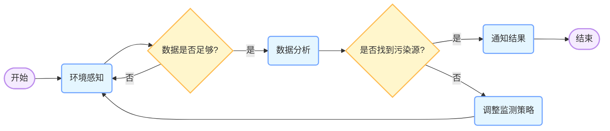

# AI Agent在智能环境污染溯源中的实践

> 关键词：AI Agent、智能环境污染溯源、多智能体系统、传感器网络、机器学习

> 摘要：本文围绕AI Agent在智能环境污染溯源中的实践展开。首先介绍了研究的背景，包括目的、预期读者、文档结构和相关术语。接着阐述了AI Agent和环境污染溯源的核心概念及联系，给出了相应的原理和架构示意图与流程图。详细讲解了用于环境污染溯源的核心算法原理，并用Python代码进行了说明。探讨了相关的数学模型和公式，并举例分析。通过项目实战，展示了代码实际案例和详细解释。介绍了AI Agent在环境污染溯源中的实际应用场景，推荐了学习资源、开发工具框架和相关论文著作。最后总结了未来发展趋势与挑战，解答了常见问题，并列出扩展阅读和参考资料，旨在为利用AI Agent进行智能环境污染溯源提供全面的技术指导和研究参考。

## 1. 背景介绍 
### 1.1 目的和范围
随着工业化和城市化的快速发展，环境污染问题日益严峻。准确、高效地溯源环境污染源对于制定有效的治理措施、保护生态环境和人类健康至关重要。本研究的目的是探讨如何利用AI Agent技术实现智能环境污染溯源，提高溯源的准确性和效率。研究范围涵盖了AI Agent的基本原理、相关算法、数学模型，以及在实际环境污染场景中的应用。

### 1.2 预期读者
本文的预期读者包括环境科学领域的研究人员、环境监测与治理的从业者、计算机科学和人工智能领域对跨学科应用感兴趣的开发者和研究者，以及关注环境保护的政策制定者和相关管理人员。

### 1.3 文档结构概述
本文首先介绍相关背景信息，让读者了解研究的目的和意义。接着阐述核心概念，包括AI Agent和环境污染溯源的原理和联系，并给出相应的示意图和流程图。然后详细讲解核心算法原理和具体操作步骤，结合Python代码进行说明。随后介绍相关的数学模型和公式，并举例分析。通过项目实战展示代码的实际应用和详细解释。接着介绍实际应用场景，推荐相关的学习资源、开发工具框架和论文著作。最后总结未来发展趋势与挑战，解答常见问题，并列出扩展阅读和参考资料。

### 1.4 术语表
#### 1.4.1 核心术语定义
- **AI Agent（人工智能智能体）**：是一种能够感知环境、根据内部状态和目标进行决策，并采取行动影响环境的软件实体或系统。它可以自主地或在一定的规则下与环境和其他智能体进行交互。
- **环境污染溯源**：指通过对环境中污染物的特征、分布和迁移规律等进行分析，确定污染物的来源、排放路径和排放时间等信息的过程。
- **多智能体系统（Multi - Agent System，MAS）**：由多个AI Agent组成的系统，这些智能体之间可以进行通信、协作和竞争，以实现共同的或各自的目标。
- **传感器网络**：由大量分布在监测区域内的传感器节点组成的网络，用于实时采集环境数据，如污染物浓度、气象参数等。

#### 1.4.2 相关概念解释
- **自主决策**：AI Agent能够根据自身的感知信息和预设的目标，独立地做出决策，选择合适的行动方案。
- **环境感知**：AI Agent通过各种传感器或其他信息渠道获取环境的状态和变化信息。
- **协作机制**：在多智能体系统中，智能体之间通过一定的协议和规则进行合作，共同完成复杂的任务，如环境污染溯源。

#### 1.4.3 缩略词列表
- **AI**：Artificial Intelligence（人工智能）
- **MAS**：Multi - Agent System（多智能体系统）
- **IoT**：Internet of Things（物联网）

## 2. 核心概念与联系 

### 2.1 AI Agent的原理
AI Agent通常由感知模块、决策模块和行动模块组成。感知模块负责收集环境信息，如通过传感器获取污染物浓度、温度、湿度等数据。决策模块根据感知到的信息和预设的目标，运用算法进行推理和决策，确定下一步的行动。行动模块则根据决策结果采取相应的行动，如调整监测策略、向其他智能体发送信息等。

### 2.2 环境污染溯源的原理
环境污染溯源主要基于污染物在环境中的迁移和扩散规律。通过对环境中不同位置的污染物浓度进行监测和分析，结合气象条件、地形地貌等因素，建立污染物迁移模型，从而推断污染物的来源。

### 2.3 两者的联系
AI Agent可以应用于环境污染溯源的各个环节。例如，AI Agent可以作为传感器节点的智能控制器，自主调整监测频率和范围；多个AI Agent可以组成多智能体系统，协作完成数据的收集、分析和溯源任务。通过智能决策和协作，提高环境污染溯源的准确性和效率。

### 2.4 原理和架构的文本示意图
```plaintext
              +----------------+
              |  环境 (污染)    |
              +----------------+
                    |
                    |  感知
                    v
+-------------------+-------------------+
|        AI Agent 1         |        AI Agent 2         |
|  (传感器节点智能体)      |  (数据分析智能体)        |
|  - 感知模块             |  - 接收数据               |
|  - 决策模块             |  - 分析数据               |
|  - 行动模块 (调整监测)  |  - 决策模块 (溯源判断)    |
|                        |  - 行动模块 (通知结果)    |
+-------------------+-------------------+
                    |
                    |  通信
                    v
+-------------------+
|    多智能体系统     |
|  - 协作机制        |
|  - 信息共享        |
+-------------------+
```

### 2.5 Mermaid流程图


## 3. 核心算法原理 & 具体操作步骤 

### 3.1 核心算法原理 - 基于机器学习的溯源算法
在环境污染溯源中，我们可以使用机器学习算法，如决策树、支持向量机等，根据传感器收集到的数据来推断污染源的位置和特征。以决策树算法为例，其基本原理是通过对训练数据的学习，构建一棵决策树，树的每个内部节点是一个属性上的测试，每个分支是一个测试输出，每个叶节点是一个类别或值。

### 3.2 具体操作步骤
1. **数据收集**：通过传感器网络收集环境数据，包括污染物浓度、气象参数等。
2. **数据预处理**：对收集到的数据进行清洗、归一化等处理，以提高数据质量。
3. **特征选择**：从预处理后的数据中选择与溯源相关的特征，如污染物浓度的时空分布特征。
4. **模型训练**：使用选择的特征和标注好的训练数据对决策树模型进行训练。
5. **模型评估**：使用测试数据对训练好的模型进行评估，计算准确率、召回率等指标。
6. **溯源推断**：使用训练好的模型对新的环境数据进行分析，推断污染源的位置和特征。

### 3.3 Python源代码实现
```python
import pandas as pd
from sklearn.model_selection import train_test_split
from sklearn.tree import DecisionTreeClassifier
from sklearn.metrics import accuracy_score

# 1. 数据收集和预处理
# 假设数据存储在一个CSV文件中
data = pd.read_csv('pollution_data.csv')
# 分离特征和标签
X = data.drop('source', axis=1)
y = data['source']

# 2. 数据预处理
# 这里可以进行更复杂的预处理，如归一化等
# 简单示例：假设数据已经清洗好

# 3. 特征选择
# 这里简单选择所有特征，实际应用中可以根据相关性等方法选择
selected_features = X.columns

# 4. 模型训练
# 划分训练集和测试集
X_train, X_test, y_train, y_test = train_test_split(X[selected_features], y, test_size=0.2, random_state=42)
# 创建决策树分类器
clf = DecisionTreeClassifier()
# 训练模型
clf.fit(X_train, y_train)

# 5. 模型评估
# 预测测试集
y_pred = clf.predict(X_test)
# 计算准确率
accuracy = accuracy_score(y_test, y_pred)
print(f"模型准确率: {accuracy}")

# 6. 溯源推断
# 假设新的数据
new_data = pd.DataFrame({
    'feature1': [1.2],
    'feature2': [2.3],
    # 其他特征...
})
# 进行预测
predicted_source = clf.predict(new_data)
print(f"预测的污染源: {predicted_source}")
```

## 4. 数学模型和公式 & 详细讲解 & 举例说明 

### 4.1 污染物扩散模型 - 高斯烟羽模型
高斯烟羽模型是一种常用的大气污染物扩散模型，其基本假设是污染物在大气中呈正态分布扩散。模型公式如下：

$$
C(x,y,z)=\frac{Q}{2\pi u\sigma_y\sigma_z}\exp\left(-\frac{y^2}{2\sigma_y^2}\right)\left[\exp\left(-\frac{(z - H)^2}{2\sigma_z^2}\right)+\exp\left(-\frac{(z + H)^2}{2\sigma_z^2}\right)\right]
$$

其中：
- $C(x,y,z)$ 是在空间点 $(x,y,z)$ 处的污染物浓度；
- $Q$ 是污染源的排放速率；
- $u$ 是平均风速；
- $\sigma_y$ 和 $\sigma_z$ 分别是水平和垂直方向的扩散参数；
- $H$ 是有效源高。

### 4.2 详细讲解
- **扩散参数 $\sigma_y$ 和 $\sigma_z$**：它们与大气稳定度和距离污染源的距离有关。一般来说，大气越不稳定，扩散参数越大，污染物扩散得越快。
- **有效源高 $H$**：包括实际源高和烟气抬升高度。烟气抬升高度受排放速度、烟气温度等因素影响。

### 4.3 举例说明
假设一个工厂以 $Q = 10\ g/s$ 的速率排放污染物，平均风速 $u = 2\ m/s$，有效源高 $H = 50\ m$。在距离工厂 $x = 1000\ m$，水平方向 $y = 50\ m$，垂直方向 $z = 10\ m$ 处，根据大气稳定度查得 $\sigma_y = 50\ m$，$\sigma_z = 30\ m$。

将这些值代入高斯烟羽模型公式：

$$
\begin{align*}
C(1000,50,10)&=\frac{10}{2\pi\times2\times50\times30}\exp\left(-\frac{50^2}{2\times50^2}\right)\left[\exp\left(-\frac{(10 - 50)^2}{2\times30^2}\right)+\exp\left(-\frac{(10 + 50)^2}{2\times30^2}\right)\right]\\
&=\frac{10}{6000\pi}\exp\left(-\frac{1}{2}\right)\left[\exp\left(-\frac{1600}{1800}\right)+\exp\left(-\frac{3600}{1800}\right)\right]\\
&\approx 0.00053\times0.6065\times(0.4111 + 0.1353)\\
&\approx 0.00053\times0.6065\times0.5464\\
&\approx 0.00017\ g/m^3
\end{align*}
$$

因此，在该点处的污染物浓度约为 $0.00017\ g/m^3$。

## 5. 项目实战：代码实际案例和详细解释说明 

### 5.1  开发环境搭建
1. **安装Python**：建议使用Python 3.7及以上版本。可以从Python官方网站（https://www.python.org/downloads/）下载并安装。
2. **安装必要的库**：使用`pip`命令安装所需的库，如`pandas`、`scikit-learn`等。
```bash
pip install pandas scikit-learn
```
3. **准备数据**：收集或模拟环境污染相关的数据，并保存为CSV文件，如`pollution_data.csv`。

### 5.2  源代码详细实现和代码解读
```python
import pandas as pd
from sklearn.model_selection import train_test_split
from sklearn.tree import DecisionTreeClassifier
from sklearn.metrics import accuracy_score

# 1. 数据收集和预处理
# 假设数据存储在一个CSV文件中
data = pd.read_csv('pollution_data.csv')
# 分离特征和标签
X = data.drop('source', axis=1)
y = data['source']
```
- 代码解释：首先导入所需的库，然后使用`pandas`的`read_csv`函数读取CSV文件中的数据。将数据分为特征矩阵`X`和标签向量`y`，其中`source`列是标签，表示污染源。

```python
# 2. 数据预处理
# 这里可以进行更复杂的预处理，如归一化等
# 简单示例：假设数据已经清洗好
```
- 代码解释：在实际应用中，数据可能存在缺失值、异常值等问题，需要进行清洗和归一化等处理。这里简单假设数据已经处理好。

```python
# 3. 特征选择
# 这里简单选择所有特征，实际应用中可以根据相关性等方法选择
selected_features = X.columns
```
- 代码解释：特征选择是为了减少数据的维度，提高模型的效率和准确性。这里简单选择所有特征，实际应用中可以使用相关性分析、特征重要性排序等方法选择更有代表性的特征。

```python
# 4. 模型训练
# 划分训练集和测试集
X_train, X_test, y_train, y_test = train_test_split(X[selected_features], y, test_size=0.2, random_state=42)
# 创建决策树分类器
clf = DecisionTreeClassifier()
# 训练模型
clf.fit(X_train, y_train)
```
- 代码解释：使用`train_test_split`函数将数据划分为训练集和测试集，其中测试集占比为20%。创建一个决策树分类器`clf`，并使用训练集数据对其进行训练。

```python
# 5. 模型评估
# 预测测试集
y_pred = clf.predict(X_test)
# 计算准确率
accuracy = accuracy_score(y_test, y_pred)
print(f"模型准确率: {accuracy}")
```
- 代码解释：使用训练好的模型对测试集进行预测，得到预测结果`y_pred`。使用`accuracy_score`函数计算模型的准确率，并打印输出。

```python
# 6. 溯源推断
# 假设新的数据
new_data = pd.DataFrame({
    'feature1': [1.2],
    'feature2': [2.3],
    # 其他特征...
})
# 进行预测
predicted_source = clf.predict(new_data)
print(f"预测的污染源: {predicted_source}")
```
- 代码解释：创建一个新的数据集`new_data`，表示需要进行溯源推断的新数据。使用训练好的模型对新数据进行预测，得到预测的污染源，并打印输出。

### 5.3  代码解读与分析
- **优点**：使用决策树算法进行环境污染溯源具有模型简单、易于理解和解释的优点。同时，通过机器学习的方法可以自动从数据中学习到污染源与环境特征之间的关系，提高溯源的准确性。
- **局限性**：决策树算法容易过拟合，尤其是在数据量较小或特征维度较高的情况下。此外，模型的性能依赖于数据的质量和代表性，如果数据存在偏差或噪声，可能会影响溯源的准确性。

## 6. 实际应用场景 
### 6.1 大气污染溯源
在城市或工业区，AI Agent可以与空气质量监测站、气象传感器等设备结合，实时收集大气污染物浓度、气象参数等数据。通过多智能体系统的协作，分析污染物的扩散路径和来源，帮助环保部门快速定位污染源，采取有效的治理措施。例如，当某个区域的PM2.5浓度突然升高时，AI Agent可以根据周边监测点的数据和气象条件，推断可能的污染源，如工厂排放、交通尾气等。

### 6.2 水污染溯源
在河流、湖泊等水域，AI Agent可以部署在水质监测传感器节点上，实时监测水质参数，如酸碱度、溶解氧、重金属含量等。当检测到水质异常时，AI Agent可以分析周边的污染源信息，如工业废水排放口、污水处理厂等，结合水流动力学模型，推断污染物的来源和扩散范围。例如，在一条河流中检测到重金属超标，AI Agent可以通过分析上下游监测点的数据和周边工厂的排放情况，确定污染源的位置。

### 6.3 土壤污染溯源
对于土壤污染，AI Agent可以与土壤采样设备和地理信息系统（GIS）结合，收集土壤中的污染物含量、土壤类型、地形地貌等信息。通过多智能体系统的协作，分析污染物的分布特征和迁移规律，推断污染源的位置和类型。例如，在一个农业区域发现土壤中农药残留超标，AI Agent可以分析周边农田的农药使用情况、灌溉水源等信息，确定可能的污染源。

## 7. 工具和资源推荐
### 7.1 学习资源推荐
#### 7.1.1 书籍推荐
- 《人工智能：一种现代的方法》（Artificial Intelligence: A Modern Approach）：这是一本经典的人工智能教材，涵盖了AI Agent、机器学习、搜索算法等多个方面的内容，适合初学者和有一定基础的开发者阅读。
- 《环境科学概论》：介绍了环境科学的基本概念、原理和方法，包括环境污染的形成、监测和治理等内容，有助于了解环境污染溯源的背景知识。
- 《Python机器学习实战》：详细介绍了Python在机器学习中的应用，包括数据预处理、模型训练和评估等方面的内容，适合学习使用Python进行环境污染溯源建模的开发者。

#### 7.1.2 在线课程
- Coursera上的“人工智能基础”课程：由知名高校的教授授课，系统地介绍了人工智能的基本概念和方法，包括AI Agent的原理和应用。
- edX上的“环境数据科学”课程：结合实际案例，介绍了如何使用数据分析和机器学习方法解决环境问题，如环境污染溯源。
- 中国大学MOOC上的“Python语言程序设计”课程：适合初学者学习Python编程，为后续使用Python进行环境污染溯源项目开发打下基础。

#### 7.1.3 技术博客和网站
- Medium：上面有很多关于人工智能和环境科学的技术博客文章，涵盖了最新的研究成果和应用案例。
- 开源中国：提供了丰富的技术文章和开源项目，对于学习和实践环境污染溯源相关的技术有很大的帮助。
- 国际环境科学协会（ISES）官网：发布了环境科学领域的最新研究动态和学术成果，有助于了解环境污染溯源的前沿技术。

### 7.2 开发工具框架推荐
#### 7.2.1 IDE和编辑器
- PyCharm：是一款专门为Python开发设计的集成开发环境（IDE），具有代码自动补全、调试、版本控制等功能，适合开发复杂的环境污染溯源项目。
- Jupyter Notebook：是一个交互式的开发环境，支持Python代码的编写、运行和可视化，适合进行数据分析和模型实验。
- Visual Studio Code：是一款轻量级的代码编辑器，支持多种编程语言和插件扩展，对于快速开发和调试环境污染溯源代码非常方便。

#### 7.2.2 调试和性能分析工具
- pdb：Python自带的调试工具，可以帮助开发者在代码中设置断点、查看变量值等，进行代码调试。
- cProfile：Python的性能分析工具，可以分析代码的运行时间和函数调用情况，帮助开发者优化代码性能。
- TensorBoard：是TensorFlow的可视化工具，也可以用于其他机器学习框架，用于可视化模型训练过程和性能指标。

#### 7.2.3 相关框架和库
- Scikit-learn：是一个常用的机器学习库，提供了丰富的机器学习算法和工具，如决策树、支持向量机、神经网络等，适合用于环境污染溯源的模型训练和评估。
- Pandas：是一个用于数据处理和分析的Python库，提供了高效的数据结构和数据操作方法，适合处理和清洗环境污染相关的数据。
- GeoPandas：是基于Pandas的地理数据处理库，支持地理数据的读取、分析和可视化，适合结合地理信息系统进行环境污染溯源分析。

### 7.3 相关论文著作推荐
#### 7.3.1 经典论文
- “Agent - Based Modeling and Simulation: A Tutorial”：介绍了基于智能体的建模和仿真方法，对于理解AI Agent在环境污染溯源中的应用原理有很大的帮助。
- “A Review of Air Pollution Source Apportionment Techniques”：对大气污染溯源技术进行了全面的综述，分析了各种溯源方法的优缺点和适用场景。
- “Water Pollution Source Identification Using Machine Learning Techniques”：探讨了如何使用机器学习技术进行水污染溯源，提供了一些实用的方法和案例。

#### 7.3.2 最新研究成果
- 在IEEE Transactions on Environmental Engineering、Environmental Science & Technology等期刊上搜索关于AI Agent和环境污染溯源的最新研究论文，了解该领域的前沿技术和发展趋势。
- 参加国际环境科学会议和人工智能会议，如ACM SIGKDD Conference on Knowledge Discovery and Data Mining、International Conference on Environmental Science and Technology等，获取最新的研究成果和学术动态。

#### 7.3.3 应用案例分析
- 一些环保部门和科研机构发布的关于环境污染溯源的项目报告和案例分析，如美国环境保护署（EPA）的相关报告，详细介绍了在实际项目中如何使用AI Agent和其他技术进行环境污染溯源。
- 一些企业的技术博客和开源项目，分享了他们在环境污染监测和溯源方面的实践经验和案例，如谷歌、微软等公司的相关项目。

## 8. 总结：未来发展趋势与挑战
### 8.1 未来发展趋势
- **多学科融合**：AI Agent在环境污染溯源中的应用将越来越多地与环境科学、地理学、气象学等学科进行融合，综合考虑多种因素，提高溯源的准确性和可靠性。
- **智能化和自动化**：随着人工智能技术的不断发展，AI Agent将更加智能化和自动化，能够自主地调整监测策略、优化溯源算法，减少人工干预。
- **大数据和云计算**：利用大数据和云计算技术，可以处理和存储海量的环境监测数据，提高数据的分析和处理能力，为环境污染溯源提供更强大的支持。
- **物联网和传感器技术的发展**：物联网和传感器技术的不断进步将使得环境监测更加全面、实时和精准，为AI Agent提供更丰富的数据源，进一步提升环境污染溯源的效果。

### 8.2 挑战
- **数据质量和共享问题**：环境监测数据的质量参差不齐，存在缺失值、异常值等问题，同时不同部门和机构之间的数据共享困难，影响了AI Agent的训练和溯源的准确性。
- **算法的可解释性**：一些复杂的机器学习算法，如深度学习算法，虽然在性能上表现较好，但缺乏可解释性，难以让环保部门和决策者理解溯源结果的依据。
- **安全和隐私问题**：环境监测数据涉及到企业和个人的敏感信息，如何保障数据的安全和隐私，防止数据泄露和滥用，是一个需要解决的重要问题。
- **模型的泛化能力**：不同地区的环境特征和污染源分布存在差异，如何提高AI Agent模型的泛化能力，使其在不同的环境场景中都能准确地进行溯源，是一个挑战。

## 9. 附录：常见问题与解答
### 9.1 如何选择合适的AI Agent算法进行环境污染溯源？
选择合适的AI Agent算法需要考虑多个因素，如数据的特点、溯源的精度要求、计算资源等。如果数据量较小且特征维度较低，可以选择简单的机器学习算法，如决策树、朴素贝叶斯等；如果数据量较大且具有复杂的非线性关系，可以考虑使用深度学习算法，如神经网络。同时，还可以通过交叉验证等方法比较不同算法的性能，选择最优的算法。

### 9.2 如何处理环境监测数据中的缺失值和异常值？
处理缺失值的方法有很多种，如删除含有缺失值的记录、使用均值、中位数等统计量填充缺失值、使用机器学习算法进行预测填充等。处理异常值可以使用统计方法，如基于标准差的方法，将偏离均值超过一定倍数标准差的数据视为异常值并进行处理；也可以使用机器学习算法，如孤立森林等，识别和处理异常值。

### 9.3 AI Agent在环境污染溯源中的应用成本高吗？
AI Agent在环境污染溯源中的应用成本包括硬件成本、软件成本和人力成本等。硬件成本主要包括传感器设备、服务器等的购买和维护费用；软件成本包括开发和使用相关的算法和工具的费用；人力成本包括数据处理、模型训练和维护等方面的人员费用。随着技术的发展和普及，硬件和软件成本逐渐降低，同时通过提高自动化程度可以减少人力成本。总体来说，应用成本会根据具体的项目需求和规模有所不同，但在长期来看，其带来的环境和社会效益可能会超过成本。

### 9.4 如何评估AI Agent在环境污染溯源中的性能？
可以使用多种指标来评估AI Agent在环境污染溯源中的性能，如准确率、召回率、F1值等。准确率表示预测正确的样本占总样本的比例；召回率表示实际为正例的样本中被正确预测为正例的比例；F1值是准确率和召回率的调和平均值。此外，还可以通过实际案例的验证和对比分析，评估AI Agent在实际应用中的溯源效果和可靠性。

## 10. 扩展阅读 & 参考资料
### 10.1 扩展阅读
- 《智能体系统：原理与编程》：深入介绍了AI Agent的原理和编程实现方法，对于进一步学习和开发AI Agent在环境污染溯源中的应用有很大的帮助。
- 《环境建模与模拟》：介绍了环境模型的构建和模拟方法，包括污染物扩散模型、生态模型等，有助于理解环境污染溯源中的数学模型和算法。
- 《机器学习实战：基于Scikit - learn、Keras和TensorFlow》：通过实际案例详细介绍了机器学习算法的应用，适合深入学习使用机器学习进行环境污染溯源建模。

### 10.2 参考资料
- 美国环境保护署（EPA）官方网站：提供了大量的环境监测数据、政策法规和研究报告，是环境科学领域的重要参考资源。
- 国际标准化组织（ISO）关于环境监测和评估的相关标准，如ISO 14000系列标准，为环境污染溯源的规范化和标准化提供了指导。
- 相关学术期刊和会议论文集，如《Journal of Environmental Informatics》、《Proceedings of the ACM SIGKDD Conference on Knowledge Discovery and Data Mining》等，是获取最新研究成果和技术动态的重要渠道。

作者：AI天才研究院/AI Genius Institute & 禅与计算机程序设计艺术 /Zen And The Art of Computer Programming