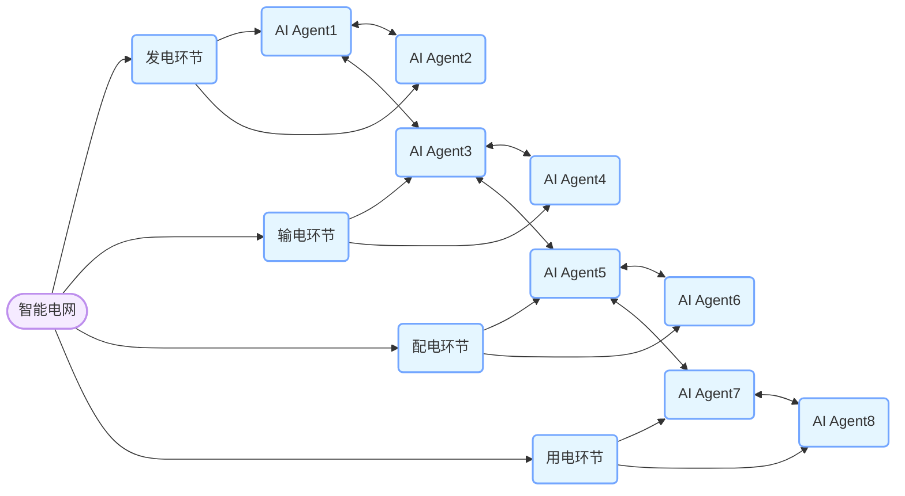

# AI Agent在智能电网优化中的应用

> 关键词：AI Agent、智能电网优化、电力系统、分布式控制、能源管理

> 摘要：本文深入探讨了AI Agent在智能电网优化中的应用。首先介绍了相关背景知识，包括研究目的、预期读者、文档结构和术语表。接着阐述了AI Agent和智能电网的核心概念及它们之间的联系，并给出了相应的文本示意图和Mermaid流程图。详细讲解了核心算法原理，用Python代码进行了具体实现。同时，给出了相关的数学模型和公式，并举例说明。通过项目实战，展示了代码的实际案例及详细解释。分析了AI Agent在智能电网中的实际应用场景，推荐了相关的学习资源、开发工具框架和论文著作。最后总结了未来发展趋势与挑战，提供了常见问题解答和扩展阅读参考资料。

## 1. 背景介绍 
### 1.1 目的和范围
随着全球能源需求的不断增长和对可持续能源的追求，智能电网作为未来电力系统的发展方向，正受到越来越多的关注。智能电网具有高度的自动化、信息化和智能化特点，能够实现电力的高效传输、分配和使用。然而，智能电网的复杂性也带来了诸多挑战，如电力负荷的不确定性、分布式能源的接入、电网的实时调度等。AI Agent作为一种具有自主决策和学习能力的智能实体，可以在智能电网中发挥重要作用，帮助优化电网的运行效率、提高供电可靠性、降低能源消耗。

本文的目的是深入研究AI Agent在智能电网优化中的应用，探讨其核心概念、算法原理、数学模型，并通过实际案例展示其应用效果。文章的范围涵盖了AI Agent在智能电网各个环节的应用，包括发电、输电、配电和用电等。

### 1.2 预期读者
本文的预期读者包括电力系统工程师、人工智能研究人员、相关专业的学生以及对智能电网和AI Agent感兴趣的技术爱好者。通过阅读本文，读者可以了解AI Agent在智能电网优化中的基本原理和应用方法，为进一步的研究和实践提供参考。

### 1.3 文档结构概述
本文共分为十个部分，具体结构如下：
1. 背景介绍：介绍文章的研究目的、预期读者、文档结构和术语表。
2. 核心概念与联系：阐述AI Agent和智能电网的核心概念及它们之间的联系，并给出相应的文本示意图和Mermaid流程图。
3. 核心算法原理 & 具体操作步骤：详细讲解AI Agent在智能电网优化中常用的核心算法原理，并用Python代码进行具体实现。
4. 数学模型和公式 & 详细讲解 & 举例说明：给出相关的数学模型和公式，并进行详细讲解和举例说明。
5. 项目实战：代码实际案例和详细解释说明：通过项目实战，展示AI Agent在智能电网优化中的代码实际案例及详细解释。
6. 实际应用场景：分析AI Agent在智能电网中的实际应用场景。
7. 工具和资源推荐：推荐相关的学习资源、开发工具框架和论文著作。
8. 总结：未来发展趋势与挑战：总结AI Agent在智能电网优化中的未来发展趋势与挑战。
9. 附录：常见问题与解答：提供常见问题的解答。
10. 扩展阅读 & 参考资料：提供扩展阅读的建议和参考资料。

### 1.4 术语表
#### 1.4.1 核心术语定义
- **AI Agent**：即人工智能代理，是一种能够感知环境、自主决策并采取行动以实现特定目标的智能实体。
- **智能电网**：是将先进的信息技术、通信技术、控制技术与电力系统相结合，实现电力系统的智能化运行和管理的电网。
- **分布式能源**：指分布在用户端的能源综合利用系统，如太阳能光伏发电、风力发电、生物质能发电等。
- **电力负荷**：指电力系统中各类用电设备所消耗的功率。

#### 1.4.2 相关概念解释
- **多Agent系统**：由多个AI Agent组成的系统，这些Agent之间可以通过通信和协作来完成复杂的任务。
- **强化学习**：一种机器学习方法，Agent通过与环境进行交互，根据环境反馈的奖励信号来学习最优的行为策略。
- **需求响应**：指电力用户根据电力价格信号或激励机制，调整自己的用电行为，以达到降低电力消耗或转移用电高峰的目的。

#### 1.4.3 缩略词列表
- **SG**：Smart Grid，智能电网
- **AI**：Artificial Intelligence，人工智能
- **MAS**：Multi - Agent System，多Agent系统
- **RL**：Reinforcement Learning，强化学习

## 2. 核心概念与联系 
### 2.1 AI Agent核心概念
AI Agent是人工智能领域的一个重要概念，它具有以下特点：
- **自主性**：能够在没有人类干预的情况下，自主地感知环境、做出决策并采取行动。
- **反应性**：能够对环境的变化做出及时的反应。
- **社会性**：可以与其他Agent进行通信和协作，共同完成任务。
- **目标导向性**：具有明确的目标，并通过一系列的行动来实现这些目标。

### 2.2 智能电网核心概念
智能电网是一种集成了先进信息技术、通信技术和控制技术的现代化电力系统，它具有以下特点：
- **自愈性**：能够实时监测电网的运行状态，自动检测和诊断故障，并采取相应的措施进行修复。
- **兼容性**：能够兼容各种分布式能源的接入，如太阳能、风能等。
- **交互性**：能够与电力用户进行实时交互，实现需求响应和电力市场交易。
- **优化性**：能够通过优化算法和智能控制技术，提高电网的运行效率和供电可靠性。

### 2.3 两者联系
AI Agent与智能电网之间存在着密切的联系。在智能电网中，AI Agent可以作为一个独立的智能实体，负责监测电网的运行状态、分析电力数据、制定控制策略等。多个AI Agent可以组成一个多Agent系统，通过协作和通信来实现智能电网的优化运行。例如，在分布式能源接入的情况下，AI Agent可以根据实时的气象数据和电力负荷情况，优化分布式能源的发电计划，提高能源的利用效率。

### 2.4 文本示意图
AI Agent与智能电网的关系可以用以下文本示意图表示：

智能电网由发电、输电、配电和用电等多个环节组成，每个环节都可以部署多个AI Agent。这些AI Agent通过通信网络相互连接，形成一个多Agent系统。AI Agent可以感知所在环节的运行状态，如电力负荷、电压、电流等，并根据这些信息做出决策。例如，发电环节的AI Agent可以根据电力市场价格和能源成本，优化发电机组的发电计划；配电环节的AI Agent可以根据实时的电力负荷情况，调整配电网络的运行方式，提高供电可靠性。

### 2.5 Mermaid流程图


## 3. 核心算法原理 & 具体操作步骤 
### 3.1 强化学习算法原理
强化学习是AI Agent在智能电网优化中常用的一种算法。在强化学习中，Agent通过与环境进行交互，根据环境反馈的奖励信号来学习最优的行为策略。强化学习的基本要素包括状态（State）、动作（Action）、奖励（Reward）和策略（Policy）。

- **状态（State）**：表示Agent所处的环境状态，如电力负荷、电压、电流等。
- **动作（Action）**：表示Agent可以采取的行动，如调整发电机组的出力、改变配电网络的开关状态等。
- **奖励（Reward）**：表示Agent采取某个动作后，环境给予的反馈信号，用于评估该动作的好坏。
- **策略（Policy）**：表示Agent在某个状态下选择动作的规则。

强化学习的目标是找到一个最优的策略，使得Agent在与环境的交互过程中获得最大的累积奖励。

### 3.2 Python代码实现
以下是一个简单的强化学习示例，使用Q - learning算法来解决一个简单的智能电网调度问题。

```python
import numpy as np

# 定义环境参数
num_states = 10  # 状态数量
num_actions = 3  # 动作数量
gamma = 0.9  # 折扣因子
alpha = 0.1  # 学习率

# 初始化Q表
Q = np.zeros((num_states, num_actions))

# 定义奖励函数
def get_reward(state, action):
    # 简单的奖励函数示例
    if state == 5 and action == 1:
        return 10
    else:
        return -1

# 定义Q - learning算法
def q_learning(num_episodes):
    for episode in range(num_episodes):
        state = np.random.randint(0, num_states)  # 随机初始化状态
        done = False
        while not done:
            # 选择动作
            if np.random.uniform(0, 1) < 0.1:  # 探索率
                action = np.random.randint(0, num_actions)
            else:
                action = np.argmax(Q[state, :])
            # 获取奖励
            reward = get_reward(state, action)
            # 转移到下一个状态
            next_state = np.random.randint(0, num_states)
            # 更新Q表
            Q[state, action] = Q[state, action] + alpha * (reward + gamma * np.max(Q[next_state, :]) - Q[state, action])
            state = next_state
            # 判断是否结束
            if state == 5 and action == 1:
                done = True
    return Q

# 训练模型
Q = q_learning(1000)
print("最终的Q表：")
print(Q)
```

### 3.3 具体操作步骤
1. **初始化Q表**：将Q表初始化为全零矩阵，Q表的行数为状态数量，列数为动作数量。
2. **选择动作**：在每个时间步，Agent根据当前状态选择一个动作。可以使用ε - greedy策略，以一定的概率进行探索（随机选择动作），以一定的概率进行利用（选择Q值最大的动作）。
3. **获取奖励**：Agent采取动作后，环境会给予一个奖励信号，根据奖励函数计算奖励值。
4. **转移到下一个状态**：根据环境的动态模型，Agent从当前状态转移到下一个状态。
5. **更新Q表**：根据Q - learning算法的更新公式，更新Q表中的Q值。
6. **判断是否结束**：如果达到终止条件，如达到目标状态，则结束当前回合；否则，继续进行下一个时间步的操作。
7. **重复训练**：重复以上步骤，进行多个回合的训练，直到Q表收敛。

## 4. 数学模型和公式 & 详细讲解 & 举例说明 
### 4.1 Q - learning算法的数学模型
Q - learning算法的核心是更新Q表中的Q值，其更新公式如下：

$$Q(s_t, a_t) \leftarrow Q(s_t, a_t) + \alpha [r_{t+1} + \gamma \max_{a} Q(s_{t+1}, a) - Q(s_t, a_t)]$$

其中：
- $Q(s_t, a_t)$ 表示在时间步 $t$，状态为 $s_t$ 时采取动作 $a_t$ 的Q值。
- $\alpha$ 是学习率，控制每次更新的步长。
- $r_{t+1}$ 是在时间步 $t + 1$ 时，Agent采取动作 $a_t$ 后获得的奖励。
- $\gamma$ 是折扣因子，用于权衡当前奖励和未来奖励的重要性。
- $\max_{a} Q(s_{t+1}, a)$ 表示在时间步 $t + 1$，状态为 $s_{t+1}$ 时，所有可能动作的最大Q值。

### 4.2 详细讲解
- **学习率 $\alpha$**：学习率 $\alpha$ 控制了每次更新Q值时的步长。如果 $\alpha$ 过大，Q值的更新会过于激进，可能导致算法无法收敛；如果 $\alpha$ 过小，Q值的更新会过于缓慢，算法的收敛速度会变慢。
- **折扣因子 $\gamma$**：折扣因子 $\gamma$ 用于权衡当前奖励和未来奖励的重要性。$\gamma$ 的取值范围是 $[0, 1]$，当 $\gamma$ 接近 0 时，Agent更关注当前奖励；当 $\gamma$ 接近 1 时，Agent更关注未来奖励。
- **更新公式的含义**：更新公式的含义是，将当前状态 - 动作对的Q值更新为原来的Q值加上一个修正项。修正项的大小取决于当前获得的奖励和未来可能获得的最大奖励。

### 4.3 举例说明
假设在一个简单的智能电网调度问题中，有 3 个状态（$s_0, s_1, s_2$）和 2 个动作（$a_0, a_1$）。初始时，Q表如下：

| 状态 | $a_0$ | $a_1$ |
| ---- | ---- | ---- |
| $s_0$ | 0 | 0 |
| $s_1$ | 0 | 0 |
| $s_2$ | 0 | 0 |

假设当前状态 $s_t = s_0$，Agent选择动作 $a_t = a_0$，获得奖励 $r_{t+1} = 5$，转移到下一个状态 $s_{t+1} = s_1$。已知 $\alpha = 0.1$，$\gamma = 0.9$，则根据Q - learning更新公式：

首先，计算 $\max_{a} Q(s_{t+1}, a)$，即状态 $s_1$ 下所有动作的最大Q值，由于 $Q(s_1, a_0) = 0$，$Q(s_1, a_1) = 0$，所以 $\max_{a} Q(s_{t+1}, a) = 0$。

然后，更新 $Q(s_0, a_0)$：

$$Q(s_0, a_0) = Q(s_0, a_0) + \alpha [r_{t+1} + \gamma \max_{a} Q(s_{t+1}, a) - Q(s_0, a_0)]$$

$$Q(s_0, a_0) = 0 + 0.1\times(5 + 0.9\times0 - 0) = 0.5$$

更新后的Q表如下：

| 状态 | $a_0$ | $a_1$ |
| ---- | ---- | ---- |
| $s_0$ | 0.5 | 0 |
| $s_1$ | 0 | 0 |
| $s_2$ | 0 | 0 |

## 5. 项目实战：代码实际案例和详细解释说明 
### 5.1 开发环境搭建
为了实现AI Agent在智能电网优化中的应用，我们需要搭建一个开发环境。以下是具体的步骤：

#### 5.1.1 安装Python
Python是一种广泛使用的编程语言，许多人工智能和机器学习库都支持Python。可以从Python官方网站（https://www.python.org/downloads/）下载并安装Python。建议安装Python 3.7及以上版本。

#### 5.1.2 安装必要的库
我们需要安装一些必要的Python库，如NumPy、Pandas、Matplotlib等。可以使用pip命令进行安装：

```bash
pip install numpy pandas matplotlib
```

#### 5.1.3 安装开发工具
可以选择使用集成开发环境（IDE），如PyCharm、Jupyter Notebook等。PyCharm是一款功能强大的Python IDE，适合大型项目的开发；Jupyter Notebook是一个交互式的开发环境，适合进行数据探索和模型实验。

### 5.2 源代码详细实现和代码解读
以下是一个更复杂的AI Agent在智能电网优化中的应用案例，使用强化学习算法来优化分布式能源的发电计划。

```python
import numpy as np
import pandas as pd
import matplotlib.pyplot as plt

# 定义环境参数
num_states = 24  # 一天24小时作为状态
num_actions = 5  # 发电功率等级
gamma = 0.9  # 折扣因子
alpha = 0.1  # 学习率
num_episodes = 1000  # 训练回合数

# 初始化Q表
Q = np.zeros((num_states, num_actions))

# 模拟电力负荷数据
load_data = np.random.randint(100, 500, num_states)

# 定义奖励函数
def get_reward(state, action):
    # 假设发电成本与发电功率成正比
    cost = action * 10
    # 计算发电功率与负荷的匹配度
    match = abs(load_data[state] - action * 50)
    # 奖励函数：匹配度越高，奖励越高；成本越低，奖励越高
    reward = 100 - match - cost
    return reward

# 定义Q - learning算法
def q_learning(num_episodes):
    rewards = []
    for episode in range(num_episodes):
        total_reward = 0
        state = 0  # 初始状态为0点
        done = False
        while not done:
            # 选择动作
            if np.random.uniform(0, 1) < 0.1:  # 探索率
                action = np.random.randint(0, num_actions)
            else:
                action = np.argmax(Q[state, :])
            # 获取奖励
            reward = get_reward(state, action)
            total_reward += reward
            # 转移到下一个状态
            next_state = (state + 1) % num_states
            # 更新Q表
            Q[state, action] = Q[state, action] + alpha * (reward + gamma * np.max(Q[next_state, :]) - Q[state, action])
            state = next_state
            # 判断是否结束
            if state == 0:
                done = True
        rewards.append(total_reward)
    return rewards

# 训练模型
rewards = q_learning(num_episodes)

# 绘制奖励曲线
plt.plot(rewards)
plt.xlabel('Episode')
plt.ylabel('Total Reward')
plt.title('Training Rewards')
plt.show()

# 生成最优发电计划
optimal_plan = []
state = 0
for _ in range(num_states):
    action = np.argmax(Q[state, :])
    optimal_plan.append(action * 50)
    state = (state + 1) % num_states

# 绘制负荷曲线和最优发电计划曲线
time = np.arange(num_states)
plt.plot(time, load_data, label='Load')
plt.plot(time, optimal_plan, label='Optimal Generation Plan')
plt.xlabel('Time (hours)')
plt.ylabel('Power (kW)')
plt.title('Load and Optimal Generation Plan')
plt.legend()
plt.show()
```

### 5.3 代码解读与分析
#### 5.3.1 环境参数定义
- `num_states`：表示状态的数量，这里将一天的24小时作为不同的状态。
- `num_actions`：表示动作的数量，这里将发电功率分为5个等级。
- `gamma`：折扣因子，用于权衡当前奖励和未来奖励的重要性。
- `alpha`：学习率，控制每次更新Q值的步长。
- `num_episodes`：训练回合数，即算法进行训练的次数。

#### 5.3.2 Q表初始化
`Q` 是一个二维数组，用于存储每个状态 - 动作对的Q值。初始时，Q表中的所有元素都为0。

#### 5.3.3 模拟电力负荷数据
`load_data` 是一个一维数组，用于模拟一天24小时的电力负荷数据。这里使用随机整数生成电力负荷。

#### 5.3.4 奖励函数
`get_reward` 函数根据当前状态和动作计算奖励值。奖励值的计算考虑了发电成本和发电功率与负荷的匹配度。发电成本与发电功率成正比，匹配度越高，奖励越高；成本越低，奖励越高。

#### 5.3.5 Q - learning算法实现
`q_learning` 函数实现了Q - learning算法的核心逻辑。在每个回合中，Agent从初始状态开始，根据当前状态选择动作，获取奖励，更新Q表，直到回到初始状态结束当前回合。同时，记录每个回合的总奖励。

#### 5.3.6 训练模型
调用 `q_learning` 函数进行训练，并将每个回合的总奖励存储在 `rewards` 列表中。

#### 5.3.7 绘制奖励曲线
使用Matplotlib库绘制训练过程中的奖励曲线，直观地观察算法的收敛情况。

#### 5.3.8 生成最优发电计划
根据训练好的Q表，生成最优的发电计划。对于每个状态，选择Q值最大的动作作为最优动作，并将其转换为发电功率。

#### 5.3.9 绘制负荷曲线和最优发电计划曲线
使用Matplotlib库绘制电力负荷曲线和最优发电计划曲线，直观地比较两者的匹配情况。

## 6. 实际应用场景 
### 6.1 发电环节优化
在发电环节，AI Agent可以根据实时的气象数据、电力市场价格和能源成本等信息，优化发电机组的发电计划。例如，对于太阳能光伏发电系统，AI Agent可以根据天气预报和光照强度预测，调整太阳能电池板的倾斜角度和跟踪方向，提高光伏发电效率；对于风力发电系统，AI Agent可以根据风速和风向预测，优化风力发电机组的叶片角度和转速，提高风能转换效率。同时，AI Agent还可以根据电力市场价格的波动，合理安排发电机组的启停和出力，实现发电效益的最大化。

### 6.2 输电环节优化
在输电环节，AI Agent可以实时监测输电线路的运行状态，如电流、电压、温度等，及时发现潜在的故障隐患。当检测到故障时，AI Agent可以迅速分析故障类型和位置，并采取相应的措施进行修复，如自动切换备用线路、调整电网潮流等，提高输电系统的可靠性和稳定性。此外，AI Agent还可以通过优化输电网络的拓扑结构和潮流分布，降低输电损耗，提高输电效率。

### 6.3 配电环节优化
在配电环节，AI Agent可以根据实时的电力负荷情况，动态调整配电网络的运行方式。例如，在用电高峰时段，AI Agent可以通过控制分布式能源的接入和储能装置的充放电，平衡电力供需，缓解配电网络的压力；在用电低谷时段，AI Agent可以将多余的电能存储在储能装置中，以备后续使用。同时，AI Agent还可以对配电设备进行状态监测和故障诊断，及时发现和处理设备故障，提高配电系统的可靠性和供电质量。

### 6.4 用电环节优化
在用电环节，AI Agent可以与电力用户进行实时交互，实现需求响应。例如，AI Agent可以根据电力市场价格和用户的用电习惯，为用户提供个性化的用电建议，鼓励用户在用电低谷时段使用电器设备，降低用电成本。同时，AI Agent还可以控制智能家电设备的运行，实现家电设备的自动化管理和节能控制。例如，在用户离开家时，AI Agent可以自动关闭不必要的电器设备；在用户回家前，AI Agent可以提前开启空调、热水器等设备，为用户提供舒适的居住环境。

## 7. 工具和资源推荐
### 7.1 学习资源推荐
#### 7.1.1 书籍推荐
- 《人工智能：一种现代的方法》（Artificial Intelligence: A Modern Approach）：这是一本经典的人工智能教材，全面介绍了人工智能的各个领域，包括搜索算法、知识表示、机器学习、自然语言处理等。
- 《强化学习：原理与Python实现》：本书详细介绍了强化学习的基本原理和算法，并通过Python代码实现了多个强化学习案例，适合初学者学习。
- 《智能电网：技术、管理与市场》：该书系统地介绍了智能电网的概念、技术、管理和市场等方面的知识，对于了解智能电网的整体架构和发展趋势有很大帮助。

#### 7.1.2 在线课程
- Coursera上的“人工智能基础”（Foundations of Artificial Intelligence）课程：由斯坦福大学的教授授课，涵盖了人工智能的基本概念、算法和应用。
- edX上的“强化学习”（Reinforcement Learning）课程：由伯克利大学的教授授课，深入讲解了强化学习的理论和实践。
- 中国大学MOOC上的“智能电网技术”课程：由国内知名高校的教授授课，介绍了智能电网的关键技术和应用案例。

#### 7.1.3 技术博客和网站
- Medium：一个技术博客平台，上面有很多关于人工智能和智能电网的优质文章。
- IEEE Xplore：电气和电子工程师协会（IEEE）的数字图书馆，提供了大量关于电力系统和人工智能的学术论文和技术报告。
- 中国电力科学研究院官网：发布了许多关于智能电网的研究成果和行业动态。

### 7.2 开发工具框架推荐
#### 7.2.1 IDE和编辑器
- PyCharm：一款功能强大的Python IDE，提供了代码编辑、调试、版本控制等功能，适合大型项目的开发。
- Jupyter Notebook：一个交互式的开发环境，支持Python、R等多种编程语言，适合进行数据探索和模型实验。
- Visual Studio Code：一款轻量级的代码编辑器，支持多种编程语言和插件扩展，具有良好的用户体验。

#### 7.2.2 调试和性能分析工具
- PySnooper：一个简单易用的Python调试工具，可以自动记录函数的调用过程和变量的值，方便调试代码。
- cProfile：Python标准库中的性能分析工具，可以分析代码的运行时间和函数调用次数，帮助优化代码性能。
- TensorBoard：一个可视化工具，用于可视化深度学习模型的训练过程和性能指标，对于强化学习模型的调试和优化也有很大帮助。

#### 7.2.3 相关框架和库
- NumPy：一个用于科学计算的Python库，提供了高效的多维数组对象和各种数学函数，是许多机器学习和深度学习库的基础。
- Pandas：一个用于数据处理和分析的Python库，提供了数据结构和数据分析工具，方便处理和分析电力数据。
- OpenAI Gym：一个开源的强化学习环境库，提供了各种经典的强化学习任务和环境，方便进行强化学习算法的实验和验证。

### 7.3 相关论文著作推荐
#### 7.3.1 经典论文
- “Q - learning”：由Christopher J. C. H. Watkins和Peter Dayan发表的经典论文，首次提出了Q - learning算法，为强化学习的发展奠定了基础。
- “Multi - Agent Systems: A Modern Approach to Distributed Artificial Intelligence”：该书系统地介绍了多Agent系统的理论和方法，对于理解AI Agent在智能电网中的协作和通信机制有很大帮助。
- “Smart Grid: The New and Improved Power Grid”：这篇论文介绍了智能电网的概念、技术和应用，是智能电网领域的经典文献。

#### 7.3.2 最新研究成果
- 在IEEE Transactions on Smart Grid、Applied Energy等期刊上，经常发表关于AI Agent在智能电网优化中的最新研究成果。可以关注这些期刊，了解该领域的前沿动态。
- 每年的IEEE Power & Energy Society General Meeting、IEEE International Conference on Smart Grid Communications等学术会议上，也会有很多关于智能电网和人工智能的研究报告和论文。

#### 7.3.3 应用案例分析
- 一些电力公司和科研机构会发布关于AI Agent在智能电网中的应用案例分析报告。例如，国家电网公司的相关报告中介绍了AI Agent在电网调度、故障诊断等方面的应用实践。

## 8. 总结：未来发展趋势与挑战
### 8.1 未来发展趋势
- **多Agent系统的深度融合**：未来，AI Agent在智能电网中的应用将不仅仅局限于单个Agent的决策和控制，而是会朝着多Agent系统的深度融合方向发展。多个Agent之间将通过更加高效的通信和协作机制，实现智能电网的全局优化和协同控制。
- **与其他技术的融合**：AI Agent将与物联网、大数据、区块链等技术进行深度融合。物联网技术可以为AI Agent提供更丰富的感知数据，大数据技术可以帮助AI Agent进行更准确的数据分析和决策，区块链技术可以保障智能电网中数据的安全性和可信性。
- **智能电网的自主进化**：随着AI Agent学习能力的不断提高，智能电网将具备自主进化的能力。它可以根据不断变化的环境和需求，自动调整自身的运行策略和控制方法，实现自我优化和自我修复。

### 8.2 挑战
- **数据安全和隐私问题**：AI Agent在智能电网中的应用需要大量的电力数据作为支撑，这些数据包含了用户的用电信息和电网的运行状态等敏感信息。如何保障数据的安全和隐私，防止数据泄露和恶意攻击，是一个亟待解决的问题。
- **算法的可解释性和可靠性**：一些复杂的AI算法，如深度学习算法，具有较高的性能，但缺乏可解释性。在智能电网这样的关键领域，算法的可解释性和可靠性至关重要。如何开发具有可解释性和可靠性的AI算法，是当前面临的一个挑战。
- **标准和规范的缺乏**：目前，AI Agent在智能电网中的应用还缺乏统一的标准和规范。不同的电力公司和科研机构可能采用不同的技术和方法，这给系统的集成和互操作性带来了困难。制定统一的标准和规范，是推动AI Agent在智能电网中广泛应用的关键。

## 9. 附录：常见问题与解答
### 9.1 什么是AI Agent？
AI Agent是一种能够感知环境、自主决策并采取行动以实现特定目标的智能实体。它具有自主性、反应性、社会性和目标导向性等特点。

### 9.2 AI Agent在智能电网中有哪些应用场景？
AI Agent在智能电网中的应用场景包括发电环节优化、输电环节优化、配电环节优化和用电环节优化等。例如，在发电环节，AI Agent可以优化发电机组的发电计划；在用电环节，AI Agent可以实现需求响应和家电设备的自动化管理。

### 9.3 强化学习在AI Agent智能电网优化中是如何应用的？
在AI Agent智能电网优化中，强化学习可以用于学习最优的控制策略。Agent通过与环境进行交互，根据环境反馈的奖励信号来更新自己的策略，以获得最大的累积奖励。例如，在分布式能源发电计划优化中，Agent可以根据电力负荷和发电成本等信息，学习最优的发电功率调度策略。

### 9.4 如何保障AI Agent在智能电网中使用的数据安全和隐私？
可以采用多种技术手段来保障数据安全和隐私，如数据加密、访问控制、区块链技术等。同时，还需要制定严格的法律法规和管理制度，规范数据的使用和共享。

### 9.5 AI Agent在智能电网中的应用面临哪些挑战？
AI Agent在智能电网中的应用面临数据安全和隐私问题、算法的可解释性和可靠性问题以及标准和规范的缺乏等挑战。

## 10. 扩展阅读 & 参考资料
### 10.1 扩展阅读
- 《深度学习》（Deep Learning）：这本书深入介绍了深度学习的理论和方法，对于理解AI Agent中深度学习算法的应用有很大帮助。
- 《复杂网络》（Complex Networks）：智能电网可以看作是一个复杂网络，这本书介绍了复杂网络的基本概念和分析方法，有助于理解智能电网的拓扑结构和动态特性。
- 《能源互联网》（Energy Internet）：能源互联网是智能电网的发展方向，这本书介绍了能源互联网的概念、技术和应用，为AI Agent在智能电网中的未来应用提供了新的思路。

### 10.2 参考资料
- [1] Watkins C J C H, Dayan P. Q - learning[J]. Machine learning, 1992, 8(3 - 4): 279 - 292.
- [2] Weiss G. Multi - Agent Systems: A Modern Approach to Distributed Artificial Intelligence[M]. MIT press, 1999.
- [3] Liu C, Song Y, Shahidehpour M. Smart Grid: The New and Improved Power Grid[J]. Proceedings of the IEEE, 2009, 97(1): 183 - 198.

作者：AI天才研究院/AI Genius Institute & 禅与计算机程序设计艺术 /Zen And The Art of Computer Programming