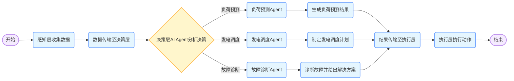

# AI Agent在智能电网管理中的应用

> 关键词：AI Agent、智能电网管理、电力系统、自动化控制、能源优化

> 摘要：本文深入探讨了AI Agent在智能电网管理中的应用。首先介绍了相关背景，包括研究目的、预期读者、文档结构和术语定义。接着阐述了AI Agent和智能电网管理的核心概念及它们之间的联系，并给出了相应的文本示意图和Mermaid流程图。详细讲解了AI Agent在智能电网管理中涉及的核心算法原理，结合Python源代码进行说明。同时给出了相关的数学模型和公式，并举例说明。通过项目实战部分，展示了开发环境搭建、源代码实现与解读。分析了AI Agent在智能电网管理中的实际应用场景，推荐了学习资源、开发工具框架和相关论文著作。最后总结了未来发展趋势与挑战，解答了常见问题，并提供了扩展阅读和参考资料，旨在为相关领域的研究和实践提供全面的技术指导。

## 1. 背景介绍 
### 1.1 目的和范围
智能电网作为未来电力系统的发展方向，具有高度的复杂性和动态性。传统的电网管理方法在处理大量实时数据、实现高效自动化控制和优化能源分配等方面面临诸多挑战。AI Agent作为一种具有自主决策和交互能力的智能实体，为智能电网管理提供了新的解决方案。本文的目的是深入研究AI Agent在智能电网管理中的应用，包括其原理、算法、实际案例等，探讨如何利用AI Agent提高智能电网的运行效率、可靠性和安全性。范围涵盖了AI Agent在发电、输电、配电和用电等各个环节的应用，以及相关的技术和方法。

### 1.2 预期读者
本文的预期读者包括电力系统工程师、人工智能研究人员、智能电网领域的科研人员和学生。对于电力系统工程师，本文可以为他们提供利用AI Agent改进电网管理的思路和方法；对于人工智能研究人员，能够了解智能电网管理这一具体应用场景，拓展研究领域；对于科研人员和学生，有助于他们深入学习和研究AI Agent在智能电网中的应用，为未来的工作和学习提供参考。

### 1.3 文档结构概述
本文将按照以下结构进行阐述：首先介绍背景信息，包括目的、预期读者和文档结构；接着阐述AI Agent和智能电网管理的核心概念及联系；详细讲解核心算法原理和具体操作步骤，结合Python代码；给出相关的数学模型和公式，并举例说明；通过项目实战展示代码实现和解读；分析实际应用场景；推荐学习资源、开发工具框架和相关论文著作；最后总结未来发展趋势与挑战，解答常见问题，并提供扩展阅读和参考资料。

### 1.4 术语表
#### 1.4.1 核心术语定义
- **AI Agent**：即人工智能代理，是一种能够感知环境、进行推理和决策，并通过执行动作与环境进行交互的智能实体。它可以根据预设的目标和规则，自主地完成特定的任务。
- **智能电网**：是将先进的传感测量技术、通信技术、信息技术、计算机技术和控制技术与电力系统基础设施高度集成而形成的新型现代化电网。它具有自愈、安全、经济、清洁等特点，能够实现电力的高效生产、传输和使用。
- **电力系统**：由发电、输电、变电、配电和用电等环节组成的电能生产与消费系统。它的功能是将自然界的一次能源通过发电动力装置转化为电能，再经输电、变电和配电将电能供应到各用户。

#### 1.4.2 相关概念解释
- **多Agent系统（MAS）**：由多个AI Agent组成的系统，这些Agent之间可以进行通信和协作，共同完成复杂的任务。在智能电网管理中，多Agent系统可以用于协调不同部门、不同设备之间的工作，提高电网的整体运行效率。
- **负荷预测**：根据历史负荷数据、气象数据等信息，对未来一段时间内的电力负荷进行预测。准确的负荷预测对于电网的规划、调度和运行具有重要意义。
- **分布式能源资源（DER）**：包括太阳能、风能、水能等可再生能源发电装置，以及储能设备、电动汽车等。这些分布式能源资源的接入给智能电网的管理带来了新的挑战和机遇。

#### 1.4.3 缩略词列表
- **MAS**：Multi-Agent System（多Agent系统）
- **DER**：Distributed Energy Resource（分布式能源资源）
- **EMS**：Energy Management System（能源管理系统）
- **SCADA**：Supervisory Control and Data Acquisition（数据采集与监视控制系统）

## 2. 核心概念与联系 
### 核心概念原理
#### AI Agent原理
AI Agent的基本原理是基于感知 - 动作循环。它通过传感器感知环境中的信息，然后根据内部的知识库和推理机制进行决策，最后通过执行器执行相应的动作。AI Agent可以分为反应式Agent、基于模型的Agent、基于目标的Agent和基于效用的Agent等不同类型。反应式Agent根据当前的感知信息直接做出反应，不考虑历史信息和未来目标；基于模型的Agent则会维护一个环境模型，根据模型进行推理和决策；基于目标的Agent以实现特定的目标为导向，通过规划和执行一系列动作来达到目标；基于效用的Agent会根据不同动作的效用值进行选择，以最大化整体效用。

#### 智能电网管理原理
智能电网管理的核心目标是实现电力系统的安全、可靠、经济和高效运行。它涉及到发电、输电、配电和用电等各个环节的管理和控制。在发电环节，需要根据负荷需求和能源资源情况，合理安排发电计划，优化发电效率；在输电环节，要保证电力的可靠传输，减少输电损耗；在配电环节，需要进行负荷分配和电压调节，确保电能质量；在用电环节，要实现需求侧管理，引导用户合理用电，提高能源利用效率。

### 架构的文本示意图
智能电网管理中的AI Agent架构可以分为三个层次：感知层、决策层和执行层。感知层由各种传感器组成，用于收集电网中的各种数据，如电压、电流、功率、温度等。这些数据被传输到决策层，决策层由多个AI Agent组成，它们根据感知层提供的数据进行分析和决策。不同的AI Agent可以负责不同的任务，如负荷预测Agent、发电调度Agent、故障诊断Agent等。执行层由各种执行器组成，如断路器、继电器、智能电表等，它们根据决策层的指令执行相应的动作，实现对电网的控制和调节。

### Mermaid流程图


## 3. 核心算法原理 & 具体操作步骤 
### 核心算法原理
#### 强化学习算法在AI Agent中的应用
强化学习是一种让Agent通过与环境进行交互，不断尝试不同的动作，以最大化累积奖励的学习方法。在智能电网管理中，强化学习可以用于发电调度、负荷控制等任务。以发电调度为例，Agent的状态可以包括当前的负荷需求、发电设备的状态、能源价格等；动作可以是选择不同的发电设备进行发电；奖励可以根据发电成本、电能质量等因素来定义。Agent通过不断地与环境交互，学习到最优的发电调度策略。

### Python源代码阐述
以下是一个简单的强化学习示例，使用OpenAI Gym库模拟一个简单的智能电网发电调度环境：
```python
import gym
import numpy as np

# 创建智能电网发电调度环境
env = gym.make('SmartGridEnv-v0')

# 初始化Q表
action_space_size = env.action_space.n
state_space_size = env.observation_space.n
q_table = np.zeros((state_space_size, action_space_size))

# 定义超参数
num_episodes = 1000
max_steps_per_episode = 100
learning_rate = 0.1
discount_rate = 0.99
exploration_rate = 1
max_exploration_rate = 1
min_exploration_rate = 0.01
exploration_decay_rate = 0.001

# 强化学习训练过程
for episode in range(num_episodes):
    state = env.reset()
    done = False
    for step in range(max_steps_per_episode):
        # 选择动作
        exploration_rate_threshold = np.random.uniform(0, 1)
        if exploration_rate_threshold > exploration_rate:
            action = np.argmax(q_table[state, :])
        else:
            action = env.action_space.sample()
        
        # 执行动作
        new_state, reward, done, info = env.step(action)
        
        # 更新Q表
        q_table[state, action] = q_table[state, action] + \
            learning_rate * (reward + discount_rate * np.max(q_table[new_state, :]) - q_table[state, action])
        
        state = new_state
        
        if done == True:
            break
    
    # 降低探索率
    exploration_rate = min_exploration_rate + \
        (max_exploration_rate - min_exploration_rate) * np.exp(-exploration_decay_rate * episode)

# 测试训练好的Agent
state = env.reset()
done = False
for step in range(max_steps_per_episode):
    action = np.argmax(q_table[state, :])
    new_state, reward, done, info = env.step(action)
    state = new_state
    if done == True:
        break

env.close()
```
### 具体操作步骤
1. **环境初始化**：创建智能电网发电调度环境，并初始化Q表。
2. **超参数设置**：设置训练的超参数，如训练的回合数、每回合的最大步数、学习率、折扣率、探索率等。
3. **训练过程**：在每个回合中，Agent根据当前状态选择动作，执行动作后得到新的状态和奖励，然后更新Q表。随着训练的进行，逐渐降低探索率，让Agent更多地利用已经学到的知识。
4. **测试过程**：使用训练好的Q表，让Agent在环境中进行测试，观察其表现。

## 4. 数学模型和公式 & 详细讲解 & 举例说明 
### 强化学习中的数学模型和公式
#### Q学习算法公式
Q学习是一种无模型的强化学习算法，其核心是更新Q表。Q表中的每个元素 $Q(s, a)$ 表示在状态 $s$ 下选择动作 $a$ 的价值。Q学习的更新公式为：
$$Q(s_t, a_t) \leftarrow Q(s_t, a_t) + \alpha [r_{t+1} + \gamma \max_{a} Q(s_{t+1}, a) - Q(s_t, a_t)]$$
其中，$s_t$ 表示当前状态，$a_t$ 表示当前动作，$r_{t+1}$ 表示执行动作后得到的奖励，$s_{t+1}$ 表示执行动作后转移到的新状态，$\alpha$ 是学习率，$\gamma$ 是折扣率。

### 详细讲解
- **学习率 $\alpha$**：控制了新的经验对Q值更新的影响程度。$\alpha$ 越大，新的经验对Q值的更新影响越大；$\alpha$ 越小，Q值的更新越缓慢，更依赖于过去的经验。
- **折扣率 $\gamma$**：表示对未来奖励的重视程度。$\gamma$ 越接近1，Agent越重视未来的奖励；$\gamma$ 越接近0，Agent更关注当前的奖励。

### 举例说明
假设在智能电网发电调度中，当前状态 $s_t$ 是负荷需求为中等，发电设备A的可用容量为高，动作 $a_t$ 是选择发电设备A进行发电。执行动作后，得到奖励 $r_{t+1}$ 为10（表示发电成本较低），新状态 $s_{t+1}$ 是负荷需求变为低，发电设备A的可用容量变为中等。假设学习率 $\alpha = 0.1$，折扣率 $\gamma = 0.9$，当前 $Q(s_t, a_t) = 20$，$\max_{a} Q(s_{t+1}, a) = 15$。则根据Q学习公式更新后的 $Q(s_t, a_t)$ 为：
$$Q(s_t, a_t) = 20 + 0.1 \times [10 + 0.9 \times 15 - 20] = 20 + 0.1 \times [10 + 13.5 - 20] = 20 + 0.1 \times 3.5 = 20.35$$

## 5. 项目实战：代码实际案例和详细解释说明 
### 5.1  开发环境搭建
#### 安装Python
首先需要安装Python，建议使用Python 3.7及以上版本。可以从Python官方网站（https://www.python.org/downloads/）下载安装包，按照安装向导进行安装。

#### 安装必要的库
使用pip命令安装所需的库，包括OpenAI Gym、NumPy等：
```sh
pip install gym numpy
```

### 5.2  源代码详细实现和代码解读
```python
import gym
import numpy as np

# 创建智能电网发电调度环境
env = gym.make('SmartGridEnv-v0')

# 初始化Q表
action_space_size = env.action_space.n
state_space_size = env.observation_space.n
q_table = np.zeros((state_space_size, action_space_size))

# 定义超参数
num_episodes = 1000
max_steps_per_episode = 100
learning_rate = 0.1
discount_rate = 0.99
exploration_rate = 1
max_exploration_rate = 1
min_exploration_rate = 0.01
exploration_decay_rate = 0.001

# 强化学习训练过程
for episode in range(num_episodes):
    state = env.reset()
    done = False
    for step in range(max_steps_per_episode):
        # 选择动作
        exploration_rate_threshold = np.random.uniform(0, 1)
        if exploration_rate_threshold > exploration_rate:
            action = np.argmax(q_table[state, :])
        else:
            action = env.action_space.sample()
        
        # 执行动作
        new_state, reward, done, info = env.step(action)
        
        # 更新Q表
        q_table[state, action] = q_table[state, action] + \
            learning_rate * (reward + discount_rate * np.max(q_table[new_state, :]) - q_table[state, action])
        
        state = new_state
        
        if done == True:
            break
    
    # 降低探索率
    exploration_rate = min_exploration_rate + \
        (max_exploration_rate - min_exploration_rate) * np.exp(-exploration_decay_rate * episode)

# 测试训练好的Agent
state = env.reset()
done = False
for step in range(max_steps_per_episode):
    action = np.argmax(q_table[state, :])
    new_state, reward, done, info = env.step(action)
    state = new_state
    if done == True:
        break

env.close()
```
#### 代码解读
1. **导入库**：导入OpenAI Gym和NumPy库。
2. **创建环境**：使用 `gym.make` 函数创建智能电网发电调度环境。
3. **初始化Q表**：根据环境的状态空间和动作空间大小，初始化Q表为全零矩阵。
4. **定义超参数**：设置训练的回合数、每回合的最大步数、学习率、折扣率、探索率等超参数。
5. **训练过程**：在每个回合中，Agent根据当前状态选择动作，执行动作后得到新的状态和奖励，然后更新Q表。随着训练的进行，逐渐降低探索率。
6. **测试过程**：使用训练好的Q表，让Agent在环境中进行测试，观察其表现。
7. **关闭环境**：训练和测试结束后，关闭环境。

### 5.3  代码解读与分析
#### 探索与利用平衡
在训练过程中，Agent需要在探索新的动作和利用已经学到的知识之间进行平衡。通过设置探索率，在训练初期，Agent更多地进行探索，尝试不同的动作；随着训练的进行，探索率逐渐降低，Agent更多地利用已经学到的Q表选择最优动作。

#### Q表更新
Q表的更新是强化学习的核心。通过不断地更新Q表，Agent可以学习到在不同状态下选择最优动作的策略。在每次执行动作后，根据Q学习公式更新Q表，使得Q表能够反映出不同状态 - 动作对的价值。

#### 训练效果评估
可以通过观察训练过程中的奖励变化和测试过程中的表现来评估训练效果。如果奖励逐渐增加，说明Agent在不断学习和改进；如果测试过程中Agent能够稳定地选择最优动作，说明训练取得了较好的效果。

## 6. 实际应用场景 
### 发电调度
AI Agent可以根据实时的负荷需求、发电设备的状态和能源价格等信息，实时调整发电计划，优化发电效率，降低发电成本。例如，在负荷低谷期，Agent可以选择关闭部分效率较低的发电设备；在负荷高峰期，Agent可以优先调用高效的发电设备进行发电。

### 负荷预测与控制
通过对历史负荷数据、气象数据等信息的分析，AI Agent可以准确预测未来的电力负荷。同时，Agent可以根据预测结果，对用户的用电设备进行控制，实现需求侧管理。例如，在负荷高峰期，Agent可以通过智能电表向用户发送电价调整信息，引导用户减少非必要的用电设备使用。

### 故障诊断与修复
AI Agent可以实时监测电网中的各种参数，如电压、电流、功率等，当检测到异常时，能够快速诊断故障类型和位置，并给出相应的解决方案。例如，当某条输电线路出现故障时，Agent可以迅速隔离故障线路，同时调整其他线路的功率分配，保证电网的稳定运行。

### 分布式能源资源管理
随着分布式能源资源（如太阳能、风能等）的大量接入，智能电网的管理变得更加复杂。AI Agent可以对分布式能源资源进行实时监测和控制，优化其发电和储能策略。例如，当太阳能发电充足时，Agent可以将多余的电能存储到储能设备中；当太阳能发电不足时，Agent可以从储能设备中释放电能，保证电网的稳定供电。

## 7. 工具和资源推荐
### 7.1 学习资源推荐
#### 7.1.1 书籍推荐
- 《人工智能：一种现代的方法》：这本书是人工智能领域的经典教材，全面介绍了人工智能的各个方面，包括搜索算法、知识表示、机器学习、自然语言处理等，对于理解AI Agent的原理和方法非常有帮助。
- 《强化学习：原理与Python实现》：详细介绍了强化学习的基本原理、算法和应用，通过大量的Python代码示例，帮助读者快速掌握强化学习的实现方法。
- 《智能电网基础》：系统介绍了智能电网的概念、架构、技术和应用，对于了解智能电网管理的基础知识和相关技术非常有价值。

#### 7.1.2 在线课程
- Coursera上的“人工智能基础”课程：由知名教授授课，涵盖了人工智能的基本概念、算法和应用，通过视频讲解、作业和考试等方式，帮助学员系统学习人工智能知识。
- edX上的“强化学习”课程：深入介绍了强化学习的理论和实践，包括马尔可夫决策过程、Q学习、策略梯度等算法，通过编程作业和项目实践，让学员掌握强化学习的实际应用。
- 中国大学MOOC上的“智能电网技术”课程：由国内高校的专家授课，介绍了智能电网的关键技术、发展趋势和应用案例，对于了解智能电网领域的最新动态非常有帮助。

#### 7.1.3 技术博客和网站
- Medium：上面有很多关于人工智能和智能电网的技术博客文章，作者来自不同的领域和公司，分享了他们的研究成果和实践经验。
- IEEE Xplore：是电气和电子工程师协会（IEEE）的数字图书馆，提供了大量关于电力系统、人工智能等领域的学术论文和技术报告，是获取最新研究成果的重要来源。
- 中国电力新闻网：专注于电力行业的新闻和资讯，提供了智能电网、新能源等方面的最新动态和政策解读。

### 7.2 开发工具框架推荐
#### 7.2.1 IDE和编辑器
- PyCharm：是一款专门为Python开发设计的集成开发环境（IDE），具有代码编辑、调试、版本控制等功能，支持多种Python库和框架，对于开发基于Python的AI Agent应用非常方便。
- Visual Studio Code：是一款轻量级的代码编辑器，支持多种编程语言，具有丰富的插件生态系统，可以通过安装相关插件来实现代码编辑、调试、版本控制等功能。

#### 7.2.2 调试和性能分析工具
- PDB：是Python自带的调试器，可以在代码中设置断点，逐步执行代码，查看变量的值和程序的执行流程，帮助开发者调试代码。
- cProfile：是Python的性能分析工具，可以分析代码的运行时间和函数调用情况，找出代码中的性能瓶颈，帮助开发者优化代码。

#### 7.2.3 相关框架和库
- OpenAI Gym：是一个用于开发和比较强化学习算法的工具包，提供了多种模拟环境，包括智能电网环境，方便开发者进行强化学习算法的实验和测试。
- TensorFlow：是一个开源的机器学习框架，提供了丰富的工具和库，支持深度学习、强化学习等多种算法，对于开发复杂的AI Agent系统非常有帮助。
- NumPy：是Python的一个科学计算库，提供了高效的数组操作和数学函数，是开发AI Agent应用的基础库之一。

### 7.3 相关论文著作推荐
#### 7.3.1 经典论文
- “Reinforcement Learning: A Survey”：这篇论文是强化学习领域的经典综述论文，全面介绍了强化学习的发展历程、基本概念、算法和应用，对于深入了解强化学习非常有帮助。
- “The Future of the Electric Grid”：探讨了智能电网的发展趋势和面临的挑战，提出了未来智能电网的架构和技术需求，对于研究智能电网管理具有重要的指导意义。

#### 7.3.2 最新研究成果
- 在IEEE Transactions on Power Systems、IEEE Transactions on Smart Grid等期刊上发表的关于AI Agent在智能电网管理中的应用的最新研究论文，这些论文反映了该领域的最新研究动态和技术进展。

#### 7.3.3 应用案例分析
- 一些实际的智能电网项目案例分析报告，介绍了如何利用AI Agent技术解决智能电网管理中的实际问题，如提高发电效率、优化负荷分配、实现故障快速诊断等。这些案例分析对于将理论知识应用到实际项目中具有重要的参考价值。

## 8. 总结：未来发展趋势与挑战
### 未来发展趋势
#### 多Agent系统的广泛应用
随着智能电网的不断发展，系统的复杂性和动态性将不断增加。多Agent系统可以通过多个AI Agent之间的协作和通信，实现更高效的电网管理。例如，不同的Agent可以分别负责发电调度、负荷控制、故障诊断等任务，通过相互协作，提高电网的整体运行效率和可靠性。

#### 与区块链技术的结合
区块链技术具有去中心化、不可篡改、安全可靠等特点，可以为智能电网管理提供更好的信任机制和数据安全保障。将AI Agent与区块链技术相结合，可以实现分布式能源资源的可信交易、电力市场的公平竞争等。例如，通过区块链技术记录分布式能源资源的发电和交易信息，AI Agent可以根据这些信息进行智能调度和管理。

#### 人工智能技术的不断创新
随着人工智能技术的不断发展，新的算法和模型将不断涌现。例如，深度学习、强化学习等技术的不断改进，将为AI Agent在智能电网管理中的应用提供更强大的技术支持。同时，人工智能与物联网、大数据等技术的融合，将进一步提升智能电网的智能化水平。

### 挑战
#### 数据安全与隐私保护
智能电网管理涉及大量的敏感数据，如用户的用电信息、发电设备的运行状态等。保障这些数据的安全和隐私是一个重要的挑战。在使用AI Agent进行数据处理和分析时，需要采取有效的数据加密、访问控制等措施，防止数据泄露和恶意攻击。

#### 算法的可解释性和可靠性
人工智能算法通常具有较高的复杂度，其决策过程往往难以解释。在智能电网管理中，算法的可解释性和可靠性至关重要。例如，在进行发电调度和故障诊断时，需要能够解释算法的决策依据，确保决策的合理性和可靠性。

#### 系统的兼容性和互操作性
智能电网中存在着大量的不同类型的设备和系统，这些设备和系统可能采用不同的通信协议和数据格式。确保AI Agent与这些设备和系统的兼容性和互操作性是一个挑战。需要制定统一的标准和规范，促进不同设备和系统之间的互联互通。

## 9. 附录：常见问题与解答
### 问题1：AI Agent在智能电网管理中的应用是否会增加系统的复杂性？
解答：虽然AI Agent的引入会增加系统的一定复杂性，但它也带来了更高的智能化和自动化水平。通过合理的设计和架构，可以将这种复杂性进行有效的管理和控制。例如，采用分层架构和模块化设计，将不同的功能模块分配给不同的AI Agent，降低系统的耦合度，提高系统的可维护性和可扩展性。

### 问题2：如何评估AI Agent在智能电网管理中的性能？
解答：可以从多个方面评估AI Agent的性能，如发电效率、负荷预测准确率、故障诊断准确率、系统可靠性等。可以通过模拟实验和实际应用测试，对比引入AI Agent前后系统的各项性能指标，评估其性能提升效果。同时，还可以考虑算法的收敛速度、计算资源消耗等因素。

### 问题3：AI Agent在智能电网管理中是否会受到网络攻击的影响？
解答：AI Agent在智能电网管理中依赖于网络进行数据传输和通信，因此可能会受到网络攻击的影响。为了保障系统的安全，需要采取一系列的安全措施，如网络隔离、数据加密、入侵检测等。同时，设计具有鲁棒性的AI算法，使其能够在受到攻击的情况下仍然保持一定的性能。

## 10. 扩展阅读 & 参考资料
### 扩展阅读
- 《人工智能简史》：了解人工智能的发展历程和重要里程碑，对于理解AI Agent的发展背景和技术演变有很大帮助。
- 《能源互联网：从理念到实践》：介绍了能源互联网的概念、架构和应用，探讨了智能电网与能源互联网的融合发展趋势。

### 参考资料
- 相关的学术论文和技术报告，如IEEE Transactions on Power Systems、IEEE Transactions on Smart Grid等期刊上发表的文章。
- 智能电网相关的标准和规范，如IEC 61850、IEEE 1547等。
- 各大电力公司和科研机构发布的智能电网项目报告和研究成果。

作者：AI天才研究院/AI Genius Institute & 禅与计算机程序设计艺术 /Zen And The Art of Computer Programming