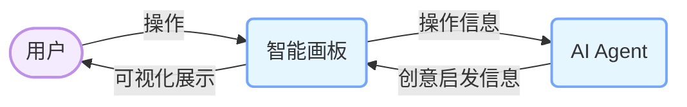

# AI Agent在智能画板中的创意激发系统

> 关键词：AI Agent、智能画板、创意激发系统、人工智能、用户交互、生成式模型、创意辅助

> 摘要：本文围绕AI Agent在智能画板中的创意激发系统展开深入探讨。首先介绍了该系统产生的背景、目的、预期读者等内容，详细阐述了核心概念、算法原理、数学模型等基础知识。通过Python代码示例对算法进行了实现和解释，展示了在项目实战中的具体应用，包括开发环境搭建、源代码实现与解读。同时探讨了该系统的实际应用场景，推荐了相关的学习资源、开发工具框架以及论文著作。最后总结了系统未来的发展趋势与挑战，并提供了常见问题解答和扩展阅读参考资料，旨在全面呈现AI Agent在智能画板中创意激发系统的全貌，为相关领域的研究和应用提供有价值的参考。

## 1. 背景介绍 
### 1.1 目的和范围
在当今数字化时代，创意产业蓬勃发展，人们对于创意工具的需求日益增长。智能画板作为一种重要的创意工具，被广泛应用于设计、艺术创作、教育等多个领域。然而，传统的智能画板往往仅提供基本的绘图功能，缺乏有效的创意激发机制，用户在创作过程中容易遇到创意瓶颈。

本创意激发系统的目的在于借助AI Agent的强大能力，为智能画板注入新的活力。通过AI Agent对用户创作行为的理解和分析，结合各种创意生成算法，为用户提供多样化的创意启发和辅助，帮助用户突破创意局限，提升创作效率和质量。

本系统的范围涵盖了从用户在智能画板上的初始操作到最终创意作品生成的整个过程。包括对用户输入的识别、创意生成算法的实现、与用户的交互反馈等环节，致力于打造一个全方位、智能化的创意激发环境。

### 1.2 预期读者
- **创意工作者**：如设计师、插画师、艺术家等，他们可以借助本系统在创作过程中获得更多的创意灵感，丰富作品的表现形式。
- **教育工作者**：在教学过程中，利用该系统激发学生的创造力和想象力，培养学生的创新思维。
- **科技爱好者**：对人工智能与创意工具结合的技术感兴趣，希望了解相关技术原理和发展趋势。
- **研究人员**：从事人工智能、人机交互、创意计算等领域的研究，本系统可作为研究案例或参考资料。

### 1.3 文档结构概述
本文将按照以下结构展开：
- 核心概念与联系：介绍AI Agent、智能画板、创意激发系统等核心概念，阐述它们之间的联系，并通过文本示意图和Mermaid流程图进行直观展示。
- 核心算法原理 & 具体操作步骤：详细讲解实现创意激发的核心算法，使用Python源代码进行示例说明，并给出具体的操作步骤。
- 数学模型和公式 & 详细讲解 & 举例说明：构建相关的数学模型，给出具体的公式，并通过实际例子进行详细讲解。
- 项目实战：代码实际案例和详细解释说明：介绍开发环境的搭建，展示源代码的实现过程，并对代码进行详细解读和分析。
- 实际应用场景：探讨该系统在不同领域的实际应用场景。
- 工具和资源推荐：推荐学习资源、开发工具框架以及相关论文著作。
- 总结：未来发展趋势与挑战：总结系统的发展趋势，分析面临的挑战。
- 附录：常见问题与解答：解答用户可能遇到的常见问题。
- 扩展阅读 & 参考资料：提供相关的扩展阅读内容和参考资料。

### 1.4 术语表
#### 1.4.1 核心术语定义
- **AI Agent**：人工智能代理，是一种能够感知环境、做出决策并采取行动的智能实体。在本系统中，AI Agent负责对用户在智能画板上的操作进行分析和理解，生成创意启发信息。
- **智能画板**：一种数字化的绘图工具，用户可以在上面进行绘图、编辑等操作。本系统中的智能画板与AI Agent紧密结合，实现创意激发功能。
- **创意激发系统**：基于AI Agent和智能画板构建的系统，旨在通过各种算法和技术，为用户提供创意启发和辅助，帮助用户在创作过程中获得更多的创意灵感。

#### 1.4.2 相关概念解释
- **生成式模型**：一种能够自动生成新数据的模型，如生成对抗网络（GAN）、变分自编码器（VAE）等。在本系统中，生成式模型可用于生成创意元素，如图案、色彩搭配等。
- **用户交互**：指用户与系统之间的信息交换和互动。在本系统中，用户通过智能画板输入创作信息，系统通过AI Agent分析用户需求并提供创意反馈，实现用户与系统的双向交互。

#### 1.4.3 缩略词列表
- **GAN**：Generative Adversarial Networks，生成对抗网络
- **VAE**：Variational Autoencoder，变分自编码器

## 2. 核心概念与联系 

### 核心概念原理
- **AI Agent**：AI Agent是本系统的核心智能组件，它具有感知、决策和行动的能力。在智能画板的环境中，AI Agent通过感知用户的绘图操作，如线条的绘制、颜色的选择、图形的组合等，对用户的创作意图进行分析和理解。然后，根据用户的需求和当前的创作状态，AI Agent利用预训练的模型和算法，生成相关的创意启发信息，如推荐的图案、色彩搭配方案、创作思路等。
- **智能画板**：智能画板是用户进行创作的平台，它提供了基本的绘图工具和功能，如画笔、橡皮擦、形状绘制等。同时，智能画板与AI Agent进行交互，将用户的操作信息传递给AI Agent，并接收AI Agent返回的创意启发信息，以可视化的方式呈现给用户。
- **创意激发系统**：创意激发系统是AI Agent和智能画板的有机结合，它通过整合各种创意生成算法和技术，实现对用户创意的激发和辅助。系统的工作流程包括用户输入、AI Agent分析、创意生成、用户反馈等环节，形成一个闭环的创意激发过程。

### 文本示意图
```plaintext
用户 -- 操作 --> 智能画板 -- 操作信息 --> AI Agent
AI Agent -- 创意启发信息 --> 智能画板 -- 可视化展示 --> 用户
```

### Mermaid流程图


## 3. 核心算法原理 & 具体操作步骤 

### 核心算法原理
本系统的核心算法主要包括用户意图分析算法和创意生成算法。

#### 用户意图分析算法
用户意图分析算法的目的是通过对用户在智能画板上的操作信息进行分析，理解用户的创作意图。具体步骤如下：
1. **数据收集**：收集用户在智能画板上的操作数据，如绘图轨迹、颜色选择、图形形状等。
2. **特征提取**：从收集到的数据中提取有用的特征，如线条的长度、角度、曲率，颜色的饱和度、亮度等。
3. **意图分类**：使用机器学习或深度学习模型对提取的特征进行分类，判断用户的创作意图，如绘制人物、风景、抽象图案等。

以下是一个简单的用户意图分析算法的Python示例：
```python
import numpy as np
from sklearn.svm import SVC

# 假设我们已经提取了一些特征数据
# 特征矩阵，每行代表一个样本，每列代表一个特征
X = np.array([[1, 2, 3], [4, 5, 6], [7, 8, 9]])
# 对应的标签，代表用户的创作意图
y = np.array(['人物', '风景', '抽象图案'])

# 创建支持向量机分类器
clf = SVC()
# 训练分类器
clf.fit(X, y)

# 假设新的用户操作特征
new_features = np.array([[2, 3, 4]])
# 预测用户的创作意图
predicted_intention = clf.predict(new_features)
print("预测的用户创作意图：", predicted_intention)
```

#### 创意生成算法
创意生成算法根据用户的创作意图，生成相关的创意启发信息。常见的创意生成算法包括基于规则的算法、基于机器学习的算法和基于生成式模型的算法。

以下是一个基于规则的创意生成算法的Python示例：
```python
# 定义创意规则
rules = {
    '人物': ['添加表情', '改变发型', '搭配服饰'],
    '风景': ['添加云彩', '改变季节', '增加动物'],
    '抽象图案': ['改变颜色组合', '添加线条纹理', '调整形状比例']
}

# 根据用户的创作意图生成创意启发信息
def generate_ideas(intention):
    if intention in rules:
        return rules[intention]
    else:
        return []

# 使用前面预测的用户创作意图
ideas = generate_ideas(predicted_intention[0])
print("生成的创意启发信息：", ideas)
```

### 具体操作步骤
1. **用户在智能画板上进行创作操作**：用户使用智能画板的绘图工具进行绘图、编辑等操作。
2. **智能画板收集用户操作信息**：智能画板记录用户的操作轨迹、颜色选择、图形形状等信息。
3. **AI Agent进行用户意图分析**：AI Agent接收智能画板传递的用户操作信息，使用用户意图分析算法对信息进行分析，预测用户的创作意图。
4. **AI Agent生成创意启发信息**：根据预测的用户创作意图，AI Agent使用创意生成算法生成相关的创意启发信息。
5. **智能画板展示创意启发信息**：智能画板接收AI Agent返回的创意启发信息，以可视化的方式呈现给用户。
6. **用户根据创意启发信息进行创作调整**：用户参考智能画板展示的创意启发信息，对自己的创作进行调整和优化。

## 4. 数学模型和公式 & 详细讲解 & 举例说明 

### 用户意图分析的数学模型
在用户意图分析中，我们可以使用机器学习中的分类模型，如逻辑回归、支持向量机等。以逻辑回归为例，其数学模型可以表示为：

$$P(y = 1|x) = \frac{1}{1 + e^{-(w^T x + b)}}$$

其中，$x$ 是输入的特征向量，$w$ 是权重向量，$b$ 是偏置项，$P(y = 1|x)$ 表示在输入特征 $x$ 的情况下，用户创作意图为某一类的概率。

### 详细讲解
逻辑回归是一种二分类模型，通过对输入特征进行线性组合，然后使用 sigmoid 函数将结果映射到 $[0, 1]$ 区间，得到概率值。在多分类问题中，可以使用一对多（One-vs-Rest）或多分类逻辑回归（Softmax Regression）等方法进行扩展。

### 举例说明
假设我们有一个简单的二分类问题，用户的创作意图分为“人物”和“风景”两类。我们提取了两个特征 $x_1$ 和 $x_2$，权重向量 $w = [0.5, 0.3]$，偏置项 $b = -0.1$。当用户的操作特征 $x = [2, 3]$ 时，计算 $z = w^T x + b = 0.5 \times 2 + 0.3 \times 3 - 0.1 = 1 + 0.9 - 0.1 = 1.8$。

然后，使用 sigmoid 函数计算概率：

$$P(y = 1|x) = \frac{1}{1 + e^{-1.8}} \approx 0.83$$

这表示用户的创作意图为“人物”的概率约为 0.83。

### 创意生成的数学模型
在创意生成中，基于规则的算法可以看作是一种简单的映射关系。例如，我们可以定义一个创意规则矩阵 $R$，其中每一行代表一个创作意图，每一列代表一个创意启发信息。

假设我们有三个创作意图：“人物”、“风景”、“抽象图案”，以及三个创意启发信息：“添加表情”、“改变颜色组合”、“增加动物”，则创意规则矩阵可以表示为：

$$R = \begin{bmatrix}
1 & 0 & 0 \\
0 & 0 & 1 \\
0 & 1 & 0
\end{bmatrix}$$

其中，$R_{ij} = 1$ 表示创作意图 $i$ 对应创意启发信息 $j$，$R_{ij} = 0$ 表示不对应。

### 详细讲解
通过创意规则矩阵，我们可以快速查找和生成与用户创作意图相关的创意启发信息。当用户的创作意图为“人物”时，我们可以找到矩阵的第一行，对应的创意启发信息为“添加表情”。

### 举例说明
假设用户的创作意图为“风景”，对应的矩阵行索引为 2。我们查找矩阵的第二行，发现 $R_{23} = 1$，则对应的创意启发信息为“增加动物”。

## 5. 项目实战：代码实际案例和详细解释说明 

### 5.1  开发环境搭建
本项目可以使用 Python 进行开发，以下是开发环境搭建的步骤：
1. **安装 Python**：从 Python 官方网站（https://www.python.org/downloads/）下载并安装 Python 3.x 版本。
2. **创建虚拟环境**：使用 `venv` 或 `conda` 等工具创建虚拟环境，以隔离项目依赖。例如，使用 `venv` 创建虚拟环境：
```bash
python -m venv myenv
```
3. **激活虚拟环境**：在 Windows 上，使用以下命令激活虚拟环境：
```bash
myenv\Scripts\activate
```
在 Linux 或 macOS 上，使用以下命令激活虚拟环境：
```bash
source myenv/bin/activate
```
4. **安装依赖库**：安装项目所需的依赖库，如 `numpy`、`scikit-learn` 等。使用 `pip` 进行安装：
```bash
pip install numpy scikit-learn
```

### 5.2  源代码详细实现和代码解读
以下是一个简单的 AI Agent 在智能画板中创意激发系统的代码示例：
```python
import numpy as np
from sklearn.svm import SVC

# 模拟智能画板收集的用户操作数据
# 特征矩阵，每行代表一个样本，每列代表一个特征
X = np.array([[1, 2, 3], [4, 5, 6], [7, 8, 9]])
# 对应的标签，代表用户的创作意图
y = np.array(['人物', '风景', '抽象图案'])

# 创建支持向量机分类器
clf = SVC()
# 训练分类器
clf.fit(X, y)

# 定义创意规则
rules = {
    '人物': ['添加表情', '改变发型', '搭配服饰'],
    '风景': ['添加云彩', '改变季节', '增加动物'],
    '抽象图案': ['改变颜色组合', '添加线条纹理', '调整形状比例']
}

# 模拟新的用户操作特征
new_features = np.array([[2, 3, 4]])
# 预测用户的创作意图
predicted_intention = clf.predict(new_features)
print("预测的用户创作意图：", predicted_intention)

# 根据用户的创作意图生成创意启发信息
def generate_ideas(intention):
    if intention in rules:
        return rules[intention]
    else:
        return []

# 生成创意启发信息
ideas = generate_ideas(predicted_intention[0])
print("生成的创意启发信息：", ideas)
```

### 代码解读与分析
1. **数据准备**：定义了模拟的用户操作数据 `X` 和对应的标签 `y`，用于训练支持向量机分类器。
2. **用户意图分析**：使用支持向量机分类器对新的用户操作特征进行预测，得到用户的创作意图。
3. **创意生成**：根据预测的用户创作意图，从创意规则字典中查找对应的创意启发信息。
4. **结果输出**：打印预测的用户创作意图和生成的创意启发信息。

这个代码示例只是一个简单的演示，实际的系统中还需要考虑更多的因素，如数据的收集和预处理、模型的优化和评估、用户交互的实现等。

## 6. 实际应用场景 
### 设计领域
在平面设计、UI/UX 设计等领域，设计师在创作过程中可能会遇到创意瓶颈。AI Agent 在智能画板中的创意激发系统可以为设计师提供丰富的创意启发，如推荐不同风格的图案、色彩搭配方案、布局建议等。设计师可以根据这些启发信息，快速调整设计思路，提高设计效率和质量。

### 艺术创作领域
对于艺术家来说，创意是作品的灵魂。该系统可以帮助艺术家打破传统思维的束缚，激发新的创作灵感。例如，在绘画过程中，系统可以根据艺术家的绘画风格和当前作品状态，推荐不同的绘画技巧、表现手法或主题方向，使艺术家的作品更加富有创意和个性。

### 教育领域
在艺术教育、设计教育等课程中，教师可以利用该系统引导学生进行创意创作。学生在智能画板上进行创作时，系统可以实时提供创意启发，帮助学生更好地理解创作思路和方法。同时，系统还可以记录学生的创作过程，为教师提供教学反馈，促进教学效果的提升。

### 