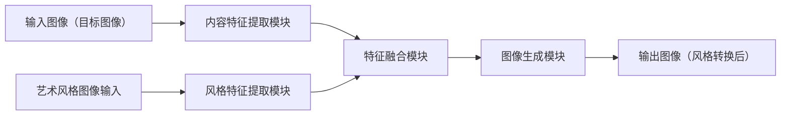

# AI Agent在智能画框中的艺术风格转换

> 关键词：AI Agent、智能画框、艺术风格转换、深度学习、图像处理

> 摘要：本文深入探讨了AI Agent在智能画框艺术风格转换中的应用。首先介绍了相关背景，包括目的、预期读者、文档结构和术语表。接着阐述了核心概念与联系，通过文本示意图和Mermaid流程图进行说明。详细讲解了核心算法原理，并用Python代码展示具体操作步骤。对涉及的数学模型和公式进行了详细推导和举例说明。通过项目实战，展示了代码实际案例并进行详细解释。分析了实际应用场景，推荐了学习资源、开发工具框架和相关论文著作。最后总结了未来发展趋势与挑战，还提供了常见问题解答和扩展阅读参考资料。旨在为相关领域的研究者和开发者提供全面且深入的技术指导。

## 1. 背景介绍 
### 1.1 目的和范围
随着人工智能技术的飞速发展，AI Agent在各个领域的应用越来越广泛。在艺术领域，智能画框的出现为艺术作品的展示和体验带来了新的可能性。本文的目的是探讨如何利用AI Agent实现智能画框中的艺术风格转换，使普通的图像能够呈现出不同艺术大师的风格。具体范围包括核心概念的阐述、算法原理的分析、实际项目的实现以及应用场景的探讨等。

### 1.2 预期读者
本文预期读者包括人工智能领域的研究者、计算机视觉工程师、艺术科技爱好者以及对智能画框技术感兴趣的开发者。无论你是初学者还是有一定经验的专业人士，都能从本文中获得有价值的信息。

### 1.3 文档结构概述
本文共分为十个部分。第一部分为背景介绍，引出文章的主题和相关信息；第二部分阐述核心概念与联系，帮助读者建立起整体的知识框架；第三部分详细讲解核心算法原理和具体操作步骤，通过Python代码进行演示；第四部分介绍数学模型和公式，并举例说明；第五部分进行项目实战，展示代码的实际案例和详细解释；第六部分分析实际应用场景；第七部分推荐相关的学习资源、开发工具框架和论文著作；第八部分总结未来发展趋势与挑战；第九部分为附录，解答常见问题；第十部分提供扩展阅读和参考资料。

### 1.4 术语表
#### 1.4.1 核心术语定义
- **AI Agent**：人工智能代理，是一种能够感知环境、做出决策并采取行动的智能实体。在本文中，AI Agent用于处理图像数据并实现艺术风格转换。
- **智能画框**：一种具备智能处理能力的画框，能够对展示的图像进行实时处理和风格转换。
- **艺术风格转换**：将一幅图像的风格转换为另一种艺术风格，如将普通照片转换为梵高、毕加索等大师的绘画风格。

#### 1.4.2 相关概念解释
- **深度学习**：一种基于人工神经网络的机器学习方法，通过多层神经网络自动学习数据的特征和模式。在艺术风格转换中，深度学习模型可以学习不同艺术风格的特征，并将其应用到目标图像上。
- **卷积神经网络（CNN）**：一种专门用于处理图像数据的深度学习模型，通过卷积层、池化层等结构提取图像的特征。在艺术风格转换中，CNN常用于提取图像的内容特征和风格特征。

#### 1.4.3 缩略词列表
- **CNN**：Convolutional Neural Network（卷积神经网络）
- **GAN**：Generative Adversarial Network（生成对抗网络）

## 2. 核心概念与联系 

### 核心概念原理
在智能画框的艺术风格转换中，核心概念主要涉及AI Agent、图像内容特征和艺术风格特征。AI Agent作为整个系统的智能决策者，负责协调各个模块的工作，实现图像的风格转换。图像内容特征是指图像中物体的形状、结构等信息，而艺术风格特征则是指特定艺术风格的笔触、色彩、纹理等特征。

实现艺术风格转换的基本原理是将目标图像的内容特征与某种艺术风格的风格特征进行融合。具体来说，首先需要使用深度学习模型提取目标图像的内容特征和艺术风格图像的风格特征，然后通过一定的算法将这两种特征进行融合，生成具有特定艺术风格的新图像。

### 架构的文本示意图
```plaintext
+-------------------+
| 输入图像（目标图像） |
+-------------------+
        |
        v
+-------------------+
| 内容特征提取模块 |
+-------------------+
        |
        v
+-------------------+
| 艺术风格图像输入 |
+-------------------+
        |
        v
+-------------------+
| 风格特征提取模块 |
+-------------------+
        |
        v
+-------------------+
| 特征融合模块     |
+-------------------+
        |
        v
+-------------------+
| 图像生成模块     |
+-------------------+
        |
        v
+-------------------+
| 输出图像（风格转换后） |
+-------------------+
```

### Mermaid流程图


## 3. 核心算法原理 & 具体操作步骤 

### 核心算法原理
在艺术风格转换中，常用的算法是基于卷积神经网络（CNN）的风格迁移算法。该算法的核心思想是通过优化一个损失函数，使得生成的图像既保留目标图像的内容特征，又具有艺术风格图像的风格特征。

具体来说，损失函数通常由内容损失和风格损失两部分组成。内容损失衡量生成图像与目标图像在内容特征上的差异，风格损失衡量生成图像与艺术风格图像在风格特征上的差异。通过最小化这两个损失的加权和，就可以得到具有目标内容和特定风格的生成图像。

### 具体操作步骤
以下是使用Python和PyTorch实现艺术风格转换的具体代码示例：

```python
import torch
import torch.nn as nn
import torch.optim as optim
from torchvision import models, transforms
from PIL import Image
import matplotlib.pyplot as plt

# 定义图像预处理函数
def image_preprocess(image_path, size):
    transform = transforms.Compose([
        transforms.Resize(size),
        transforms.ToTensor(),
        transforms.Normalize(mean=[0.485, 0.456, 0.406], std=[0.229, 0.224, 0.225])
    ])
    image = Image.open(image_path)
    image = transform(image).unsqueeze(0)
    return image

# 定义图像后处理函数
def image_postprocess(image_tensor):
    image = image_tensor.squeeze(0).cpu().clone()
    image = image.detach().numpy().transpose(1, 2, 0)
    image = image * [0.229, 0.224, 0.225] + [0.485, 0.456, 0.406]
    image = image.clip(0, 1)
    return image

# 加载预训练的VGG19模型
def load_vgg():
    vgg = models.vgg19(pretrained=True).features
    for param in vgg.parameters():
        param.requires_grad_(False)
    return vgg

# 定义内容损失函数
class ContentLoss(nn.Module):
    def __init__(self, target):
        super(ContentLoss, self).__init__()
        self.target = target.detach()

    def forward(self, input):
        self.loss = nn.functional.mse_loss(input, self.target)
        return input

# 定义风格损失函数
def gram_matrix(input):
    batch_size, channels, height, width = input.size()
    features = input.view(batch_size * channels, height * width)
    G = torch.mm(features, features.t())
    return G.div(batch_size * channels * height * width)

class StyleLoss(nn.Module):
    def __init__(self, target_feature):
        super(StyleLoss, self).__init__()
        self.target = gram_matrix(target_feature).detach()

    def forward(self, input):
        G = gram_matrix(input)
        self.loss = nn.functional.mse_loss(G, self.target)
        return input

# 构建风格迁移模型
def get_style_model_and_losses(vgg, style_img, content_img):
    content_layers = ['conv_4']
    style_layers = ['conv_1', 'conv_2', 'conv_3', 'conv_4', 'conv_5']

    content_losses = []
    style_losses = []

    model = nn.Sequential()

    i = 0
    for layer in vgg.children():
        if isinstance(layer, nn.Conv2d):
            i += 1
            name = 'conv_{}'.format(i)
        elif isinstance(layer, nn.ReLU):
            name = 'relu_{}'.format(i)
            layer = nn.ReLU(inplace=False)
        elif isinstance(layer, nn.MaxPool2d):
            name = 'pool_{}'.format(i)
        elif isinstance(layer, nn.BatchNorm2d):
            name = 'bn_{}'.format(i)
        else:
            raise RuntimeError('Unrecognized layer: {}'.format(layer.__class__.__name__))

        model.add_module(name, layer)

        if name in content_layers:
            target = model(content_img).detach()
            content_loss = ContentLoss(target)
            model.add_module("content_loss_{}".format(i), content_loss)
            content_losses.append(content_loss)

        if name in style_layers:
            target_feature = model(style_img).detach()
            style_loss = StyleLoss(target_feature)
            model.add_module("style_loss_{}".format(i), style_loss)
            style_losses.append(style_loss)

    for i in range(len(model) - 1, -1, -1):
        if isinstance(model[i], ContentLoss) or isinstance(model[i], StyleLoss):
            break

    model = model[:(i + 1)]

    return model, style_losses, content_losses

# 训练模型
def run_style_transfer(vgg, content_img, style_img, input_img, num_steps=300,
                       style_weight=1000000, content_weight=1):
    model, style_losses, content_losses = get_style_model_and_losses(vgg, style_img, content_img)

    optimizer = optim.LBFGS([input_img.requires_grad_()])

    run = [0]
    while run[0] <= num_steps:
        def closure():
            input_img.data.clamp_(0, 1)

            optimizer.zero_grad()
            model(input_img)
            style_score = 0
            content_score = 0

            for sl in style_losses:
                style_score += sl.loss
            for cl in content_losses:
                content_score += cl.loss

            style_score *= style_weight
            content_score *= content_weight

            loss = style_score + content_score
            loss.backward()

            run[0] += 1
            if run[0] % 50 == 0:
                print("run {}:".format(run))
                print('Style Loss : {:4f} Content Loss: {:4f}'.format(
                    style_score.item(), content_score.item()))
                print()

            return style_score + content_score

        optimizer.step(closure)

    input_img.data.clamp_(0, 1)

    return input_img

# 主函数
if __name__ == "__main__":
    # 加载图像
    content_img = image_preprocess('content.jpg', (512, 512))
    style_img = image_preprocess('style.jpg', (512, 512))
    input_img = content_img.clone()

    # 加载VGG模型
    vgg = load_vgg()

    # 运行风格迁移
    output = run_style_transfer(vgg, content_img, style_img, input_img)

    # 显示结果
    output_image = image_postprocess(output)
    plt.imshow(output_image)
    plt.axis('off')
    plt.show()
```

### 代码解释
1. **图像预处理和后处理**：`image_preprocess` 函数用于将输入图像进行缩放、归一化等操作，转换为适合模型输入的张量。`image_postprocess` 函数则将模型输出的张量转换为可显示的图像。
2. **加载预训练的VGG19模型**：`load_vgg` 函数加载预训练的VGG19模型，并冻结其参数，以避免在训练过程中更新这些参数。
3. **定义内容损失和风格损失函数**：`ContentLoss` 类用于计算生成图像与目标图像的内容损失，`StyleLoss` 类用于计算生成图像与艺术风格图像的风格损失。
4. **构建风格迁移模型**：`get_style_model_and_losses` 函数将VGG19模型的部分层与内容损失和风格损失层组合成一个新的模型。
5. **训练模型**：`run_style_transfer` 函数使用LBFGS优化器最小化内容损失和风格损失的加权和，从而实现风格迁移。
6. **主函数**：加载图像、VGG模型，运行风格迁移，并显示结果。

## 4. 数学模型和公式 & 详细讲解 & 举例说明 

### 内容损失
内容损失衡量生成图像 $G$ 与目标图像 $C$ 在内容特征上的差异。通常使用均方误差（MSE）来计算内容损失，公式如下：

$$L_{content}(G, C) = \frac{1}{2} \sum_{i, j} (F_{i, j}^G - F_{i, j}^C)^2$$

其中，$F_{i, j}^G$ 和 $F_{i, j}^C$ 分别表示生成图像和目标图像在第 $i$ 个通道、第 $j$ 个位置的特征值。

### 风格损失
风格损失衡量生成图像 $G$ 与艺术风格图像 $S$ 在风格特征上的差异。风格特征通常使用格拉姆矩阵（Gram matrix）来表示。格拉姆矩阵的计算公式如下：

$$G_{i, j}^F = \sum_{k} F_{i, k}^F F_{j, k}^F$$

其中，$F_{i, k}^F$ 表示特征图 $F$ 在第 $i$ 个通道、第 $k$ 个位置的特征值。

风格损失的计算公式如下：

$$L_{style}(G, S) = \sum_{l=1}^L w_l \frac{1}{4 N_l^2 M_l^2} \sum_{i, j} (G_{i, j}^{F^G_l} - G_{i, j}^{F^S_l})^2$$

其中，$L$ 表示用于计算风格损失的层数，$w_l$ 表示第 $l$ 层的权重，$N_l$ 和 $M_l$ 分别表示第 $l$ 层特征图的通道数和空间大小，$G_{i, j}^{F^G_l}$ 和 $G_{i, j}^{F^S_l}$ 分别表示生成图像和艺术风格图像在第 $l$ 层的格拉姆矩阵的元素。

### 总损失
总损失是内容损失和风格损失的加权和，公式如下：

$$L_{total}(G, C, S) = \alpha L_{content}(G, C) + \beta L_{style}(G, S)$$

其中，$\alpha$ 和 $\beta$ 分别是内容损失和风格损失的权重，用于控制生成图像在保留内容和获取风格之间的平衡。

### 举例说明
假设我们有一个目标图像 $C$ 和一个艺术风格图像 $S$，我们希望将目标图像的内容与艺术风格图像的风格进行融合。首先，我们使用VGG19模型提取目标图像和艺术风格图像的特征。然后，计算内容损失和风格损失。假设 $\alpha = 1$，$\beta = 1000000$，通过最小化总损失 $L_{total}$，我们可以得到一个生成图像 $G$，该图像既保留了目标图像的内容，又具有艺术风格图像的风格。

## 5. 项目实战：代码实际案例和详细解释说明 

### 5.1  开发环境搭建
为了运行上述代码，我们需要搭建以下开发环境：
1. **Python**：建议使用Python 3.6及以上版本。
2. **PyTorch**：可以通过以下命令安装：
```bash
pip install torch torchvision
```
3. **Matplotlib**：用于显示图像，安装命令如下：
```bash
pip install matplotlib
```
4. **Pillow**：用于处理图像，安装命令如下：
```bash
pip install pillow
```

### 5.2  源代码详细实现和代码解读
以下是对上述代码的详细解读：
1. **图像预处理和后处理**：
    - `image_preprocess` 函数将输入图像进行缩放、归一化等操作，转换为适合模型输入的张量。
    - `image_postprocess` 函数将模型输出的张量转换为可显示的图像。
2. **加载预训练的VGG19模型**：
    - `load_vgg` 函数加载预训练的VGG19模型，并冻结其参数，以避免在训练过程中更新这些参数。
3. **定义内容损失和风格损失函数**：
    - `ContentLoss` 类用于计算生成图像与目标图像的内容损失。
    - `StyleLoss` 类用于计算生成图像与艺术风格图像的风格损失。
4. **构建风格迁移模型**：
    - `get_style_model_and_losses` 函数将VGG19模型的部分层与内容损失和风格损失层组合成一个新的模型。
5. **训练模型**：
    - `run_style_transfer` 函数使用LBFGS优化器最小化内容损失和风格损失的加权和，从而实现风格迁移。
6. **主函数**：
    - 加载图像、VGG模型，运行风格迁移，并显示结果。

### 5.3  代码解读与分析
- **数据处理**：通过 `image_preprocess` 和 `image_postprocess` 函数，我们可以将图像数据转换为适合模型处理的格式，并将模型输出转换为可显示的图像。
- **模型选择**：使用预训练的VGG19模型作为特征提取器，利用其强大的特征提取能力来提取图像的内容特征和风格特征。
- **损失函数**：通过定义内容损失和风格损失，我们可以控制生成图像在保留内容和获取风格之间的平衡。
- **优化器**：使用LBFGS优化器来最小化总损失，LBFGS是一种拟牛顿法，具有较快的收敛速度。

## 6. 实际应用场景 
### 家庭装饰
智能画框的艺术风格转换功能可以为家庭装饰带来更多的创意和变化。用户可以将自己喜欢的照片放入智能画框中，并通过AI Agent将其转换为不同的艺术风格，如油画、水彩画等，使照片更具艺术感，为家居环境增添独特的氛围。

### 艺术展览
在艺术展览中，智能画框可以用于展示艺术家的作品，并实时转换作品的风格。观众可以通过互动设备选择不同的风格，从不同的角度欣赏作品，增加展览的趣味性和互动性。

### 教育领域
在艺术教育中，智能画框可以作为教学工具，帮助学生更好地理解不同艺术风格的特点。教师可以使用智能画框展示同一幅图像在不同艺术风格下的表现，引导学生分析和比较不同风格的差异，提高学生的艺术鉴赏能力。

### 广告和营销
在广告和营销领域，智能画框的艺术风格转换功能可以用于制作独特的广告海报和宣传视频。通过将产品图片转换为具有艺术感的图像，可以吸引更多消费者的注意力，提高广告的效果。

## 7. 工具和资源推荐
### 7.1 学习资源推荐
#### 7.1.1 书籍推荐
- 《深度学习》（Deep Learning）：由Ian Goodfellow、Yoshua Bengio和Aaron Courville所著，是深度学习领域的经典教材，涵盖了深度学习的基本原理、算法和应用。
- 《Python深度学习》（Deep Learning with Python）：由Francois Chollet所著，以Python和Keras为工具，介绍了深度学习的基本概念和实践方法。
- 《计算机视觉：算法与应用》（Computer Vision: Algorithms and Applications）：由Richard Szeliski所著，全面介绍了计算机视觉的算法和应用，包括图像特征提取、目标检测、图像分割等。

#### 7.1.2 在线课程
- Coursera上的“深度学习专项课程”（Deep Learning Specialization）：由Andrew Ng教授主讲，包括五门课程，涵盖了深度学习的各个方面，是学习深度学习的优质资源。
- edX上的“计算机视觉基础”（Introduction to Computer Vision）：由华盛顿大学的教授主讲，介绍了计算机视觉的基本概念和算法。
- 哔哩哔哩（B站）上有许多关于深度学习和计算机视觉的教程视频，如“李宏毅机器学习”等，适合初学者学习。

#### 7.1.3 技术博客和网站
- Medium：一个技术博客平台，有许多关于人工智能、深度学习和计算机视觉的文章。
- arXiv：一个预印本服务器，提供了大量关于人工智能领域的最新研究成果。
- 机器之心：一个专注于人工智能领域的媒体平台，提供了丰富的技术文章、研究报告和行业动态。

### 7.2 开发工具框架推荐
#### 7.2.1 IDE和编辑器
- PyCharm：一款专门为Python开发设计的集成开发环境（IDE），具有强大的代码编辑、调试和项目管理功能。
- Jupyter Notebook：一个交互式的开发环境，适合进行数据探索、模型训练和可视化等工作。
- Visual Studio Code：一款轻量级的代码编辑器，支持多种编程语言，具有丰富的插件生态系统。

#### 7.2.2 调试和性能分析工具
- PyTorch Profiler：PyTorch自带的性能分析工具，可以帮助开发者分析模型的运行时间、内存使用等情况。
- TensorBoard：一个可视化工具，用于监控模型的训练过程，如损失函数的变化、准确率的变化等。
- NVIDIA Nsight Systems：一款用于GPU性能分析的工具，可以帮助开发者优化GPU代码的性能。

#### 7.2.3 相关框架和库
- PyTorch：一个开源的深度学习框架，具有动态图、易于使用等优点，广泛应用于计算机视觉、自然语言处理等领域。
- TensorFlow：另一个开源的深度学习框架，具有强大的分布式训练和部署能力，被许多大型科技公司广泛使用。
- OpenCV：一个开源的计算机视觉库，提供了丰富的图像处理和计算机视觉算法，如图像滤波、特征提取、目标检测等。

### 7.3 相关论文著作推荐
#### 7.3.1 经典论文
- 《A Neural Algorithm of Artistic Style》：由Leon A. Gatys等人发表，提出了基于卷积神经网络的艺术风格迁移算法，是艺术风格转换领域的经典论文。
- 《Generative Adversarial Nets》：由Ian J. Goodfellow等人发表，提出了生成对抗网络（GAN）的概念，为图像生成和风格转换提供了新的思路。

#### 7.3.2 最新研究成果
- 可以通过arXiv、ACM Digital Library等学术数据库查找关于AI Agent在艺术风格转换方面的最新研究成果。

#### 7.3.3 应用案例分析
- 一些学术会议和期刊上会发表关于智能画框和艺术风格转换的应用案例分析，如ACM Multimedia、IEEE Transactions on Image Processing等。

## 8. 总结：未来发展趋势与挑战
### 未来发展趋势
- **多模态融合**：未来的AI Agent在智能画框中的艺术风格转换可能会融合多种模态的信息，如音频、视频等，为用户提供更加丰富的艺术体验。
- **个性化定制**：根据用户的喜好和习惯，AI Agent可以为用户提供个性化的艺术风格转换方案，满足不同用户的需求。
- **实时交互**：智能画框将支持更加实时的交互功能，用户可以通过手势、语音等方式实时控制图像的风格转换，增强用户的参与感。
- **与物联网的结合**：智能画框可以与其他物联网设备进行连接，如智能家居系统、智能音箱等，实现更加智能化的应用场景。

### 挑战
- **计算资源需求**：艺术风格转换通常需要大量的计算资源，特别是在处理高分辨率图像时，对硬件的要求较高。如何降低计算资源需求，提高算法的效率是一个亟待解决的问题。
- **风格多样性和质量**：目前的艺术风格转换算法虽然可以实现多种风格的转换，但在风格的多样性和转换质量上还存在一定的不足。如何生成更加自然、逼真的艺术风格图像是未来的研究方向之一。
- **数据隐私和安全**：在智能画框的应用中，用户的图像数据可能会涉及到隐私和安全问题。如何保护用户的图像数据不被泄露和滥用，是需要关注的重要问题。

## 9. 附录：常见问题与解答
### 1. 为什么我的代码运行速度很慢？
代码运行速度慢可能有以下几个原因：
- **硬件配置低**：艺术风格转换需要大量的计算资源，如果你的硬件配置较低，如CPU性能较差、没有GPU支持等，代码运行速度会很慢。建议使用高性能的计算机或云计算平台进行计算。
- **图像分辨率高**：高分辨率的图像需要处理更多的数据，会导致代码运行速度变慢。可以尝试降低图像的分辨率，以提高运行速度。
- **迭代次数过多**：在训练过程中，如果迭代次数过多，代码运行时间会相应增加。可以适当减少迭代次数，以缩短运行时间。

### 2. 生成的图像质量不好怎么办？
生成的图像质量不好可能有以下几个原因：
- **损失函数权重设置不合理**：内容损失和风格损失的权重会影响生成图像的质量。如果内容损失权重过大，生成图像会更接近目标图像，风格特征不明显；如果风格损失权重过大，生成图像会失去目标图像的内容信息。可以尝试调整损失函数的权重，找到一个合适的平衡点。
- **模型选择不当**：不同的模型在特征提取和风格转换方面的性能可能会有所不同。可以尝试使用不同的预训练模型，如ResNet、Inception等，以提高生成图像的质量。
- **数据质量差**：输入的目标图像和艺术风格图像的质量会影响生成图像的质量。建议使用高质量的图像进行风格转换。

### 3. 如何保存生成的图像？
可以使用Matplotlib或Pillow库将生成的图像保存到本地。以下是一个示例代码：

```python
import matplotlib.pyplot as plt
from PIL import Image
import numpy as np

# 假设output_image是生成的图像
output_image = np.clip(output_image, 0, 1)
output_image = (output_image * 255).astype(np.uint8)
image = Image.fromarray(output_image)
image.save('output.jpg')
```

## 10. 扩展阅读 & 参考资料
### 扩展阅读
- 《人工智能：一种现代的方法》（Artificial Intelligence: A Modern Approach）：全面介绍了人工智能的基本概念、算法和应用，是人工智能领域的经典教材。
- 《图像识别与计算机视觉》：介绍了图像识别和计算机视觉的基本原理和方法，适合进一步深入学习相关知识。

### 参考资料
- Gatys, L. A., Ecker, A. S., & Bethge, M. (2015). A Neural Algorithm of Artistic Style. arXiv preprint arXiv:1508.06576.
- Goodfellow, I. J., et al. (2014). Generative Adversarial Nets. Advances in neural information processing systems.

作者：AI天才研究院/AI Genius Institute & 禅与计算机程序设计艺术 /Zen And The Art of Computer Programming