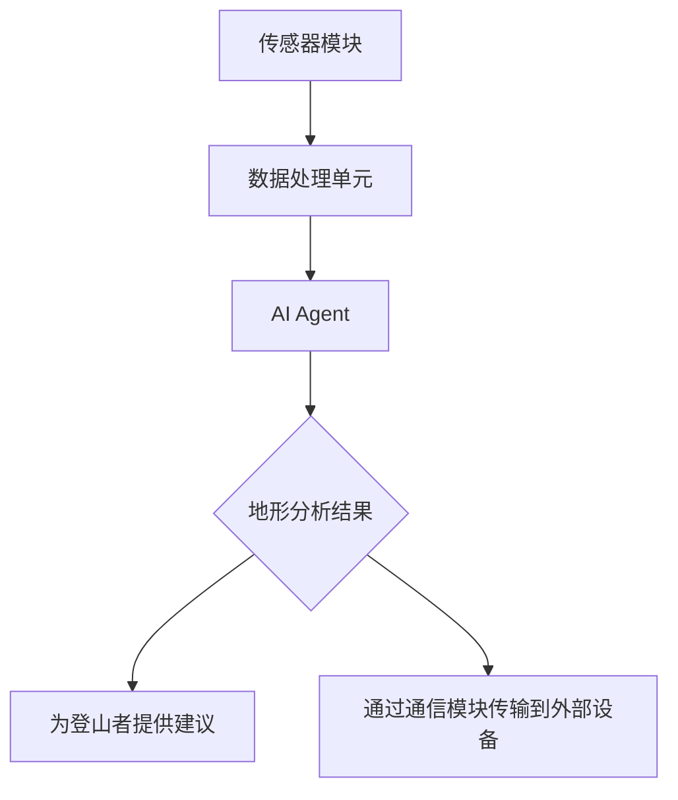

# AI Agent在智能登山杖中的地形分析

> 关键词：AI Agent、智能登山杖、地形分析、机器学习、传感器融合

> 摘要：本文深入探讨了AI Agent在智能登山杖中进行地形分析的相关技术。详细介绍了AI Agent和智能登山杖的核心概念及其联系，阐述了用于地形分析的核心算法原理和具体操作步骤，包括使用Python代码进行示例说明。同时，给出了相关的数学模型和公式，并通过实际案例进行解释。在项目实战部分，介绍了开发环境搭建、源代码实现与解读。还探讨了AI Agent在智能登山杖地形分析中的实际应用场景，推荐了相关的学习资源、开发工具框架和论文著作。最后总结了未来发展趋势与挑战，并提供了常见问题解答和扩展阅读参考资料。

## 1. 背景介绍 
### 1.1 目的和范围
本文章旨在详细介绍AI Agent在智能登山杖地形分析中的应用。通过对相关技术的深入探讨，帮助读者了解如何利用AI Agent技术提升智能登山杖对地形的分析能力，为登山者提供更准确、更有价值的地形信息。范围涵盖了从核心概念的解释到实际项目的开发，以及未来发展趋势的展望。

### 1.2 预期读者
本文的预期读者包括对人工智能、智能硬件开发感兴趣的技术人员，如程序员、软件架构师等；从事户外运动装备研发的工程师；以及对登山运动和智能设备结合有兴趣的爱好者。

### 1.3 文档结构概述
本文首先介绍了AI Agent和智能登山杖地形分析的背景知识，包括目的、预期读者和文档结构。接着阐述了核心概念与联系，通过文本示意图和Mermaid流程图进行说明。然后详细讲解了核心算法原理和具体操作步骤，给出了Python代码示例。之后介绍了相关的数学模型和公式，并举例说明。在项目实战部分，介绍了开发环境搭建、源代码实现和代码解读。随后探讨了实际应用场景，推荐了学习资源、开发工具框架和论文著作。最后总结了未来发展趋势与挑战，提供了常见问题解答和扩展阅读参考资料。

### 1.4 术语表
#### 1.4.1 核心术语定义
- **AI Agent**：人工智能代理，是一种能够感知环境、进行决策并采取行动以实现特定目标的智能实体。在本文中，AI Agent用于分析智能登山杖所获取的地形信息。
- **智能登山杖**：配备了多种传感器和智能计算模块的登山杖，能够收集环境数据并进行分析处理，为登山者提供相关的信息和建议。
- **地形分析**：对登山过程中遇到的地形特征进行识别、分类和评估的过程，包括坡度、海拔、地形类型等。

#### 1.4.2 相关概念解释
- **传感器融合**：将多种不同类型传感器（如加速度计、陀螺仪、气压计等）的数据进行整合处理，以获取更准确、更全面的信息。
- **机器学习**：让计算机通过数据学习模式和规律，从而能够做出预测和决策的技术。在地形分析中，机器学习算法可以用于地形特征的识别和分类。

#### 1.4.3 缩略词列表
- **GPS**：Global Positioning System，全球定位系统，用于获取登山者的位置信息。
- **IMU**：Inertial Measurement Unit，惯性测量单元，通常包含加速度计和陀螺仪，用于测量物体的运动和姿态。

## 2. 核心概念与联系 

### 核心概念原理
#### AI Agent原理
AI Agent的核心原理是基于感知、决策和行动的循环。它通过传感器感知环境信息，然后根据内部的知识和算法进行决策，最后采取相应的行动。在智能登山杖的地形分析中，AI Agent通过登山杖上的各种传感器（如GPS、IMU、气压计等）获取地形相关的数据，对这些数据进行分析处理，识别地形特征（如坡度、海拔变化、地形类型等），并根据分析结果为登山者提供相应的建议（如调整登山步伐、注意安全等）。

#### 智能登山杖原理
智能登山杖集成了多种传感器和计算模块。传感器负责收集登山过程中的各种数据，如位置、运动状态、气压等。计算模块则对这些数据进行处理和分析，利用AI Agent技术实现地形分析功能。同时，智能登山杖还可以通过无线通信模块将分析结果传输到用户的手机或其他设备上，方便用户查看。

### 架构的文本示意图
```plaintext
智能登山杖
|-- 传感器模块
|   |-- GPS传感器：获取位置信息
|   |-- IMU传感器：测量运动和姿态
|   |-- 气压计：测量海拔高度
|   |-- 其他传感器（如摄像头等）：获取更多环境信息
|-- 计算模块
|   |-- AI Agent：分析传感器数据，进行地形分析
|   |-- 数据处理单元：对传感器数据进行预处理
|-- 通信模块
|   |-- 无线通信：将分析结果传输到外部设备
|-- 电源模块
|   |-- 电池：为登山杖提供电力
```

### Mermaid流程图


## 3. 核心算法原理 & 具体操作步骤 

### 核心算法原理
在智能登山杖的地形分析中，常用的核心算法包括机器学习算法，如决策树、支持向量机、神经网络等。这里以决策树算法为例进行说明。

决策树算法是一种基于树结构进行决策的算法。它通过对训练数据的学习，构建一棵决策树，树的每个内部节点是一个属性上的测试，每个分支是一个测试输出，每个叶节点是一个类别或值。在地形分析中，决策树可以根据传感器获取的各种特征（如坡度、海拔变化率等）对地形进行分类（如平坦地形、上坡地形、下坡地形等）。

### 具体操作步骤
#### 步骤1：数据收集
使用智能登山杖上的传感器收集地形相关的数据，包括位置、海拔、运动状态等。例如，GPS传感器可以获取登山者的经纬度信息，气压计可以测量海拔高度，IMU传感器可以测量加速度和角速度。

#### 步骤2：数据预处理
对收集到的数据进行预处理，包括数据清洗、特征提取和归一化等操作。数据清洗用于去除噪声和异常值，特征提取用于从原始数据中提取有用的特征，归一化用于将特征值缩放到相同的范围，以便于算法处理。

#### 步骤3：模型训练
使用预处理后的数据训练决策树模型。将数据分为训练集和测试集，使用训练集对决策树模型进行训练，调整模型的参数，使其能够准确地对地形进行分类。

#### 步骤4：模型评估
使用测试集对训练好的决策树模型进行评估，计算模型的准确率、召回率等指标，评估模型的性能。

#### 步骤5：地形分析
将实时收集到的传感器数据输入到训练好的决策树模型中，模型根据输入的数据进行地形分类，输出地形分析结果。

### Python源代码示例
```python
import numpy as np
from sklearn.tree import DecisionTreeClassifier
from sklearn.model_selection import train_test_split
from sklearn.metrics import accuracy_score

# 模拟传感器数据
# 假设我们有三个特征：坡度、海拔变化率、运动速度
X = np.array([[10, 2, 3], [20, 3, 2], [5, 1, 4], [15, 2, 2], [25, 4, 1]])
# 对应的地形类别：0表示平坦地形，1表示上坡地形，2表示下坡地形
y = np.array([0, 1, 0, 1, 2])

# 划分训练集和测试集
X_train, X_test, y_train, y_test = train_test_split(X, y, test_size=0.2, random_state=42)

# 创建决策树分类器
clf = DecisionTreeClassifier()

# 训练模型
clf.fit(X_train, y_train)

# 预测测试集
y_pred = clf.predict(X_test)

# 计算准确率
accuracy = accuracy_score(y_test, y_pred)
print("模型准确率:", accuracy)

# 模拟实时传感器数据进行地形分析
new_data = np.array([[12, 2.5, 2.5]])
predicted_terrain = clf.predict(new_data)
print("预测的地形类别:", predicted_terrain)
```

## 4. 数学模型和公式 & 详细讲解 & 举例说明 

### 决策树算法的数学模型
决策树算法的核心是信息增益的计算。信息增益用于衡量一个属性对分类的重要性，信息增益越大，说明该属性对分类的贡献越大。

#### 信息熵
信息熵是衡量数据纯度的指标，计算公式为：
$$H(X) = -\sum_{i=1}^{n}p(x_i)\log_2p(x_i)$$
其中，$X$ 是一个随机变量，$p(x_i)$ 是 $x_i$ 出现的概率。

#### 条件熵
条件熵是在给定某个属性 $A$ 的条件下，数据的熵，计算公式为：
$$H(X|A) = \sum_{j=1}^{m}p(a_j)H(X|A=a_j)$$
其中，$a_j$ 是属性 $A$ 的第 $j$ 个取值，$p(a_j)$ 是 $a_j$ 出现的概率，$H(X|A=a_j)$ 是在属性 $A$ 取值为 $a_j$ 的条件下，数据的熵。

#### 信息增益
信息增益是信息熵与条件熵的差值，计算公式为：
$$IG(X,A) = H(X) - H(X|A)$$

### 详细讲解
在决策树的构建过程中，每次选择信息增益最大的属性作为当前节点的划分属性。通过不断地划分，直到满足某个终止条件（如所有样本属于同一类别或没有更多的属性可供划分），最终构建出一棵决策树。

### 举例说明
假设我们有一个数据集，包含两个属性：天气（晴天、阴天）和温度（高、低），以及对应的活动类别（外出、不外出）。数据集如下：
| 天气 | 温度 | 活动 |
| ---- | ---- | ---- |
| 晴天 | 高   | 外出 |
| 晴天 | 低   | 外出 |
| 阴天 | 高   | 不外出 |
| 阴天 | 低   | 不外出 |

首先计算信息熵 $H(活动)$：
$p(外出) = 0.5$，$p(不外出) = 0.5$
$$H(活动) = -0.5\log_20.5 - 0.5\log_20.5 = 1$$

然后计算在天气属性下的条件熵 $H(活动|天气)$：
- 当天气为晴天时，$p(外出|晴天) = 1$，$p(不外出|晴天) = 0$，$H(活动|天气=晴天) = 0$
- 当天气为阴天时，$p(外出|阴天) = 0$，$p(不外出|阴天) = 1$，$H(活动|天气=阴天) = 0$
$p(晴天) = 0.5$，$p(阴天) = 0.5$
$$H(活动|天气) = 0.5\times0 + 0.5\times0 = 0$$

最后计算信息增益 $IG(活动,天气)$：
$$IG(活动,天气) = H(活动) - H(活动|天气) = 1 - 0 = 1$$

同理，可以计算在温度属性下的信息增益。通过比较不同属性的信息增益，选择信息增益最大的属性作为根节点的划分属性。

## 5. 项目实战：代码实际案例和详细解释说明 

### 5.1  开发环境搭建
#### 硬件环境
- 智能登山杖开发板，配备GPS传感器、IMU传感器、气压计等。
- 电脑，用于代码开发和调试。

#### 软件环境
- 操作系统：Windows、Linux或macOS。
- 编程语言：Python 3.x。
- 开发工具：PyCharm、Jupyter Notebook等。
- 相关库：NumPy、Pandas、Scikit-learn等。

### 5.2  源代码详细实现和代码解读
```python
import numpy as np
import pandas as pd
from sklearn.tree import DecisionTreeClassifier
from sklearn.model_selection import train_test_split
from sklearn.metrics import accuracy_score

# 读取传感器数据文件
def read_sensor_data(file_path):
    data = pd.read_csv(file_path)
    return data

# 数据预处理
def preprocess_data(data):
    # 去除缺失值
    data = data.dropna()
    # 提取特征和标签
    X = data.drop('terrain_type', axis=1).values
    y = data['terrain_type'].values
    # 归一化处理
    X = (X - np.mean(X, axis=0)) / np.std(X, axis=0)
    return X, y

# 模型训练和评估
def train_and_evaluate_model(X, y):
    # 划分训练集和测试集
    X_train, X_test, y_train, y_test = train_test_split(X, y, test_size=0.2, random_state=42)
    # 创建决策树分类器
    clf = DecisionTreeClassifier()
    # 训练模型
    clf.fit(X_train, y_train)
    # 预测测试集
    y_pred = clf.predict(X_test)
    # 计算准确率
    accuracy = accuracy_score(y_test, y_pred)
    print("模型准确率:", accuracy)
    return clf

# 实时地形分析
def real_time_terrain_analysis(model, new_data):
    # 归一化新数据
    new_data = (new_data - np.mean(new_data, axis=0)) / np.std(new_data, axis=0)
    # 预测地形类别
    predicted_terrain = model.predict(new_data)
    return predicted_terrain

# 主函数
def main():
    # 读取传感器数据
    file_path = 'sensor_data.csv'
    data = read_sensor_data(file_path)
    # 数据预处理
    X, y = preprocess_data(data)
    # 模型训练和评估
    model = train_and_evaluate_model(X, y)
    # 模拟实时传感器数据
    new_data = np.array([[12, 2.5, 2.5]])
    # 实时地形分析
    predicted_terrain = real_time_terrain_analysis(model, new_data)
    print("预测的地形类别:", predicted_terrain)

if __name__ == "__main__":
    main()
```

### 代码解读与分析
- **read_sensor_data函数**：用于读取传感器数据文件，使用Pandas库的`read_csv`函数将CSV文件读取为DataFrame对象。
- **preprocess_data函数**：对读取的数据进行预处理，包括去除缺失值、提取特征和标签、归一化处理等操作。
- **train_and_evaluate_model函数**：将数据划分为训练集和测试集，创建决策树分类器，使用训练集训练模型，使用测试集评估模型的准确率。
- **real_time_terrain_analysis函数**：对实时传感器数据进行归一化处理，然后使用训练好的模型进行地形类别预测。
- **main函数**：调用上述函数，完成数据读取、预处理、模型训练和评估、实时地形分析等操作。

## 6. 实际应用场景 
### 登山安全保障
AI Agent在智能登山杖中的地形分析功能可以为登山者提供实时的地形信息，帮助登山者了解当前所处的地形状况，如坡度、海拔变化等。当遇到危险地形（如陡峭山坡、悬崖等）时，智能登山杖可以及时发出警报，提醒登山者注意安全，避免发生意外事故。

### 登山路线规划
通过对地形的分析，智能登山杖可以为登山者提供最佳的登山路线建议。根据地形的难易程度、距离、海拔变化等因素，AI Agent可以计算出不同路线的优缺点，帮助登山者选择最适合自己的路线，提高登山效率和体验。

### 户外运动研究
智能登山杖收集的地形数据可以为户外运动研究提供有价值的信息。研究人员可以分析不同地区的地形特征、登山者的行为模式等，为户外运动的发展和规划提供科学依据。

## 7. 工具和资源推荐
### 7.1 学习资源推荐
#### 7.1.1 书籍推荐
- 《机器学习》（周志华）：全面介绍了机器学习的基本概念、算法和应用，是学习机器学习的经典教材。
- 《Python机器学习》（Sebastian Raschka）：结合Python语言，详细介绍了机器学习的各种算法和实现方法。
- 《人工智能：一种现代的方法》（Stuart Russell、Peter Norvig）：涵盖了人工智能的各个领域，包括搜索算法、知识表示、机器学习等。

#### 7.1.2 在线课程
- Coursera上的“机器学习”课程（Andrew Ng）：由斯坦福大学教授Andrew Ng主讲，是学习机器学习的入门经典课程。
- edX上的“人工智能基础”课程：介绍了人工智能的基本概念、算法和应用，适合初学者学习。
- 中国大学MOOC上的“Python数据分析与机器学习实战”课程：结合Python语言，讲解了数据分析和机器学习的实际应用。

#### 7.1.3 技术博客和网站
- 博客园：汇聚了众多技术人员的博客文章，包含了大量关于人工智能、机器学习的技术分享。
- 开源中国：提供了丰富的开源项目和技术文章，对于学习和实践有很大的帮助。
- Kaggle：一个数据科学竞赛平台，上面有很多关于机器学习和数据分析的案例和教程。

### 7.2 开发工具框架推荐
#### 7.2.1 IDE和编辑器
- PyCharm：一款专门为Python开发设计的集成开发环境，功能强大，提供了代码编辑、调试、版本控制等功能。
- Jupyter Notebook：一个交互式的开发环境，适合进行数据探索和模型实验，支持多种编程语言。
- Visual Studio Code：一款轻量级的代码编辑器，支持多种编程语言和插件扩展，具有良好的开发体验。

#### 7.2.2 调试和性能分析工具
- PySnooper：一个简单易用的Python调试工具，可以自动记录函数的调用过程和变量的值，方便调试代码。
- cProfile：Python内置的性能分析工具，可以分析代码的运行时间和函数调用次数，帮助优化代码性能。
- TensorBoard：一个用于可视化深度学习模型训练过程的工具，可以查看模型的损失函数、准确率等指标的变化情况。

#### 7.2.3 相关框架和库
- Scikit-learn：一个简单易用的机器学习库，提供了各种机器学习算法和工具，如分类、回归、聚类等。
- TensorFlow：一个开源的深度学习框架，广泛应用于图像识别、自然语言处理等领域。
- PyTorch：另一个流行的深度学习框架，具有动态图机制，易于使用和调试。

### 7.3 相关论文著作推荐
#### 7.3.1 经典论文
- 《A Decision-Theoretic Generalization of On-Line Learning and an Application to Boosting》（Yoav Freund、Robert E. Schapire）：介绍了Boosting算法的基本原理和应用。
- 《ImageNet Classification with Deep Convolutional Neural Networks》（Alex Krizhevsky、Ilya Sutskever、Geoffrey E. Hinton）：提出了AlexNet卷积神经网络，开创了深度学习在图像识别领域的应用。
- 《Attention Is All You Need》（Ashish Vaswani、Noam Shazeer等）：提出了Transformer模型，在自然语言处理领域取得了巨大的成功。

#### 7.3.2 最新研究成果
- 《Graph Neural Networks for Terrain Analysis in Outdoor Environments》：研究了图神经网络在户外地形分析中的应用。
- 《Multi-Sensor Fusion for Intelligent Hiking Stick with AI Agent》：探讨了多传感器融合技术在智能登山杖中的应用。

#### 7.3.3 应用案例分析
- 《Case Study: Using AI Agent in Smart Hiking Stick for Mountain Rescue》：介绍了AI Agent在智能登山杖中用于山地救援的实际案例。
- 《Analysis of Terrain Adaptation Strategies for Hiking Based on Smart Hiking Stick Data》：基于智能登山杖数据对登山地形适应策略进行了分析。

## 8. 总结：未来发展趋势与挑战
### 未来发展趋势
#### 更精准的地形分析
随着传感器技术的不断发展，智能登山杖将能够获取更准确、更丰富的地形数据。同时，AI Agent的算法也将不断优化，能够更精准地识别和分类各种地形，为登山者提供更详细、更可靠的地形信息。

#### 多模态融合
未来的智能登山杖将不仅仅依赖于传统的传感器（如GPS、IMU等），还将融合更多的模态信息，如视觉、听觉等。例如，配备摄像头可以获取地形的图像信息，进一步提高地形分析的准确性和全面性。

#### 个性化服务
根据登山者的个人身体状况、登山经验等因素，智能登山杖可以提供个性化的地形分析和建议。例如，对于新手登山者，智能登山杖可以提供更详细的安全提示和路线规划；对于有经验的登山者，可以提供更具挑战性的地形信息和探索建议。

### 挑战
#### 数据隐私和安全
智能登山杖收集的大量地形数据和用户信息涉及到个人隐私和安全问题。如何保护这些数据不被泄露和滥用，是未来需要解决的重要问题。

#### 复杂环境适应性
登山环境复杂多变，如恶劣天气、高山缺氧等，这些因素可能会影响传感器的性能和AI Agent的分析结果。如何提高智能登山杖在复杂环境下的适应性和可靠性，是一个挑战。

#### 算法复杂度和计算资源
随着AI Agent算法的不断复杂和数据量的增加，对计算资源的需求也越来越大。而智能登山杖的计算能力和电池续航能力有限，如何在有限的资源下实现高效的地形分析算法，是需要解决的问题。

## 9. 附录：常见问题与解答
### 问题1：智能登山杖的传感器数据准确性如何保证？
解答：传感器数据的准确性可以通过以下方法保证：选择高质量的传感器，进行定期的校准和维护，采用传感器融合技术将多种传感器的数据进行整合处理，提高数据的准确性和可靠性。

### 问题2：AI Agent在智能登山杖中的运行速度如何？
解答：AI Agent的运行速度取决于多个因素，如算法复杂度、计算资源、数据量等。可以通过优化算法、采用高效的计算芯片、减少不必要的数据处理等方法来提高运行速度。

### 问题3：智能登山杖的电池续航能力如何？
解答：电池续航能力与登山杖的功能、传感器的使用频率、计算模块的功耗等因素有关。可以通过优化硬件设计、降低功耗、采用节能模式等方法来延长电池续航时间。

### 问题4：智能登山杖的地形分析结果是否可靠？
解答：地形分析结果的可靠性取决于传感器数据的准确性、AI Agent算法的性能以及模型的训练质量等因素。通过不断优化传感器技术、改进算法和进行充分的模型训练，可以提高地形分析结果的可靠性。

## 10. 扩展阅读 & 参考资料
### 扩展阅读
- 《智能硬件开发实战》
- 《深度学习实战案例解析》
- 《户外运动安全与急救》

### 参考资料
- 相关传感器的技术手册和文档
- 机器学习和人工智能领域的学术论文和研究报告
- 智能登山杖相关的专利和产品说明书

作者：AI天才研究院/AI Genius Institute & 禅与计算机程序设计艺术 /Zen And The Art of Computer Programming