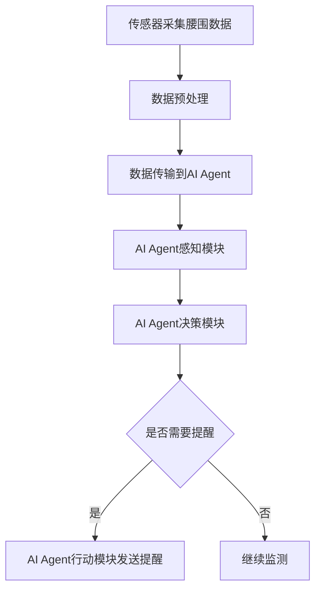

# AI Agent在智能皮带中的腰围监测

> 关键词：AI Agent、智能皮带、腰围监测、传感器技术、数据分析

> 摘要：本文深入探讨了AI Agent在智能皮带腰围监测中的应用。首先介绍了相关背景，包括目的范围、预期读者等。接着阐述了核心概念，如AI Agent和智能皮带腰围监测的原理及联系，并给出示意图和流程图。详细讲解了核心算法原理和具体操作步骤，同时给出Python源代码。通过数学模型和公式进一步剖析监测过程，并举例说明。进行了项目实战，包括开发环境搭建、源代码实现和解读。探讨了实际应用场景，推荐了学习资源、开发工具框架和相关论文著作。最后总结了未来发展趋势与挑战，还提供了常见问题解答和扩展阅读参考资料，旨在为相关领域的研究和开发提供全面的技术指导。

## 1. 背景介绍 
### 1.1 目的和范围
本研究的主要目的是探索如何将AI Agent技术应用于智能皮带的腰围监测功能中，以提高腰围监测的准确性、智能化程度和用户体验。通过结合AI Agent的自主决策和学习能力，使智能皮带能够更好地适应不同用户的需求和使用场景，为用户提供更精准的健康数据和个性化的健康建议。

研究范围涵盖了从AI Agent的基本原理和技术架构，到智能皮带腰围监测的传感器技术、数据处理算法，再到实际应用场景的开发和验证。同时，还将探讨如何利用AI Agent的学习能力，不断优化腰围监测的性能和功能。

### 1.2 预期读者
本文的预期读者包括从事人工智能、传感器技术、可穿戴设备开发等领域的科研人员、工程师和技术爱好者。对于关注健康监测和智能穿戴设备发展的普通用户，也可以通过本文了解AI Agent在智能皮带腰围监测中的应用原理和潜在价值。

### 1.3 文档结构概述
本文将按照以下结构进行组织：
- 核心概念与联系：介绍AI Agent和智能皮带腰围监测的核心概念，以及它们之间的联系，并通过示意图和流程图进行直观展示。
- 核心算法原理 & 具体操作步骤：详细讲解用于腰围监测的核心算法原理，并给出具体的操作步骤和Python源代码。
- 数学模型和公式 & 详细讲解 & 举例说明：建立腰围监测的数学模型，给出相关公式，并通过具体例子进行详细讲解。
- 项目实战：代码实际案例和详细解释说明：进行项目实战，包括开发环境搭建、源代码实现和代码解读。
- 实际应用场景：探讨AI Agent在智能皮带腰围监测中的实际应用场景。
- 工具和资源推荐：推荐学习资源、开发工具框架和相关论文著作。
- 总结：未来发展趋势与挑战：总结AI Agent在智能皮带腰围监测中的应用现状，分析未来发展趋势和面临的挑战。
- 附录：常见问题与解答：提供常见问题的解答，帮助读者更好地理解和应用相关技术。
- 扩展阅读 & 参考资料：提供扩展阅读的建议和相关参考资料，方便读者深入研究。

### 1.4 术语表
#### 1.4.1 核心术语定义
- **AI Agent**：人工智能代理，是一种能够感知环境、做出决策并采取行动以实现特定目标的智能实体。
- **智能皮带**：集成了传感器、处理器和通信模块等技术，能够实现对腰围等数据进行监测和分析的皮带。
- **腰围监测**：通过传感器技术实时测量人体腰围的变化，并对数据进行处理和分析的过程。
- **传感器**：用于感知物理量（如压力、应变等）并将其转换为电信号的装置。
- **数据处理算法**：对传感器采集到的数据进行处理和分析的算法，以提取有用的信息。

#### 1.4.2 相关概念解释
- **机器学习**：是一门多领域交叉学科，涉及概率论、统计学、逼近论、凸分析、算法复杂度理论等多门学科。它专门研究计算机怎样模拟或实现人类的学习行为，以获取新的知识或技能，重新组织已有的知识结构使之不断改善自身的性能。
- **深度学习**：是机器学习的一个分支领域，它是一种基于对数据进行表征学习的方法。深度学习通过构建具有很多层的神经网络模型，自动从大量数据中学习到复杂的模式和特征。
- **传感器融合**：将多个不同类型的传感器数据进行综合处理，以提高监测的准确性和可靠性。

#### 1.4.3 缩略词列表
- **AI**：Artificial Intelligence，人工智能
- **ML**：Machine Learning，机器学习
- **DL**：Deep Learning，深度学习
- **MEMS**：Micro-Electro-Mechanical Systems，微机电系统

## 2. 核心概念与联系 

### 核心概念原理
#### AI Agent原理
AI Agent可以看作是一个具有自主性、反应性、社会性和能动性的智能实体。它能够通过传感器感知周围环境的信息，然后根据内置的决策规则或学习到的模型，做出相应的决策，并通过执行器采取行动。在智能皮带的腰围监测中，AI Agent可以根据传感器采集到的腰围数据，结合用户的历史数据和健康目标，做出是否需要提醒用户注意腰围变化等决策。

#### 智能皮带腰围监测原理
智能皮带的腰围监测主要依靠安装在皮带上的传感器。常见的传感器包括压力传感器、应变传感器等。压力传感器可以通过测量皮带对人体的压力变化来间接反映腰围的变化；应变传感器则可以通过测量皮带的应变来直接计算腰围的变化。传感器采集到的原始数据经过预处理后，会传输到智能皮带的处理器中进行进一步的分析和处理，最终得到准确的腰围数据。

### 架构的文本示意图
```plaintext
+-------------------+
|    智能皮带       |
|                   |
| +--------------+  |
| | 传感器模块    |  |
| +--------------+  |
| | 数据处理模块  |  |
| +--------------+  |
| | 通信模块      |  |
| +--------------+  |
|                   |
+-------------------+
         |
         | 数据传输
         v
+-------------------+
|    AI Agent       |
|                   |
| +--------------+  |
| | 感知模块      |  |
| +--------------+  |
| | 决策模块      |  |
| +--------------+  |
| | 行动模块      |  |
| +--------------+  |
|                   |
+-------------------+
```

### Mermaid流程图


## 3. 核心算法原理 & 具体操作步骤 

### 核心算法原理
在智能皮带的腰围监测中，核心算法主要包括数据预处理算法和腰围计算算法。

#### 数据预处理算法
传感器采集到的原始数据往往包含噪声和干扰，需要进行预处理以提高数据的质量。常见的数据预处理方法包括滤波、去噪和归一化等。例如，我们可以使用移动平均滤波算法来平滑数据，减少噪声的影响。

#### 腰围计算算法
根据传感器的类型不同，腰围计算算法也有所不同。对于压力传感器，我们可以建立压力与腰围之间的映射关系，通过测量压力值来计算腰围。对于应变传感器，我们可以根据胡克定律，通过测量应变值来计算腰围的变化。

### 具体操作步骤

#### 步骤1：数据采集
使用安装在智能皮带上的传感器采集腰围数据。传感器将采集到的模拟信号转换为数字信号，并传输到数据处理模块。

#### 步骤2：数据预处理
对采集到的原始数据进行预处理，包括滤波、去噪和归一化等操作。以下是一个使用Python实现的移动平均滤波算法的示例代码：
```python
def moving_average_filter(data, window_size):
    filtered_data = []
    for i in range(len(data)):
        if i < window_size:
            filtered_data.append(sum(data[:i+1]) / (i+1))
        else:
            filtered_data.append(sum(data[i-window_size+1:i+1]) / window_size)
    return filtered_data

# 示例数据
raw_data = [1, 2, 3, 4, 5, 6, 7, 8, 9, 10]
window_size = 3
filtered_data = moving_average_filter(raw_data, window_size)
print(filtered_data)
```

#### 步骤3：腰围计算
根据预处理后的数据，使用相应的腰围计算算法计算腰围。以下是一个简单的根据应变传感器数据计算腰围的示例代码：
```python
# 假设应变与腰围变化的比例系数为k
k = 0.1
# 初始腰围
initial_waist = 80
# 应变传感器采集到的应变数据
strain_data = [0.1, 0.2, 0.3, 0.4, 0.5]
waist_data = []
for strain in strain_data:
    waist = initial_waist + strain * k
    waist_data.append(waist)
print(waist_data)
```

#### 步骤4：数据传输
将计算得到的腰围数据通过通信模块传输到AI Agent。

#### 步骤5：AI Agent决策
AI Agent的感知模块接收腰围数据，决策模块根据预设的规则或学习到的模型，判断是否需要采取行动，如发送提醒等。

#### 步骤6：AI Agent行动
如果决策模块判断需要采取行动，行动模块将执行相应的操作，如通过蓝牙发送提醒信息到用户的手机。

## 4. 数学模型和公式 & 详细讲解 & 举例说明 

### 数学模型
在智能皮带的腰围监测中，我们可以建立以下数学模型：

#### 压力传感器模型
假设压力传感器测量的压力值为 $P$，腰围为 $W$，我们可以建立一个线性模型：
$$W = aP + b$$
其中，$a$ 和 $b$ 是模型的参数，需要通过实验数据进行标定。

#### 应变传感器模型
根据胡克定律，应变 $\epsilon$ 与应力 $\sigma$ 之间的关系为：
$$\sigma = E\epsilon$$
其中，$E$ 是材料的弹性模量。假设皮带的长度为 $L$，应变 $\epsilon$ 与腰围变化 $\Delta W$ 之间的关系为：
$$\Delta W = k\epsilon$$
其中，$k$ 是一个比例系数，与皮带的材质和结构有关。因此，腰围 $W$ 可以表示为：
$$W = W_0 + k\epsilon$$
其中，$W_0$ 是初始腰围。

### 详细讲解
#### 压力传感器模型
在实际应用中，我们需要通过实验采集不同腰围下的压力值，然后使用最小二乘法等方法拟合出模型的参数 $a$ 和 $b$。拟合得到的模型可以用于根据压力传感器测量的压力值计算腰围。

#### 应变传感器模型
应变传感器直接测量皮带的应变，通过上述公式可以计算出腰围的变化。在实际应用中，需要准确测量初始腰围 $W_0$ 和比例系数 $k$。比例系数 $k$ 可以通过实验测量得到，初始腰围 $W_0$ 可以由用户手动输入或通过其他方式测量得到。

### 举例说明
#### 压力传感器模型举例
假设我们通过实验采集到以下数据：

| 腰围 $W$ (cm) | 压力 $P$ (kPa) |
| --- | --- |
| 80 | 10 |
| 85 | 12 |
| 90 | 14 |

使用最小二乘法拟合线性模型 $W = aP + b$，可以得到 $a = 2.5$，$b = 55$。因此，当压力传感器测量的压力值为 $P = 13$ kPa 时，腰围 $W$ 可以计算为：
$$W = 2.5\times13 + 55 = 87.5$$ cm

#### 应变传感器模型举例
假设初始腰围 $W_0 = 80$ cm，比例系数 $k = 0.1$，应变传感器测量的应变值为 $\epsilon = 0.2$。则腰围 $W$ 可以计算为：
$$W = 80 + 0.1\times0.2 = 80.02$$ cm

## 5. 项目实战：代码实际案例和详细解释说明 

### 5.1  开发环境搭建
#### 硬件环境
- 智能皮带开发板，集成了压力传感器或应变传感器、处理器和通信模块。
- 电脑，用于开发和调试代码。

#### 软件环境
- 操作系统：Windows、Linux 或 macOS。
- 开发工具：Arduino IDE 或 Python IDE（如 PyCharm）。
- 编程语言：Python 或 C/C++。

### 5.2  源代码详细实现和代码解读
以下是一个使用 Python 实现的简单的智能皮带腰围监测系统的示例代码：

```python
import random
import time

# 模拟传感器采集数据
def sensor_reading():
    # 模拟压力传感器数据
    pressure = random.uniform(10, 20)
    return pressure

# 数据预处理：移动平均滤波
def moving_average_filter(data, window_size):
    filtered_data = []
    for i in range(len(data)):
        if i < window_size:
            filtered_data.append(sum(data[:i+1]) / (i+1))
        else:
            filtered_data.append(sum(data[i-window_size+1:i+1]) / window_size)
    return filtered_data

# 腰围计算：根据压力传感器数据计算腰围
def calculate_waist(pressure):
    # 假设线性模型：W = aP + b
    a = 2.5
    b = 55
    waist = a * pressure + b
    return waist

# AI Agent决策
def ai_agent_decision(waist):
    # 假设腰围超过 90 cm 时发送提醒
    if waist > 90:
        return True
    else:
        return False

# AI Agent行动
def ai_agent_action():
    print("提醒：您的腰围已超过 90 cm，请关注健康！")

# 主程序
if __name__ == "__main__":
    sensor_data = []
    window_size = 3
    while True:
        # 数据采集
        pressure = sensor_reading()
        sensor_data.append(pressure)
        # 数据预处理
        filtered_data = moving_average_filter(sensor_data, window_size)
        # 腰围计算
        waist = calculate_waist(filtered_data[-1])
        print(f"当前腰围：{waist} cm")
        # AI Agent决策
        need_reminder = ai_agent_decision(waist)
        if need_reminder:
            # AI Agent行动
            ai_agent_action()
        time.sleep(1)
```

### 5.3  代码解读与分析
#### 数据采集部分
`sensor_reading` 函数模拟了传感器采集压力数据的过程，返回一个随机的压力值。

#### 数据预处理部分
`moving_average_filter` 函数实现了移动平均滤波算法，对采集到的压力数据进行平滑处理，减少噪声的影响。

#### 腰围计算部分
`calculate_waist` 函数根据压力传感器数据，使用线性模型计算腰围。

#### AI Agent决策部分
`ai_agent_decision` 函数根据计算得到的腰围，判断是否需要发送提醒。如果腰围超过 90 cm，则返回 `True`，否则返回 `False`。

#### AI Agent行动部分
`ai_agent_action` 函数实现了发送提醒的功能，当需要发送提醒时，打印提醒信息。

#### 主程序部分
主程序通过一个无限循环不断采集数据、进行预处理、计算腰围、进行决策和行动。每次循环间隔 1 秒。

## 6. 实际应用场景 
### 健康监测
智能皮带的腰围监测功能可以用于个人健康监测。用户可以通过智能皮带实时了解自己的腰围变化，及时发现腰围异常增加的情况，从而采取相应的措施，如调整饮食、增加运动等，预防肥胖、糖尿病等疾病的发生。

### 运动训练
在运动训练中，智能皮带的腰围监测功能可以帮助运动员或健身爱好者了解自己的身体状态。例如，在进行腹部训练时，通过监测腰围的变化，可以判断训练效果；在进行减肥训练时，通过监测腰围的减少情况，可以评估减肥效果。

### 医疗康复
在医疗康复领域，智能皮带的腰围监测功能可以用于术后康复监测。例如，对于腹部手术患者，通过监测腰围的变化，可以及时发现伤口愈合情况和腹部肿胀情况，为医生提供重要的参考信息。

### 智能家居
智能皮带可以与智能家居系统集成，实现更加智能化的家居控制。例如，当用户的腰围发生变化时，智能皮带可以将信息传输到智能家居系统，自动调整座椅的舒适度、空调的温度等。

## 7. 工具和资源推荐
### 7.1 学习资源推荐
#### 7.1.1 书籍推荐
- 《人工智能：一种现代的方法》：这本书是人工智能领域的经典教材，全面介绍了人工智能的基本概念、算法和应用。
- 《机器学习》：由周志华教授编写，是国内机器学习领域的权威教材，详细介绍了机器学习的各种算法和模型。
- 《深度学习》：由 Ian Goodfellow、Yoshua Bengio 和 Aaron Courville 编写，是深度学习领域的经典著作，深入介绍了深度学习的原理和应用。

#### 7.1.2 在线课程
- Coursera 上的《机器学习》课程：由 Andrew Ng 教授授课，是全球最受欢迎的机器学习课程之一，课程内容丰富，讲解清晰。
- edX 上的《人工智能导论》课程：由麻省理工学院（MIT）的教授授课，系统介绍了人工智能的基本概念和算法。
- 中国大学 MOOC 上的《Python 语言程序设计》课程：适合初学者学习 Python 编程语言，为后续的人工智能和数据分析学习打下基础。

#### 7.1.3 技术博客和网站
- Medium：是一个优秀的技术博客平台，上面有很多关于人工智能、机器学习和传感器技术的优质文章。
- Towards Data Science：专注于数据科学和机器学习领域的技术博客，提供了很多实用的算法和案例。
- 开源中国：国内知名的开源技术社区，上面有很多关于人工智能和可穿戴设备开发的技术文章和开源项目。

### 7.2 开发工具框架推荐
#### 7.2.1 IDE和编辑器
- PyCharm：是一款专业的 Python IDE，提供了丰富的代码编辑、调试和分析功能，适合 Python 开发。
- Arduino IDE：是专门用于 Arduino 开发板的集成开发环境，简单易用，适合初学者。
- Visual Studio Code：是一款轻量级的代码编辑器，支持多种编程语言，具有丰富的插件生态系统。

#### 7.2.2 调试和性能分析工具
- Py-Spy：是一个 Python 性能分析工具，可以实时监测 Python 程序的运行状态，找出性能瓶颈。
- Arduino Debugger：是 Arduino IDE 自带的调试工具，可以帮助开发者调试 Arduino 代码。
- Jupyter Notebook：是一个交互式的开发环境，适合进行数据探索和模型调试。

#### 7.2.3 相关框架和库
- TensorFlow：是 Google 开发的开源机器学习框架，提供了丰富的深度学习模型和工具。
- PyTorch：是 Facebook 开发的开源深度学习框架，具有动态图的优势，适合研究和开发。
- Scikit-learn：是一个简单易用的机器学习库，提供了多种机器学习算法和工具。

### 7.3 相关论文著作推荐
#### 7.3.1 经典论文
- 《A Logical Calculus of the Ideas Immanent in Nervous Activity》：由 Warren McCulloch 和 Walter Pitts 发表于 1943 年，提出了人工神经网络的基本模型。
- 《Learning Representations by Back-propagating Errors》：由 David Rumelhart、Geoffrey Hinton 和 Ronald Williams 发表于 1986 年，介绍了反向传播算法，推动了神经网络的发展。
- 《ImageNet Classification with Deep Convolutional Neural Networks》：由 Alex Krizhevsky、Ilya Sutskever 和 Geoffrey Hinton 发表于 2012 年，提出了 AlexNet 模型，开启了深度学习在计算机视觉领域的应用热潮。

#### 7.3.2 最新研究成果
- 《Attention Is All You Need》：由 Google 团队发表于 2017 年，提出了 Transformer 模型，在自然语言处理领域取得了巨大成功。
- 《Generative Adversarial Nets》：由 Ian Goodfellow 等人发表于 2014 年，提出了生成对抗网络（GAN），为生成式模型的发展做出了重要贡献。
- 《Deep Residual Learning for Image Recognition》：由 Kaiming He 等人发表于 2015 年，提出了残差网络（ResNet），解决了深度神经网络训练中的梯度消失问题。

#### 7.3.3 应用案例分析
- 《Smart Wearable Devices for Health Monitoring: A Review》：该论文对智能可穿戴设备在健康监测领域的应用进行了全面的综述，分析了不同类型的传感器和监测方法。
- 《AI-Enabled Smart Belts for Personal Health Monitoring》：介绍了 AI 技术在智能皮带中的应用，包括腰围监测、心率监测等功能。
- 《Case Studies of Using AI Agents in Healthcare Systems》：通过实际案例分析了 AI Agent 在医疗保健系统中的应用，为智能皮带的开发提供了参考。

## 8. 总结：未来发展趋势与挑战
### 未来发展趋势
#### 智能化程度不断提高
随着 AI 技术的不断发展，智能皮带的智能化程度将不断提高。AI Agent 将能够更加准确地感知用户的需求和健康状态，提供更加个性化的健康建议和服务。

#### 多功能集成
未来的智能皮带将不仅仅具备腰围监测功能，还将集成更多的健康监测功能，如心率监测、血压监测、睡眠监测等，为用户提供更加全面的健康数据。

#### 与其他设备的互联互通
智能皮带将与智能手机、智能手表、智能家居等设备实现更加紧密的互联互通，实现数据的共享和交互，为用户提供更加便捷的使用体验。

#### 应用场景不断拓展
智能皮带的应用场景将不断拓展，除了健康监测、运动训练和医疗康复等领域，还将在工业、农业、交通等领域得到广泛应用。

### 挑战
#### 传感器技术的限制
目前，智能皮带的传感器技术还存在一定的局限性，如测量精度不够高、稳定性不够好等。需要进一步研发更加高精度、高稳定性的传感器技术。

#### 数据安全和隐私问题
智能皮带采集的用户健康数据属于敏感信息，需要采取有效的措施保障数据的安全和隐私。如何防止数据泄露和滥用是一个亟待解决的问题。

#### 算法的复杂度和效率
随着智能皮带功能的不断增加，算法的复杂度也将不断提高。如何在保证算法准确性的前提下，提高算法的效率，降低计算资源的消耗，是一个挑战。

#### 用户接受度
智能皮带作为一种新兴的可穿戴设备，用户对其接受度还需要进一步提高。需要加强对用户的宣传和教育，提高用户对智能皮带的认知和信任度。

## 9. 附录：常见问题与解答
### 问题1：智能皮带的腰围监测准确吗？
解答：智能皮带的腰围监测准确性受到多种因素的影响，如传感器的精度、安装位置、数据处理算法等。一般来说，经过精心设计和校准的智能皮带可以达到较高的监测准确性，但仍可能存在一定的误差。

### 问题2：智能皮带的续航能力如何？
解答：智能皮带的续航能力取决于电池容量、传感器功耗和数据处理频率等因素。不同型号的智能皮带续航能力可能有所不同，一般可以达到数天到数周不等。

### 问题3：智能皮带的数据可以同步到手机上吗？
解答：大多数智能皮带支持通过蓝牙或 Wi-Fi 等方式将数据同步到手机上。用户可以通过手机上的应用程序查看自己的腰围数据和健康报告。

### 问题4：智能皮带适合哪些人群使用？
解答：智能皮带适合大多数人群使用，特别是关注健康、注重生活品质的人群。对于肥胖人群、糖尿病患者等需要监测腰围变化的人群，智能皮带具有更大的实用价值。

### 问题5：智能皮带的价格贵吗？
解答：智能皮带的价格因品牌、功能和性能等因素而异。一般来说，市场上的智能皮带价格在几百元到数千元不等。用户可以根据自己的需求和预算选择适合自己的智能皮带。

## 10. 扩展阅读 & 参考资料
### 扩展阅读
- 《智能可穿戴设备设计与开发》：深入介绍了智能可穿戴设备的设计原理和开发技术，为智能皮带的开发提供了更全面的指导。
- 《人工智能与健康医疗》：探讨了人工智能在健康医疗领域的应用现状和未来发展趋势，有助于了解智能皮带在健康监测领域的应用前景。
- 《传感器技术与应用》：详细介绍了各种传感器的原理和应用，对于理解智能皮带中传感器的工作原理有很大帮助。

### 参考资料
- [1] McCarthy, J. (2007). What Is Artificial Intelligence?. Stanford Artificial Intelligence Laboratory.
- [2] Mitchell, T. M. (1997). Machine Learning. McGraw-Hill.
- [3] Goodfellow, I., Bengio, Y., & Courville, A. (2016). Deep Learning. MIT Press.
- [4] Ng, A. (2012). Machine Learning Course on Coursera.
- [5] Abadi, M., et al. (2016). TensorFlow: Large-Scale Machine Learning on Heterogeneous Distributed Systems.

作者：AI天才研究院/AI Genius Institute & 禅与计算机程序设计艺术 /Zen And The Art of Computer Programming