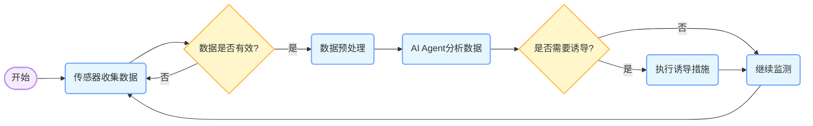

# AI Agent在智能眼罩中的深度睡眠诱导

> 关键词：AI Agent、智能眼罩、深度睡眠诱导、机器学习、生物反馈

> 摘要：本文深入探讨了AI Agent在智能眼罩中用于深度睡眠诱导的相关技术。详细介绍了AI Agent和智能眼罩的核心概念及联系，阐述了其核心算法原理和具体操作步骤，包括使用Python代码进行说明。通过数学模型和公式对其工作原理进行了详细讲解，并给出了实际案例。同时探讨了该技术的实际应用场景，推荐了相关的学习资源、开发工具框架和论文著作。最后总结了其未来发展趋势与挑战，并对常见问题进行了解答。

## 1. 背景介绍 
### 1.1 目的和范围
睡眠质量对人们的身心健康至关重要，深度睡眠更是恢复体力和精力的关键阶段。然而，现代社会的压力、不良的生活习惯等因素导致很多人存在睡眠问题。智能眼罩作为一种可穿戴设备，具有监测和改善睡眠的潜力。AI Agent的引入为智能眼罩的深度睡眠诱导功能带来了新的突破。本文旨在全面介绍AI Agent在智能眼罩中实现深度睡眠诱导的技术原理、实际应用和未来发展，涵盖从核心概念到具体代码实现，再到实际应用场景和资源推荐等多个方面。

### 1.2 预期读者
本文适合对人工智能、可穿戴设备、睡眠健康等领域感兴趣的专业人士，如人工智能研究者、软件开发者、硬件工程师、睡眠医学专家等。同时，也可供对智能眼罩和深度睡眠诱导技术有一定了解的普通爱好者阅读，帮助他们深入理解相关技术原理和应用。

### 1.3 文档结构概述
本文首先介绍了相关的核心概念和术语，包括AI Agent和智能眼罩的定义及它们之间的联系。接着详细阐述了核心算法原理和具体操作步骤，通过Python代码进行了说明。然后使用数学模型和公式对其工作原理进行了深入讲解，并给出了实际案例。之后探讨了该技术的实际应用场景，推荐了学习资源、开发工具框架和相关论文著作。最后总结了未来发展趋势与挑战，解答了常见问题，并提供了扩展阅读和参考资料。

### 1.4 术语表
#### 1.4.1 核心术语定义
- **AI Agent**：人工智能代理，是一种能够感知环境、根据感知信息做出决策并采取行动以实现特定目标的软件或硬件实体。在本文中，AI Agent用于分析智能眼罩收集的睡眠数据，并根据分析结果采取相应的深度睡眠诱导措施。
- **智能眼罩**：一种集成了多种传感器和电子元件的可穿戴设备，能够监测用户的睡眠状态，如脑电波、眼动、心率等，并通过特定的技术手段诱导用户进入深度睡眠。
- **深度睡眠**：睡眠的一个阶段，也称为慢波睡眠，此时大脑活动减缓，身体得到充分的休息和恢复。

#### 1.4.2 相关概念解释
- **机器学习**：是AI Agent实现智能决策的重要手段，通过对大量数据的学习和分析，建立模型并预测未知数据。在深度睡眠诱导中，机器学习算法可以根据历史睡眠数据预测用户的睡眠状态，并提供相应的诱导策略。
- **生物反馈**：是指通过监测人体的生理信号，如脑电波、心率等，将这些信息反馈给用户或系统，以便调整行为或采取相应的干预措施。智能眼罩利用生物反馈技术，将用户的睡眠状态信息反馈给AI Agent，从而实现个性化的深度睡眠诱导。

#### 1.4.3 缩略词列表
- **EEG**：脑电图（Electroencephalogram），用于记录大脑电活动的技术，智能眼罩可通过EEG传感器监测用户的脑电波。
- **HRV**：心率变异性（Heart Rate Variability），反映心脏自主神经系统调节功能的指标，智能眼罩可通过心率传感器监测HRV。

## 2. 核心概念与联系 
### 核心概念原理
#### AI Agent原理
AI Agent的核心是感知、决策和行动三个环节。感知环节通过传感器收集环境信息，在智能眼罩中，这些传感器可以是EEG传感器、心率传感器、眼动传感器等，用于收集用户的睡眠状态信息。决策环节利用机器学习算法对感知到的信息进行分析和处理，建立睡眠状态模型，并根据模型预测用户当前的睡眠阶段和是否需要进行深度睡眠诱导。行动环节根据决策结果采取相应的措施，如调节眼罩的光照强度、播放舒缓的音乐等，以诱导用户进入深度睡眠。

#### 智能眼罩原理
智能眼罩主要由传感器模块、处理模块和执行模块组成。传感器模块负责收集用户的生理信号，如脑电波、心率、眼动等。处理模块对传感器收集到的数据进行处理和分析，判断用户的睡眠状态。执行模块根据处理模块的分析结果，采取相应的深度睡眠诱导措施，如调节光照、播放音乐、发出微弱的震动等。

### 架构的文本示意图
```plaintext
AI Agent
├── 感知层
│   ├── EEG传感器
│   ├── 心率传感器
│   ├── 眼动传感器
│   └──...
├── 决策层
│   ├── 机器学习模型
│   └── 决策算法
└── 行动层
    ├── 光照调节模块
    ├── 音乐播放模块
    ├── 震动模块
    └──...

智能眼罩
├── 传感器模块
│   ├── EEG传感器
│   ├── 心率传感器
│   ├── 眼动传感器
│   └──...
├── 处理模块
│   ├── 数据处理算法
│   └── 睡眠状态判断算法
└── 执行模块
    ├── 光照调节模块
    ├── 音乐播放模块
    ├── 震动模块
    └──...
```

### Mermaid流程图


## 3. 核心算法原理 & 具体操作步骤 
### 核心算法原理
在AI Agent用于智能眼罩的深度睡眠诱导中，主要使用的机器学习算法是分类算法，如支持向量机（SVM）、决策树等，用于判断用户的睡眠状态。以支持向量机为例，其基本原理是在特征空间中找到一个最优的超平面，将不同类别的样本分开。在睡眠状态分类中，特征可以是EEG信号的频率、功率谱，心率的平均值、变异性等。

### 具体操作步骤
#### 数据收集
使用智能眼罩的传感器收集用户的睡眠数据，包括EEG、心率、眼动等信息。这些数据可以以时间序列的形式存储。

#### 数据预处理
对收集到的数据进行预处理，包括去除噪声、归一化、特征提取等操作。例如，对于EEG信号，可以使用小波变换进行去噪和特征提取，提取出不同频率段的功率谱作为特征。

#### 模型训练
使用预处理后的数据对支持向量机模型进行训练。将数据分为训练集和测试集，训练集用于训练模型，测试集用于评估模型的性能。

#### 睡眠状态判断
将实时收集到的数据进行预处理后，输入到训练好的支持向量机模型中，得到用户当前的睡眠状态。

#### 深度睡眠诱导
根据睡眠状态判断结果，如果用户处于浅睡眠状态或清醒状态，AI Agent将采取相应的深度睡眠诱导措施，如调节光照强度、播放舒缓的音乐等。

### Python源代码详细阐述
```python
import numpy as np
from sklearn.svm import SVC
from sklearn.model_selection import train_test_split
from sklearn.preprocessing import StandardScaler

# 模拟收集到的睡眠数据
# 假设每个样本有10个特征，共1000个样本
X = np.random.rand(1000, 10)
# 模拟睡眠状态标签，0表示清醒，1表示浅睡眠，2表示深度睡眠
y = np.random.randint(0, 3, 1000)

# 数据预处理：归一化
scaler = StandardScaler()
X = scaler.fit_transform(X)

# 划分训练集和测试集
X_train, X_test, y_train, y_test = train_test_split(X, y, test_size=0.2, random_state=42)

# 创建支持向量机模型
model = SVC(kernel='rbf', C=1.0, gamma='scale')

# 模型训练
model.fit(X_train, y_train)

# 模型评估
accuracy = model.score(X_test, y_test)
print(f"模型准确率: {accuracy}")

# 模拟实时数据
new_data = np.random.rand(1, 10)
new_data = scaler.transform(new_data)

# 预测睡眠状态
predicted_state = model.predict(new_data)
print(f"预测的睡眠状态: {predicted_state}")
```

## 4. 数学模型和公式 & 详细讲解 & 举例说明 
### 支持向量机数学模型
支持向量机的目标是找到一个最优的超平面 $w^T x + b = 0$，使得不同类别的样本能够被最大程度地分开。对于线性可分的情况，其优化问题可以表示为：

$$
\begin{aligned}
\min_{w, b} &\quad \frac{1}{2} \|w\|^2 \\
\text{s.t.} &\quad y_i (w^T x_i + b) \geq 1, \quad i = 1, 2, \cdots, n
\end{aligned}
$$

其中，$w$ 是超平面的法向量，$b$ 是偏置项，$x_i$ 是第 $i$ 个样本，$y_i$ 是第 $i$ 个样本的标签（$y_i \in \{-1, 1\}$）。

### 详细讲解
上述优化问题的目标是最小化超平面的法向量的模长的一半，同时保证所有样本都满足约束条件，即样本到超平面的距离大于等于1。通过引入拉格朗日乘子 $\alpha_i$，可以将上述优化问题转化为对偶问题：

$$
\begin{aligned}
\max_{\alpha} &\quad \sum_{i=1}^{n} \alpha_i - \frac{1}{2} \sum_{i=1}^{n} \sum_{j=1}^{n} \alpha_i \alpha_j y_i y_j x_i^T x_j \\
\text{s.t.} &\quad \sum_{i=1}^{n} \alpha_i y_i = 0 \\
&\quad \alpha_i \geq 0, \quad i = 1, 2, \cdots, n
\end{aligned}
$$

求解对偶问题得到拉格朗日乘子 $\alpha_i$，然后可以计算出 $w$ 和 $b$：

$$
w = \sum_{i=1}^{n} \alpha_i y_i x_i
$$

$$
b = y_j - w^T x_j, \quad \text{where } 0 < \alpha_j < C
$$

### 举例说明
假设我们有两个二维样本点 $(1, 1)$ 和 $(2, 2)$，标签分别为 $-1$ 和 $1$。我们可以将这些样本点代入上述公式进行计算。首先，将样本点表示为矩阵形式：

$$
X = \begin{bmatrix}
1 & 1 \\
2 & 2
\end{bmatrix}, \quad y = \begin{bmatrix}
-1 \\
1
\end{bmatrix}
$$

然后，根据对偶问题的公式进行计算，求解出 $\alpha_i$，进而计算出 $w$ 和 $b$，得到最优的超平面。

## 5. 项目实战：代码实际案例和详细解释说明 
### 5.1  开发环境搭建
#### 硬件环境
- 智能眼罩开发板，集成了EEG传感器、心率传感器、眼动传感器等。
- 计算机，用于运行开发代码和进行模型训练。

#### 软件环境
- Python 3.x，建议使用Python 3.7及以上版本。
- 相关Python库，如NumPy、SciPy、Scikit-learn、Pandas等。可以使用以下命令进行安装：
```sh
pip install numpy scipy scikit-learn pandas
```

### 5.2  源代码详细实现和代码解读
```python
import numpy as np
import pandas as pd
from sklearn.svm import SVC
from sklearn.model_selection import train_test_split
from sklearn.preprocessing import StandardScaler

# 读取睡眠数据
data = pd.read_csv('sleep_data.csv')

# 分离特征和标签
X = data.drop('sleep_state', axis=1).values
y = data['sleep_state'].values

# 数据预处理：归一化
scaler = StandardScaler()
X = scaler.fit_transform(X)

# 划分训练集和测试集
X_train, X_test, y_train, y_test = train_test_split(X, y, test_size=0.2, random_state=42)

# 创建支持向量机模型
model = SVC(kernel='rbf', C=1.0, gamma='scale')

# 模型训练
model.fit(X_train, y_train)

# 模型评估
accuracy = model.score(X_test, y_test)
print(f"模型准确率: {accuracy}")

# 模拟实时数据
new_data = np.random.rand(1, X.shape[1])
new_data = scaler.transform(new_data)

# 预测睡眠状态
predicted_state = model.predict(new_data)
print(f"预测的睡眠状态: {predicted_state}")

# 根据预测结果执行深度睡眠诱导措施
if predicted_state == 0 or predicted_state == 1:
    print("执行深度睡眠诱导措施，如调节光照、播放音乐等")
else:
    print("用户处于深度睡眠状态，继续监测")
```

### 代码解读与分析
1. **数据读取**：使用 `pandas` 库读取存储在 `sleep_data.csv` 中的睡眠数据。
2. **特征和标签分离**：将数据集中的特征和睡眠状态标签分离。
3. **数据预处理**：使用 `StandardScaler` 对特征数据进行归一化处理，使得不同特征具有相同的尺度。
4. **数据集划分**：使用 `train_test_split` 函数将数据集划分为训练集和测试集，比例为8:2。
5. **模型创建和训练**：创建支持向量机模型，并使用训练集进行训练。
6. **模型评估**：使用测试集评估模型的准确率。
7. **实时数据预测**：模拟实时收集到的数据，进行预处理后输入到模型中进行预测。
8. **深度睡眠诱导**：根据预测结果判断是否需要执行深度睡眠诱导措施。

## 6. 实际应用场景 
### 家庭睡眠改善
在家庭环境中，用户可以佩戴智能眼罩，AI Agent根据用户的睡眠状态实时调整诱导措施，如在用户处于浅睡眠状态时，调节眼罩的光照为柔和的暖色调，播放轻柔的音乐，帮助用户进入深度睡眠。长期使用可以改善用户的睡眠质量，提高生活品质。

### 医疗康复
对于患有睡眠障碍的患者，智能眼罩结合AI Agent可以作为一种辅助治疗手段。医生可以根据智能眼罩收集到的患者睡眠数据，制定个性化的治疗方案。同时，AI Agent可以实时监测患者的睡眠状态，调整诱导措施，促进患者的康复。

### 航空航天和军事领域
在航空航天和军事领域，人员可能面临复杂的环境和高强度的工作压力，睡眠质量容易受到影响。智能眼罩和AI Agent可以帮助这些人员在有限的休息时间内快速进入深度睡眠，恢复体力和精力，提高工作效率和应对突发事件的能力。

## 7. 工具和资源推荐
### 7.1 学习资源推荐
#### 7.1.1 书籍推荐
- 《机器学习》（周志华著）：全面介绍了机器学习的基本概念、算法和应用，是机器学习领域的经典教材。
- 《Python机器学习实战》（Sebastian Raschka著）：通过实际案例介绍了如何使用Python进行机器学习项目的开发，适合初学者。
- 《睡眠医学原理与实践》（Meir H. Kryger等著）：系统介绍了睡眠医学的基本理论和临床实践，对于理解睡眠相关知识有很大帮助。

#### 7.1.2 在线课程
- Coursera上的“机器学习”课程（Andrew Ng教授主讲）：全球知名的机器学习课程，深入浅出地介绍了机器学习的基本概念和算法。
- edX上的“人工智能基础”课程：全面介绍了人工智能的基本概念、技术和应用，包括AI Agent的相关知识。
- 中国大学MOOC上的“睡眠与健康”课程：介绍了睡眠的生理机制、睡眠障碍的诊断和治疗等知识，对于了解睡眠领域有很大帮助。

#### 7.1.3 技术博客和网站
- Medium：上面有很多关于人工智能、机器学习和可穿戴设备的技术文章和案例分享。
- Towards Data Science：专注于数据科学和机器学习领域的技术博客，有很多高质量的文章和教程。
- IEEE Xplore：电气和电子工程师协会的数字图书馆，提供了大量的学术论文和研究报告，涵盖了人工智能、生物医学工程等多个领域。

### 7.2 开发工具框架推荐
#### 7.2.1 IDE和编辑器
- PyCharm：专业的Python集成开发环境，具有代码编辑、调试、自动补全、版本控制等功能，适合Python项目的开发。
- Jupyter Notebook：交互式的开发环境，支持Python、R等多种编程语言，方便进行数据分析和模型训练。
- Visual Studio Code：轻量级的代码编辑器，支持多种编程语言和插件扩展，具有良好的开发体验。

#### 7.2.2 调试和性能分析工具
- Py-Spy：用于分析Python程序的性能，找出性能瓶颈和热点函数。
- TensorBoard：TensorFlow提供的可视化工具，可以用于查看模型的训练过程、损失函数变化等信息。
- PDB：Python自带的调试工具，可以在代码中设置断点，逐步执行代码，查看变量的值。

#### 7.2.3 相关框架和库
- Scikit-learn：用于机器学习的Python库，提供了丰富的机器学习算法和工具，如分类、回归、聚类等。
- TensorFlow：开源的深度学习框架，广泛应用于图像识别、自然语言处理等领域。
- Keras：基于TensorFlow或Theano的高级神经网络API，简单易用，适合快速搭建和训练神经网络模型。

### 7.3 相关论文著作推荐
#### 7.3.1 经典论文
- Cortes, C., & Vapnik, V. (1995). Support-vector networks. Machine learning, 20(3), 273-297.：介绍了支持向量机的基本原理和算法。
- Kohonen, T. (1982). Self-organized formation of topologically correct feature maps. Biological cybernetics, 43(1), 59-69.：介绍了自组织映射（SOM）的基本原理和算法，可用于数据可视化和聚类分析。

#### 7.3.2 最新研究成果
- 搜索IEEE、ACM等学术数据库，查找关于AI Agent在睡眠监测和诱导方面的最新研究论文。例如，一些研究探索了使用深度学习算法提高睡眠状态分类的准确率，以及如何结合多模态数据进行更精准的深度睡眠诱导。

#### 7.3.3 应用案例分析
- 一些学术会议和期刊会发表关于智能眼罩和睡眠监测技术的应用案例分析，如ACM SIGKDD、IEEE International Conference on Healthcare Informatics等。这些案例分析可以帮助我们了解该技术在实际应用中的效果和挑战。

## 8. 总结：未来发展趋势与挑战
### 未来发展趋势
- **多模态数据融合**：未来的智能眼罩将集成更多类型的传感器，如体温传感器、呼吸传感器等，收集更多的生理信号，实现多模态数据融合。AI Agent可以利用这些多模态数据进行更精准的睡眠状态分析和深度睡眠诱导。
- **个性化定制**：根据用户的个体差异，如年龄、性别、生活习惯等，AI Agent可以为每个用户提供个性化的深度睡眠诱导方案。例如，对于老年人和年轻人，采用不同的光照和音乐组合进行诱导。
- **与其他设备的联动**：智能眼罩可以与智能家居设备、智能手机等进行联动，实现更智能化的睡眠环境控制。例如，当智能眼罩检测到用户进入深度睡眠时，自动调节卧室的温度、湿度和灯光亮度。

### 挑战
- **数据隐私和安全**：智能眼罩收集的用户睡眠数据包含大量的个人隐私信息，如何保证这些数据的安全和隐私是一个重要的挑战。需要采用加密技术、访问控制等手段来保护用户数据。
- **算法的准确性和鲁棒性**：睡眠状态的分类和深度睡眠诱导的效果受到多种因素的影响，如传感器的精度、环境噪声等。如何提高算法的准确性和鲁棒性，是保证智能眼罩性能的关键。
- **用户体验**：智能眼罩的佩戴舒适度、诱导措施的效果等都会影响用户的体验。需要在技术研发的同时，注重产品的设计和用户体验的优化。

## 9. 附录：常见问题与解答
### 智能眼罩对所有人都有效吗？
智能眼罩的效果因人而异，对于大多数人来说，它可以在一定程度上改善睡眠质量，但对于一些患有严重睡眠障碍的患者，可能需要结合其他治疗方法。

### AI Agent的决策是否准确？
AI Agent的决策准确性取决于训练数据的质量和数量，以及所使用的算法。通过不断优化算法和增加训练数据，可以提高决策的准确性。

### 智能眼罩是否会对人体产生不良影响？
一般情况下，智能眼罩采用的光照、音乐等诱导措施是安全的，不会对人体产生不良影响。但如果用户对某些诱导措施过敏或不适，应及时停止使用。

### 如何保证智能眼罩收集的数据安全？
智能眼罩制造商应采用加密技术对收集的数据进行加密处理，同时设置严格的访问控制权限，确保只有授权人员能够访问和处理这些数据。

## 10. 扩展阅读 & 参考资料
- 《人工智能：一种现代的方法》（Stuart Russell和Peter Norvig著）
- 《可穿戴设备技术与应用》（相关专业书籍）
- IEEE Transactions on Biomedical Engineering期刊上的相关论文
- ACM Transactions on Sensor Networks期刊上的相关论文

作者：AI天才研究院/AI Genius Institute & 禅与计算机程序设计艺术 /Zen And The Art of Computer Programming