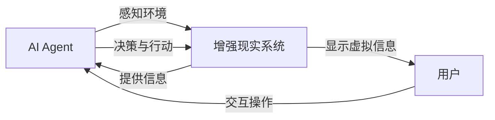

# AI Agent在智能眼镜中的增强现实应用

> 关键词：AI Agent、智能眼镜、增强现实、人机交互、计算机视觉

> 摘要：本文深入探讨了AI Agent在智能眼镜增强现实应用中的相关技术。首先介绍了研究的背景、目的、预期读者和文档结构等内容。接着详细阐述了核心概念，包括AI Agent和增强现实的原理及架构，并通过示意图和流程图展示其联系。然后讲解了核心算法原理，使用Python代码进行说明，同时给出了相关的数学模型和公式。在项目实战部分，介绍了开发环境搭建、源代码实现及解读。分析了实际应用场景，推荐了学习资源、开发工具框架和相关论文著作。最后总结了未来发展趋势与挑战，并给出常见问题解答和扩展阅读参考资料。

## 1. 背景介绍 
### 1.1 目的和范围
随着科技的不断发展，智能眼镜和增强现实（AR）技术逐渐成为研究和应用的热点。AI Agent作为一种能够自主感知、决策和行动的智能实体，将其应用于智能眼镜的增强现实场景中，可以显著提升用户的交互体验和信息获取效率。本文的目的在于深入探讨AI Agent在智能眼镜增强现实应用中的技术原理、实现方法和应用场景，为相关领域的研究和开发提供参考。

本文的范围涵盖了AI Agent和增强现实的核心概念、相关算法原理、数学模型、项目实战案例，以及实际应用场景和未来发展趋势等方面。

### 1.2 预期读者
本文的预期读者包括计算机科学、人工智能、增强现实等领域的研究人员、开发者，以及对智能眼镜和增强现实技术感兴趣的爱好者。对于有一定编程基础和相关领域知识的读者，能够通过本文深入了解AI Agent在智能眼镜增强现实应用中的技术细节和实现方法；对于初学者，也可以通过本文对该领域有一个全面的认识。

### 1.3 文档结构概述
本文共分为十个部分，具体结构如下：
1. **背景介绍**：介绍研究的目的、范围、预期读者和文档结构，以及相关术语的定义和解释。
2. **核心概念与联系**：阐述AI Agent和增强现实的核心概念、原理和架构，通过文本示意图和Mermaid流程图展示它们之间的联系。
3. **核心算法原理 & 具体操作步骤**：讲解AI Agent在智能眼镜增强现实应用中涉及的核心算法原理，使用Python源代码详细阐述具体操作步骤。
4. **数学模型和公式 & 详细讲解 & 举例说明**：给出相关的数学模型和公式，并进行详细讲解和举例说明。
5. **项目实战：代码实际案例和详细解释说明**：介绍开发环境搭建、源代码实现和代码解读，通过实际案例展示AI Agent在智能眼镜增强现实应用中的具体实现。
6. **实际应用场景**：分析AI Agent在智能眼镜增强现实应用中的实际场景，如导航、教育、工业等领域。
7. **工具和资源推荐**：推荐学习资源、开发工具框架和相关论文著作，帮助读者进一步深入学习和研究。
8. **总结：未来发展趋势与挑战**：总结AI Agent在智能眼镜增强现实应用中的未来发展趋势和面临的挑战。
9. **附录：常见问题与解答**：解答读者在学习和实践过程中可能遇到的常见问题。
10. **扩展阅读 & 参考资料**：提供扩展阅读的建议和相关参考资料，方便读者进一步探索该领域的知识。

### 1.4 术语表
#### 1.4.1 核心术语定义
- **AI Agent**：人工智能代理，是一种能够感知环境、自主决策并采取行动以实现特定目标的智能实体。
- **智能眼镜**：一种可穿戴设备，集成了多种传感器和计算能力，能够提供视觉、听觉等多种交互方式。
- **增强现实（AR）**：将虚拟信息与真实世界场景进行融合，为用户提供更加丰富的视觉体验。
- **计算机视觉**：研究如何使计算机“看”的科学，包括图像识别、目标检测、图像分割等技术。

#### 1.4.2 相关概念解释
- **人机交互**：人与计算机之间进行信息交流和互动的过程，在智能眼镜的增强现实应用中，人机交互包括手势识别、语音识别等方式。
- **环境感知**：AI Agent通过传感器获取周围环境的信息，如视觉、听觉、触觉等，以便做出合理的决策。
- **决策与行动**：AI Agent根据感知到的环境信息，运用一定的算法和策略进行决策，并采取相应的行动，如在增强现实场景中添加虚拟物体、提供导航信息等。

#### 1.4.3 缩略词列表
- **AI**：Artificial Intelligence，人工智能
- **AR**：Augmented Reality，增强现实
- **CV**：Computer Vision，计算机视觉
- **ML**：Machine Learning，机器学习
- **DL**：Deep Learning，深度学习

## 2. 核心概念与联系 

### 2.1 AI Agent的原理和架构
AI Agent通常由感知模块、决策模块和行动模块组成。感知模块负责通过传感器获取周围环境的信息，如摄像头、麦克风等；决策模块根据感知到的信息，运用一定的算法和策略进行决策；行动模块根据决策结果采取相应的行动，如在屏幕上显示信息、控制设备的操作等。

以下是AI Agent的架构示意图：
```plaintext
+---------------------+
|     感知模块        |
| （摄像头、麦克风等） |
+---------------------+
         |
         v
+---------------------+
|     决策模块        |
| （算法、策略）      |
+---------------------+
         |
         v
+---------------------+
|     行动模块        |
| （显示信息、控制操作） |
+---------------------+
```

### 2.2 增强现实的原理和架构
增强现实技术通过计算机视觉和图形渲染技术，将虚拟信息与真实世界场景进行融合。其主要步骤包括：
1. **环境感知**：通过摄像头等设备获取真实世界的图像或视频信息。
2. **特征提取**：对获取的图像或视频进行处理，提取其中的特征信息。
3. **虚拟物体注册**：根据提取的特征信息，将虚拟物体准确地注册到真实世界场景中。
4. **图形渲染**：将虚拟物体与真实世界场景进行融合，并在显示设备上呈现给用户。

以下是增强现实的架构示意图：
```plaintext
+---------------------+
|     环境感知        |
| （摄像头、传感器） |
+---------------------+
         |
         v
+---------------------+
|     特征提取        |
| （计算机视觉算法） |
+---------------------+
         |
         v
+---------------------+
|  虚拟物体注册      |
| （坐标转换、对齐） |
+---------------------+
         |
         v
+---------------------+
|     图形渲染        |
| （3D建模、渲染引擎） |
+---------------------+
         |
         v
+---------------------+
|     显示设备        |
| （智能眼镜屏幕）   |
+---------------------+
```

### 2.3 AI Agent与增强现实的联系
AI Agent可以为增强现实应用提供智能决策和交互能力。例如，在智能眼镜的增强现实导航应用中，AI Agent可以根据用户的位置和目的地信息，实时规划最佳路线，并通过增强现实技术将路线信息叠加到真实世界场景中。同时，AI Agent还可以根据用户的手势、语音等交互信息，动态调整增强现实场景的显示内容。

以下是AI Agent与增强现实联系的Mermaid流程图：


## 3. 核心算法原理 & 具体操作步骤 

### 3.1 目标检测算法
目标检测是计算机视觉中的一个重要任务，用于在图像或视频中检测出特定目标的位置和类别。在智能眼镜的增强现实应用中，目标检测算法可以帮助AI Agent识别真实世界中的物体，以便进行虚拟信息的叠加。

这里我们使用YOLOv5（You Only Look Once version 5）作为目标检测算法的示例。YOLOv5是一种基于深度学习的目标检测算法，具有快速、准确的特点。

以下是使用Python和YOLOv5进行目标检测的代码示例：
```python
import torch

# 加载预训练的YOLOv5模型
model = torch.hub.load('ultralytics/yolov5', 'yolov5s', pretrained=True)

# 读取图像
img = 'path/to/your/image.jpg'

# 进行目标检测
results = model(img)

# 显示检测结果
results.show()
```

### 3.2 姿态估计算法
姿态估计用于估计人体或物体的姿态信息，如关节位置、朝向等。在智能眼镜的增强现实应用中，姿态估计算法可以帮助AI Agent理解用户的手势和动作，实现更加自然的人机交互。

这里我们使用MediaPipe作为姿态估计算法的示例。MediaPipe是一个开源的跨平台框架，提供了多种计算机视觉和机器学习模型。

以下是使用Python和MediaPipe进行姿态估计的代码示例：
```python
import cv2
import mediapipe as mp

# 初始化MediaPipe姿态估计模块
mp_pose = mp.solutions.pose
pose = mp_pose.Pose()
mp_drawing = mp.solutions.drawing_utils

# 读取视频或摄像头输入
cap = cv2.VideoCapture(0)

while cap.isOpened():
    ret, frame = cap.read()
    if not ret:
        break
    
    # 将图像转换为RGB格式
    image = cv2.cvtColor(frame, cv2.COLOR_BGR2RGB)
    
    # 进行姿态估计
    results = pose.process(image)
    
    # 将图像转换回BGR格式
    image = cv2.cvtColor(image, cv2.COLOR_RGB2BGR)
    
    # 绘制姿态估计结果
    if results.pose_landmarks:
        mp_drawing.draw_landmarks(
            image, results.pose_landmarks, mp_pose.POSE_CONNECTIONS)
    
    # 显示图像
    cv2.imshow('Pose Estimation', image)
    
    # 按 'q' 键退出
    if cv2.waitKey(1) & 0xFF == ord('q'):
        break

# 释放资源
cap.release()
cv2.destroyAllWindows()
```

### 3.3 具体操作步骤
1. **数据准备**：收集和标注用于训练目标检测和姿态估计模型的数据。
2. **模型训练**：使用准备好的数据对目标检测和姿态估计模型进行训练。
3. **模型部署**：将训练好的模型部署到智能眼镜设备上。
4. **集成开发**：将目标检测和姿态估计算法集成到智能眼镜的增强现实应用中。
5. **测试和优化**：对应用进行测试，根据测试结果进行优化和调整。

## 4. 数学模型和公式 & 详细讲解 & 举例说明 

### 4.1 目标检测中的损失函数
在目标检测中，常用的损失函数是YOLOv5中使用的CIoU Loss（Complete Intersection over Union Loss）。CIoU Loss综合考虑了预测框和真实框之间的重叠面积、中心点距离和长宽比，能够更准确地衡量预测框的准确性。

CIoU Loss的计算公式如下：
$$
L_{CIoU} = 1 - IoU + \frac{\rho^2(b, b^{gt})}{c^2} + \alpha v
$$
其中，$IoU$ 是预测框和真实框的交并比，$\rho^2(b, b^{gt})$ 是预测框和真实框中心点之间的欧氏距离的平方，$c$ 是包含预测框和真实框的最小外接矩形的对角线长度，$\alpha$ 是一个平衡因子，$v$ 是衡量长宽比一致性的参数。

### 4.2 姿态估计中的坐标转换
在姿态估计中，需要将检测到的关节点坐标从图像坐标系转换到世界坐标系。假设图像坐标系的原点为图像左上角，$x$ 轴向右，$y$ 轴向下；世界坐标系的原点为相机光心，$x$ 轴向右，$y$ 轴向下，$z$ 轴向前。

坐标转换的公式如下：
$$
\begin{bmatrix}
X \\
Y \\
Z \\
1
\end{bmatrix}
=
\begin{bmatrix}
f_x & 0 & c_x & 0 \\
0 & f_y & c_y & 0 \\
0 & 0 & 1 & 0 \\
0 & 0 & 0 & 1
\end{bmatrix}^{-1}
\begin{bmatrix}
u \\
v \\
1
\end{bmatrix}
\times Z
$$
其中，$(u, v)$ 是图像坐标系中的关节点坐标，$(X, Y, Z)$ 是世界坐标系中的关节点坐标，$f_x$ 和 $f_y$ 是相机的焦距，$c_x$ 和 $c_y$ 是图像的中心点坐标。

### 4.3 举例说明
假设我们使用YOLOv5进行目标检测，预测框的坐标为 $(x_1, y_1, x_2, y_2)$，真实框的坐标为 $(x_1^{gt}, y_1^{gt}, x_2^{gt}, y_2^{gt})$。首先计算预测框和真实框的交并比 $IoU$：
$$
IoU = \frac{Area(Intersection)}{Area(Union)}
$$
其中，$Area(Intersection)$ 是预测框和真实框的重叠面积，$Area(Union)$ 是预测框和真实框的并集面积。

然后计算预测框和真实框中心点之间的欧氏距离的平方 $\rho^2(b, b^{gt})$ 和包含预测框和真实框的最小外接矩形的对角线长度 $c$。最后根据CIoU Loss的计算公式计算损失值。

## 5. 项目实战：代码实际案例和详细解释说明 

### 5.1  开发环境搭建
在进行AI Agent在智能眼镜增强现实应用的开发之前，需要搭建相应的开发环境。以下是具体的搭建步骤：
1. **安装Python**：推荐使用Python 3.7及以上版本，可以从Python官方网站下载安装包进行安装。
2. **安装依赖库**：使用pip命令安装所需的依赖库，如torch、opencv-python、mediapipe等。
```bash
pip install torch opencv-python mediapipe
```
3. **安装开发工具**：推荐使用PyCharm作为开发工具，可以从JetBrains官方网站下载安装。

### 5.2  源代码详细实现和代码解读
以下是一个简单的AI Agent在智能眼镜增强现实应用的代码示例，实现了目标检测和虚拟信息叠加的功能：
```python
import torch
import cv2
import mediapipe as mp

# 加载预训练的YOLOv5模型
model = torch.hub.load('ultralytics/yolov5', 'yolov5s', pretrained=True)

# 初始化MediaPipe姿态估计模块
mp_pose = mp.solutions.pose
pose = mp_pose.Pose()
mp_drawing = mp.solutions.drawing_utils

# 打开摄像头
cap = cv2.VideoCapture(0)

while cap.isOpened():
    ret, frame = cap.read()
    if not ret:
        break
    
    # 进行目标检测
    results = model(frame)
    
    # 绘制检测结果
    detections = results.pandas().xyxy[0]
    for _, detection in detections.iterrows():
        x1, y1, x2, y2 = int(detection['xmin']), int(detection['ymin']), int(detection['xmax']), int(detection['ymax'])
        label = detection['name']
        cv2.rectangle(frame, (x1, y1), (x2, y2), (0, 255, 0), 2)
        cv2.putText(frame, label, (x1, y1 - 10), cv2.FONT_HERSHEY_SIMPLEX, 0.9, (0, 255, 0), 2)
    
    # 将图像转换为RGB格式
    image = cv2.cvtColor(frame, cv2.COLOR_BGR2RGB)
    
    # 进行姿态估计
    results = pose.process(image)
    
    # 将图像转换回BGR格式
    image = cv2.cvtColor(image, cv2.COLOR_RGB2BGR)
    
    # 绘制姿态估计结果
    if results.pose_landmarks:
        mp_drawing.draw_landmarks(
            image, results.pose_landmarks, mp_pose.POSE_CONNECTIONS)
    
    # 显示图像
    cv2.imshow('AR Application', image)
    
    # 按 'q' 键退出
    if cv2.waitKey(1) & 0xFF == ord('q'):
        break

# 释放资源
cap.release()
cv2.destroyAllWindows()
```

### 5.3  代码解读与分析
1. **加载模型**：使用 `torch.hub.load` 函数加载预训练的YOLOv5模型，使用 `mp.solutions.pose` 初始化MediaPipe姿态估计模块。
2. **打开摄像头**：使用 `cv2.VideoCapture` 函数打开摄像头。
3. **目标检测**：在每一帧图像上使用YOLOv5模型进行目标检测，并将检测结果绘制在图像上。
4. **姿态估计**：将图像转换为RGB格式，使用MediaPipe姿态估计模块进行姿态估计，并将估计结果绘制在图像上。
5. **显示图像**：使用 `cv2.imshow` 函数显示处理后的图像。
6. **释放资源**：按 'q' 键退出循环，释放摄像头资源并关闭所有窗口。

## 6. 实际应用场景 
### 6.1 导航领域
在导航领域，AI Agent可以结合智能眼镜的增强现实功能，为用户提供更加直观的导航体验。例如，AI Agent可以根据用户的位置和目的地信息，实时规划最佳路线，并通过增强现实技术将路线信息叠加到真实世界场景中。用户只需佩戴智能眼镜，就可以清晰地看到前方的路线指示，无需频繁查看手机地图。

### 6.2 教育领域
在教育领域，AI Agent和智能眼镜的增强现实应用可以为学生提供更加生动、直观的学习体验。例如，在学习地理知识时，AI Agent可以通过增强现实技术将地理模型和相关信息叠加到真实场景中，让学生更加直观地了解地理环境和地理现象。同时，AI Agent还可以根据学生的学习情况提供个性化的学习建议和辅导。

### 6.3 工业领域
在工业领域，AI Agent和智能眼镜的增强现实应用可以提高工人的工作效率和安全性。例如，在设备维修过程中，AI Agent可以通过增强现实技术将设备的维修手册和操作指南叠加到设备上，工人可以根据提示进行维修操作，减少误操作的风险。同时，AI Agent还可以实时监测工人的工作状态和环境信息，提供安全提示和预警。

### 6.4 娱乐领域
在娱乐领域，AI Agent和智能眼镜的增强现实应用可以为用户带来全新的娱乐体验。例如，在玩游戏时，AI Agent可以通过增强现实技术将虚拟角色和场景叠加到真实世界中，让用户身临其境地感受游戏的乐趣。同时，AI Agent还可以根据用户的动作和表情实时调整游戏内容，增加游戏的互动性和趣味性。

## 7. 工具和资源推荐
### 7.1 学习资源推荐
#### 7.1.1 书籍推荐
- 《人工智能：一种现代的方法》：全面介绍了人工智能的基本概念、算法和应用，是人工智能领域的经典教材。
- 《计算机视觉：算法与应用》：详细讲解了计算机视觉的基本算法和应用，包括图像滤波、特征提取、目标检测等内容。
- 《增强现实：原理、技术与应用》：系统介绍了增强现实的原理、技术和应用案例，是增强现实领域的权威著作。

#### 7.1.2 在线课程
- Coursera上的“人工智能基础”课程：由斯坦福大学教授吴恩达主讲，介绍了人工智能的基本概念、算法和应用。
- edX上的“计算机视觉基础”课程：由华盛顿大学教授讲解，涵盖了计算机视觉的基本算法和应用。
- Udemy上的“增强现实开发实战”课程：通过实际案例介绍了增强现实的开发技术和方法。

#### 7.1.3 技术博客和网站
- Medium：一个技术博客平台，上面有很多关于人工智能、增强现实等领域的优秀文章。
- arXiv：一个预印本论文平台，提供了大量的最新研究成果和论文。
- OpenCV官方文档：OpenCV是一个开源的计算机视觉库，其官方文档提供了详细的使用说明和示例代码。

### 7.2 开发工具框架推荐
#### 7.2.1 IDE和编辑器
- PyCharm：一款专业的Python集成开发环境，提供了代码编辑、调试、版本控制等功能。
- Visual Studio Code：一款轻量级的代码编辑器，支持多种编程语言，具有丰富的插件生态系统。

#### 7.2.2 调试和性能分析工具
- PySnooper：一个简单易用的Python调试工具，可以自动记录函数的调用过程和变量的值。
- cProfile：Python标准库中的性能分析工具，可以分析代码的运行时间和函数调用次数。

#### 7.2.3 相关框架和库
- PyTorch：一个开源的深度学习框架，提供了丰富的神经网络模型和工具，方便进行模型训练和部署。
- TensorFlow：另一个流行的深度学习框架，具有强大的分布式训练和部署能力。
- OpenCV：一个开源的计算机视觉库，提供了多种图像处理和计算机视觉算法。

### 7.3 相关论文著作推荐
#### 7.3.1 经典论文
- “You Only Look Once: Unified, Real-Time Object Detection”：介绍了YOLO目标检测算法的原理和实现。
- “MediaPipe: A Framework for Building Perceptual Intelligence Applications”：介绍了MediaPipe框架的设计和应用。
- “Markerless Articulated Human Motion Tracking by Fusion of Skin-Color and Edge Features”：介绍了基于皮肤颜色和边缘特征的无标记人体运动跟踪算法。

#### 7.3.2 最新研究成果
- 关注arXiv上关于人工智能、增强现实等领域的最新研究论文，了解该领域的最新发展动态。
- 参加相关的学术会议，如CVPR、ICCV、ECCV等，获取最新的研究成果和技术趋势。

#### 7.3.3 应用案例分析
- 研究一些实际的AI Agent在智能眼镜增强现实应用的案例，分析其技术实现和应用效果，从中获取灵感和经验。

## 8. 总结：未来发展趋势与挑战
### 8.1 未来发展趋势
- **更加智能化**：AI Agent将具备更强的学习和推理能力，能够更好地理解用户的需求和意图，提供更加个性化的服务。
- **更加融合化**：AI Agent和增强现实技术将与其他技术，如物联网、5G等深度融合，创造出更加丰富的应用场景。
- **更加普及化**：随着技术的不断进步和成本的不断降低，智能眼镜和增强现实应用将逐渐普及，成为人们日常生活和工作中的重要工具。

### 8.2 面临的挑战
- **技术瓶颈**：目前AI Agent和增强现实技术还存在一些技术瓶颈，如计算能力、算法精度、电池续航等问题，需要进一步研究和突破。
- **用户体验**：如何提高用户在智能眼镜增强现实应用中的体验，如减少眩晕感、提高交互的自然性等，是需要解决的重要问题。
- **隐私和安全**：智能眼镜和增强现实应用涉及大量的用户数据和隐私信息，如何保障用户的隐私和安全是需要重视的问题。

## 9. 附录：常见问题与解答
### 9.1 如何提高目标检测的准确率？
可以通过以下方法提高目标检测的准确率：
- 使用更大的数据集进行模型训练，增加模型的泛化能力。
- 选择更合适的目标检测算法，如YOLOv7、Faster R-CNN等。
- 对数据进行预处理，如数据增强、归一化等。

### 9.2 智能眼镜的电池续航问题如何解决？
可以通过以下方法解决智能眼镜的电池续航问题：
- 优化硬件设计，降低功耗。
- 采用低功耗的芯片和传感器。
- 开发节能算法，减少不必要的计算和数据传输。

### 9.3 如何保障用户在智能眼镜增强现实应用中的隐私和安全？
可以通过以下方法保障用户的隐私和安全：
- 对用户数据进行加密处理，防止数据泄露。
- 严格遵守相关的隐私政策和法律法规，保护用户的合法权益。
- 加强安全防护机制，防止恶意攻击和入侵。

## 10. 扩展阅读 & 参考资料
### 10.1 扩展阅读建议
- 阅读更多关于人工智能、增强现实、计算机视觉等领域的专业书籍和论文，深入了解相关技术的原理和应用。
- 参与开源项目，学习和借鉴其他开发者的经验和代码。
- 关注行业动态和技术趋势，参加相关的技术交流活动和会议。

### 10.2 参考资料
- [YOLOv5官方代码库](https://github.com/ultralytics/yolov5)
- [MediaPipe官方文档](https://google.github.io/mediapipe/)
- [OpenCV官方文档](https://docs.opencv.org/)

作者：AI天才研究院/AI Genius Institute & 禅与计算机程序设计艺术 /Zen And The Art of Computer Programming