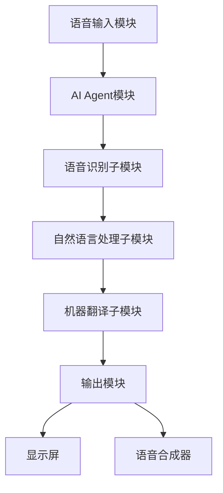

# AI Agent在智能眼镜中的实时翻译功能

> 关键词：AI Agent、智能眼镜、实时翻译、自然语言处理、语音识别

> 摘要：本文深入探讨了AI Agent在智能眼镜中实现实时翻译功能的相关技术。首先介绍了该技术的背景，包括目的、预期读者等内容。接着阐述了核心概念与联系，详细讲解了核心算法原理和具体操作步骤，给出了相应的数学模型和公式。通过项目实战展示了代码实际案例及详细解释。同时分析了该技术的实际应用场景，推荐了相关的工具和资源。最后总结了其未来发展趋势与挑战，并提供了常见问题解答和扩展阅读参考资料，旨在全面剖析AI Agent在智能眼镜实时翻译功能中的应用。

## 1. 背景介绍 
### 1.1 目的和范围
随着全球化的发展，人们在跨语言交流方面的需求日益增长。智能眼镜作为一种可穿戴设备，具有便捷性和实时性的特点。将AI Agent应用于智能眼镜中实现实时翻译功能，旨在打破语言障碍，让用户在各种场景下都能实现无障碍的语言交流。本文章的范围涵盖了AI Agent在智能眼镜实时翻译功能中的核心概念、算法原理、实际应用以及相关的技术资源等方面，为读者全面了解和开发该技术提供参考。

### 1.2 预期读者
本文预期读者包括对人工智能、智能穿戴设备技术感兴趣的技术爱好者，从事相关领域研究的科研人员，以及希望将实时翻译功能集成到智能眼镜产品中的开发者和企业技术人员。

### 1.3 文档结构概述
本文首先介绍背景信息，让读者了解AI Agent在智能眼镜实时翻译功能的相关背景和目标。接着阐述核心概念与联系，帮助读者理解该技术的基本原理和架构。然后详细讲解核心算法原理和具体操作步骤，给出数学模型和公式以深入剖析技术本质。通过项目实战展示代码实现和解读，让读者了解实际开发过程。分析实际应用场景，让读者明白该技术的应用价值。推荐相关的工具和资源，为读者提供学习和开发的途径。最后总结未来发展趋势与挑战，解答常见问题并提供扩展阅读参考资料。

### 1.4 术语表
#### 1.4.1 核心术语定义
- **AI Agent**：即人工智能代理，是一种能够感知环境、进行决策并采取行动以实现特定目标的智能实体。在本文中，AI Agent负责处理智能眼镜接收到的语音信息，进行语音识别、语言翻译等操作。
- **智能眼镜**：一种可穿戴的智能设备，通常具备显示、语音输入输出等功能，能够与用户进行交互。
- **实时翻译**：指在短时间内将一种语言的语音或文本翻译成另一种语言的过程，要求翻译结果能够及时呈现给用户。

#### 1.4.2 相关概念解释
- **自然语言处理（NLP）**：是人工智能的一个重要领域，主要研究如何让计算机理解、处理和生成人类语言。在实时翻译功能中，NLP技术用于语音识别、语义理解和语言生成等环节。
- **语音识别**：将人类的语音信号转换为文本的过程，是实时翻译的第一步。通过语音识别技术，智能眼镜能够将用户的语音信息转换为文本，以便后续的翻译处理。

#### 1.4.3 缩略词列表
- **NLP**：Natural Language Processing（自然语言处理）
- **ASR**：Automatic Speech Recognition（自动语音识别）
- **MT**：Machine Translation（机器翻译）

## 2. 核心概念与联系 

### 核心概念原理
AI Agent在智能眼镜实时翻译功能中的核心原理是将语音识别、自然语言处理和机器翻译等技术集成在一起。智能眼镜通过麦克风收集用户的语音信息，然后将其传输给AI Agent。AI Agent首先进行语音识别，将语音转换为文本。接着，利用自然语言处理技术对文本进行语义理解和分析，提取关键信息。最后，使用机器翻译算法将源语言文本翻译成目标语言文本，并将翻译结果通过智能眼镜的显示屏或语音合成技术呈现给用户。

### 架构的文本示意图
智能眼镜实时翻译系统主要由以下几个部分组成：
1. **语音输入模块**：由智能眼镜的麦克风组成，负责收集用户的语音信息。
2. **AI Agent模块**：包含语音识别子模块、自然语言处理子模块和机器翻译子模块。语音识别子模块将语音转换为文本，自然语言处理子模块对文本进行语义分析，机器翻译子模块将源语言文本翻译成目标语言文本。
3. **输出模块**：包括智能眼镜的显示屏和语音合成器，用于将翻译结果以文本或语音的形式呈现给用户。

### Mermaid流程图


## 3. 核心算法原理 & 具体操作步骤 

### 核心算法原理
#### 语音识别算法
常见的语音识别算法有基于隐马尔可夫模型（HMM）和深度神经网络（DNN）的方法。在实际应用中，基于深度学习的端到端语音识别模型，如Listen, Attend and Spell（LAS）模型和Transformer架构的语音识别模型，具有更好的性能。

以下是一个简单的基于Python的语音识别示例，使用`SpeechRecognition`库：
```python
import speech_recognition as sr

# 创建一个Recognizer对象
r = sr.Recognizer()

# 使用麦克风录制语音
with sr.Microphone() as source:
    print("请说话...")
    audio = r.listen(source)

try:
    # 使用Google的语音识别服务将语音转换为文本
    text = r.recognize_google(audio, language='zh-CN')
    print("识别结果: " + text)
except sr.UnknownValueError:
    print("无法识别语音")
except sr.RequestError as e:
    print("请求错误; {0}".format(e))
```

#### 自然语言处理算法
自然语言处理算法包括词法分析、句法分析、语义分析等。在实时翻译中，通常使用预训练的语言模型，如BERT、GPT等，对文本进行语义理解和特征提取。

#### 机器翻译算法
常见的机器翻译算法有基于规则的机器翻译（RBMT）、基于统计的机器翻译（SMT）和基于神经网络的机器翻译（NMT）。目前，基于Transformer架构的NMT模型，如Google的Transformer模型和OpenAI的GPT系列模型，在机器翻译任务中取得了很好的效果。

以下是一个使用`transformers`库进行机器翻译的示例：
```python
from transformers import AutoTokenizer, AutoModelForSeq2SeqLM

# 加载预训练的翻译模型和分词器
tokenizer = AutoTokenizer.from_pretrained("Helsinki-NLP/opus-mt-zh-en")
model = AutoModelForSeq2SeqLM.from_pretrained("Helsinki-NLP/opus-mt-zh-en")

# 待翻译的文本
text = "你好，世界！"

# 对文本进行分词
input_ids = tokenizer(text, return_tensors="pt").input_ids

# 进行翻译
outputs = model.generate(input_ids)

# 将翻译结果转换为文本
translation = tokenizer.decode(outputs[0], skip_special_tokens=True)
print("翻译结果: " + translation)
```

### 具体操作步骤
1. **语音输入**：用户通过智能眼镜的麦克风说出源语言的语音。
2. **语音识别**：AI Agent的语音识别子模块将语音转换为文本。
3. **自然语言处理**：对识别得到的文本进行语义分析和特征提取。
4. **机器翻译**：将源语言文本翻译成目标语言文本。
5. **输出结果**：将翻译结果通过智能眼镜的显示屏或语音合成器呈现给用户。

## 4. 数学模型和公式 & 详细讲解 & 举例说明 

### 语音识别的数学模型
语音识别的基本任务是在给定语音信号 $X$ 的情况下，找到最可能的文本序列 $W$，即求解 $P(W|X)$ 的最大值。根据贝叶斯定理，有：
$$P(W|X)=\frac{P(X|W)P(W)}{P(X)}$$
其中，$P(X|W)$ 是声学模型，表示在给定文本序列 $W$ 的情况下，生成语音信号 $X$ 的概率；$P(W)$ 是语言模型，表示文本序列 $W$ 出现的概率；$P(X)$ 是语音信号 $X$ 出现的概率，在求解最大值时可以忽略。

### 机器翻译的数学模型
机器翻译的目标是在给定源语言文本 $S$ 的情况下，找到最可能的目标语言文本 $T$，即求解 $P(T|S)$ 的最大值。同样根据贝叶斯定理，有：
$$P(T|S)=\frac{P(S|T)P(T)}{P(S)}$$
其中，$P(S|T)$ 是翻译模型，表示在给定目标语言文本 $T$ 的情况下，生成源语言文本 $S$ 的概率；$P(T)$ 是目标语言的语言模型，表示目标语言文本 $T$ 出现的概率；$P(S)$ 是源语言文本 $S$ 出现的概率，在求解最大值时可以忽略。

### 举例说明
假设我们要将中文句子“我爱你”翻译成英文。在语音识别阶段，首先将“我爱你”的语音信号转换为文本“我爱你”。在机器翻译阶段，根据翻译模型和语言模型，计算不同英文句子的概率，如“ I love you ”、“ I like you ”等，最终选择概率最大的“ I love you ”作为翻译结果。

## 5. 项目实战：代码实际案例和详细解释说明 

### 5.1  开发环境搭建
#### 硬件环境
- 智能眼镜：选择具备麦克风、显示屏和语音合成功能的智能眼镜，如Google Glass、Vuzix Blade等。
- 开发计算机：具备一定的计算能力，推荐使用配备Intel Core i5及以上处理器、8GB及以上内存的计算机。

#### 软件环境
- 操作系统：推荐使用Windows 10、macOS或Ubuntu等操作系统。
- 编程语言：Python 3.6及以上版本。
- 开发工具：推荐使用PyCharm、Jupyter Notebook等开发工具。
- 相关库和框架：`SpeechRecognition`、`transformers`、`pyttsx3`等。

### 5.2  源代码详细实现和代码解读
以下是一个完整的智能眼镜实时翻译功能的Python代码示例：
```python
import speech_recognition as sr
from transformers import AutoTokenizer, AutoModelForSeq2SeqLM
import pyttsx3

# 初始化语音合成引擎
engine = pyttsx3.init()

# 加载预训练的翻译模型和分词器
tokenizer = AutoTokenizer.from_pretrained("Helsinki-NLP/opus-mt-zh-en")
model = AutoModelForSeq2SeqLM.from_pretrained("Helsinki-NLP/opus-mt-zh-en")

# 创建一个Recognizer对象
r = sr.Recognizer()

while True:
    try:
        # 使用麦克风录制语音
        with sr.Microphone() as source:
            print("请说话...")
            audio = r.listen(source)

        # 使用Google的语音识别服务将语音转换为文本
        text = r.recognize_google(audio, language='zh-CN')
        print("识别结果: " + text)

        # 对文本进行分词
        input_ids = tokenizer(text, return_tensors="pt").input_ids

        # 进行翻译
        outputs = model.generate(input_ids)

        # 将翻译结果转换为文本
        translation = tokenizer.decode(outputs[0], skip_special_tokens=True)
        print("翻译结果: " + translation)

        # 语音合成翻译结果
        engine.say(translation)
        engine.runAndWait()

    except sr.UnknownValueError:
        print("无法识别语音")
    except sr.RequestError as e:
        print("请求错误; {0}".format(e))
```

### 5.3  代码解读与分析
- **语音输入**：使用`SpeechRecognition`库的`Microphone`类从麦克风录制语音，并使用`listen`方法获取语音信号。
- **语音识别**：使用`recognize_google`方法将语音信号转换为文本。
- **机器翻译**：使用`transformers`库的预训练翻译模型将中文文本翻译成英文文本。
- **语音合成**：使用`pyttsx3`库将翻译结果转换为语音并播放。

## 6. 实际应用场景 
### 旅游场景
在旅游过程中，游客可能会遇到语言不通的问题。使用具备实时翻译功能的智能眼镜，游客可以与当地居民进行无障碍交流，了解当地的文化、风俗习惯和旅游景点信息。

### 商务场景
在国际商务会议中，不同国家的商务人士可能使用不同的语言。智能眼镜的实时翻译功能可以帮助他们实时理解对方的发言，提高沟通效率，促进商务合作。

### 教育场景
在跨国教育交流中，学生和教师可能面临语言障碍。智能眼镜的实时翻译功能可以帮助他们更好地理解教学内容，提高学习效果。

## 7. 工具和资源推荐
### 7.1 学习资源推荐
#### 7.1.1 书籍推荐
- 《自然语言处理入门》：介绍了自然语言处理的基本概念、算法和应用。
- 《深度学习》：详细讲解了深度学习的原理和应用，包括语音识别和机器翻译等领域。

#### 7.1.2 在线课程
- Coursera上的“Natural Language Processing Specialization”：由斯坦福大学的教授授课，全面介绍了自然语言处理的相关知识。
- edX上的“Deep Learning for Natural Language Processing”：深入讲解了深度学习在自然语言处理中的应用。

#### 7.1.3 技术博客和网站
- Medium：有许多关于人工智能、自然语言处理和智能穿戴设备的技术博客文章。
- arXiv：提供了最新的学术论文和研究成果。

### 7.2 开发工具框架推荐
#### 7.2.1 IDE和编辑器
- PyCharm：功能强大的Python集成开发环境，提供代码编辑、调试、版本控制等功能。
- Jupyter Notebook：交互式的开发环境，适合进行数据探索和模型实验。

#### 7.2.2 调试和性能分析工具
- TensorBoard：用于可视化深度学习模型的训练过程和性能指标。
- cProfile：Python的性能分析工具，用于分析代码的执行时间和资源消耗。

#### 7.2.3 相关框架和库
- SpeechRecognition：用于语音识别的Python库，支持多种语音识别引擎。
- transformers：由Hugging Face开发的自然语言处理库，提供了丰富的预训练模型。
- pyttsx3：用于语音合成的Python库，支持多种语音引擎。

### 7.3 相关论文著作推荐
#### 7.3.1 经典论文
- “Attention Is All You Need”：介绍了Transformer架构，是机器翻译领域的经典论文。
- “Listen, Attend and Spell”：提出了LAS模型，是语音识别领域的重要论文。

#### 7.3.2 最新研究成果
- 在ACL、EMNLP等自然语言处理领域的顶级会议上可以找到最新的研究成果。

#### 7.3.3 应用案例分析
- 一些科技公司的官方博客和技术报告中会分享智能眼镜实时翻译功能的应用案例和实践经验。

## 8. 总结：未来发展趋势与挑战
### 未来发展趋势
- **精度提升**：随着自然语言处理和机器学习技术的不断发展，AI Agent在智能眼镜中的实时翻译精度将不断提高，翻译结果将更加准确和自然。
- **多模态融合**：未来的智能眼镜实时翻译功能将不仅仅局限于语音翻译，还将融合图像识别、手势识别等多模态信息，提供更加丰富和全面的翻译服务。
- **个性化定制**：根据用户的语言习惯、专业领域等因素，提供个性化的翻译服务，满足不同用户的需求。

### 挑战
- **语音环境复杂**：在实际应用中，语音环境可能非常复杂，存在噪音、口音等问题，这会影响语音识别的准确率。
- **语义理解困难**：自然语言具有丰富的语义和语境信息，准确理解和翻译这些信息仍然是一个挑战。
- **隐私和安全问题**：智能眼镜需要收集用户的语音信息，这涉及到用户的隐私和安全问题，需要采取有效的措施来保护用户的信息安全。

## 9. 附录：常见问题与解答
### 1. 智能眼镜的实时翻译功能支持哪些语言？
目前，常见的智能眼镜实时翻译功能支持多种主流语言，如中文、英文、日文、韩文等。具体支持的语言取决于所使用的翻译模型和服务。

### 2. 实时翻译的延迟是多少？
实时翻译的延迟主要取决于语音识别、机器翻译和语音合成的处理速度，以及网络延迟等因素。一般来说，延迟在几秒以内。

### 3. 智能眼镜的实时翻译功能在离线状态下能否使用？
部分智能眼镜的实时翻译功能支持离线使用，但离线翻译的精度和支持的语言可能会受到一定限制。

## 10. 扩展阅读 & 参考资料
- [SpeechRecognition官方文档](https://pypi.org/project/SpeechRecognition/)
- [transformers官方文档](https://huggingface.co/transformers/)
- [pyttsx3官方文档](https://pypi.org/project/pyttsx3/)

作者：AI天才研究院/AI Genius Institute & 禅与计算机程序设计艺术 /Zen And The Art of Computer Programming