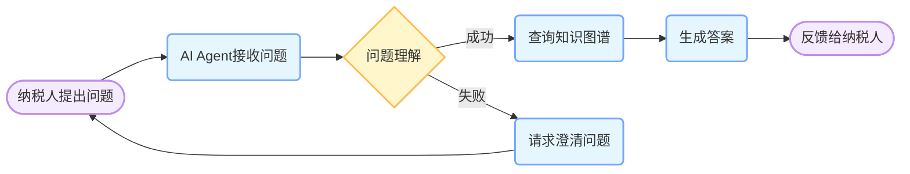

# AI Agent在智能税务咨询中的角色

> 关键词：AI Agent、智能税务咨询、自然语言处理、知识图谱、自动化服务

> 摘要：本文深入探讨了AI Agent在智能税务咨询领域的角色。首先介绍了相关背景知识，包括目的范围、预期读者等内容。接着阐述了AI Agent、智能税务咨询等核心概念及其联系，通过文本示意图和Mermaid流程图进行清晰展示。详细讲解了AI Agent实现智能税务咨询所涉及的核心算法原理，并用Python代码进行具体说明。同时给出了相关数学模型和公式，并举例解释。通过项目实战，从开发环境搭建到源代码实现与解读，展示了AI Agent在实际中的应用。还列举了其实际应用场景，推荐了学习资源、开发工具框架以及相关论文著作。最后总结了未来发展趋势与挑战，解答了常见问题，并提供了扩展阅读和参考资料，旨在全面剖析AI Agent在智能税务咨询中的重要作用和发展前景。

## 1. 背景介绍 
### 1.1 目的和范围
本文章的主要目的是全面且深入地探讨AI Agent在智能税务咨询中的角色。随着人工智能技术的飞速发展，AI Agent在各个领域的应用日益广泛，税务咨询领域也不例外。我们将研究AI Agent如何利用其独特的能力，如自然语言处理、知识推理等，为纳税人提供高效、准确的税务咨询服务。

文章的范围涵盖了AI Agent在智能税务咨询中的基本概念、核心算法、数学模型、实际应用案例等多个方面。我们将从理论层面剖析AI Agent的工作原理，同时结合实际项目，展示其在税务咨询场景中的具体实现和应用效果。

### 1.2 预期读者
本文预期读者主要包括以下几类人群：
- **税务从业人员**：他们可以通过本文了解AI Agent在税务咨询中的应用，提升自身服务效率和质量，为纳税人提供更优质的服务。
- **人工智能开发者**：对AI Agent技术感兴趣的开发者可以从本文中获取在税务咨询领域应用的思路和方法，拓展技术应用场景。
- **研究人员**：从事人工智能与税务领域交叉研究的学者，可以从本文中获取相关研究资料和案例，为进一步的学术研究提供参考。
- **纳税人**：了解AI Agent在税务咨询中的作用，有助于纳税人更好地利用智能税务咨询服务，解决自身税务问题。

### 1.3 文档结构概述
本文将按照以下结构进行详细阐述：
- **核心概念与联系**：介绍AI Agent和智能税务咨询的基本概念，以及它们之间的联系，通过文本示意图和Mermaid流程图进行清晰展示。
- **核心算法原理 & 具体操作步骤**：详细讲解AI Agent实现智能税务咨询所涉及的核心算法，并用Python代码进行具体说明。
- **数学模型和公式 & 详细讲解 & 举例说明**：给出相关数学模型和公式，并结合实际例子进行详细解释。
- **项目实战：代码实际案例和详细解释说明**：从开发环境搭建到源代码实现与解读，展示AI Agent在实际税务咨询项目中的应用。
- **实际应用场景**：列举AI Agent在智能税务咨询中的常见应用场景。
- **工具和资源推荐**：推荐学习资源、开发工具框架以及相关论文著作。
- **总结：未来发展趋势与挑战**：总结AI Agent在智能税务咨询中的未来发展趋势和面临的挑战。
- **附录：常见问题与解答**：解答读者在阅读过程中可能遇到的常见问题。
- **扩展阅读 & 参考资料**：提供相关的扩展阅读内容和参考资料，方便读者进一步深入学习。

### 1.4 术语表
#### 1.4.1 核心术语定义
- **AI Agent**：人工智能代理，是一种能够感知环境、自主决策并采取行动以实现特定目标的软件实体。在智能税务咨询中，AI Agent可以理解纳税人的问题，利用知识库进行推理，并给出相应的解答。
- **智能税务咨询**：利用人工智能技术，为纳税人提供自动化、智能化的税务问题解答和咨询服务。它可以通过自然语言交互，快速准确地响应纳税人的需求。
- **自然语言处理（NLP）**：人工智能的一个分支领域，研究如何让计算机理解、处理和生成人类语言。在智能税务咨询中，NLP技术用于理解纳税人的自然语言问题，并生成自然语言的解答。
- **知识图谱**：一种以图形化方式表示知识的技术，将实体及其之间的关系进行结构化存储。在税务咨询中，知识图谱可以整合税务法规、政策等信息，为AI Agent提供知识支持。

#### 1.4.2 相关概念解释
- **机器学习**：是一门多领域交叉学科，涉及概率论、统计学、逼近论、凸分析、算法复杂度理论等多门学科。它专门研究计算机怎样模拟或实现人类的学习行为，以获取新的知识或技能，重新组织已有的知识结构使之不断改善自身的性能。在智能税务咨询中，机器学习算法可以用于训练AI Agent，使其能够更好地理解和解答税务问题。
- **深度学习**：是机器学习的一个分支领域，它基于人工神经网络，通过构建具有多个层次的神经网络模型，自动从大量数据中学习特征和模式。在税务咨询中，深度学习可以用于处理复杂的自然语言问题，提高问题理解和解答的准确性。

#### 1.4.3 缩略词列表
- **NLP**：Natural Language Processing（自然语言处理）
- **ML**：Machine Learning（机器学习）
- **DL**：Deep Learning（深度学习）

## 2. 核心概念与联系 
### 核心概念原理
#### AI Agent
AI Agent是一种具有自主性、反应性、社会性和能动性的软件实体。它可以感知周围环境的信息，根据预设的目标和规则，自主地做出决策并采取行动。在智能税务咨询中，AI Agent的工作原理如下：
- **感知**：通过自然语言处理技术，接收纳税人输入的税务问题。
- **理解**：对纳税人的问题进行语义分析，提取关键信息，理解问题的意图。
- **推理**：利用知识库（如知识图谱）中的税务知识，进行推理和匹配，找到与问题相关的解答。
- **行动**：将推理得到的解答以自然语言的形式反馈给纳税人。

#### 智能税务咨询
智能税务咨询是利用人工智能技术为纳税人提供税务问题解答和咨询服务的系统。其核心原理是将税务知识进行数字化和结构化存储，利用自然语言处理和机器学习等技术，实现与纳税人的自然语言交互，快速准确地回答纳税人的问题。

### 架构的文本示意图
```plaintext
纳税人 --> 自然语言问题 --> AI Agent
AI Agent --> 问题理解模块 --> 知识图谱查询模块 --> 答案生成模块 --> 纳税人
知识图谱 <-- 税务法规、政策等信息
```

### Mermaid流程图


## 3. 核心算法原理 & 具体操作步骤 
### 核心算法原理
#### 自然语言处理算法
在智能税务咨询中，自然语言处理是关键技术之一，用于理解纳税人的问题。常见的自然语言处理算法包括：
- **词法分析**：将输入的文本分割成单词或词语的序列。例如，使用Python的`jieba`库进行中文分词：
```python
import jieba

text = "我想了解个人所得税的申报流程"
words = jieba.lcut(text)
print(words)
```
- **词性标注**：为每个词语标注其词性，如名词、动词、形容词等。可以使用`jieba.posseg`进行词性标注：
```python
import jieba.posseg as pseg

words = pseg.cut(text)
for word, flag in words:
    print(f"{word}: {flag}")
```
- **命名实体识别（NER）**：识别文本中的命名实体，如人名、地名、组织机构名等。在税务咨询中，可能需要识别税务相关的实体，如“个人所得税”、“增值税”等。可以使用深度学习模型进行NER，例如使用`transformers`库中的预训练模型：
```python
from transformers import AutoTokenizer, AutoModelForTokenClassification
from transformers import pipeline

tokenizer = AutoTokenizer.from_pretrained("dslim/bert-base-NER")
model = AutoModelForTokenClassification.from_pretrained("dslim/bert-base-NER")
nlp = pipeline("ner", model=model, tokenizer=tokenizer)

text = "我想了解个人所得税的申报流程"
ner_results = nlp(text)
print(ner_results)
```
#### 知识图谱查询算法
知识图谱用于存储税务知识，AI Agent需要通过查询知识图谱来获取问题的解答。常见的知识图谱查询语言是SPARQL。以下是一个简单的Python示例，使用`rdflib`库进行SPARQL查询：
```python
from rdflib import Graph

# 创建一个图对象
g = Graph()

# 加载知识图谱数据
g.parse("tax_knowledge_graph.ttl", format="turtle")

# 定义SPARQL查询语句
query = """
PREFIX tax: <http://example.org/tax#>
SELECT?answer
WHERE {
    tax:个人所得税申报流程 tax:解答?answer.
}
"""

# 执行查询
results = g.query(query)

# 输出查询结果
for row in results:
    print(row[0])
```

### 具体操作步骤
1. **问题接收**：AI Agent通过用户界面或API接收纳税人输入的自然语言问题。
2. **问题预处理**：对输入的问题进行词法分析、词性标注和命名实体识别等预处理操作，提取关键信息。
3. **知识图谱查询**：根据预处理后的关键信息，构造SPARQL查询语句，查询知识图谱，获取相关的税务知识。
4. **答案生成**：将查询得到的知识进行整理和转换，生成自然语言的解答。
5. **答案反馈**：将生成的答案反馈给纳税人。

## 4. 数学模型和公式 & 详细讲解 & 举例说明 
### 自然语言处理中的数学模型
#### 词向量模型
词向量模型用于将词语表示为向量形式，以便计算机能够处理和计算词语之间的相似度。常见的词向量模型有Word2Vec和GloVe。

Word2Vec模型基于神经网络，通过预测词语的上下文来学习词语的向量表示。其核心思想是最大化以下目标函数：
$$
\max_{\theta} \frac{1}{T} \sum_{t=1}^{T} \sum_{-c \leq j \leq c, j \neq 0} \log p(w_{t+j} | w_t; \theta)
$$
其中，$T$ 是文本的长度，$c$ 是上下文窗口的大小，$w_t$ 是第 $t$ 个词语，$\theta$ 是模型的参数。

例如，使用Python的`gensim`库训练Word2Vec模型：
```python
from gensim.models import Word2Vec

sentences = [["我", "想", "了解", "个人所得税", "的", "申报流程"], ["企业所得税", "的", "计算方法", "是什么"]]
model = Word2Vec(sentences, min_count=1)

# 获取词语的向量表示
vector = model.wv["个人所得税"]
print(vector)

# 计算词语之间的相似度
similarity = model.wv.similarity("个人所得税", "企业所得税")
print(similarity)
```

#### 文本分类模型
文本分类模型用于将文本分类到不同的类别中。在智能税务咨询中，可以使用文本分类模型将纳税人的问题分类到不同的税务领域，如个人所得税、增值税等。常见的文本分类模型有朴素贝叶斯分类器、支持向量机和深度学习模型（如卷积神经网络、循环神经网络等）。

以朴素贝叶斯分类器为例，其基本原理是基于贝叶斯定理：
$$
P(C_i | x) = \frac{P(x | C_i) P(C_i)}{P(x)}
$$
其中，$C_i$ 是类别，$x$ 是文本特征向量，$P(C_i | x)$ 是给定文本特征向量 $x$ 时属于类别 $C_i$ 的概率，$P(x | C_i)$ 是在类别 $C_i$ 下出现文本特征向量 $x$ 的概率，$P(C_i)$ 是类别 $C_i$ 的先验概率，$P(x)$ 是文本特征向量 $x$ 的先验概率。

以下是一个使用Python的`sklearn`库实现朴素贝叶斯文本分类的示例：
```python
from sklearn.feature_extraction.text import TfidfVectorizer
from sklearn.naive_bayes import MultinomialNB
from sklearn.pipeline import Pipeline

# 训练数据
documents = ["我想了解个人所得税的申报流程", "企业所得税的计算方法是什么", "增值税的优惠政策有哪些"]
labels = ["个人所得税", "企业所得税", "增值税"]

# 创建分类器管道
text_clf = Pipeline([
    ('tfidf', TfidfVectorizer()),
    ('clf', MultinomialNB())
])

# 训练模型
text_clf.fit(documents, labels)

# 预测新的文本
new_text = "个人所得税的扣除标准是多少"
predicted = text_clf.predict([new_text])
print(predicted)
```

### 知识图谱中的数学模型
知识图谱可以用图论的数学模型来表示，其中节点表示实体，边表示实体之间的关系。知识图谱的三元组表示形式为 $(h, r, t)$，其中 $h$ 是头实体，$r$ 是关系，$t$ 是尾实体。

知识图谱的嵌入模型用于将实体和关系表示为低维向量，以便进行知识推理和查询。常见的知识图谱嵌入模型有TransE、DistMult等。

以TransE模型为例，其核心思想是对于一个三元组 $(h, r, t)$，希望满足 $h + r \approx t$。其损失函数定义为：
$$
L = \sum_{(h, r, t) \in S} \sum_{(h', r, t') \in S'} [\gamma + d(h + r, t) - d(h' + r, t')]_+
$$
其中，$S$ 是正样本集合，$S'$ 是负样本集合，$\gamma$ 是边界参数，$d$ 是距离函数，$[x]_+ = \max(0, x)$。

## 5. 项目实战：代码实际案例和详细解释说明 
### 5.1  开发环境搭建
#### 安装Python
首先，确保你已经安装了Python 3.x版本。可以从Python官方网站（https://www.python.org/downloads/）下载并安装。

#### 安装必要的库
使用`pip`命令安装项目所需的库：
```bash
pip install jieba transformers rdflib gensim sklearn
```

### 5.2  源代码详细实现和代码解读
```python
import jieba
import jieba.posseg as pseg
from transformers import AutoTokenizer, AutoModelForTokenClassification
from transformers import pipeline
from rdflib import Graph

# 初始化命名实体识别模型
tokenizer = AutoTokenizer.from_pretrained("dslim/bert-base-NER")
model = AutoModelForTokenClassification.from_pretrained("dslim/bert-base-NER")
nlp = pipeline("ner", model=model, tokenizer=tokenizer)

# 加载知识图谱
g = Graph()
g.parse("tax_knowledge_graph.ttl", format="turtle")

def preprocess_question(question):
    """
    问题预处理函数，包括分词、词性标注和命名实体识别
    """
    # 分词
    words = pseg.cut(question)
    entities = []
    for word, flag in words:
        print(f"{word}: {flag}")
    # 命名实体识别
    ner_results = nlp(question)
    for result in ner_results:
        entities.append(result["word"])
    return entities

def query_knowledge_graph(entities):
    """
    查询知识图谱函数
    """
    # 构造SPARQL查询语句
    if "个人所得税" in entities:
        query = """
        PREFIX tax: <http://example.org/tax#>
        SELECT?answer
        WHERE {
            tax:个人所得税申报流程 tax:解答?answer.
        }
        """
    elif "企业所得税" in entities:
        query = """
        PREFIX tax: <http://example.org/tax#>
        SELECT?answer
        WHERE {
            tax:企业所得税计算方法 tax:解答?answer.
        }
        """
    else:
        query = ""
    
    if query:
        # 执行查询
        results = g.query(query)
        for row in results:
            return row[0]
    return None

def main():
    question = input("请输入你的税务问题：")
    entities = preprocess_question(question)
    answer = query_knowledge_graph(entities)
    if answer:
        print(f"答案：{answer}")
    else:
        print("未找到相关答案，请重新提问。")

if __name__ == "__main__":
    main()
```

### 5.3  代码解读与分析
- **preprocess_question函数**：该函数用于对纳税人输入的问题进行预处理，包括分词、词性标注和命名实体识别。通过`jieba`库进行分词和词性标注，使用`transformers`库的预训练模型进行命名实体识别。
- **query_knowledge_graph函数**：该函数根据预处理得到的命名实体，构造SPARQL查询语句，查询知识图谱。如果找到相关答案，则返回答案；否则返回`None`。
- **main函数**：程序的入口函数，接收纳税人的问题，调用`preprocess_question`函数进行预处理，再调用`query_knowledge_graph`函数查询知识图谱，并将结果反馈给纳税人。

## 6. 实际应用场景 
### 纳税人自助咨询
纳税人可以通过智能税务咨询系统，使用自然语言提出税务问题，AI Agent能够快速准确地给出解答。例如，纳税人可以询问“个人所得税的扣除标准是多少”，AI Agent可以根据知识库中的信息，提供详细的解答。

### 税务热线辅助
在税务热线服务中，AI Agent可以作为辅助工具，帮助客服人员快速获取相关税务知识。当纳税人提出问题时，AI Agent可以实时分析问题，提供可能的解答建议，提高客服人员的服务效率和准确性。

### 税务政策宣传
AI Agent可以通过智能税务咨询系统，主动向纳税人推送最新的税务政策和法规信息。例如，当有新的税收优惠政策出台时，AI Agent可以向符合条件的纳税人发送通知，并提供详细的政策解读。

### 税务风险预警
AI Agent可以对纳税人的税务数据进行分析，识别潜在的税务风险。例如，通过分析纳税人的申报数据和财务数据，AI Agent可以发现异常情况，并及时向纳税人发出预警，提醒纳税人进行自查自纠。

## 7. 工具和资源推荐
### 7.1 学习资源推荐
#### 7.1.1 书籍推荐
- 《自然语言处理入门》：这本书详细介绍了自然语言处理的基本概念、算法和技术，适合初学者入门。
- 《知识图谱：方法、实践与应用》：全面阐述了知识图谱的理论和实践，包括知识表示、知识获取、知识推理等方面的内容。
- 《Python机器学习实战》：通过实际案例介绍了Python在机器学习中的应用，包括分类、回归、聚类等算法的实现。

#### 7.1.2 在线课程
- Coursera上的“Natural Language Processing Specialization”：由顶尖高校的教授授课，系统地介绍了自然语言处理的各个方面。
- edX上的“Knowledge Graphs”：讲解了知识图谱的构建、查询和应用等内容。
- 中国大学MOOC上的“人工智能基础”：介绍了人工智能的基本概念、算法和应用，对AI Agent的学习有一定的帮助。

#### 7.1.3 技术博客和网站
- Medium：上面有很多关于人工智能和自然语言处理的技术文章和案例分享。
- 机器之心：专注于人工智能领域的技术报道和分析，提供了很多前沿的研究成果和应用案例。
- 开源中国：有丰富的开源项目和技术文章，涉及人工智能、机器学习等多个领域。

### 7.2 开发工具框架推荐
#### 7.2.1 IDE和编辑器
- PyCharm：是一款专门为Python开发设计的集成开发环境，提供了丰富的代码编辑、调试和部署功能。
- Visual Studio Code：是一款轻量级的代码编辑器，支持多种编程语言，有丰富的插件可以扩展功能。

#### 7.2.2 调试和性能分析工具
- PDB：Python自带的调试器，可以帮助开发者定位代码中的问题。
- cProfile：Python的性能分析工具，可以分析代码的运行时间和内存使用情况。

#### 7.2.3 相关框架和库
- NLTK：是Python中常用的自然语言处理库，提供了丰富的语料库和工具，用于分词、词性标注、命名实体识别等任务。
- SpaCy：是一个快速、高效的自然语言处理库，支持多种语言，提供了预训练模型和简单易用的API。
- RDFLib：是Python中用于处理RDF数据的库，支持SPARQL查询和知识图谱的构建。

### 7.3 相关论文著作推荐
#### 7.3.1 经典论文
- “Efficient Estimation of Word Representations in Vector Space”：介绍了Word2Vec模型的原理和实现。
- “Translating Embeddings for Modeling Multi-relational Data”：提出了TransE知识图谱嵌入模型。
- “Attention Is All You Need”：介绍了Transformer架构，是自然语言处理领域的重要突破。

#### 7.3.2 最新研究成果
可以关注ACL（Association for Computational Linguistics）、EMNLP（Conference on Empirical Methods in Natural Language Processing）等自然语言处理领域的顶级会议，获取最新的研究成果。

#### 7.3.3 应用案例分析
可以查阅相关的学术期刊和行业报告，了解AI Agent在税务咨询和其他领域的应用案例分析，学习其成功经验和解决问题的方法。

## 8. 总结：未来发展趋势与挑战
### 未来发展趋势
#### 多模态交互
未来的智能税务咨询系统将支持多模态交互，除了自然语言交互外，还可以支持语音、图像等多种交互方式。例如，纳税人可以通过语音提问，或者上传发票图片进行税务问题咨询。

#### 个性化服务
AI Agent将能够根据纳税人的历史咨询记录、税务数据等信息，为纳税人提供个性化的税务咨询服务。例如，针对不同行业、不同规模的企业，提供定制化的税务解决方案。

#### 与区块链技术结合
将AI Agent与区块链技术结合，可以提高税务数据的安全性和可信度。例如，利用区块链的不可篡改特性，确保税务申报数据的真实性和完整性。

#### 智能决策支持
AI Agent将不仅仅提供问题解答，还可以为纳税人提供智能决策支持。例如，根据纳税人的财务数据和税务政策，为纳税人提供最优的税务筹划方案。

### 面临的挑战
#### 知识更新问题
税务法规和政策不断更新，AI Agent需要及时获取和更新知识库中的信息，以保证解答的准确性和时效性。

#### 复杂问题处理
对于一些复杂的税务问题，如跨地区、跨行业的税务问题，AI Agent可能难以准确理解和解答，需要进一步提高其知识推理和问题解决能力。

#### 数据隐私和安全
智能税务咨询系统涉及大量的纳税人敏感数据，如财务数据、个人信息等，需要确保数据的隐私和安全，防止数据泄露和滥用。

#### 人机协作问题
在实际应用中，需要解决AI Agent与税务人员之间的人机协作问题，确保两者能够有效配合，提高服务质量和效率。

## 9. 附录：常见问题与解答
### 问题1：AI Agent在智能税务咨询中的准确性如何保证？
解答：为了保证AI Agent的准确性，需要从以下几个方面入手：
- **高质量的知识库**：构建准确、完整的税务知识图谱，定期更新知识库中的信息，确保知识的时效性。
- **先进的算法模型**：使用先进的自然语言处理和机器学习算法，提高问题理解和解答的准确性。
- **人工审核和纠错**：对AI Agent的解答进行人工审核，及时发现和纠正错误，不断优化模型。

### 问题2：AI Agent能否处理复杂的税务问题？
解答：目前，AI Agent在处理简单和常见的税务问题方面已经取得了较好的效果，但对于复杂的税务问题，还存在一定的挑战。不过，随着技术的不断发展，通过不断优化算法模型、扩展知识库和提高知识推理能力，AI Agent处理复杂税务问题的能力将逐渐提高。

### 问题3：智能税务咨询系统的安全性如何保障？
解答：为了保障智能税务咨询系统的安全性，需要采取以下措施：
- **数据加密**：对纳税人的敏感数据进行加密处理，防止数据在传输和存储过程中被窃取。
- **访问控制**：设置严格的访问权限，只有授权人员才能访问系统和数据。
- **安全审计**：对系统的操作和访问进行审计，及时发现和处理异常行为。
- **合规性要求**：遵循相关的法律法规和行业标准，确保系统的安全合规运行。

### 问题4：AI Agent与税务人员如何协作？
解答：AI Agent与税务人员可以通过以下方式进行协作：
- **辅助解答**：AI Agent可以为税务人员提供问题解答建议，帮助税务人员快速获取相关知识，提高服务效率。
- **知识共享**：税务人员可以将自己的专业知识和经验反馈给AI Agent，帮助其不断学习和提高。
- **复杂问题处理**：对于复杂的税务问题，税务人员可以与AI Agent共同分析和解决，发挥各自的优势。

## 10. 扩展阅读 & 参考资料
### 扩展阅读
- 《人工智能时代的税务变革》：探讨了人工智能技术对税务领域的影响和变革。
- 《大数据在税务管理中的应用》：介绍了大数据技术在税务管理中的应用案例和方法。
- 《智能客服系统的设计与实现》：可以参考智能客服系统的设计思路和技术实现，为智能税务咨询系统的开发提供借鉴。

### 参考资料
- 《中华人民共和国税收征收管理法》
- 《个人所得税法》
- 《企业所得税法》

作者：AI天才研究院/AI Genius Institute & 禅与计算机程序设计艺术 /Zen And The Art of Computer Programming