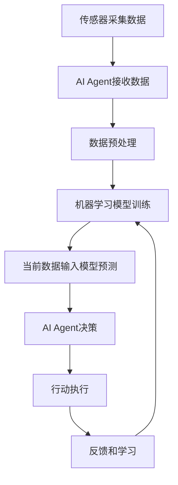

# AI Agent在智能空气质量预报中的实践

> 关键词：AI Agent、智能空气质量预报、机器学习、传感器数据、环境监测

> 摘要：本文围绕AI Agent在智能空气质量预报中的实践展开。详细阐述了AI Agent的核心概念、与空气质量预报的联系，深入分析了其核心算法原理及操作步骤，通过数学模型和公式揭示其背后的理论支撑，并给出具体的项目实战案例。探讨了AI Agent在空气质量预报中的实际应用场景，推荐了相关的学习资源、开发工具和论文著作。最后对其未来发展趋势与挑战进行总结，为该领域的研究和实践提供全面的参考。

## 1. 背景介绍 
### 1.1 目的和范围
随着全球环境问题的日益突出，空气质量成为人们关注的焦点。准确的空气质量预报对于公众的健康生活、政府的环境决策以及工业生产的合理安排都具有重要意义。传统的空气质量预报方法往往存在精度有限、难以处理复杂多变的数据等问题。AI Agent作为一种具有智能决策和自主学习能力的技术，为空气质量预报带来了新的思路和方法。本文的目的在于深入探讨AI Agent在智能空气质量预报中的应用原理、技术实现和实际效果，范围涵盖从AI Agent的基本概念到具体的项目实践，以及相关的理论模型和实际应用场景。

### 1.2 预期读者
本文预期读者包括环境科学领域的研究人员、人工智能和机器学习领域的专业人士、从事空气质量监测和预报的工程师、相关专业的学生以及对智能环境监测技术感兴趣的爱好者。

### 1.3 文档结构概述
本文首先介绍AI Agent和智能空气质量预报的相关背景知识，包括术语定义和概念解释。接着阐述AI Agent的核心概念及其与空气质量预报的联系，并给出相应的原理示意图和流程图。然后详细讲解AI Agent的核心算法原理和具体操作步骤，同时给出Python源代码示例。再通过数学模型和公式进一步解释其理论基础，并举例说明。之后展示一个项目实战案例，包括开发环境搭建、源代码实现和代码解读。随后探讨AI Agent在空气质量预报中的实际应用场景。推荐相关的学习资源、开发工具和论文著作。最后总结AI Agent在智能空气质量预报中的未来发展趋势与挑战，并提供常见问题的解答和扩展阅读参考资料。

### 1.4 术语表
#### 1.4.1 核心术语定义
- **AI Agent（人工智能智能体）**：是一种能够感知环境、根据内部状态和目标进行决策，并采取行动影响环境的智能实体。它可以通过学习和适应不断优化自身的行为。
- **智能空气质量预报**：利用先进的传感器技术、数据分析方法和人工智能算法，对空气质量进行实时监测和未来趋势预测的过程。
- **机器学习**：是一门多领域交叉学科，涉及概率论、统计学、逼近论、凸分析、算法复杂度理论等多门学科。它专门研究计算机怎样模拟或实现人类的学习行为，以获取新的知识或技能，重新组织已有的知识结构使之不断改善自身的性能。
- **传感器数据**：由各种传感器采集到的关于环境参数（如温度、湿度、污染物浓度等）的数值信息。

#### 1.4.2 相关概念解释
- **环境监测**：指通过对影响环境质量因素的代表值的测定，确定环境质量（或污染程度）及其变化趋势。环境监测的内容主要包括物理指标的监测、化学指标的监测和生态系统的监测。
- **数据挖掘**：是指从大量的数据中通过算法搜索隐藏于其中信息的过程。数据挖掘通常与计算机科学有关，并通过统计、在线分析处理、情报检索、机器学习、专家系统（依靠过去的经验法则）和模式识别等诸多方法来实现上述目标。

#### 1.4.3 缩略词列表
- **PM2.5**：细颗粒物，指环境空气中空气动力学当量直径小于等于 2.5 微米的颗粒物。
- **PM10**：可吸入颗粒物，指空气动力学当量直径小于等于10微米的颗粒物。
- **AQI**：空气质量指数，是定量描述空气质量状况的无量纲指数。

## 2. 核心概念与联系 
### 2.1 AI Agent核心概念原理
AI Agent的核心原理基于感知 - 决策 - 行动的循环过程。它通过各种传感器感知周围环境的信息，将这些信息进行处理和分析，根据内部的目标和策略进行决策，然后采取相应的行动来影响环境。AI Agent可以通过学习和进化不断优化自身的决策和行动能力。

### 2.2 AI Agent与智能空气质量预报的联系
在智能空气质量预报中，AI Agent可以扮演多个重要角色。首先，它可以作为数据采集的智能节点，通过传感器感知空气质量相关的数据，如污染物浓度、气象参数等。然后，AI Agent可以对采集到的数据进行实时分析和处理，利用机器学习算法挖掘数据中的规律和模式。基于这些分析结果，AI Agent可以做出空气质量预报的决策，并将预报信息反馈给相关的用户或系统。此外，AI Agent还可以根据实际的空气质量变化情况不断学习和调整预报模型，提高预报的准确性。

### 2.3 文本示意图
AI Agent在智能空气质量预报中的工作流程可以用以下文本描述：

传感器采集空气质量数据 -> AI Agent接收数据 -> 数据预处理（清洗、归一化等） -> 机器学习模型训练（使用历史数据） -> 当前数据输入模型进行预测 -> AI Agent根据预测结果做出决策（如发布预警、调整监测策略等） -> 行动执行（如向公众发布预报信息、通知相关部门采取措施等） -> 反馈和学习（根据实际空气质量与预报结果的差异更新模型）

### 2.4 Mermaid流程图


## 3. 核心算法原理 & 具体操作步骤 
### 3.1 核心算法原理
在智能空气质量预报中，常用的机器学习算法包括神经网络、决策树、支持向量机等。这里以神经网络为例进行详细讲解。

神经网络是一种模仿人类神经系统的计算模型，由大量的神经元组成。每个神经元接收输入信号，经过加权求和和非线性变换后输出结果。神经网络通过不断调整神经元之间的连接权重来学习输入数据和输出结果之间的映射关系。

在空气质量预报中，输入数据可以包括历史空气质量数据、气象数据等，输出结果为未来某一时刻的空气质量指数或污染物浓度。神经网络通过对大量历史数据的学习，找到输入数据和输出结果之间的复杂关系，从而实现对未来空气质量的预测。

### 3.2 Python源代码实现
```python
import numpy as np
import pandas as pd
from sklearn.neural_network import MLPRegressor
from sklearn.preprocessing import StandardScaler
from sklearn.model_selection import train_test_split

# 读取数据
data = pd.read_csv('air_quality_data.csv')

# 提取特征和标签
X = data.drop('AQI', axis=1).values
y = data['AQI'].values

# 数据标准化
scaler = StandardScaler()
X = scaler.fit_transform(X)

# 划分训练集和测试集
X_train, X_test, y_train, y_test = train_test_split(X, y, test_size=0.2, random_state=42)

# 创建神经网络模型
model = MLPRegressor(hidden_layer_sizes=(100, 50), activation='relu', solver='adam', max_iter=1000)

# 训练模型
model.fit(X_train, y_train)

# 预测
y_pred = model.predict(X_test)

# 计算均方误差
mse = np.mean((y_pred - y_test) ** 2)
print(f"均方误差: {mse}")
```

### 3.3 具体操作步骤
1. **数据采集**：使用各种传感器采集空气质量数据和气象数据，将数据存储在数据库或文件中。
2. **数据预处理**：对采集到的数据进行清洗，去除缺失值和异常值；对数据进行归一化处理，将数据缩放到相同的尺度。
3. **特征选择**：从原始数据中选择与空气质量预报相关的特征，去除无关或冗余的特征。
4. **模型训练**：使用训练数据对神经网络模型进行训练，调整模型的参数以最小化预测误差。
5. **模型评估**：使用测试数据对训练好的模型进行评估，计算评估指标（如均方误差、平均绝对误差等），评估模型的性能。
6. **预测和决策**：将当前的空气质量数据输入到训练好的模型中，得到未来的空气质量预报结果。AI Agent根据预报结果做出相应的决策，如发布预警、调整监测策略等。
7. **反馈和学习**：根据实际的空气质量与预报结果的差异，对模型进行更新和优化，提高模型的准确性。

## 4. 数学模型和公式 & 详细讲解 & 举例说明 
### 4.1 神经网络数学模型
神经网络的基本单元是神经元，其数学模型可以表示为：

$$z = \sum_{i=1}^{n} w_i x_i + b$$

$$a = f(z)$$

其中，$x_i$ 是输入信号，$w_i$ 是连接权重，$b$ 是偏置，$z$ 是加权求和的结果，$f$ 是激活函数，$a$ 是神经元的输出。

在多层神经网络中，前一层神经元的输出作为后一层神经元的输入。整个神经网络的输出可以表示为：

$$y = F(X; W, b)$$

其中，$X$ 是输入数据，$W$ 是所有连接权重的集合，$b$ 是所有偏置的集合，$F$ 是神经网络的映射函数。

### 4.2 损失函数
在训练神经网络时，需要定义一个损失函数来衡量预测结果与真实结果之间的差异。常用的损失函数是均方误差（MSE）：

$$MSE = \frac{1}{n} \sum_{i=1}^{n} (y_i - \hat{y}_i)^2$$

其中，$y_i$ 是真实值，$\hat{y}_i$ 是预测值，$n$ 是样本数量。

### 4.3 优化算法
为了最小化损失函数，需要使用优化算法来调整神经网络的参数。常用的优化算法是随机梯度下降（SGD）及其变种，如Adam算法。

SGD的更新公式为：

$$W_{t+1} = W_t - \alpha \frac{\partial L}{\partial W_t}$$

$$b_{t+1} = b_t - \alpha \frac{\partial L}{\partial b_t}$$

其中，$W_t$ 和 $b_t$ 是第 $t$ 次迭代时的权重和偏置，$\alpha$ 是学习率，$\frac{\partial L}{\partial W_t}$ 和 $\frac{\partial L}{\partial b_t}$ 是损失函数对权重和偏置的梯度。

### 4.4 举例说明
假设我们有一个简单的空气质量数据集，包含温度、湿度和PM2.5浓度三个特征，以及对应的空气质量指数（AQI）标签。我们使用一个包含一个隐藏层的神经网络进行预测。

输入数据 $X = [x_1, x_2, x_3]$，其中 $x_1$ 是温度，$x_2$ 是湿度，$x_3$ 是PM2.5浓度。

隐藏层有两个神经元，其输入和输出分别为：

$$z_{11} = w_{111} x_1 + w_{121} x_2 + w_{131} x_3 + b_{11}$$

$$a_{11} = f(z_{11})$$

$$z_{12} = w_{112} x_1 + w_{122} x_2 + w_{132} x_3 + b_{12}$$

$$a_{12} = f(z_{12})$$

输出层有一个神经元，其输入和输出为：

$$z_{21} = w_{211} a_{11} + w_{221} a_{12} + b_{21}$$

$$\hat{y} = f(z_{21})$$

其中，$w_{ijk}$ 是连接权重，$b_{ij}$ 是偏置，$f$ 是激活函数。

在训练过程中，我们使用均方误差作为损失函数，通过随机梯度下降算法不断调整权重和偏置，使得损失函数最小化。

## 5. 项目实战：代码实际案例和详细解释说明 
### 5.1  开发环境搭建
1. **安装Python**：建议使用Python 3.7及以上版本。可以从Python官方网站（https://www.python.org/downloads/）下载并安装。
2. **安装必要的库**：使用pip命令安装所需的库，包括numpy、pandas、scikit-learn等。

```bash
pip install numpy pandas scikit-learn
```

3. **准备数据集**：收集空气质量数据和气象数据，将其整理成CSV文件格式，存储在项目目录下。

### 5.2  源代码详细实现和代码解读
```python
import numpy as np
import pandas as pd
from sklearn.neural_network import MLPRegressor
from sklearn.preprocessing import StandardScaler
from sklearn.model_selection import train_test_split

# 读取数据
data = pd.read_csv('air_quality_data.csv')

# 代码解读：使用pandas的read_csv函数读取CSV文件中的数据，将其存储在DataFrame对象中。

# 提取特征和标签
X = data.drop('AQI', axis=1).values
y = data['AQI'].values

# 代码解读：使用DataFrame的drop方法去除'AQI'列，将剩余的列作为特征存储在X中；将'AQI'列作为标签存储在y中。

# 数据标准化
scaler = StandardScaler()
X = scaler.fit_transform(X)

# 代码解读：使用StandardScaler类对特征数据进行标准化处理，将数据缩放到均值为0，标准差为1的范围。

# 划分训练集和测试集
X_train, X_test, y_train, y_test = train_test_split(X, y, test_size=0.2, random_state=42)

# 代码解读：使用train_test_split函数将数据集划分为训练集和测试集，测试集占总数据集的20%。

# 创建神经网络模型
model = MLPRegressor(hidden_layer_sizes=(100, 50), activation='relu', solver='adam', max_iter=1000)

# 代码解读：使用MLPRegressor类创建一个多层感知器回归模型，隐藏层包含两个层，分别有100和50个神经元，激活函数为ReLU，优化算法为Adam，最大迭代次数为1000。

# 训练模型
model.fit(X_train, y_train)

# 代码解读：使用fit方法对模型进行训练，将训练集的特征和标签作为输入。

# 预测
y_pred = model.predict(X_test)

# 代码解读：使用predict方法对测试集进行预测，得到预测结果。

# 计算均方误差
mse = np.mean((y_pred - y_test) ** 2)
print(f"均方误差: {mse}")

# 代码解读：计算预测结果和真实结果之间的均方误差，并打印输出。
```

### 5.3  代码解读与分析
- **数据处理**：数据预处理是机器学习中非常重要的一步，它可以提高模型的性能和稳定性。在本案例中，我们使用了数据标准化处理，将数据缩放到相同的尺度，避免了不同特征之间的尺度差异对模型训练的影响。
- **模型选择**：多层感知器回归模型是一种常用的神经网络模型，它可以处理复杂的非线性关系。在本案例中，我们选择了包含两个隐藏层的神经网络模型，通过调整隐藏层的神经元数量和激活函数，可以优化模型的性能。
- **模型评估**：均方误差是一种常用的回归模型评估指标，它衡量了预测结果和真实结果之间的平均误差。在本案例中，我们使用均方误差来评估模型的性能，通过不断调整模型的参数，可以降低均方误差，提高模型的准确性。

## 6. 实际应用场景 
### 6.1 公众健康预警
AI Agent可以实时监测空气质量数据，并根据预报结果向公众发布健康预警信息。当空气质量恶化到一定程度时，及时提醒公众采取防护措施，如佩戴口罩、减少户外活动等，保护公众的健康。

### 6.2 政府环境决策
政府部门可以利用AI Agent的空气质量预报结果制定环境政策和管理措施。例如，根据预报结果调整工业生产的排放限制、优化交通流量管理、规划城市绿化等，以改善空气质量。

### 6.3 工业生产调度
工业企业可以根据AI Agent的空气质量预报结果调整生产计划和工艺参数。在空气质量较差的时段，减少高污染生产环节的运行，降低污染物排放，同时保证生产的正常进行。

### 6.4 环境科学研究
AI Agent的空气质量预报结果可以为环境科学研究提供数据支持。研究人员可以分析预报结果和实际空气质量数据之间的差异，深入了解空气质量变化的规律和机制，为环境保护和治理提供理论依据。

## 7. 工具和资源推荐
### 7.1 学习资源推荐
#### 7.1.1 书籍推荐
- 《Python机器学习》：本书详细介绍了Python在机器学习中的应用，包括数据预处理、模型选择、模型评估等内容，是学习机器学习的经典书籍。
- 《深度学习》：由深度学习领域的三位先驱Ian Goodfellow、Yoshua Bengio和Aaron Courville撰写，全面介绍了深度学习的理论和实践。
- 《环境监测与分析》：本书系统地介绍了