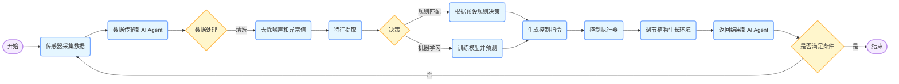

# AI Agent在智能窗台中的植物生长监测

> 关键词：AI Agent、智能窗台、植物生长监测、传感器、数据分析

> 摘要：本文围绕AI Agent在智能窗台植物生长监测中的应用展开。首先介绍了该研究的背景，包括目的、预期读者等内容。接着阐述了AI Agent、智能窗台、植物生长监测等核心概念及其联系，给出了原理和架构的示意图与流程图。详细讲解了相关核心算法原理，并使用Python代码进行阐述，同时给出了对应的数学模型和公式。通过项目实战，展示了开发环境搭建、源代码实现及代码解读。探讨了其实际应用场景，推荐了相关的学习资源、开发工具框架和论文著作。最后总结了未来发展趋势与挑战，提供了常见问题解答和扩展阅读参考资料，旨在全面深入地探讨AI Agent在智能窗台植物生长监测中的重要作用和应用前景。

## 1. 背景介绍 
### 1.1 目的和范围
随着人们对生活品质的追求以及对绿色植物的喜爱，越来越多的人选择在窗台种植各种植物。然而，植物的生长需要适宜的环境条件，如光照、温度、湿度、土壤肥力等。传统的植物养护方式往往依赖于人工经验和主观判断，难以准确把握植物的生长需求，容易导致植物生长不良甚至死亡。

本研究的目的在于利用AI Agent技术，构建智能窗台植物生长监测系统，实现对植物生长环境的实时监测和智能调控，为植物提供最适宜的生长条件，提高植物的生长质量和存活率。

本研究的范围涵盖了从传感器数据采集、AI Agent算法设计、数据分析处理到智能调控决策的整个过程，涉及到硬件设备、软件算法、数据分析等多个领域。

### 1.2 预期读者
本文的预期读者包括对人工智能、物联网、植物养护等领域感兴趣的科研人员、技术开发者、园艺爱好者以及相关行业的从业者。对于科研人员，本文可以提供新的研究思路和方法；对于技术开发者，本文可以作为开发智能窗台植物生长监测系统的参考；对于园艺爱好者，本文可以帮助他们更好地了解植物生长需求，提高植物养护水平；对于相关行业的从业者，本文可以为他们的产品研发和市场推广提供参考。

### 1.3 文档结构概述
本文将按照以下结构进行阐述：
1. **背景介绍**：介绍研究的目的、范围、预期读者和文档结构概述，以及相关术语的定义和解释。
2. **核心概念与联系**：阐述AI Agent、智能窗台、植物生长监测等核心概念的原理和架构，给出相应的文本示意图和Mermaid流程图。
3. **核心算法原理 & 具体操作步骤**：详细讲解相关核心算法原理，并使用Python代码进行阐述，同时给出具体的操作步骤。
4. **数学模型和公式 & 详细讲解 & 举例说明**：给出对应的数学模型和公式，并进行详细讲解和举例说明。
5. **项目实战：代码实际案例和详细解释说明**：通过项目实战，展示开发环境搭建、源代码实现及代码解读。
6. **实际应用场景**：探讨AI Agent在智能窗台植物生长监测中的实际应用场景。
7. **工具和资源推荐**：推荐相关的学习资源、开发工具框架和论文著作。
8. **总结：未来发展趋势与挑战**：总结AI Agent在智能窗台植物生长监测中的未来发展趋势和面临的挑战。
9. **附录：常见问题与解答**：提供常见问题的解答。
10. **扩展阅读 & 参考资料**：提供扩展阅读的资料和参考资料。

### 1.4 术语表
#### 1.4.1 核心术语定义
- **AI Agent**：人工智能代理，是一种能够感知环境、进行决策并采取行动的智能实体。
- **智能窗台**：集成了各种传感器和执行器，能够实时监测植物生长环境并进行智能调控的窗台系统。
- **植物生长监测**：对植物生长过程中的各种环境因素和生理指标进行实时监测和分析的过程。
- **传感器**：用于采集植物生长环境中的各种物理量和化学量的设备，如光照传感器、温度传感器、湿度传感器等。
- **执行器**：根据AI Agent的决策，对植物生长环境进行调控的设备，如灯光、风扇、加湿器等。

#### 1.4.2 相关概念解释
- **物联网（IoT）**：通过各种信息传感器、射频识别技术、全球定位系统、红外感应器、激光扫描器等各种装置与技术，实时采集任何需要监控、 连接、互动的物体或过程，采集其声、光、热、电、力学、化学、生物、位置等各种需要的信息，通过各类可能的网络接入，实现物与物、物与人的泛在连接，实现对物品和过程的智能化感知、识别和管理。
- **数据分析**：对采集到的传感器数据进行处理、分析和挖掘，提取有价值信息的过程。
- **机器学习**：一门多领域交叉学科，涉及概率论、统计学、逼近论、凸分析、算法复杂度理论等多门学科。它专门研究计算机怎样模拟或实现人类的学习行为，以获取新的知识或技能，重新组织已有的知识结构使之不断改善自身的性能。

#### 1.4.3 缩略词列表
- **AI**：Artificial Intelligence，人工智能
- **IoT**：Internet of Things，物联网
- **ML**：Machine Learning，机器学习

## 2. 核心概念与联系 
### 核心概念原理

#### AI Agent
AI Agent是一种能够感知环境、进行决策并采取行动的智能实体。它通过传感器感知植物生长环境中的各种信息，如光照强度、温度、湿度、土壤湿度等，然后根据预设的规则或通过机器学习算法进行决策，最后控制执行器对植物生长环境进行调控。AI Agent的核心在于其决策能力，它能够根据不同的环境条件和植物生长需求，做出最优的决策，以保证植物的健康生长。

#### 智能窗台
智能窗台是集成了各种传感器和执行器的窗台系统。传感器用于实时采集植物生长环境中的各种物理量和化学量，如光照强度、温度、湿度、土壤湿度等，并将这些数据传输到AI Agent。执行器则根据AI Agent的决策，对植物生长环境进行调控，如调节灯光亮度、控制风扇转速、开启或关闭加湿器等。智能窗台的核心在于其集成性和智能化，它能够将传感器、执行器和AI Agent有机地结合起来，实现对植物生长环境的实时监测和智能调控。

#### 植物生长监测
植物生长监测是对植物生长过程中的各种环境因素和生理指标进行实时监测和分析的过程。通过传感器采集植物生长环境中的各种信息，如光照强度、温度、湿度、土壤湿度等，然后对这些数据进行处理和分析，以了解植物的生长状态和需求。植物生长监测的核心在于其实时性和准确性，它能够及时发现植物生长过程中出现的问题，并采取相应的措施进行解决。

### 架构的文本示意图
```plaintext
智能窗台系统架构

|-------------------|
| 传感器层          |
| - 光照传感器      |
| - 温度传感器      |
| - 湿度传感器      |
| - 土壤湿度传感器  |
|-------------------|
          |
          v
|-------------------|
| 数据传输层        |
| - 有线网络        |
| - 无线网络        |
|-------------------|
          |
          v
|-------------------|
| AI Agent层        |
| - 数据处理模块    |
| - 决策模块        |
| - 控制模块        |
|-------------------|
          |
          v
|-------------------|
| 执行器层          |
| - 灯光            |
| - 风扇            |
| - 加湿器          |
|-------------------|
```

### Mermaid流程图


## 3. 核心算法原理 & 具体操作步骤 
### 核心算法原理

#### 数据处理算法
数据处理算法主要包括数据清洗和特征提取。数据清洗的目的是去除传感器采集数据中的噪声和异常值，以提高数据的质量。常用的数据清洗方法包括均值滤波、中值滤波、拉依达准则等。特征提取的目的是从清洗后的数据中提取出能够反映植物生长状态和需求的特征，如光照强度的平均值、温度的变化率等。

#### 决策算法
决策算法主要包括规则匹配和机器学习。规则匹配是根据预设的规则，对处理后的数据进行判断，从而做出决策。例如，如果光照强度低于某个阈值，则控制灯光开启。机器学习是通过训练模型，对处理后的数据进行预测，从而做出决策。常用的机器学习算法包括决策树、支持向量机、神经网络等。

### 具体操作步骤

#### 数据采集
使用各种传感器采集植物生长环境中的各种信息，如光照强度、温度、湿度、土壤湿度等。

#### 数据传输
将采集到的数据通过有线网络或无线网络传输到AI Agent。

#### 数据处理
1. **数据清洗**：使用均值滤波、中值滤波、拉依达准则等方法去除数据中的噪声和异常值。
2. **特征提取**：从清洗后的数据中提取出能够反映植物生长状态和需求的特征，如光照强度的平均值、温度的变化率等。

#### 决策
1. **规则匹配**：根据预设的规则，对处理后的数据进行判断，从而做出决策。
2. **机器学习**：使用训练好的模型，对处理后的数据进行预测，从而做出决策。

#### 控制
根据决策结果，生成控制指令，控制执行器对植物生长环境进行调控。

### Python源代码实现

```python
import numpy as np
from sklearn.tree import DecisionTreeClassifier

# 模拟传感器数据采集
def sensor_data_collection():
    # 生成随机的光照强度、温度、湿度和土壤湿度数据
    light_intensity = np.random.randint(0, 1000)
    temperature = np.random.uniform(10, 30)
    humidity = np.random.uniform(30, 80)
    soil_moisture = np.random.uniform(20, 60)
    return light_intensity, temperature, humidity, soil_moisture

# 数据清洗 - 均值滤波
def data_cleaning(data, window_size=3):
    cleaned_data = []
    for i in range(len(data)):
        if i < window_size - 1:
            cleaned_data.append(np.mean(data[:i + 1]))
        else:
            cleaned_data.append(np.mean(data[i - window_size + 1:i + 1]))
    return np.array(cleaned_data)

# 特征提取
def feature_extraction(data):
    # 计算光照强度的平均值
    light_mean = np.mean(data[:, 0])
    # 计算温度的变化率
    temperature_change_rate = np.diff(data[:, 1])
    return light_mean, temperature_change_rate

# 规则匹配决策
def rule_based_decision(light_mean, temperature):
    if light_mean < 500:
        light_control = 1  # 开启灯光
    else:
        light_control = 0  # 关闭灯光
    if temperature > 25:
        fan_control = 1  # 开启风扇
    else:
        fan_control = 0  # 关闭风扇
    return light_control, fan_control

# 机器学习决策
def machine_learning_decision(data):
    # 模拟训练数据
    X_train = np.random.rand(100, 4)
    y_train = np.random.randint(0, 2, 100)
    # 训练决策树模型
    model = DecisionTreeClassifier()
    model.fit(X_train, y_train)
    # 预测
    prediction = model.predict([data])
    return prediction[0]

# 主函数
def main():
    # 数据采集
    light_intensity, temperature, humidity, soil_moisture = sensor_data_collection()
    data = np.array([light_intensity, temperature, humidity, soil_moisture])
    # 数据清洗
    cleaned_data = data_cleaning(data)
    # 特征提取
    light_mean, temperature_change_rate = feature_extraction(cleaned_data.reshape(1, -1))
    # 规则匹配决策
    light_control, fan_control = rule_based_decision(light_mean, temperature)
    print(f"规则匹配决策：灯光控制 - {light_control}，风扇控制 - {fan_control}")
    # 机器学习决策
    ml_decision = machine_learning_decision(cleaned_data)
    print(f"机器学习决策：{ml_decision}")

if __name__ == "__main__":
    main()
```

## 4. 数学模型和公式 & 详细讲解 & 举例说明 
### 数据清洗 - 均值滤波
均值滤波是一种常用的数据平滑方法，它的基本思想是用邻域内所有像素的平均值来代替当前像素的值。对于一维数据 $x = [x_1, x_2, \cdots, x_n]$，均值滤波的公式为：

$$
y_i = \frac{1}{k} \sum_{j = \max(1, i - \lfloor\frac{k}{2}\rfloor)}^{\min(n, i + \lfloor\frac{k}{2}\rfloor)} x_j
$$

其中，$y_i$ 是滤波后的数据，$k$ 是窗口大小，$\lfloor\frac{k}{2}\rfloor$ 表示向下取整。

**详细讲解**：均值滤波的作用是去除数据中的噪声，使数据更加平滑。窗口大小 $k$ 决定了邻域的大小，$k$ 越大，滤波效果越好，但也会使数据的细节信息丢失越多。

**举例说明**：假设有一组数据 $x = [1, 2, 3, 4, 5]$，窗口大小 $k = 3$，则滤波后的结果为：

- $y_1 = \frac{1}{3} (1 + 2) = 1$
- $y_2 = \frac{1}{3} (1 + 2 + 3) = 2$
- $y_3 = \frac{1}{3} (2 + 3 + 4) = 3$
- $y_4 = \frac{1}{3} (3 + 4 + 5) = 4$
- $y_5 = \frac{1}{3} (4 + 5) = 4.5$

### 特征提取 - 光照强度平均值
光照强度平均值是指一段时间内光照强度的平均值，它可以反映植物接收到的光照总量。对于一组光照强度数据 $x = [x_1, x_2, \cdots, x_n]$，其平均值的计算公式为：

$$
\bar{x} = \frac{1}{n} \sum_{i = 1}^{n} x_i
$$

其中，$\bar{x}$ 是光照强度的平均值，$n$ 是数据的个数。

**详细讲解**：光照强度平均值可以帮助我们了解植物接收到的光照总量，从而判断植物是否需要补充光照。

**举例说明**：假设有一组光照强度数据 $x = [100, 200, 300, 400, 500]$，则其平均值为：

$$
\bar{x} = \frac{1}{5} (100 + 200 + 300 + 400 + 500) = 300
$$

### 特征提取 - 温度变化率
温度变化率是指单位时间内温度的变化量，它可以反映植物生长环境的温度稳定性。对于一组温度数据 $x = [x_1, x_2, \cdots, x_n]$，其变化率的计算公式为：

$$
r_i = x_{i + 1} - x_i
$$

其中，$r_i$ 是第 $i$ 个时间点的温度变化率。

**详细讲解**：温度变化率可以帮助我们了解植物生长环境的温度稳定性，从而判断植物是否需要调节温度。

**举例说明**：假设有一组温度数据 $x = [20, 22, 24, 26, 28]$，则其变化率为：

- $r_1 = 22 - 20 = 2$
- $r_2 = 24 - 22 = 2$
- $r_3 = 26 - 24 = 2$
- $r_4 = 28 - 26 = 2$

## 5. 项目实战：代码实际案例和详细解释说明 
### 5.1  开发环境搭建
#### 硬件环境
- **传感器**：选择合适的光照传感器、温度传感器、湿度传感器和土壤湿度传感器，如BH175