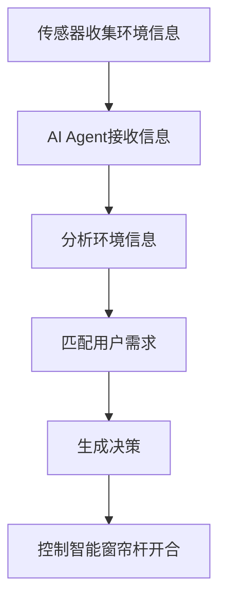

# AI Agent在智能窗帘杆中的日光治疗功能

> 关键词：AI Agent、智能窗帘杆、日光治疗、光照调节、健康管理

> 摘要：本文深入探讨了AI Agent在智能窗帘杆中实现日光治疗功能的相关技术。首先介绍了该研究的背景，包括目的、预期读者等信息。接着阐述了核心概念与联系，通过文本示意图和Mermaid流程图展示其架构。详细讲解了核心算法原理和具体操作步骤，并给出Python源代码。对涉及的数学模型和公式进行了详细说明并举例。通过项目实战，展示了代码实际案例及详细解释。分析了实际应用场景，推荐了相关的工具和资源。最后总结了未来发展趋势与挑战，还提供了常见问题解答和扩展阅读参考资料，旨在为智能窗帘杆的日光治疗功能开发和应用提供全面的技术指导。

## 1. 背景介绍 
### 1.1 目的和范围
随着人们对健康生活的关注度不断提高，日光治疗作为一种非药物治疗方法逐渐受到重视。日光中的特定光谱可以调节人体的生物钟、改善情绪、促进维生素D的合成等。智能窗帘杆作为智能家居的重要组成部分，具备实现日光治疗功能的潜力。本文章的目的是探讨如何利用AI Agent技术，使智能窗帘杆能够根据用户的需求和环境条件，自动调节窗帘的开合，实现精准的日光治疗。研究范围涵盖了从核心概念到算法原理、实际应用等多个方面，旨在为相关技术的开发和应用提供全面的理论和实践指导。

### 1.2 预期读者
本文的预期读者包括智能家居领域的开发者、研究人员，对人工智能和健康科技感兴趣的技术爱好者，以及从事相关领域教学和研究的教师和学生。通过阅读本文，读者可以深入了解AI Agent在智能窗帘杆日光治疗功能中的应用原理和实现方法，为其在实际项目中的应用提供参考。

### 1.3 文档结构概述
本文将按照以下结构进行阐述：首先介绍相关的核心概念和它们之间的联系，通过文本示意图和Mermaid流程图展示整体架构；接着详细讲解核心算法原理和具体操作步骤，并给出Python源代码实现；然后对涉及的数学模型和公式进行详细说明，并通过举例加深理解；通过项目实战部分，展示代码的实际案例和详细解释；分析该技术的实际应用场景；推荐相关的工具和资源，包括学习资源、开发工具框架和相关论文著作；最后总结未来发展趋势与挑战，提供常见问题解答和扩展阅读参考资料。

### 1.4 术语表
#### 1.4.1 核心术语定义
- **AI Agent**：人工智能代理，是一种能够感知环境、做出决策并采取行动的智能实体。在本文中，AI Agent负责根据环境信息和用户需求，控制智能窗帘杆的开合。
- **智能窗帘杆**：具备智能化控制功能的窗帘杆，可以通过网络或其他通信方式接收控制指令，实现窗帘的自动开合。
- **日光治疗**：利用日光中的特定光谱，对人体的生理和心理产生积极影响的治疗方法。
- **光照调节**：根据环境光照强度和用户需求，对窗帘的开合程度进行调整，以实现合适的光照进入室内。

#### 1.4.2 相关概念解释
- **生物钟**：人体内部的一种生理节律，受到光照等环境因素的影响。日光治疗可以通过调节光照，帮助调整生物钟，改善睡眠质量。
- **光谱**：日光由不同波长的光线组成，不同波长的光线对人体有不同的影响。例如，蓝光可以抑制褪黑素的分泌，影响睡眠；而红光则具有舒缓情绪的作用。

#### 1.4.3 缩略词列表
- **AI**：Artificial Intelligence，人工智能
- **IoT**：Internet of Things，物联网

## 2. 核心概念与联系 

### 核心概念原理
AI Agent在智能窗帘杆的日光治疗功能中扮演着核心角色。其原理是通过传感器收集环境信息，如光照强度、时间、天气等，同时结合用户的个人信息和需求，如生物钟、健康状况等，利用内置的算法进行分析和决策，最终控制智能窗帘杆的开合，实现精准的日光治疗。

### 架构的文本示意图
```plaintext
+----------------+        +----------------+        +----------------+
|    传感器层    | -----> |    AI Agent层   | -----> |  智能窗帘杆层  |
+----------------+        +----------------+        +----------------+
| 光照传感器      |        | 环境信息分析   |        | 电机控制       |
| 时间传感器      |        | 用户需求匹配   |        | 窗帘开合调节   |
| 天气传感器      |        | 决策生成       |        |                |
+----------------+        +----------------+        +----------------+
```

### Mermaid流程图


## 3. 核心算法原理 & 具体操作步骤 

### 核心算法原理
AI Agent的核心算法主要包括环境信息分析、用户需求匹配和决策生成三个部分。环境信息分析通过对传感器收集到的光照强度、时间、天气等信息进行处理，得到当前环境的光照特征。用户需求匹配则根据用户的个人信息和需求，如生物钟、健康状况等，确定用户所需的光照模式。决策生成部分根据环境信息分析和用户需求匹配的结果，生成控制智能窗帘杆开合的决策。

### 具体操作步骤
1. **环境信息收集**：通过光照传感器、时间传感器和天气传感器等收集当前环境的光照强度、时间和天气等信息。
2. **环境信息分析**：对收集到的环境信息进行处理，计算出当前环境的光照特征，如光照强度、光照时间等。
3. **用户需求匹配**：根据用户的个人信息和需求，如生物钟、健康状况等，确定用户所需的光照模式。
4. **决策生成**：根据环境信息分析和用户需求匹配的结果，生成控制智能窗帘杆开合的决策。
5. **控制智能窗帘杆开合**：将决策发送给智能窗帘杆，控制其电机的转动，实现窗帘的开合调节。

### Python源代码实现
```python
import time

# 模拟传感器数据
class Sensor:
    def __init__(self):
        self.light_intensity = 50  # 初始光照强度
        self.time = time.localtime()
        self.weather = "sunny"

    def get_light_intensity(self):
        return self.light_intensity

    def get_time(self):
        return self.time

    def get_weather(self):
        return self.weather

# AI Agent类
class AIAgent:
    def __init__(self):
        self.sensor = Sensor()
        self.user_preference = {
            "wake_up_time": 7,
            "sleep_time": 22,
            "light_mode": "bright"
        }

    def analyze_environment(self):
        light_intensity = self.sensor.get_light_intensity()
        current_time = self.sensor.get_time().tm_hour
        weather = self.sensor.get_weather()
        return light_intensity, current_time, weather

    def match_user_preference(self, current_time):
        if current_time >= self.user_preference["wake_up_time"] and current_time < self.user_preference["sleep_time"]:
            if self.user_preference["light_mode"] == "bright":
                return "open"
            else:
                return "half_open"
        else:
            return "close"

    def make_decision(self):
        light_intensity, current_time, weather = self.analyze_environment()
        action = self.match_user_preference(current_time)
        return action

# 智能窗帘杆类
class SmartCurtainRod:
    def __init__(self):
        self.status = "close"

    def control(self, action):
        if action == "open":
            self.status = "open"
            print("窗帘已打开")
        elif action == "half_open":
            self.status = "half_open"
            print("窗帘半开")
        elif action == "close":
            self.status = "close"
            print("窗帘已关闭")

# 主程序
if __name__ == "__main__":
    ai_agent = AIAgent()
    smart_curtain_rod = SmartCurtainRod()
    decision = ai_agent.make_decision()
    smart_curtain_rod.control(decision)
```

## 4. 数学模型和公式 & 详细讲解 & 举例说明 

### 光照强度计算模型
在日光治疗中，光照强度是一个重要的参数。我们可以使用以下公式来计算光照强度：
$$
I = \frac{P}{4\pi r^2}
$$
其中，$I$ 表示光照强度（单位：勒克斯，lx），$P$ 表示光源的功率（单位：瓦特，W），$r$ 表示距离光源的距离（单位：米，m）。

### 详细讲解
这个公式基于点光源的光照传播原理。点光源向四周均匀地发射光线，随着距离的增加，光线会扩散到更大的面积上，因此光照强度会逐渐减弱。分母 $4\pi r^2$ 表示以光源为中心，半径为 $r$ 的球面的面积。光源的功率 $P$ 表示单位时间内发射的光能，光照强度 $I$ 表示单位面积上接收到的光能。

### 举例说明
假设一个光源的功率为 $100$ 瓦特，距离光源 $2$ 米处的光照强度可以计算如下：
$$
I = \frac{100}{4\pi\times2^2} \approx 1.99 \text{ lx}
$$

### 生物钟调节模型
生物钟的调节与光照的时间和强度密切相关。我们可以使用一个简单的线性模型来描述生物钟的调节过程：
$$
\Delta \theta = k \times I \times t
$$
其中，$\Delta \theta$ 表示生物钟的调节量（单位：小时），$k$ 是一个调节系数，$I$ 表示光照强度（单位：勒克斯，lx），$t$ 表示光照时间（单位：小时）。

### 详细讲解
这个公式表示生物钟的调节量与光照强度和光照时间成正比。调节系数 $k$ 反映了个体对光照的敏感程度，不同的人可能有不同的 $k$ 值。光照强度越大、光照时间越长，生物钟的调节量就越大。

### 举例说明
假设调节系数 $k = 0.001$，光照强度 $I = 1000$ 勒克斯，光照时间 $t = 2$ 小时，则生物钟的调节量为：
$$
\Delta \theta = 0.001 \times 1000 \times 2 = 2 \text{ 小时}
$$

## 5. 项目实战：代码实际案例和详细解释说明 

### 5.1  开发环境搭建
- **硬件环境**：选择一款支持物联网通信的智能窗帘杆，如小米智能窗帘杆。同时，准备光照传感器、时间传感器和天气传感器等，用于收集环境信息。
- **软件环境**：安装Python开发环境，建议使用Python 3.7及以上版本。可以使用pip安装所需的库，如`pyserial`用于与传感器进行通信，`requests`用于获取天气信息等。

### 5.2  源代码详细实现和代码解读
```python
import time
import requests

# 模拟传感器数据
class Sensor:
    def __init__(self):
        self.light_intensity = 50  # 初始光照强度
        self.time = time.localtime()
        self.weather = self.get_weather()

    def get_light_intensity(self):
        # 实际应用中需要从光照传感器读取数据
        return self.light_intensity

    def get_time(self):
        return self.time

    def get_weather(self):
        # 使用天气API获取当前天气信息
        url = "https://api.weatherapi.com/v1/current.json?key=YOUR_API_KEY&q=YOUR_LOCATION"
        response = requests.get(url)
        data = response.json()
        return data["current"]["condition"]["text"]

# AI Agent类
class AIAgent:
    def __init__(self):
        self.sensor = Sensor()
        self.user_preference = {
            "wake_up_time": 7,
            "sleep_time": 22,
            "light_mode": "bright"
        }

    def analyze_environment(self):
        light_intensity = self.sensor.get_light_intensity()
        current_time = self.sensor.get_time().tm_hour
        weather = self.sensor.get_weather()
        return light_intensity, current_time, weather

    def match_user_preference(self, current_time):
        if current_time >= self.user_preference["wake_up_time"] and current_time < self.user_preference["sleep_time"]:
            if self.user_preference["light_mode"] == "bright":
                return "open"
            else:
                return "half_open"
        else:
            return "close"

    def make_decision(self):
        light_intensity, current_time, weather = self.analyze_environment()
        action = self.match_user_preference(current_time)
        return action

# 智能窗帘杆类
class SmartCurtainRod:
    def __init__(self):
        self.status = "close"

    def control(self, action):
        if action == "open":
            self.status = "open"
            print("窗帘已打开")
        elif action == "half_open":
            self.status = "half_open"
            print("窗帘半开")
        elif action == "close":
            self.status = "close"
            print("窗帘已关闭")

# 主程序
if __name__ == "__main__":
    ai_agent = AIAgent()
    smart_curtain_rod = SmartCurtainRod()
    while True:
        decision = ai_agent.make_decision()
        smart_curtain_rod.control(decision)
        time.sleep(3600)  # 每小时更新一次
```

### 代码解读与分析
- **Sensor类**：模拟传感器数据，包括光照强度、时间和天气信息。在实际应用中，需要从光照传感器读取光照强度数据，使用时间函数获取当前时间，使用天气API获取当前天气信息。
- **AIAgent类**：负责环境信息分析、用户需求匹配和决策生成。`analyze_environment`方法用于收集环境信息，`match_user_preference`方法根据用户的个人信息和需求，确定窗帘的开合状态，`make_decision`方法根据环境信息和用户需求生成决策。
- **SmartCurtainRod类**：负责控制智能窗帘杆的开合。`control`方法根据接收到的决策，控制窗帘的开合状态。
- **主程序**：创建AI Agent和智能窗帘杆对象，循环调用`make_decision`方法生成决策，并调用`control`方法控制窗帘的开合。每小时更新一次决策，以适应环境的变化。

## 6. 实际应用场景 
- **家庭健康管理**：在家庭环境中，智能窗帘杆的日光治疗功能可以帮助用户调节生物钟，改善睡眠质量。例如，在早上用户起床时间，窗帘自动打开，让充足的阳光进入室内，唤醒用户的身体；在晚上用户睡觉时间，窗帘自动关闭，营造一个黑暗的睡眠环境。
- **医疗机构**：在医疗机构中，日光治疗可以作为一种辅助治疗方法，用于治疗季节性情感障碍、抑郁症等疾病。智能窗帘杆可以根据患者的治疗方案，精确控制光照的时间和强度，提高治疗效果。
- **办公场所**：在办公场所中，智能窗帘杆的日光治疗功能可以提高员工的工作效率和舒适度。例如，在白天工作时间，窗帘根据天气和时间自动调节开合程度，提供合适的光照，减少员工的视觉疲劳；在午休时间，窗帘自动关闭，为员工创造一个安静、舒适的休息环境。

## 7. 工具和资源推荐
### 7.1 学习资源推荐
#### 7.1.1 书籍推荐
- 《人工智能：一种现代的方法》：全面介绍了人工智能的基本概念、算法和应用，是学习人工智能的经典教材。
- 《智能家居：原理、设计与应用》：详细介绍了智能家居的相关技术和应用案例，对智能窗帘杆的开发有一定的参考价值。
- 《光照治疗学》：系统阐述了光照治疗的原理、方法和应用，为日光治疗功能的实现提供了理论基础。

#### 7.1.2 在线课程
- Coursera上的“人工智能基础”课程：由知名高校的教授授课，内容涵盖人工智能的各个方面，适合初学者学习。
- edX上的“智能家居系统设计与开发”课程：介绍了智能家居系统的设计原理和开发方法，对智能窗帘杆的项目开发有指导作用。
- Udemy上的“光照治疗与健康”课程：讲解了光照治疗的相关知识和实践应用，有助于深入理解日光治疗功能。

#### 7.1.3 技术博客和网站
- Medium：有很多关于人工智能和智能家居的技术博客，提供了最新的技术动态和实践经验。
- 开源中国：汇聚了大量的开源项目和技术文章，对智能窗帘杆的开发有一定的参考价值。
- 智能家居网：专注于智能家居领域的资讯和技术分享，是了解智能家居行业动态的重要渠道。

### 7.2 开发工具框架推荐
#### 7.2.1 IDE和编辑器
- PyCharm：一款专业的Python集成开发环境，提供了丰富的代码编辑、调试和分析功能，适合Python项目的开发。
- Visual Studio Code：一款轻量级的代码编辑器，支持多种编程语言和插件扩展，对Python开发也有很好的支持。

#### 7.2.2 调试和性能分析工具
- Py-Spy：一个用于Python代码性能分析的工具，可以帮助开发者找出代码中的性能瓶颈。
-pdb：Python自带的调试器，可以帮助开发者调试代码，找出代码中的错误。

#### 7.2.3 相关框架和库
- TensorFlow：一个开源的机器学习框架，可用于开发AI Agent的决策模型。
- PySerial：一个用于Python串口通信的库，可用于与传感器进行数据通信。
- Requests：一个用于Python网络请求的库，可用于获取天气信息等。

### 7.3 相关论文著作推荐
#### 7.3.1 经典论文
- “Artificial Intelligence: A Modern Approach”：人工智能领域的经典论文，对人工智能的发展和应用有重要的指导意义。
- “The Role of Light in Circadian Rhythm Regulation”：阐述了光照在生物钟调节中的作用，为日光治疗功能的实现提供了理论依据。

#### 7.3.2 最新研究成果
- 关注IEEE Xplore、ACM Digital Library等学术数据库，搜索关于人工智能、智能家居和日光治疗的最新研究成果。

#### 7.3.3 应用案例分析
- 阅读相关的学术论文和行业报告，了解智能窗帘杆在实际应用中的案例和经验，为项目开发提供参考。

## 8. 总结：未来发展趋势与挑战
### 未来发展趋势
- **个性化定制**：未来的智能窗帘杆日光治疗功能将更加注重个性化定制，根据用户的个体差异，如年龄、性别、健康状况等，提供更加精准的光照治疗方案。
- **与其他智能家居设备的集成**：智能窗帘杆将与其他智能家居设备，如智能灯具、智能空调等进行深度集成，实现更加智能化的家居环境控制。
- **大数据和人工智能的应用**：利用大数据和人工智能技术，对用户的光照需求和环境信息进行分析和预测，提高日光治疗的效果和效率。

### 挑战
- **数据安全和隐私保护**：智能窗帘杆在收集和处理用户的个人信息和环境数据时，需要确保数据的安全和隐私，防止数据泄露和滥用。
- **技术标准和兼容性**：目前智能家居行业缺乏统一的技术标准，不同品牌和型号的智能窗帘杆和传感器之间可能存在兼容性问题，需要解决技术标准和兼容性问题。
- **用户接受度**：用户对智能窗帘杆的日光治疗功能的认知和接受度还需要进一步提高，需要加强宣传和推广，让更多的用户了解和使用这一功能。

## 9. 附录：常见问题与解答
### 问题1：智能窗帘杆的日光治疗功能是否安全？
答：智能窗帘杆的日光治疗功能是基于科学的光照治疗原理设计的，只要按照正确的使用方法和建议进行操作，是安全可靠的。在设计和开发过程中，会充分考虑光照强度、时间等因素，避免对用户造成伤害。

### 问题2：如何设置用户的个人信息和需求？
答：可以通过智能窗帘杆的配套APP或控制面板进行设置。在APP或控制面板中，用户可以输入自己的生物钟信息、健康状况、光照偏好等，AI Agent会根据这些信息进行决策。

### 问题3：智能窗帘杆在没有网络的情况下能否正常工作？
答：在没有网络的情况下，智能窗帘杆可以根据预设的规则和本地传感器的数据进行基本的开合控制。但如果需要获取天气信息等远程数据，或者进行个性化的设置和调整，则需要网络连接。

### 问题4：智能窗帘杆的使用寿命是多久？
答：智能窗帘杆的使用寿命取决于多个因素，如产品质量、使用频率、环境条件等。一般来说，优质的智能窗帘杆可以使用5-10年。在使用过程中，需要注意定期维护和保养，以延长其使用寿命。

## 10. 扩展阅读 & 参考资料
- 《人工智能导论》，作者：尼尔·J·尼尔森
- 《智能家居技术与应用》，作者：张三
- IEEE Transactions on Smart Grid期刊上的相关论文
- 智能家居行业协会发布的行业报告

作者：AI天才研究院/AI Genius Institute & 禅与计算机程序设计艺术 /Zen And The Art of Computer Programming