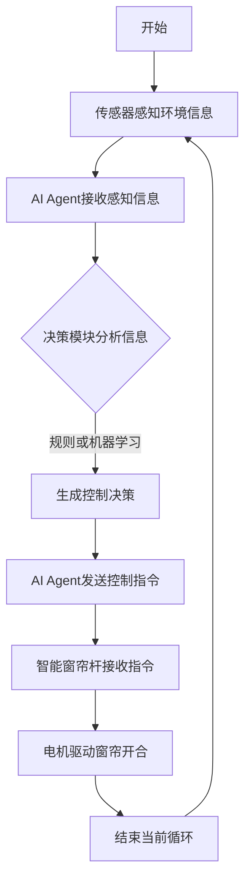

# AI Agent在智能窗帘杆中的自然光优化

> 关键词：AI Agent、智能窗帘杆、自然光优化、传感器技术、机器学习

> 摘要：本文聚焦于AI Agent在智能窗帘杆中的自然光优化应用。首先介绍了相关背景，包括目的、预期读者等内容。接着阐述了核心概念及联系，详细说明了AI Agent、智能窗帘杆等概念及其相互关系，并通过示意图和流程图进行直观展示。在核心算法原理部分，使用Python代码对算法进行了详细阐述。同时给出了相关的数学模型和公式，并举例说明。通过项目实战，搭建开发环境，详细实现并解读了源代码。还探讨了实际应用场景，推荐了学习资源、开发工具框架和相关论文著作。最后总结了未来发展趋势与挑战，提供了常见问题解答和扩展阅读参考资料，旨在为智能窗帘杆自然光优化领域的研究和实践提供全面而深入的指导。

## 1. 背景介绍 
### 1.1 目的和范围
随着智能家居技术的快速发展，人们对居住环境的舒适度和能源效率有了更高的要求。自然光作为一种免费且环保的资源，合理利用它可以改善室内采光条件、提高居住者的舒适度，同时减少人工照明的使用，降低能源消耗。本文章的目的在于探讨如何利用AI Agent技术实现智能窗帘杆对自然光的优化控制。具体范围涵盖了AI Agent的工作原理、智能窗帘杆的控制机制、自然光优化的算法实现，以及实际应用场景和相关工具资源的推荐等方面。

### 1.2 预期读者
本文的预期读者包括智能家居领域的开发者、研究人员，对AI技术和智能硬件应用感兴趣的技术爱好者，以及从事建筑节能、室内环境设计等相关领域的专业人士。这些读者希望了解如何将AI Agent技术应用于智能窗帘杆，以实现自然光的优化利用，从而提升室内环境质量和能源效率。

### 1.3 文档结构概述
本文将按照以下结构进行组织：首先介绍背景信息，包括目的、预期读者和文档结构概述等内容。接着阐述核心概念与联系，详细解释AI Agent、智能窗帘杆等核心概念，并展示它们之间的关系。然后深入探讨核心算法原理和具体操作步骤，使用Python代码进行详细说明。同时给出相关的数学模型和公式，并举例进行解释。通过项目实战部分，搭建开发环境，实现源代码并进行详细解读。之后讨论实际应用场景，推荐学习资源、开发工具框架和相关论文著作。最后总结未来发展趋势与挑战，提供常见问题解答和扩展阅读参考资料。

### 1.4 术语表
#### 1.4.1 核心术语定义
- **AI Agent（人工智能代理）**：是一种能够感知环境、根据感知信息进行决策，并通过执行器对环境产生影响的智能实体。在本文中，AI Agent负责感知室内外的光照、时间等信息，根据这些信息决策智能窗帘杆的开合状态，以实现自然光的优化。
- **智能窗帘杆**：是一种具备智能化控制功能的窗帘杆，它可以通过电机驱动窗帘的开合，并且能够与AI Agent进行通信，接收AI Agent发送的控制指令。
- **自然光优化**：指的是通过合理控制智能窗帘杆的开合，使室内获得适量的自然光，满足居住者的采光需求，同时减少人工照明的使用，提高能源效率。

#### 1.4.2 相关概念解释
- **传感器技术**：用于感知环境信息，如光照传感器可以测量室内外的光照强度，时间传感器可以获取当前的时间信息。这些传感器将感知到的信息传输给AI Agent，为其决策提供依据。
- **机器学习**：是AI Agent实现智能决策的重要技术手段。通过对大量历史数据的学习，机器学习算法可以建立光照条件与窗帘开合状态之间的映射关系，从而使AI Agent能够根据当前的光照条件做出合理的决策。

#### 1.4.3 缩略词列表
- **AI（Artificial Intelligence）**：人工智能
- **ML（Machine Learning）**：机器学习

## 2. 核心概念与联系 
### 核心概念原理
#### AI Agent原理
AI Agent的工作原理基于感知 - 决策 - 行动的循环。它通过传感器感知环境中的光照强度、时间等信息，将这些信息作为输入传递给决策模块。决策模块根据预设的规则或通过机器学习算法对输入信息进行分析处理，生成相应的决策结果。最后，AI Agent将决策结果通过执行器发送给智能窗帘杆，控制其开合状态。

#### 智能窗帘杆原理
智能窗帘杆主要由电机、控制器和机械结构组成。电机作为动力源，通过控制器接收AI Agent发送的控制指令，驱动窗帘的开合。机械结构则负责支撑窗帘并保证其平稳移动。

#### 自然光优化原理
自然光优化的核心是根据室内外的光照条件和居住者的需求，动态调整智能窗帘杆的开合状态。在白天，当室外光照充足时，适当打开窗帘，让自然光进入室内，减少人工照明的使用；当室外光照过强时，关闭部分或全部窗帘，避免室内光线过亮和温度过高。在晚上或光照不足时，关闭窗帘，使用人工照明满足室内采光需求。

### 架构的文本示意图
```plaintext
          +---------------------+
          |       AI Agent      |
          |---------------------|
          | - 感知模块         |
          | - 决策模块         |
          | - 执行模块         |
          +---------------------+
                  |
                  | 感知信息
                  v
 +------------------------------+
 |           传感器网络         |
 |------------------------------|
 | - 光照传感器                |
 | - 时间传感器                |
 | - 其他环境传感器            |
 +------------------------------+
                  |
                  | 控制指令
                  v
 +------------------------------+
 |         智能窗帘杆系统       |
 |------------------------------|
 | - 电机控制器                |
 | - 电机                      |
 | - 窗帘机械结构              |
 +------------------------------+
```

### Mermaid流程图


## 3. 核心算法原理 & 具体操作步骤 
### 核心算法原理
我们可以使用简单的基于规则的算法和机器学习算法来实现AI Agent的决策功能。

#### 基于规则的算法
基于规则的算法根据预设的光照强度阈值和时间条件来控制智能窗帘杆的开合。例如，当室外光照强度高于某个阈值且时间在白天时，打开窗帘；当光照强度低于另一个阈值或时间在晚上时，关闭窗帘。

#### 机器学习算法
机器学习算法可以通过对大量历史数据的学习，建立光照条件与窗帘开合状态之间的复杂映射关系。常见的机器学习算法包括决策树、神经网络等。在本应用中，我们可以使用决策树算法，它可以根据多个特征（如光照强度、时间、季节等）进行决策。

### 具体操作步骤
#### 数据收集
使用光照传感器和时间传感器收集室内外的光照强度和时间信息，同时记录对应的窗帘开合状态，形成历史数据集。

#### 数据预处理
对收集到的数据进行清洗、归一化等预处理操作，去除噪声数据，将不同范围的数据统一到相同的尺度上，以便机器学习算法更好地处理。

#### 模型训练
使用预处理后的数据对决策树模型进行训练，调整模型的参数，使其能够准确地预测窗帘的开合状态。

#### 决策执行
在实际应用中，AI Agent实时获取传感器数据，将其输入到训练好的决策树模型中，得到预测的窗帘开合状态，并将相应的控制指令发送给智能窗帘杆。

### Python源代码实现
```python
import pandas as pd
from sklearn.tree import DecisionTreeClassifier
from sklearn.model_selection import train_test_split
from sklearn.preprocessing import StandardScaler

# 数据收集与预处理
# 假设我们有一个包含光照强度、时间和窗帘开合状态的数据集
data = {
    'light_intensity': [100, 200, 300, 400, 500],
    'time': [8, 10, 12, 14, 16],
    'curtain_status': [1, 1, 1, 0, 0]
}
df = pd.DataFrame(data)

# 分离特征和标签
X = df[['light_intensity', 'time']]
y = df['curtain_status']

# 数据归一化
scaler = StandardScaler()
X_scaled = scaler.fit_transform(X)

# 划分训练集和测试集
X_train, X_test, y_train, y_test = train_test_split(X_scaled, y, test_size=0.2, random_state=42)

# 模型训练
model = DecisionTreeClassifier()
model.fit(X_train, y_train)

# 决策执行
# 假设当前光照强度为350，时间为13点
current_light_intensity = 350
current_time = 13
current_data = [[current_light_intensity, current_time]]
current_data_scaled = scaler.transform(current_data)
predicted_status = model.predict(current_data_scaled)

print(f"预测的窗帘开合状态: {predicted_status[0]}")
```

## 4. 数学模型和公式 & 详细讲解 & 举例说明 
### 基于规则的数学模型
假设我们设定两个光照强度阈值 $I_{min}$ 和 $I_{max}$，以及白天时间范围 $[t_{start}, t_{end}]$。设当前光照强度为 $I$，当前时间为 $t$，窗帘开合状态为 $S$，则基于规则的数学模型可以表示为：

$$
S = 
\begin{cases}
1, & \text{if } I > I_{max} \text{ and } t_{start} \leq t \leq t_{end} \\
0, & \text{if } I < I_{min} \text{ or } t < t_{start} \text{ or } t > t_{end}
\end{cases}
$$

其中，$S = 1$ 表示窗帘打开，$S = 0$ 表示窗帘关闭。

#### 举例说明
假设 $I_{min} = 100$，$I_{max} = 300$，$t_{start} = 8$，$t_{end} = 18$。如果当前光照强度 $I = 400$，时间 $t = 10$，满足 $I > I_{max}$ 且 $t_{start} \leq t \leq t_{end}$，则窗帘开合状态 $S = 1$，即窗帘打开。

### 决策树模型的数学原理
决策树是一种基于树结构进行决策的机器学习模型。它通过对特征空间进行划分，将样本分配到不同的叶子节点，每个叶子节点对应一个决策结果。决策树的构建过程通常基于信息增益、基尼不纯度等指标来选择最优的划分特征和划分点。

#### 信息增益
信息增益是衡量划分前后数据集纯度变化的指标。设数据集 $D$ 有 $|D|$ 个样本，第 $k$ 类样本的数量为 $|D_k|$，则数据集 $D$ 的信息熵为：

$$
Ent(D) = -\sum_{k=1}^{K} \frac{|D_k|}{|D|} \log_2 \frac{|D_k|}{|D|}
$$

其中，$K$ 是类别数。

假设使用特征 $a$ 对数据集 $D$ 进行划分，将 $D$ 划分为 $V$ 个子集 $\{D^1, D^2, \cdots, D^V\}$，则划分后的信息熵为：

$$
Ent(D|a) = \sum_{v=1}^{V} \frac{|D^v|}{|D|} Ent(D^v)
$$

特征 $a$ 的信息增益为：

$$
Gain(D, a) = Ent(D) - Ent(D|a)
$$

决策树在构建过程中，会选择信息增益最大的特征进行划分。

#### 举例说明
假设有一个包含光照强度和时间的数据集，用于预测窗帘的开合状态。我们可以计算每个特征（光照强度、时间）的信息增益，选择信息增益最大的特征作为根节点进行划分。例如，计算得到光照强度的信息增益为 0.3，时间的信息增益为 0.2，则选择光照强度作为根节点进行划分。

## 5. 项目实战：代码实际案例和详细解释说明 
### 5.1  开发环境搭建
#### 硬件环境
- **智能窗帘杆**：选择支持电机驱动和远程控制的智能窗帘杆，如小米智能窗帘杆等。
- **传感器**：光照传感器和时间传感器。可以使用Arduino等开发板连接传感器，实现数据的采集。
- **主控设备**：选择树莓派等单板计算机作为主控设备，运行AI Agent程序，并与传感器和智能窗帘杆进行通信。

#### 软件环境
- **操作系统**：在树莓派上安装Raspbian操作系统。
- **开发语言**：使用Python作为开发语言，因为Python具有丰富的机器学习库和易于使用的特点。
- **机器学习库**：安装scikit-learn库，用于实现决策树模型。

### 5.2  源代码详细实现和代码解读
```python
import RPi.GPIO as GPIO  # 导入树莓派GPIO控制库
import time
from sklearn.tree import DecisionTreeClassifier
from sklearn.preprocessing import StandardScaler
import pandas as pd

# 模拟传感器数据收集
def collect_sensor_data():
    # 这里可以替换为实际的传感器读取代码
    light_intensity = 300  # 模拟光照强度
    current_time = time.localtime().tm_hour  # 获取当前时间的小时数
    return light_intensity, current_time

# 初始化智能窗帘杆控制引脚
def init_curtain_control():
    GPIO.setmode(GPIO.BCM)
    curtain_pin = 18  # 假设使用GPIO 18控制窗帘电机
    GPIO.setup(curtain_pin, GPIO.OUT)
    return curtain_pin

# 控制窗帘开合
def control_curtain(curtain_pin, status):
    if status == 1:
        GPIO.output(curtain_pin, GPIO.HIGH)  # 打开窗帘
    else:
        GPIO.output(curtain_pin, GPIO.LOW)  # 关闭窗帘

# 数据预处理和模型训练
def train_model():
    # 假设我们有一个包含光照强度、时间和窗帘开合状态的数据集
    data = {
        'light_intensity': [100, 200, 300, 400, 500],
        'time': [8, 10, 12, 14, 16],
        'curtain_status': [1, 1, 1, 0, 0]
    }
    df = pd.DataFrame(data)

    # 分离特征和标签
    X = df[['light_intensity', 'time']]
    y = df['curtain_status']

    # 数据归一化
    scaler = StandardScaler()
    X_scaled = scaler.fit_transform(X)

    # 模型训练
    model = DecisionTreeClassifier()
    model.fit(X_scaled, y)

    return model, scaler

# 主程序
def main():
    curtain_pin = init_curtain_control()
    model, scaler = train_model()

    while True:
        light_intensity, current_time = collect_sensor_data()
        current_data = [[light_intensity, current_time]]
        current_data_scaled = scaler.transform(current_data)
        predicted_status = model.predict(current_data_scaled)

        control_curtain(curtain_pin, predicted_status[0])
        time.sleep(60)  # 每隔60秒进行一次决策

if __name__ == "__main__":
    try:
        main()
    except KeyboardInterrupt:
        GPIO.cleanup()
```

### 5.3  代码解读与分析
- **collect_sensor_data函数**：模拟传感器数据的收集，实际应用中需要替换为真实的传感器读取代码。该函数返回当前的光照强度和时间。
- **init_curtain_control函数**：初始化树莓派的GPIO引脚，用于控制智能窗帘杆的电机。
- **control_curtain函数**：根据决策结果控制窗帘的开合状态。如果决策结果为1，则打开窗帘；如果决策结果为0，则关闭窗帘。
- **train_model函数**：实现数据预处理和模型训练的功能。首先将数据集划分为特征和标签，然后对特征数据进行归一化处理，最后使用决策树模型进行训练。
- **main函数**：主程序循环，不断收集传感器数据，将其输入到训练好的模型中进行预测，根据预测结果控制窗帘的开合。每隔60秒进行一次决策。

## 6. 实际应用场景 
### 家庭住宅
在家庭住宅中，AI Agent控制的智能窗帘杆可以根据室内外的光照条件自动调整窗帘的开合状态。在白天，当室外阳光充足时，打开窗帘让自然光进入室内，提高居住者的舒适度，同时减少人工照明的使用，降低能源消耗。在晚上或光照不足时，关闭窗帘，提供更好的隐私保护。此外，还可以根据居住者的作息时间设置定时开关窗帘的功能，实现个性化的控制。

### 商业办公场所
在商业办公场所，智能窗帘杆的自然光优化功能可以提高员工的工作效率和舒适度。在白天，通过合理控制窗帘的开合，使室内光线均匀柔和，减少员工眼睛疲劳。同时，减少人工照明的使用可以降低办公场所的能源成本。此外，对于一些对光线有特殊要求的办公区域，如会议室、设计工作室等，可以根据不同的使用场景精确控制窗帘的开合。

### 酒店客房
在酒店客房中，智能窗帘杆可以为客人提供更加舒适和便捷的居住体验。客人可以通过手机APP或客房内的控制面板手动控制窗帘的开合，也可以让AI Agent根据光照条件自动调整。在客人入住期间，根据不同的时间段和光照情况，自动打开或关闭窗帘，营造出温馨舒适的居住环境。

## 7. 工具和资源推荐
### 7.1 学习资源推荐
#### 7.1.1 书籍推荐
- 《机器学习》（周志华著）：这本书全面介绍了机器学习的基本概念、算法和应用，是机器学习领域的经典教材。
- 《Python机器学习实战》（Sebastian Raschka著）：通过实际案例介绍了如何使用Python实现机器学习算法，适合初学者快速上手。
- 《智能家居技术与应用》：详细介绍了智能家居的各个方面，包括智能窗帘杆等智能设备的原理和应用。

#### 7.1.2 在线课程
- Coursera上的“机器学习”课程（Andrew Ng教授授课）：该课程是机器学习领域的经典在线课程，内容系统全面，讲解深入浅出。
- edX上的“人工智能基础”课程：介绍了人工智能的基本概念、技术和应用，对理解AI Agent有很大帮助。
- 中国大学MOOC上的“智能家居系统设计与实践”课程：结合实际案例，介绍了智能家居系统的设计和实现方法。

#### 7.1.3 技术博客和网站
- Medium：上面有很多关于人工智能、机器学习和智能家居的技术文章和案例分享。
- 开源中国：提供了丰富的开源项目和技术文章，对智能家居开发有一定的参考价值。
- 电子发烧友网：专注于电子技术领域，有很多关于传感器技术和智能硬件开发的文章和资料。

### 7.2 开发工具框架推荐
#### 7.2.1 IDE和编辑器
- PyCharm：是一款专业的Python集成开发环境，具有代码自动补全、调试等强大功能，适合Python项目的开发。
- Visual Studio Code：轻量级的代码编辑器，支持多种编程语言和插件扩展，对Python开发也有很好的支持。
- Arduino IDE：用于Arduino开发板的编程，方便进行传感器数据的采集和处理。

#### 7.2.2 调试和性能分析工具
- pdb：Python自带的调试工具，可以帮助开发者定位代码中的问题。
- TensorBoard：用于可视化深度学习模型的训练过程和性能指标，对于使用机器学习算法的项目有一定的帮助。
- Raspi-config：树莓派的配置工具，可以进行系统设置、网络配置等操作，方便开发环境的搭建和调试。

#### 7.2.3 相关框架和库
- scikit-learn：是Python中常用的机器学习库，提供了丰富的机器学习算法和工具，如决策树、神经网络等。
- OpenCV：用于计算机视觉任务的开源库，可以处理图像和视频数据，在一些需要结合视觉信息的智能家居应用中有广泛的应用。
- MQTT：一种轻量级的消息传输协议，常用于物联网设备之间的通信，智能窗帘杆和AI Agent之间可以使用MQTT协议进行通信。

### 7.3 相关论文著作推荐
#### 7.3.1 经典论文
- “A Survey on Artificial Intelligence Agents”：对人工智能代理的概念、分类和应用进行了全面的综述。
- “Decision Trees for Classification and Regression”：详细介绍了决策树算法的原理和应用。
- “Smart Home Energy Management Systems: Concept, Configurations, and Modeling”：探讨了智能家居能源管理系统的概念、配置和建模方法，对智能窗帘杆的自然光优化有一定的参考价值。

#### 7.3.2 最新研究成果
- 可以关注IEEE Transactions on Smart Grid、ACM Transactions on Intelligent Systems and Technology等期刊上的最新研究成果，了解AI Agent在智能家居领域的最新应用和发展趋势。
- 参加相关的学术会议，如ACM SIGKDD、IEEE International Conference on Pervasive Computing and Communications等，获取最新的研究动态。

#### 7.3.3 应用案例分析
- 可以查阅一些智能家居行业的报告和案例分析，了解AI Agent在智能窗帘杆等智能设备中的实际应用情况和效果评估。例如，某些智能家居厂商发布的产品白皮书和应用案例分享。

## 8. 总结：未来发展趋势与挑战
### 未来发展趋势
#### 多传感器融合
未来的智能窗帘杆系统将不仅仅依赖于光照传感器和时间传感器，还会融合更多类型的传感器，如温度传感器、湿度传感器、人体红外传感器等。通过多传感器融合，AI Agent可以获取更全面的环境信息，从而做出更加精准的决策，进一步优化自然光的利用。

#### 与其他智能家居设备的集成
智能窗帘杆将与其他智能家居设备，如智能灯光、智能空调等进行深度集成。例如，当智能窗帘杆根据光照条件打开窗帘时，智能灯光系统可以自动调整亮度；当室内温度过高时，智能窗帘杆可以关闭窗帘，同时智能空调可以自动调节温度。通过设备之间的协同工作，提高整个智能家居系统的智能化水平和用户体验。

#### 强化学习的应用
强化学习是一种通过智能体与环境进行交互，不断学习最优策略的机器学习方法。未来，AI Agent在智能窗帘杆中的应用可能会引入强化学习算法，使智能窗帘杆能够根据不同的环境和用户反馈，动态调整决策策略，实现更加智能和自适应的自然光优化。

### 挑战
#### 数据隐私和安全
智能窗帘杆系统需要收集和处理大量的环境数据和用户信息，如光照强度、时间、用户的作息习惯等。这些数据的隐私和安全问题是一个重要的挑战。需要采取有效的数据加密、访问控制等技术手段，保护用户数据的安全和隐私。

#### 算法的准确性和鲁棒性
AI Agent的决策算法需要在不同的环境条件下都能准确地预测窗帘的开合状态。然而，实际环境中存在很多不确定性因素，如天气变化、光照干扰等，这些因素可能会影响算法的准确性和鲁棒性。需要不断优化算法，提高其在复杂环境下的性能。

#### 标准和兼容性
目前智能家居行业缺乏统一的标准和规范，不同品牌和型号的智能窗帘杆和传感器可能存在兼容性问题。这给系统的集成和开发带来了一定的困难。需要推动行业标准的制定，提高设备之间的兼容性和互操作性。

## 9. 附录：常见问题与解答
### 问题1：如何选择合适的智能窗帘杆和传感器？
解答：选择智能窗帘杆时，需要考虑其电机的功率、噪音水平、控制方式等因素。建议选择知名品牌的产品，确保其质量和稳定性。选择传感器时，要根据实际需求选择合适的类型和精度。例如，光照传感器的测量范围和精度要能够满足实际应用的要求。

### 问题2：AI Agent的决策算法是否可以根据不同的场景进行调整？
解答：可以。基于规则的算法可以通过修改预设的规则来适应不同的场景，如不同的季节、不同的地区等。机器学习算法可以通过重新训练模型来调整决策策略。可以收集不同场景下的历史数据，对模型进行增量训练，使其能够更好地适应新的场景。

### 问题3：智能窗帘杆系统的安装和调试复杂吗？
解答：智能窗帘杆系统的安装和调试相对来说有一定的技术要求。如果您不熟悉电子设备和编程，建议找专业的安装人员进行安装和调试。在安装过程中，需要正确连接传感器和智能窗帘杆，确保通信正常。调试过程中，需要对AI Agent的决策算法进行参数调整，使其能够准确地控制窗帘的开合。

### 问题4：智能窗帘杆系统的能耗如何？
解答：智能窗帘杆系统的能耗主要来自于电机的驱动和传感器的运行。一般来说，智能窗帘杆的电机功率较小，能耗相对较低。传感器的能耗也比较小，尤其是一些低功耗的传感器。通过合理控制窗帘的开合，减少人工照明的使用，可以降低整个室内环境的能耗。

## 10. 扩展阅读 & 参考资料
### 扩展阅读
- 《物联网：技术、应用与创新》：深入介绍了物联网的相关技术和应用，对理解智能窗帘杆等物联网设备有很大的帮助。
- 《深度学习》（Ian Goodfellow等著）：详细介绍了深度学习的原理和算法，对于进一步研究AI Agent的决策算法有一定的参考价值。
- 《智能家居安全与隐私》：关注智能家居系统中的安全和隐私问题，提供了一些解决方案和建议。

### 参考资料
- 智能家居行业相关的技术标准和规范，如IEEE 802.15.4、ZigBee等。
- 智能窗帘杆和传感器产品的官方文档和技术手册。
- 相关的学术论文和研究报告，可以通过学术数据库，如IEEE Xplore、ACM Digital Library等进行查找。

作者：AI天才研究院/AI Genius Institute & 禅与计算机程序设计艺术 /Zen And The Art of Computer Programming