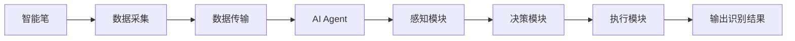

# AI Agent在智能笔中的手写识别转换

> 关键词：AI Agent、智能笔、手写识别转换、自然语言处理、机器学习

> 摘要：本文围绕AI Agent在智能笔手写识别转换中的应用展开。详细介绍了相关核心概念、算法原理、数学模型，通过实际案例展示了开发过程。探讨了其在教育、办公等领域的应用场景，推荐了学习资源、开发工具和相关论文，最后对未来发展趋势与挑战进行了总结，并给出常见问题解答和参考资料，旨在为开发者和研究者提供全面深入的技术指导。

## 1. 背景介绍 
### 1.1 目的和范围
随着科技的不断发展，智能笔作为一种便捷的输入设备，逐渐受到人们的关注。而AI Agent在智能笔手写识别转换中的应用，能够极大地提升智能笔的功能和用户体验。本文的目的在于深入探讨AI Agent如何实现智能笔手写识别转换，涵盖从核心概念到实际应用的各个方面，为相关领域的研究和开发提供理论支持和实践指导。

### 1.2 预期读者
本文预期读者包括人工智能领域的研究者、智能笔开发的工程师、对智能设备和手写识别技术感兴趣的技术爱好者等。无论您是初学者希望了解基本原理，还是专业人士寻求技术突破，都能从本文中获得有价值的信息。

### 1.3 文档结构概述
本文将首先介绍相关的核心概念和联系，包括AI Agent和手写识别转换的基本原理和架构。接着详细阐述核心算法原理和具体操作步骤，并给出Python源代码示例。然后介绍数学模型和公式，通过具体例子进行说明。之后通过项目实战展示代码的实际实现和详细解释。再探讨AI Agent在智能笔手写识别转换中的实际应用场景。随后推荐相关的学习资源、开发工具和论文著作。最后对未来发展趋势与挑战进行总结，提供常见问题解答和参考资料。

### 1.4 术语表
#### 1.4.1 核心术语定义
- **AI Agent**：是一种能够感知环境、做出决策并采取行动以实现特定目标的智能实体。在本文中，AI Agent负责处理智能笔采集的手写数据，进行识别和转换。
- **智能笔**：一种具备数据采集和传输功能的笔，能够记录书写轨迹和压力等信息，并将其传输到其他设备进行处理。
- **手写识别转换**：将智能笔采集的手写轨迹信息转换为可编辑的文本或其他形式的数据的过程。

#### 1.4.2 相关概念解释
- **自然语言处理（NLP）**：是AI的一个重要领域，主要研究如何让计算机理解和处理人类语言。在手写识别转换中，NLP技术可用于对识别出的文本进行进一步处理和分析。
- **机器学习（ML）**：是一门多领域交叉学科，涉及概率论、统计学、逼近论、凸分析、算法复杂度理论等多门学科。它专门研究计算机怎样模拟或实现人类的学习行为，以获取新的知识或技能，重新组织已有的知识结构使之不断改善自身的性能。在手写识别中，机器学习算法可用于训练模型，提高识别准确率。

#### 1.4.3 缩略词列表
- **AI**：Artificial Intelligence，人工智能
- **ML**：Machine Learning，机器学习
- **NLP**：Natural Language Processing，自然语言处理

## 2. 核心概念与联系 

### 核心概念原理
#### AI Agent
AI Agent可以看作是一个智能的决策者，它接收来自智能笔的手写数据作为输入，经过一系列的处理和分析，最终输出识别转换后的结果。AI Agent通常由感知模块、决策模块和执行模块组成。感知模块负责接收手写数据，决策模块根据预设的规则或训练好的模型对数据进行分析和判断，执行模块将决策结果转换为具体的输出，如文本或指令。

#### 手写识别转换
手写识别转换的基本原理是将手写轨迹信息进行特征提取，然后根据这些特征与预先训练好的模型进行匹配，从而识别出对应的字符或符号。这一过程通常包括预处理、特征提取、分类识别等步骤。预处理主要是对采集到的手写数据进行去噪、归一化等操作，以提高数据的质量。特征提取则是从预处理后的数据中提取出能够代表手写字符的特征，如笔画的长度、方向、曲率等。分类识别是将提取的特征与模型进行匹配，确定对应的字符或符号。

### 架构的文本示意图
```plaintext
智能笔 -> 数据采集 -> 数据传输 -> AI Agent
                                        |
                                        |-- 感知模块（接收手写数据）
                                        |
                                        |-- 决策模块（分析判断）
                                        |
                                        |-- 执行模块（输出识别结果）
```

### Mermaid流程图


## 3. 核心算法原理 & 具体操作步骤 

### 核心算法原理
在手写识别转换中，常用的算法包括支持向量机（SVM）、卷积神经网络（CNN）等。这里以卷积神经网络为例进行详细介绍。

卷积神经网络是一种专门用于处理具有网格结构数据的深度学习模型，非常适合处理手写图像数据。它通过卷积层、池化层和全连接层等组件，自动提取手写数据的特征，并进行分类识别。

### 具体操作步骤
#### 步骤1：数据预处理
首先，需要对采集到的手写数据进行预处理，包括去噪、归一化等操作。以下是一个简单的Python代码示例：
```python
import numpy as np
from skimage import filters, transform

def preprocess_data(data):
    # 去噪
    denoised_data = filters.median(data)
    # 归一化
    normalized_data = transform.resize(denoised_data, (28, 28))
    return normalized_data

# 示例数据
sample_data = np.random.rand(100, 100)
preprocessed_data = preprocess_data(sample_data)
```

#### 步骤2：构建卷积神经网络模型
使用Keras库构建一个简单的卷积神经网络模型：
```python
from tensorflow.keras.models import Sequential
from tensorflow.keras.layers import Conv2D, MaxPooling2D, Flatten, Dense

model = Sequential([
    Conv2D(32, (3, 3), activation='relu', input_shape=(28, 28, 1)),
    MaxPooling2D((2, 2)),
    Conv2D(64, (3, 3), activation='relu'),
    MaxPooling2D((2, 2)),
    Flatten(),
    Dense(64, activation='relu'),
    Dense(10, activation='softmax')
])

model.compile(optimizer='adam',
              loss='sparse_categorical_crossentropy',
              metrics=['accuracy'])
```

#### 步骤3：训练模型
使用训练数据对模型进行训练：
```python
# 假设已经有训练数据 x_train 和标签 y_train
x_train = np.random.rand(1000, 28, 28, 1)
y_train = np.random.randint(0, 10, 1000)

model.fit(x_train, y_train, epochs=5, batch_size=32)
```

#### 步骤4：进行识别转换
使用训练好的模型对新的手写数据进行识别转换：
```python
# 假设已经有新的手写数据 new_data
new_data = np.random.rand(1, 28, 28, 1)
predictions = model.predict(new_data)
predicted_class = np.argmax(predictions)
print(f"识别结果: {predicted_class}")
```

## 4. 数学模型和公式 & 详细讲解 & 举例说明 

### 卷积操作
卷积操作是卷积神经网络的核心操作之一，它通过卷积核与输入数据进行卷积运算，提取数据的特征。卷积操作的数学公式如下：
$$
y_{i,j} = \sum_{m=0}^{M-1} \sum_{n=0}^{N-1} x_{i+m,j+n} \cdot k_{m,n}
$$
其中，$x$ 是输入数据，$k$ 是卷积核，$y$ 是卷积结果，$M$ 和 $N$ 分别是卷积核的高度和宽度。

### 池化操作
池化操作用于减少数据的维度，同时保留重要的特征信息。常用的池化操作有最大池化和平均池化。最大池化的数学公式如下：
$$
y_{i,j} = \max_{m=0}^{M-1} \max_{n=0}^{N-1} x_{i \cdot s + m, j \cdot s + n}
$$
其中，$x$ 是输入数据，$y$ 是池化结果，$s$ 是池化步长，$M$ 和 $N$ 分别是池化窗口的高度和宽度。

### 全连接层
全连接层将卷积层和池化层提取的特征进行整合，并进行分类识别。全连接层的数学公式如下：
$$
y_j = \sigma \left( \sum_{i=1}^{n} w_{ij} x_i + b_j \right)
$$
其中，$x$ 是输入向量，$w$ 是权重矩阵，$b$ 是偏置向量，$\sigma$ 是激活函数。

### 举例说明
假设我们有一个 $3 \times 3$ 的输入数据 $x$ 和一个 $2 \times 2$ 的卷积核 $k$：
$$
x = \begin{bmatrix}
1 & 2 & 3 \\
4 & 5 & 6 \\
7 & 8 & 9
\end{bmatrix}, \quad
k = \begin{bmatrix}
1 & 2 \\
3 & 4
\end{bmatrix}
$$
使用卷积操作计算卷积结果 $y$：
$$
y_{0,0} = 1 \times 1 + 2 \times 2 + 4 \times 3 + 5 \times 4 = 37
$$
$$
y_{0,1} = 2 \times 1 + 3 \times 2 + 5 \times 3 + 6 \times 4 = 47
$$
$$
y_{1,0} = 4 \times 1 + 5 \times 2 + 7 \times 3 + 8 \times 4 = 67
$$
$$
y_{1,1} = 5 \times 1 + 6 \times 2 + 8 \times 3 + 9 \times 4 = 77
$$
所以，卷积结果 $y$ 为：
$$
y = \begin{bmatrix}
37 & 47 \\
67 & 77
\end{bmatrix}
$$

## 5. 项目实战：代码实际案例和详细解释说明 

### 5.1  开发环境搭建
#### 安装Python
首先，需要安装Python 3.x版本。可以从Python官方网站（https://www.python.org/downloads/）下载并安装。

#### 安装必要的库
使用pip命令安装以下必要的库：
```bash
pip install tensorflow keras numpy scikit-image
```

### 5.2  源代码详细实现和代码解读
```python
import numpy as np
from skimage import filters, transform
from tensorflow.keras.models import Sequential
from tensorflow.keras.layers import Conv2D, MaxPooling2D, Flatten, Dense

# 数据预处理函数
def preprocess_data(data):
    # 去噪
    denoised_data = filters.median(data)
    # 归一化
    normalized_data = transform.resize(denoised_data, (28, 28))
    return normalized_data

# 构建卷积神经网络模型
def build_model():
    model = Sequential([
        Conv2D(32, (3, 3), activation='relu', input_shape=(28, 28, 1)),
        MaxPooling2D((2, 2)),
        Conv2D(64, (3, 3), activation='relu'),
        MaxPooling2D((2, 2)),
        Flatten(),
        Dense(64, activation='relu'),
        Dense(10, activation='softmax')
    ])
    model.compile(optimizer='adam',
                  loss='sparse_categorical_crossentropy',
                  metrics=['accuracy'])
    return model

# 主函数
def main():
    # 示例数据
    sample_data = np.random.rand(100, 100)
    preprocessed_data = preprocess_data(sample_data)
    preprocessed_data = np.expand_dims(preprocessed_data, axis=0)
    preprocessed_data = np.expand_dims(preprocessed_data, axis=-1)

    # 构建模型
    model = build_model()

    # 假设已经有训练数据 x_train 和标签 y_train
    x_train = np.random.rand(1000, 28, 28, 1)
    y_train = np.random.randint(0, 10, 1000)

    # 训练模型
    model.fit(x_train, y_train, epochs=5, batch_size=32)

    # 进行识别转换
    predictions = model.predict(preprocessed_data)
    predicted_class = np.argmax(predictions)
    print(f"识别结果: {predicted_class}")

if __name__ == "__main__":
    main()
```

### 5.3  代码解读与分析
- **数据预处理函数 `preprocess_data`**：该函数接收手写数据作为输入，首先使用中值滤波进行去噪处理，然后将数据归一化到 $28 \times 28$ 的大小。
- **构建模型函数 `build_model`**：使用Keras库构建一个简单的卷积神经网络模型，包括两个卷积层、两个池化层和两个全连接层。模型使用Adam优化器和交叉熵损失函数进行编译。
- **主函数 `main`**：首先生成示例数据并进行预处理，然后构建模型，使用随机生成的训练数据对模型进行训练，最后使用训练好的模型对预处理后的示例数据进行识别转换，并输出识别结果。

## 6. 实际应用场景 
### 教育领域
在教育领域，智能笔结合AI Agent的手写识别转换功能可以为学生和教师带来很多便利。例如，学生可以使用智能笔在纸上做笔记，智能笔将手写内容实时转换为电子文本，方便学生整理和复习。教师可以使用智能笔批改作业，将手写的评语转换为电子文本，便于保存和分享。

### 办公领域
在办公场景中，智能笔可以帮助用户快速记录会议内容、手写签名等。通过AI Agent的手写识别转换功能，手写内容可以迅速转换为可编辑的文本，提高办公效率。例如，销售人员在与客户沟通时，可以使用智能笔记录客户需求，然后将手写内容转换为电子文档，方便后续跟进和处理。

### 艺术创作领域
在艺术创作中，智能笔可以记录艺术家的创作灵感和草稿。通过手写识别转换功能，艺术家可以将手写的草图或创意转换为数字形式，进行进一步的编辑和处理。例如，设计师可以使用智能笔在纸上绘制草图，然后将其转换为矢量图形，用于后续的设计工作。

## 7. 工具和资源推荐
### 7.1 学习资源推荐
#### 7.1.1 书籍推荐
- 《深度学习》（Deep Learning）：由Ian Goodfellow、Yoshua Bengio和Aaron Courville撰写，是深度学习领域的经典教材，涵盖了深度学习的基本原理、算法和应用。
- 《Python机器学习》（Python Machine Learning）：由Sebastian Raschka和Vahid Mirjalili撰写，介绍了使用Python进行机器学习的方法和技巧，包括数据预处理、模型选择、深度学习等内容。
- 《自然语言处理入门》：由何晗撰写，适合初学者了解自然语言处理的基本概念和方法，书中包含了大量的代码示例和实际应用案例。

#### 7.1.2 在线课程
- Coursera上的“深度学习专项课程”（Deep Learning Specialization）：由Andrew Ng教授授课，包括神经网络和深度学习、改善深层神经网络、结构化机器学习项目、卷积神经网络、序列模型等课程，是学习深度学习的优质课程。
- edX上的“人工智能基础”（Introduction to Artificial Intelligence）：由麻省理工学院（MIT）的Patrick H. Winston教授授课，介绍了人工智能的基本概念、算法和应用，适合初学者入门。
- 中国大学MOOC上的“机器学习”：由周志华教授授课，系统地介绍了机器学习的基本原理和方法，内容丰富，讲解详细。

#### 7.1.3 技术博客和网站
- Medium：是一个汇聚了众多技术专家和爱好者的博客平台，上面有很多关于人工智能、机器学习和深度学习的优质文章。
- Towards Data Science：专注于数据科学和机器学习领域的技术博客，提供了大量的技术文章、教程和案例分析。
- Kaggle：是一个数据科学竞赛平台，上面有很多关于机器学习和深度学习的数据集、代码示例和竞赛项目，可以通过参与竞赛来提高自己的技术水平。

### 7.2 开发工具框架推荐
#### 7.2.1 IDE和编辑器
- PyCharm：是一款专门为Python开发设计的集成开发环境（IDE），具有代码编辑、调试、版本控制等功能，支持多种Python库和框架，是Python开发者的首选工具之一。
- Jupyter Notebook：是一个基于Web的交互式计算环境，支持多种编程语言，包括Python、R等。它可以将代码、文本、图像等内容整合在一起，方便进行数据分析、模型训练和可视化。
- Visual Studio Code：是一款轻量级的代码编辑器，具有丰富的插件和扩展功能，支持多种编程语言和开发环境。它可以与各种Python库和框架集成，提供高效的开发体验。

#### 7.2.2 调试和性能分析工具
- TensorBoard：是TensorFlow提供的一个可视化工具，用于监控和分析深度学习模型的训练过程和性能。它可以显示模型的损失函数、准确率、梯度等信息，帮助开发者优化模型。
- Py-Spy：是一个用于Python代码性能分析的工具，它可以实时监控Python程序的CPU使用情况、函数调用栈等信息，帮助开发者找出性能瓶颈。
- cProfile：是Python标准库中的一个性能分析模块，它可以统计Python程序中各个函数的调用次数、执行时间等信息，帮助开发者优化代码。

#### 7.2.3 相关框架和库
- TensorFlow：是Google开发的一个开源深度学习框架，提供了丰富的工具和库，支持多种深度学习模型和算法，广泛应用于图像识别、自然语言处理等领域。
- PyTorch：是Facebook开发的一个开源深度学习框架，具有动态图和静态图两种编程模式，易于使用和调试，在学术界和工业界都有广泛的应用。
- Scikit-learn：是一个用于机器学习的Python库，提供了丰富的机器学习算法和工具，包括分类、回归、聚类等算法，以及数据预处理、模型选择等功能。

### 7.3 相关论文著作推荐
#### 7.3.1 经典论文
- LeCun, Y., Bottou, L., Bengio, Y., & Haffner, P. (1998). Gradient-based learning applied to document recognition. Proceedings of the IEEE, 86(11), 2278-2324. 这篇论文介绍了卷积神经网络在文档识别中的应用，是卷积神经网络领域的经典之作。
- Krizhevsky, A., Sutskever, I., & Hinton, G. E. (2012). ImageNet classification with deep convolutional neural networks. Advances in neural information processing systems, 25. 这篇论文介绍了AlexNet卷积神经网络模型，在2012年的ImageNet图像分类竞赛中取得了优异的成绩，开启了深度学习在计算机视觉领域的热潮。
- Vaswani, A., Shazeer, N., Parmar, N., Uszkoreit, J., Jones, L., Gomez, A. N.,... & Polosukhin, I. (2017). Attention is all you need. Advances in neural information processing systems, 30. 这篇论文提出了Transformer模型，在自然语言处理领域取得了巨大的成功，成为了当前自然语言处理领域的主流模型之一。

#### 7.3.2 最新研究成果
- 关注顶级学术会议如NeurIPS（神经信息处理系统大会）、ICML（国际机器学习会议）、CVPR（计算机视觉与模式识别会议）、ACL（计算语言学协会年会）等的最新论文，了解AI Agent和手写识别转换领域的最新研究动态。
- 一些知名的学术期刊如Journal of Artificial Intelligence Research（JAIR）、Artificial Intelligence、Pattern Recognition等也会发表相关的研究成果。

#### 7.3.3 应用案例分析
- 可以参考一些知名公司的技术博客，如Google AI Blog、Facebook AI Research等，了解他们在AI Agent和手写识别转换方面的应用案例和技术经验。
- 一些开源项目如OpenAI的GPT系列、Hugging Face的Transformers库等也提供了丰富的应用案例和代码示例，可以学习和借鉴。

## 8. 总结：未来发展趋势与挑战
### 未来发展趋势
- **更高的识别准确率**：随着深度学习技术的不断发展，AI Agent在手写识别转换中的准确率将不断提高。通过使用更大规模的数据集和更复杂的模型，能够更好地处理各种不同风格和书写习惯的手写数据。
- **多模态融合**：未来的智能笔可能会结合语音识别、图像识别等多种技术，实现多模态的输入和交互。例如，用户可以在书写的同时进行语音注释，智能笔可以将手写内容和语音信息进行整合和处理。
- **个性化服务**：AI Agent可以根据用户的书写习惯和偏好，提供个性化的识别和转换服务。例如，对于经常书写特定字体或符号的用户，智能笔可以进行针对性的训练，提高识别准确率。

### 挑战
- **数据隐私和安全**：智能笔采集的手写数据包含用户的个人信息和隐私，如何保证数据的安全和隐私是一个重要的挑战。需要采用加密技术、访问控制等手段来保护用户数据。
- **复杂环境适应能力**：在实际应用中，手写数据可能会受到光照、纸张纹理等因素的影响，导致识别准确率下降。如何提高AI Agent在复杂环境下的适应能力是一个亟待解决的问题。
- **计算资源需求**：深度学习模型通常需要大量的计算资源进行训练和推理，这对于智能笔这种资源受限的设备来说是一个挑战。需要研究轻量级的模型和算法，以降低计算资源需求。

## 9. 附录：常见问题与解答
### 问题1：AI Agent在手写识别转换中的准确率受哪些因素影响？
答：AI Agent在手写识别转换中的准确率受多种因素影响，包括手写数据的质量（如清晰度、书写速度、笔画连贯性等）、训练数据集的规模和多样性、模型的复杂度和性能等。此外，环境因素如光照、纸张纹理等也可能对识别准确率产生影响。

### 问题2：如何提高AI Agent在手写识别转换中的准确率？
答：可以从以下几个方面提高AI Agent在手写识别转换中的准确率：
- 使用更大规模和更具多样性的训练数据集，以涵盖更多的手写风格和书写习惯。
- 选择合适的模型和算法，并进行适当的调优和优化。
- 对采集到的手写数据进行预处理，如去噪、归一化等，以提高数据质量。
- 结合上下文信息和语言模型，对识别结果进行后处理和纠错。

### 问题3：智能笔采集的手写数据如何传输到AI Agent进行处理？
答：智能笔采集的手写数据通常可以通过蓝牙、Wi-Fi等无线通信方式传输到与之配对的设备（如手机、平板电脑、电脑等），然后在这些设备上运行AI Agent进行处理。一些智能笔也支持将数据上传到云端服务器，由云端的AI Agent进行处理，并将识别结果返回给智能笔或与之配对的设备。

### 问题4：AI Agent在手写识别转换中是否能够处理多种语言和字符？
答：是的，AI Agent可以通过训练不同语言和字符的数据集，来实现对多种语言和字符的手写识别转换。在训练过程中，需要使用包含多种语言和字符的数据集对模型进行训练，以提高模型的泛化能力。同时，还可以结合语言模型和自然语言处理技术，对识别结果进行进一步的处理和分析，以提高识别准确率。

## 10. 扩展阅读 & 参考资料
### 扩展阅读
- 《人工智能：现代方法》（Artificial Intelligence: A Modern Approach）：全面介绍了人工智能的各个领域和方法，是人工智能领域的经典教材。
- 《神经网络与深度学习》：由邱锡鹏撰写，详细介绍了神经网络和深度学习的基本原理、算法和应用，适合深入学习相关知识。
- 《深度学习实战》（Deep Learning in Practice）：通过实际案例介绍了深度学习在计算机视觉、自然语言处理、语音识别等领域的应用，具有很强的实践性。

### 参考资料
- 各开源框架的官方文档，如TensorFlow、PyTorch、Scikit-learn等的官方文档，提供了详细的使用说明和示例代码。
- 相关学术会议和期刊的论文，如NeurIPS、ICML、CVPR、ACL等会议的论文集，以及JAIR、Artificial Intelligence、Pattern Recognition等期刊的文章。
- 技术博客和论坛，如Stack Overflow、GitHub等，上面有很多开发者分享的经验和代码，可以从中获取有用的信息。

作者：AI天才研究院/AI Genius Institute & 禅与计算机程序设计艺术 /Zen And The Art of Computer Programming