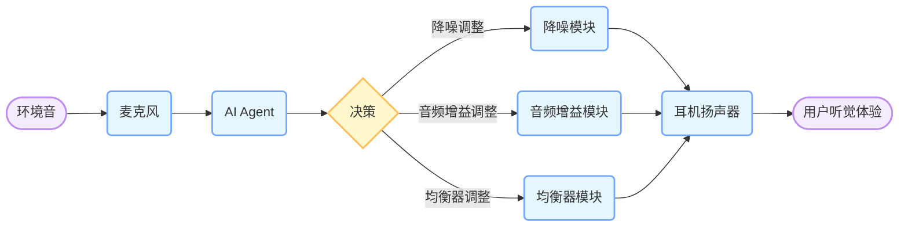

# AI Agent在智能耳机中的环境音适应

> 关键词：AI Agent、智能耳机、环境音适应、声学模型、机器学习

> 摘要：本文深入探讨了AI Agent在智能耳机中实现环境音适应的相关技术。首先介绍了该研究的背景、目的、预期读者等信息，接着阐述了核心概念与联系，包括AI Agent和环境音适应的原理及架构。详细讲解了核心算法原理和具体操作步骤，通过Python代码进行示例。同时给出了相关的数学模型和公式，并举例说明。在项目实战部分，展示了开发环境搭建、源代码实现与解读。还分析了实际应用场景，推荐了学习资源、开发工具框架和相关论文著作。最后总结了未来发展趋势与挑战，并提供了常见问题解答和扩展阅读参考资料。

## 1. 背景介绍 
### 1.1 目的和范围
随着智能耳机市场的不断发展，用户对于耳机的使用体验要求越来越高。环境音的复杂性和多样性给用户带来了诸多困扰，例如在嘈杂的环境中难以听清音频内容，而在安静环境下又可能受到耳机降噪过度导致的不自然感。本研究的目的是探讨如何利用AI Agent技术使智能耳机能够自动适应不同的环境音，提升用户的听觉体验。

本研究的范围主要涵盖了AI Agent在智能耳机环境音适应中的核心概念、算法原理、数学模型、项目实战、实际应用场景以及相关的工具和资源等方面。

### 1.2 预期读者
本文的预期读者包括对智能耳机技术、人工智能、音频处理等领域感兴趣的技术爱好者、开发者、研究人员以及相关行业的从业者。

### 1.3 文档结构概述
本文首先介绍了研究的背景信息，包括目的、预期读者和文档结构。接着阐述了核心概念与联系，包括AI Agent和环境音适应的原理和架构。然后详细讲解了核心算法原理和具体操作步骤，并给出了Python代码示例。之后介绍了相关的数学模型和公式，并举例说明。在项目实战部分，展示了开发环境搭建、源代码实现与解读。还分析了实际应用场景，推荐了学习资源、开发工具框架和相关论文著作。最后总结了未来发展趋势与挑战，并提供了常见问题解答和扩展阅读参考资料。

### 1.4 术语表
#### 1.4.1 核心术语定义
- **AI Agent（人工智能代理）**：一种能够感知环境、根据感知信息做出决策并采取行动的智能实体。在本研究中，AI Agent用于感知智能耳机所处的环境音，并做出相应的调整以实现环境音适应。
- **智能耳机**：具备一定智能功能的耳机，能够与外部设备进行交互，实现如降噪、音频播放、语音识别等功能。
- **环境音适应**：智能耳机根据所处环境的声音特征，自动调整音频处理参数，以提供更好的听觉体验。

#### 1.4.2 相关概念解释
- **声学模型**：用于描述声音的物理特性和传播规律的数学模型。在环境音适应中，声学模型可以帮助AI Agent更好地理解环境音的特征。
- **机器学习**：一门多领域交叉学科，涉及概率论、统计学、逼近论、凸分析、算法复杂度理论等多门学科。它专门研究计算机怎样模拟或实现人类的学习行为，以获取新的知识或技能，重新组织已有的知识结构使之不断改善自身的性能。在本研究中，机器学习算法用于训练AI Agent以实现环境音适应。

#### 1.4.3 缩略词列表
- **AI**：Artificial Intelligence，人工智能
- **ML**：Machine Learning，机器学习
- **DNN**：Deep Neural Network，深度神经网络

## 2. 核心概念与联系 
### 核心概念原理
#### AI Agent原理
AI Agent的核心原理是感知、决策和行动的循环过程。在智能耳机的环境音适应场景中，AI Agent通过耳机内置的麦克风感知环境音的特征，如声音的频率、强度、音色等。然后，根据预先训练好的模型或规则，对感知到的环境音进行分析和判断，做出相应的决策，例如调整耳机的降噪级别、音频增益等。最后，将决策结果转化为具体的行动，控制耳机的音频处理模块进行相应的调整。

#### 环境音适应原理
环境音适应的原理是根据不同环境音的特征，动态调整耳机的音频处理参数。例如，在嘈杂的环境中，提高耳机的降噪级别，减少外界噪音的干扰；在安静的环境中，降低降噪级别，避免过度降噪导致的不自然感。同时，还可以根据环境音的频率特性，调整音频的均衡器参数，以增强音频的清晰度和可懂度。

### 架构示意图


该架构图展示了AI Agent在智能耳机环境音适应中的工作流程。环境音通过麦克风被AI Agent感知，AI Agent对感知到的环境音进行分析和决策，然后控制耳机的降噪模块、音频增益模块和均衡器模块进行相应的调整，最终改善用户的听觉体验。

## 3. 核心算法原理 & 具体操作步骤 
### 核心算法原理
在智能耳机的环境音适应中，常用的核心算法包括机器学习算法，如深度神经网络（DNN）。DNN可以自动学习环境音的特征和相应的音频处理参数之间的映射关系。

以下是一个简单的DNN模型示例，用于根据环境音的特征预测音频增益调整值：

```python
import tensorflow as tf
from tensorflow.keras import layers

# 构建DNN模型
model = tf.keras.Sequential([
    layers.Dense(64, activation='relu', input_shape=(10,)),  # 输入层到隐藏层，输入特征维度为10
    layers.Dense(32, activation='relu'),  # 隐藏层
    layers.Dense(1)  # 输出层，输出音频增益调整值
])

# 编译模型
model.compile(optimizer='adam', loss='mse')

# 示例训练数据
import numpy as np
x_train = np.random.rand(100, 10)  # 100个样本，每个样本10个特征
y_train = np.random.rand(100, 1)  # 对应的音频增益调整值

# 训练模型
model.fit(x_train, y_train, epochs=10, batch_size=32)

# 示例预测
x_test = np.random.rand(1, 10)
predicted_gain = model.predict(x_test)
print("预测的音频增益调整值:", predicted_gain)
```

### 具体操作步骤
1. **数据采集**：使用耳机内置的麦克风采集不同环境下的环境音数据，并记录相应的音频处理参数和用户的听觉反馈。
2. **数据预处理**：对采集到的环境音数据进行预处理，如降噪、特征提取等。常用的特征包括声音的频率、强度、音色等。
3. **模型训练**：使用预处理后的数据训练DNN模型，调整模型的参数以最小化预测误差。
4. **模型部署**：将训练好的模型部署到智能耳机中，使AI Agent能够实时根据环境音的特征进行预测和决策。
5. **实时调整**：在耳机使用过程中，AI Agent不断感知环境音的特征，根据模型的预测结果实时调整耳机的音频处理参数。

## 4. 数学模型和公式 & 详细讲解 & 举例说明 
### 数学模型
在智能耳机的环境音适应中，一个简单的数学模型可以表示为：

$$y = f(x; \theta)$$

其中，$x$ 表示环境音的特征向量，例如声音的频率、强度等；$y$ 表示音频处理参数，如降噪级别、音频增益等；$\theta$ 表示模型的参数；$f$ 表示映射函数，在本研究中可以是DNN模型。

### 公式详细讲解
在训练DNN模型时，我们的目标是最小化预测值 $y_{pred}$ 与真实值 $y_{true}$ 之间的误差。常用的损失函数是均方误差（MSE）：

$$MSE = \frac{1}{n} \sum_{i=1}^{n} (y_{pred}^{(i)} - y_{true}^{(i)})^2$$

其中，$n$ 表示样本数量，$y_{pred}^{(i)}$ 表示第 $i$ 个样本的预测值，$y_{true}^{(i)}$ 表示第 $i$ 个样本的真实值。

为了最小化MSE，我们使用优化算法（如Adam）来更新模型的参数 $\theta$。Adam算法的更新公式如下：

$$m_{t} = \beta_1 m_{t-1} + (1 - \beta_1) g_{t}$$
$$v_{t} = \beta_2 v_{t-1} + (1 - \beta_2) g_{t}^2$$
$$\hat{m}_{t} = \frac{m_{t}}{1 - \beta_1^t}$$
$$\hat{v}_{t} = \frac{v_{t}}{1 - \beta_2^t}$$
$$\theta_{t} = \theta_{t-1} - \frac{\alpha}{\sqrt{\hat{v}_{t}} + \epsilon} \hat{m}_{t}$$

其中，$m_{t}$ 和 $v_{t}$ 分别是一阶矩估计和二阶矩估计，$\beta_1$ 和 $\beta_2$ 是衰减率，$g_{t}$ 是梯度，$\alpha$ 是学习率，$\epsilon$ 是一个小的常数，用于避免除零错误。

### 举例说明
假设我们有一个包含100个样本的训练数据集，每个样本的环境音特征向量 $x$ 是一个长度为10的向量，对应的音频增益调整值 $y$ 是一个标量。我们使用上述的DNN模型进行训练，设置学习率 $\alpha = 0.001$，$\beta_1 = 0.9$，$\beta_2 = 0.999$，$\epsilon = 1e-8$。在训练过程中，模型会不断更新参数 $\theta$ 以最小化MSE。训练完成后，我们可以使用训练好的模型对新的环境音特征向量进行预测，得到相应的音频增益调整值。

## 5. 项目实战：代码实际案例和详细解释说明 
### 5.1  开发环境搭建
#### 硬件环境
- 智能耳机开发板，具备麦克风和音频处理模块。
- 计算机，用于代码开发和模型训练。

#### 软件环境
- Python 3.x
- TensorFlow 2.x
- NumPy
- Pandas
- Matplotlib

可以使用以下命令安装所需的Python库：

```bash
pip install tensorflow numpy pandas matplotlib
```

### 5.2  源代码详细实现和代码解读
以下是一个完整的项目实战代码示例，用于实现智能耳机的环境音适应：

```python
import tensorflow as tf
from tensorflow.keras import layers
import numpy as np
import pandas as pd
import matplotlib.pyplot as plt

# 数据生成（模拟）
def generate_data(num_samples, feature_dim):
    x = np.random.rand(num_samples, feature_dim)
    y = np.sum(x, axis=1) + np.random.normal(0, 0.1, num_samples)  # 简单的线性关系加上噪声
    return x, y

# 构建DNN模型
def build_model(input_dim):
    model = tf.keras.Sequential([
        layers.Dense(64, activation='relu', input_shape=(input_dim,)),
        layers.Dense(32, activation='relu'),
        layers.Dense(1)
    ])
    model.compile(optimizer='adam', loss='mse')
    return model

# 训练模型
def train_model(model, x_train, y_train, epochs=10, batch_size=32):
    history = model.fit(x_train, y_train, epochs=epochs, batch_size=batch_size, validation_split=0.2)
    return history

# 可视化训练过程
def plot_training_history(history):
    plt.plot(history.history['loss'], label='Training Loss')
    plt.plot(history.history['val_loss'], label='Validation Loss')
    plt.xlabel('Epochs')
    plt.ylabel('Loss')
    plt.legend()
    plt.show()

# 主函数
if __name__ == "__main__":
    # 生成数据
    num_samples = 1000
    feature_dim = 10
    x_train, y_train = generate_data(num_samples, feature_dim)

    # 构建模型
    model = build_model(feature_dim)

    # 训练模型
    history = train_model(model, x_train, y_train)

    # 可视化训练过程
    plot_training_history(history)

    # 示例预测
    x_test = np.random.rand(1, feature_dim)
    predicted_gain = model.predict(x_test)
    print("预测的音频增益调整值:", predicted_gain)
```

### 代码解读与分析
1. **数据生成**：`generate_data` 函数用于生成模拟的训练数据，其中 `x` 是环境音的特征向量，`y` 是对应的音频增益调整值。
2. **模型构建**：`build_model` 函数构建了一个简单的DNN模型，包含一个输入层、两个隐藏层和一个输出层。使用Adam优化器和均方误差损失函数进行编译。
3. **模型训练**：`train_model` 函数使用训练数据对模型进行训练，并记录训练过程中的损失值。
4. **可视化训练过程**：`plot_training_history` 函数使用Matplotlib库绘制训练损失和验证损失的变化曲线，帮助我们观察模型的训练效果。
5. **主函数**：在主函数中，我们首先生成训练数据，然后构建模型并进行训练。最后，对训练过程进行可视化，并进行示例预测。

## 6. 实际应用场景 
### 嘈杂环境中的语音通话
在嘈杂的环境中，如街道、商场等，外界噪音会严重干扰语音通话的质量。AI Agent可以通过感知环境音的特征，自动提高耳机的降噪级别，同时调整音频增益和均衡器参数，增强语音的清晰度和可懂度，使通话双方能够更清晰地交流。

### 安静环境中的音乐欣赏
在安静的环境中，如图书馆、卧室等，过度的降噪可能会导致音乐听起来不自然。AI Agent可以根据环境音的特征，降低降噪级别，同时调整音频的均衡器参数，使音乐的音色更加自然、真实，提升用户的音乐欣赏体验。

### 运动场景中的音频调整
在运动场景中，如跑步、健身等，用户可能会出汗，导致耳机与耳朵的贴合度发生变化，影响音频效果。AI Agent可以实时感知环境音和耳机的佩戴状态，自动调整音频增益和均衡器参数，确保在运动过程中也能获得良好的音频体验。

## 7. 工具和资源推荐
### 7.1 学习资源推荐
#### 7.1.1 书籍推荐
- 《深度学习》（Deep Learning），作者：Ian Goodfellow、Yoshua Bengio和Aaron Courville。这本书是深度学习领域的经典教材，详细介绍了深度学习的基本概念、算法和应用。
- 《Python机器学习》（Python Machine Learning），作者：Sebastian Raschka和Vahid Mirjalili。本书以Python为工具，介绍了机器学习的各种算法和应用，适合初学者入门。
- 《音频处理基础》（Fundamentals of Audio Processing），作者：Mark H. Beedle。这本书系统地介绍了音频处理的基本原理和方法，对于理解智能耳机的音频处理技术有很大帮助。

#### 7.1.2 在线课程
- Coursera上的“深度学习专项课程”（Deep Learning Specialization），由Andrew Ng教授授课，是深度学习领域最受欢迎的在线课程之一。
- edX上的“人工智能基础”（Introduction to Artificial Intelligence），介绍了人工智能的基本概念、算法和应用。
- Udemy上的“Python音频处理实战”（Python Audio Processing Practical Course），通过实际项目介绍了Python在音频处理中的应用。

#### 7.1.3 技术博客和网站
- Medium：上面有很多关于人工智能、音频处理等领域的技术文章和教程。
- Towards Data Science：专注于数据科学和机器学习领域的技术博客，提供了很多实用的技术文章和案例分析。
- AudioXpress：音频技术领域的专业网站，提供了丰富的音频技术文章、产品评测和行业动态。

### 7.2 开发工具框架推荐
#### 7.2.1 IDE和编辑器
- PyCharm：一款功能强大的Python集成开发环境，提供了代码编辑、调试、版本控制等功能，适合Python开发。
- Jupyter Notebook：一种交互式的开发环境，支持Python、R等多种编程语言，适合数据探索和模型训练。
- Visual Studio Code：一款轻量级的代码编辑器，支持多种编程语言和插件，具有丰富的扩展功能。

#### 7.2.2 调试和性能分析工具
- TensorBoard：TensorFlow的可视化工具，用于可视化模型的训练过程、损失曲线、网络结构等。
- Py-Spy：一个轻量级的Python性能分析工具，可以帮助我们找出Python代码中的性能瓶颈。
- cProfile：Python标准库中的性能分析模块，可以分析Python代码的执行时间和函数调用次数。

#### 7.2.3 相关框架和库
- TensorFlow：一个开源的机器学习框架，提供了丰富的工具和函数，用于构建和训练深度学习模型。
- PyTorch：另一个流行的深度学习框架，具有动态图和易于使用的特点，适合快速原型开发。
- Librosa：一个Python音频处理库，提供了丰富的音频特征提取和处理函数。

### 7.3 相关论文著作推荐
#### 7.3.1 经典论文
- “Deep Residual Learning for Image Recognition”，作者：Kaiming He等人。这篇论文提出了残差网络（ResNet），在图像识别领域取得了巨大的成功，其思想也可以应用到音频处理中。
- “Attention Is All You Need”，作者：Ashish Vaswani等人。这篇论文提出了Transformer模型，在自然语言处理领域取得了突破性的进展，也可以用于音频序列的处理。
- “A Survey on Deep Learning for Audio Signal Processing”，作者：Omid Abdi等人。这篇论文对深度学习在音频信号处理中的应用进行了全面的综述。

#### 7.3.2 最新研究成果
- 关注顶级学术会议，如ICASSP（国际声学、语音和信号处理会议）、INTERSPEECH（国际语音通信协会年会）等，这些会议上会发布很多关于音频处理和人工智能的最新研究成果。
- 查阅相关的学术期刊，如IEEE Transactions on Audio, Speech, and Language Processing、Journal of the Acoustical Society of America等。

#### 7.3.3 应用案例分析
- 一些科技公司的官方博客和技术报告中会分享他们在智能耳机环境音适应方面的应用案例和技术经验，如苹果、华为、索尼等公司的官方网站。

## 8. 总结：未来发展趋势与挑战
### 未来发展趋势
- **更精准的环境感知**：未来的AI Agent将能够更精准地感知环境音的特征，不仅能够识别环境的类型（如嘈杂、安静等），还能识别具体的声音来源（如汽车、人声等），从而实现更个性化的环境音适应。
- **多模态融合**：除了环境音感知，未来的智能耳机可能会融合视觉、触觉等多模态信息，进一步提升环境音适应的效果。例如，结合摄像头的视觉信息，判断用户所处的场景，从而更准确地调整音频处理参数。
- **自适应学习**：AI Agent将具备更强的自适应学习能力，能够在用户使用过程中不断学习用户的偏好和习惯，自动调整环境音适应策略，提供更加个性化的听觉体验。

### 挑战
- **数据隐私和安全**：在采集环境音数据和用户听觉反馈数据的过程中，需要确保数据的隐私和安全。如何在保护用户隐私的前提下，有效地利用这些数据进行模型训练是一个重要的挑战。
- **计算资源限制**：智能耳机的计算资源通常有限，而复杂的AI算法需要大量的计算资源。如何在有限的计算资源下实现高效的环境音适应算法是一个亟待解决的问题。
- **模型泛化能力**：不同的环境音具有很大的差异，如何使训练好的模型在各种不同的环境中都能表现出良好的性能，提高模型的泛化能力，是一个具有挑战性的问题。

## 9. 附录：常见问题与解答
### 问题1：AI Agent在智能耳机中是如何工作的？
解答：AI Agent通过耳机内置的麦克风感知环境音的特征，然后根据预先训练好的模型或规则，对感知到的环境音进行分析和判断，做出相应的决策，最后控制耳机的音频处理模块进行相应的调整，如调整降噪级别、音频增益等。

### 问题2：如何训练AI Agent以实现环境音适应？
解答：首先需要采集不同环境下的环境音数据，并记录相应的音频处理参数和用户的听觉反馈。然后对采集到的数据进行预处理，如降噪、特征提取等。接着使用预处理后的数据训练机器学习模型，如深度神经网络（DNN）。训练过程中，通过优化算法不断调整模型的参数，以最小化预测误差。

### 问题3：智能耳机的环境音适应功能会消耗很多电量吗？
解答：这取决于具体的实现方式和算法复杂度。一般来说，简单的环境音适应功能消耗的电量相对较少，但如果使用了复杂的深度学习算法，可能会消耗较多的电量。为了降低功耗，可以采用一些优化策略，如模型压缩、低功耗硬件设计等。

### 问题4：环境音适应功能在所有环境中都能有效吗？
解答：虽然AI Agent可以在大多数环境中实现一定程度的环境音适应，但在一些极端环境或复杂环境中，可能效果不佳。例如，在非常嘈杂且声音频率复杂的环境中，模型可能难以准确地识别环境音的特征，从而影响环境音适应的效果。此外，不同的耳机硬件和音频处理模块也会对环境音适应功能的效果产生影响。

## 10. 扩展阅读 & 参考资料
- [《人工智能：现代方法》（Artificial Intelligence: A Modern Approach）](https://book.douban.com/subject/1126067/)
- [TensorFlow官方文档](https://www.tensorflow.org/)
- [PyTorch官方文档](https://pytorch.org/)
- [Librosa官方文档](https://librosa.org/doc/latest/index.html)

作者：AI天才研究院/AI Genius Institute & 禅与计算机程序设计艺术 /Zen And The Art of Computer Programming