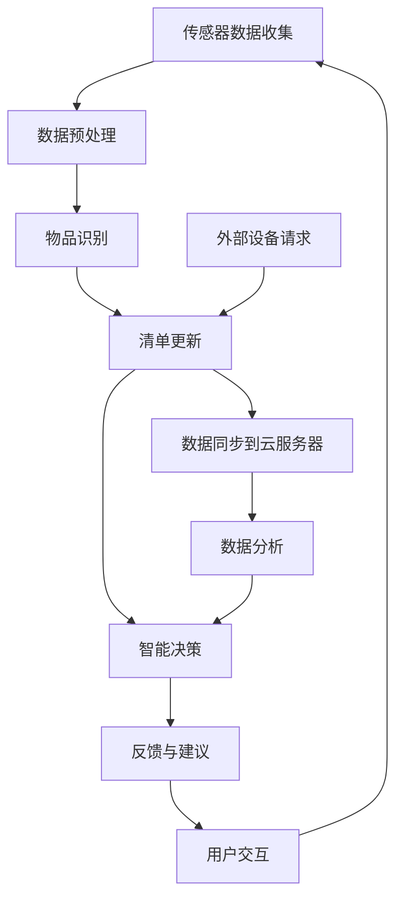

# AI Agent在智能背包中的物品清单管理

> 关键词：AI Agent、智能背包、物品清单管理、自动化、智能决策

> 摘要：本文深入探讨了AI Agent在智能背包物品清单管理中的应用。首先介绍了相关背景，包括目的、预期读者、文档结构和术语表。接着阐述了核心概念与联系，通过文本示意图和Mermaid流程图展示其架构。详细讲解了核心算法原理，并用Python代码进行说明，同时给出了数学模型和公式。在项目实战部分，介绍了开发环境搭建、源代码实现和代码解读。还探讨了实际应用场景，推荐了学习资源、开发工具框架和相关论文著作。最后总结了未来发展趋势与挑战，并给出常见问题解答和扩展阅读参考资料。通过这些内容，全面展示了AI Agent在智能背包物品清单管理中的重要性和应用价值。

## 1. 背景介绍 
### 1.1 目的和范围
随着科技的不断发展，智能设备逐渐融入人们的日常生活。智能背包作为一种新兴的智能设备，不仅具备传统背包的收纳功能，还能通过内置的传感器和智能系统实现更多的功能。其中，物品清单管理是智能背包的一个重要应用场景。本文章的目的是深入研究如何利用AI Agent来实现智能背包中的物品清单管理，包括物品的识别、分类、清单的更新和管理等。范围涵盖了从理论原理到实际应用的各个方面，旨在为相关领域的研究和开发提供全面的参考。

### 1.2 预期读者
本文预期读者包括计算机科学、人工智能、物联网等领域的研究人员和开发者，以及对智能背包技术感兴趣的爱好者。对于研究人员，本文可以提供新的研究思路和方法；对于开发者，本文可以作为开发智能背包物品清单管理系统的技术指南；对于爱好者，本文可以帮助他们了解智能背包的工作原理和应用前景。

### 1.3 文档结构概述
本文共分为十个部分。第一部分为背景介绍，包括目的、预期读者、文档结构和术语表。第二部分阐述核心概念与联系，通过文本示意图和Mermaid流程图展示AI Agent在智能背包物品清单管理中的架构。第三部分详细讲解核心算法原理，并使用Python代码进行说明。第四部分给出数学模型和公式，并进行详细讲解和举例说明。第五部分是项目实战，介绍开发环境搭建、源代码实现和代码解读。第六部分探讨实际应用场景。第七部分推荐学习资源、开发工具框架和相关论文著作。第八部分总结未来发展趋势与挑战。第九部分是附录，包含常见问题与解答。第十部分提供扩展阅读和参考资料。

### 1.4 术语表
#### 1.4.1 核心术语定义
- **AI Agent**：人工智能代理，是一种能够感知环境、做出决策并采取行动的智能实体。在智能背包物品清单管理中，AI Agent可以根据传感器数据识别物品、更新清单并提供相关建议。
- **智能背包**：集成了传感器、处理器和通信模块的背包，能够感知背包内物品的状态，并通过智能系统进行管理。
- **物品清单管理**：对背包内物品的信息进行记录、更新和查询的过程，包括物品的名称、数量、位置等。

#### 1.4.2 相关概念解释
- **传感器技术**：智能背包中常用的传感器包括RFID传感器、重量传感器、摄像头等，用于感知背包内物品的信息。
- **机器学习算法**：AI Agent可以使用机器学习算法对传感器数据进行分析和处理，实现物品的识别和分类。
- **物联网（IoT）**：智能背包通过物联网技术与其他设备进行通信，实现数据的共享和远程控制。

#### 1.4.3 缩略词列表
- **AI**：Artificial Intelligence，人工智能
- **RFID**：Radio Frequency Identification，射频识别
- **IoT**：Internet of Things，物联网

## 2. 核心概念与联系 
### 核心概念原理
在智能背包的物品清单管理中，AI Agent起着核心的作用。其原理基于传感器收集背包内物品的相关信息，如物品的重量、形状、射频信号等。AI Agent对这些信息进行分析和处理，利用机器学习算法实现物品的识别和分类。识别出的物品信息会被记录到物品清单中，并根据物品的放入和取出操作实时更新清单。同时，AI Agent还可以根据用户的需求和历史数据，提供智能决策和建议，如提醒用户补充缺失的物品、优化物品的放置位置等。

### 架构的文本示意图
```plaintext
+-------------------+
| 智能背包          |
| +---------------+ |
| | 传感器模块    | |
| | - RFID传感器  | |
| | - 重量传感器  | |
| | - 摄像头      | |
| +---------------+ |
| +---------------+ |
| | 通信模块      | |
| | - Wi-Fi       | |
| | - Bluetooth   | |
| +---------------+ |
| +---------------+ |
| | 处理模块      | |
| | - AI Agent    | |
| |   - 物品识别  | |
| |   - 清单管理  | |
| |   - 智能决策  | |
| +---------------+ |
+-------------------+
| 外部设备          |
| +---------------+ |
| | 手机应用      | |
| | - 清单查看    | |
| | - 远程控制    | |
| +---------------+ |
| +---------------+ |
| | 云服务器      | |
| | - 数据存储    | |
| | - 数据分析    | |
| +---------------+ |
+-------------------+
```

### Mermaid流程图


## 3. 核心算法原理 & 具体操作步骤 
### 核心算法原理
在智能背包物品清单管理中，核心算法主要包括物品识别算法和清单管理算法。

#### 物品识别算法
物品识别算法可以使用机器学习中的分类算法，如支持向量机（SVM）、决策树、神经网络等。以神经网络为例，其原理是通过大量的物品图像或传感器数据进行训练，学习物品的特征和模式。训练好的神经网络可以对新的传感器数据进行预测，判断物品的类别。

#### 清单管理算法
清单管理算法主要负责物品清单的更新和维护。当物品放入或取出背包时，传感器会检测到相应的变化，AI Agent根据这些变化更新物品清单。同时，清单管理算法还可以处理物品的重复、丢失等异常情况。

### 具体操作步骤及Python代码实现
#### 数据收集与预处理
```python
import numpy as np

# 模拟传感器数据收集
def collect_sensor_data():
    # 这里可以替换为实际的传感器数据收集代码
    data = np.random.rand(10)  # 生成10个随机数据
    return data

# 数据预处理
def preprocess_data(data):
    # 归一化处理
    processed_data = (data - np.min(data)) / (np.max(data) - np.min(data))
    return processed_data

# 示例使用
sensor_data = collect_sensor_data()
processed_data = preprocess_data(sensor_data)
print("处理后的数据:", processed_data)
```

#### 物品识别
```python
from sklearn.svm import SVC
from sklearn.model_selection import train_test_split
from sklearn.metrics import accuracy_score

# 模拟训练数据
X = np.random.rand(100, 10)  # 100个样本，每个样本10个特征
y = np.random.randint(0, 2, 100)  # 随机生成标签

# 划分训练集和测试集
X_train, X_test, y_train, y_test = train_test_split(X, y, test_size=0.2, random_state=42)

# 训练支持向量机模型
model = SVC()
model.fit(X_train, y_train)

# 物品识别
def identify_item(data):
    prediction = model.predict([data])
    return prediction[0]

# 示例使用
item_type = identify_item(processed_data)
print("识别的物品类型:", item_type)
```

#### 清单管理
```python
class InventoryManager:
    def __init__(self):
        self.inventory = {}

    def add_item(self, item_type):
        if item_type in self.inventory:
            self.inventory[item_type] += 1
        else:
            self.inventory[item_type] = 1

    def remove_item(self, item_type):
        if item_type in self.inventory:
            if self.inventory[item_type] > 0:
                self.inventory[item_type] -= 1
                if self.inventory[item_type] == 0:
                    del self.inventory[item_type]

    def get_inventory(self):
        return self.inventory

# 示例使用
inventory_manager = InventoryManager()
inventory_manager.add_item(item_type)
print("当前物品清单:", inventory_manager.get_inventory())
```

## 4. 数学模型和公式 & 详细讲解 & 举例说明 
### 物品识别的数学模型
在使用神经网络进行物品识别时，常用的激活函数是 sigmoid 函数。sigmoid 函数的公式为：
$$\sigma(z)=\frac{1}{1 + e^{-z}}$$
其中，$z$ 是输入值。sigmoid 函数将输入值映射到 $(0, 1)$ 区间，常用于二分类问题。

### 清单管理的数学模型
清单管理可以用集合和映射的概念来描述。设 $I$ 是所有物品类型的集合，$N$ 是自然数集合。物品清单可以表示为一个映射 $f: I \to N$，其中 $f(i)$ 表示物品类型 $i$ 的数量。

### 详细讲解
#### sigmoid 函数
sigmoid 函数具有以下特点：
- 当 $z$ 趋近于正无穷时，$\sigma(z)$ 趋近于 1；
- 当 $z$ 趋近于负无穷时，$\sigma(z)$ 趋近于 0；
- 函数在 $z = 0$ 处的导数最大，为 0.25。

在神经网络中，sigmoid 函数用于引入非线性因素，使得神经网络能够学习复杂的模式。

#### 清单管理映射
物品清单的映射 $f$ 可以方便地进行物品的添加、删除和查询操作。例如，添加一个物品类型为 $i$ 的物品，只需将 $f(i)$ 的值加 1；删除一个物品类型为 $i$ 的物品，只需将 $f(i)$ 的值减 1。

### 举例说明
#### sigmoid 函数示例
```python
import numpy as np

def sigmoid(z):
    return 1 / (1 + np.exp(-z))

z = 2
result = sigmoid(z)
print("sigmoid(2) 的值:", result)
```

#### 清单管理示例
假设物品类型集合 $I = \{苹果, 香蕉, 橘子\}$，初始清单映射 $f$ 为：
$f(苹果) = 2$
$f(香蕉) = 3$
$f(橘子) = 1$

现在添加一个苹果，更新后的清单映射为：
$f(苹果) = 3$
$f(香蕉) = 3$
$f(橘子) = 1$

## 5. 项目实战：代码实际案例和详细解释说明 
### 5.1  开发环境搭建
#### 硬件环境
- 智能背包原型：可以使用普通背包改装，添加 RFID 传感器、重量传感器、摄像头等。
- 开发板：如 Raspberry Pi，用于处理传感器数据和运行 AI Agent 程序。
- 外部设备：手机或电脑，用于与智能背包进行通信和交互。

#### 软件环境
- 操作系统：Raspbian（适用于 Raspberry Pi）
- 编程语言：Python 3.x
- 开发工具：PyCharm 或 Visual Studio Code
- 相关库：numpy、scikit-learn、pandas 等

### 5.2  源代码详细实现和代码解读
#### 整体架构代码
```python
import numpy as np
from sklearn.svm import SVC
from sklearn.model_selection import train_test_split
from sklearn.metrics import accuracy_score

# 模拟传感器数据收集
def collect_sensor_data():
    data = np.random.rand(10)  # 生成10个随机数据
    return data

# 数据预处理
def preprocess_data(data):
    processed_data = (data - np.min(data)) / (np.max(data) - np.min(data))
    return processed_data

# 模拟训练数据
X = np.random.rand(100, 10)  # 100个样本，每个样本10个特征
y = np.random.randint(0, 2, 100)  # 随机生成标签

# 划分训练集和测试集
X_train, X_test, y_train, y_test = train_test_split(X, y, test_size=0.2, random_state=42)

# 训练支持向量机模型
model = SVC()
model.fit(X_train, y_train)

# 物品识别
def identify_item(data):
    prediction = model.predict([data])
    return prediction[0]

class InventoryManager:
    def __init__(self):
        self.inventory = {}

    def add_item(self, item_type):
        if item_type in self.inventory:
            self.inventory[item_type] += 1
        else:
            self.inventory[item_type] = 1

    def remove_item(self, item_type):
        if item_type in self.inventory:
            if self.inventory[item_type] > 0:
                self.inventory[item_type] -= 1
                if self.inventory[item_type] == 0:
                    del self.inventory[item_type]

    def get_inventory(self):
        return self.inventory

# 主程序
if __name__ == "__main__":
    inventory_manager = InventoryManager()
    while True:
        sensor_data = collect_sensor_data()
        processed_data = preprocess_data(sensor_data)
        item_type = identify_item(processed_data)
        inventory_manager.add_item(item_type)
        print("当前物品清单:", inventory_manager.get_inventory())
```

#### 代码解读
- `collect_sensor_data` 函数：模拟传感器数据收集，实际应用中需要替换为真实的传感器数据读取代码。
- `preprocess_data` 函数：对传感器数据进行归一化处理，将数据映射到 $[0, 1]$ 区间，有助于提高模型的训练效果。
- `train_test_split` 函数：将训练数据划分为训练集和测试集，用于评估模型的性能。
- `SVC` 类：使用支持向量机进行物品识别，支持向量机是一种常用的分类算法。
- `InventoryManager` 类：负责物品清单的管理，包括物品的添加、删除和查询操作。
- 主程序：不断收集传感器数据，进行物品识别，并更新物品清单。

### 5.3  代码解读与分析
#### 优点
- 代码结构清晰，模块化设计，易于扩展和维护。
- 使用了常见的机器学习算法和数据处理方法，具有一定的通用性。
- 模拟了整个智能背包物品清单管理的流程，包括数据收集、处理、识别和清单管理。

#### 不足
- 传感器数据是模拟生成的，实际应用中需要根据具体的传感器进行修改。
- 模型的训练数据是随机生成的，实际应用中需要使用真实的物品数据进行训练。
- 缺乏与外部设备的通信和交互功能，如与手机应用的连接。

## 6. 实际应用场景 
### 旅行场景
在旅行中，智能背包的物品清单管理功能可以帮助旅行者更好地管理行李。旅行者可以通过手机应用查看背包内的物品清单，了解哪些物品已经携带，哪些物品需要补充。同时，AI Agent 可以根据旅行目的地和行程，提供物品携带的建议，如提醒携带防晒用品、雨具等。

### 学生场景
对于学生来说，智能背包可以帮助他们管理学习用品。学生可以通过清单管理功能快速找到需要的书籍和文具，避免遗漏重要物品。AI Agent 还可以根据课程表，自动整理背包内的物品，提高学习效率。

### 商务场景
在商务出行中，智能背包可以帮助商务人士管理文件和电子设备。通过物品清单管理功能，商务人士可以随时了解文件和设备的位置，避免在重要场合丢失重要物品。AI Agent 还可以根据会议安排，提供相关文件和设备的提醒。

## 7. 工具和资源推荐
### 7.1 学习资源推荐
#### 7.1.1 书籍推荐
- 《机器学习》（周志华）：全面介绍了机器学习的基本概念、算法和应用，是机器学习领域的经典教材。
- 《Python 机器学习》（Sebastian Raschka）：结合 Python 语言，详细讲解了机器学习的算法实现和应用，适合初学者。
- 《人工智能：一种现代的方法》（Stuart Russell, Peter Norvig）：人工智能领域的权威著作，涵盖了人工智能的各个方面。

#### 7.1.2 在线课程
- Coursera 上的“机器学习”课程（Andrew Ng）：由斯坦福大学教授 Andrew Ng 授课，是机器学习领域最受欢迎的在线课程之一。
- edX 上的“人工智能导论”课程：介绍了人工智能的基本概念、算法和应用，适合初学者。
- Udemy 上的“Python 数据科学和机器学习实战”课程：结合 Python 语言，讲解了数据科学和机器学习的实际应用。

#### 7.1.3 技术博客和网站
- Medium：有很多关于人工智能、机器学习和物联网的技术博客，提供了最新的技术动态和实践经验。
- Towards Data Science：专注于数据科学和机器学习领域，有很多高质量的技术文章和教程。
- IoT Agenda：关注物联网领域的发展趋势和应用案例，提供了丰富的物联网资源。

### 7.2 开发工具框架推荐
#### 7.2.1 IDE和编辑器
- PyCharm：专业的 Python 集成开发环境，提供了丰富的代码编辑、调试和项目管理功能。
- Visual Studio Code：轻量级的代码编辑器，支持多种编程语言，有丰富的插件扩展。
- Jupyter Notebook：交互式的代码编辑器，适合进行数据探索和模型开发。

#### 7.2.2 调试和性能分析工具
- PySnooper：可以自动记录 Python 函数的执行过程，方便调试代码。
- cProfile：Python 内置的性能分析工具，可以分析代码的运行时间和内存使用情况。
- TensorBoard：用于可视化深度学习模型的训练过程和性能指标。

#### 7.2.3 相关框架和库
- scikit-learn：常用的机器学习库，提供了丰富的机器学习算法和工具。
- TensorFlow：开源的深度学习框架，广泛应用于图像识别、自然语言处理等领域。
- Keras：基于 TensorFlow 的高级深度学习库，易于使用和快速开发。

### 7.3 相关论文著作推荐
#### 7.3.1 经典论文
- “Support-Vector Networks”（Cortes, Vapnik）：介绍了支持向量机的基本原理和算法，是支持向量机领域的经典论文。
- “Gradient-Based Learning Applied to Document Recognition”（LeCun et al.）：提出了卷积神经网络（CNN）的概念，为图像识别领域的发展奠定了基础。
- “A Neural Algorithm of Artistic Style”（Gatys et al.）：介绍了使用神经网络实现艺术风格迁移的方法，引起了广泛的关注。

#### 7.3.2 最新研究成果
- 关注 arXiv 上关于人工智能、机器学习和物联网的最新研究论文，了解该领域的前沿技术和发展趋势。
- 参加相关的学术会议，如 NeurIPS、ICML、CVPR 等，获取最新的研究成果和学术动态。

#### 7.3.3 应用案例分析
- 阅读相关的行业报告和案例分析，了解智能背包和物品清单管理技术在实际应用中的经验和教训。
- 关注科技媒体和行业网站，了解智能背包产品的最新动态和应用案例。

## 8. 总结：未来发展趋势与挑战
### 未来发展趋势
#### 智能化程度不断提高
随着人工智能技术的不断发展，AI Agent 在智能背包物品清单管理中的智能化程度将不断提高。AI Agent 可以通过学习用户的习惯和偏好，提供更加个性化的服务和建议。例如，根据用户的历史出行记录，自动调整物品清单，提醒用户携带常用物品。

#### 与其他设备的集成
智能背包将与更多的设备进行集成，实现数据的共享和交互。例如，与智能手机、智能手表等设备连接，用户可以通过这些设备随时随地查看背包内的物品清单，并进行远程控制。同时，智能背包还可以与智能家居系统集成，实现更加智能化的生活场景。

#### 多模态识别技术的应用
未来的智能背包将采用多模态识别技术，结合 RFID 传感器、重量传感器、摄像头等多种传感器的数据，提高物品识别的准确性和可靠性。例如，通过摄像头识别物品的外观特征，结合 RFID 传感器读取物品的标签信息，实现更加精准的物品识别。

### 挑战
#### 数据隐私和安全问题
智能背包收集了大量用户的物品信息和使用习惯，这些数据涉及用户的隐私和安全。如何保护这些数据不被泄露和滥用，是智能背包发展面临的一个重要挑战。需要采用先进的加密技术和安全机制，确保数据的安全性。

#### 传感器技术的局限性
目前的传感器技术还存在一定的局限性，如 RFID 传感器的识别范围和精度有限，重量传感器容易受到外界干扰等。如何提高传感器的性能和可靠性，是实现智能背包高效物品清单管理的关键。

#### 成本和市场接受度
智能背包的研发和生产成本相对较高，这可能会影响其市场价格和市场接受度。如何降低成本，提高产品的性价比，是智能背包企业需要解决的问题。同时，还需要加强市场推广和宣传，提高消费者对智能背包的认知度和接受度。

## 9. 附录：常见问题与解答
### 问题 1：AI Agent 如何保证物品识别的准确性？
答：AI Agent 可以通过多种方式提高物品识别的准确性。首先，使用大量的真实物品数据进行模型训练，让模型学习到物品的特征和模式。其次，采用多模态识别技术，结合多种传感器的数据进行综合分析。此外，还可以通过不断优化模型算法和参数，提高模型的性能和准确性。

### 问题 2：智能背包的物品清单管理功能是否支持离线使用？
答：部分功能可以支持离线使用。智能背包可以在本地存储物品清单信息，即使在没有网络连接的情况下，用户也可以通过背包上的显示屏或按键查看物品清单。但是，一些需要与云服务器进行数据交互的功能，如数据分析和智能决策，可能需要网络连接才能正常使用。

### 问题 3：智能背包的电池续航能力如何？
答：智能背包的电池续航能力取决于多个因素，如传感器的使用频率、通信模块的工作模式、AI Agent 的计算量等。为了提高电池续航能力，可以采用低功耗的传感器和处理器，优化软件算法，减少不必要的计算和通信。同时，还可以配备可充电电池或太阳能充电板，方便用户随时充电。

### 问题 4：如何确保智能背包的数据安全？
答：为了确保智能背包的数据安全，可以采取以下措施。首先，对数据进行加密处理，使用先进的加密算法对传感器数据和物品清单信息进行加密，防止数据在传输和存储过程中被窃取。其次，采用安全的通信协议，如 TLS 协议，确保数据在网络传输过程中的安全性。此外，还可以设置用户认证和授权机制，只有经过授权的用户才能访问和管理智能背包的数据。

## 10. 扩展阅读 & 参考资料
### 扩展阅读
- 《智能硬件：从原理到实践》：深入介绍了智能硬件的设计、开发和应用，对于理解智能背包的技术原理有很大帮助。
- 《物联网：技术、应用与创新》：全面阐述了物联网的技术架构、应用场景和发展趋势，有助于了解智能背包在物联网中的地位和作用。
- 《人工智能简史》：回顾了人工智能的发展历程，了解人工智能的发展背景和未来趋势，对于理解 AI Agent 在智能背包中的应用有重要意义。

### 参考资料
- [1] 周志华. 机器学习[M]. 清华大学出版社, 2016.
- [2] Sebastian Raschka. Python 机器学习[M]. 人民邮电出版社, 2018.
- [3] Stuart Russell, Peter Norvig. 人工智能：一种现代的方法[M]. 人民邮电出版社, 2002.
- [4] Cortes C, Vapnik V. Support-Vector Networks[J]. Machine Learning, 1995, 20(3): 273-297.
- [5] LeCun Y, Bottou L, Bengio Y, et al. Gradient-Based Learning Applied to Document Recognition[J]. Proceedings of the IEEE, 1998, 86(11): 2278-2324.
- [6] Gatys L A, Ecker A S, Bethge M. A Neural Algorithm of Artistic Style[J]. arXiv preprint arXiv:1508.06576, 2015.

作者：AI天才研究院/AI Genius Institute & 禅与计算机程序设计艺术 /Zen And The Art of Computer Programming