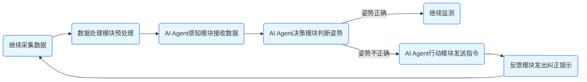

# AI Agent在智能背带中的姿势纠正

> 关键词：AI Agent、智能背带、姿势纠正、传感器技术、机器学习

> 摘要：本文聚焦于AI Agent在智能背带中的姿势纠正应用。详细阐述了相关核心概念，包括AI Agent和智能背带的工作原理及联系；深入剖析了实现姿势纠正的核心算法原理，并给出Python代码示例；介绍了相关数学模型和公式；通过项目实战展示了代码的实际实现与解读；探讨了该技术的实际应用场景；推荐了学习资源、开发工具框架以及相关论文著作；最后总结了未来发展趋势与挑战，并解答了常见问题。旨在为读者全面呈现AI Agent在智能背带姿势纠正领域的技术全貌。

## 1. 背景介绍 
### 1.1 目的和范围
在现代社会，人们长时间保持不良姿势，如久坐、弯腰等，容易引发各种健康问题，如脊柱侧弯、颈椎病等。智能背带作为一种可穿戴设备，结合AI Agent技术，能够实时监测用户的姿势，并及时进行纠正，具有重要的健康意义。本文的目的在于深入探讨AI Agent在智能背带姿势纠正中的应用，涵盖从核心概念、算法原理到实际应用的各个方面。范围包括相关技术的原理阐述、代码实现、实际案例分析以及未来发展趋势的展望。

### 1.2 预期读者
本文预期读者包括对人工智能、可穿戴设备技术感兴趣的技术爱好者，从事相关领域研究的科研人员，以及智能背带产品的开发者和设计师。对于希望了解AI Agent在特定领域应用的人士，本文提供了全面且深入的技术知识和实践经验。

### 1.3 文档结构概述
本文将按照以下结构进行阐述：首先介绍核心概念与联系，明确AI Agent和智能背带的基本原理和相互关系；接着详细讲解核心算法原理及具体操作步骤，并给出Python代码示例；随后介绍相关数学模型和公式，并举例说明；通过项目实战展示代码的实际实现和详细解释；探讨该技术的实际应用场景；推荐学习资源、开发工具框架和相关论文著作；最后总结未来发展趋势与挑战，解答常见问题，并提供扩展阅读和参考资料。

### 1.4 术语表
#### 1.4.1 核心术语定义
- **AI Agent（人工智能代理）**：是一种能够感知环境、做出决策并采取行动以实现特定目标的智能实体。在智能背带中，AI Agent负责分析传感器数据，判断用户姿势是否正确，并采取相应的纠正措施。
- **智能背带**：一种可穿戴设备，集成了多种传感器，如加速度计、陀螺仪等，用于实时监测用户的身体姿势，并通过与AI Agent的协作进行姿势纠正。
- **姿势纠正**：根据用户的实际姿势与正确姿势的偏差，通过反馈机制（如震动、声音提示等）引导用户调整姿势，使其恢复到正确状态。

#### 1.4.2 相关概念解释
- **传感器技术**：智能背带依赖各种传感器来获取用户的身体姿势信息。加速度计可以测量物体在各个方向上的加速度，从而推断出物体的倾斜角度；陀螺仪则可以测量物体的角速度，用于检测物体的旋转运动。通过这些传感器的组合，能够全面、准确地监测用户的姿势变化。
- **机器学习**：AI Agent在姿势纠正中通常会运用机器学习算法。通过对大量的姿势数据进行训练，机器学习模型可以学习到不同姿势的特征模式，从而能够准确地判断用户的当前姿势是否正确，并根据训练结果提供相应的纠正建议。

#### 1.4.3 缩略词列表
- **IMU（Inertial Measurement Unit）**：惯性测量单元，通常集成了加速度计和陀螺仪，用于测量物体的加速度和角速度。
- **ML（Machine Learning）**：机器学习，是人工智能的一个重要分支，通过数据和算法让计算机自动学习和改进。

## 2. 核心概念与联系 

### 核心概念原理
#### AI Agent原理
AI Agent的核心是其感知 - 决策 - 行动的循环机制。在智能背带的应用中，AI Agent首先通过传感器感知用户的身体姿势信息，这些信息包括身体的倾斜角度、旋转速度等。然后，AI Agent对这些感知数据进行分析和处理，利用预先训练好的机器学习模型判断用户的姿势是否正确。如果发现姿势不正确，AI Agent会根据设定的规则做出决策，例如发出震动或声音提示，以引导用户调整姿势。最后，AI Agent将决策转化为实际行动，通过智能背带的反馈装置向用户传达纠正信息。

#### 智能背带原理
智能背带主要由传感器模块、数据处理模块和反馈模块组成。传感器模块通常包括IMU等传感器，用于实时采集用户的身体姿势数据。数据处理模块负责对传感器采集到的数据进行预处理和特征提取，然后将处理后的数据传输给AI Agent进行分析。反馈模块则根据AI Agent的决策结果，向用户提供相应的反馈信息，如震动、声音提示等，以实现姿势纠正的目的。

### 架构的文本示意图
```plaintext
+----------------------+
|      智能背带        |
| +------------------+ |
| |  传感器模块      | |
| |  (加速度计、陀螺仪) | |
| +------------------+ |
| +------------------+ |
| |  数据处理模块    | |
| |  (数据预处理、特征提取) | |
| +------------------+ |
| +------------------+ |
| |  反馈模块        | |
| |  (震动、声音提示) | |
| +------------------+ |
+----------------------+
           |
           | 姿势数据
           v
+----------------------+
|       AI Agent       |
| +------------------+ |
| |  感知模块        | |
| |  (接收姿势数据) | |
| +------------------+ |
| +------------------+ |
| |  决策模块        | |
| |  (机器学习模型判断) | |
| +------------------+ |
| +------------------+ |
| |  行动模块        | |
| |  (发送纠正指令) | |
| +------------------+ |
+----------------------+
```

### Mermaid流程图


## 3. 核心算法原理 & 具体操作步骤 

### 核心算法原理
在智能背带的姿势纠正中，常用的核心算法是基于机器学习的分类算法，例如支持向量机（SVM）、决策树等。以支持向量机为例，其基本原理是在特征空间中找到一个最优的超平面，将不同类别的数据分隔开来。在姿势纠正的应用中，我们将正确姿势和错误姿势的数据分别作为不同的类别，通过训练支持向量机模型，使其能够准确地将新的姿势数据分类为正确或错误姿势。

### 具体操作步骤
#### 1. 数据采集
使用智能背带的传感器（如加速度计、陀螺仪）采集用户的姿势数据。采集的数据包括不同姿势下的加速度和角速度信息，每个数据样本需要标注其对应的姿势类别（正确或错误）。

#### 2. 数据预处理
对采集到的数据进行预处理，包括去除噪声、归一化等操作。去除噪声可以提高数据的质量，而归一化可以将不同范围的数据统一到相同的尺度上，便于后续的机器学习算法处理。

#### 3. 特征提取
从预处理后的数据中提取有用的特征，例如均值、方差、标准差等。这些特征能够更好地代表不同姿势的特点，提高机器学习模型的分类准确率。

#### 4. 模型训练
使用提取的特征和对应的姿势类别标签，对支持向量机模型进行训练。训练过程中，模型会不断调整自身的参数，以找到最优的超平面，使得不同类别的数据能够被准确分隔。

#### 5. 姿势判断
将实时采集到的姿势数据进行预处理和特征提取后，输入到训练好的支持向量机模型中，模型会输出该姿势的类别（正确或错误）。

#### 6. 姿势纠正
如果模型判断当前姿势为错误姿势，AI Agent会根据设定的规则发出相应的纠正指令，通过智能背带的反馈模块（如震动、声音提示）告知用户调整姿势。

### Python源代码示例
```python
import numpy as np
from sklearn import svm
from sklearn.preprocessing import StandardScaler
from sklearn.model_selection import train_test_split

# 模拟数据采集
# 假设我们有100个样本，每个样本有3个特征（加速度计的x、y、z轴数据）
# 前50个样本为正确姿势，后50个样本为错误姿势
X = np.random.randn(100, 3)
y = np.array([0] * 50 + [1] * 50)

# 数据预处理：归一化
scaler = StandardScaler()
X_scaled = scaler.fit_transform(X)

# 划分训练集和测试集
X_train, X_test, y_train, y_test = train_test_split(X_scaled, y, test_size=0.2, random_state=42)

# 模型训练
clf = svm.SVC(kernel='linear')
clf.fit(X_train, y_train)

# 姿势判断
new_pose = np.random.randn(1, 3)
new_pose_scaled = scaler.transform(new_pose)
prediction = clf.predict(new_pose_scaled)

if prediction[0] == 0:
    print("当前姿势正确")
else:
    print("当前姿势错误，请调整")
```

## 4. 数学模型和公式 & 详细讲解 & 举例说明 

### 支持向量机数学模型
支持向量机的目标是在特征空间中找到一个最优的超平面，将不同类别的数据分隔开来。对于线性可分的情况，超平面可以表示为：

$$w^T x + b = 0$$

其中，$w$ 是超平面的法向量，$x$ 是特征向量，$b$ 是偏置项。

支持向量机的优化目标是最大化间隔，即找到一个超平面，使得不同类别的数据到该超平面的最小距离最大。这个优化问题可以表示为：

$$\min_{w, b} \frac{1}{2} \|w\|^2$$

$$\text{s.t. } y_i (w^T x_i + b) \geq 1, i = 1, 2, \cdots, n$$

其中，$y_i$ 是样本 $x_i$ 的类别标签（$y_i \in \{-1, 1\}$），$n$ 是样本数量。

### 详细讲解
上述优化问题的目标是最小化 $\frac{1}{2} \|w\|^2$，这等价于最大化间隔。约束条件 $y_i (w^T x_i + b) \geq 1$ 表示所有样本都必须被正确分类，并且到超平面的距离至少为 1。

为了解决这个优化问题，通常会引入拉格朗日乘子 $\alpha_i$，将其转化为对偶问题：

$$\max_{\alpha} \sum_{i=1}^{n} \alpha_i - \frac{1}{2} \sum_{i=1}^{n} \sum_{j=1}^{n} \alpha_i \alpha_j y_i y_j x_i^T x_j$$

$$\text{s.t. } \sum_{i=1}^{n} \alpha_i y_i = 0$$

$$\alpha_i \geq 0, i = 1, 2, \cdots, n$$

通过求解对偶问题，可以得到最优的拉格朗日乘子 $\alpha_i^*$，进而得到最优的 $w$ 和 $b$：

$$w^* = \sum_{i=1}^{n} \alpha_i^* y_i x_i$$

$$b^* = y_j - w^{*T} x_j$$

其中，$j$ 是任意一个支持向量的索引。

### 举例说明
假设我们有两个类别的数据，分别用红色和蓝色表示，如下所示：

```plaintext
红色数据点：(1, 2), (2, 3)
蓝色数据点：(4, 5), (5, 6)
```

我们的目标是找到一个超平面将这两类数据分隔开来。首先，我们将数据表示为特征向量和类别标签：

$$X = \begin{bmatrix} 1 & 2 \\ 2 & 3 \\ 4 & 5 \\ 5 & 6 \end{bmatrix}$$

$$y = \begin{bmatrix} 1 \\ 1 \\ -1 \\ -1 \end{bmatrix}$$

然后，我们可以使用支持向量机的优化算法求解最优的 $w$ 和 $b$。在实际应用中，我们可以使用 Python 的 `sklearn` 库来实现这个过程，代码如下：

```python
import numpy as np
from sklearn import svm

X = np.array([[1, 2], [2, 3], [4, 5], [5, 6]])
y = np.array([1, 1, -1, -1])

clf = svm.SVC(kernel='linear')
clf.fit(X, y)

w = clf.coef_[0]
b = clf.intercept_[0]

print("最优的 w:", w)
print("最优的 b:", b)
```

运行上述代码，我们可以得到最优的 $w$ 和 $b$，从而确定分隔这两类数据的超平面。

## 5. 项目实战：代码实际案例和详细解释说明 

### 5.1  开发环境搭建
#### 硬件环境
- 智能背带：选择一款集成了加速度计和陀螺仪的智能背带，确保其能够正常采集姿势数据。
- 开发板：如 Raspberry Pi 等，用于接收和处理智能背带采集到的数据。

#### 软件环境
- 操作系统：建议使用 Linux 系统，如 Raspbian 等。
- Python 环境：安装 Python 3.x 版本，并安装相关的库，如 `numpy`、`sklearn`、`pyserial` 等。可以使用以下命令进行安装：
```sh
pip install numpy sklearn pyserial
```

### 5.2  源代码详细实现和代码解读
```python
import serial
import numpy as np
from sklearn import svm
from sklearn.preprocessing import StandardScaler

# 串口配置
ser = serial.Serial('/dev/ttyUSB0', 9600)  # 根据实际情况修改串口名称和波特率

# 模拟数据采集和预处理
# 假设我们已经有训练好的模型和归一化参数
# 这里简单模拟训练数据
X_train = np.random.randn(100, 3)
y_train = np.array([0] * 50 + [1] * 50)

# 数据预处理：归一化
scaler = StandardScaler()
X_train_scaled = scaler.fit_transform(X_train)

# 模型训练
clf = svm.SVC(kernel='linear')
clf.fit(X_train_scaled, y_train)

while True:
    try:
        # 从串口读取数据
        line = ser.readline().decode('utf-8').strip()
        data = [float(x) for x in line.split(',')]
        data = np.array(data).reshape(1, -1)
        
        # 数据预处理
        data_scaled = scaler.transform(data)
        
        # 姿势判断
        prediction = clf.predict(data_scaled)
        
        if prediction[0] == 0:
            print("当前姿势正确")
        else:
            print("当前姿势错误，请调整")
    
    except (ValueError, serial.SerialException) as e:
        print(f"Error: {e}")
```

### 代码解读与分析
#### 串口配置
```python
ser = serial.Serial('/dev/ttyUSB0', 9600)
```
这行代码用于配置串口通信，指定了串口名称和波特率。根据实际情况，需要修改串口名称以匹配智能背带连接的串口。

#### 数据采集和预处理
```python
X_train = np.random.randn(100, 3)
y_train = np.array([0] * 50 + [1] * 50)
scaler = StandardScaler()
X_train_scaled = scaler.fit_transform(X_train)
```
这里模拟了训练数据的采集和预处理过程。使用 `StandardScaler` 对数据进行归一化处理，将数据缩放到均值为 0，方差为 1 的范围。

#### 模型训练
```python
clf = svm.SVC(kernel='linear')
clf.fit(X_train_scaled, y_train)
```
使用支持向量机模型进行训练，指定核函数为线性核。训练完成后，模型可以用于对新的姿势数据进行分类。

#### 实时数据处理和姿势判断
```python
while True:
    try:
        line = ser.readline().decode('utf-8').strip()
        data = [float(x) for x in line.split(',')]
        data = np.array(data).reshape(1, -1)
        data_scaled = scaler.transform(data)
        prediction = clf.predict(data_scaled)
        
        if prediction[0] == 0:
            print("当前姿势正确")
        else:
            print("当前姿势错误，请调整")
    
    except (ValueError, serial.SerialException) as e:
        print(f"Error: {e}")
```
在一个无限循环中，不断从串口读取数据，并进行预处理和姿势判断。如果判断为正确姿势，输出相应信息；如果判断为错误姿势，提示用户调整姿势。同时，捕获可能出现的异常并进行处理。

## 6. 实际应用场景 
### 健康监测与预防
对于长时间坐着工作的上班族和学生，智能背带结合AI Agent的姿势纠正功能可以实时监测他们的坐姿，及时发现并纠正不良姿势。长期保持正确的姿势有助于预防脊柱侧弯、颈椎病等疾病，保护身体健康。

### 康复训练
在康复治疗过程中，患者需要按照医生的指导进行特定的姿势训练。智能背带可以辅助康复训练，实时反馈患者的姿势情况，帮助患者准确地完成训练动作，提高康复效果。

### 运动训练
在体育训练中，正确的姿势对于提高运动成绩和避免运动损伤至关重要。智能背带可以应用于各种运动项目，如跑步、游泳、举重等，为运动员提供实时的姿势纠正指导，帮助他们优化运动姿势，提高训练效果。

## 7. 工具和资源推荐
### 7.1 学习资源推荐
#### 7.1.1 书籍推荐
- 《机器学习》（周志华著）：全面介绍了机器学习的基本概念、算法和应用，是学习机器学习的经典教材。
- 《Python机器学习》（Sebastian Raschka著）：以Python为工具，详细讲解了机器学习的各种算法和实践应用，适合初学者入门。
- 《人工智能：一种现代的方法》（Stuart Russell、Peter Norvig著）：系统介绍了人工智能的各个领域，包括搜索算法、知识表示、机器学习等，是人工智能领域的权威著作。

#### 7.1.2 在线课程
- Coursera上的“机器学习”课程（Andrew Ng教授授课）：由机器学习领域的知名专家授课，内容深入浅出，涵盖了机器学习的核心算法和应用。
- edX上的“人工智能基础”课程：介绍了人工智能的基本概念、方法和技术，适合对人工智能感兴趣的初学者。
- 中国大学MOOC上的“Python语言程序设计”课程：帮助学习者掌握Python编程基础，为后续学习机器学习和人工智能打下坚实的基础。

#### 7.1.3 技术博客和网站
- Medium：上面有许多关于人工智能、机器学习和可穿戴设备的技术文章，作者来自全球各地，内容丰富多样。
- Towards Data Science：专注于数据科学和机器学习领域的技术博客，提供了很多实用的教程和案例分析。
- GitHub：是一个开源代码托管平台，上面有许多与AI Agent和智能背带相关的开源项目，可以学习和参考。

### 7.2 开发工具框架推荐
#### 7.2.1 IDE和编辑器
- PyCharm：是一款专门为Python开发设计的集成开发环境，具有强大的代码编辑、调试和自动补全功能，适合专业的Python开发者。
- Visual Studio Code：是一款轻量级的代码编辑器，支持多种编程语言，通过安装相关的插件可以实现Python开发的各种功能，如代码调试、代码格式化等。

#### 7.2.2 调试和性能分析工具
- Py-Spy：用于分析Python程序的性能，能够实时显示程序的CPU使用率、函数调用时间等信息，帮助开发者找出性能瓶颈。
- pdb：是Python自带的调试工具，可以在代码中设置断点，逐步执行代码，查看变量的值，方便调试程序。

#### 7.2.3 相关框架和库
- Scikit-learn：是一个简单易用的机器学习库，提供了各种机器学习算法的实现，如分类、回归、聚类等，适合快速开发机器学习模型。
- TensorFlow：是一个开源的深度学习框架，广泛应用于图像识别、自然语言处理等领域，提供了丰富的工具和接口，方便开发者构建和训练深度学习模型。
- Keras：是一个高级神经网络API，基于TensorFlow、Theano等后端，简单易用，适合初学者快速上手深度学习。

### 7.3 相关论文著作推荐
#### 7.3.1 经典论文
- “Support-Vector Networks”（Cortes和Vapnik著）：这篇论文首次提出了支持向量机的概念，奠定了支持向量机在机器学习领域的重要地位。
- “A Logical Calculus of the Ideas Immanent in Nervous Activity”（McCulloch和Pitts著）：是神经网络领域的经典论文，提出了神经元的数学模型，为神经网络的发展奠定了基础。

#### 7.3.2 最新研究成果
- 在IEEE Xplore、ACM Digital Library等学术数据库中，可以搜索到关于AI Agent在可穿戴设备中的最新研究成果。这些研究涉及到更先进的算法、更高效的传感器技术和更智能的姿势纠正策略。

#### 7.3.3 应用案例分析
- 一些科技期刊和会议论文集中会有关于智能背带姿势纠正应用案例的分析。这些案例可以帮助开发者了解实际应用中的问题和解决方案，为自己的项目提供参考。

## 8. 总结：未来发展趋势与挑战
### 未来发展趋势
#### 智能化程度提升
未来的AI Agent在智能背带中的应用将更加智能化。通过不断优化机器学习算法和模型，AI Agent能够更准确地识别各种复杂的姿势，并提供个性化的姿势纠正建议。例如，根据用户的身体特征、运动习惯等因素，为每个用户定制专属的姿势纠正方案。

#### 多传感器融合
为了更全面、准确地监测用户的姿势，智能背带将融合更多类型的传感器，如压力传感器、肌电传感器等。多传感器融合可以提供更丰富的姿势信息，提高姿势判断的准确性和可靠性。

#### 与其他设备的互联互通
智能背带将与其他智能设备（如智能手机、智能手表等）实现互联互通。用户可以通过手机应用程序查看自己的姿势数据和纠正记录，还可以与其他用户进行交流和分享。同时，智能背带也可以与智能家居系统集成，根据用户的姿势状态自动调整家居设备的运行状态，如调整座椅高度、灯光亮度等。

### 挑战
#### 数据隐私和安全
智能背带采集的用户姿势数据涉及到个人隐私信息，如何保障这些数据的安全和隐私是一个重要的挑战。开发者需要采取有效的数据加密、访问控制等措施，防止数据泄露和滥用。

#### 算法复杂度和计算资源
随着AI Agent的智能化程度不断提升，所使用的算法复杂度也会增加。这对智能背带的计算资源提出了更高的要求。如何在有限的计算资源下实现高效的算法运行，是需要解决的问题之一。

#### 用户接受度
用户对智能背带的接受度也是一个挑战。一些用户可能会觉得佩戴智能背带不方便，或者对姿势纠正提示感到厌烦。因此，需要在产品设计和功能优化方面下功夫，提高用户的使用体验，增强用户的接受度。

## 9. 附录：常见问题与解答
### 1. 智能背带的传感器精度对姿势纠正效果有多大影响？
传感器的精度直接影响到采集到的姿势数据的准确性。如果传感器精度较低，采集到的数据可能存在较大误差，这会导致AI Agent对姿势的判断出现偏差，从而影响姿势纠正的效果。因此，选择高精度的传感器对于提高姿势纠正的准确性至关重要。

### 2. 如何保证AI Agent的机器学习模型的准确性？
为了保证机器学习模型的准确性，需要做好以下几点：
- 收集大量高质量的训练数据，涵盖各种不同的姿势情况。
- 对训练数据进行合理的预处理和特征提取，提高数据的质量和可区分性。
- 选择合适的机器学习算法，并进行参数调优，以找到最优的模型参数。
- 定期对模型进行评估和更新，根据新的数据不断优化模型的性能。

### 3. 智能背带的电池续航能力如何？
智能背带的电池续航能力取决于多个因素，如传感器的功耗、数据处理模块的性能、反馈模块的使用频率等。为了提高电池续航能力，可以采用低功耗的传感器和芯片，优化数据处理算法，减少不必要的反馈提示等。同时，也可以设计可更换电池或支持充电的功能，方便用户使用。

### 4. 智能背带是否适合所有人群使用？
智能背带通常适合大多数人群使用，但对于一些特殊人群（如孕妇、患有严重脊柱疾病的患者等），在使用前最好咨询医生的意见。此外，不同年龄段和身体状况的用户可能对姿势纠正的需求和接受程度不同，需要根据实际情况进行调整。

## 10. 扩展阅读 & 参考资料
### 扩展阅读
- 《可穿戴设备：技术、应用与市场》：深入介绍了可穿戴设备的技术原理、应用场景和市场发展趋势，对于了解智能背带所处的行业背景有很大帮助。
- 《深度学习实战》：详细讲解了深度学习的各种算法和实践案例，适合进一步深入学习AI Agent在智能背带中应用的相关技术。

### 参考资料
- 智能背带产品说明书和技术文档，可从产品制造商的官方网站获取。
- 相关学术论文和研究报告，可通过学术数据库（如IEEE Xplore、ACM Digital Library等）进行搜索和下载。

作者：AI天才研究院/AI Genius Institute & 禅与计算机程序设计艺术 /Zen And The Art of Computer Programming