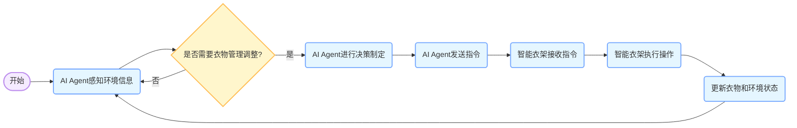

# AI Agent在智能衣架中的季节性衣物管理

> 关键词：AI Agent、智能衣架、季节性衣物管理、智能家居、机器学习

> 摘要：本文深入探讨了AI Agent在智能衣架季节性衣物管理中的应用。随着智能家居的发展，智能衣架作为其中的一个重要组成部分，利用AI Agent可以实现更高效、智能的季节性衣物管理。文章首先介绍了相关背景，包括目的、预期读者等内容；接着阐述了核心概念及联系，给出了原理和架构的文本示意图与Mermaid流程图；详细讲解了核心算法原理和具体操作步骤，并结合Python代码进行说明；还介绍了相关的数学模型和公式，通过举例加深理解；通过项目实战展示了代码实际案例和详细解释；分析了实际应用场景；推荐了学习资源、开发工具框架和相关论文著作；最后总结了未来发展趋势与挑战，解答了常见问题，并提供了扩展阅读和参考资料。

## 1. 背景介绍 
### 1.1 目的和范围
本文章的目的在于全面介绍AI Agent在智能衣架季节性衣物管理中的应用原理、技术实现和实际应用价值。随着人们生活水平的提高，对于衣物管理的需求也越来越智能化。智能衣架结合AI Agent技术，能够根据季节变化自动管理衣物，为用户提供更加便捷、高效的衣物管理体验。本文将涵盖AI Agent的基本概念、在智能衣架中的工作原理、相关算法和数学模型，以及实际应用案例等方面的内容。

### 1.2 预期读者
本文预期读者包括对智能家居技术感兴趣的普通消费者、从事智能家居开发的工程师和研究人员、相关专业的学生等。对于普通消费者，本文可以帮助他们了解智能衣架季节性衣物管理的原理和优势，以便在选择智能家居产品时做出更合适的决策；对于工程师和研究人员，本文提供了详细的技术实现细节和相关算法，可作为技术参考和研究的基础；对于学生，本文可以作为学习智能家居和AI技术的案例资料。

### 1.3 文档结构概述
本文共分为十个部分。第一部分为背景介绍，阐述了文章的目的、预期读者和文档结构概述等内容；第二部分介绍核心概念与联系，包括AI Agent、智能衣架和季节性衣物管理的概念，以及它们之间的关系，并给出了相应的文本示意图和Mermaid流程图；第三部分讲解核心算法原理和具体操作步骤，通过Python代码详细阐述；第四部分介绍数学模型和公式，并进行详细讲解和举例说明；第五部分进行项目实战，包括开发环境搭建、源代码详细实现和代码解读；第六部分分析实际应用场景；第七部分推荐学习资源、开发工具框架和相关论文著作；第八部分总结未来发展趋势与挑战；第九部分为附录，解答常见问题；第十部分提供扩展阅读和参考资料。

### 1.4 术语表
#### 1.4.1 核心术语定义
- **AI Agent（人工智能代理）**：是一种能够感知环境、做出决策并采取行动以实现特定目标的软件实体。在本文中，AI Agent用于感知季节变化、衣物信息等环境信息，并根据这些信息做出衣物管理的决策。
- **智能衣架**：具备智能化功能的衣架，能够与AI Agent进行交互，实现对衣物的自动管理，如自动升降、分类整理等。
- **季节性衣物管理**：根据不同季节的特点，对衣物进行合理的存储、整理和推荐，以满足用户在不同季节的穿衣需求。

#### 1.4.2 相关概念解释
- **机器学习**：是AI Agent实现智能决策的重要技术手段。通过对大量的季节数据、衣物数据和用户穿衣习惯数据进行学习，AI Agent可以建立模型，预测不同季节适合的衣物，并做出相应的管理决策。
- **传感器技术**：智能衣架需要借助各种传感器来感知环境信息，如温度传感器、湿度传感器、光照传感器等，以判断当前季节和衣物的存储环境。

#### 1.4.3 缩略词列表
- **AI**：Artificial Intelligence，人工智能
- **ML**：Machine Learning，机器学习

## 2. 核心概念与联系 
### 核心概念原理
#### AI Agent原理
AI Agent的核心原理是基于感知、决策和行动的循环过程。它通过传感器感知环境信息，如季节变化、衣物的存储状态等；然后根据预设的规则或通过机器学习模型进行决策，判断应该采取何种衣物管理措施；最后通过执行器（如智能衣架的电机）来实现相应的行动，如调整衣架高度、移动衣物位置等。

#### 智能衣架原理
智能衣架是一个集成了多种功能的硬件设备。它通常包括电机驱动系统，用于实现衣架的升降和移动；传感器系统，用于感知环境信息和衣物状态；通信模块，用于与AI Agent进行数据交互。智能衣架根据AI Agent发送的指令，执行相应的衣物管理操作。

#### 季节性衣物管理原理
季节性衣物管理的原理是根据不同季节的气候特点和人们的穿衣习惯，对衣物进行分类、存储和推荐。例如，在夏季，将厚衣物收纳起来，将轻薄透气的衣物放置在易于取用的位置；在冬季，则相反。同时，还可以根据用户的历史穿衣记录和偏好，为用户推荐适合当前季节的衣物。

### 架构的文本示意图
```plaintext
+---------------------+
|      AI Agent       |
|                     |
|  - 感知环境信息    |
|  - 决策制定        |
|  - 指令发送        |
+---------------------+
          |
          | 数据交互
          v
+---------------------+
|     智能衣架系统    |
|                     |
|  - 传感器模块      |
|  - 电机驱动模块    |
|  - 通信模块        |
+---------------------+
          |
          | 感知衣物和环境
          v
+---------------------+
|     衣物与环境      |
|                     |
|  - 季节变化        |
|  - 衣物状态        |
+---------------------+
```

### Mermaid流程图


## 3. 核心算法原理 & 具体操作步骤 
### 核心算法原理
#### 季节识别算法
季节识别算法是AI Agent实现季节性衣物管理的基础。一种常用的方法是基于温度和光照数据进行季节分类。可以使用机器学习中的分类算法，如决策树、支持向量机等。以下是一个使用Python和scikit-learn库实现的简单决策树季节分类示例：

```python
import numpy as np
from sklearn.tree import DecisionTreeClassifier

# 示例数据：温度和光照强度
X = np.array([[25, 800], [15, 600], [5, 200], [30, 1000]])
# 对应的季节标签：0-春季，1-夏季，2-秋季，3-冬季
y = np.array([0, 1, 3, 1])

# 创建决策树分类器
clf = DecisionTreeClassifier()

# 训练模型
clf.fit(X, y)

# 预测新的季节
new_data = np.array([[22, 700]])
predicted_season = clf.predict(new_data)
print("预测的季节是:", predicted_season[0])
```

#### 衣物推荐算法
衣物推荐算法根据季节和用户的穿衣习惯为用户推荐适合的衣物。可以使用协同过滤算法或基于内容的推荐算法。以下是一个简单的基于内容的衣物推荐示例：

```python
# 衣物数据：衣物名称，季节适用性
clothes = [
    {"name": "短袖T恤", "season": [1]},
    {"name": "长袖衬衫", "season": [0, 2]},
    {"name": "羽绒服", "season": [3]}
]

# 当前季节
current_season = 1

# 推荐适合当前季节的衣物
recommended_clothes = [c["name"] for c in clothes if current_season in c["season"]]
print("推荐的衣物有:", recommended_clothes)
```

### 具体操作步骤
1. **数据收集**：智能衣架通过传感器收集温度、光照等环境信息，以及衣物的基本信息（如材质、颜色、款式等）。
2. **季节识别**：AI Agent使用季节识别算法对收集到的环境信息进行分析，判断当前季节。
3. **衣物分类**：根据季节和衣物的季节适用性，将衣物分为适合当前季节和不适合当前季节的两类。
4. **衣物管理决策**：AI Agent根据衣物分类结果，制定衣物管理决策，如将不适合当前季节的衣物收纳起来，将适合当前季节的衣物放置在易于取用的位置。
5. **指令执行**：AI Agent将决策指令发送给智能衣架，智能衣架执行相应的操作。
6. **反馈与优化**：智能衣架执行操作后，将操作结果反馈给AI Agent，AI Agent根据反馈信息对模型进行优化，提高决策的准确性。

## 4. 数学模型和公式 & 详细讲解 & 举例说明 
### 季节识别的数学模型
#### 决策树模型
决策树是一种常用的分类模型，它通过对特征空间进行划分，将不同的样本划分到不同的类别中。决策树的节点表示特征的取值，分支表示特征的取值范围，叶子节点表示类别标签。

决策树的构建过程可以使用信息增益、基尼指数等指标来选择最优的特征进行划分。信息增益的计算公式为：

$$
IG(D, A) = H(D) - H(D|A)
$$

其中，$IG(D, A)$ 表示特征 $A$ 对数据集 $D$ 的信息增益，$H(D)$ 表示数据集 $D$ 的信息熵，$H(D|A)$ 表示在特征 $A$ 给定的条件下数据集 $D$ 的条件熵。

信息熵的计算公式为：

$$
H(D) = -\sum_{i=1}^{n} p_i \log_2 p_i
$$

其中，$p_i$ 表示数据集 $D$ 中第 $i$ 类样本的比例。

条件熵的计算公式为：

$$
H(D|A) = \sum_{j=1}^{m} \frac{|D_j|}{|D|} H(D_j)
$$

其中，$D_j$ 表示特征 $A$ 取值为第 $j$ 个值的样本子集，$|D_j|$ 表示 $D_j$ 的样本数量，$|D|$ 表示数据集 $D$ 的样本数量。

#### 举例说明
假设有一个数据集 $D$ 包含 10 个样本，其中 6 个属于春季，3 个属于夏季，1 个属于秋季。则数据集 $D$ 的信息熵为：

$$
H(D) = -\left(\frac{6}{10} \log_2 \frac{6}{10} + \frac{3}{10} \log_2 \frac{3}{10} + \frac{1}{10} \log_2 \frac{1}{10}\right) \approx 1.29
$$

假设我们有一个特征 $A$（温度），它有两个取值：高和低。在温度高的样本子集中，有 2 个春季样本和 3 个夏季样本；在温度低的样本子集中，有 4 个春季样本和 1 个秋季样本。则特征 $A$ 对数据集 $D$ 的信息增益为：

首先计算条件熵：

$$
H(D|A) = \frac{5}{10} \left(-\frac{2}{5} \log_2 \frac{2}{5} - \frac{3}{5} \log_2 \frac{3}{5}\right) + \frac{5}{10} \left(-\frac{4}{5} \log_2 \frac{4}{5} - \frac{1}{5} \log_2 \frac{1}{5}\right) \approx 0.97
$$

然后计算信息增益：

$$
IG(D, A) = H(D) - H(D|A) \approx 1.29 - 0.97 = 0.32
$$

### 衣物推荐的数学模型
#### 基于内容的推荐模型
基于内容的推荐模型通过计算衣物特征与用户需求特征之间的相似度来进行推荐。常用的相似度计算方法有余弦相似度。

余弦相似度的计算公式为：

$$
\cos(\vec{u}, \vec{v}) = \frac{\vec{u} \cdot \vec{v}}{\|\vec{u}\| \|\vec{v}\|}
$$

其中，$\vec{u}$ 和 $\vec{v}$ 分别表示衣物特征向量和用户需求特征向量，$\vec{u} \cdot \vec{v}$ 表示向量的点积，$\|\vec{u}\|$ 和 $\|\vec{v}\|$ 分别表示向量的模。

#### 举例说明
假设我们有两件衣物的特征向量分别为 $\vec{u} = [0.8, 0.2, 0]$ 和 $\vec{v} = [0.7, 0.3, 0]$，用户需求特征向量为 $\vec{w} = [0.75, 0.25, 0]$。则衣物 $\vec{u}$ 与用户需求 $\vec{w}$ 的余弦相似度为：

$$
\cos(\vec{u}, \vec{w}) = \frac{0.8 \times 0.75 + 0.2 \times 0.25 + 0 \times 0}{\sqrt{0.8^2 + 0.2^2 + 0^2} \sqrt{0.75^2 + 0.25^2 + 0^2}} \approx 0.98
$$

衣物 $\vec{v}$ 与用户需求 $\vec{w}$ 的余弦相似度为：

$$
\cos(\vec{v}, \vec{w}) = \frac{0.7 \times 0.75 + 0.3 \times 0.25 + 0 \times 0}{\sqrt{0.7^2 + 0.3^2 + 0^2} \sqrt{0.75^2 + 0.25^2 + 0^2}} \approx 0.99
$$

由于衣物 $\vec{v}$ 与用户需求的余弦相似度更高，因此更适合推荐给用户。

## 5. 项目实战：代码实际案例和详细解释说明 
### 5.1  开发环境搭建
#### 硬件环境
- **智能衣架**：选择具有电机驱动、传感器和通信功能的智能衣架。可以使用Arduino等开源硬件平台进行开发。
- **传感器**：温度传感器（如DHT11）、光照传感器（如BH1750）等。
- **服务器**：可以使用树莓派作为本地服务器，也可以使用云服务器（如阿里云、腾讯云）。

#### 软件环境
- **操作系统**：可以选择Linux系统（如Raspbian）或Windows系统。
- **开发语言**：Python，用于实现AI Agent和智能衣架的控制逻辑。
- **开发框架**：scikit-learn，用于机器学习算法的实现；Flask，用于搭建Web服务器，实现数据的交互和通信。

### 5.2  源代码详细实现和代码解读
#### 传感器数据采集代码
```python
import Adafruit_DHT
import smbus
import time

# 温度传感器类型
DHT_SENSOR = Adafruit_DHT.DHT11
# 温度传感器引脚
DHT_PIN = 4

# 光照传感器地址
BH1750_ADDRESS = 0x23
# 光照传感器模式
CONTINUOUS_HIGH_RES_MODE_1 = 0x10

# 创建I2C总线对象
bus = smbus.SMBus(1)

def read_temperature():
    humidity, temperature = Adafruit_DHT.read_retry(DHT_SENSOR, DHT_PIN)
    if humidity is not None and temperature is not None:
        return temperature
    else:
        return None

def read_illuminance():
    data = bus.read_i2c_block_data(BH1750_ADDRESS, CONTINUOUS_HIGH_RES_MODE_1)
    illuminance = (data[1] + (256 * data[0])) / 1.2
    return illuminance

while True:
    temperature = read_temperature()
    illuminance = read_illuminance()
    if temperature is not None:
        print("温度: {:.2f} °C".format(temperature))
    if illuminance is not None:
        print("光照强度: {:.2f} lux".format(illuminance))
    time.sleep(5)
```

**代码解读**：
- `read_temperature` 函数用于读取温度传感器的数据。使用 `Adafruit_DHT` 库来读取DHT11传感器的温度值。
- `read_illuminance` 函数用于读取光照传感器的数据。使用 `smbus` 库来与BH1750光照传感器进行通信，读取光照强度值。
- 在主循环中，每隔5秒读取一次温度和光照强度，并打印输出。

#### AI Agent决策代码
```python
import numpy as np
from sklearn.tree import DecisionTreeClassifier

# 示例数据：温度和光照强度
X = np.array([[25, 800], [15, 600], [5, 200], [30, 1000]])
# 对应的季节标签：0-春季，1-夏季，2-秋季，3-冬季
y = np.array([0, 1, 3, 1])

# 创建决策树分类器
clf = DecisionTreeClassifier()

# 训练模型
clf.fit(X, y)

def predict_season(temperature, illuminance):
    new_data = np.array([[temperature, illuminance]])
    predicted_season = clf.predict(new_data)
    return predicted_season[0]

# 假设从传感器读取到的温度和光照强度
temperature = 22
illuminance = 700

# 预测季节
season = predict_season(temperature, illuminance)
print("预测的季节是:", season)
```

**代码解读**：
- 首先定义了训练数据 `X` 和对应的季节标签 `y`。
- 创建决策树分类器 `clf` 并使用训练数据进行训练。
- `predict_season` 函数用于根据输入的温度和光照强度预测季节。
- 在主程序中，假设从传感器读取到的温度和光照强度，调用 `predict_season` 函数进行季节预测，并打印结果。

#### 智能衣架控制代码
```python
import RPi.GPIO as GPIO
import time

# 电机控制引脚
MOTOR_PIN = 18

# 设置GPIO模式
GPIO.setmode(GPIO.BCM)
# 设置电机控制引脚为输出模式
GPIO.setup(MOTOR_PIN, GPIO.OUT)

def move_hanger():
    # 电机正转，衣架上升
    GPIO.output(MOTOR_PIN, GPIO.HIGH)
    time.sleep(2)
    # 电机停止
    GPIO.output(MOTOR_PIN, GPIO.LOW)

# 调用函数控制衣架移动
move_hanger()

# 清理GPIO设置
GPIO.cleanup()
```

**代码解读**：
- 定义电机控制引脚 `MOTOR_PIN`。
- 设置GPIO模式为BCM模式，并将电机控制引脚设置为输出模式。
- `move_hanger` 函数用于控制衣架移动。通过设置电机控制引脚的电平来控制电机的正转和停止。
- 在主程序中，调用 `move_hanger` 函数控制衣架移动，最后清理GPIO设置。

### 5.3  代码解读与分析
#### 传感器数据采集代码分析
传感器数据采集代码的主要功能是从温度传感器和光照传感器中读取数据。通过使用相应的传感器库，可以方便地获取传感器的数据。在实际应用中，可以根据需要对数据进行处理和存储，例如将数据发送到服务器进行进一步的分析。

#### AI Agent决策代码分析
AI Agent决策代码使用决策树算法对季节进行预测。通过训练决策树模型，可以根据输入的温度和光照强度数据预测当前季节。在实际应用中，可以不断收集更多的数据来更新和优化模型，提高预测的准确性。

#### 智能衣架控制代码分析
智能衣架控制代码通过控制电机的正转和停止来实现衣架的移动。在实际应用中，可以根据AI Agent的决策结果，控制衣架进行不同的操作，如升降、分类整理等。

## 6. 实际应用场景 
### 家庭场景
在家庭中，智能衣架结合AI Agent可以为用户提供更加便捷的衣物管理体验。例如，在季节交替时，智能衣架可以自动将不适合当前季节的衣物收纳起来，将适合当前季节的衣物放置在易于取用的位置。同时，根据用户的穿衣习惯和偏好，为用户推荐适合的衣物，节省用户挑选衣物的时间。

### 商业场景
在商业场景中，如服装店、洗衣店等，智能衣架可以用于衣物的分类整理和展示。通过AI Agent的季节识别和衣物推荐功能，服装店可以更好地展示适合当前季节的服装，提高销售效率；洗衣店可以根据季节和衣物材质，合理安排衣物的清洗和存储。

### 酒店场景
在酒店中，智能衣架可以为客人提供更加贴心的服务。根据季节变化，自动调整房间内的衣物存储方式，为客人提供适合当前季节的衣物建议。同时，还可以与酒店的其他智能设备进行联动，如空调、窗帘等，为客人创造更加舒适的居住环境。

## 7. 工具和资源推荐
### 7.1 学习资源推荐
#### 7.1.1 书籍推荐
- 《人工智能：一种现代的方法》：全面介绍了人工智能的基本概念、算法和应用，是学习人工智能的经典教材。
- 《机器学习》：详细讲解了机器学习的各种算法和模型，适合有一定编程基础的读者深入学习。
- 《Python机器学习实战》：通过实际案例介绍了如何使用Python实现机器学习算法，具有很强的实践性。

#### 7.1.2 在线课程
- Coursera上的“机器学习”课程：由斯坦福大学教授Andrew Ng主讲，是全球最受欢迎的机器学习课程之一。
- edX上的“人工智能基础”课程：系统介绍了人工智能的基本概念和方法，适合初学者。
- 中国大学MOOC上的“Python数据分析与应用”课程：学习Python在数据分析和机器学习中的应用，为AI Agent开发打下基础。

#### 7.1.3 技术博客和网站
- 机器之心：提供人工智能领域的最新技术动态、研究成果和应用案例。
- 博客园：有很多开发者分享的人工智能和机器学习相关的技术文章和经验。
- 知乎：可以在上面搜索人工智能和智能家居相关的问题和讨论，获取不同的观点和见解。

### 7.2 开发工具框架推荐
#### 7.2.1 IDE和编辑器
- PyCharm：功能强大的Python集成开发环境，提供代码编辑、调试、版本控制等功能，适合开发Python项目。
- Visual Studio Code：轻量级的代码编辑器，支持多种编程语言和插件扩展，可用于快速开发和调试。
- Jupyter Notebook：交互式的编程环境，适合进行数据探索、模型训练和结果展示，常用于机器学习和数据分析项目。

#### 7.2.2 调试和性能分析工具
- PySnooper：可以自动记录函数的执行过程和变量的值，方便调试代码。
- cProfile：Python内置的性能分析工具，可以分析代码的运行时间和函数调用情况，找出性能瓶颈。
- TensorBoard：用于可视化深度学习模型的训练过程和结果，可帮助开发者优化模型。

#### 7.2.3 相关框架和库
- scikit-learn：提供了丰富的机器学习算法和工具，如分类、回归、聚类等，方便快速实现机器学习模型。
- TensorFlow：开源的深度学习框架，广泛应用于图像识别、自然语言处理等领域。
- Keras：基于TensorFlow的高级神经网络API，简单易用，适合快速搭建和训练深度学习模型。

### 7.3 相关论文著作推荐
#### 7.3.1 经典论文
- “A Logical Calculus of the Ideas Immanent in Nervous Activity”：由Warren McCulloch和Walter Pitts发表，提出了人工神经网络的概念，是人工智能领域的经典论文之一。
- “Learning Representations by Back-propagating Errors”：由David Rumelhart、Geoffrey Hinton和Ronald Williams发表，介绍了反向传播算法，推动了神经网络的发展。
- “The Elements of Statistical Learning”：详细介绍了统计学习的理论和方法，是机器学习领域的重要参考文献。

#### 7.3.2 最新研究成果
- 可以关注顶级学术会议如NeurIPS（神经信息处理系统大会）、ICML（国际机器学习会议）、CVPR（计算机视觉与模式识别会议）等的论文，了解人工智能领域的最新研究成果。
- 期刊如Journal of Artificial Intelligence Research（JAIR）、Artificial Intelligence等也发表了很多高质量的研究论文。

#### 7.3.3 应用案例分析
- 可以参考一些知名公司的技术博客和案例分享，如Google AI Blog、Microsoft AI等，了解人工智能在实际应用中的案例和经验。
- 一些行业报告和研究机构的分析文章也可以提供有价值的应用案例和趋势分析。

## 8. 总结：未来发展趋势与挑战
### 未来发展趋势
#### 智能化程度不断提高
随着人工智能技术的不断发展，AI Agent在智能衣架中的应用将更加智能化。例如，AI Agent可以通过学习用户的更多行为数据，如穿衣频率、搭配习惯等，提供更加个性化的衣物管理和推荐服务。

#### 与其他智能家居设备的集成
智能衣架将与其他智能家居设备进行更加深入的集成，实现全屋智能化控制。例如，与智能空调联动，根据季节和室内温度自动调整衣物的存储方式；与智能衣柜联动，实现衣物的自动分类和整理。

#### 物联网技术的应用
物联网技术将使智能衣架能够实现更广泛的连接和数据共享。通过与云平台的连接，智能衣架可以获取更多的天气、时尚等信息，为用户提供更加全面的衣物管理服务。

### 挑战
#### 数据隐私和安全问题
智能衣架在收集和处理用户的衣物信息、行为数据等过程中，可能会涉及到用户的隐私问题。因此，需要采取有效的数据加密和安全措施，保护用户的隐私和数据安全。

#### 算法的准确性和可靠性
AI Agent的决策准确性和可靠性直接影响到智能衣架的使用效果。需要不断优化和改进算法，提高季节识别、衣物推荐等功能的准确性。

#### 成本和普及问题
目前，智能衣架的成本相对较高，限制了其普及程度。需要通过技术创新和规模化生产，降低智能衣架的成本，使其更加普及。

## 9. 附录：常见问题与解答
### 问题1：智能衣架的传感器数据准确吗？
答：智能衣架的传感器数据准确性取决于传感器的质量和安装环境。一般来说，选择质量可靠的传感器，并按照正确的安装方法进行安装，可以保证传感器数据的准确性。同时，还可以通过定期校准传感器来提高数据的准确性。

### 问题2：AI Agent的决策是如何做出的？
答：AI Agent通过感知环境信息（如温度、光照等）和衣物信息，使用预设的规则或机器学习模型进行决策。例如，在季节识别方面，可以使用决策树算法根据温度和光照数据判断当前季节；在衣物推荐方面，可以使用协同过滤算法或基于内容的推荐算法根据用户的穿衣习惯和衣物特征进行推荐。

### 问题3：智能衣架可以与手机APP连接吗？
答：可以。智能衣架通常配备有通信模块，可以通过Wi-Fi、蓝牙等方式与手机APP进行连接。通过手机APP，用户可以远程控制智能衣架的操作，查看衣物信息和管理记录等。

### 问题4：智能衣架的使用寿命有多长？
答：智能衣架的使用寿命取决于多个因素，如硬件质量、使用频率和维护情况等。一般来说，质量较好的智能衣架可以使用5-10年。在使用过程中，定期进行维护和保养，可以延长智能衣架的使用寿命。

## 10. 扩展阅读 & 参考资料
### 扩展阅读
- 《智能家居系统设计与实现》：深入介绍了智能家居系统的设计原理和实现方法，包括智能衣架在内的各种智能家居设备的集成和应用。
- 《人工智能与未来生活》：探讨了人工智能技术对未来生活的影响，以及智能衣架等智能家居设备在未来生活中的发展趋势。

### 参考资料
- 各传感器和硬件设备的官方文档和技术手册。
- 相关的学术论文和研究报告，如上述提到的经典论文和最新研究成果。
- 开源代码库和技术论坛，如GitHub、Stack Overflow等，可获取更多的代码实现和技术交流。

作者：AI天才研究院/AI Genius Institute & 禅与计算机程序设计艺术 /Zen And The Art of Computer Programming