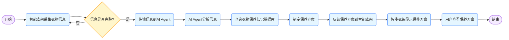

# AI Agent在智能衣架中的衣物保养指导

> 关键词：AI Agent、智能衣架、衣物保养指导、物联网、机器学习

> 摘要：本文深入探讨了AI Agent在智能衣架中实现衣物保养指导的相关技术。从背景介绍出发，阐述了研究目的、预期读者等内容。详细讲解了核心概念、算法原理、数学模型，通过项目实战展示了代码实现与分析。同时，探讨了实际应用场景，推荐了相关工具和资源，最后对未来发展趋势与挑战进行了总结，并给出常见问题解答和参考资料。旨在为智能衣架领域引入AI Agent提供全面的技术支持和发展思路。

## 1. 背景介绍 
### 1.1 目的和范围
随着人们生活水平的提高，对于衣物的保养需求日益增长。传统的衣架仅具备悬挂衣物的基本功能，无法为用户提供专业的衣物保养建议。本研究的目的是将AI Agent引入智能衣架，使衣架能够根据衣物的材质、颜色、污渍情况等因素，为用户提供个性化的衣物保养指导。

本研究的范围涵盖了AI Agent的核心算法设计、智能衣架的硬件架构、衣物信息的采集与处理、以及衣物保养知识的数据库构建等方面。通过综合运用人工智能、物联网等技术，实现智能衣架的衣物保养指导功能。

### 1.2 预期读者
本文的预期读者包括从事人工智能、物联网、智能家居等领域的研究人员和开发者，以及对智能衣架和衣物保养感兴趣的爱好者。对于研究人员和开发者，本文提供了详细的技术原理和实现方法，可作为相关项目的参考；对于爱好者，本文能够帮助他们了解智能衣架的技术内涵和应用前景。

### 1.3 文档结构概述
本文将按照以下结构进行组织：
1. 背景介绍：阐述研究的目的、范围、预期读者和文档结构。
2. 核心概念与联系：介绍AI Agent、智能衣架、衣物保养指导等核心概念，并展示它们之间的联系。
3. 核心算法原理 & 具体操作步骤：详细讲解AI Agent的核心算法原理，并给出具体的操作步骤。
4. 数学模型和公式 & 详细讲解 & 举例说明：建立数学模型，给出相关公式，并通过具体例子进行说明。
5. 项目实战：代码实际案例和详细解释说明：展示项目实战的代码实现，并进行详细的解释和分析。
6. 实际应用场景：探讨AI Agent在智能衣架中衣物保养指导的实际应用场景。
7. 工具和资源推荐：推荐相关的学习资源、开发工具和论文著作。
8. 总结：未来发展趋势与挑战：总结研究成果，展望未来发展趋势，并分析面临的挑战。
9. 附录：常见问题与解答：解答常见问题，提供技术支持。
10. 扩展阅读 & 参考资料：提供扩展阅读的建议和参考资料。

### 1.4 术语表
#### 1.4.1 核心术语定义
- **AI Agent**：人工智能代理，是一种能够感知环境、做出决策并采取行动的智能实体。在本研究中，AI Agent负责分析衣物信息，提供衣物保养指导。
- **智能衣架**：具备智能化功能的衣架，能够采集衣物的相关信息，并与AI Agent进行交互。
- **衣物保养指导**：根据衣物的材质、颜色、污渍情况等因素，为用户提供的关于衣物清洗、晾晒、存放等方面的建议。

#### 1.4.2 相关概念解释
- **物联网（IoT）**：通过各种信息传感设备，将物品与互联网相连接，实现物品的智能化识别、定位、跟踪、监控和管理。在智能衣架中，物联网技术用于实现衣架与AI Agent之间的数据传输。
- **机器学习（ML）**：一门多领域交叉学科，涉及概率论、统计学、逼近论、凸分析、算法复杂度理论等多门学科。它专门研究计算机怎样模拟或实现人类的学习行为，以获取新的知识或技能，重新组织已有的知识结构使之不断改善自身的性能。在本研究中，机器学习算法用于分析衣物信息，提供更准确的保养指导。

#### 1.4.3 缩略词列表
- **AI**：Artificial Intelligence，人工智能
- **IoT**：Internet of Things，物联网
- **ML**：Machine Learning，机器学习

## 2. 核心概念与联系 

### 核心概念原理
#### AI Agent
AI Agent是一个具有自主性、反应性、社会性和主动性的智能实体。在智能衣架的衣物保养指导系统中，AI Agent的工作原理如下：
1. **感知**：通过智能衣架上的传感器（如摄像头、湿度传感器、温度传感器等）获取衣物的相关信息，包括衣物的材质、颜色、污渍情况、当前环境的湿度和温度等。
2. **分析**：对感知到的信息进行分析，利用机器学习算法和衣物保养知识数据库，判断衣物的保养需求。
3. **决策**：根据分析结果，制定出适合该衣物的保养方案，如清洗方式、晾晒时间、存放方法等。
4. **行动**：将保养方案通过智能衣架的显示屏或手机APP反馈给用户。

#### 智能衣架
智能衣架是AI Agent的载体，它集成了多种传感器和通信模块，能够实现以下功能：
1. **信息采集**：通过传感器采集衣物的相关信息，如衣物的材质、颜色、污渍情况等。
2. **数据传输**：将采集到的信息通过通信模块（如Wi-Fi、蓝牙等）传输给AI Agent。
3. **信息反馈**：接收AI Agent发送的保养方案，并通过显示屏或手机APP反馈给用户。

#### 衣物保养指导
衣物保养指导是根据衣物的材质、颜色、污渍情况等因素，为用户提供的关于衣物清洗、晾晒、存放等方面的建议。不同的衣物材质需要不同的保养方法，例如：
- **棉质衣物**：适合用温和的洗涤剂清洗，避免长时间暴晒。
- **丝绸衣物**：需要用专门的丝绸洗涤剂清洗，轻柔手洗，避免拧干。
- **羊毛衣物**：应该用羊毛专用洗涤剂清洗，低温烘干或平铺晾干。

### 架构的文本示意图
```plaintext
用户 <---> 手机APP <---> 智能衣架 <---> AI Agent <---> 衣物保养知识数据库
```
解释：用户通过手机APP与智能衣架进行交互，智能衣架采集衣物信息并传输给AI Agent，AI Agent根据衣物保养知识数据库进行分析和决策，将保养方案通过智能衣架反馈给用户。

### Mermaid流程图


## 3. 核心算法原理 & 具体操作步骤 

### 核心算法原理
在智能衣架的衣物保养指导系统中，核心算法主要涉及衣物信息的分类和保养方案的推荐。这里我们使用朴素贝叶斯分类器作为核心算法，其原理如下：

朴素贝叶斯分类器是基于贝叶斯定理和特征条件独立假设的分类算法。对于给定的训练数据集，首先基于特征条件独立假设学习输入输出的联合概率分布；然后基于此模型，对给定的输入 $x$，利用贝叶斯定理求出后验概率最大的输出 $y$。

设输入空间 $\mathcal{X} \subseteq \mathbf{R}^n$ 为 $n$ 维向量的集合，输出空间为类标记集合 $\mathcal{Y}=\{c_1, c_2, \cdots, c_K\}$。输入为特征向量 $x \in \mathcal{X}$，输出为类标记 $y \in \mathcal{Y}$。$X$ 是定义在输入空间 $\mathcal{X}$ 上的随机向量，$Y$ 是定义在输出空间 $\mathcal{Y}$ 上的随机变量。$P(X, Y)$ 是 $X$ 和 $Y$ 的联合概率分布。训练数据集
$$
T=\{(x_1, y_1), (x_2, y_2), \cdots, (x_N, y_N)\}
$$
由 $P(X, Y)$ 独立同分布产生。

朴素贝叶斯分类器通过训练数据集学习联合概率分布 $P(X, Y)$。具体地，学习以下先验概率分布及条件概率分布。先验概率分布
$$
P(Y = c_k), \quad k = 1, 2, \cdots, K
$$
条件概率分布
$$
P(X = x | Y = c_k) = P(X^{(1)} = x^{(1)}, \cdots, X^{(n)} = x^{(n)} | Y = c_k), \quad k = 1, 2, \cdots, K
$$
于是学习到联合概率分布 $P(X, Y)$。

条件概率分布 $P(X = x | Y = c_k)$ 有指数级数量的参数，其估计实际是不可行的。事实上，假设 $x^{(j)}$ 可取值有 $S_j$ 个，$j = 1, 2, \cdots, n$，$Y$ 可取值有 $K$ 个，那么参数个数为 $K \prod_{j = 1}^{n} S_j$。

朴素贝叶斯方法对条件概率分布作了条件独立性的假设。由于这是一个较强的假设，朴素贝叶斯也由此得名。具体地，条件独立性假设是
$$
P(X = x | Y = c_k) = \prod_{j = 1}^{n} P(X^{(j)} = x^{(j)} | Y = c_k)
$$

### 具体操作步骤
#### 步骤1：数据收集
收集衣物的相关信息，包括衣物的材质、颜色、污渍情况等，同时记录对应的保养方案。将这些数据整理成训练数据集。

#### 步骤2：数据预处理
对训练数据集进行预处理，包括数据清洗、特征提取和特征编码。例如，将衣物的材质、颜色等分类特征进行编码，转换为数值特征。

#### 步骤3：模型训练
使用朴素贝叶斯分类器对预处理后的训练数据集进行训练。以下是使用Python实现的示例代码：
```python
from sklearn.naive_bayes import GaussianNB
from sklearn.preprocessing import LabelEncoder
import numpy as np

# 示例训练数据
# 特征：材质（棉、丝绸、羊毛），颜色（白色、黑色、彩色），污渍情况（有、无）
X = [
    ['棉', '白色', '无'],
    ['丝绸', '彩色', '有'],
    ['羊毛', '黑色', '无'],
    ['棉', '彩色', '有']
]
# 标签：保养方案（温和清洗、轻柔手洗、羊毛专用清洗）
y = ['温和清洗', '轻柔手洗', '羊毛专用清洗', '温和清洗']

# 特征编码
encoders = []
X_encoded = []
for i in range(len(X[0])):
    encoder = LabelEncoder()
    X_encoded.append(encoder.fit_transform([row[i] for row in X]))
    encoders.append(encoder)
X_encoded = np.array(X_encoded).T

# 标签编码
label_encoder = LabelEncoder()
y_encoded = label_encoder.fit_transform(y)

# 训练模型
model = GaussianNB()
model.fit(X_encoded, y_encoded)
```

#### 步骤4：预测保养方案
当智能衣架采集到新的衣物信息时，对其进行预处理，然后使用训练好的模型进行预测。以下是预测的示例代码：
```python
# 新的衣物信息
new_clothes = [['丝绸', '白色', '有']]

# 特征编码
new_clothes_encoded = []
for i in range(len(new_clothes[0])):
    new_clothes_encoded.append(encoders[i].transform([new_clothes[0][i]]))
new_clothes_encoded = np.array(new_clothes_encoded).T

# 预测
predicted_encoded = model.predict(new_clothes_encoded)
predicted = label_encoder.inverse_transform(predicted_encoded)

print("预测的保养方案：", predicted[0])
```

## 4. 数学模型和公式 & 详细讲解 & 举例说明 

### 数学模型
在朴素贝叶斯分类器中，我们的目标是对于给定的输入 $x$，找到后验概率 $P(Y = c_k | X = x)$ 最大的类标记 $c_k$。根据贝叶斯定理，后验概率可以表示为：
$$
P(Y = c_k | X = x) = \frac{P(X = x | Y = c_k) P(Y = c_k)}{P(X = x)}
$$
由于对于所有的 $c_k$，$P(X = x)$ 是相同的，所以我们只需要比较 $P(X = x | Y = c_k) P(Y = c_k)$ 的大小。

### 公式详细讲解
- **先验概率 $P(Y = c_k)$**：表示类标记 $c_k$ 出现的概率，可以通过训练数据集中类标记 $c_k$ 出现的频率来估计：
$$
P(Y = c_k) = \frac{\sum_{i = 1}^{N} I(y_i = c_k)}{N}
$$
其中，$I(y_i = c_k)$ 是指示函数，当 $y_i = c_k$ 时，$I(y_i = c_k) = 1$，否则 $I(y_i = c_k) = 0$。

- **条件概率 $P(X^{(j)} = x^{(j)} | Y = c_k)$**：表示在类标记为 $c_k$ 的条件下，特征 $X^{(j)}$ 取值为 $x^{(j)}$ 的概率。可以通过训练数据集中在类标记为 $c_k$ 的样本中，特征 $X^{(j)}$ 取值为 $x^{(j)}$ 的频率来估计：
$$
P(X^{(j)} = x^{(j)} | Y = c_k) = \frac{\sum_{i = 1}^{N} I(x_i^{(j)} = x^{(j)}, y_i = c_k)}{\sum_{i = 1}^{N} I(y_i = c_k)}
$$

### 举例说明
假设我们有以下训练数据集：

| 材质 | 颜色 | 污渍情况 | 保养方案 |
|------|------|----------|----------|
| 棉   | 白色 | 无       | 温和清洗 |
| 丝绸 | 彩色 | 有       | 轻柔手洗 |
| 羊毛 | 黑色 | 无       | 羊毛专用清洗 |
| 棉   | 彩色 | 有       | 温和清洗 |

#### 计算先验概率
- $P(Y = \text{温和清洗}) = \frac{2}{4} = 0.5$
- $P(Y = \text{轻柔手洗}) = \frac{1}{4} = 0.25$
- $P(Y = \text{羊毛专用清洗}) = \frac{1}{4} = 0.25$

#### 计算条件概率
以材质特征为例：
- $P(X^{(1)} = \text{棉} | Y = \text{温和清洗}) = \frac{2}{2} = 1$
- $P(X^{(1)} = \text{丝绸} | Y = \text{轻柔手洗}) = \frac{1}{1} = 1$
- $P(X^{(1)} = \text{羊毛} | Y = \text{羊毛专用清洗}) = \frac{1}{1} = 1$

假设新的衣物信息为（丝绸，白色，有），我们可以计算每个保养方案的后验概率：
- $P(Y = \text{温和清洗} | X = (\text{丝绸}, \text{白色}, \text{有})) \propto P(X = (\text{丝绸}, \text{白色}, \text{有}) | Y = \text{温和清洗}) P(Y = \text{温和清洗})$
- $P(Y = \text{轻柔手洗} | X = (\text{丝绸}, \text{白色}, \text{有})) \propto P(X = (\text{丝绸}, \text{白色}, \text{有}) | Y = \text{轻柔手洗}) P(Y = \text{轻柔手洗})$
- $P(Y = \text{羊毛专用清洗} | X = (\text{丝绸}, \text{白色}, \text{有})) \propto P(X = (\text{丝绸}, \text{白色}, \text{有}) | Y = \text{羊毛专用清洗}) P(Y = \text{羊毛专用清洗})$

通过比较这些后验概率的大小，我们可以选择后验概率最大的保养方案作为预测结果。

## 5. 项目实战：代码实际案例和详细解释说明 

### 5.1  开发环境搭建
#### 硬件环境
- **智能衣架**：选择一款支持传感器集成和通信功能的智能衣架，如具备摄像头、湿度传感器、温度传感器等，同时支持Wi-Fi或蓝牙通信。
- **开发板**：选择一款性能稳定的开发板，如树莓派（Raspberry Pi），用于运行AI Agent的算法。

#### 软件环境
- **操作系统**：在开发板上安装适合的操作系统，如Raspbian（树莓派官方操作系统）。
- **Python环境**：安装Python 3.x版本，并安装相关的库，如`scikit-learn`、`numpy`、`pandas`等。

### 5.2  源代码详细实现和代码解读
以下是一个完整的项目实战代码示例，包括数据收集、预处理、模型训练和预测的全过程。

```python
import numpy as np
import pandas as pd
from sklearn.naive_bayes import GaussianNB
from sklearn.preprocessing import LabelEncoder

# 步骤1：数据收集
# 假设我们从智能衣架的传感器获取到以下数据
data = {
    '材质': ['棉', '丝绸', '羊毛', '棉', '丝绸', '羊毛'],
    '颜色': ['白色', '彩色', '黑色', '彩色', '白色', '黑色'],
    '污渍情况': ['无', '有', '无', '有', '无', '有'],
    '保养方案': ['温和清洗', '轻柔手洗', '羊毛专用清洗', '温和清洗', '轻柔手洗', '羊毛专用清洗']
}
df = pd.DataFrame(data)

# 步骤2：数据预处理
# 特征编码
encoders = []
X = df.drop('保养方案', axis=1)
y = df['保养方案']
X_encoded = []
for column in X.columns:
    encoder = LabelEncoder()
    X_encoded.append(encoder.fit_transform(X[column]))
    encoders.append(encoder)
X_encoded = np.array(X_encoded).T

# 标签编码
label_encoder = LabelEncoder()
y_encoded = label_encoder.fit_transform(y)

# 步骤3：模型训练
model = GaussianNB()
model.fit(X_encoded, y_encoded)

# 步骤4：预测保养方案
# 新的衣物信息
new_clothes = {
    '材质': ['丝绸'],
    '颜色': ['白色'],
    '污渍情况': ['有']
}
new_clothes_df = pd.DataFrame(new_clothes)

# 特征编码
new_clothes_encoded = []
for i, column in enumerate(new_clothes_df.columns):
    new_clothes_encoded.append(encoders[i].transform(new_clothes_df[column]))
new_clothes_encoded = np.array(new_clothes_encoded).T

# 预测
predicted_encoded = model.predict(new_clothes_encoded)
predicted = label_encoder.inverse_transform(predicted_encoded)

print("预测的保养方案：", predicted[0])
```

### 5.3  代码解读与分析
#### 数据收集
使用`pandas`库创建一个包含衣物信息和保养方案的DataFrame。在实际应用中，这些数据可以从智能衣架的传感器实时获取。

#### 数据预处理
- 使用`LabelEncoder`对特征和标签进行编码，将分类特征转换为数值特征，以便模型能够处理。
- 将特征和标签分别存储在`X_encoded`和`y_encoded`中。

#### 模型训练
使用`GaussianNB`（高斯朴素贝叶斯分类器）对训练数据进行训练。

#### 预测保养方案
- 对于新的衣物信息，同样进行特征编码。
- 使用训练好的模型进行预测，并将预测结果转换为原始的保养方案标签。

通过以上步骤，我们可以实现智能衣架的衣物保养指导功能。

## 6. 实际应用场景 
### 家庭场景
在家庭中，智能衣架可以放置在卧室或衣帽间。当用户将衣物挂在智能衣架上时，衣架会自动采集衣物的信息，并通过AI Agent分析给出保养指导。例如，对于一件丝绸衬衫，智能衣架会提示用户使用专门的丝绸洗涤剂轻柔手洗，避免拧干，然后平铺晾干。用户可以通过手机APP随时查看衣物的保养建议，方便快捷。

### 酒店场景
酒店可以在客房中配备智能衣架，为客人提供更好的服务。当客人将衣物挂在衣架上时，衣架能够识别衣物的材质和污渍情况，为客人提供合适的洗衣建议。如果客人有特殊的衣物保养需求，酒店工作人员也可以根据智能衣架提供的信息进行专业的处理。

### 干洗店场景
干洗店可以利用智能衣架提高服务效率和质量。在接收衣物时，干洗店员工可以将衣物挂在智能衣架上，快速获取衣物的保养信息，制定合理的清洗方案。同时，智能衣架还可以记录衣物的清洗历史，为客户提供个性化的保养建议。

## 7. 工具和资源推荐
### 7.1 学习资源推荐
#### 7.1.1 书籍推荐
- 《机器学习》（周志华）：这本书全面介绍了机器学习的基本概念、算法和应用，是机器学习领域的经典教材。
- 《Python机器学习》（Sebastian Raschka）：本书详细介绍了使用Python进行机器学习的方法和技巧，通过大量的代码示例帮助读者快速掌握机器学习的实践技能。
- 《人工智能：一种现代的方法》（Stuart Russell, Peter Norvig）：这是人工智能领域的权威著作，涵盖了人工智能的各个方面，包括知识表示、推理、学习、规划等。

#### 7.1.2 在线课程
- Coursera上的“机器学习”课程（Andrew Ng教授授课）：这是一门非常经典的机器学习课程，通过视频讲解、编程作业等方式，帮助学员系统地学习机器学习的基本理论和算法。
- edX上的“人工智能基础”课程：该课程介绍了人工智能的基本概念、技术和应用，适合初学者入门。
- 中国大学MOOC上的“Python语言程序设计”课程：学习Python编程是进行人工智能开发的基础，这门课程可以帮助学员快速掌握Python的基本语法和编程技巧。

#### 7.1.3 技术博客和网站
- 博客园：这是一个技术开发者的社区，上面有很多关于人工智能、机器学习、物联网等领域的技术文章和经验分享。
- 开源中国：提供了丰富的开源项目和技术资讯，对于学习和了解最新的技术动态非常有帮助。
- Towards Data Science：这是一个专注于数据科学和机器学习的博客平台，上面有很多高质量的技术文章和案例分析。

### 7.2 开发工具框架推荐
#### 7.2.1 IDE和编辑器
- PyCharm：这是一款专门为Python开发设计的集成开发环境（IDE），具有代码编辑、调试、自动补全、版本控制等功能，非常适合Python项目的开发。
- Visual Studio Code：一款轻量级的代码编辑器，支持多种编程语言，通过安装相关的插件可以实现Python开发的各种功能。
- Jupyter Notebook：一种交互式的开发环境，适合进行数据分析和机器学习实验，用户可以在浏览器中编写和运行代码，同时还可以添加文本说明和可视化图表。

#### 7.2.2 调试和性能分析工具
- pdb：Python自带的调试器，可以帮助开发者在代码中设置断点、单步执行、查看变量值等，方便排查代码中的问题。
- cProfile：Python的性能分析工具，可以统计代码中各个函数的执行时间和调用次数，帮助开发者找出代码中的性能瓶颈。
- TensorBoard：TensorFlow提供的可视化工具，可以用于可视化训练过程中的损失函数、准确率等指标，以及模型的结构和参数分布。

#### 7.2.3 相关框架和库
- scikit-learn：一个简单易用的机器学习库，提供了各种机器学习算法和工具，如分类、回归、聚类、降维等。
- TensorFlow：Google开发的深度学习框架，支持多种深度学习模型的构建和训练，广泛应用于图像识别、自然语言处理等领域。
- PyTorch：Facebook开发的深度学习框架，具有动态图的特点，易于使用和调试，在学术界和工业界都有广泛的应用。

### 7.3 相关论文著作推荐
#### 7.3.1 经典论文
- 《A Tutorial on Naive Bayes Classification》：这篇论文详细介绍了朴素贝叶斯分类器的原理和应用，是朴素贝叶斯分类器领域的经典文献。
- 《Machine Learning: A Probabilistic Perspective》：这本书从概率的角度介绍了机器学习的基本理论和算法，对于理解机器学习的本质非常有帮助。
- 《Deep Learning》：由Ian Goodfellow、Yoshua Bengio和Aaron Courville撰写的深度学习领域的权威著作，涵盖了深度学习的各个方面，包括神经网络、卷积神经网络、循环神经网络等。

#### 7.3.2 最新研究成果
- 在IEEE Xplore、ACM Digital Library等学术数据库中，可以搜索到关于人工智能、物联网、智能家居等领域的最新研究成果。
- 关注顶级学术会议，如NeurIPS（神经信息处理系统大会）、ICML（国际机器学习会议）、CVPR（计算机视觉与模式识别会议）等，这些会议上会发布很多最新的研究成果。

#### 7.3.3 应用案例分析
- 《Smart Home Technology and Applications》：这本书介绍了智能家居技术的应用案例和发展趋势，对于了解智能衣架等智能家居设备的应用有很大的帮助。
- 一些科技媒体和行业报告也会分享智能衣架等智能家居产品的应用案例和市场分析，可以关注相关的报道。

## 8. 总结：未来发展趋势与挑战
### 未来发展趋势
#### 更精准的衣物识别
随着计算机视觉技术的不断发展，智能衣架将能够更精准地识别衣物的材质、颜色、款式等信息。通过高分辨率的摄像头和先进的图像识别算法，甚至可以识别衣物上的品牌和型号，从而提供更个性化的保养指导。

#### 与智能家居系统的深度融合
智能衣架将与其他智能家居设备进行深度融合，形成一个完整的智能家居生态系统。例如，智能衣架可以与智能洗衣机、烘干机进行联动，根据衣物的保养需求自动设置洗涤和烘干参数。同时，还可以与智能空调、加湿器等设备配合，调节室内的温度和湿度，为衣物提供更好的存放环境。

#### 大数据和云计算的应用
利用大数据和云计算技术，智能衣架可以收集和分析大量的衣物保养数据。通过对这些数据的挖掘和分析，可以不断优化保养方案，提高保养指导的准确性和可靠性。同时，用户还可以通过云端存储自己的衣物信息和保养记录，方便随时查看和管理。

### 挑战
#### 数据隐私和安全问题
智能衣架在采集衣物信息的过程中，会涉及到用户的个人隐私。例如，衣物上可能会有一些个人标识或敏感信息。因此，如何保障数据的隐私和安全是一个重要的挑战。需要采取有效的加密技术和安全措施，防止数据泄露和滥用。

#### 算法的准确性和可靠性
衣物的保养需求受到多种因素的影响，如材质、颜色、污渍情况、使用频率等。如何开发出更准确、更可靠的算法，能够综合考虑这些因素，提供合理的保养指导，是一个需要解决的问题。同时，算法还需要不断学习和优化，以适应不同用户的需求和新的衣物材质。

#### 硬件成本和性能
智能衣架需要集成多种传感器和通信模块，这会增加硬件的成本。如何在保证性能的前提下，降低硬件成本，提高产品的性价比，是智能衣架推广应用的关键。此外，硬件的稳定性和可靠性也需要进一步提高，以确保智能衣架能够长期稳定运行。

## 9. 附录：常见问题与解答
### 问题1：智能衣架的传感器如何准确识别衣物的材质？
解答：智能衣架的传感器主要通过多种方式来识别衣物的材质。摄像头可以拍摄衣物的纹理和外观，通过图像识别算法与预先存储的材质样本进行比对。此外，还可以利用红外传感器检测衣物的热传导特性，不同材质的衣物热传导速度不同，从而辅助判断材质。

### 问题2：如果智能衣架给出的保养方案与我平时的做法不同，应该相信哪个？
解答：智能衣架给出的保养方案是基于大量的衣物保养知识和数据分析得出的，具有一定的科学性和专业性。如果与您平时的做法不同，建议您参考智能衣架的方案。但在实际操作中，您也可以根据衣物的实际情况和个人经验进行适当调整。

### 问题3：智能衣架的通信模块是否稳定？
解答：智能衣架的通信模块通常采用成熟的技术，如Wi-Fi、蓝牙等，在正常情况下是比较稳定的。但通信质量可能会受到环境因素的影响，如信号干扰、距离过远等。如果遇到通信不稳定的情况，您可以尝试调整智能衣架的位置，或者检查网络设置。

### 问题4：智能衣架的保养知识数据库如何更新？
解答：智能衣架的保养知识数据库可以通过云端进行更新。开发团队会定期收集和整理最新的衣物保养知识，将其更新到云端服务器。智能衣架在联网状态下，会自动从云端下载最新的数据库，以保证保养指导的准确性和时效性。

## 10. 扩展阅读 & 参考资料
### 扩展阅读
- 《智能家居系统设计与实现》：深入介绍了智能家居系统的设计原理和实现方法，对于理解智能衣架在智能家居中的应用有很大的帮助。
- 《人工智能与未来生活》：探讨了人工智能技术对未来生活的影响，包括智能家居、智能医疗、智能交通等领域。

### 参考资料
- [1] 周志华. 机器学习. 清华大学出版社, 2016.
- [2] Sebastian Raschka. Python机器学习. 人民邮电出版社, 2018.
- [3] Stuart Russell, Peter Norvig. 人工智能：一种现代的方法. 清华大学出版社, 2006.
- [4] Andrew Ng. Machine Learning. Coursera, 2012.
- [5] 《A Tutorial on Naive Bayes Classification》, available at [https://www.cs.unb.ca/~hzhang/publications/FLAIRS04ZhangH.pdf](https://www.cs.unb.ca/~hzhang/publications/FLAIRS04ZhangH.pdf)

作者：AI天才研究院/AI Genius Institute & 禅与计算机程序设计艺术 /Zen And The Art of Computer Programming