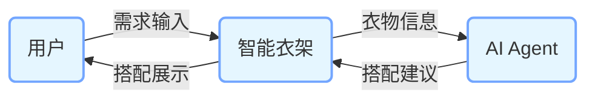

# AI Agent在智能衣架中的衣物搭配建议

> 关键词：AI Agent、智能衣架、衣物搭配、人工智能、推荐系统

> 摘要：本文围绕AI Agent在智能衣架中的衣物搭配建议展开深入探讨。首先介绍了相关背景知识，包括目的、预期读者、文档结构和术语表等。接着阐述了核心概念与联系，分析了AI Agent和智能衣架的原理及架构。详细讲解了核心算法原理和具体操作步骤，并辅以Python源代码。还探讨了数学模型和公式，通过举例加深理解。在项目实战部分，给出了开发环境搭建、源代码实现及解读。随后介绍了实际应用场景，推荐了相关工具和资源。最后总结了未来发展趋势与挑战，提供了常见问题解答和扩展阅读参考资料。旨在全面展现AI Agent在智能衣架衣物搭配建议方面的技术原理、实现方法和应用前景。

## 1. 背景介绍 
### 1.1 目的和范围
随着人们生活水平的提高，对于日常穿搭的要求也越来越高。智能衣架作为智能家居的一部分，正逐渐走进人们的生活。本文章的目的在于探讨如何利用AI Agent技术为智能衣架提供精准的衣物搭配建议，以满足用户对于便捷、个性化穿搭的需求。范围涵盖了从AI Agent的核心概念、算法原理到在智能衣架中的具体实现和应用场景等方面。

### 1.2 预期读者
本文预期读者包括对人工智能、智能家居领域感兴趣的技术爱好者，从事相关领域研究和开发的科研人员、工程师，以及关注智能衣架发展和衣物搭配智能化的普通消费者。

### 1.3 文档结构概述
本文将按照以下结构进行阐述：首先介绍背景知识，包括目的、读者和文档结构等；接着讲解核心概念与联系，包括AI Agent和智能衣架的原理及架构；然后详细介绍核心算法原理和具体操作步骤，并给出Python源代码；再探讨数学模型和公式，通过举例进行说明；之后进行项目实战，包括开发环境搭建、源代码实现和解读；随后介绍实际应用场景；推荐相关的工具和资源；最后总结未来发展趋势与挑战，提供常见问题解答和扩展阅读参考资料。

### 1.4 术语表
#### 1.4.1 核心术语定义
- **AI Agent（人工智能智能体）**：是一个能够感知环境、根据感知信息进行决策并采取行动的人工智能实体。在本应用中，AI Agent能够感知用户的衣物信息和需求，为用户提供衣物搭配建议。
- **智能衣架**：是一种具备智能化功能的衣架设备，能够与AI Agent进行交互，存储衣物信息，并根据AI Agent的建议展示相应的衣物。
- **衣物搭配建议**：根据用户的衣物信息、个人喜好、场合等因素，为用户推荐合适的衣物组合。

#### 1.4.2 相关概念解释
- **机器学习**：是AI Agent实现衣物搭配建议的重要技术手段，通过对大量衣物搭配数据的学习，建立预测模型，从而为用户提供合理的搭配建议。
- **计算机视觉**：用于识别衣物的颜色、款式、材质等特征，为AI Agent提供衣物信息。

#### 1.4.3 缩略词列表
- **AI**：Artificial Intelligence，人工智能
- **ML**：Machine Learning，机器学习
- **CV**：Computer Vision，计算机视觉

## 2. 核心概念与联系 
### 核心概念原理
#### AI Agent原理
AI Agent的基本原理是通过感知器获取环境信息，然后将这些信息传递给决策器。决策器根据预设的规则、模型或算法进行推理和决策，最后通过执行器采取相应的行动。在智能衣架的衣物搭配建议场景中，感知器可以是摄像头、传感器等，用于获取用户的衣物信息和个人需求；决策器则是基于机器学习模型或规则引擎，根据感知到的信息生成衣物搭配建议；执行器可以是智能衣架的显示设备或语音提示系统，将搭配建议呈现给用户。

#### 智能衣架原理
智能衣架主要由硬件和软件两部分组成。硬件部分包括衣架本体、传感器、显示屏、控制器等，用于存储衣物、感知衣物信息和与用户交互。软件部分包括操作系统、应用程序等，用于管理衣物信息、与AI Agent进行通信和执行搭配建议的展示。

### 架构示意图


该流程图展示了用户、智能衣架和AI Agent之间的交互过程。用户向智能衣架输入需求，智能衣架将衣物信息传递给AI Agent，AI Agent根据这些信息生成衣物搭配建议并反馈给智能衣架，智能衣架最后将搭配建议展示给用户。

## 3. 核心算法原理 & 具体操作步骤 
### 核心算法原理
在AI Agent为智能衣架提供衣物搭配建议的过程中，主要涉及到机器学习算法，如协同过滤算法和深度学习算法。这里以协同过滤算法为例进行详细讲解。

协同过滤算法的基本思想是根据用户的历史行为和偏好，找到与当前用户相似的其他用户，然后根据这些相似用户的行为来为当前用户提供推荐。在衣物搭配建议场景中，用户的历史行为可以是用户过去的衣物搭配选择，通过计算用户之间的相似度，找到与当前用户穿衣风格相似的其他用户，然后推荐这些相似用户喜欢的衣物搭配。

### 具体操作步骤
1. **数据收集**：收集用户的衣物信息，包括衣物的颜色、款式、材质等，以及用户的历史搭配记录。
2. **数据预处理**：对收集到的数据进行清洗、归一化等处理，以便后续的计算。
3. **相似度计算**：计算用户之间的相似度，可以使用余弦相似度、皮尔逊相关系数等方法。
4. **推荐生成**：根据相似度计算结果，找到与当前用户最相似的K个用户，然后推荐这些用户喜欢的衣物搭配。
5. **结果展示**：将推荐的衣物搭配展示给用户。

### Python源代码实现
```python
import numpy as np

# 定义用户的衣物搭配记录矩阵
user_item_matrix = np.array([
    [1, 0, 1, 0, 1],
    [0, 1, 0, 1, 0],
    [1, 1, 0, 0, 1],
    [0, 0, 1, 1, 0]
])

# 计算余弦相似度
def cosine_similarity(user1, user2):
    dot_product = np.dot(user1, user2)
    norm_user1 = np.linalg.norm(user1)
    norm_user2 = np.linalg.norm(user2)
    if norm_user1 == 0 or norm_user2 == 0:
        return 0
    return dot_product / (norm_user1 * norm_user2)

# 找到与当前用户最相似的K个用户
def find_similar_users(user_index, k):
    similarities = []
    for i in range(len(user_item_matrix)):
        if i != user_index:
            similarity = cosine_similarity(user_item_matrix[user_index], user_item_matrix[i])
            similarities.append((i, similarity))
    similarities.sort(key=lambda x: x[1], reverse=True)
    return similarities[:k]

# 生成推荐
def generate_recommendations(user_index, k):
    similar_users = find_similar_users(user_index, k)
    recommendations = []
    for user, similarity in similar_users:
        for i in range(len(user_item_matrix[user])):
            if user_item_matrix[user][i] == 1 and user_item_matrix[user_index][i] == 0:
                recommendations.append(i)
    return list(set(recommendations))

# 示例：为用户0生成推荐
user_index = 0
k = 2
recommendations = generate_recommendations(user_index, k)
print(f"为用户{user_index}生成的推荐衣物索引为：{recommendations}")
```
这段代码实现了协同过滤算法的基本流程，包括相似度计算、相似用户查找和推荐生成。首先定义了用户的衣物搭配记录矩阵，然后计算用户之间的余弦相似度，找到与当前用户最相似的K个用户，最后根据这些相似用户的行为生成推荐。

## 4. 数学模型和公式 & 详细讲解 & 举例说明 
### 余弦相似度公式
余弦相似度是一种常用的相似度计算方法，用于衡量两个向量之间的夹角余弦值。其公式为：
$$
\cos(\theta) = \frac{\mathbf{A} \cdot \mathbf{B}}{\|\mathbf{A}\| \|\mathbf{B}\|}
$$
其中，$\mathbf{A}$ 和 $\mathbf{B}$ 是两个向量，$\mathbf{A} \cdot \mathbf{B}$ 是它们的点积，$\|\mathbf{A}\|$ 和 $\|\mathbf{B}\|$ 分别是它们的模。

### 详细讲解
余弦相似度的取值范围在 $[-1, 1]$ 之间，值越接近1表示两个向量越相似，值越接近-1表示两个向量越不相似。在衣物搭配建议场景中，我们可以将用户的衣物搭配记录看作向量，通过计算这些向量之间的余弦相似度来找到相似的用户。

### 举例说明
假设有两个用户的衣物搭配记录向量分别为 $\mathbf{A} = [1, 0, 1]$ 和 $\mathbf{B} = [0, 1, 1]$。首先计算它们的点积：
$$
\mathbf{A} \cdot \mathbf{B} = 1 \times 0 + 0 \times 1 + 1 \times 1 = 1
$$
然后计算它们的模：
$$
\|\mathbf{A}\| = \sqrt{1^2 + 0^2 + 1^2} = \sqrt{2}
$$
$$
\|\mathbf{B}\| = \sqrt{0^2 + 1^2 + 1^2} = \sqrt{2}
$$
最后计算余弦相似度：
$$
\cos(\theta) = \frac{\mathbf{A} \cdot \mathbf{B}}{\|\mathbf{A}\| \|\mathbf{B}\|} = \frac{1}{\sqrt{2} \times \sqrt{2}} = \frac{1}{2}
$$
这表明用户 $\mathbf{A}$ 和用户 $\mathbf{B}$ 之间的相似度为 $\frac{1}{2}$。

## 5. 项目实战：代码实际案例和详细解释说明 
### 5.1  开发环境搭建
#### 硬件环境
- **智能衣架**：选择具备传感器、显示屏和通信功能的智能衣架设备。
- **计算机**：用于运行AI Agent的计算程序，建议配置为Intel Core i5及以上处理器，8GB及以上内存。

#### 软件环境
- **操作系统**：推荐使用Windows 10或Ubuntu 18.04及以上版本。
- **编程语言**：Python 3.6及以上版本。
- **开发工具**：PyCharm或VS Code等集成开发环境。
- **相关库**：NumPy、Pandas、Scikit-learn等。

### 5.2  源代码详细实现和代码解读
```python
import numpy as np
import pandas as pd
from sklearn.metrics.pairwise import cosine_similarity

# 读取衣物信息和用户搭配记录数据
clothes_data = pd.read_csv('clothes_data.csv')
user_data = pd.read_csv('user_data.csv')

# 提取用户的衣物搭配记录矩阵
user_item_matrix = user_data.pivot_table(index='user_id', columns='clothes_id', values='is_selected', fill_value=0)

# 计算用户之间的相似度
user_similarity = cosine_similarity(user_item_matrix)

# 找到与当前用户最相似的K个用户
def find_similar_users(user_id, k):
    user_index = user_item_matrix.index.get_loc(user_id)
    similarities = user_similarity[user_index]
    similar_user_indices = np.argsort(similarities)[::-1][1:k + 1]
    similar_user_ids = user_item_matrix.index[similar_user_indices]
    return similar_user_ids

# 生成推荐
def generate_recommendations(user_id, k):
    similar_user_ids = find_similar_users(user_id, k)
    user_items = user_item_matrix.loc[user_id]
    recommendations = []
    for similar_user_id in similar_user_ids:
        similar_user_items = user_item_matrix.loc[similar_user_id]
        new_items = similar_user_items[similar_user_items == 1][user_items == 0]
        recommendations.extend(new_items.index)
    return list(set(recommendations))

# 示例：为用户1生成推荐
user_id = 1
k = 3
recommendations = generate_recommendations(user_id, k)
print(f"为用户{user_id}生成的推荐衣物ID为：{recommendations}")
```
#### 代码解读
1. **数据读取**：使用 `pandas` 库读取衣物信息和用户搭配记录数据。
2. **数据处理**：使用 `pivot_table` 方法将用户的搭配记录转换为矩阵形式。
3. **相似度计算**：使用 `sklearn` 库中的 `cosine_similarity` 函数计算用户之间的余弦相似度。
4. **相似用户查找**：根据相似度计算结果，找到与当前用户最相似的K个用户。
5. **推荐生成**：根据相似用户的行为，生成推荐的衣物ID。

### 5.3  代码解读与分析
这段代码通过读取用户的衣物搭配记录数据，计算用户之间的相似度，找到相似用户，然后根据相似用户的行为生成推荐。代码中使用了 `pandas` 和 `sklearn` 库，提高了数据处理和相似度计算的效率。同时，通过将用户的搭配记录转换为矩阵形式，方便了后续的计算和分析。

## 6. 实际应用场景 
### 日常穿搭
用户可以在每天出门前，通过智能衣架获取AI Agent提供的衣物搭配建议，根据不同的天气、场合等因素选择合适的穿搭。例如，在天气晴朗的工作日，AI Agent可以推荐一套简约的职业装；在周末的休闲时光，可以推荐一套舒适的运动装。

### 特殊场合
对于一些特殊场合，如婚礼、晚宴、商务会议等，AI Agent可以根据场合的要求和用户的个人喜好，提供专业的衣物搭配建议。例如，在婚礼上，AI Agent可以推荐一套优雅的礼服；在商务会议上，可以推荐一套得体的西装。

### 时尚搭配学习
对于一些对时尚搭配不太了解的用户，智能衣架的AI Agent可以作为一个学习工具，通过不断地提供搭配建议，帮助用户了解不同的时尚风格和搭配技巧，逐渐培养用户的时尚品味。

## 7. 工具和资源推荐
### 7.1 学习资源推荐
#### 7.1.1 书籍推荐
- 《机器学习》（周志华著）：全面介绍了机器学习的基本概念、算法和应用，是学习机器学习的经典教材。
- 《Python数据分析实战》（韦斯·麦金尼著）：详细介绍了使用Python进行数据分析的方法和技巧，对于处理衣物信息和用户搭配记录数据非常有帮助。
- 《人工智能：一种现代的方法》（斯图尔特·罗素、彼得·诺维格著）：系统介绍了人工智能的基本原理、算法和应用，是学习人工智能的权威书籍。

#### 7.1.2 在线课程
- Coursera上的“Machine Learning”课程（Andrew Ng教授主讲）：是一门非常经典的机器学习课程，通过视频讲解、作业和考试等方式，帮助学习者掌握机器学习的基本概念和算法。
- edX上的“Artificial Intelligence”课程：系统介绍了人工智能的基本原理、算法和应用，适合对人工智能感兴趣的学习者。
- 中国大学MOOC上的“Python语言程序设计”课程：由北理工嵩天教授主讲，详细介绍了Python语言的基本语法和编程技巧，是学习Python的入门课程。

#### 7.1.3 技术博客和网站
- Medium：是一个技术博客平台，上面有很多关于人工智能、机器学习和智能家居等领域的优秀文章。
- Towards Data Science：专注于数据科学和机器学习领域的技术博客，提供了很多实用的算法和案例。
- 开源中国：是一个国内的开源技术社区，上面有很多关于人工智能和智能家居的技术文章和项目分享。

### 7.2 开发工具框架推荐
#### 7.2.1 IDE和编辑器
- PyCharm：是一款专业的Python集成开发环境，提供了代码编辑、调试、版本控制等功能，适合Python开发。
- VS Code：是一款轻量级的代码编辑器，支持多种编程语言，通过安装插件可以实现Python开发的各种功能。

#### 7.2.2 调试和性能分析工具
- PySnooper：是一个简单易用的Python调试工具，可以自动记录函数的调用过程和变量的值，方便调试。
- cProfile：是Python标准库中的性能分析工具，可以分析代码的运行时间和函数调用次数，帮助优化代码性能。

#### 7.2.3 相关框架和库
- TensorFlow：是一个开源的机器学习框架，提供了丰富的工具和算法，适合开发深度学习模型。
- PyTorch：是另一个流行的深度学习框架，具有简洁易用的特点，适合快速开发和实验。
- Scikit-learn：是一个常用的机器学习库，提供了各种机器学习算法和工具，适合处理衣物搭配推荐问题。

### 7.3 相关论文著作推荐
#### 7.3.1 经典论文
- “Item-Based Collaborative Filtering Recommendation Algorithms”（Sarwar et al.）：介绍了基于物品的协同过滤算法，是协同过滤算法领域的经典论文。
- “Deep Learning”（LeCun et al.）：是深度学习领域的经典综述论文，系统介绍了深度学习的基本原理、算法和应用。

#### 7.3.2 最新研究成果
- 可以通过IEEE Xplore、ACM Digital Library等学术数据库搜索关于AI Agent在智能家居领域应用的最新研究成果。

#### 7.3.3 应用案例分析
- 可以参考一些知名企业的智能家居产品案例，如小米的智能家庭生态系统、华为的智能家居解决方案等，了解AI Agent在实际应用中的实现方法和效果。

## 8. 总结：未来发展趋势与挑战
### 未来发展趋势
- **个性化定制**：未来的AI Agent将能够根据用户的个人喜好、身体特征、生活习惯等因素，提供更加个性化的衣物搭配建议。
- **多模态融合**：结合计算机视觉、语音识别、自然语言处理等多模态技术，实现更加智能、便捷的交互方式。例如，用户可以通过语音指令获取搭配建议，智能衣架可以通过摄像头识别用户的衣物状态并提供相应的保养建议。
- **与时尚产业融合**：AI Agent将与时尚产业深度融合，参与到服装设计、时尚趋势预测等环节中，为时尚产业的发展提供支持。

### 挑战
- **数据隐私和安全**：在收集和使用用户的衣物信息和个人偏好数据时，需要确保数据的隐私和安全，防止数据泄露和滥用。
- **算法准确性和泛化能力**：目前的衣物搭配推荐算法还存在一定的局限性，需要不断提高算法的准确性和泛化能力，以适应不同用户和不同场景的需求。
- **用户接受度**：部分用户可能对AI Agent提供的衣物搭配建议存在疑虑，需要通过宣传和教育，提高用户对智能衣架和AI Agent的接受度。

## 9. 附录：常见问题与解答
### 1. AI Agent生成的衣物搭配建议是否适合所有人？
AI Agent生成的衣物搭配建议是基于大量的用户数据和算法模型，但由于每个人的个人喜好、身体特征等因素不同，可能并不是所有的建议都适合所有人。用户可以根据自己的实际情况进行调整和选择。

### 2. 智能衣架如何获取用户的衣物信息？
智能衣架可以通过多种方式获取用户的衣物信息，如摄像头识别、条形码扫描、用户手动输入等。通过这些方式，可以获取衣物的颜色、款式、材质等信息。

### 3. AI Agent的推荐算法是否会不断优化？
是的，AI Agent的推荐算法会根据用户的反馈和新的数据不断进行优化。通过机器学习和深度学习技术，算法可以学习到更多的用户偏好和搭配规则，从而提供更加准确和个性化的推荐。

### 4. 智能衣架和AI Agent的安全性如何保障？
在设计智能衣架和AI Agent时，会采用多种安全技术来保障数据的隐私和安全。例如，对用户数据进行加密处理，采用安全的通信协议，设置访问权限等。同时，会定期进行安全漏洞检测和修复，确保系统的安全性。

## 10. 扩展阅读 & 参考资料
- 《智能家居技术与应用》
- 《人工智能技术原理与应用》
- IEEE Transactions on Smart Homes and Healthcare
- ACM Transactions on Intelligent Systems and Technology

作者：AI天才研究院/AI Genius Institute & 禅与计算机程序设计艺术 /Zen And The Art of Computer Programming