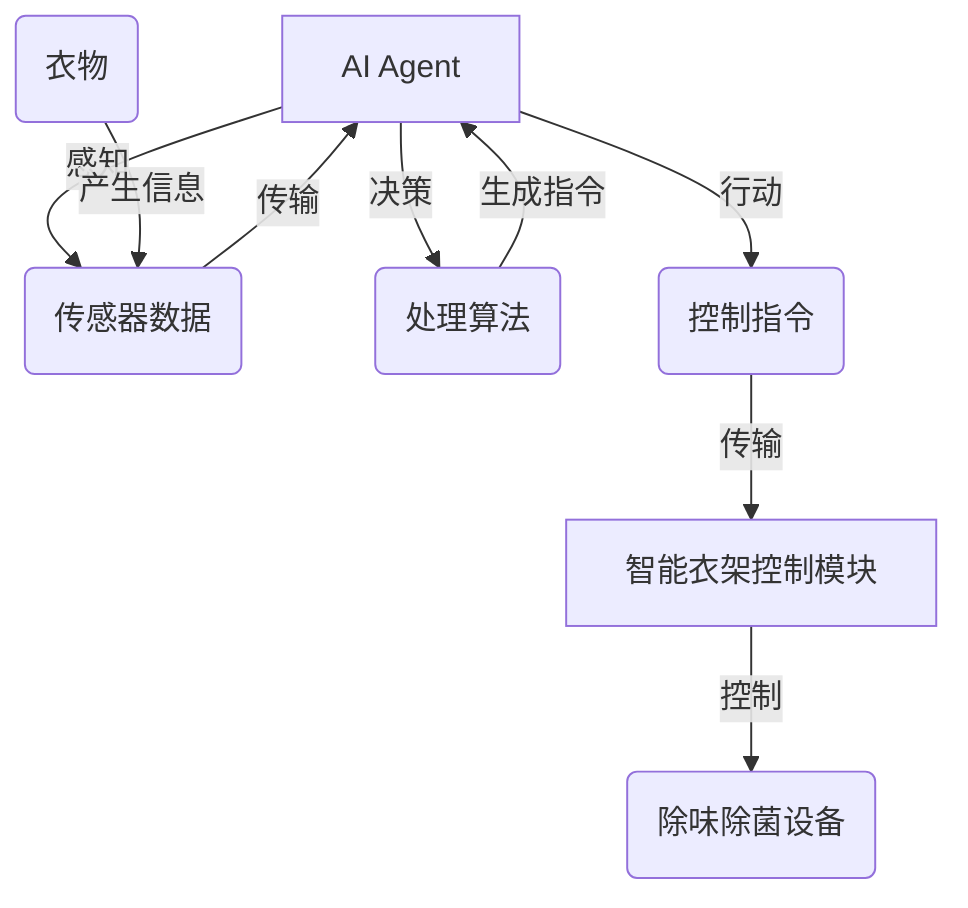

# AI Agent在智能衣架中的衣物除味除菌

> 关键词：AI Agent、智能衣架、衣物除味、衣物除菌、物联网

> 摘要：本文深入探讨了AI Agent在智能衣架衣物除味除菌方面的应用。首先介绍了相关背景，包括研究目的、预期读者等内容。接着阐述了AI Agent、智能衣架等核心概念及其联系，通过文本示意图和Mermaid流程图展示其架构。详细讲解了实现衣物除味除菌的核心算法原理，结合Python代码进行说明，并给出相应的数学模型和公式。在项目实战部分，给出开发环境搭建步骤、源代码实现及解读。还分析了该技术的实际应用场景，推荐了学习资源、开发工具框架以及相关论文著作。最后总结了未来发展趋势与挑战，解答了常见问题，并提供扩展阅读和参考资料。

## 1. 背景介绍 
### 1.1 目的和范围
随着人们生活水平的提高，对衣物的护理需求不再局限于简单的清洗和晾晒。衣物除味除菌成为了日常生活中的重要需求。智能衣架作为智能家居的一部分，结合AI Agent技术可以实现更高效、智能的衣物除味除菌功能。本文旨在研究如何将AI Agent应用于智能衣架的衣物除味除菌过程中，探讨其核心技术原理、实现步骤以及实际应用场景等内容。研究范围涵盖了从理论算法到实际项目开发的各个方面。

### 1.2 预期读者
本文适合对智能家居、人工智能、物联网等领域感兴趣的技术人员，包括程序员、软件架构师、AI开发者等。同时，对于从事智能家居产品研发和设计的工程师，以及对智能衣架相关技术有深入了解需求的研究人员也具有一定的参考价值。

### 1.3 文档结构概述
本文首先介绍了研究的背景信息，包括目的、读者和文档结构。接着阐述了核心概念及其联系，展示了相关的架构示意图和流程图。然后详细讲解了核心算法原理和具体操作步骤，给出了数学模型和公式。通过项目实战部分，展示了如何在实际中实现AI Agent在智能衣架中的衣物除味除菌功能。分析了实际应用场景，并推荐了相关的学习资源、开发工具和论文著作。最后总结了未来发展趋势与挑战，解答常见问题，并提供扩展阅读和参考资料。

### 1.4 术语表
#### 1.4.1 核心术语定义
- **AI Agent**：即人工智能代理，是一种能够感知环境、进行决策并采取行动以实现特定目标的智能实体。在本文中，AI Agent用于感知智能衣架周围的环境信息，如气味、细菌浓度等，并根据这些信息采取相应的除味除菌措施。
- **智能衣架**：是一种具备智能化功能的衣架，它可以通过各种传感器感知衣物的状态和周围环境信息，并结合AI Agent技术实现自动的衣物除味除菌等功能。
- **衣物除味**：指通过物理或化学方法去除衣物上的异味，使衣物恢复清新的过程。
- **衣物除菌**：指采用特定的技术手段杀灭衣物上的细菌、病毒等微生物，保障衣物卫生的过程。

#### 1.4.2 相关概念解释
- **物联网（IoT）**：物联网是指通过各种信息传感器、射频识别技术、全球定位系统、红外感应器、激光扫描器等各种装置与技术，实时采集任何需要监控、 连接、互动的物体或过程，采集其声、光、热、电、力学、化学、生物、位置等各种需要的信息，通过各类可能的网络接入，实现物与物、物与人的泛在连接，实现对物品和过程的智能化感知、识别和管理。智能衣架作为物联网设备的一种，通过与其他设备和网络的连接，实现数据的传输和共享，为AI Agent提供更全面的信息支持。
- **传感器技术**：传感器是一种检测装置，能感受到被测量的信息，并能将感受到的信息，按一定规律变换成为电信号或其他所需形式的信息输出，以满足信息的传输、处理、存储、显示、记录和控制等要求。在智能衣架中，传感器用于感知衣物的湿度、温度、气味、细菌浓度等信息，为AI Agent的决策提供依据。

#### 1.4.3 缩略词列表
- **AI**：Artificial Intelligence，人工智能
- **IoT**：Internet of Things，物联网

## 2. 核心概念与联系 

### 核心概念原理
#### AI Agent原理
AI Agent的核心原理基于感知 - 决策 - 行动的循环。在智能衣架的衣物除味除菌场景中，AI Agent通过传感器感知衣物周围的环境信息，如气味传感器检测异味的种类和浓度，细菌传感器检测细菌的数量和种类等。然后，AI Agent根据预设的规则和算法对这些信息进行分析和处理，做出决策，例如是否需要启动除味除菌功能，以及选择何种除味除菌方式。最后，AI Agent控制智能衣架上的相应设备执行决策，如启动紫外线灯进行除菌，启动负离子发生器进行除味等。

#### 智能衣架原理
智能衣架通常由衣架本体、传感器模块、控制模块和执行模块组成。传感器模块负责感知衣物的状态和周围环境信息，如温度、湿度、气味、细菌浓度等。控制模块接收传感器模块传来的数据，并将其传输给AI Agent进行处理。AI Agent根据处理结果向控制模块发送指令，控制模块再根据指令控制执行模块的动作，如开启或关闭除味除菌设备。

### 架构的文本示意图
```plaintext
+----------------------+
|        AI Agent      |
|----------------------|
| 感知模块 (传感器数据) |
| 决策模块 (算法处理)   |
| 行动模块 (控制指令)   |
+----------------------+
          |
          | 数据交互
          v
+----------------------+
|      智能衣架        |
|----------------------|
| 传感器模块           |
| 控制模块             |
| 执行模块 (除味除菌设备)|
+----------------------+
```

### Mermaid流程图


## 3. 核心算法原理 & 具体操作步骤 

### 核心算法原理
在智能衣架的衣物除味除菌中，核心算法主要包括异味识别算法和细菌检测算法，以及基于这些算法的决策算法。

#### 异味识别算法
异味识别算法可以基于机器学习中的分类算法，如支持向量机（SVM）或神经网络。以神经网络为例，首先需要收集大量不同异味的气味数据作为训练集，对神经网络进行训练。训练过程中，将气味传感器采集到的气味特征向量作为输入，对应的异味类别作为输出，通过不断调整神经网络的权重和偏置，使得神经网络能够准确地识别不同的异味。

#### 细菌检测算法
细菌检测算法可以基于图像识别技术。通过摄像头拍摄衣物表面的图像，然后使用图像处理和机器学习算法对图像中的细菌进行识别和计数。例如，可以使用卷积神经网络（CNN）对细菌图像进行分类和检测，通过训练CNN模型，使其能够准确地识别不同种类的细菌，并计算出细菌的数量。

#### 决策算法
决策算法根据异味识别算法和细菌检测算法的结果，决定是否需要启动除味除菌功能，以及选择何种除味除菌方式。例如，如果检测到衣物上有强烈的异味和大量的细菌，则启动紫外线灯和负离子发生器同时进行除味除菌；如果只有轻微的异味，则只启动负离子发生器进行除味。

### Python源代码实现
```python
import numpy as np
from sklearn.svm import SVC
from tensorflow.keras.models import Sequential
from tensorflow.keras.layers import Conv2D, MaxPooling2D, Flatten, Dense

# 异味识别算法（支持向量机）
def odor_recognition(train_features, train_labels, test_features):
    clf = SVC()
    clf.fit(train_features, train_labels)
    predictions = clf.predict(test_features)
    return predictions

# 细菌检测算法（卷积神经网络）
def bacteria_detection(train_images, train_labels, test_images):
    model = Sequential([
        Conv2D(32, (3, 3), activation='relu', input_shape=(100, 100, 3)),
        MaxPooling2D((2, 2)),
        Conv2D(64, (3, 3), activation='relu'),
        MaxPooling2D((2, 2)),
        Flatten(),
        Dense(64, activation='relu'),
        Dense(10, activation='softmax')
    ])
    model.compile(optimizer='adam',
                  loss='sparse_categorical_crossentropy',
                  metrics=['accuracy'])
    model.fit(train_images, train_labels, epochs=10)
    predictions = model.predict(test_images)
    return predictions

# 决策算法
def decision_making(odor_prediction, bacteria_prediction):
    if odor_prediction == 'strong_odor' and np.sum(bacteria_prediction) > 100:
        return 'uv_and_ionizer'
    elif odor_prediction == 'mild_odor':
        return 'ionizer'
    else:
        return 'none'

# 示例数据
train_odor_features = np.random.rand(100, 10)
train_odor_labels = np.random.choice(['strong_odor', 'mild_odor', 'no_odor'], 100)
test_odor_features = np.random.rand(10, 10)

train_bacteria_images = np.random.rand(100, 100, 100, 3)
train_bacteria_labels = np.random.randint(0, 10, 100)
test_bacteria_images = np.random.rand(10, 100, 100, 3)

# 运行算法
odor_predictions = odor_recognition(train_odor_features, train_odor_labels, test_odor_features)
bacteria_predictions = bacteria_detection(train_bacteria_images, train_bacteria_labels, test_bacteria_images)
decision = decision_making(odor_predictions[0], bacteria_predictions[0])

print("异味预测结果:", odor_predictions[0])
print("细菌检测结果:", bacteria_predictions[0])
print("决策结果:", decision)
```

### 具体操作步骤
1. **数据收集**：收集不同异味的气味数据和衣物表面细菌的图像数据，作为训练集。
2. **模型训练**：使用收集到的训练集对异味识别模型和细菌检测模型进行训练。
3. **传感器数据采集**：通过气味传感器和摄像头等传感器采集衣物周围的环境信息。
4. **数据处理**：将传感器采集到的数据转换为模型可以处理的格式。
5. **模型预测**：使用训练好的模型对采集到的数据进行预测，得到异味类别和细菌数量。
6. **决策制定**：根据预测结果，使用决策算法制定相应的除味除菌策略。
7. **设备控制**：根据决策结果，控制智能衣架上的除味除菌设备执行相应的操作。

## 4. 数学模型和公式 & 详细讲解 & 举例说明 

### 异味识别算法的数学模型
在支持向量机（SVM）异味识别算法中，其数学模型基于最大间隔分类的思想。给定一个训练数据集 $D = \{(x_1, y_1), (x_2, y_2), \cdots, (x_n, y_n)\}$，其中 $x_i \in \mathbb{R}^d$ 是气味特征向量，$y_i \in \{-1, +1\}$ 是异味类别标签。SVM的目标是找到一个超平面 $w^T x + b = 0$，使得不同类别的样本之间的间隔最大。

间隔的定义为：
$$
\gamma = \frac{2}{\|w\|}
$$

SVM的优化问题可以表示为：
$$
\begin{aligned}
\min_{w, b} &\quad \frac{1}{2} \|w\|^2 \\
\text{s.t.} &\quad y_i (w^T x_i + b) \geq 1, \quad i = 1, 2, \cdots, n
\end{aligned}
$$

通过引入拉格朗日乘子 $\alpha_i \geq 0$，可以将上述优化问题转化为对偶问题：
$$
\begin{aligned}
\max_{\alpha} &\quad \sum_{i=1}^{n} \alpha_i - \frac{1}{2} \sum_{i=1}^{n} \sum_{j=1}^{n} \alpha_i \alpha_j y_i y_j x_i^T x_j \\
\text{s.t.} &\quad \sum_{i=1}^{n} \alpha_i y_i = 0 \\
&\quad \alpha_i \geq 0, \quad i = 1, 2, \cdots, n
\end{aligned}
$$

求解对偶问题得到拉格朗日乘子 $\alpha_i$，然后可以计算出 $w$ 和 $b$：
$$
w = \sum_{i=1}^{n} \alpha_i y_i x_i
$$
$$
b = y_j - w^T x_j, \quad \text{其中} \ \alpha_j > 0
$$

对于新的气味特征向量 $x$，其分类结果可以通过以下公式判断：
$$
f(x) = \text{sign}(w^T x + b)
$$

### 细菌检测算法的数学模型
在卷积神经网络（CNN）细菌检测算法中，CNN的核心是卷积层、池化层和全连接层。

#### 卷积层
卷积层通过卷积操作提取图像的特征。设输入图像为 $X \in \mathbb{R}^{H \times W \times C}$，卷积核为 $K \in \mathbb{R}^{h \times w \times C \times F}$，其中 $H$ 和 $W$ 是图像的高度和宽度，$C$ 是图像的通道数，$h$ 和 $w$ 是卷积核的高度和宽度，$F$ 是卷积核的数量。卷积操作的输出 $Y \in \mathbb{R}^{H' \times W' \times F}$ 可以通过以下公式计算：
$$
Y_{i, j, k} = \sum_{m=0}^{h-1} \sum_{n=0}^{w-1} \sum_{c=0}^{C-1} K_{m, n, c, k} X_{i+m, j+n, c} + b_k
$$
其中 $b_k$ 是偏置项。

#### 池化层
池化层用于降低特征图的维度，减少计算量。常见的池化操作有最大池化和平均池化。以最大池化为例，设输入特征图为 $X \in \mathbb{R}^{H \times W \times C}$，池化窗口大小为 $p \times p$，步长为 $s$。池化操作的输出 $Y \in \mathbb{R}^{H' \times W' \times C}$ 可以通过以下公式计算：
$$
Y_{i, j, k} = \max_{m=0}^{p-1} \max_{n=0}^{p-1} X_{i \cdot s + m, j \cdot s + n, k}
$$

#### 全连接层
全连接层将卷积层和池化层提取的特征进行整合，用于分类。设输入特征向量为 $x \in \mathbb{R}^d$，全连接层的权重矩阵为 $W \in \mathbb{R}^{d' \times d}$，偏置向量为 $b \in \mathbb{R}^{d'}$，则全连接层的输出 $y \in \mathbb{R}^{d'}$ 可以通过以下公式计算：
$$
y = Wx + b
$$

### 举例说明
假设我们有一个简单的气味数据集，包含两个特征（如气味强度和气味类型），以及两个异味类别（强异味和弱异味）。训练数据集如下：
| 气味强度 | 气味类型 | 异味类别 |
|----------|----------|----------|
| 0.8      | 0.2      | 强异味   |
| 0.3      | 0.7      | 弱异味   |
| 0.6      | 0.4      | 强异味   |
| 0.2      | 0.8      | 弱异味   |

将其转换为特征向量和标签：
$$
X = \begin{bmatrix}
0.8 & 0.2 \\
0.3 & 0.7 \\
0.6 & 0.4 \\
0.2 & 0.8
\end{bmatrix}, \quad
y = \begin{bmatrix}
1 \\
-1 \\
1 \\
-1
\end{bmatrix}
$$

使用SVM对该数据集进行训练，求解对偶问题得到拉格朗日乘子 $\alpha$，进而计算出 $w$ 和 $b$。对于新的气味特征向量 $x = [0.7, 0.3]$，可以通过 $f(x) = \text{sign}(w^T x + b)$ 判断其异味类别。

对于细菌检测，假设我们有一个 $100 \times 100$ 像素的细菌图像，使用CNN进行训练和预测。在卷积层中，使用 $3 \times 3$ 的卷积核进行卷积操作，提取图像的特征。在池化层中，使用 $2 \times 2$ 的最大池化窗口进行降维。最后通过全连接层将特征向量映射到不同的细菌类别上。

## 5. 项目实战：代码实际案例和详细解释说明 

### 5.1  开发环境搭建
#### 硬件环境
- **智能衣架**：选择一款具备传感器接口和控制接口的智能衣架，如带有气味传感器、细菌传感器、紫外线灯、负离子发生器等设备的智能衣架。
- **开发板**：可以选择树莓派（Raspberry Pi）作为开发板，它具有丰富的接口和强大的计算能力，适合用于智能衣架的控制和数据处理。
- **传感器**：购买气味传感器（如MQ系列传感器）和细菌传感器（如基于光学原理的细菌传感器），并将其连接到开发板上。

#### 软件环境
- **操作系统**：在树莓派上安装Raspbian操作系统，它是基于Debian的开源操作系统，对树莓派有很好的支持。
- **开发语言**：使用Python作为开发语言，Python具有丰富的库和工具，适合用于机器学习和物联网开发。
- **机器学习库**：安装TensorFlow、Scikit-learn等机器学习库，用于实现异味识别和细菌检测算法。
- **物联网通信协议**：使用MQTT（Message Queuing Telemetry Transport）作为物联网通信协议，实现智能衣架与云平台之间的数据传输。

### 5.2  源代码详细实现和代码解读
```python
import time
import paho.mqtt.client as mqtt
from sklearn.svm import SVC
from tensorflow.keras.models import load_model
import numpy as np

# MQTT配置
MQTT_BROKER = "localhost"
MQTT_PORT = 1883
MQTT_TOPIC_ODOR = "smart_hanger/odor"
MQTT_TOPIC_BACTERIA = "smart_hanger/bacteria"
MQTT_TOPIC_CONTROL = "smart_hanger/control"

# 异味识别模型加载
odor_model = SVC()
# 这里需要实际训练好的模型参数加载代码
# odor_model.fit(train_features, train_labels)

# 细菌检测模型加载
bacteria_model = load_model('bacteria_model.h5')

# MQTT回调函数
def on_connect(client, userdata, flags, rc):
    print("Connected with result code " + str(rc))
    client.subscribe([(MQTT_TOPIC_ODOR, 0), (MQTT_TOPIC_BACTERIA, 0)])

def on_message(client, userdata, msg):
    if msg.topic == MQTT_TOPIC_ODOR:
        odor_data = np.fromstring(msg.payload.decode(), sep=',')
        odor_prediction = odor_model.predict([odor_data])[0]
    elif msg.topic == MQTT_TOPIC_BACTERIA:
        bacteria_image = np.fromstring(msg.payload.decode(), sep=',')
        bacteria_image = bacteria_image.reshape((1, 100, 100, 3))
        bacteria_prediction = bacteria_model.predict(bacteria_image)[0]
    # 决策算法
    if odor_prediction == 'strong_odor' and np.sum(bacteria_prediction) > 100:
        control_command = 'uv_and_ionizer'
    elif odor_prediction == 'mild_odor':
        control_command = 'ionizer'
    else:
        control_command = 'none'
    client.publish(MQTT_TOPIC_CONTROL, control_command)

# 创建MQTT客户端
client = mqtt.Client()
client.on_connect = on_connect
client.on_message = on_message

# 连接到MQTT代理
client.connect(MQTT_BROKER, MQTT_PORT, 60)

# 开始循环处理网络流量
client.loop_forever()
```

### 代码解读与分析
1. **MQTT配置**：设置MQTT代理的地址、端口和订阅的主题。`MQTT_TOPIC_ODOR` 用于接收异味传感器的数据，`MQTT_TOPIC_BACTERIA` 用于接收细菌传感器的数据，`MQTT_TOPIC_CONTROL` 用于发送控制指令。
2. **模型加载**：加载异味识别模型和细菌检测模型。这里的模型需要在实际项目中进行训练和保存。
3. **MQTT回调函数**：
    - `on_connect`：在连接到MQTT代理时调用，订阅异味和细菌数据的主题。
    - `on_message`：在接收到MQTT消息时调用。根据消息的主题，分别对异味数据和细菌数据进行处理，使用加载的模型进行预测。然后根据预测结果，使用决策算法生成控制指令，并通过MQTT发布到控制主题。
4. **MQTT客户端**：创建MQTT客户端，设置回调函数，连接到MQTT代理，并开始循环处理网络流量。

## 6. 实际应用场景 
### 家庭场景
在家庭中，智能衣架可以放置在卧室、衣帽间等地方。当衣物长时间放置在衣柜中产生异味，或者在潮湿的天气中衣物容易滋生细菌时，智能衣架可以自动检测到异味和细菌，并启动除味除菌功能。例如，在梅雨季节，衣物容易受潮发霉，智能衣架可以及时去除衣物上的霉味和杀灭霉菌，保持衣物的干爽和卫生。

### 酒店场景
酒店每天需要处理大量客人的衣物，智能衣架可以安装在酒店客房中。当客人入住时，智能衣架可以对客人挂放的衣物进行除味除菌处理，为客人提供更加舒适和卫生的住宿体验。同时，酒店管理人员可以通过云平台远程监控智能衣架的工作状态和数据，及时进行维护和管理。

### 洗衣店场景
洗衣店在清洗和烘干衣物后，可能会残留一些异味或细菌。智能衣架可以安装在洗衣店的晾衣区，对清洗后的衣物进行二次除味除菌处理，提高衣物的清洁度和质量。洗衣店老板可以根据智能衣架提供的数据，优化洗衣流程和工艺，提高客户满意度。

## 7. 工具和资源推荐
### 7.1 学习资源推荐
#### 7.1.1 书籍推荐
- 《机器学习》（周志华著）：这本书系统地介绍了机器学习的基本概念、算法和应用，是学习机器学习的经典教材。
- 《深度学习》（Ian Goodfellow、Yoshua Bengio和Aaron Courville著）：该书深入讲解了深度学习的原理和方法，适合有一定机器学习基础的读者进一步学习。
- 《Python数据分析实战》（Sebastian Raschka著）：介绍了如何使用Python进行数据分析和处理，包括数据清洗、可视化、机器学习等内容，对智能衣架项目中的数据处理有很大帮助。

#### 7.1.2 在线课程
- Coursera上的“机器学习”课程（Andrew Ng教授主讲）：该课程是机器学习领域的经典在线课程，通过视频讲解、编程作业和测验等方式，帮助学习者掌握机器学习的基本概念和算法。
- edX上的“深度学习微硕士项目”：提供了深度学习的全面课程，包括神经网络、卷积神经网络、循环神经网络等内容，适合深入学习深度学习的读者。
- 阿里云大学的“物联网开发实战”课程：介绍了物联网的基本概念、技术和应用，以及如何使用阿里云平台进行物联网项目开发，对智能衣架项目的开发有一定的指导作用。

#### 7.1.3 技术博客和网站
- Medium：上面有很多关于人工智能、物联网等领域的技术文章和案例分享，读者可以从中获取最新的技术动态和实践经验。
- 博客园：国内知名的技术博客网站，有很多开发者分享的技术文章和项目经验，对智能衣架项目的开发有一定的参考价值。
- 开源中国：提供了大量的开源项目和技术资源，读者可以在上面找到与智能衣架相关的开源代码和工具。

### 7.2 开发工具框架推荐
#### 7.2.1 IDE和编辑器
- PyCharm：是一款专门为Python开发设计的集成开发环境（IDE），具有代码编辑、调试、自动补全、代码分析等功能，适合开发智能衣架项目的Python代码。
- Visual Studio Code：是一款轻量级的代码编辑器，支持多种编程语言和插件扩展，具有丰富的代码编辑和调试功能，也可以用于智能衣架项目的开发。

#### 7.2.2 调试和性能分析工具
- TensorBoard：是TensorFlow提供的可视化工具，可以用于查看深度学习模型的训练过程、损失函数曲线、模型结构等信息，帮助开发者调试和优化模型。
- cProfile：是Python标准库中的性能分析工具，可以用于分析Python代码的运行时间和函数调用情况，帮助开发者找出代码中的性能瓶颈。

#### 7.2.3 相关框架和库
- TensorFlow：是一个开源的机器学习框架，提供了丰富的深度学习模型和工具，适合实现智能衣架项目中的异味识别和细菌检测算法。
- Scikit-learn：是一个简单易用的机器学习库，提供了各种机器学习算法和工具，如分类、回归、聚类等，适合实现智能衣架项目中的异味识别算法。
- Paho MQTT：是一个开源的MQTT客户端库，支持多种编程语言，适合实现智能衣架项目中的物联网通信功能。

### 7.3 相关论文著作推荐
#### 7.3.1 经典论文
- “Support-Vector Networks”（Cortes和Vapnik著）：该论文首次提出了支持向量机（SVM）的概念和算法，是机器学习领域的经典论文之一。
- “ImageNet Classification with Deep Convolutional Neural Networks”（Krizhevsky、Sutskever和Hinton著）：该论文介绍了AlexNet卷积神经网络，开启了深度学习在图像识别领域的热潮。

#### 7.3.2 最新研究成果
- 在IEEE Xplore、ACM Digital Library等学术数据库中，可以搜索到关于人工智能、物联网、智能家居等领域的最新研究成果。例如，关于智能传感器技术、智能决策算法等方面的研究论文，对智能衣架项目的开发有一定的参考价值。

#### 7.3.3 应用案例分析
- 可以参考一些智能家居产品的应用案例分析报告，了解其他智能产品在实际应用中的设计思路、技术实现和市场反馈等信息。例如，小米智能家居产品的应用案例分析，对智能衣架项目的市场定位和产品设计有一定的启发作用。

## 8. 总结：未来发展趋势与挑战
### 未来发展趋势
#### 智能化程度不断提高
随着人工智能技术的不断发展，AI Agent在智能衣架中的应用将更加智能化。智能衣架将能够更加准确地感知衣物的状态和周围环境信息，自动调整除味除菌策略，实现个性化的衣物护理。例如，根据不同的衣物材质和颜色，选择合适的除味除菌方式，避免对衣物造成损伤。

#### 与其他智能家居设备的融合
智能衣架将与其他智能家居设备进行更加紧密的融合，形成一个智能化的家居生态系统。例如，与智能空调、智能除湿机等设备联动，根据室内的温度、湿度等环境信息，协同工作，为衣物提供更加适宜的存储环境。同时，用户可以通过智能家居控制中心，统一管理和控制智能衣架以及其他智能家居设备。

#### 云服务和大数据分析的应用
智能衣架将通过云服务实现数据的存储和共享，利用大数据分析技术对大量的衣物护理数据进行挖掘和分析。例如，分析不同地区、不同季节的衣物异味和细菌情况，为用户提供更加科学的衣物护理建议。同时，云服务还可以实现远程监控和控制功能，用户可以通过手机APP随时随地监控智能衣架的工作状态和控制其运行。

### 挑战
#### 传感器精度和可靠性
智能衣架的除味除菌效果依赖于传感器的精度和可靠性。目前，气味传感器和细菌传感器的精度还存在一定的局限性，可能会导致异味识别和细菌检测的不准确。此外，传感器在长期使用过程中可能会出现漂移和故障，影响智能衣架的正常工作。因此，提高传感器的精度和可靠性是智能衣架发展面临的一个重要挑战。

#### 算法复杂度和计算资源需求
随着智能衣架的智能化程度不断提高，所使用的算法复杂度也会相应增加。例如，深度学习算法需要大量的计算资源来进行模型训练和推理。在智能衣架这样的嵌入式设备中，计算资源相对有限，如何在有限的计算资源下实现高效的算法是一个需要解决的问题。

#### 数据安全和隐私保护
智能衣架在运行过程中会收集大量的用户数据，如衣物的状态信息、用户的使用习惯等。这些数据涉及用户的隐私和安全问题。如何保障数据的安全和隐私，防止数据泄露和滥用，是智能衣架发展需要面对的重要挑战。

## 9. 附录：常见问题与解答
### 问题1：智能衣架的除味除菌效果如何保证？
解答：智能衣架的除味除菌效果主要通过以下几个方面来保证：一是高精度的传感器，能够准确地检测衣物的异味和细菌情况；二是先进的除味除菌技术，如紫外线杀菌、负离子除味等；三是智能的决策算法，能够根据检测结果自动调整除味除菌策略。此外，定期对智能衣架进行维护和保养，也可以保证其除味除菌效果。

### 问题2：智能衣架的能耗高吗？
解答：智能衣架的能耗主要取决于其除味除菌设备的功率和使用时间。一般来说，智能衣架采用的紫外线灯和负离子发生器等设备的功率相对较低，而且只有在检测到需要除味除菌时才会启动，因此能耗不会很高。同时，一些智能衣架还采用了节能设计，如自动调节设备功率、定时开关等功能，进一步降低了能耗。

### 问题3：智能衣架可以与手机APP连接吗？
解答：大多数智能衣架都支持与手机APP连接。通过手机APP，用户可以远程监控智能衣架的工作状态，如异味和细菌检测结果、除味除菌设备的运行状态等。同时，用户还可以通过手机APP控制智能衣架的启动和停止，设置除味除菌模式和时间等参数。

### 问题4：智能衣架的安装复杂吗？
解答：智能衣架的安装一般不复杂。大多数智能衣架采用了简单的安装方式，如悬挂式、壁挂式等，用户可以根据自己的需求和家居环境进行选择。在安装过程中，只需要将智能衣架固定在合适的位置，并连接好电源和传感器等设备即可。如果用户在安装过程中遇到问题，可以参考产品说明书或联系厂家的客服人员进行指导。

## 10. 扩展阅读 & 参考资料
### 扩展阅读
- 《智能家居：原理、设计与应用》：该书全面介绍了智能家居的原理、技术和应用，对智能衣架项目的开发和设计有一定的参考价值。
- 《物联网技术与应用》：介绍了物联网的基本概念、技术和应用，包括传感器技术、通信技术、云计算等方面的内容，有助于读者深入了解智能衣架的物联网技术基础。

### 参考资料
- 智能衣架产品说明书和技术文档。
- 相关的学术论文和研究报告，如在IEEE Xplore、ACM Digital Library等学术数据库中搜索到的关于人工智能、物联网、智能家居等领域的论文。
- 开源项目和代码库，如GitHub上与智能衣架、物联网、机器学习等相关的开源项目。

作者：AI天才研究院/AI Genius Institute & 禅与计算机程序设计艺术 /Zen And The Art of Computer Programming