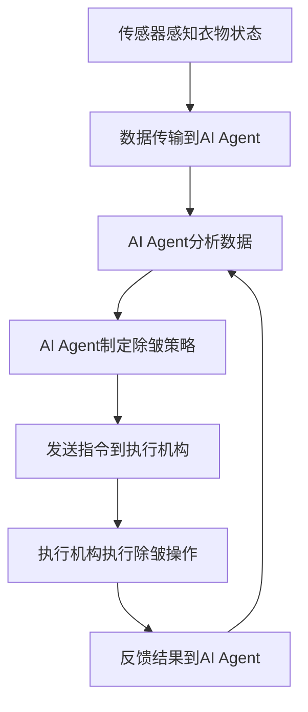

# AI Agent在智能衣架中的除皱功能

> 关键词：AI Agent、智能衣架、除皱功能、传感器技术、机器学习

> 摘要：本文聚焦于AI Agent在智能衣架除皱功能中的应用。详细介绍了AI Agent和智能衣架的相关概念，深入剖析了实现除皱功能的核心算法原理、数学模型。通过项目实战展示了代码实现和具体操作，探讨了其实际应用场景，推荐了相关的学习资源、开发工具和论文著作。最后对未来发展趋势与挑战进行了总结，并提供了常见问题解答和扩展阅读资料，旨在全面阐述AI Agent为智能衣架除皱功能带来的创新与变革。

## 1. 背景介绍 
### 1.1 目的和范围
本文章的目的在于深入探讨AI Agent在智能衣架除皱功能方面的应用。我们将详细分析AI Agent如何在智能衣架中发挥作用以实现高效、智能的除皱效果。范围涵盖了从核心概念的阐述，到算法原理的剖析，再到实际项目的开发和应用场景的讨论，以及相关学习资源和工具的推荐等多个方面。

### 1.2 预期读者
预期读者包括对人工智能、智能家居领域感兴趣的技术爱好者，从事相关领域研究的科研人员，以及希望了解智能衣架技术发展的行业从业者。同时，对于想要开发智能衣架相关产品的程序员和软件架构师也具有一定的参考价值。

### 1.3 文档结构概述
本文将按照以下结构展开：首先介绍背景信息，包括目的、预期读者和文档结构。接着阐述核心概念，展示相关原理和架构的示意图与流程图。然后详细讲解核心算法原理和具体操作步骤，并给出相应的Python代码。之后介绍数学模型和公式，并举例说明。通过项目实战展示代码的实际应用和详细解释。探讨实际应用场景，推荐相关的工具和资源。最后总结未来发展趋势与挑战，提供常见问题解答和扩展阅读资料。

### 1.4 术语表
#### 1.4.1 核心术语定义
- **AI Agent（人工智能代理）**：是一种能够感知环境、进行推理和决策，并采取行动以实现特定目标的智能实体。在智能衣架中，AI Agent可以根据感知到的衣物状态信息，决定采取何种除皱策略。
- **智能衣架**：集成了各种传感器和智能控制技术的衣架，能够自动完成对衣物的处理，如除皱、烘干等功能。
- **除皱功能**：指通过特定的技术手段，消除衣物上的褶皱，使衣物恢复平整的功能。

#### 1.4.2 相关概念解释
- **传感器技术**：智能衣架通过各种传感器（如压力传感器、湿度传感器等）来感知衣物的状态，如衣物的材质、湿度、褶皱程度等信息。这些信息将作为AI Agent决策的依据。
- **机器学习**：AI Agent可以利用机器学习算法对大量的衣物处理数据进行学习，从而不断优化除皱策略，提高除皱效果。

#### 1.4.3 缩略词列表
- **AI**：Artificial Intelligence（人工智能）
- **ML**：Machine Learning（机器学习）

## 2. 核心概念与联系 
### 核心概念原理
AI Agent在智能衣架中的除皱功能主要基于传感器技术、机器学习和智能控制技术。智能衣架上安装有多种传感器，用于实时感知衣物的状态信息，如衣物的材质、湿度、褶皱程度等。AI Agent接收这些传感器的数据，并通过机器学习算法进行分析和处理。根据分析结果，AI Agent制定出相应的除皱策略，并控制智能衣架上的执行机构（如加热装置、振动装置等）对衣物进行处理，以达到除皱的目的。

### 架构的文本示意图
```plaintext
+-----------------+       +-----------------+       +-----------------+
| 传感器模块      | ----> | AI Agent        | ----> | 执行机构模块    |
| (压力、湿度等)  |       | (机器学习算法) |       | (加热、振动等) |
+-----------------+       +-----------------+       +-----------------+
```

### Mermaid流程图


## 3. 核心算法原理 & 具体操作步骤 
### 核心算法原理
AI Agent在智能衣架中实现除皱功能主要使用了机器学习中的分类和回归算法。分类算法用于判断衣物的材质，因为不同材质的衣物需要采用不同的除皱策略。回归算法用于预测衣物的褶皱程度，以便确定除皱的强度和时间。

以下是一个简单的Python代码示例，使用决策树分类算法来判断衣物的材质：
```python
from sklearn.tree import DecisionTreeClassifier
import numpy as np

# 假设我们有一些训练数据，特征包括衣物的重量、厚度等
X_train = np.array([[100, 2], [200, 3], [150, 2], [300, 4]])
# 对应的衣物材质标签，0表示棉质，1表示麻质
y_train = np.array([0, 1, 0, 1])

# 创建决策树分类器
clf = DecisionTreeClassifier()
# 训练模型
clf.fit(X_train, y_train)

# 假设有一个新的衣物样本，需要判断其材质
new_sample = np.array([[180, 3]])
# 进行预测
prediction = clf.predict(new_sample)
print("预测的衣物材质标签：", prediction)
```

### 具体操作步骤
1. **数据采集**：智能衣架上的传感器实时采集衣物的状态信息，如压力、湿度、温度等，并将这些数据传输到AI Agent。
2. **数据预处理**：AI Agent对采集到的数据进行预处理，包括数据清洗、特征提取等操作，以便后续的机器学习算法能够更好地处理数据。
3. **模型训练**：使用预处理后的数据对机器学习模型进行训练，得到能够准确判断衣物材质和预测褶皱程度的模型。
4. **决策制定**：AI Agent根据训练好的模型对当前衣物的状态进行分析，制定出相应的除皱策略。
5. **执行操作**：AI Agent将除皱策略转化为具体的指令，发送给智能衣架上的执行机构，执行机构根据指令对衣物进行除皱操作。
6. **反馈调整**：执行机构将除皱操作的结果反馈给AI Agent，AI Agent根据反馈结果对模型进行调整和优化，以提高后续的除皱效果。

## 4. 数学模型和公式 & 详细讲解 & 举例说明 
### 数学模型
在判断衣物材质的分类问题中，我们可以使用决策树模型。决策树是一种基于树结构进行决策的模型，每个内部节点表示一个特征上的测试，每个分支表示一个测试输出，每个叶节点表示一个类别。

在预测衣物褶皱程度的回归问题中，我们可以使用线性回归模型。线性回归模型的基本形式为：
$$y = \theta_0 + \theta_1x_1 + \theta_2x_2 + \cdots + \theta_nx_n$$
其中，$y$ 是预测的褶皱程度，$x_1, x_2, \cdots, x_n$ 是输入的特征（如压力、湿度等），$\theta_0, \theta_1, \cdots, \theta_n$ 是模型的参数。

### 详细讲解
决策树模型通过对训练数据的学习，构建出一棵决策树。在预测时，将新的样本从根节点开始，根据每个内部节点的测试条件进行判断，沿着相应的分支向下走，直到到达叶节点，叶节点对应的类别就是预测的结果。

线性回归模型的目标是找到一组最优的参数 $\theta_0, \theta_1, \cdots, \theta_n$，使得预测值 $y$ 与真实值之间的误差最小。通常使用最小二乘法来求解这些参数，即最小化以下误差函数：
$$J(\theta) = \frac{1}{2m}\sum_{i=1}^{m}(h_{\theta}(x^{(i)}) - y^{(i)})^2$$
其中，$m$ 是训练样本的数量，$h_{\theta}(x^{(i)})$ 是第 $i$ 个样本的预测值，$y^{(i)}$ 是第 $i$ 个样本的真实值。

### 举例说明
假设我们有一个简单的线性回归问题，只有一个特征 $x$，预测的目标是衣物的褶皱程度 $y$。我们有以下训练数据：
| $x$ | $y$ |
| --- | --- |
| 1 | 2 |
| 2 | 4 |
| 3 | 6 |

我们可以使用最小二乘法来求解线性回归模型的参数 $\theta_0$ 和 $\theta_1$。首先，我们可以列出误差函数：
$$J(\theta_0, \theta_1) = \frac{1}{2\times3}\sum_{i=1}^{3}(\theta_0 + \theta_1x^{(i)} - y^{(i)})^2$$
然后，对 $\theta_0$ 和 $\theta_1$ 分别求偏导数，并令偏导数等于 0，解方程组得到最优的参数值。在这个例子中，我们可以很容易地得到 $\theta_0 = 0$，$\theta_1 = 2$，即线性回归模型为 $y = 2x$。

## 5. 项目实战：代码实际案例和详细解释说明 
### 5.1  开发环境搭建
- **硬件环境**：需要一个智能衣架原型，上面安装有压力传感器、湿度传感器、加热装置和振动装置等。同时，需要一个开发板（如树莓派）来运行AI Agent的代码。
- **软件环境**：安装Python开发环境，推荐使用Python 3.7及以上版本。安装必要的Python库，如 `scikit-learn`、`numpy` 等。可以使用以下命令进行安装：
```sh
pip install scikit-learn numpy
```

### 5.2  源代码详细实现和代码解读
以下是一个完整的Python代码示例，实现了AI Agent在智能衣架中除皱功能的基本逻辑：
```python
import numpy as np
from sklearn.tree import DecisionTreeClassifier
from sklearn.linear_model import LinearRegression

# 模拟传感器数据采集
def collect_sensor_data():
    # 这里简单返回一些随机数据，实际应用中需要从传感器读取真实数据
    weight = np.random.randint(100, 300)
    thickness = np.random.randint(2, 5)
    pressure = np.random.randint(1, 10)
    humidity = np.random.randint(10, 90)
    return np.array([weight, thickness, pressure, humidity])

# 训练衣物材质分类模型
def train_material_classifier():
    X_train = np.array([[100, 2], [200, 3], [150, 2], [300, 4]])
    y_train = np.array([0, 1, 0, 1])
    clf = DecisionTreeClassifier()
    clf.fit(X_train[:, :2], y_train)
    return clf

# 训练衣物褶皱程度回归模型
def train_wrinkle_regressor():
    X_train = np.array([[1, 10], [2, 20], [3, 30], [4, 40]])
    y_train = np.array([2, 4, 6, 8])
    reg = LinearRegression()
    reg.fit(X_train, y_train)
    return reg

# 制定除皱策略
def make_wrinkle_strategy(material, wrinkle_level):
    if material == 0:  # 棉质衣物
        if wrinkle_level < 3:
            return "轻度加热，轻微振动"
        elif wrinkle_level < 6:
            return "中度加热，中度振动"
        else:
            return "重度加热，强烈振动"
    else:  # 麻质衣物
        if wrinkle_level < 3:
            return "轻度加热，不振动"
        elif wrinkle_level < 6:
            return "中度加热，轻微振动"
        else:
            return "重度加热，中度振动"

# 主函数
def main():
    # 训练模型
    material_clf = train_material_classifier()
    wrinkle_reg = train_wrinkle_regressor()

    # 采集传感器数据
    sensor_data = collect_sensor_data()

    # 判断衣物材质
    material_prediction = material_clf.predict([sensor_data[:2]])[0]

    # 预测衣物褶皱程度
    wrinkle_prediction = wrinkle_reg.predict([sensor_data[2:]])[0]

    # 制定除皱策略
    strategy = make_wrinkle_strategy(material_prediction, wrinkle_prediction)

    print("衣物材质预测结果：", "棉质" if material_prediction == 0 else "麻质")
    print("衣物褶皱程度预测结果：", wrinkle_prediction)
    print("除皱策略：", strategy)

if __name__ == "__main__":
    main()
```
### 代码解读与分析
- **collect_sensor_data 函数**：模拟传感器数据的采集，实际应用中需要将其替换为从传感器读取真实数据的代码。
- **train_material_classifier 函数**：使用决策树分类算法训练衣物材质分类模型。
- **train_wrinkle_regressor 函数**：使用线性回归算法训练衣物褶皱程度回归模型。
- **make_wrinkle_strategy 函数**：根据衣物材质和褶皱程度制定相应的除皱策略。
- **main 函数**：主函数，调用上述函数完成数据采集、模型预测和策略制定的整个流程，并输出结果。

## 6. 实际应用场景 
### 家庭场景
在家庭中，智能衣架的除皱功能可以帮助人们快速、方便地处理衣物上的褶皱。例如，当人们早上起床后发现衣服有褶皱时，只需将衣服挂在智能衣架上，AI Agent就会自动感知衣物的状态，并采取相应的除皱措施，节省了人们熨烫衣服的时间和精力。

### 酒店场景
酒店每天需要处理大量客人的衣物，智能衣架的除皱功能可以提高酒店的服务效率和质量。客人将有褶皱的衣服交给酒店后，酒店工作人员可以将衣服挂在智能衣架上，智能衣架可以快速、高效地完成除皱工作，为客人提供更好的服务体验。

### 服装店场景
在服装店中，智能衣架的除皱功能可以保持衣服的整洁和平整，提高商品的展示效果。店员可以将新到的衣服挂在智能衣架上，智能衣架会自动去除衣服上的褶皱，使衣服看起来更加美观，吸引顾客的购买欲望。

## 7. 工具和资源推荐
### 7.1 学习资源推荐
#### 7.1.1 书籍推荐
- 《Python机器学习》：介绍了Python在机器学习领域的应用，包括各种机器学习算法的原理和实现。
- 《人工智能：一种现代的方法》：全面介绍了人工智能的基本概念、算法和应用，是人工智能领域的经典教材。

#### 7.1.2 在线课程
- Coursera上的“机器学习”课程：由斯坦福大学的Andrew Ng教授授课，是机器学习领域的经典课程。
- edX上的“人工智能基础”课程：介绍了人工智能的基本概念、算法和应用，适合初学者学习。

#### 7.1.3 技术博客和网站
- 博客园：有很多人工智能和机器学习领域的技术博客，提供了丰富的学习资源和实践经验。
- Medium：一个技术博客平台，有很多关于人工智能和智能家居的文章。

### 7.2 开发工具框架推荐
#### 7.2.1 IDE和编辑器
- PyCharm：一款专业的Python集成开发环境，提供了丰富的代码编辑、调试和项目管理功能。
- Visual Studio Code：一款轻量级的代码编辑器，支持多种编程语言，有丰富的插件扩展功能。

#### 7.2.2 调试和性能分析工具
- PySnooper：一个简单易用的Python调试工具，可以记录函数的执行过程和变量的值。
- cProfile：Python标准库中的性能分析工具，可以分析代码的运行时间和函数调用次数。

#### 7.2.3 相关框架和库
- scikit-learn：一个简单易用的机器学习库，提供了各种机器学习算法的实现。
- TensorFlow：一个开源的深度学习框架，广泛应用于人工智能领域。

### 7.3 相关论文著作推荐
#### 7.3.1 经典论文
- “A Logical Calculus of the Ideas Immanent in Nervous Activity”：由Warren S. McCulloch和Walter Pitts发表，是神经网络领域的经典论文。
- “Learning Representations by Back-propagating Errors”：由David E. Rumelhart、Geoffrey E. Hinton和Ronald J. Williams发表，介绍了反向传播算法，是深度学习领域的重要论文。

#### 7.3.2 最新研究成果
- 可以关注顶级学术会议（如NeurIPS、ICML等）上的最新研究成果，了解人工智能和智能家居领域的前沿技术。

#### 7.3.3 应用案例分析
- 可以参考一些实际的智能家居产品的研发报告和应用案例，了解AI Agent在实际应用中的具体实现和效果。

## 8. 总结：未来发展趋势与挑战
### 未来发展趋势
- **智能化程度不断提高**：随着人工智能技术的不断发展，AI Agent在智能衣架中的应用将更加智能化。例如，AI Agent可以通过学习用户的使用习惯和偏好，自动调整除皱策略，提供更加个性化的服务。
- **与其他智能家居设备的集成**：智能衣架将与其他智能家居设备（如智能衣柜、智能洗衣机等）进行集成，实现更加智能化的家居生活。例如，当智能洗衣机完成洗衣任务后，自动将衣服挂在智能衣架上进行除皱处理。
- **功能的多样化**：除了除皱功能，智能衣架还可能增加其他功能，如消毒、除螨等，为用户提供更加全面的衣物护理服务。

### 挑战
- **数据安全和隐私问题**：智能衣架在运行过程中会收集大量的用户数据，如衣物的状态信息、用户的使用习惯等。如何保障这些数据的安全和隐私是一个重要的挑战。
- **算法的准确性和鲁棒性**：AI Agent的决策和控制依赖于机器学习算法的准确性和鲁棒性。在实际应用中，可能会遇到各种复杂的情况，如何提高算法的准确性和鲁棒性是一个需要解决的问题。
- **成本和市场接受度**：智能衣架的研发和生产成本相对较高，如何降低成本，提高产品的性价比，以及如何提高市场接受度，是智能衣架推广应用面临的挑战。

## 9. 附录：常见问题与解答
### 问题1：智能衣架的除皱效果如何？
解答：智能衣架的除皱效果取决于多种因素，如衣物的材质、褶皱程度、除皱策略等。一般来说，对于轻度和中度的褶皱，智能衣架可以取得较好的除皱效果。对于重度褶皱，可能需要多次处理或结合其他除皱方法。

### 问题2：智能衣架是否会损坏衣物？
解答：智能衣架在设计时会考虑到衣物的材质和特性，采用合适的除皱策略，一般不会损坏衣物。但是，如果使用不当或选择了不适合的除皱策略，可能会对衣物造成一定的损伤。

### 问题3：智能衣架的能耗如何？
解答：智能衣架的能耗主要取决于其使用的加热装置和振动装置的功率。一般来说，智能衣架的能耗相对较低，不会对家庭用电造成太大的负担。

## 10. 扩展阅读 & 参考资料
- 《智能家居技术与应用》
- 《人工智能算法原理与实践》
- 智能家居行业相关报告
- 人工智能领域的学术期刊和会议论文

作者：AI天才研究院/AI Genius Institute & 禅与计算机程序设计艺术 /Zen And The Art of Computer Programming