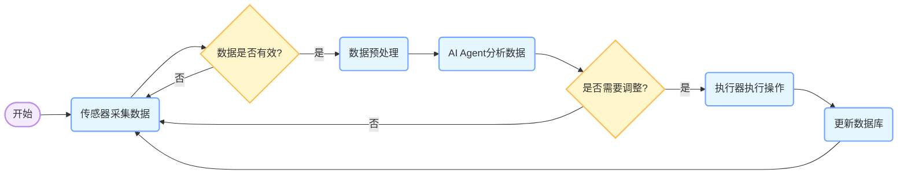

# AI Agent在智能衣柜中的季节性衣物管理

> 关键词：AI Agent、智能衣柜、季节性衣物管理、机器学习、物联网

> 摘要：本文深入探讨了AI Agent在智能衣柜季节性衣物管理中的应用。通过对AI Agent和智能衣柜的核心概念阐述，详细分析了其相关算法原理和数学模型。结合实际项目案例，展示了如何在智能衣柜中运用AI Agent实现高效的季节性衣物管理。同时，探讨了该技术的实际应用场景，推荐了相关的学习资源、开发工具和论文著作。最后，总结了其未来发展趋势与挑战，并提供了常见问题解答和扩展阅读参考资料。

## 1. 背景介绍 
### 1.1 目的和范围
随着人们生活水平的提高，对衣物管理的需求也日益增加。传统的衣柜管理方式已经难以满足人们对于便捷、高效的要求。智能衣柜的出现为解决这一问题提供了新的途径，而AI Agent在智能衣柜中的应用，特别是在季节性衣物管理方面，能够进一步提升衣柜管理的智能化水平。本文的目的在于深入研究AI Agent如何在智能衣柜中实现季节性衣物的有效管理，包括衣物的分类、存储、推荐等功能。研究范围涵盖了AI Agent的核心算法、数学模型、实际应用案例以及相关的工具和资源。

### 1.2 预期读者
本文预期读者包括对人工智能、智能家居领域感兴趣的技术爱好者，从事智能衣柜开发的程序员和软件架构师，以及关注家居智能化发展的研究人员和行业从业者。

### 1.3 文档结构概述
本文首先介绍了相关的核心概念，包括AI Agent和智能衣柜的定义和联系。接着详细阐述了核心算法原理和具体操作步骤，并用Python代码进行了说明。然后讲解了数学模型和公式，并通过举例进行了详细说明。在项目实战部分，给出了开发环境搭建、源代码实现和代码解读。之后探讨了实际应用场景，推荐了相关的工具和资源。最后总结了未来发展趋势与挑战，提供了常见问题解答和扩展阅读参考资料。

### 1.4 术语表
#### 1.4.1 核心术语定义
- **AI Agent**：人工智能代理，是一种能够感知环境、自主决策并采取行动以实现特定目标的软件实体。
- **智能衣柜**：集成了传感器、控制器和通信模块的衣柜，能够实现对衣物的智能化管理。
- **季节性衣物管理**：根据不同季节的特点，对衣物进行分类、存储和推荐的管理方式。

#### 1.4.2 相关概念解释
- **机器学习**：是一门多领域交叉学科，涉及概率论、统计学、逼近论、凸分析、算法复杂度理论等多门学科。它专门研究计算机怎样模拟或实现人类的学习行为，以获取新的知识或技能，重新组织已有的知识结构使之不断改善自身的性能。
- **物联网**：通过各种信息传感器、射频识别技术、全球定位系统、红外感应器、激光扫描器等各种装置与技术，实时采集任何需要监控、连接、互动的物体或过程，采集其声、光、热、电、力学、化学、生物、位置等各种需要的信息，通过各类可能的网络接入，实现物与物、物与人的泛在连接，实现对物品和过程的智能化感知、识别和管理。

#### 1.4.3 缩略词列表
- **AI**：Artificial Intelligence，人工智能
- **IoT**：Internet of Things，物联网

## 2. 核心概念与联系 
### 2.1 AI Agent概念
AI Agent是一种能够感知环境、自主决策并采取行动以实现特定目标的软件实体。它可以通过传感器获取环境信息，运用内置的算法进行决策，并通过执行器对环境产生影响。在智能衣柜的季节性衣物管理中，AI Agent可以感知衣柜内的衣物信息、环境温度和湿度等，根据这些信息进行衣物的分类、存储和推荐。

### 2.2 智能衣柜概念
智能衣柜是集成了传感器、控制器和通信模块的衣柜。传感器可以实时监测衣柜内的温度、湿度、衣物数量和位置等信息；控制器根据传感器的数据进行分析和处理，实现对衣柜的智能控制；通信模块可以将衣柜的信息传输到云端或其他设备，实现远程控制和数据共享。

### 2.3 AI Agent与智能衣柜的联系
AI Agent可以作为智能衣柜的核心控制模块，通过与传感器和执行器的交互，实现对智能衣柜的智能化管理。例如，AI Agent可以根据季节和天气变化，自动调整衣柜内的温度和湿度，以保护衣物；还可以根据用户的穿着习惯和衣物库存情况，为用户提供个性化的衣物推荐。

### 2.4 核心概念原理和架构的文本示意图
```plaintext
智能衣柜系统
|-- 传感器模块
|   |-- 温度传感器
|   |-- 湿度传感器
|   |-- 重量传感器
|   |-- 图像传感器
|-- AI Agent模块
|   |-- 数据采集与预处理
|   |-- 机器学习模型
|   |-- 决策与控制
|-- 执行器模块
|   |-- 电动衣架
|   |-- 温湿度调节器
|   |-- 灯光控制器
|-- 通信模块
|   |-- Wi-Fi
|   |-- Bluetooth
|-- 用户界面
|   |-- 手机APP
|   |-- 触摸屏
```

### 2.5 Mermaid流程图


## 3. 核心算法原理 & 具体操作步骤 
### 3.1 数据采集与预处理
#### 3.1.1 传感器数据采集
智能衣柜中的传感器可以采集多种数据，如温度、湿度、衣物重量和图像等。以下是一个简单的Python代码示例，模拟传感器数据采集：
```python
import random

def collect_temperature():
    # 模拟温度传感器采集数据
    return random.uniform(10, 30)

def collect_humidity():
    # 模拟湿度传感器采集数据
    return random.uniform(30, 80)

def collect_weight():
    # 模拟重量传感器采集数据
    return random.uniform(1, 10)

temperature = collect_temperature()
humidity = collect_humidity()
weight = collect_weight()

print(f"Temperature: {temperature} °C")
print(f"Humidity: {humidity} %")
print(f"Weight: {weight} kg")
```
#### 3.1.2 数据预处理
采集到的数据可能存在噪声和缺失值，需要进行预处理。以下是一个简单的数据预处理示例：
```python
import numpy as np

def preprocess_data(data):
    # 去除噪声
    filtered_data = np.where(data < 0, 0, data)
    # 填充缺失值
    filled_data = np.nan_to_num(filtered_data)
    return filled_data

data = np.array([temperature, humidity, weight])
preprocessed_data = preprocess_data(data)
print(f"Preprocessed data: {preprocessed_data}")
```

### 3.2 机器学习模型
#### 3.2.1 衣物分类模型
可以使用机器学习算法对衣物进行分类，例如决策树、支持向量机等。以下是一个使用决策树进行衣物分类的示例：
```python
from sklearn.datasets import make_classification
from sklearn.model_selection import train_test_split
from sklearn.tree import DecisionTreeClassifier
from sklearn.metrics import accuracy_score

# 生成示例数据
X, y = make_classification(n_samples=1000, n_features=10, n_informative=5, n_classes=3, random_state=42)

# 划分训练集和测试集
X_train, X_test, y_train, y_test = train_test_split(X, y, test_size=0.2, random_state=42)

# 创建决策树分类器
clf = DecisionTreeClassifier()

# 训练模型
clf.fit(X_train, y_train)

# 预测
y_pred = clf.predict(X_test)

# 计算准确率
accuracy = accuracy_score(y_test, y_pred)
print(f"Accuracy: {accuracy}")
```
#### 3.2.2 衣物推荐模型
可以使用协同过滤算法进行衣物推荐。以下是一个简单的基于用户-物品协同过滤的衣物推荐示例：
```python
import pandas as pd
from sklearn.metrics.pairwise import cosine_similarity

# 示例数据
data = {
    'user_id': [1, 1, 2, 2, 3, 3],
    'item_id': [1, 2, 2, 3, 1, 3],
    'rating': [5, 3, 4, 2, 1, 5]
}
df = pd.DataFrame(data)

# 创建用户-物品矩阵
user_item_matrix = df.pivot(index='user_id', columns='item_id', values='rating').fillna(0)

# 计算用户之间的相似度
user_similarity = cosine_similarity(user_item_matrix)

# 推荐函数
def recommend_items(user_id, top_n=3):
    user_index = user_item_matrix.index.get_loc(user_id)
    similar_users = user_similarity[user_index].argsort()[::-1][1:top_n + 1]
    similar_user_items = user_item_matrix.iloc[similar_users]
    user_items = user_item_matrix.iloc[user_index]
    unrated_items = user_items[user_items == 0].index
    item_scores = {}
    for item in unrated_items:
        score = 0
        for similar_user in similar_users:
            score += user_similarity[user_index][similar_user] * user_item_matrix.iloc[similar_user][item]
        item_scores[item] = score
    sorted_items = sorted(item_scores.items(), key=lambda x: x[1], reverse=True)
    recommended_items = [item[0] for item in sorted_items[:top_n]]
    return recommended_items

user_id = 1
recommended_items = recommend_items(user_id)
print(f"Recommended items for user {user_id}: {recommended_items}")
```

### 3.3 决策与控制
根据机器学习模型的输出，AI Agent可以做出决策并控制执行器。以下是一个简单的决策与控制示例：
```python
def decision_making(temperature, humidity):
    if temperature > 25 and humidity > 70:
        return "开启除湿功能"
    elif temperature < 15:
        return "开启加热功能"
    else:
        return "维持现状"

action = decision_making(temperature, humidity)
print(f"决策结果: {action}")
```

## 4. 数学模型和公式 & 详细讲解 & 举例说明 
### 4.1 机器学习模型中的数学模型和公式
#### 4.1.1 决策树算法
决策树算法是一种基于树结构进行决策的机器学习算法。在决策树中，每个内部节点是一个属性上的测试，每个分支是一个测试输出，每个叶节点是一个类别或值。

决策树的构建过程通常使用信息增益、信息增益比或基尼指数等指标来选择最优的划分属性。信息增益的计算公式为：
$$
Gain(D, a) = Ent(D) - \sum_{v = 1}^{V} \frac{|D^v|}{|D|} Ent(D^v)
$$
其中，$D$ 是数据集，$a$ 是属性，$V$ 是属性 $a$ 的取值个数，$D^v$ 是 $D$ 中在属性 $a$ 上取值为 $v$ 的样本子集，$Ent(D)$ 是数据集 $D$ 的信息熵，计算公式为：
$$
Ent(D) = - \sum_{k = 1}^{K} p_k \log_2 p_k
$$
其中，$K$ 是类别数，$p_k$ 是第 $k$ 类样本在 $D$ 中所占的比例。

例如，假设有一个数据集 $D$ 包含 10 个样本，分为 2 类，其中第一类有 6 个样本，第二类有 4 个样本。则数据集 $D$ 的信息熵为：
$$
Ent(D) = - \frac{6}{10} \log_2 \frac{6}{10} - \frac{4}{10} \log_2 \frac{4}{10} \approx 0.971
$$

#### 4.1.2 协同过滤算法
协同过滤算法是一种基于用户行为数据进行推荐的算法，分为用户-用户协同过滤和物品-物品协同过滤。

用户-用户协同过滤的核心思想是找到与目标用户兴趣相似的其他用户，然后根据这些相似用户的偏好来为目标用户推荐物品。用户之间的相似度通常使用余弦相似度来计算，计算公式为：
$$
sim(u, v) = \frac{\sum_{i \in I_{uv}} r_{ui} r_{vi}}{\sqrt{\sum_{i \in I_{u}} r_{ui}^2} \sqrt{\sum_{i \in I_{v}} r_{vi}^2}}
$$
其中，$u$ 和 $v$ 是两个用户，$I_{uv}$ 是用户 $u$ 和 $v$ 共同评价过的物品集合，$I_{u}$ 是用户 $u$ 评价过的物品集合，$I_{v}$ 是用户 $v$ 评价过的物品集合，$r_{ui}$ 是用户 $u$ 对物品 $i$ 的评分，$r_{vi}$ 是用户 $v$ 对物品 $i$ 的评分。

例如，假设有两个用户 $u$ 和 $v$，他们对物品 $1$、$2$、$3$ 的评分分别为 $r_{u1} = 5$，$r_{u2} = 3$，$r_{u3} = 1$，$r_{v1} = 4$，$r_{v2} = 2$，$r_{v3} = 0$。则用户 $u$ 和 $v$ 之间的余弦相似度为：
$$
sim(u, v) = \frac{5 \times 4 + 3 \times 2 + 1 \times 0}{\sqrt{5^2 + 3^2 + 1^2} \sqrt{4^2 + 2^2 + 0^2}} \approx 0.962
$$

### 4.2 决策与控制中的数学模型和公式
在决策与控制中，可以使用规则引擎来实现决策。规则引擎通常基于一组规则进行决策，规则的形式可以表示为：
$$
IF \ condition \ THEN \ action
$$
例如，在智能衣柜的季节性衣物管理中，规则可以表示为：
$$
IF \ temperature > 25 \ AND \ humidity > 70 \ THEN \ 开启除湿功能
$$

## 5. 项目实战：代码实际案例和详细解释说明 
### 5.1  开发环境搭建
#### 5.1.1 硬件环境
- 智能衣柜：配备温度传感器、湿度传感器、重量传感器、图像传感器、电动衣架、温湿度调节器和灯光控制器等。
- 开发板：如 Raspberry Pi，用于运行AI Agent程序。

#### 5.1.2 软件环境
- 操作系统：Raspbian（基于 Debian 的 Linux 操作系统）
- 编程语言：Python 3.x
- 开发框架：Scikit-learn、Pandas、Numpy 等

### 5.2  源代码详细实现和代码解读
#### 5.2.1 数据采集模块
```python
import random
import time

def collect_temperature():
    # 模拟温度传感器采集数据
    return random.uniform(10, 30)

def collect_humidity():
    # 模拟湿度传感器采集数据
    return random.uniform(30, 80)

def collect_weight():
    # 模拟重量传感器采集数据
    return random.uniform(1, 10)

while True:
    temperature = collect_temperature()
    humidity = collect_humidity()
    weight = collect_weight()
    print(f"Temperature: {temperature} °C")
    print(f"Humidity: {humidity} %")
    print(f"Weight: {weight} kg")
    time.sleep(60)  # 每分钟采集一次数据
```
代码解读：该代码模拟了温度、湿度和重量传感器的数据采集过程，每隔一分钟采集一次数据并打印输出。

#### 5.2.2 数据预处理模块
```python
import numpy as np

def preprocess_data(data):
    # 去除噪声
    filtered_data = np.where(data < 0, 0, data)
    # 填充缺失值
    filled_data = np.nan_to_num(filtered_data)
    return filled_data

# 示例数据
data = np.array([collect_temperature(), collect_humidity(), collect_weight()])
preprocessed_data = preprocess_data(data)
print(f"Preprocessed data: {preprocessed_data}")
```
代码解读：该代码实现了数据预处理功能，包括去除噪声和填充缺失值。

#### 5.2.3 衣物分类模块
```python
from sklearn.datasets import make_classification
from sklearn.model_selection import train_test_split
from sklearn.tree import DecisionTreeClassifier
from sklearn.metrics import accuracy_score

# 生成示例数据
X, y = make_classification(n_samples=1000, n_features=10, n_informative=5, n_classes=3, random_state=42)

# 划分训练集和测试集
X_train, X_test, y_train, y_test = train_test_split(X, y, test_size=0.2, random_state=42)

# 创建决策树分类器
clf = DecisionTreeClassifier()

# 训练模型
clf.fit(X_train, y_train)

# 预测
y_pred = clf.predict(X_test)

# 计算准确率
accuracy = accuracy_score(y_test, y_pred)
print(f"Accuracy: {accuracy}")
```
代码解读：该代码使用决策树算法对衣物进行分类，包括数据生成、模型训练和预测，并计算了模型的准确率。

#### 5.2.4 衣物推荐模块
```python
import pandas as pd
from sklearn.metrics.pairwise import cosine_similarity

# 示例数据
data = {
    'user_id': [1, 1, 2, 2, 3, 3],
    'item_id': [1, 2, 2, 3, 1, 3],
    'rating': [5, 3, 4, 2, 1, 5]
}
df = pd.DataFrame(data)

# 创建用户-物品矩阵
user_item_matrix = df.pivot(index='user_id', columns='item_id', values='rating').fillna(0)

# 计算用户之间的相似度
user_similarity = cosine_similarity(user_item_matrix)

# 推荐函数
def recommend_items(user_id, top_n=3):
    user_index = user_item_matrix.index.get_loc(user_id)
    similar_users = user_similarity[user_index].argsort()[::-1][1:top_n + 1]
    similar_user_items = user_item_matrix.iloc[similar_users]
    user_items = user_item_matrix.iloc[user_index]
    unrated_items = user_items[user_items == 0].index
    item_scores = {}
    for item in unrated_items:
        score = 0
        for similar_user in similar_users:
            score += user_similarity[user_index][similar_user] * user_item_matrix.iloc[similar_user][item]
        item_scores[item] = score
    sorted_items = sorted(item_scores.items(), key=lambda x: x[1], reverse=True)
    recommended_items = [item[0] for item in sorted_items[:top_n]]
    return recommended_items

user_id = 1
recommended_items = recommend_items(user_id)
print(f"Recommended items for user {user_id}: {recommended_items}")
```
代码解读：该代码使用协同过滤算法进行衣物推荐，包括数据处理、相似度计算和推荐函数的实现。

#### 5.2.5 决策与控制模块
```python
def decision_making(temperature, humidity):
    if temperature > 25 and humidity > 70:
        return "开启除湿功能"
    elif temperature < 15:
        return "开启加热功能"
    else:
        return "维持现状"

temperature = collect_temperature()
humidity = collect_humidity()
action = decision_making(temperature, humidity)
print(f"决策结果: {action}")
```
代码解读：该代码根据温度和湿度数据进行决策，并输出相应的控制指令。

### 5.3  代码解读与分析
#### 5.3.1 数据采集模块
该模块模拟了传感器的数据采集过程，使用 `random.uniform` 函数生成随机数据。在实际应用中，需要根据具体的传感器型号和接口协议进行数据采集。

#### 5.3.2 数据预处理模块
该模块使用 `numpy` 库进行数据预处理，包括去除噪声和填充缺失值。在实际应用中，可能需要根据具体的数据特点和需求进行更复杂的预处理操作。

#### 5.3.3 衣物分类模块
该模块使用 `scikit-learn` 库中的决策树算法进行衣物分类。在实际应用中，可能需要根据具体的数据集和分类任务选择更合适的算法和模型。

#### 5.3.4 衣物推荐模块
该模块使用协同过滤算法进行衣物推荐，包括数据处理、相似度计算和推荐函数的实现。在实际应用中，可能需要考虑更多的因素，如用户的偏好、衣物的属性等。

#### 5.3.5 决策与控制模块
该模块根据温度和湿度数据进行决策，并输出相应的控制指令。在实际应用中，需要将控制指令发送到相应的执行器，如温湿度调节器、电动衣架等。

## 6. 实际应用场景 
### 6.1 家庭智能衣柜
在家庭中，智能衣柜可以根据季节和天气变化，自动调整衣柜内的温度和湿度，保护衣物不受潮、发霉。同时，AI Agent可以根据用户的穿着习惯和衣物库存情况，为用户提供个性化的衣物推荐，帮助用户快速搭配出合适的服装。

### 6.2 商业服装店
在商业服装店中，智能衣柜可以实时监测衣物的库存情况，当某种衣物的库存不足时，及时提醒店员补货。同时，AI Agent可以根据顾客的身高、体重、肤色等信息，为顾客提供个性化的衣物推荐，提高顾客的购物体验和购买转化率。

### 6.3 酒店客房
在酒店客房中，智能衣柜可以为客人提供便捷的衣物管理服务。客人可以通过手机APP远程控制衣柜的开关、灯光等功能，还可以根据自己的需求设置衣柜内的温度和湿度。AI Agent可以根据客人的入住时间和当地的天气情况，为客人提供合适的衣物推荐。

## 7. 工具和资源推荐
### 7.1 学习资源推荐
#### 7.1.1 书籍推荐
- 《人工智能：一种现代的方法》：这本书是人工智能领域的经典教材，全面介绍了人工智能的基本概念、算法和应用。
- 《机器学习》：周志华教授的著作，系统地介绍了机器学习的基本原理、算法和应用。
- 《Python机器学习实战》：通过实际案例介绍了如何使用Python进行机器学习开发。

#### 7.1.2 在线课程
- Coursera上的《机器学习》课程：由斯坦福大学的Andrew Ng教授授课，是机器学习领域的经典在线课程。
- edX上的《人工智能导论》课程：介绍了人工智能的基本概念、算法和应用。
- 中国大学MOOC上的《Python语言程序设计》课程：适合初学者学习Python编程语言。

#### 7.1.3 技术博客和网站
- Medium：一个技术博客平台，上面有很多关于人工智能、机器学习的优质文章。
- Towards Data Science：专注于数据科学和机器学习领域的技术博客。
- GitHub：一个开源代码托管平台，可以找到很多关于人工智能和智能家居的开源项目。

### 7.2 开发工具框架推荐
#### 7.2.1 IDE和编辑器
- PyCharm：一款专业的Python集成开发环境，提供了丰富的代码编辑、调试和测试功能。
- Visual Studio Code：一款轻量级的代码编辑器，支持多种编程语言和插件扩展。
- Jupyter Notebook：一个交互式的开发环境，适合进行数据分析和机器学习实验。

#### 7.2.2 调试和性能分析工具
- PDB：Python自带的调试工具，可以帮助开发者调试代码。
- cProfile：Python的性能分析工具，可以分析代码的执行时间和内存使用情况。
- TensorBoard：TensorFlow的可视化工具，可以帮助开发者可视化模型的训练过程和性能指标。

#### 7.2.3 相关框架和库
- Scikit-learn：一个简单易用的机器学习库，提供了各种机器学习算法和工具。
- Pandas：一个用于数据处理和分析的Python库，提供了高效的数据结构和数据操作方法。
- Numpy：一个用于科学计算的Python库，提供了高效的数组操作和数学函数。

### 7.3 相关论文著作推荐
#### 7.3.1 经典论文
- "A Machine Learning Approach to Personalized Clothing Recommendation"：介绍了一种基于机器学习的个性化衣物推荐方法。
- "Intelligent Wardrobe Management System Based on Internet of Things"：提出了一种基于物联网的智能衣柜管理系统。
- "Decision Tree Induction"：决策树算法的经典论文，介绍了决策树的构建方法和理论基础。

#### 7.3.2 最新研究成果
- 关注ACM SIGKDD、NeurIPS、ICML等顶级学术会议上的相关研究成果。
- 查阅《Journal of Artificial Intelligence Research》、《Artificial Intelligence》等学术期刊上的最新论文。

#### 7.3.3 应用案例分析
- 分析一些实际的智能衣柜项目案例，了解其技术实现和应用效果。
- 参考一些智能家居行业的研究报告，了解智能衣柜的市场趋势和发展前景。

## 8. 总结：未来发展趋势与挑战
### 8.1 未来发展趋势
- **智能化程度不断提高**：随着人工智能技术的不断发展，AI Agent在智能衣柜中的应用将更加深入，智能衣柜的智能化程度将不断提高，能够实现更加复杂的功能和更加个性化的服务。
- **与其他智能家居设备的集成**：智能衣柜将与其他智能家居设备，如智能空调、智能灯光等进行集成，实现家居环境的整体智能化管理。
- **大数据和云计算的应用**：通过大数据和云计算技术，智能衣柜可以收集和分析更多的用户数据和衣物信息，为用户提供更加精准的衣物推荐和管理服务。

### 8.2 挑战
- **数据安全和隐私问题**：智能衣柜需要收集和处理大量的用户数据，如衣物信息、穿着习惯等，如何保障数据的安全和隐私是一个重要的挑战。
- **技术标准和规范的缺失**：目前智能衣柜领域缺乏统一的技术标准和规范，不同厂家的产品之间可能存在兼容性问题，影响用户的使用体验。
- **用户接受度和市场推广**：智能衣柜作为一种新兴的智能家居产品，用户对其认知度和接受度还比较低，需要加强市场推广和宣传，提高用户的认知度和接受度。

## 9. 附录：常见问题与解答
### 9.1 智能衣柜的价格贵吗？
智能衣柜的价格因品牌、功能和材质等因素而异。一般来说，智能衣柜的价格会比普通衣柜高一些，但随着技术的不断发展和市场竞争的加剧，智能衣柜的价格也在逐渐下降。

### 9.2 智能衣柜的安装复杂吗？
智能衣柜的安装相对普通衣柜会复杂一些，需要专业的安装人员进行安装。安装过程中需要考虑传感器、控制器和通信模块的安装位置和布线等问题。

### 9.3 智能衣柜的维护成本高吗？
智能衣柜的维护成本主要包括传感器、控制器和执行器等设备的更换和维修费用。一般来说，只要正常使用和保养，智能衣柜的维护成本不会太高。

### 9.4 智能衣柜的安全性如何？
智能衣柜在设计和生产过程中会考虑安全性问题，如采用防火、防潮、防漏电等材料和技术。同时，智能衣柜还会配备安全保护装置，如过载保护、漏电保护等，保障用户的使用安全。

## 10. 扩展阅读 & 参考资料
- 《智能家居系统设计与实现》
- 《物联网技术与应用》
- ACM SIGKDD、NeurIPS、ICML等学术会议论文集
- 《Journal of Artificial Intelligence Research》、《Artificial Intelligence》等学术期刊

作者：AI天才研究院/AI Genius Institute & 禅与计算机程序设计艺术 /Zen And The Art of Computer Programming