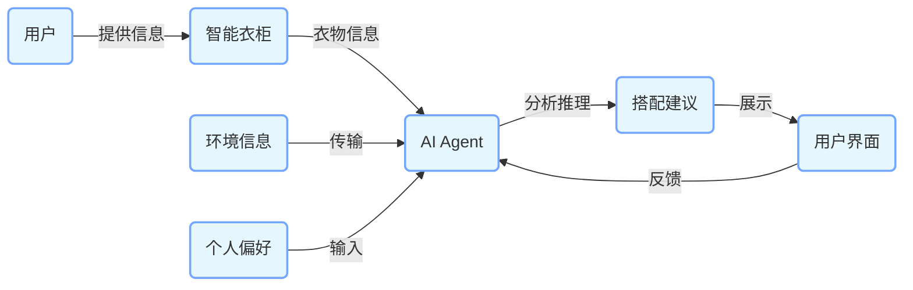

# AI Agent在智能衣柜中的衣物搭配建议

> 关键词：AI Agent、智能衣柜、衣物搭配建议、机器学习、计算机视觉

> 摘要：本文深入探讨了AI Agent在智能衣柜中提供衣物搭配建议的相关技术。首先介绍了该研究的背景，包括目的、预期读者等内容。接着阐述了核心概念，分析了AI Agent与智能衣柜、衣物搭配建议之间的联系，并给出了相应的架构示意图和流程图。详细讲解了核心算法原理，用Python代码进行了具体实现。从数学模型和公式的角度对算法进行剖析，并举例说明。通过项目实战展示了代码实际案例及详细解释。探讨了实际应用场景，推荐了相关的工具和资源。最后总结了未来发展趋势与挑战，还给出了常见问题的解答以及扩展阅读和参考资料。旨在为相关领域的研究和实践提供全面而深入的指导。

## 1. 背景介绍 
### 1.1 目的和范围
在当今快节奏的生活中，人们对于高效、个性化的衣物搭配需求日益增长。智能衣柜结合AI Agent技术应运而生，其目的在于利用先进的人工智能技术，为用户提供精准、符合个人风格和实际需求的衣物搭配建议。本研究的范围涵盖了从AI Agent的基本原理到在智能衣柜中的具体应用，包括算法设计、系统实现、实际场景应用等多个方面。通过深入研究，旨在推动智能衣柜系统的发展，提升用户的穿衣体验。

### 1.2 预期读者
本文预期读者主要包括对人工智能技术在智能家居领域应用感兴趣的研究人员、开发者，以及从事智能衣柜产品设计和开发的工程师。同时，对于希望了解如何利用科技手段提升生活品质的普通消费者也具有一定的参考价值。

### 1.3 文档结构概述
本文将按照以下结构进行阐述：首先介绍核心概念，明确AI Agent、智能衣柜和衣物搭配建议之间的关系；接着详细讲解核心算法原理，并给出Python代码实现；从数学模型的角度对算法进行深入分析；通过项目实战展示代码的实际应用；探讨实际应用场景；推荐相关的学习资源、开发工具和研究论文；最后总结未来发展趋势与挑战，解答常见问题，并提供扩展阅读和参考资料。

### 1.4 术语表
#### 1.4.1 核心术语定义
- **AI Agent**：即人工智能代理，是一种能够感知环境、自主决策并采取行动以实现特定目标的智能实体。在智能衣柜场景中，AI Agent能够感知用户的衣物信息、个人偏好和环境信息，为用户提供衣物搭配建议。
- **智能衣柜**：集成了先进的传感器、计算设备和软件系统的衣柜，能够对衣物进行智能管理，并结合AI Agent技术为用户提供个性化的服务。
- **衣物搭配建议**：根据用户的衣物信息、个人风格、场合需求等因素，为用户推荐合适的衣物组合。

#### 1.4.2 相关概念解释
- **机器学习**：是一门多领域交叉学科，涉及概率论、统计学、逼近论、凸分析、算法复杂度理论等多门学科。它专门研究计算机怎样模拟或实现人类的学习行为，以获取新的知识或技能，重新组织已有的知识结构使之不断改善自身的性能。在智能衣柜中，机器学习算法可用于分析用户的穿衣习惯和偏好，从而提供更精准的搭配建议。
- **计算机视觉**：是一门研究如何使机器“看”的科学，更进一步的说，就是是指用摄影机和电脑代替人眼对目标进行识别、跟踪和测量等机器视觉，并进一步做图形处理，使电脑处理成为更适合人眼观察或传送给仪器检测的图像。在智能衣柜中，计算机视觉技术可用于识别衣物的款式、颜色、图案等信息。

#### 1.4.3 缩略词列表
- **AI**：Artificial Intelligence，人工智能
- **ML**：Machine Learning，机器学习
- **CV**：Computer Vision，计算机视觉

## 2. 核心概念与联系 

### 核心概念原理
AI Agent在智能衣柜中的衣物搭配建议系统主要基于以下几个核心概念：
- **感知**：AI Agent通过各种传感器（如摄像头、RFID标签阅读器等）获取智能衣柜中衣物的信息，包括衣物的款式、颜色、材质等。同时，还可以感知用户的个人信息（如身高、体重、肤色等）和环境信息（如天气、场合等）。
- **决策**：根据感知到的信息，AI Agent利用机器学习算法和预设的规则进行分析和推理，为用户生成合适的衣物搭配建议。决策过程中会考虑用户的历史穿衣记录、个人风格偏好等因素。
- **行动**：将生成的衣物搭配建议呈现给用户，用户可以通过智能衣柜的显示屏、手机应用等方式查看建议。同时，AI Agent还可以与其他智能家居设备进行交互，如控制灯光、调节温度等，以营造与搭配相匹配的环境。

### 架构示意图

该架构图展示了AI Agent在智能衣柜中的工作流程。用户向智能衣柜提供个人信息和衣物信息，智能衣柜将这些信息传输给AI Agent。同时，环境信息和用户的个人偏好也会输入到AI Agent中。AI Agent对这些信息进行分析推理，生成衣物搭配建议，并通过用户界面展示给用户。用户可以对建议进行反馈，AI Agent根据反馈不断优化决策过程。

## 3. 核心算法原理 & 具体操作步骤 

### 核心算法原理
在AI Agent为智能衣柜提供衣物搭配建议的过程中，主要使用的算法包括基于内容的推荐算法和协同过滤算法。下面以基于内容的推荐算法为例进行详细讲解。

基于内容的推荐算法的核心思想是根据衣物的特征（如款式、颜色、材质等）和用户的偏好，为用户推荐与他们之前喜欢的衣物相似的搭配。具体步骤如下：
1. **特征提取**：对智能衣柜中的每件衣物进行特征提取，将衣物的款式、颜色、材质等信息转化为计算机可以处理的向量表示。
2. **用户偏好建模**：根据用户的历史穿衣记录和反馈信息，建立用户的偏好模型。偏好模型可以用向量或矩阵表示，反映用户对不同衣物特征的喜好程度。
3. **相似度计算**：计算每件衣物与用户偏好模型之间的相似度。常用的相似度计算方法包括余弦相似度、欧几里得距离等。
4. **推荐生成**：根据相似度计算结果，选择相似度较高的衣物进行搭配，生成衣物搭配建议。

### 具体操作步骤及Python代码实现
```python
import numpy as np

# 步骤1：特征提取
# 假设衣物的特征用一个向量表示，例如 [款式, 颜色, 材质]
clothes_features = np.array([
    [1, 2, 3],  # 衣物1的特征向量
    [4, 5, 6],  # 衣物2的特征向量
    [7, 8, 9]   # 衣物3的特征向量
])

# 步骤2：用户偏好建模
# 假设用户的偏好也用一个向量表示
user_preference = np.array([2, 3, 4])

# 步骤3：相似度计算（使用余弦相似度）
def cosine_similarity(vector1, vector2):
    dot_product = np.dot(vector1, vector2)
    norm_vector1 = np.linalg.norm(vector1)
    norm_vector2 = np.linalg.norm(vector2)
    return dot_product / (norm_vector1 * norm_vector2)

similarities = []
for feature in clothes_features:
    similarity = cosine_similarity(feature, user_preference)
    similarities.append(similarity)

# 步骤4：推荐生成
# 选择相似度最高的衣物进行搭配
recommended_clothes_index = np.argmax(similarities)
recommended_clothes = clothes_features[recommended_clothes_index]

print("推荐的衣物特征向量：", recommended_clothes)
```
在上述代码中，首先定义了衣物的特征向量和用户的偏好向量。然后实现了余弦相似度计算函数，计算每件衣物与用户偏好向量之间的相似度。最后选择相似度最高的衣物作为推荐结果。

## 4. 数学模型和公式 & 详细讲解 & 举例说明 

### 数学模型和公式
#### 特征向量表示
假设每件衣物有 $n$ 个特征，用向量 $\mathbf{x} = [x_1, x_2, \cdots, x_n]^T$ 表示。例如，对于衣物的款式、颜色、材质三个特征，$n = 3$。

#### 用户偏好模型
用户的偏好也可以用一个向量 $\mathbf{p} = [p_1, p_2, \cdots, p_n]^T$ 表示，其中 $p_i$ 表示用户对第 $i$ 个特征的喜好程度。

#### 相似度计算
余弦相似度是一种常用的相似度计算方法，其公式为：
$$
\text{CosineSimilarity}(\mathbf{x}, \mathbf{p}) = \frac{\mathbf{x}^T \cdot \mathbf{p}}{\|\mathbf{x}\| \cdot \|\mathbf{p}\|}
$$
其中，$\mathbf{x}^T \cdot \mathbf{p}$ 表示向量 $\mathbf{x}$ 和 $\mathbf{p}$ 的点积，$\|\mathbf{x}\|$ 和 $\|\mathbf{p}\|$ 分别表示向量 $\mathbf{x}$ 和 $\mathbf{p}$ 的模。

### 详细讲解
余弦相似度的取值范围在 $[-1, 1]$ 之间，值越接近 1 表示两个向量越相似，值越接近 -1 表示两个向量越不相似。在衣物搭配推荐中，我们希望找到与用户偏好向量相似度较高的衣物特征向量，因此选择余弦相似度最高的衣物作为推荐结果。

### 举例说明
假设有两件衣物，它们的特征向量分别为 $\mathbf{x}_1 = [1, 2, 3]^T$ 和 $\mathbf{x}_2 = [4, 5, 6]^T$，用户的偏好向量为 $\mathbf{p} = [2, 3, 4]^T$。

首先计算 $\mathbf{x}_1$ 与 $\mathbf{p}$ 的余弦相似度：
$$
\begin{align*}
\text{CosineSimilarity}(\mathbf{x}_1, \mathbf{p}) &= \frac{\mathbf{x}_1^T \cdot \mathbf{p}}{\|\mathbf{x}_1\| \cdot \|\mathbf{p}\|}\\
&= \frac{1\times2 + 2\times3 + 3\times4}{\sqrt{1^2 + 2^2 + 3^2} \cdot \sqrt{2^2 + 3^2 + 4^2}}\\
&= \frac{2 + 6 + 12}{\sqrt{14} \cdot \sqrt{29}}\\
&\approx 0.97
\end{align*}
$$

然后计算 $\mathbf{x}_2$ 与 $\mathbf{p}$ 的余弦相似度：
$$
\begin{align*}
\text{CosineSimilarity}(\mathbf{x}_2, \mathbf{p}) &= \frac{\mathbf{x}_2^T \cdot \mathbf{p}}{\|\mathbf{x}_2\| \cdot \|\mathbf{p}\|}\\
&= \frac{4\times2 + 5\times3 + 6\times4}{\sqrt{4^2 + 5^2 + 6^2} \cdot \sqrt{2^2 + 3^2 + 4^2}}\\
&= \frac{8 + 15 + 24}{\sqrt{77} \cdot \sqrt{29}}\\
&\approx 0.99
\end{align*}
$$

由于 $\text{CosineSimilarity}(\mathbf{x}_2, \mathbf{p}) > \text{CosineSimilarity}(\mathbf{x}_1, \mathbf{p})$，因此推荐衣物 $\mathbf{x}_2$。

## 5. 项目实战：代码实际案例和详细解释说明 

### 5.1  开发环境搭建
- **操作系统**：建议使用 Linux 或 macOS 系统，因为它们对 Python 开发环境的支持较好。
- **Python 版本**：使用 Python 3.7 及以上版本。
- **开发工具**：可以选择 PyCharm、VS Code 等集成开发环境（IDE），方便代码的编写、调试和管理。
- **依赖库安装**：需要安装 numpy、opencv-python 等库。可以使用以下命令进行安装：
```sh
pip install numpy opencv-python
```

### 5.2  源代码详细实现和代码解读
```python
import numpy as np
import cv2

# 步骤1：特征提取（使用计算机视觉技术提取衣物颜色特征）
def extract_color_features(image_path):
    image = cv2.imread(image_path)
    # 将图像转换为 HSV 颜色空间
    hsv_image = cv2.cvtColor(image, cv2.COLOR_BGR2HSV)
    # 计算颜色直方图
    hist = cv2.calcHist([hsv_image], [0, 1, 2], None, [8, 8, 8], [0, 180, 0, 256, 0, 256])
    # 归一化直方图
    hist = cv2.normalize(hist, hist).flatten()
    return hist

# 步骤2：用户偏好建模
# 假设用户的偏好通过历史穿衣记录中的颜色特征计算得到
user_history_images = ["image1.jpg", "image2.jpg", "image3.jpg"]
user_preferences = []
for image_path in user_history_images:
    features = extract_color_features(image_path)
    user_preferences.append(features)
user_preference = np.mean(user_preferences, axis=0)

# 步骤3：相似度计算（使用余弦相似度）
def cosine_similarity(vector1, vector2):
    dot_product = np.dot(vector1, vector2)
    norm_vector1 = np.linalg.norm(vector1)
    norm_vector2 = np.linalg.norm(vector2)
    return dot_product / (norm_vector1 * norm_vector2)

# 步骤4：推荐生成
clothes_images = ["clothes1.jpg", "clothes2.jpg", "clothes3.jpg"]
similarities = []
for image_path in clothes_images:
    features = extract_color_features(image_path)
    similarity = cosine_similarity(features, user_preference)
    similarities.append(similarity)

recommended_clothes_index = np.argmax(similarities)
recommended_clothes = clothes_images[recommended_clothes_index]

print("推荐的衣物图片：", recommended_clothes)
```
### 代码解读与分析
- **特征提取**：`extract_color_features` 函数使用 OpenCV 库读取衣物图片，并将其转换为 HSV 颜色空间。然后计算颜色直方图，并进行归一化处理，将直方图特征作为衣物的颜色特征。
- **用户偏好建模**：通过读取用户历史穿衣记录中的图片，提取颜色特征并求平均值，得到用户的偏好向量。
- **相似度计算**：使用余弦相似度计算每件衣物的颜色特征与用户偏好向量之间的相似度。
- **推荐生成**：选择相似度最高的衣物图片作为推荐结果。

## 6. 实际应用场景 
### 日常穿搭
在日常生活中，用户可以通过智能衣柜的AI Agent获取每日的穿衣搭配建议。AI Agent会根据当天的天气、用户的个人风格和活动安排，为用户推荐合适的衣物组合。例如，在晴天且温度适宜的日子里，推荐用户穿着轻薄的上衣和短裤；在雨天，则推荐防水的外套和雨靴。

### 特殊场合
对于特殊场合，如商务会议、婚礼、聚会等，AI Agent可以提供专业的搭配建议。根据场合的正式程度、主题和氛围，为用户选择合适的服装款式、颜色和配饰。例如，在商务会议中，推荐用户穿着正式的西装套装和皮鞋；在婚礼上，根据婚礼的风格和季节，为用户推荐得体的礼服。

### 旅行穿搭
在旅行时，用户可以提前将旅行目的地的信息输入到智能衣柜系统中。AI Agent会根据目的地的气候、文化和旅行活动安排，为用户规划旅行期间的衣物搭配。例如，去海边度假时，推荐用户携带泳衣、沙滩裙、遮阳帽等衣物；去寒冷地区旅行时，推荐用户穿着厚外套、保暖内衣等。

## 7. 工具和资源推荐
### 7.1 学习资源推荐
#### 7.1.1 书籍推荐
- 《人工智能：一种现代的方法》：全面介绍了人工智能的基本概念、算法和应用，是人工智能领域的经典教材。
- 《Python机器学习实战》：通过实际案例介绍了Python在机器学习中的应用，适合初学者快速入门。
- 《计算机视觉：算法与应用》：详细讲解了计算机视觉的基本算法和应用场景，对于理解衣物特征提取有很大帮助。

#### 7.1.2 在线课程
- Coursera上的“机器学习”课程：由斯坦福大学教授Andrew Ng主讲，是机器学习领域最受欢迎的在线课程之一。
- edX上的“计算机视觉基础”课程：介绍了计算机视觉的基本原理和算法，适合对计算机视觉感兴趣的学习者。
- 中国大学MOOC上的“人工智能基础”课程：由国内知名高校的教授授课，系统地介绍了人工智能的基础知识。

#### 7.1.3 技术博客和网站
- Medium：上面有很多人工智能领域的技术博客和文章，涵盖了最新的研究成果和应用案例。
- 机器之心：专注于人工智能领域的资讯和技术分享，提供了丰富的行业动态和技术文章。
- 开源中国：国内知名的开源技术社区，有很多关于人工智能和Python开发的技术文章和讨论。

### 7.2 开发工具框架推荐
#### 7.2.1 IDE和编辑器
- PyCharm：专业的Python集成开发环境，提供了丰富的代码编辑、调试和管理功能。
- VS Code：轻量级的代码编辑器，支持多种编程语言，通过安装插件可以实现强大的Python开发功能。

#### 7.2.2 调试和性能分析工具
- pdb：Python自带的调试工具，可以帮助开发者定位代码中的问题。
- cProfile：Python的性能分析工具，可以分析代码的运行时间和资源消耗情况。

#### 7.2.3 相关框架和库
- TensorFlow：Google开发的开源机器学习框架，提供了丰富的深度学习模型和工具。
- PyTorch：Facebook开发的深度学习框架，具有简洁易用的特点，受到很多研究者的喜爱。
- Scikit-learn：Python的机器学习库，提供了各种机器学习算法和工具，适合初学者快速上手。

### 7.3 相关论文著作推荐
#### 7.3.1 经典论文
- 《A Mathematical Theory of Communication》：信息论的奠基之作，对机器学习和人工智能的发展产生了深远影响。
- 《Learning Representations by Back-propagating Errors》：介绍了反向传播算法，是神经网络发展的重要里程碑。

#### 7.3.2 最新研究成果
- 关注顶级学术会议（如NeurIPS、ICCV、CVPR等）上的论文，了解人工智能和计算机视觉领域的最新研究动态。
- 阅读知名学术期刊（如Journal of Artificial Intelligence Research、IEEE Transactions on Pattern Analysis and Machine Intelligence等）上的文章，获取高质量的研究成果。

#### 7.3.3 应用案例分析
- 研究一些知名公司（如Google、Amazon、Microsoft等）在人工智能领域的应用案例，学习他们的技术和经验。
- 分析一些智能衣柜产品的用户评价和技术实现，了解市场需求和发展趋势。

## 8. 总结：未来发展趋势与挑战
### 未来发展趋势
- **个性化程度更高**：随着用户数据的不断积累和机器学习算法的不断优化，AI Agent将能够为用户提供更加个性化的衣物搭配建议。不仅考虑用户的个人风格和偏好，还会结合用户的身体状况、情绪状态等因素进行推荐。
- **多模态融合**：除了衣物的颜色、款式等视觉信息，未来的智能衣柜系统还将融合语音、触觉等多模态信息。例如，用户可以通过语音指令查询搭配建议，系统可以根据衣物的材质提供触觉反馈。
- **与其他智能家居设备深度融合**：智能衣柜将与其他智能家居设备（如智能镜子、智能灯光、智能空调等）实现深度融合，为用户提供更加全方位的服务。例如，当用户选择了一套搭配后，智能镜子可以模拟穿着效果，智能灯光可以调节到合适的亮度和颜色。

### 挑战
- **数据隐私和安全**：智能衣柜系统需要收集和处理用户的大量个人信息和衣物信息，如何保障数据的隐私和安全是一个重要的挑战。需要采用先进的加密技术和安全机制，防止数据泄露和滥用。
- **算法复杂度和计算资源需求**：随着系统功能的不断增加和数据量的不断增大，算法的复杂度和计算资源需求也会相应增加。如何在保证系统性能的前提下，降低算法的复杂度和计算资源需求是一个亟待解决的问题。
- **用户接受度**：虽然智能衣柜和AI Agent技术具有很大的潜力，但用户对这些新技术的接受度还需要进一步提高。需要加强对用户的宣传和教育，让用户了解智能衣柜系统的优势和价值。

## 9. 附录：常见问题与解答
### 问题1：AI Agent提供的搭配建议是否适合所有人？
答：AI Agent的搭配建议是基于用户的个人信息、历史穿衣记录和偏好生成的，因此具有一定的个性化。但由于每个人的审美和实际需求不同，搭配建议可能并不完全适合所有人。用户可以根据自己的喜好对建议进行调整。

### 问题2：智能衣柜系统需要安装哪些传感器？
答：智能衣柜系统通常需要安装摄像头、RFID标签阅读器、温湿度传感器等。摄像头用于识别衣物的款式和颜色，RFID标签阅读器用于管理衣物的信息，温湿度传感器用于感知衣柜内的环境信息。

### 问题3：如何保证智能衣柜系统的稳定性和可靠性？
答：为了保证智能衣柜系统的稳定性和可靠性，需要采用高质量的硬件设备和稳定的软件系统。同时，需要进行充分的测试和优化，及时修复系统中出现的问题。此外，还可以采用备份和恢复机制，防止数据丢失。

## 10. 扩展阅读 & 参考资料
### 扩展阅读
- 《智能家居：原理、设计与应用》：介绍了智能家居的基本原理、设计方法和应用案例，对于理解智能衣柜系统在智能家居中的地位和作用有很大帮助。
- 《时尚心理学》：从心理学的角度分析了人们的时尚行为和审美观念，对于理解用户的穿衣偏好和需求有一定的启发。

### 参考资料
- 《人工智能技术导论》
- 《计算机视觉原理与应用》
- 相关学术期刊和会议论文

作者：AI天才研究院/AI Genius Institute & 禅与计算机程序设计艺术 /Zen And The Art of Computer Programming