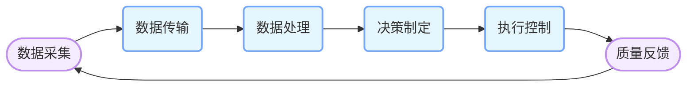

# AI Agent在智能质量控制中的应用

> 关键词：AI Agent、智能质量控制、自动化检测、数据分析、决策优化

> 摘要：本文深入探讨了AI Agent在智能质量控制领域的应用。首先介绍了研究的背景、目的、预期读者等信息，接着阐述了AI Agent和智能质量控制的核心概念及它们之间的联系。详细讲解了相关核心算法原理，并给出Python代码示例。通过数学模型和公式进一步剖析其内在机制，结合项目实战展示代码实现和解读。分析了AI Agent在智能质量控制中的实际应用场景，推荐了学习资源、开发工具框架以及相关论文著作。最后总结了未来发展趋势与挑战，还提供了常见问题解答和扩展阅读参考资料，旨在为相关领域的研究和实践提供全面且深入的指导。

## 1. 背景介绍 
### 1.1 目的和范围
随着制造业和服务业的快速发展，质量控制成为确保产品和服务满足标准的关键环节。传统的质量控制方法往往依赖人工检查和经验判断，效率低下且容易出现漏检、误检等问题。AI Agent作为一种具有自主决策和执行能力的智能体，为智能质量控制带来了新的解决方案。本文的目的在于全面探讨AI Agent在智能质量控制中的应用，涵盖从核心概念到实际应用的各个方面，包括算法原理、数学模型、项目实战等，以帮助读者深入理解和应用这一技术。

### 1.2 预期读者
本文预期读者包括从事质量控制相关工作的工程师、研究人员，对人工智能和自动化技术感兴趣的开发者，以及相关领域的管理人员和决策者。希望通过本文的介绍，能为他们在智能质量控制方面的工作和研究提供有价值的参考。

### 1.3 文档结构概述
本文将按照以下结构展开：首先介绍相关的核心概念和它们之间的联系，通过文本示意图和Mermaid流程图进行直观展示；接着详细讲解核心算法原理，并给出Python代码实现；阐述相关的数学模型和公式，并举例说明；通过项目实战展示代码的实际应用和详细解读；分析AI Agent在智能质量控制中的实际应用场景；推荐学习资源、开发工具框架和相关论文著作；总结未来发展趋势与挑战；提供常见问题解答和扩展阅读参考资料。

### 1.4 术语表
#### 1.4.1 核心术语定义
- **AI Agent**：是一种能够感知环境、自主决策并执行相应动作的智能实体，它可以根据预设的目标和规则，在不同的环境中进行学习和适应。
- **智能质量控制**：利用人工智能技术，如机器学习、深度学习等，对产品或服务的质量进行自动化检测、分析和优化的过程。
- **自动化检测**：通过各种传感器和设备，自动对产品或服务的质量特征进行检测和评估的过程。
- **数据分析**：对收集到的质量数据进行清洗、处理、挖掘和分析，以发现潜在的质量问题和规律的过程。
- **决策优化**：根据数据分析的结果，运用优化算法和模型，制定最佳的质量控制决策和措施的过程。

#### 1.4.2 相关概念解释
- **机器学习**：是一门多领域交叉学科，涉及概率论、统计学、逼近论、凸分析、算法复杂度理论等多门学科。它专门研究计算机怎样模拟或实现人类的学习行为，以获取新的知识或技能，重新组织已有的知识结构使之不断改善自身的性能。
- **深度学习**：是机器学习的一个分支领域，它是一种基于对数据进行表征学习的方法。深度学习通过构建具有很多层的神经网络模型，自动从大量数据中学习到复杂的模式和特征。
- **传感器**：是一种检测装置，能感受到被测量的信息，并能将感受到的信息，按一定规律变换成为电信号或其他所需形式的信息输出，以满足信息的传输、处理、存储、显示、记录和控制等要求。

#### 1.4.3 缩略词列表
- **AI**：Artificial Intelligence，人工智能
- **ML**：Machine Learning，机器学习
- **DL**：Deep Learning，深度学习
- **QC**：Quality Control，质量控制

## 2. 核心概念与联系 
### 核心概念原理
#### AI Agent
AI Agent的核心原理基于感知、决策和行动的循环过程。它通过传感器感知环境中的信息，将这些信息输入到决策模块。决策模块根据预设的目标和规则，运用各种算法和模型进行分析和推理，做出决策。最后，执行模块根据决策结果采取相应的行动，对环境产生影响。这个循环过程不断重复，使AI Agent能够在动态的环境中不断学习和适应。

#### 智能质量控制
智能质量控制的核心原理是利用人工智能技术对质量数据进行收集、分析和处理，以实现对产品或服务质量的实时监测、预测和优化。通过建立质量模型和算法，对质量数据进行挖掘和分析，发现潜在的质量问题和规律。根据分析结果，制定相应的质量控制策略和措施，确保产品或服务的质量符合标准。

### 架构的文本示意图
AI Agent在智能质量控制中的应用架构可以描述如下：

- **数据采集层**：通过各种传感器和设备，如摄像头、激光扫描仪、压力传感器等，收集产品或服务的质量数据，包括外观特征、尺寸精度、物理性能等。
- **数据传输层**：将采集到的质量数据传输到数据处理中心，采用有线或无线通信技术，如以太网、Wi-Fi、蓝牙等。
- **数据处理层**：对传输过来的质量数据进行清洗、预处理和特征提取，运用机器学习和深度学习算法对数据进行分析和建模，挖掘潜在的质量问题和规律。
- **决策层**：根据数据处理层的分析结果，AI Agent运用决策算法和模型，制定最佳的质量控制决策和措施，如调整生产参数、进行产品筛选等。
- **执行层**：将决策层制定的质量控制决策和措施转化为实际的行动，通过执行器和控制器，如机器人、自动化生产线等，对产品或服务进行质量控制。

### Mermaid流程图


该流程图展示了AI Agent在智能质量控制中的工作流程。首先进行数据采集，然后将数据传输到处理中心进行处理，根据处理结果制定决策，执行决策并进行质量反馈，反馈信息又回到数据采集阶段，形成一个闭环的质量控制过程。

## 3. 核心算法原理 & 具体操作步骤 
### 核心算法原理
在智能质量控制中，常用的AI Agent算法包括机器学习算法和深度学习算法。以下以支持向量机（SVM）和卷积神经网络（CNN）为例进行介绍。

#### 支持向量机（SVM）
支持向量机是一种有监督的机器学习算法，用于分类和回归分析。其核心思想是在特征空间中找到一个最优的超平面，使得不同类别的样本能够被最大程度地分开。对于线性可分的数据集，SVM可以找到一个唯一的最优超平面；对于线性不可分的数据集，SVM通过引入核函数将数据映射到高维空间，使其在高维空间中线性可分。

#### 卷积神经网络（CNN）
卷积神经网络是一种专门用于处理具有网格结构数据的深度学习模型，如图像、音频等。它通过卷积层、池化层和全连接层等组件，自动从数据中提取特征。卷积层通过卷积核在输入数据上滑动进行卷积操作，提取局部特征；池化层对卷积层的输出进行下采样，减少数据的维度；全连接层将池化层的输出进行扁平化处理，然后通过全连接的方式进行分类或回归。

### 具体操作步骤
#### 数据准备
首先需要收集和整理质量数据，将其分为训练集和测试集。对数据进行清洗和预处理，如去除噪声、归一化等。

#### 模型训练
使用训练集对选择的算法模型进行训练。对于SVM，需要选择合适的核函数和参数；对于CNN，需要设计合适的网络结构和训练参数。

#### 模型评估
使用测试集对训练好的模型进行评估，计算评估指标，如准确率、召回率、F1值等，以评估模型的性能。

#### 决策制定
根据模型的预测结果，AI Agent制定相应的质量控制决策，如判断产品是否合格、调整生产参数等。

### Python源代码示例
```python
import numpy as np
from sklearn import svm
from sklearn.model_selection import train_test_split
from sklearn.metrics import accuracy_score
import tensorflow as tf
from tensorflow.keras import layers, models

# 生成示例数据
X = np.random.rand(100, 10)  # 100个样本，每个样本有10个特征
y = np.random.randint(0, 2, 100)  # 二分类标签

# 划分训练集和测试集
X_train, X_test, y_train, y_test = train_test_split(X, y, test_size=0.2, random_state=42)

# 使用支持向量机进行训练和预测
clf = svm.SVC(kernel='linear')
clf.fit(X_train, y_train)
y_pred_svm = clf.predict(X_test)
accuracy_svm = accuracy_score(y_test, y_pred_svm)
print(f"SVM准确率: {accuracy_svm}")

# 生成图像数据示例
X_image = np.random.rand(100, 32, 32, 3)  # 100张32x32的彩色图像
y_image = np.random.randint(0, 10, 100)  # 10分类标签

# 划分训练集和测试集
X_train_image, X_test_image, y_train_image, y_test_image = train_test_split(X_image, y_image, test_size=0.2, random_state=42)

# 构建卷积神经网络模型
model = models.Sequential()
model.add(layers.Conv2D(32, (3, 3), activation='relu', input_shape=(32, 32, 3)))
model.add(layers.MaxPooling2D((2, 2)))
model.add(layers.Conv2D(64, (3, 3), activation='relu'))
model.add(layers.MaxPooling2D((2, 2)))
model.add(layers.Flatten())
model.add(layers.Dense(64, activation='relu'))
model.add(layers.Dense(10))

# 编译模型
model.compile(optimizer='adam',
              loss=tf.keras.losses.SparseCategoricalCrossentropy(from_logits=True),
              metrics=['accuracy'])

# 训练模型
model.fit(X_train_image, y_train_image, epochs=5, validation_data=(X_test_image, y_test_image))

# 评估模型
test_loss, test_acc = model.evaluate(X_test_image,  y_test_image, verbose=2)
print(f"CNN准确率: {test_acc}")
```

## 4. 数学模型和公式 & 详细讲解 & 举例说明 
### 支持向量机（SVM）的数学模型和公式
#### 线性可分情况
对于线性可分的二分类问题，假设训练数据集为 $\{(x_1, y_1), (x_2, y_2), \cdots, (x_n, y_n)\}$，其中 $x_i \in \mathbb{R}^d$ 是输入特征向量，$y_i \in \{-1, +1\}$ 是对应的标签。SVM的目标是找到一个超平面 $w^T x + b = 0$，使得不同类别的样本能够被最大程度地分开，同时满足：
$$y_i(w^T x_i + b) \geq 1, \quad i = 1, 2, \cdots, n$$
其中 $w \in \mathbb{R}^d$ 是超平面的法向量，$b \in \mathbb{R}$ 是偏置项。

为了找到最优的超平面，需要最大化间隔 $\frac{2}{\|w\|}$，等价于最小化 $\frac{1}{2}\|w\|^2$。因此，SVM的优化问题可以表示为：
$$\min_{w, b} \frac{1}{2}\|w\|^2$$
$$\text{s.t. } y_i(w^T x_i + b) \geq 1, \quad i = 1, 2, \cdots, n$$

#### 线性不可分情况
对于线性不可分的情况，引入松弛变量 $\xi_i \geq 0$，允许部分样本违反间隔约束。此时，SVM的优化问题变为：
$$\min_{w, b, \xi} \frac{1}{2}\|w\|^2 + C \sum_{i=1}^{n} \xi_i$$
$$\text{s.t. } y_i(w^T x_i + b) \geq 1 - \xi_i, \quad \xi_i \geq 0, \quad i = 1, 2, \cdots, n$$
其中 $C > 0$ 是惩罚参数，用于平衡间隔最大化和误差最小化。

#### 核函数
为了处理非线性可分问题，SVM引入了核函数 $K(x_i, x_j)$，将输入数据映射到高维空间。常用的核函数包括线性核、多项式核、高斯核等。通过核函数，优化问题可以表示为：
$$\min_{\alpha} \frac{1}{2} \sum_{i=1}^{n} \sum_{j=1}^{n} \alpha_i \alpha_j y_i y_j K(x_i, x_j) - \sum_{i=1}^{n} \alpha_i$$
$$\text{s.t. } \sum_{i=1}^{n} \alpha_i y_i = 0, \quad 0 \leq \alpha_i \leq C, \quad i = 1, 2, \cdots, n$$
其中 $\alpha_i$ 是拉格朗日乘子。

### 卷积神经网络（CNN）的数学模型和公式
#### 卷积层
卷积层的核心操作是卷积运算。对于输入特征图 $X \in \mathbb{R}^{H \times W \times C}$ 和卷积核 $K \in \mathbb{R}^{h \times w \times C \times N}$，其中 $H$ 和 $W$ 是输入特征图的高度和宽度，$C$ 是输入通道数，$h$ 和 $w$ 是卷积核的高度和宽度，$N$ 是输出通道数。卷积层的输出特征图 $Y \in \mathbb{R}^{H' \times W' \times N}$ 可以通过以下公式计算：
$$Y_{i, j, k} = \sum_{c=1}^{C} \sum_{m=0}^{h-1} \sum_{n=0}^{w-1} K_{m, n, c, k} \cdot X_{i+m, j+n, c} + b_k$$
其中 $i = 1, 2, \cdots, H'$，$j = 1, 2, \cdots, W'$，$k = 1, 2, \cdots, N$，$b_k$ 是偏置项。

#### 池化层
池化层的作用是对卷积层的输出进行下采样，常用的池化操作包括最大池化和平均池化。以最大池化为例，对于输入特征图 $X \in \mathbb{R}^{H \times W \times C}$ 和池化窗口大小为 $p \times p$，步长为 $s$，池化层的输出特征图 $Y \in \mathbb{R}^{H' \times W' \times C}$ 可以通过以下公式计算：
$$Y_{i, j, k} = \max_{m=0}^{p-1} \max_{n=0}^{p-1} X_{i \cdot s + m, j \cdot s + n, k}$$
其中 $i = 1, 2, \cdots, H'$，$j = 1, 2, \cdots, W'$，$k = 1, 2, \cdots, C$。

#### 全连接层
全连接层将池化层的输出进行扁平化处理，然后通过全连接的方式进行分类或回归。对于输入向量 $x \in \mathbb{R}^{d_1}$ 和权重矩阵 $W \in \mathbb{R}^{d_2 \times d_1}$，偏置向量 $b \in \mathbb{R}^{d_2}$，全连接层的输出向量 $y \in \mathbb{R}^{d_2}$ 可以通过以下公式计算：
$$y = Wx + b$$

### 举例说明
#### SVM举例
假设有一个二维数据集，包含两个类别的样本，我们可以使用SVM来找到一个最优的超平面将这两个类别分开。以下是一个简单的Python代码示例：
```python
import numpy as np
import matplotlib.pyplot as plt
from sklearn import svm

# 生成示例数据
X = np.array([[3, 4], [1, 4], [2, 3], [6, -1], [7, -1], [5, -3]])
y = np.array([1, 1, 1, -1, -1, -1])

# 创建SVM分类器
clf = svm.SVC(kernel='linear')
clf.fit(X, y)

# 绘制样本点
plt.scatter(X[:, 0], X[:, 1], c=y, cmap=plt.cm.Paired)

# 绘制决策边界
ax = plt.gca()
xlim = ax.get_xlim()
ylim = ax.get_ylim()

# 创建网格点
xx = np.linspace(xlim[0], xlim[1], 30)
yy = np.linspace(ylim[0], ylim[1], 30)
YY, XX = np.meshgrid(yy, xx)
xy = np.vstack([XX.ravel(), YY.ravel()]).T
Z = clf.decision_function(xy).reshape(XX.shape)

# 绘制决策边界和间隔边界
ax.contour(XX, YY, Z, colors='k', levels=[-1, 0, 1], alpha=0.5, linestyles=['--', '-', '--'])

# 绘制支持向量
ax.scatter(clf.support_vectors_[:, 0], clf.support_vectors_[:, 1], s=100, linewidth=1, facecolors='none', edgecolors='k')

plt.show()
```

#### CNN举例
假设我们要对MNIST手写数字数据集进行分类，使用CNN模型。以下是一个简单的Python代码示例：
```python
import tensorflow as tf
from tensorflow.keras import layers, models
from tensorflow.keras.datasets import mnist
from tensorflow.keras.utils import to_categorical

# 加载MNIST数据集
(train_images, train_labels), (test_images, test_labels) = mnist.load_data()

# 数据预处理
train_images = train_images.reshape((60000, 28, 28, 1)).astype('float32') / 255
test_images = test_images.reshape((10000, 28, 28, 1)).astype('float32') / 255

train_labels = to_categorical(train_labels)
test_labels = to_categorical(test_labels)

# 构建CNN模型
model = models.Sequential()
model.add(layers.Conv2D(32, (3, 3), activation='relu', input_shape=(28, 28, 1)))
model.add(layers.MaxPooling2D((2, 2)))
model.add(layers.Conv2D(64, (3, 3), activation='relu'))
model.add(layers.MaxPooling2D((2, 2)))
model.add(layers.Flatten())
model.add(layers.Dense(64, activation='relu'))
model.add(layers.Dense(10, activation='softmax'))

# 编译模型
model.compile(optimizer='adam',
              loss='categorical_crossentropy',
              metrics=['accuracy'])

# 训练模型
model.fit(train_images, train_labels, epochs=5, batch_size=64)

# 评估模型
test_loss, test_acc = model.evaluate(test_images, test_labels)
print(f"测试准确率: {test_acc}")
```

## 5. 项目实战：代码实际案例和详细解释说明 
### 5.1  开发环境搭建
#### 操作系统
推荐使用Linux系统，如Ubuntu 18.04或更高版本，也可以使用Windows 10或macOS。

#### Python环境
安装Python 3.7或更高版本，可以使用Anaconda来管理Python环境。以下是创建和激活虚拟环境的步骤：
```bash
# 创建虚拟环境
conda create -n ai_quality_control python=3.8

# 激活虚拟环境
conda activate ai_quality_control
```

#### 安装必要的库
在激活的虚拟环境中，安装以下必要的库：
```bash
pip install numpy pandas scikit-learn tensorflow matplotlib
```

### 5.2  源代码详细实现和代码解读
#### 项目背景
假设我们要对一批电子元件的质量进行检测，通过采集元件的多个特征数据，判断元件是否合格。

#### 数据准备
首先，我们需要准备数据集。假设数据集存储在一个CSV文件中，包含多个特征列和一个标签列（0表示不合格，1表示合格）。以下是读取和处理数据的代码：
```python
import pandas as pd
from sklearn.model_selection import train_test_split
from sklearn.preprocessing import StandardScaler

# 读取数据
data = pd.read_csv('quality_data.csv')

# 分离特征和标签
X = data.drop('label', axis=1)
y = data['label']

# 数据标准化
scaler = StandardScaler()
X_scaled = scaler.fit_transform(X)

# 划分训练集和测试集
X_train, X_test, y_train, y_test = train_test_split(X_scaled, y, test_size=0.2, random_state=42)
```

#### 模型训练
使用支持向量机（SVM）进行模型训练：
```python
from sklearn import svm

# 创建SVM分类器
clf = svm.SVC(kernel='rbf')

# 训练模型
clf.fit(X_train, y_train)
```

#### 模型评估
对训练好的模型进行评估：
```python
from sklearn.metrics import accuracy_score, precision_score, recall_score, f1_score

# 预测
y_pred = clf.predict(X_test)

# 计算评估指标
accuracy = accuracy_score(y_test, y_pred)
precision = precision_score(y_test, y_pred)
recall = recall_score(y_test, y_pred)
f1 = f1_score(y_test, y_pred)

print(f"准确率: {accuracy}")
print(f"精确率: {precision}")
print(f"召回率: {recall}")
print(f"F1值: {f1}")
```

### 5.3  代码解读与分析
#### 数据准备部分
- `pd.read_csv('quality_data.csv')`：使用`pandas`库读取CSV文件中的数据。
- `data.drop('label', axis=1)`：将标签列从数据集中分离出来，得到特征数据。
- `StandardScaler()`：使用`sklearn`库的`StandardScaler`对特征数据进行标准化处理，使数据具有零均值和单位方差，有助于提高模型的训练效果。
- `train_test_split(X_scaled, y, test_size=0.2, random_state=42)`：将数据集划分为训练集和测试集，测试集占比为20%。

#### 模型训练部分
- `svm.SVC(kernel='rbf')`：创建一个SVM分类器，使用径向基函数（RBF）作为核函数。
- `clf.fit(X_train, y_train)`：使用训练集对SVM分类器进行训练。

#### 模型评估部分
- `clf.predict(X_test)`：使用训练好的模型对测试集进行预测。
- `accuracy_score(y_test, y_pred)`：计算预测结果的准确率。
- `precision_score(y_test, y_pred)`：计算预测结果的精确率。
- `recall_score(y_test, y_pred)`：计算预测结果的召回率。
- `f1_score(y_test, y_pred)`：计算预测结果的F1值，综合考虑了精确率和召回率。

## 6. 实际应用场景 
### 制造业
在制造业中，AI Agent可以应用于产品质量检测、生产过程监控等方面。例如，在汽车制造中，通过安装在生产线上的摄像头和传感器，AI Agent可以实时检测汽车零部件的外观缺陷、尺寸精度等质量指标。一旦发现问题，AI Agent可以立即发出警报，并采取相应的措施，如调整生产参数、进行产品筛选等，以确保产品质量。

### 食品行业
在食品行业中，AI Agent可以用于食品质量检测和安全监控。例如，通过高光谱成像技术和AI Agent，能够快速检测食品中的农药残留、微生物污染等问题。同时，AI Agent可以对食品的生产、加工、储存和运输过程进行实时监控，确保食品符合安全标准。

### 医疗行业
在医疗行业中，AI Agent可以辅助医生进行疾病诊断和治疗决策。例如，通过分析医学影像数据（如X光、CT、MRI等）和患者的临床信息，AI Agent可以帮助医生快速准确地诊断疾病，并提供个性化的治疗方案。此外，AI Agent还可以对医疗设备的运行状态进行实时监控，及时发现故障并进行维修，确保医疗设备的正常运行。

### 服务业
在服务业中，AI Agent可以用于服务质量评估和客户满意度监测。例如，在酒店行业中，通过分析客户的评价数据和服务记录，AI Agent可以评估酒店的服务质量，并发现潜在的问题和改进机会。同时，AI Agent可以根据客户的需求和偏好，提供个性化的服务推荐，提高客户满意度。

## 7. 工具和资源推荐
### 7.1 学习资源推荐
#### 7.1.1 书籍推荐
- 《机器学习》（周志华）：全面介绍了机器学习的基本概念、算法和应用，是机器学习领域的经典教材。
- 《深度学习》（Ian Goodfellow、Yoshua Bengio、Aaron Courville）：深入讲解了深度学习的理论和实践，适合有一定机器学习基础的读者。
- 《Python机器学习实战》（Sebastian Raschka）：通过实际案例介绍了如何使用Python进行机器学习开发，适合初学者。

#### 7.1.2 在线课程
- Coursera上的“机器学习”课程（Andrew Ng教授）：由机器学习领域的知名专家授课，系统介绍了机器学习的基本算法和应用。
- edX上的“深度学习微硕士项目”：提供了深度学习的全面学习路径，包括多个课程和实践项目。
- 吴恩达老师在慕课网上的“AI时代的实践指南”：介绍了人工智能在不同领域的应用和实践经验。

#### 7.1.3 技术博客和网站
- Medium：有许多人工智能和机器学习领域的优秀博客文章，涵盖了最新的研究成果和实践经验。
- Towards Data Science：专注于数据科学和机器学习领域，提供了丰富的技术文章和案例分析。
- Kaggle：是一个数据科学竞赛平台，上面有许多开源的代码和数据集，可以学习到其他开发者的优秀经验。

### 7.2 开发工具框架推荐
#### 7.2.1 IDE和编辑器
- PyCharm：是一款专门为Python开发设计的集成开发环境，具有强大的代码编辑、调试和自动补全功能。
- Jupyter Notebook：是一个交互式的开发环境，适合进行数据探索、模型实验和文档编写。
- Visual Studio Code：是一款轻量级的代码编辑器，支持多种编程语言和插件扩展，适合快速开发和调试。

#### 7.2.2 调试和性能分析工具
- TensorBoard：是TensorFlow提供的可视化工具，可以用于监控模型的训练过程、可视化模型结构和分析性能指标。
- Py-Spy：是一个Python性能分析工具，可以实时监控Python程序的CPU使用情况和函数调用栈。
- cProfile：是Python标准库中的性能分析模块，可以对Python程序进行详细的性能分析。

#### 7.2.3 相关框架和库
- TensorFlow：是一个开源的机器学习框架，提供了丰富的工具和库，用于构建和训练各种深度学习模型。
- PyTorch：是另一个流行的深度学习框架，具有动态图和易于使用的特点，适合研究和开发。
- Scikit-learn：是一个简单易用的机器学习库，提供了各种机器学习算法和工具，适合快速开发和实验。

### 7.3 相关论文著作推荐
#### 7.3.1 经典论文
- “Support-Vector Networks”（Cortes和Vapnik）：介绍了支持向量机的基本原理和算法，是支持向量机领域的经典论文。
- “Gradient-Based Learning Applied to Document Recognition”（LeCun等人）：提出了卷积神经网络（CNN）的基本结构和训练算法，为深度学习在图像识别领域的应用奠定了基础。
- “Attention Is All You Need”（Vaswani等人）：提出了Transformer模型，是自然语言处理领域的重要突破。

#### 7.3.2 最新研究成果
- 在arXiv上可以找到许多关于AI Agent和智能质量控制的最新研究论文，涵盖了新的算法、模型和应用。
- 顶级学术会议如NeurIPS、ICML、CVPR等也会发表该领域的最新研究成果。

#### 7.3.3 应用案例分析
- 可以参考一些行业报告和案例分析，了解AI Agent在不同领域的实际应用情况和效果。例如，麦肯锡、Gartner等咨询公司的报告。

## 8. 总结：未来发展趋势与挑战
### 未来发展趋势
#### 智能化程度不断提高
随着人工智能技术的不断发展，AI Agent在智能质量控制中的智能化程度将不断提高。它将能够更加准确地感知环境、分析数据和做出决策，实现更加自动化和智能化的质量控制。

#### 与物联网深度融合
物联网技术的发展为智能质量控制提供了更多的数据来源。未来，AI Agent将与物联网深度融合，通过连接各种传感器和设备，实时收集和分析质量数据，实现对产品和服务质量的全方位监控和管理。

#### 跨领域应用不断拓展
AI Agent在智能质量控制中的应用将不再局限于传统的制造业和服务业，而是将不断拓展到更多的领域，如农业、能源、交通等。通过跨领域的应用，将为不同行业的质量控制带来新的解决方案和机遇。

### 挑战
#### 数据质量和安全问题
智能质量控制依赖于大量的质量数据，数据的质量和安全直接影响到AI Agent的性能和决策的准确性。因此，如何保证数据的质量和安全，防止数据泄露和篡改，是一个亟待解决的问题。

#### 算法复杂度和可解释性
随着AI Agent算法的不断复杂，模型的可解释性变得越来越重要。在智能质量控制中，用户需要了解模型是如何做出决策的，以便对决策结果进行评估和调整。因此，如何提高算法的可解释性，是一个需要解决的挑战。

#### 人才短缺问题
AI Agent和智能质量控制是一个交叉学科领域，需要具备人工智能、机器学习、质量控制等多方面知识和技能的人才。目前，该领域的人才短缺问题比较严重，如何培养和吸引更多的专业人才，是推动该领域发展的关键。

## 9. 附录：常见问题与解答
### 问题1：AI Agent在智能质量控制中的应用是否需要大量的标注数据？
解答：在某些情况下，如使用有监督学习算法时，需要一定数量的标注数据来训练模型。但也可以采用无监督学习和半监督学习算法，这些算法对标注数据的需求相对较少。此外，还可以通过数据增强、迁移学习等方法来减少对标注数据的依赖。

### 问题2：AI Agent在智能质量控制中的应用是否会完全取代人工？
解答：目前来看，AI Agent在智能质量控制中的应用主要是辅助人工进行质量控制，而不是完全取代人工。虽然AI Agent可以快速准确地处理大量数据和进行决策，但在一些复杂的情况下，如对质量问题的判断和处理，还需要人工的经验和专业知识。因此，未来的发展趋势是人机协作，充分发挥AI Agent和人工的优势。

### 问题3：如何评估AI Agent在智能质量控制中的性能？
解答：可以使用多种评估指标来评估AI Agent在智能质量控制中的性能，如准确率、精确率、召回率、F1值等。此外，还可以考虑模型的稳定性、泛化能力、响应时间等因素。在实际应用中，需要根据具体的业务需求和场景选择合适的评估指标。

### 问题4：AI Agent在智能质量控制中的应用是否存在隐私和安全风险？
解答：存在一定的隐私和安全风险。因为AI Agent需要收集和处理大量的质量数据，其中可能包含用户的敏感信息。为了降低风险，需要采取一系列的安全措施，如数据加密、访问控制、匿名化处理等。同时，还需要遵守相关的法律法规和隐私政策。

## 10. 扩展阅读 & 参考资料
### 扩展阅读
- 《人工智能：现代方法》（Stuart Russell、Peter Norvig）：全面介绍了人工智能的基本概念、算法和应用，是人工智能领域的经典教材。
- 《智能系统中的概率推理：似然网络》（Judea Pearl）：介绍了概率图模型的基本原理和算法，对于理解AI Agent的决策过程有很大帮助。
- 《工业4.0：即将来袭的第四次工业革命》（乌尔里希·森德勒）：探讨了工业4.0时代的技术发展和应用，包括智能质量控制等方面。

### 参考资料
- 相关的学术论文和研究报告，如IEEE Transactions on Industrial Informatics、ACM Transactions on Intelligent Systems and Technology等期刊上的文章。
- 各大科技公司的官方文档和技术博客，如Google AI、Microsoft Research等。
- 行业标准和规范，如ISO 9001质量管理体系标准等。

作者：AI天才研究院/AI Genius Institute & 禅与计算机程序设计艺术 /Zen And The Art of Computer Programming