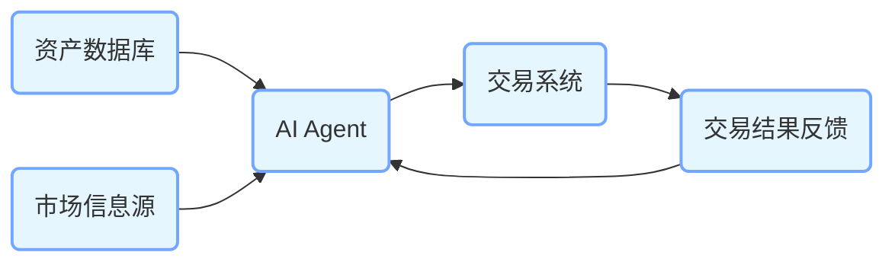

# AI Agent在智能资产管理中的实践

> 关键词：AI Agent、智能资产管理、自动化决策、资产优化、风险管理

> 摘要：本文深入探讨了AI Agent在智能资产管理中的实践应用。首先介绍了相关背景，包括目的范围、预期读者等内容。接着阐述了AI Agent和智能资产管理的核心概念及联系，通过文本示意图和Mermaid流程图进行清晰展示。详细讲解了核心算法原理，并用Python源代码进行说明，同时给出数学模型和公式。在项目实战部分，展示了开发环境搭建、源代码实现及解读。还分析了实际应用场景，推荐了学习、开发工具等资源，最后总结了未来发展趋势与挑战，解答常见问题并提供参考资料，旨在为AI Agent在智能资产管理领域的应用提供全面且深入的技术指导。

## 1. 背景介绍 
### 1.1 目的和范围
在当今数字化时代，资产管理面临着数据量大、变化快速、决策复杂等诸多挑战。传统的资产管理方式往往难以应对这些挑战，效率低下且容易出现人为失误。AI Agent作为一种具有自主学习和决策能力的智能体，为智能资产管理提供了新的解决方案。本文的目的在于深入探讨AI Agent在智能资产管理中的应用原理、方法和实践案例，为相关从业者和研究者提供全面的技术参考。范围涵盖了AI Agent的基本概念、核心算法、数学模型，以及在不同资产领域（如金融资产、实物资产等）的实际应用。

### 1.2 预期读者
本文预期读者包括但不限于金融领域的资产管理人员、科技公司的人工智能开发者、高校相关专业的学生和研究人员、对智能资产管理和AI Agent技术感兴趣的技术爱好者等。对于资产管理人员，可从中了解如何利用AI Agent提升资产管理效率和决策准确性；对于开发者，可获取AI Agent在资产管理领域的技术实现细节和应用场景；对于学生和研究人员，能为其学术研究和实践提供理论和案例支持；对于技术爱好者，可增进对这一前沿技术的理解。

### 1.3 文档结构概述
本文将按照以下结构展开：首先介绍背景知识，包括目的范围、预期读者等；接着阐述AI Agent和智能资产管理的核心概念及联系，通过文本示意图和Mermaid流程图直观展示；然后详细讲解核心算法原理，并用Python源代码进行说明，同时给出数学模型和公式；在项目实战部分，展示开发环境搭建、源代码实现及解读；之后分析实际应用场景；再推荐学习、开发工具等资源；最后总结未来发展趋势与挑战，解答常见问题并提供参考资料。

### 1.4 术语表
#### 1.4.1 核心术语定义
- **AI Agent（人工智能智能体）**：是一种能够感知环境、自主学习并根据所学知识做出决策和行动的软件实体。它可以通过与环境的交互不断优化自身的行为，以实现特定的目标。
- **智能资产管理**：利用先进的信息技术和智能化手段，对资产进行全面、动态、高效的管理，包括资产的识别、评估、配置、监控和优化等过程，以实现资产价值的最大化。
- **自动化决策**：指系统依据预设的规则、算法和数据，自动做出决策的过程，减少人为干预，提高决策效率和准确性。
- **资产优化**：通过对资产的配置、调整和管理，使资产组合达到最优状态，以实现收益最大化、风险最小化等目标。
- **风险管理**：识别、评估和应对资产面临的各种风险，采取相应的措施降低风险对资产价值的影响。

#### 1.4.2 相关概念解释
- **机器学习**：是AI Agent实现自主学习的重要技术手段，通过对大量数据的学习和分析，构建模型并进行预测和决策。常见的机器学习算法包括决策树、神经网络、支持向量机等。
- **深度学习**：是机器学习的一个分支，基于深度神经网络，能够自动从大量数据中提取复杂的特征和模式，在图像识别、自然语言处理等领域取得了显著的成果。
- **强化学习**：智能体通过与环境进行交互，根据环境反馈的奖励信号来学习最优的行为策略，以最大化长期累积奖励。

#### 1.4.3 缩略词列表
- **AI**：Artificial Intelligence（人工智能）
- **ML**：Machine Learning（机器学习）
- **DL**：Deep Learning（深度学习）
- **RL**：Reinforcement Learning（强化学习）

## 2. 核心概念与联系 
### 核心概念原理
#### AI Agent原理
AI Agent由感知模块、决策模块和执行模块组成。感知模块负责收集环境信息，如资产价格、市场动态等；决策模块根据感知到的信息和预设的目标，运用机器学习、深度学习等算法进行分析和推理，做出决策；执行模块将决策转化为具体的行动，如买卖资产、调整资产配置等。AI Agent通过不断与环境交互，学习环境的规律和模式，优化自身的决策策略，以实现更好的性能。

#### 智能资产管理原理
智能资产管理的核心是通过信息化手段实现资产的全生命周期管理。它包括资产的初始登记、评估、配置、监控和处置等环节。在每个环节中，利用数据分析和模型预测技术，对资产的价值、风险等进行评估和决策，以实现资产的优化配置和价值最大化。例如，在资产配置环节，根据投资者的风险偏好、投资目标等因素，运用现代投资组合理论等方法，选择最优的资产组合。

### 架构的文本示意图
AI Agent在智能资产管理中的架构可以描述为：AI Agent作为核心，与资产数据库、市场信息源、交易系统等进行交互。资产数据库存储了资产的基本信息、历史数据等；市场信息源提供实时的市场动态，如价格波动、宏观经济数据等；交易系统负责执行AI Agent的决策，进行资产的买卖操作。AI Agent通过对资产数据库和市场信息源的数据进行分析和处理，生成决策指令，发送给交易系统执行，同时根据交易结果和新的市场信息更新自身的模型和策略。

### Mermaid流程图

该流程图展示了AI Agent在智能资产管理中的工作流程。AI Agent从资产数据库和市场信息源获取数据，经过分析和决策后向交易系统发送指令，交易系统执行操作并将结果反馈给AI Agent，AI Agent根据反馈信息进行调整和优化。

## 3. 核心算法原理 & 具体操作步骤 
### 核心算法原理
#### 机器学习算法（以决策树为例）
决策树是一种基于树结构进行决策的机器学习算法。它通过对数据的特征进行分析和划分，构建一棵决策树，每个内部节点表示一个特征上的测试，每个分支表示一个测试输出，每个叶节点表示一个类别或值。在智能资产管理中，决策树可以用于资产分类、风险评估等任务。例如，根据资产的收益率、波动率等特征，构建决策树模型，将资产分为高风险、中风险和低风险三类。

#### 深度学习算法（以神经网络为例）
神经网络是一种模仿人类神经系统的计算模型，由大量的神经元组成。它通过对输入数据的多层非线性变换，学习数据的复杂特征和模式。在智能资产管理中，神经网络可以用于资产价格预测、市场趋势分析等任务。例如，使用循环神经网络（RNN）或长短期记忆网络（LSTM）对时间序列数据进行建模，预测资产价格的走势。

#### 强化学习算法（以Q - learning为例）
Q - learning是一种无模型的强化学习算法，通过学习一个动作价值函数Q(s, a)来确定在状态s下采取动作a的价值。智能体在每个时间步根据当前状态选择动作，执行动作后得到环境的奖励和新的状态，然后更新Q值。在智能资产管理中，Q - learning可以用于资产配置决策，智能体根据市场状态选择最优的资产配置策略，以最大化长期累积收益。

### 具体操作步骤及Python源代码
#### 决策树算法实现
```python
import pandas as pd
from sklearn.tree import DecisionTreeClassifier
from sklearn.model_selection import train_test_split
from sklearn.metrics import accuracy_score

# 加载数据
data = pd.read_csv('asset_data.csv')
X = data.drop('risk_level', axis=1)
y = data['risk_level']

# 划分训练集和测试集
X_train, X_test, y_train, y_test = train_test_split(X, y, test_size=0.2, random_state=42)

# 创建决策树模型
dt_model = DecisionTreeClassifier()

# 训练模型
dt_model.fit(X_train, y_train)

# 预测
y_pred = dt_model.predict(X_test)

# 评估模型
accuracy = accuracy_score(y_test, y_pred)
print(f"决策树模型的准确率: {accuracy}")
```
#### 神经网络算法实现
```python
import pandas as pd
import numpy as np
from tensorflow.keras.models import Sequential
from tensorflow.keras.layers import Dense, LSTM
from sklearn.preprocessing import MinMaxScaler

# 加载数据
data = pd.read_csv('asset_price_data.csv')
prices = data['price'].values.reshape(-1, 1)

# 数据归一化
scaler = MinMaxScaler()
prices_scaled = scaler.fit_transform(prices)

# 准备训练数据
sequence_length = 10
X = []
y = []
for i in range(len(prices_scaled) - sequence_length):
    X.append(prices_scaled[i:i+sequence_length])
    y.append(prices_scaled[i+sequence_length])
X = np.array(X)
y = np.array(y)

# 划分训练集和测试集
train_size = int(len(X) * 0.8)
X_train, X_test = X[:train_size], X[train_size:]
y_train, y_test = y[:train_size], y[train_size:]

# 创建LSTM模型
model = Sequential()
model.add(LSTM(50, input_shape=(sequence_length, 1)))
model.add(Dense(1))
model.compile(optimizer='adam', loss='mse')

# 训练模型
model.fit(X_train, y_train, epochs=50, batch_size=32)

# 预测
y_pred = model.predict(X_test)
y_pred = scaler.inverse_transform(y_pred)
y_test = scaler.inverse_transform(y_test)

# 打印预测结果
print("预测的资产价格:", y_pred.flatten())
```
#### Q - learning算法实现
```python
import numpy as np

# 定义环境参数
num_states = 10
num_actions = 3
gamma = 0.9
alpha = 0.1
epsilon = 0.1

# 初始化Q表
Q = np.zeros((num_states, num_actions))

# 定义奖励函数
def get_reward(state, action):
    # 这里简单定义一个奖励函数，实际应用中需要根据具体情况定义
    if state == 5 and action == 1:
        return 10
    else:
        return -1

# Q - learning算法
for episode in range(1000):
    state = np.random.randint(0, num_states)
    done = False
    while not done:
        if np.random.uniform(0, 1) < epsilon:
            action = np.random.randint(0, num_actions)
        else:
            action = np.argmax(Q[state, :])
        reward = get_reward(state, action)
        next_state = np.random.randint(0, num_states)
        Q[state, action] = Q[state, action] + alpha * (reward + gamma * np.max(Q[next_state, :]) - Q[state, action])
        state = next_state
        if state == 9:
            done = True

# 打印最终的Q表
print("最终的Q表:", Q)
```

## 4. 数学模型和公式 & 详细讲解 & 举例说明 
### 决策树数学模型
决策树的构建基于信息增益、信息增益比、基尼指数等指标。以信息增益为例，信息增益是指在划分数据集前后信息熵的变化。

信息熵的计算公式为：
$$H(D)=-\sum_{k = 1}^{K}p_{k}\log_{2}p_{k}$$
其中，$D$ 表示数据集，$K$ 表示类别数，$p_{k}$ 表示第 $k$ 类样本在数据集中所占的比例。

信息增益的计算公式为：
$$g(D, A)=H(D)-H(D|A)$$
其中，$A$ 表示特征，$H(D|A)$ 表示在特征 $A$ 给定的条件下数据集 $D$ 的条件熵，计算公式为：
$$H(D|A)=\sum_{i = 1}^{n}\frac{|D_{i}|}{|D|}H(D_{i})$$
其中，$n$ 表示特征 $A$ 的取值个数，$D_{i}$ 表示特征 $A$ 取值为第 $i$ 个值的样本子集。

举例说明：假设有一个数据集 $D$ 包含 10 个样本，分为 2 类，其中一类有 6 个样本，另一类有 4 个样本。则信息熵为：
$$H(D)=-\frac{6}{10}\log_{2}\frac{6}{10}-\frac{4}{10}\log_{2}\frac{4}{10}\approx 0.971$$
假设特征 $A$ 有 2 个取值，取值为 $A_{1}$ 的样本有 4 个，其中一类有 3 个，另一类有 1 个；取值为 $A_{2}$ 的样本有 6 个，其中一类有 3 个，另一类有 3 个。则条件熵为：
$$H(D|A)=\frac{4}{10}(-\frac{3}{4}\log_{2}\frac{3}{4}-\frac{1}{4}\log_{2}\frac{1}{4})+\frac{6}{10}(-\frac{3}{6}\log_{2}\frac{3}{6}-\frac{3}{6}\log_{2}\frac{3}{6})\approx 0.811$$
信息增益为：
$$g(D, A)=0.971 - 0.811 = 0.16$$

### 神经网络数学模型
神经网络的核心是神经元的加权求和和非线性激活函数。一个简单的神经元模型可以表示为：
$$y = f(\sum_{i = 1}^{n}w_{i}x_{i}+b)$$
其中，$x_{i}$ 表示输入信号，$w_{i}$ 表示对应的权重，$b$ 表示偏置，$f$ 表示激活函数。常见的激活函数有 sigmoid 函数、ReLU 函数等。

sigmoid 函数的计算公式为：
$$\sigma(x)=\frac{1}{1 + e^{-x}}$$
ReLU 函数的计算公式为：
$$ReLU(x)=\max(0, x)$$

在神经网络的训练过程中，通常使用反向传播算法来更新权重和偏置。反向传播算法基于梯度下降法，通过计算损失函数对权重和偏置的梯度，来更新它们的值，以最小化损失函数。

损失函数常用的有均方误差（MSE），计算公式为：
$$MSE=\frac{1}{n}\sum_{i = 1}^{n}(y_{i}-\hat{y}_{i})^{2}$$
其中，$y_{i}$ 表示真实值，$\hat{y}_{i}$ 表示预测值。

举例说明：假设有一个简单的神经网络，输入层有 2 个神经元，隐藏层有 3 个神经元，输出层有 1 个神经元。输入信号为 $x = [1, 2]$，权重矩阵 $W_{1}$ 为：
$$W_{1}=\begin{bmatrix}0.1 & 0.2 & 0.3\\0.4 & 0.5 & 0.6\end{bmatrix}$$
偏置向量 $b_{1}$ 为：
$$b_{1}=\begin{bmatrix}0.1\\0.2\\0.3\end{bmatrix}$$
则隐藏层的输入为：
$$z_{1}=W_{1}^{T}x + b_{1}=\begin{bmatrix}0.1\times1 + 0.4\times2 + 0.1\\0.2\times1 + 0.5\times2 + 0.2\\0.3\times1 + 0.6\times2 + 0.3\end{bmatrix}=\begin{bmatrix}1\\1.4\\1.8\end{bmatrix}$$
假设使用 sigmoid 激活函数，则隐藏层的输出为：
$$a_{1}=\sigma(z_{1})=\begin{bmatrix}\frac{1}{1 + e^{-1}}\\\frac{1}{1 + e^{-1.4}}\\\frac{1}{1 + e^{-1.8}}\end{bmatrix}\approx\begin{bmatrix}0.731\\0.802\\0.858\end{bmatrix}$$

### Q - learning数学模型
Q - learning的核心是更新Q值，Q值的更新公式为：
$$Q(s, a)=Q(s, a)+\alpha(r+\gamma\max_{a'}Q(s', a')-Q(s, a))$$
其中，$s$ 表示当前状态，$a$ 表示当前动作，$r$ 表示执行动作 $a$ 后得到的奖励，$s'$ 表示下一个状态，$\alpha$ 表示学习率，$\gamma$ 表示折扣因子。

举例说明：假设当前状态 $s = 1$，动作 $a = 0$，Q值 $Q(1, 0)=0.5$