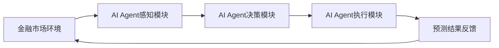

# AI Agent在智能金融市场预测中的应用

> 关键词：AI Agent、智能金融、市场预测、机器学习、强化学习

> 摘要：本文深入探讨了AI Agent在智能金融市场预测中的应用。首先介绍了相关背景，包括目的、预期读者、文档结构和术语表。接着阐述了AI Agent及智能金融市场预测的核心概念与联系，给出了原理和架构的示意图与流程图。详细讲解了核心算法原理及操作步骤，结合Python代码进行说明。还介绍了相关数学模型和公式，并举例说明。通过项目实战展示了代码的实际案例和详细解释。分析了AI Agent在智能金融市场预测中的实际应用场景，推荐了学习资源、开发工具框架和相关论文著作。最后总结了未来发展趋势与挑战，提供了常见问题解答和扩展阅读参考资料，旨在为读者全面呈现AI Agent在智能金融市场预测领域的应用全貌。

## 1. 背景介绍 
### 1.1 目的和范围
随着金融市场的日益复杂和全球化，准确的市场预测对于投资者、金融机构和监管者都变得至关重要。传统的金融市场预测方法往往依赖于历史数据和经验模型，难以应对市场的动态变化和不确定性。AI Agent作为一种具有自主学习和决策能力的智能体，为金融市场预测提供了新的思路和方法。

本文的目的是探讨AI Agent在智能金融市场预测中的应用，分析其原理、算法和实际应用场景。具体范围包括AI Agent的核心概念、相关算法原理、数学模型、项目实战案例以及未来发展趋势等方面。

### 1.2 预期读者
本文的预期读者包括金融行业从业者，如投资经理、交易员、分析师等，他们希望了解如何利用AI Agent提升金融市场预测的准确性和效率；计算机科学和人工智能领域的研究人员和开发者，对将AI技术应用于金融领域感兴趣；以及对金融市场和人工智能交叉领域有学习需求的学生和爱好者。

### 1.3 文档结构概述
本文共分为十个部分。第一部分为背景介绍，阐述了文章的目的、预期读者、文档结构和术语表；第二部分介绍核心概念与联系，包括AI Agent和智能金融市场预测的原理和架构；第三部分讲解核心算法原理及具体操作步骤，并给出Python代码示例；第四部分介绍数学模型和公式，并举例说明；第五部分通过项目实战展示代码的实际应用和详细解释；第六部分分析AI Agent在智能金融市场预测中的实际应用场景；第七部分推荐相关的学习资源、开发工具框架和论文著作；第八部分总结未来发展趋势与挑战；第九部分为附录，提供常见问题与解答；第十部分列出扩展阅读和参考资料。

### 1.4 术语表
#### 1.4.1 核心术语定义
- **AI Agent（人工智能智能体）**：是一种能够感知环境、自主学习和做出决策的智能实体，它可以根据环境的变化调整自己的行为以实现特定的目标。
- **智能金融**：是指将人工智能技术应用于金融领域，实现金融服务的自动化、智能化和个性化。
- **金融市场预测**：是指通过对历史数据和市场信息的分析，预测金融资产价格、市场趋势等未来变化情况。

#### 1.4.2 相关概念解释
- **机器学习**：是一门多领域交叉学科，涉及概率论、统计学、逼近论、凸分析、算法复杂度理论等多门学科。它专门研究计算机怎样模拟或实现人类的学习行为，以获取新的知识或技能，重新组织已有的知识结构使之不断改善自身的性能。
- **强化学习**：是机器学习中的一个领域，强调智能体如何在环境中采取一系列行动，以最大化累积奖励。智能体通过与环境进行交互，根据环境反馈的奖励信号来学习最优的行为策略。

#### 1.4.3 缩略词列表
- **ML（Machine Learning）**：机器学习
- **RL（Reinforcement Learning）**：强化学习
- **ANN（Artificial Neural Network）**：人工神经网络
- **LSTM（Long Short - Term Memory）**：长短期记忆网络

## 2. 核心概念与联系 
### 核心概念原理
#### AI Agent原理
AI Agent可以看作是一个黑盒，它接收来自环境的输入信息，经过内部的学习和决策过程，产生相应的输出动作。其核心在于具备学习能力，能够根据环境的反馈不断调整自己的行为策略。AI Agent通常由感知模块、决策模块和执行模块组成。感知模块负责收集环境信息，决策模块根据感知到的信息进行分析和决策，执行模块将决策结果转化为实际的动作。

#### 智能金融市场预测原理
智能金融市场预测基于历史数据和实时市场信息，运用各种数据分析和机器学习算法，挖掘数据中的潜在规律和模式，从而对金融市场的未来走势进行预测。预测的指标可以包括股票价格、汇率、利率等。其核心在于选择合适的算法和模型，以及对数据的有效处理和分析。

### 架构的文本示意图
```plaintext
           +----------------+
           | 金融市场环境  |
           +----------------+
                   |
                   v
           +----------------+
           |  AI Agent感知模块  |
           +----------------+
                   |
                   v
           +----------------+
           |  AI Agent决策模块  |
           +----------------+
                   |
                   v
           +----------------+
           |  AI Agent执行模块  |
           +----------------+
                   |
                   v
           +----------------+
           |  预测结果反馈  |
           +----------------+
```

### Mermaid流程图


## 3. 核心算法原理 & 具体操作步骤 
### 核心算法原理
#### 机器学习算法 - 人工神经网络（ANN）
人工神经网络是一种模仿人类神经系统的计算模型，由大量的神经元组成。每个神经元接收输入信号，经过加权求和和非线性激活函数处理后，输出一个结果。多个神经元按照层次结构排列，形成输入层、隐藏层和输出层。通过不断调整神经元之间的连接权重，神经网络可以学习到输入数据和输出结果之间的映射关系。

以下是一个简单的全连接神经网络的Python代码示例：
```python
import numpy as np

# 定义激活函数 - sigmoid
def sigmoid(x):
    return 1 / (1 + np.exp(-x))

# 定义神经网络类
class NeuralNetwork:
    def __init__(self, input_size, hidden_size, output_size):
        # 初始化权重
        self.weights_input_hidden = np.random.rand(input_size, hidden_size)
        self.weights_hidden_output = np.random.rand(hidden_size, output_size)

    def forward(self, X):
        # 前向传播
        self.hidden_input = np.dot(X, self.weights_input_hidden)
        self.hidden_output = sigmoid(self.hidden_input)
        self.final_input = np.dot(self.hidden_output, self.weights_hidden_output)
        self.final_output = sigmoid(self.final_input)
        return self.final_output

# 示例使用
input_size = 3
hidden_size = 4
output_size = 1
nn = NeuralNetwork(input_size, hidden_size, output_size)
X = np.array([[0.1, 0.2, 0.3]])
output = nn.forward(X)
print("神经网络输出:", output)
```

#### 强化学习算法 - Q - learning
Q - learning是一种无模型的强化学习算法，用于学习最优的行为策略。它通过一个Q表来记录在每个状态下采取每个动作的预期奖励。智能体在环境中不断探索，根据Q表选择动作，并根据环境反馈的奖励更新Q表。

以下是一个简单的Q - learning算法的Python代码示例：
```python
import numpy as np

# 定义环境
env = {
    'states': [0, 1, 2, 3],
    'actions': [0, 1],
    'rewards': {
        (0, 0): -1,
        (0, 1): 0,
        (1, 0): 1,
        (1, 1): -1,
        (2, 0): -1,
        (2, 1): 1,
        (3, 0): 0,
        (3, 1): -1
    }
}

# 初始化Q表
Q = np.zeros((len(env['states']), len(env['actions'])))

# 超参数
alpha = 0.1  # 学习率
gamma = 0.9  # 折扣因子
epsilon = 0.1  # 探索率
num_episodes = 100

# Q - learning算法
for episode in range(num_episodes):
    state = np.random.choice(env['states'])
    done = False
    while not done:
        if np.random.uniform(0, 1) < epsilon:
            action = np.random.choice(env['actions'])
        else:
            action = np.argmax(Q[state, :])
        next_state = np.random.choice(env['states'])
        reward = env['rewards'][(state, action)]
        Q[state, action] = Q[state, action] + alpha * (reward + gamma * np.max(Q[next_state, :]) - Q[state, action])
        state = next_state
        if state == 3:
            done = True

print("最终Q表:", Q)
```

### 具体操作步骤
1. **数据收集**：收集金融市场的历史数据，包括股票价格、交易量、宏观经济指标等。
2. **数据预处理**：对收集到的数据进行清洗、归一化、特征提取等处理，以提高数据的质量和可用性。
3. **模型选择**：根据预测的目标和数据特点，选择合适的AI算法和模型，如神经网络、强化学习等。
4. **模型训练**：使用预处理后的数据对模型进行训练，调整模型的参数，以提高模型的预测准确性。
5. **模型评估**：使用测试数据对训练好的模型进行评估，计算模型的评估指标，如均方误差、准确率等。
6. **预测应用**：将训练好的模型应用于实际的金融市场预测中，根据预测结果做出决策。

## 4. 数学模型和公式 & 详细讲解 & 举例说明 
### 人工神经网络的数学模型
#### 神经元的数学模型
神经元的输入输出关系可以用以下公式表示：
$$
y = f\left(\sum_{i = 1}^{n}w_{i}x_{i}+b\right)
$$
其中，$x_{i}$ 是输入信号，$w_{i}$ 是连接权重，$b$ 是偏置项，$f$ 是激活函数。

#### 前向传播公式
对于一个多层神经网络，第 $l$ 层的输出 $a^{l}$ 可以通过以下公式计算：
$$
z^{l}=W^{l}a^{l - 1}+b^{l}
$$
$$
a^{l}=f(z^{l})
$$
其中，$W^{l}$ 是第 $l$ 层的权重矩阵，$b^{l}$ 是第 $l$ 层的偏置向量，$f$ 是激活函数。

#### 举例说明
假设有一个简单的两层神经网络，输入层有2个神经元，隐藏层有3个神经元，输出层有1个神经元。输入向量 $x = [x_{1}, x_{2}]$，隐藏层的权重矩阵 $W^{1}=\begin{bmatrix}w_{11}^{1}&w_{12}^{1}\\w_{21}^{1}&w_{22}^{1}\\w_{31}^{1}&w_{32}^{1}\end{bmatrix}$，偏置向量 $b^{1}=[b_{1}^{1}, b_{2}^{1}, b_{3}^{1}]$，输出层的权重矩阵 $W^{2}=[w_{11}^{2}, w_{12}^{2}, w_{13}^{2}]$，偏置向量 $b^{2}=[b_{1}^{2}]$。

首先计算隐藏层的输入 $z^{1}$：
$$
z^{1}=W^{1}x + b^{1}=\begin{bmatrix}w_{11}^{1}x_{1}+w_{12}^{1}x_{2}+b_{1}^{1}\\w_{21}^{1}x_{1}+w_{22}^{1}x_{2}+b_{2}^{1}\\w_{31}^{1}x_{1}+w_{32}^{1}x_{2}+b_{3}^{1}\end{bmatrix}
$$
然后计算隐藏层的输出 $a^{1}$：
$$
a^{1}=f(z^{1})=\begin{bmatrix}f(w_{11}^{1}x_{1}+w_{12}^{1}x_{2}+b_{1}^{1})\\f(w_{21}^{1}x_{1}+w_{22}^{1}x_{2}+b_{2}^{1})\\f(w_{31}^{1}x_{1}+w_{32}^{1}x_{2}+b_{3}^{1})\end{bmatrix}
$$
最后计算输出层的输入 $z^{2}$ 和输出 $a^{2}$：
$$
z^{2}=W^{2}a^{1}+b^{2}=w_{11}^{2}f(w_{11}^{1}x_{1}+w_{12}^{1}x_{2}+b_{1}^{1})+w_{12}^{2}f(w_{21}^{1}x_{1}+w_{22}^{1}x_{2}+b_{2}^{1})+w_{13}^{2}f(w_{31}^{1}x_{1}+w_{32}^{1}x_{2}+b_{3}^{1})+b_{1}^{2}
$$
$$
a^{2}=f(z^{2})
$$

### Q - learning的数学模型
#### Q值更新公式
Q - learning的核心是Q值的更新，其更新公式为：
$$
Q(s_{t}, a_{t})=Q(s_{t}, a_{t})+\alpha\left[r_{t}+\gamma\max_{a}Q(s_{t + 1}, a)-Q(s_{t}, a_{t})\right]
$$
其中，$s_{t}$ 是当前状态，$a_{t}$ 是当前动作，$r_{t}$ 是即时奖励，$s_{t + 1}$ 是下一个状态，$\alpha$ 是学习率，$\gamma$ 是折扣因子。

#### 举例说明
假设智能体处于状态 $s_{t}=0$，选择动作 $a_{t}=1$，得到即时奖励 $r_{t}=0$，转移到下一个状态 $s_{t + 1}=2$。当前 $Q(0, 1)=0.1$，$\max_{a}Q(2, a)=0.3$，学习率 $\alpha = 0.1$，折扣因子 $\gamma = 0.9$。

根据Q值更新公式：
$$
Q(0, 1)=0.1+0.1\times(0 + 0.9\times0.3 - 0.1)=0.1+0.1\times(0.27 - 0.1)=0.1+0.1\times0.17 = 0.117
$$

## 5. 项目实战：代码实际案例和详细解释说明 
### 5.1  开发环境搭建
#### 安装Python
首先需要安装Python，建议使用Python 3.7及以上版本。可以从Python官方网站（https://www.python.org/downloads/）下载安装包进行安装。

#### 安装必要的库
使用pip命令安装以下必要的库：
```bash
pip install numpy pandas matplotlib scikit - learn tensorflow
```
- **numpy**：用于数值计算。
- **pandas**：用于数据处理和分析。
- **matplotlib**：用于数据可视化。
- **scikit - learn**：提供了各种机器学习算法和工具。
- **tensorflow**：用于构建和训练深度学习模型。

### 5.2  源代码详细实现和代码解读
#### 数据收集和预处理
以下是一个简单的数据收集和预处理的代码示例：
```python
import pandas as pd
from sklearn.preprocessing import MinMaxScaler

# 读取数据
data = pd.read_csv('stock_prices.csv')

# 提取需要的特征
features = data[['Open', 'High', 'Low', 'Close', 'Volume']]

# 数据归一化
scaler = MinMaxScaler()
scaled_features = scaler.fit_transform(features)

# 划分训练集和测试集
train_size = int(len(scaled_features) * 0.8)
train_data = scaled_features[:train_size]
test_data = scaled_features[train_size:]

print("训练集大小:", len(train_data))
print("测试集大小:", len(test_data))
```
代码解读：
- 首先使用 `pandas` 库读取CSV格式的股票价格数据。
- 提取需要的特征，如开盘价、最高价、最低价、收盘价和交易量。
- 使用 `MinMaxScaler` 对数据进行归一化处理，将数据缩放到0到1的范围内。
- 按照80%和20%的比例划分训练集和测试集。

#### 构建和训练LSTM模型
```python
import tensorflow as tf
from tensorflow.keras.models import Sequential
from tensorflow.keras.layers import LSTM, Dense

# 准备训练数据
def create_sequences(data, seq_length):
    xs = []
    ys = []
    for i in range(len(data) - seq_length):
        x = data[i:i + seq_length]
        y = data[i + seq_length, 3]  # 预测收盘价
        xs.append(x)
        ys.append(y)
    return np.array(xs), np.array(ys)

seq_length = 10
X_train, y_train = create_sequences(train_data, seq_length)
X_test, y_test = create_sequences(test_data, seq_length)

# 构建LSTM模型
model = Sequential()
model.add(LSTM(50, return_sequences=True, input_shape=(seq_length, 5)))
model.add(LSTM(50, return_sequences=False))
model.add(Dense(25))
model.add(Dense(1))

# 编译模型
model.compile(optimizer='adam', loss='mean_squared_error')

# 训练模型
model.fit(X_train, y_train, batch_size=32, epochs=50)
```
代码解读：
- `create_sequences` 函数用于将时间序列数据转换为适合LSTM模型输入的序列数据。
- 构建一个包含两个LSTM层和两个全连接层的LSTM模型。
- 使用 `adam` 优化器和均方误差损失函数编译模型。
- 使用训练数据对模型进行训练，训练50个epoch，每个batch的大小为32。

#### 模型预测和评估
```python
# 模型预测
predictions = model.predict(X_test)

# 反归一化
dummy_array = np.zeros((len(predictions), 5))
dummy_array[:, 3] = predictions[:, 0]
predictions = scaler.inverse_transform(dummy_array)[:, 3]

dummy_array = np.zeros((len(y_test), 5))
dummy_array[:, 3] = y_test
y_test = scaler.inverse_transform(dummy_array)[:, 3]

# 计算均方误差
from sklearn.metrics import mean_squared_error
mse = mean_squared_error(y_test, predictions)
print("均方误差:", mse)

# 可视化预测结果
import matplotlib.pyplot as plt
plt.plot(y_test, label='实际价格')
plt.plot(predictions, label='预测价格')
plt.legend()
plt.show()
```
代码解读：
- 使用训练好的模型对测试数据进行预测。
- 由于预测结果是归一化后的数据，需要进行反归一化处理。
- 使用 `mean_squared_error` 函数计算预测结果和实际结果之间的均方误差。
- 使用 `matplotlib` 库可视化预测结果和实际结果。

### 5.3  代码解读与分析
#### 数据预处理的重要性
数据预处理是机器学习和深度学习中非常重要的一步。在金融市场预测中，数据往往存在噪声、缺失值和不同的尺度，通过数据清洗、归一化和特征提取等处理，可以提高数据的质量和可用性，从而提高模型的预测准确性。

#### LSTM模型的优势
LSTM模型是一种特殊的循环神经网络，它能够处理时间序列数据中的长期依赖关系。在金融市场预测中，股票价格等数据具有明显的时间序列特征，LSTM模型可以更好地捕捉这些特征，从而提高预测的准确性。

#### 模型评估指标的选择
均方误差是一种常用的回归模型评估指标，它衡量了预测值和实际值之间的平均平方误差。在金融市场预测中，还可以使用其他评估指标，如平均绝对误差、均方根误差等，根据具体的应用场景选择合适的评估指标。

## 6. 实际应用场景 
### 股票价格预测
AI Agent可以通过分析历史股票价格数据、公司财务报表、宏观经济指标等信息，预测股票价格的未来走势。投资者可以根据预测结果做出买入、卖出或持有股票的决策。例如，某AI Agent通过对某公司的财务数据和行业趋势进行分析，预测该公司股票价格将在未来一个月内上涨，投资者可以根据这一预测结果买入该股票。

### 风险评估
金融机构可以使用AI Agent对投资组合的风险进行评估。AI Agent可以考虑多种因素，如市场波动、行业风险、信用风险等，计算投资组合的风险水平，并提供相应的风险预警。例如，银行在发放贷款时，可以使用AI Agent评估借款人的信用风险，降低贷款违约的可能性。

### 交易策略优化
AI Agent可以根据市场情况和历史交易数据，优化交易策略。通过强化学习算法，AI Agent可以不断学习和调整交易策略，以最大化交易收益。例如，量化交易团队可以使用AI Agent开发自动化交易策略，根据市场实时数据自动进行交易。

### 市场趋势分析
AI Agent可以对金融市场的整体趋势进行分析，识别市场的牛市、熊市或震荡行情。这有助于投资者把握市场趋势，调整投资组合。例如，当AI Agent分析认为市场将进入熊市时，投资者可以减少股票投资，增加债券等避险资产的配置。

## 7. 工具和资源推荐
### 7.1 学习资源推荐
#### 7.1.1 书籍推荐
- 《深度学习》（Deep Learning）：由Ian Goodfellow、Yoshua Bengio和Aaron Courville所著，是深度学习领域的经典教材，涵盖了深度学习的基本原理、算法和应用。
- 《Python机器学习》（Python Machine Learning）：由Sebastian Raschka所著，介绍了如何使用Python进行机器学习，包括各种机器学习算法的实现和应用。
- 《金融时间序列分析》（Analysis of Financial Time Series）：由Ruey S. Tsay所著，详细介绍了金融时间序列的分析方法和模型，对于金融市场预测有很大的帮助。

#### 7.1.2 在线课程
- Coursera上的“深度学习专项课程”（Deep Learning Specialization）：由Andrew Ng教授授课，包括深度学习的基础、卷积神经网络、循环神经网络等内容。
- edX上的“人工智能基础”（Introduction to Artificial Intelligence）：介绍了人工智能的基本概念、算法和应用。
- Udemy上的“Python for Finance: Investment Fundamentals & Data Analytics”：讲解了如何使用Python进行金融数据分析和投资组合管理。

#### 7.1.3 技术博客和网站
- Towards Data Science：是一个专注于数据科学和机器学习的博客平台，有很多关于AI Agent和金融市场预测的文章。
- Medium：是一个综合性的博客平台，有很多技术专家分享他们的经验和见解。
- Kaggle：是一个数据科学竞赛平台，有很多金融市场预测相关的数据集和竞赛项目，可以学习到其他选手的优秀解决方案。

### 7.2 开发工具框架推荐
#### 7.2.1 IDE和编辑器
- PyCharm：是一款专门为Python开发设计的集成开发环境，具有强大的代码编辑、调试和项目管理功能。
- Jupyter Notebook：是一个交互式的开发环境，适合进行数据探索、模型训练和可视化。
- Visual Studio Code：是一款轻量级的代码编辑器，支持多种编程语言和插件，可用于Python开发。

#### 7.2.2 调试和性能分析工具
- TensorBoard：是TensorFlow提供的可视化工具，可以用于监控模型的训练过程、查看模型的结构和性能指标。
- Py-Spy：是一个用于Python程序性能分析的工具，可以分析程序的CPU使用情况和函数调用时间。
- Memory Profiler：是一个用于Python内存分析的工具，可以分析程序的内存使用情况。

#### 7.2.3 相关框架和库
- TensorFlow：是一个开源的深度学习框架，提供了丰富的工具和函数，用于构建和训练各种深度学习模型。
- PyTorch：是另一个流行的深度学习框架，具有动态图的优势，易于使用和调试。
- Scikit-learn：是一个用于机器学习的Python库，提供了各种机器学习算法和工具，如分类、回归、聚类等。

### 7.3 相关论文著作推荐
#### 7.3.1 经典论文
- “Long Short-Term Memory”：由Sepp Hochreiter和Jürgen Schmidhuber发表，介绍了LSTM模型的基本原理和结构。
- “Q-Learning”：由Christopher J. C. H. Watkins和Peter Dayan发表，是Q - learning算法的经典论文。
- “A Neural Algorithm of Artistic Style”：由Leon A. Gatys、Alexander S. Ecker和Matthias Bethge发表，介绍了使用神经网络进行艺术风格迁移的方法。

#### 7.3.2 最新研究成果
- 在arXiv.org上可以搜索到很多关于AI Agent和金融市场预测的最新研究论文，这些论文涵盖了最新的算法、模型和应用案例。
- 金融领域的顶级学术期刊，如Journal of Financial Economics、Review of Financial Studies等，也会发表相关的研究成果。

#### 7.3.3 应用案例分析
- 一些金融机构和科技公司会发布他们在AI Agent应用于金融市场预测方面的案例分析报告，可以通过他们的官方网站或行业媒体获取这些报告。
- 一些数据科学竞赛平台，如Kaggle，会有很多关于金融市场预测的竞赛项目，获胜者的解决方案可以作为很好的应用案例进行学习。

## 8. 总结：未来发展趋势与挑战
### 未来发展趋势
#### 多模态数据融合
未来的AI Agent将不仅仅依赖于传统的金融数据，还会融合更多的多模态数据，如新闻文本、社交媒体数据、图像数据等。通过多模态数据融合，可以更全面地了解金融市场的情况，提高预测的准确性。

#### 与区块链技术结合
区块链技术具有去中心化、不可篡改等特点，与AI Agent结合可以提高金融市场数据的安全性和可信度。例如，在交易结算、风险管理等方面，区块链和AI Agent的结合可以提供更高效、更安全的解决方案。

#### 强化学习的广泛应用
强化学习在金融市场预测中的应用将越来越广泛。通过强化学习，AI Agent可以在不断的交互和试错中学习最优的交易策略，适应市场的动态变化。

### 挑战
#### 数据质量和隐私问题
金融市场数据往往存在噪声、缺失值和错误数据，数据质量的问题会影响AI Agent的预测准确性。同时，金融数据涉及到大量的个人隐私和商业机密，如何在保证数据安全和隐私的前提下，有效地利用数据是一个挑战。

#### 模型可解释性
深度学习模型等复杂的AI模型往往是黑盒模型，其决策过程难以解释。在金融领域，模型的可解释性非常重要，监管机构和投资者需要了解模型的决策依据。因此，如何提高模型的可解释性是一个亟待解决的问题。

#### 市场不确定性
金融市场具有高度的不确定性，受到多种因素的影响，如政治事件、自然灾害、宏观经济政策等。AI Agent很难完全准确地预测市场的未来走势，如何应对市场的不确定性是一个挑战。

## 9. 附录：常见问题与解答
### 问题1：AI Agent在金融市场预测中的准确性如何？
AI Agent的预测准确性受到多种因素的影响，如数据质量、模型选择、算法参数等。在实际应用中，很难达到100%的准确性，但通过合理的数据处理和模型优化，可以提高预测的准确性。同时，不同的预测任务和市场环境下，准确性也会有所不同。

### 问题2：如何选择适合的AI算法和模型？
选择适合的AI算法和模型需要考虑多个因素，如预测的目标、数据的特点、计算资源等。对于时间序列数据，可以选择LSTM、GRU等循环神经网络模型；对于分类问题，可以选择决策树、支持向量机等模型。在实际应用中，通常需要进行多次实验和比较，选择性能最优的模型。

### 问题3：AI Agent在金融市场预测中是否会取代人类分析师？
AI Agent在金融市场预测中具有很多优势，如处理大量数据的能力、快速决策的能力等，但它并不能完全取代人类分析师。人类分析师具有丰富的经验、直觉和判断力，能够考虑到一些复杂的因素和非量化的信息。在实际应用中，AI Agent和人类分析师可以相互补充，共同提高金融市场预测的准确性和效率。

### 问题4：如何评估AI Agent在金融市场预测中的性能？
可以使用多种评估指标来评估AI Agent在金融市场预测中的性能，如均方误差、平均绝对误差、准确率、召回率等。对于回归问题，常用均方误差和平均绝对误差；对于分类问题，常用准确率和召回率。同时，还可以通过实际的交易收益等指标来评估AI Agent的性能。

## 10. 扩展阅读 & 参考资料
### 扩展阅读
- 《人工智能：现代方法》（Artificial Intelligence: A Modern Approach）：全面介绍了人工智能的各个领域，包括搜索算法、知识表示、机器学习、自然语言处理等。
- 《金融科技：重构未来金融生态》：探讨了金融科技的发展趋势和应用，包括AI Agent在金融领域的应用。
- 《算法金融：人工智能如何改变金融决策》：介绍了人工智能在金融决策中的应用，以及如何利用算法进行风险管理和投资决策。

### 参考资料
- 相关的学术论文和研究报告，如IEEE Transactions on Neural Networks and Learning Systems、ACM Transactions on Intelligent Systems and Technology等期刊上的论文。
- 金融机构和科技公司的官方网站和报告，如摩根大通、谷歌、微软等公司发布的关于AI Agent在金融领域应用的报告。
- 开源代码库，如GitHub上的相关项目，可以学习到其他开发者的实现和经验。

作者：AI天才研究院/AI Genius Institute & 禅与计算机程序设计艺术 /Zen And The Art of Computer Programming